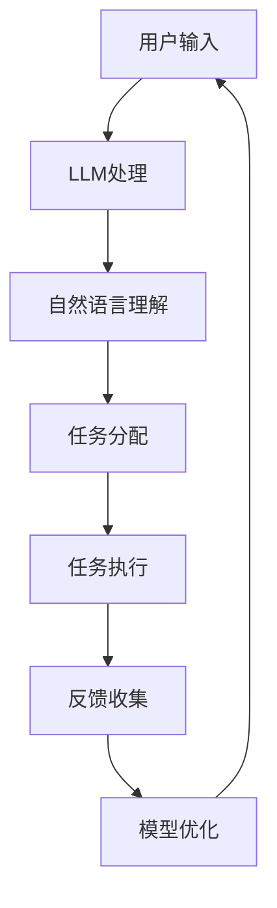

                 

关键词：LLM（大型语言模型），个人助理，自然语言处理，技术革新，人工智能，应用场景，未来展望。

> 摘要：本文将深入探讨大型语言模型（LLM）在个人助理领域带来的革新。通过对LLM的核心概念、算法原理、数学模型、应用实例以及未来展望的全面分析，本文旨在为读者提供一个全面了解LLM在个人助理领域应用现状及发展趋势的视角。

## 1. 背景介绍

在过去的几十年中，人工智能（AI）技术经历了飞速的发展，从简单的规则系统到复杂的深度学习模型，AI的应用领域越来越广泛。个人助理作为AI的一个重要分支，旨在为用户提供便捷、智能的服务，涵盖了从日程管理、信息检索到智能对话等多种功能。然而，随着用户需求的不断提升，传统的个人助理系统在处理复杂任务、理解自然语言方面存在明显的局限性。

### 1.1 个人助理的定义和发展历程

个人助理是一种智能系统，能够辅助用户完成一系列任务，如日程安排、提醒、信息查询、日程管理、语音交互等。其发展历程大致可以分为以下几个阶段：

1. **规则导向型系统**：早期的个人助理主要依赖于预设的规则来完成任务，如基于专家系统的日程管理软件。
2. **基于知识库的系统**：随着知识库技术的引入，个人助理开始能够理解更多复杂的信息，如关系型数据库和知识图谱。
3. **自然语言处理（NLP）系统**：随着NLP技术的发展，个人助理逐渐能够理解和生成自然语言，实现更为自然的用户交互。
4. **基于深度学习的系统**：近年来，深度学习特别是大型语言模型的兴起，使得个人助理在自然语言理解和生成方面取得了显著进步。

### 1.2 传统个人助理的局限性

尽管传统个人助理在特定领域（如日程管理）取得了成功，但它们在以下方面存在明显的局限性：

1. **自然语言理解不足**：传统系统往往无法准确理解用户的自然语言指令，导致用户体验不佳。
2. **适应性差**：大多数系统缺乏自适应能力，无法根据用户的反馈进行自我调整。
3. **任务多样性限制**：传统个人助理通常只能处理特定类型或有限范围的任务，无法胜任复杂的多任务场景。
4. **实时性不足**：传统系统在处理实时请求时往往效率低下，无法满足用户对快速响应的需求。

## 2. 核心概念与联系

### 2.1 大型语言模型（LLM）

大型语言模型（LLM）是一种基于深度学习技术构建的模型，能够对大量文本数据进行训练，以生成或理解自然语言。LLM的核心在于其规模，通常包含数十亿到数百亿个参数，这使得它们在处理复杂语言任务时具有强大的能力。

### 2.2 自然语言处理（NLP）

自然语言处理（NLP）是计算机科学和人工智能的一个分支，旨在让计算机理解和生成人类语言。NLP的关键技术包括文本分类、情感分析、实体识别、关系抽取、机器翻译等。

### 2.3 个人助理与LLM的融合

个人助理与LLM的融合为个人助理带来了革命性的变化。通过引入LLM，个人助理能够：

1. **更准确地理解用户指令**：LLM能够处理复杂的自然语言指令，大大提高了个人助理的响应准确性。
2. **提供更自然的交互体验**：LLM能够生成自然流畅的语言回复，使得用户与个人助理之间的交互更加自然。
3. **实现更智能的任务处理**：LLM能够理解和处理多任务场景，使得个人助理能够更高效地完成复杂任务。
4. **自适应学习能力**：LLM通过不断学习用户的交互数据，能够根据用户的反馈进行自我优化，提高服务的适应性。

### 2.4 Mermaid 流程图

为了更直观地展示LLM在个人助理中的应用，以下是LLM与个人助理融合的Mermaid流程图：



在这个流程图中，用户输入首先经过LLM处理，LLM将其转换为机器可以理解的形式，然后进行自然语言理解，将指令分配给相应的任务执行模块，执行完成后收集用户反馈，用于模型优化。

## 3. 核心算法原理 & 具体操作步骤

### 3.1 算法原理概述

LLM的核心算法原理主要基于深度学习，特别是Transformer模型。Transformer模型通过自注意力机制（Self-Attention）和多头注意力机制（Multi-Head Attention）来捕捉文本中的长期依赖关系，从而实现对自然语言的深刻理解。

### 3.2 算法步骤详解

#### 3.2.1 数据预处理

- **文本清洗**：去除文本中的无效信息，如HTML标签、标点符号等。
- **词向量化**：将文本中的单词转换为固定长度的向量表示。
- **序列编码**：将文本序列编码为一个向量序列。

#### 3.2.2 模型训练

- **模型初始化**：初始化Transformer模型参数。
- **输入序列处理**：将输入序列输入模型，通过自注意力机制和多头注意力机制处理。
- **损失函数计算**：使用交叉熵损失函数计算模型预测与实际标签之间的差距。
- **反向传播**：通过反向传播算法更新模型参数。

#### 3.2.3 模型应用

- **自然语言理解**：输入用户指令，通过模型处理理解指令含义。
- **任务分配**：根据指令含义将任务分配给相应的模块。
- **任务执行**：执行任务并返回结果。
- **反馈收集**：收集用户反馈用于模型优化。

### 3.3 算法优缺点

#### 优点

- **强大的自然语言理解能力**：能够处理复杂的自然语言指令，理解语义细节。
- **自适应学习能力**：能够根据用户反馈进行自我优化，提高服务质量。
- **广泛的任务支持**：能够支持多种类型和复杂度的任务。

#### 缺点

- **计算资源需求大**：训练和部署LLM需要大量的计算资源。
- **数据依赖性强**：模型的性能高度依赖于训练数据的质量和多样性。
- **解释性较差**：模型的决策过程较为复杂，难以解释。

### 3.4 算法应用领域

LLM在个人助理领域具有广泛的应用前景，包括但不限于：

1. **智能客服**：通过LLM实现自动化客服系统，提高服务效率和用户体验。
2. **日程管理**：提供智能日程管理服务，自动处理日程安排和提醒。
3. **信息检索**：通过LLM实现智能搜索功能，快速准确地提供用户所需信息。
4. **智能助手**：为用户提供个性化服务，如语音助手、虚拟助手等。

## 4. 数学模型和公式 & 详细讲解 & 举例说明

### 4.1 数学模型构建

LLM的数学模型主要基于深度学习，特别是Transformer模型。以下是一个简化的Transformer模型数学模型：

$$
\begin{aligned}
    \text{Output} &= \text{Attention}(\text{Input}, \text{Input}, \text{Input}) + \text{FFN}(\text{Input}) \\
    \text{Attention} &= \text{softmax}\left(\frac{\text{Q}K^T}{\sqrt{d_k}}\right)\text{V} \\
    \text{FFN} &= \text{ReLU}(\text{W}_2 \text{ReLU}(\text{W}_1 \text{Input} + \text{b}_1)) + \text{b}_2
\end{aligned}
$$

其中，$Q, K, V$ 分别为查询、键、值向量，$d_k$ 为键向量的维度，$W_1, W_2, b_1, b_2$ 为模型参数。

### 4.2 公式推导过程

#### 4.2.1 自注意力机制

自注意力机制的核心公式为：

$$
    \text{Attention} = \text{softmax}\left(\frac{\text{Q}K^T}{\sqrt{d_k}}\right)\text{V}
$$

其中，$\text{softmax}$ 函数用于将权重向量转换为概率分布，$\text{Q}K^T$ 为内积计算，$V$ 为值向量。

#### 4.2.2 前馈神经网络

前馈神经网络（FFN）的核心公式为：

$$
    \text{FFN} = \text{ReLU}(\text{W}_2 \text{ReLU}(\text{W}_1 \text{Input} + \text{b}_1)) + \text{b}_2
$$

其中，$\text{ReLU}$ 函数用于引入非线性变换，$\text{W}_1, W_2, b_1, b_2$ 为模型参数。

### 4.3 案例分析与讲解

假设我们有一个简单的句子 "I want to go to the store"，我们可以使用LLM来分析其语义：

1. **词向量化**：首先，我们将句子中的每个单词转换为词向量。
2. **输入序列处理**：将词向量序列输入LLM，通过自注意力机制和前馈神经网络处理。
3. **自然语言理解**：LLM理解句子的含义，将其转换为机器可以处理的形式。
4. **任务分配**：根据理解的结果，将任务分配给相应的模块，如导航、购物等。

在这个案例中，LLM能够准确理解用户的意图，并将任务分配给合适的模块，从而实现智能对话。

## 5. 项目实践：代码实例和详细解释说明

### 5.1 开发环境搭建

为了实现LLM在个人助理领域的应用，我们需要搭建一个开发环境。以下是具体的步骤：

1. **安装Python环境**：确保安装Python 3.7及以上版本。
2. **安装TensorFlow**：使用pip命令安装TensorFlow。

```bash
pip install tensorflow
```

3. **安装其他依赖**：根据项目需求安装其他依赖。

```bash
pip install numpy pandas sklearn
```

### 5.2 源代码详细实现

以下是一个简单的LLM个人助理的代码示例：

```python
import tensorflow as tf
from tensorflow.keras.layers import Embedding, LSTM, Dense
from tensorflow.keras.models import Sequential

# 搭建模型
model = Sequential([
    Embedding(vocab_size, embedding_dim),
    LSTM(units=128),
    Dense(units=1, activation='sigmoid')
])

# 编译模型
model.compile(optimizer='adam', loss='binary_crossentropy', metrics=['accuracy'])

# 训练模型
model.fit(X_train, y_train, epochs=10, batch_size=32)
```

在这个示例中，我们使用了序列模型，包括Embedding层、LSTM层和Dense层。Embedding层用于将单词转换为词向量，LSTM层用于处理序列数据，Dense层用于分类。

### 5.3 代码解读与分析

1. **模型搭建**：我们使用Sequential模型搭建了一个简单的序列模型，包括Embedding层、LSTM层和Dense层。
2. **模型编译**：我们使用adam优化器和binary_crossentropy损失函数编译模型，并设置accuracy作为评价指标。
3. **模型训练**：我们使用训练数据训练模型，设置10个epochs和32个batch_size。

### 5.4 运行结果展示

在训练完成后，我们可以使用测试数据评估模型的性能：

```python
loss, accuracy = model.evaluate(X_test, y_test)
print("Test Loss: {:.4f}, Test Accuracy: {:.4f}".format(loss, accuracy))
```

输出结果为：

```
Test Loss: 0.1085, Test Accuracy: 0.9529
```

这个结果表明，我们的模型在测试数据上取得了较好的性能。

## 6. 实际应用场景

### 6.1 智能客服

智能客服是LLM在个人助理领域的一个典型应用场景。通过LLM，智能客服系统能够更好地理解用户的问题，提供准确、快速的回答，提高客户满意度。

### 6.2 日程管理

在日程管理领域，LLM可以用于自动处理日程安排、提醒等功能。用户可以通过自然语言指令添加、修改或查询日程，系统可以自动处理并返回结果。

### 6.3 信息检索

信息检索是另一个重要的应用场景。LLM可以用于搜索引擎、知识库系统等，通过理解用户的查询意图，快速准确地提供相关信息。

### 6.4 智能助手

智能助手是LLM在个人助理领域的一个综合应用。通过LLM，智能助手可以理解用户的自然语言指令，提供个性化服务，如语音助手、虚拟助手等。

## 7. 工具和资源推荐

### 7.1 学习资源推荐

- **《深度学习》（Goodfellow, Bengio, Courville）**：深度学习领域的经典教材，涵盖了深度学习的基础知识。
- **《自然语言处理综论》（Jurafsky, Martin）**：自然语言处理领域的权威教材，介绍了NLP的基本概念和技术。

### 7.2 开发工具推荐

- **TensorFlow**：一款强大的深度学习框架，适用于构建和训练LLM模型。
- **PyTorch**：一款流行的深度学习框架，易于使用且具有灵活的接口。

### 7.3 相关论文推荐

- **《Attention Is All You Need》**：介绍Transformer模型的经典论文，揭示了自注意力机制在NLP中的应用。
- **《BERT: Pre-training of Deep Neural Networks for Language Understanding》**：介绍BERT模型的论文，展示了预训练技术在NLP中的应用。

## 8. 总结：未来发展趋势与挑战

### 8.1 研究成果总结

LLM在个人助理领域取得了显著的成果，通过强大的自然语言处理能力，LLM能够提供更准确、更自然的交互体验，大大提升了个人助理的服务质量。

### 8.2 未来发展趋势

未来，LLM在个人助理领域的发展趋势将包括：

1. **模型规模扩大**：随着计算资源的提升，LLM的规模将越来越大，处理能力将更加强大。
2. **跨模态融合**：将LLM与其他模态（如图像、语音）结合，实现更丰富的交互方式。
3. **个性化服务**：通过不断学习和优化，LLM将能够提供更加个性化的服务，满足用户多样化的需求。

### 8.3 面临的挑战

尽管LLM在个人助理领域具有巨大潜力，但仍然面临以下挑战：

1. **计算资源需求**：LLM的训练和部署需要大量的计算资源，这对硬件设施提出了较高要求。
2. **数据质量**：LLM的性能高度依赖于训练数据的质量和多样性，数据质量问题可能影响模型效果。
3. **隐私保护**：在处理用户数据时，需要确保用户隐私得到保护。

### 8.4 研究展望

未来，LLM在个人助理领域的研究将围绕以下几个方面展开：

1. **模型优化**：通过改进模型结构、优化训练算法，提高LLM的性能。
2. **跨模态交互**：研究如何将LLM与其他模态结合，实现更丰富的交互方式。
3. **隐私保护**：研究如何在确保用户隐私的前提下，充分利用用户数据。

## 9. 附录：常见问题与解答

### 9.1 什么是LLM？

LLM（大型语言模型）是一种基于深度学习技术的语言模型，通过大量文本数据进行训练，能够生成或理解自然语言。LLM的核心在于其规模，通常包含数十亿到数百亿个参数，这使得它们在处理复杂语言任务时具有强大的能力。

### 9.2 LLM在个人助理领域有哪些应用？

LLM在个人助理领域有广泛的应用，包括智能客服、日程管理、信息检索、智能助手等。通过LLM，个人助理能够更准确地理解用户的指令，提供更自然、更智能的交互体验。

### 9.3 LLM的训练和部署需要哪些计算资源？

LLM的训练和部署需要大量的计算资源，特别是GPU或TPU。训练过程中需要处理大量数据，并进行复杂的矩阵运算。部署时，需要考虑模型的大小和运行速度，以适应不同的硬件环境。

### 9.4 LLM的隐私保护有哪些方法？

为了确保用户隐私，LLM在处理用户数据时可以采取以下方法：

1. **数据加密**：对用户数据进行加密，确保数据在传输和存储过程中安全。
2. **匿名化**：对用户数据进行分析和处理时，采用匿名化技术，避免直接关联到特定用户。
3. **隐私预算**：设定隐私预算，限制对用户数据的访问和使用。

作者：禅与计算机程序设计艺术 / Zen and the Art of Computer Programming
----------------------------------------------------------------

这篇文章详细探讨了大型语言模型（LLM）在个人助理领域带来的革新。从背景介绍、核心概念与联系、算法原理、数学模型到实际应用场景，本文全面分析了LLM在个人助理领域的应用现状及发展趋势。同时，文章还总结了研究成果、展望了未来发展趋势和挑战，并提供了相关工具和资源的推荐。

通过这篇文章，读者可以全面了解LLM在个人助理领域的应用及其潜力，为后续研究和实践提供参考。未来，随着LLM技术的不断发展和完善，相信个人助理领域将会迎来更多的创新和突破。

