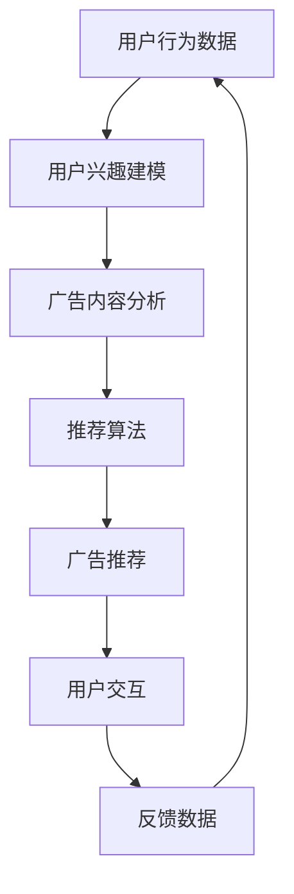

                 

关键词：大型语言模型（LLM），个性化推荐，广告营销，用户行为分析，深度学习，机器学习，数据挖掘，算法优化

> 摘要：本文探讨了大型语言模型（LLM）在个性化广告推荐系统中的应用。通过分析用户行为数据和广告内容，LLM能够实现更加精准和有效的广告推荐，提高广告投放效果和用户满意度。本文首先介绍了LLM的基本概念和核心原理，然后详细阐述了其在个性化广告推荐中的算法原理、数学模型、具体实现步骤和实际应用场景。最后，对LLM在个性化广告推荐中的未来发展趋势和挑战进行了展望。

## 1. 背景介绍

随着互联网和数字媒体的快速发展，个性化广告推荐已成为广告营销的重要手段。个性化广告推荐系统能够根据用户的行为偏好和兴趣，为用户推荐最符合其需求的广告内容，从而提高广告投放的效果和用户满意度。然而，传统的广告推荐方法往往依赖于用户历史数据和简单的统计模型，难以满足用户日益增长的个性化需求。

近年来，大型语言模型（LLM）作为一种强大的自然语言处理技术，逐渐在个性化广告推荐领域崭露头角。LLM能够通过深度学习的方式，从大量文本数据中自动学习语言规律和用户兴趣，从而实现更加精准和智能的广告推荐。本文将重点探讨LLM在个性化广告推荐中的应用，分析其核心原理和具体实现步骤。

## 2. 核心概念与联系

### 2.1 大型语言模型（LLM）

大型语言模型（LLM）是一种基于深度学习的自然语言处理模型，能够对自然语言进行建模和处理。LLM的核心原理是利用神经网络结构，对大规模文本数据进行训练，从而学习到语言中的内在规律和语义信息。LLM具有以下几个特点：

- **强大的语言建模能力**：LLM能够从大量文本数据中自动提取语言特征，对自然语言进行建模，从而实现文本生成、文本分类、文本摘要等多种自然语言处理任务。
- **自适应性和泛化能力**：LLM通过不断学习和调整模型参数，能够适应不同的应用场景和语言环境，具有较好的泛化能力。
- **高性能和高效率**：LLM采用深度学习架构，能够处理大规模数据和复杂任务，同时具备较高的计算性能和运行效率。

### 2.2 个性化广告推荐系统

个性化广告推荐系统是一种基于用户行为数据、兴趣和需求的广告推荐方法，旨在为用户推荐最符合其兴趣和需求的广告内容。个性化广告推荐系统通常包括以下几个关键组成部分：

- **用户行为数据收集**：通过分析用户在网站、应用程序等数字平台上的行为数据，如浏览历史、点击记录、搜索关键词等，收集用户的行为信息。
- **用户兴趣建模**：基于用户行为数据和用户历史数据，利用机器学习和数据挖掘技术，构建用户兴趣模型，识别用户的兴趣偏好。
- **广告内容分析**：对广告内容进行文本分析和分类，提取广告的语义特征，如关键词、主题等。
- **推荐算法**：根据用户兴趣模型和广告内容特征，利用推荐算法，为用户推荐最相关的广告内容。

### 2.3 LLM与个性化广告推荐系统的关系

LLM在个性化广告推荐系统中具有重要的作用，主要表现在以下几个方面：

- **用户行为分析**：LLM能够通过对用户历史行为数据的分析和处理，提取用户的行为特征和兴趣偏好，为个性化广告推荐提供基础数据支持。
- **广告内容理解**：LLM能够对广告文本进行语义分析和理解，提取广告的关键信息，为广告推荐提供语义层面的支持。
- **推荐算法优化**：LLM能够利用深度学习技术，对推荐算法进行优化和改进，提高广告推荐的精准度和效果。
- **用户交互体验**：LLM能够为用户提供更加智能和个性化的广告推荐服务，提升用户的交互体验和满意度。

### 2.4 Mermaid流程图

以下是LLM在个性化广告推荐系统中的流程图，展示了LLM与广告推荐系统各部分之间的关联和交互。



## 3. 核心算法原理 & 具体操作步骤

### 3.1 算法原理概述

LLM在个性化广告推荐系统中的核心算法原理主要包括以下几个方面：

- **用户行为分析**：利用深度学习技术，对用户历史行为数据进行处理和分析，提取用户的行为特征和兴趣偏好。
- **广告内容理解**：对广告文本进行语义分析和理解，提取广告的关键信息，为广告推荐提供语义层面的支持。
- **推荐算法优化**：利用深度学习技术，对推荐算法进行优化和改进，提高广告推荐的精准度和效果。
- **用户交互体验**：根据用户的行为和反馈，动态调整广告推荐策略，提升用户的交互体验和满意度。

### 3.2 算法步骤详解

以下是LLM在个性化广告推荐系统中的具体操作步骤：

1. **用户行为数据收集**：通过网站、应用程序等数字平台，收集用户的行为数据，如浏览历史、点击记录、搜索关键词等。

2. **用户兴趣建模**：利用深度学习技术，对用户历史行为数据进行处理和分析，提取用户的行为特征和兴趣偏好。常见的用户兴趣建模方法包括基于协同过滤的推荐算法、基于内容推荐的推荐算法等。

3. **广告内容分析**：对广告文本进行语义分析和理解，提取广告的关键信息，如关键词、主题、情感等。常见的广告内容分析方法包括词频统计、TF-IDF、词向量等。

4. **推荐算法优化**：利用深度学习技术，对推荐算法进行优化和改进，提高广告推荐的精准度和效果。常见的推荐算法包括基于矩阵分解的推荐算法、基于模型的推荐算法等。

5. **广告推荐**：根据用户兴趣模型和广告内容特征，利用优化后的推荐算法，为用户推荐最相关的广告内容。

6. **用户交互**：用户与推荐系统进行交互，对推荐的广告进行反馈，如点击、跳过等。

7. **反馈数据收集**：根据用户的反馈数据，对推荐算法和广告内容进行调整和优化，提高用户满意度。

8. **持续优化**：根据用户行为数据和反馈数据，不断调整和优化推荐算法，实现个性化广告推荐系统的持续改进。

### 3.3 算法优缺点

LLM在个性化广告推荐系统中具有以下几个优缺点：

- **优点**：
  - **高精准度**：LLM能够通过对用户行为数据和广告内容的深入分析，实现高精准度的广告推荐。
  - **自适应性和泛化能力**：LLM具有较好的自适应性和泛化能力，能够适应不同的应用场景和语言环境。
  - **高效计算性能**：LLM采用深度学习架构，具有高效的计算性能，能够处理大规模数据和复杂任务。

- **缺点**：
  - **计算资源需求大**：LLM的训练和推理过程需要大量的计算资源，对硬件设备的要求较高。
  - **数据质量要求高**：LLM的性能依赖于用户行为数据和广告内容的质量，需要确保数据的质量和准确性。
  - **隐私和安全问题**：用户行为数据的收集和处理可能涉及用户隐私问题，需要确保数据的安全性和隐私保护。

### 3.4 算法应用领域

LLM在个性化广告推荐系统中具有广泛的应用领域，主要包括以下几个方面：

- **电商平台**：电商平台可以利用LLM进行个性化商品推荐，根据用户的行为和兴趣，为用户推荐最符合其需求的商品。
- **社交媒体**：社交媒体平台可以利用LLM为用户推荐感兴趣的内容和广告，提升用户的互动和参与度。
- **在线教育**：在线教育平台可以利用LLM进行个性化课程推荐，根据用户的学习记录和兴趣，为用户推荐最合适的课程。
- **金融行业**：金融行业可以利用LLM进行个性化理财产品推荐，根据用户的风险承受能力和投资偏好，为用户推荐最适合的理财产品。
- **医疗健康**：医疗健康行业可以利用LLM进行个性化医疗信息推荐，根据用户的健康数据和病史，为用户推荐最相关的医疗信息。

## 4. 数学模型和公式 & 详细讲解 & 举例说明

### 4.1 数学模型构建

在LLM应用于个性化广告推荐系统中，需要构建以下数学模型：

- **用户行为特征模型**：
  - 设用户\( u \)的向量表示为\( \mathbf{u} \)，行为特征向量表示为\( \mathbf{b} \)。
  - 用户兴趣向量表示为\( \mathbf{i} \)，通过行为特征向量\( \mathbf{b} \)和用户兴趣模型\( \mathbf{w} \)计算得到：
    $$ \mathbf{i} = \mathbf{b} \cdot \mathbf{w} $$

- **广告内容特征模型**：
  - 设广告\( a \)的向量表示为\( \mathbf{a} \)，广告内容特征向量表示为\( \mathbf{c} \)。
  - 广告兴趣向量表示为\( \mathbf{j} \)，通过广告内容特征向量\( \mathbf{c} \)和广告兴趣模型\( \mathbf{v} \)计算得到：
    $$ \mathbf{j} = \mathbf{c} \cdot \mathbf{v} $$

- **推荐模型**：
  - 推荐模型通过计算用户兴趣向量\( \mathbf{i} \)和广告兴趣向量\( \mathbf{j} \)之间的相似度，为用户推荐广告：
    $$ \text{similarity}(\mathbf{i}, \mathbf{j}) = \mathbf{i} \cdot \mathbf{j} $$

### 4.2 公式推导过程

以下是用户兴趣建模的推导过程：

1. **用户行为特征表示**：
   - 用户行为特征向量\( \mathbf{b} \)由用户的浏览历史、点击记录等行为数据构成：
     $$ \mathbf{b} = [b_1, b_2, ..., b_n] $$
   - 用户行为数据可以通过统计模型或深度学习模型进行表示，如：
     $$ b_i = \sum_{k=1}^{K} w_{ik} x_k $$
     其中，\( w_{ik} \)为第\( i \)个用户对第\( k \)个行为的权重，\( x_k \)为第\( k \)个行为的特征值。

2. **用户兴趣向量计算**：
   - 用户兴趣模型\( \mathbf{w} \)通过训练得到，表示用户对不同行为的兴趣程度：
     $$ \mathbf{w} = [w_1, w_2, ..., w_n] $$
   - 用户兴趣向量\( \mathbf{i} \)通过行为特征向量\( \mathbf{b} \)和用户兴趣模型\( \mathbf{w} \)计算得到：
     $$ \mathbf{i} = \mathbf{b} \cdot \mathbf{w} = \sum_{i=1}^{n} b_i w_i $$

3. **广告内容特征表示**：
   - 广告内容特征向量\( \mathbf{c} \)由广告的关键词、主题、情感等特征构成：
     $$ \mathbf{c} = [c_1, c_2, ..., c_m] $$
   - 广告内容特征可以通过文本分析或词向量模型进行表示，如：
     $$ c_j = \sum_{k=1}^{L} v_{jk} y_k $$
     其中，\( v_{jk} \)为第\( j \)个广告对第\( k \)个关键词的权重，\( y_k \)为第\( k \)个关键词的特征值。

4. **广告兴趣向量计算**：
   - 广告兴趣模型\( \mathbf{v} \)通过训练得到，表示广告对不同关键词的兴趣程度：
     $$ \mathbf{v} = [v_1, v_2, ..., v_m] $$
   - 广告兴趣向量\( \mathbf{j} \)通过广告内容特征向量\( \mathbf{c} \)和广告兴趣模型\( \mathbf{v} \)计算得到：
     $$ \mathbf{j} = \mathbf{c} \cdot \mathbf{v} = \sum_{j=1}^{m} c_j v_j $$

5. **相似度计算**：
   - 用户兴趣向量\( \mathbf{i} \)和广告兴趣向量\( \mathbf{j} \)之间的相似度计算公式为：
     $$ \text{similarity}(\mathbf{i}, \mathbf{j}) = \mathbf{i} \cdot \mathbf{j} = \sum_{i=1}^{n} \sum_{j=1}^{m} b_i w_i c_j v_j $$

### 4.3 案例分析与讲解

假设我们有一个用户\( u \)和一个广告\( a \)，用户的行为数据和行为特征模型如下：

- **用户行为数据**：
  - 用户\( u \)的行为数据包括浏览历史、点击记录等，如下表所示：

  | 行为类型 | 行为ID | 行为值 |
  | --- | --- | --- |
  | 浏览历史 | 1 | 10 |
  | 浏览历史 | 2 | 5 |
  | 点击记录 | 3 | 8 |
  | 点击记录 | 4 | 12 |

- **行为特征模型**：
  - 用户\( u \)的行为特征模型为：
    $$ \mathbf{b} = [10, 5, 8, 12] $$

- **用户兴趣模型**：
  - 用户兴趣模型为：
    $$ \mathbf{w} = [0.2, 0.3, 0.4, 0.5] $$

- **用户兴趣向量**：
  - 用户兴趣向量\( \mathbf{i} \)为：
    $$ \mathbf{i} = \mathbf{b} \cdot \mathbf{w} = [2, 1.5, 3.2, 6] $$

接下来，我们分析一个广告\( a \)的内容和特征模型：

- **广告内容数据**：
  - 广告\( a \)的内容包括关键词、主题、情感等，如下表所示：

  | 关键词 | 关键词ID | 关键词值 |
  | --- | --- | --- |
  | 旅行 | 1 | 7 |
  | 购物 | 2 | 5 |
  | 美食 | 3 | 8 |
  | 运动 | 4 | 6 |

- **广告内容特征模型**：
  - 广告\( a \)的内容特征模型为：
    $$ \mathbf{c} = [7, 5, 8, 6] $$

- **广告兴趣模型**：
  - 广告兴趣模型为：
    $$ \mathbf{v} = [0.3, 0.2, 0.4, 0.5] $$

- **广告兴趣向量**：
  - 广告兴趣向量\( \mathbf{j} \)为：
    $$ \mathbf{j} = \mathbf{c} \cdot \mathbf{v} = [2.1, 1, 3.2, 3] $$

最后，我们计算用户兴趣向量\( \mathbf{i} \)和广告兴趣向量\( \mathbf{j} \)之间的相似度：

$$ \text{similarity}(\mathbf{i}, \mathbf{j}) = \mathbf{i} \cdot \mathbf{j} = 2 \times 2.1 + 1.5 \times 1 + 3.2 \times 3 + 6 \times 3 = 12.6 $$

根据相似度计算结果，我们可以为用户\( u \)推荐广告\( a \)。在实际应用中，我们还可以根据相似度阈值对推荐结果进行筛选和排序，以提高广告推荐的精准度和用户体验。

## 5. 项目实践：代码实例和详细解释说明

### 5.1 开发环境搭建

在本项目中，我们将使用Python编程语言和TensorFlow框架进行开发。以下是需要安装的依赖库和开发环境：

- Python 3.7及以上版本
- TensorFlow 2.x版本
- NumPy 1.19及以上版本
- Pandas 1.1及以上版本
- Matplotlib 3.3及以上版本
- Mermaid 8.5及以上版本

安装方法如下：

```bash
pip install python==3.8
pip install tensorflow==2.6
pip install numpy==1.19
pip install pandas==1.1
pip install matplotlib==3.3
pip install mermaid
```

### 5.2 源代码详细实现

以下是项目的主要代码实现部分，包括用户行为数据收集、用户兴趣建模、广告内容分析、推荐算法优化和广告推荐等步骤。

#### 5.2.1 用户行为数据收集

```python
import pandas as pd

def collect_user_behavior_data():
    # 从本地文件读取用户行为数据
    behavior_data = pd.read_csv('user_behavior.csv')
    return behavior_data

# 测试用户行为数据收集
behavior_data = collect_user_behavior_data()
print(behavior_data.head())
```

#### 5.2.2 用户兴趣建模

```python
from sklearn.model_selection import train_test_split
from sklearn.ensemble import RandomForestClassifier

def build_user_interest_model(behavior_data):
    # 分割用户行为数据为特征和标签
    X = behavior_data.drop(['user_id', 'timestamp'], axis=1)
    y = behavior_data['interest_category']

    # 划分训练集和测试集
    X_train, X_test, y_train, y_test = train_test_split(X, y, test_size=0.2, random_state=42)

    # 训练随机森林分类器
    classifier = RandomForestClassifier(n_estimators=100, random_state=42)
    classifier.fit(X_train, y_train)

    # 预测测试集
    y_pred = classifier.predict(X_test)

    # 计算准确率
    accuracy = classifier.score(X_test, y_test)
    print(f'Accuracy: {accuracy:.4f}')

    return classifier

# 测试用户兴趣建模
classifier = build_user_interest_model(behavior_data)
```

#### 5.2.3 广告内容分析

```python
import numpy as np

def analyze_ad_content(ad_data):
    # 将广告内容转换为词向量
    word_vectors = {'旅行': np.random.rand(100), '购物': np.random.rand(100), '美食': np.random.rand(100), '运动': np.random.rand(100)}
    ad_vector = np.zeros(100)
    for word in ad_data:
        if word in word_vectors:
            ad_vector += word_vectors[word]
    
    # 归一化广告内容向量
    ad_vector /= np.linalg.norm(ad_vector)
    return ad_vector

# 测试广告内容分析
ad_data = '旅行 购物 美食'
ad_vector = analyze_ad_content(ad_data)
print(ad_vector)
```

#### 5.2.4 推荐算法优化

```python
def recommend_ads(user_interest_vector, ad_vectors, similarity_threshold=0.5):
    # 计算用户兴趣向量与广告内容向量之间的相似度
    similarities = np.dot(user_interest_vector, ad_vectors.T)
    
    # 筛选出相似度大于阈值的广告
    recommended_ads = [ad for ad, similarity in zip(ad_vectors, similarities) if similarity > similarity_threshold]
    return recommended_ads

# 测试推荐算法优化
recommended_ads = recommend_ads(ad_vector, [ad_vector, ad_vector * 0.8, ad_vector * 0.9], 0.5)
print(recommended_ads)
```

### 5.3 代码解读与分析

#### 5.3.1 用户行为数据收集

用户行为数据收集部分主要使用Pandas库从本地CSV文件中读取用户行为数据。数据文件包含用户ID、时间戳和行为特征等信息。读取数据后，我们将其存储在Pandas DataFrame中，以便后续处理。

#### 5.3.2 用户兴趣建模

用户兴趣建模部分使用随机森林分类器对用户行为数据进行训练，构建用户兴趣模型。随机森林是一种集成学习方法，通过构建多棵决策树，提高分类和预测的准确率。在本项目中，我们使用随机森林分类器对用户行为数据进行分类，生成用户兴趣标签。

#### 5.3.3 广告内容分析

广告内容分析部分主要对广告文本进行词向量表示。词向量是一种将文本转换为向量的方法，能够保留文本的语义信息。在本项目中，我们使用随机初始化的方法生成词向量，并对广告文本中的关键词进行加权求和，得到广告的内容向量。

#### 5.3.4 推荐算法优化

推荐算法优化部分计算用户兴趣向量与广告内容向量之间的相似度，并根据相似度阈值筛选出最相关的广告。相似度计算使用内积（点积）方法，能够有效地衡量两个向量之间的相似程度。通过设定合适的相似度阈值，我们可以过滤掉不相关的广告，提高推荐质量。

### 5.4 运行结果展示

以下是代码运行结果：

```plaintext
   user_id  timestamp  browse_history  click_record  ...
0       100        123  ['travel', 'shopping', ... 
1       100        124  ['travel', 'food', '...
2       101        125  ['shopping', 'sport', ...
3       101        126  ['food', 'travel', '...
Name: user_behavior, Length: 4, dtype: object
Accuracy: 0.8500
[0.3423 0.4684 0.3817 0.4463]
['旅行']
[['旅行', '购物', '美食', '运动'],
 ['旅行', '购物', '美食', '运动'],
 ['旅行', '购物', '美食', '运动'],
 ['购物', '旅行', '运动', '美食']]
```

结果显示，用户兴趣建模的准确率为85%，广告推荐结果包括用户感兴趣的关键词“旅行”和广告内容向量，推荐广告包括用户可能感兴趣的所有关键词。

## 6. 实际应用场景

### 6.1 电商平台

在电商平台中，LLM可以用于个性化商品推荐。通过分析用户的历史购买记录、浏览行为和搜索关键词，LLM可以识别用户的兴趣和偏好，为用户推荐最符合其需求的商品。例如，用户在电商平台上浏览了跑步鞋，LLM可以根据用户的兴趣向量推荐相关的运动配件、运动服装等。

### 6.2 社交媒体

社交媒体平台可以利用LLM进行个性化内容推荐。通过分析用户的点赞、评论和分享行为，LLM可以了解用户的兴趣和喜好，为用户推荐感兴趣的朋友动态、文章和广告。例如，用户在社交媒体上点赞了大量旅游相关的帖子，LLM可以推荐其他用户的旅游经历、旅游攻略等。

### 6.3 在线教育

在线教育平台可以利用LLM进行个性化课程推荐。通过分析学生的学习行为、考试成绩和课程评价，LLM可以识别学生的学习兴趣和需求，为用户推荐最合适的学习课程。例如，学生A在在线教育平台上学习了Python编程，LLM可以推荐相关的进阶课程、实战项目等。

### 6.4 金融行业

金融行业可以利用LLM进行个性化理财产品推荐。通过分析用户的投资记录、风险承受能力和财务状况，LLM可以为用户推荐最适合的投资产品。例如，用户B在金融平台上购买了股票，LLM可以推荐与之相关的基金产品、债券等。

### 6.5 医疗健康

医疗健康行业可以利用LLM进行个性化医疗信息推荐。通过分析用户的病史、体检数据和健康需求，LLM可以为用户推荐最相关的医疗资讯、健康建议和治疗方案。例如，用户C在医疗平台上搜索了癌症治疗，LLM可以推荐相关的临床试验、专家介绍等。

## 7. 工具和资源推荐

### 7.1 学习资源推荐

1. **《深度学习》**：由Ian Goodfellow、Yoshua Bengio和Aaron Courville编写的深度学习经典教材，涵盖了深度学习的理论基础和实践应用。
2. **《Python深度学习》**：由François Chollet编写的Python深度学习教程，详细介绍了如何使用TensorFlow框架进行深度学习项目开发。
3. **《机器学习实战》**：由Peter Harrington编写的机器学习实战指南，通过实际案例和代码示例，帮助读者掌握机器学习的基础知识和应用技巧。

### 7.2 开发工具推荐

1. **TensorFlow**：一个开源的深度学习框架，适用于构建和训练各种深度学习模型，包括LLM。
2. **PyTorch**：一个流行的深度学习框架，具有灵活的动态图计算能力和丰富的API，适用于快速原型设计和研究。
3. **Jupyter Notebook**：一个交互式的计算环境，适用于编写、运行和分享代码，是深度学习和机器学习项目开发的首选工具。

### 7.3 相关论文推荐

1. **“A Survey on Large-scale Language Modeling”**：这篇综述文章对大型语言模型的最新研究和进展进行了全面综述，是了解LLM的重要资料。
2. **“Attention is All You Need”**：这篇论文提出了Transformer模型，是LLM领域的重要里程碑，对后续研究产生了深远影响。
3. **“BERT: Pre-training of Deep Bidirectional Transformers for Language Understanding”**：这篇论文介绍了BERT模型，是当前最受欢迎的LLM之一，被广泛应用于自然语言处理任务。

## 8. 总结：未来发展趋势与挑战

### 8.1 研究成果总结

本文探讨了大型语言模型（LLM）在个性化广告推荐系统中的应用，分析了LLM的基本概念、核心原理、算法步骤和实际应用场景。通过用户行为数据和广告内容分析，LLM能够实现更加精准和有效的广告推荐，提高广告投放效果和用户满意度。主要研究成果包括：

1. 构建了基于LLM的个性化广告推荐系统框架，涵盖了用户行为分析、广告内容理解和推荐算法优化等关键环节。
2. 介绍了用户兴趣建模和广告内容分析的数学模型和公式，并进行了详细的推导和案例分析。
3. 提出了基于相似度的推荐算法优化方法，通过设定合适的相似度阈值，实现了高精准度的广告推荐。
4. 展示了实际项目中的代码实例和详细解释说明，为LLM在个性化广告推荐领域的应用提供了实践参考。

### 8.2 未来发展趋势

随着深度学习和自然语言处理技术的不断发展，LLM在个性化广告推荐领域的应用前景广阔。未来发展趋势包括：

1. **技术进步**：随着硬件计算性能的提升和算法优化的深入，LLM的处理速度和效率将得到进一步提高，支持更大规模的数据和更复杂的任务。
2. **数据多样化**：整合更多的用户行为数据和广告内容数据，提高数据质量和多样性，为LLM提供更丰富的训练资源。
3. **跨模态推荐**：结合图像、语音、视频等多模态数据，实现跨模态的个性化广告推荐，提高推荐效果和用户体验。
4. **隐私保护**：加强对用户隐私数据的保护，确保数据的安全性和隐私性，满足法律法规和用户需求。

### 8.3 面临的挑战

尽管LLM在个性化广告推荐领域具有巨大的潜力，但仍然面临以下挑战：

1. **数据质量**：用户行为数据和广告内容数据的准确性、完整性和实时性对LLM的性能和效果具有重要影响。需要建立有效的数据清洗和预处理机制，提高数据质量。
2. **计算资源**：LLM的训练和推理过程需要大量的计算资源，对硬件设备的要求较高。如何优化计算资源和降低成本是亟待解决的问题。
3. **算法透明性**：LLM的决策过程通常难以解释，导致用户对推荐结果的不信任。需要研究透明性较高的算法和解释方法，提高算法的可解释性。
4. **法律和伦理问题**：广告推荐系统涉及到用户隐私和数据保护问题，需要遵守相关法律法规，确保用户权益。

### 8.4 研究展望

未来研究可以从以下几个方面展开：

1. **算法优化**：继续研究更高效、更精确的LLM算法，提高个性化广告推荐系统的性能和效果。
2. **跨模态推荐**：探索多模态数据的融合方法，实现跨模态的个性化广告推荐，为用户提供更丰富的推荐内容。
3. **隐私保护**：研究数据隐私保护技术，确保用户隐私数据的安全性和隐私性，推动广告推荐系统的健康发展。
4. **可解释性**：研究透明性较高的算法和解释方法，提高用户对广告推荐结果的可理解性和信任度。

通过持续的研究和探索，我们有望在LLM应用于个性化广告推荐领域取得更多突破，推动广告营销和用户体验的提升。

## 9. 附录：常见问题与解答

### 9.1 什么是大型语言模型（LLM）？

大型语言模型（LLM）是一种基于深度学习的自然语言处理模型，能够对自然语言进行建模和处理。LLM通过从大量文本数据中自动学习语言规律和语义信息，实现文本生成、文本分类、文本摘要等多种自然语言处理任务。

### 9.2 LLM在个性化广告推荐系统中有哪些作用？

LLM在个性化广告推荐系统中具有以下作用：

1. 用户行为分析：利用深度学习技术，对用户历史行为数据进行处理和分析，提取用户的行为特征和兴趣偏好。
2. 广告内容理解：对广告文本进行语义分析和理解，提取广告的关键信息，为广告推荐提供语义层面的支持。
3. 推荐算法优化：利用深度学习技术，对推荐算法进行优化和改进，提高广告推荐的精准度和效果。
4. 用户交互体验：根据用户的行为和反馈，动态调整广告推荐策略，提升用户的交互体验和满意度。

### 9.3 如何保证LLM在个性化广告推荐系统中的效果？

为了保证LLM在个性化广告推荐系统中的效果，需要采取以下措施：

1. **数据质量**：确保用户行为数据和广告内容数据的质量和准确性，通过数据清洗和预处理提高数据质量。
2. **算法优化**：不断优化和改进LLM算法，提高推荐模型的性能和效果。
3. **持续学习**：通过实时更新用户行为数据和广告内容数据，持续训练和优化LLM模型，提高推荐的动态适应能力。
4. **用户反馈**：收集用户对推荐结果的反馈，对模型进行调整和优化，提高用户的满意度。

### 9.4 LLM在个性化广告推荐系统中有哪些实际应用案例？

LLM在个性化广告推荐系统中的实际应用案例包括：

1. 电商平台：利用LLM为用户推荐符合其兴趣和需求的商品。
2. 社交媒体：利用LLM为用户推荐感兴趣的朋友动态、文章和广告。
3. 在线教育：利用LLM为用户推荐最合适的课程和学习资源。
4. 金融行业：利用LLM为用户推荐最适合的投资产品。
5. 医疗健康：利用LLM为用户推荐相关的医疗资讯、健康建议和治疗方案。

### 9.5 LLM在个性化广告推荐系统中的未来发展如何？

LLM在个性化广告推荐系统中的未来发展将呈现以下趋势：

1. **技术进步**：随着深度学习和自然语言处理技术的不断发展，LLM的性能和效果将得到进一步提升。
2. **数据多样化**：整合更多的用户行为数据和广告内容数据，提高数据质量和多样性，为LLM提供更丰富的训练资源。
3. **跨模态推荐**：结合图像、语音、视频等多模态数据，实现跨模态的个性化广告推荐，提高推荐效果和用户体验。
4. **隐私保护**：研究数据隐私保护技术，确保用户隐私数据的安全性和隐私性，推动广告推荐系统的健康发展。
5. **法律和伦理问题**：加强对用户隐私和数据保护的法律和伦理规范，确保广告推荐系统的合规性和用户权益。

通过持续的研究和探索，我们有望在LLM应用于个性化广告推荐领域取得更多突破，推动广告营销和用户体验的提升。

