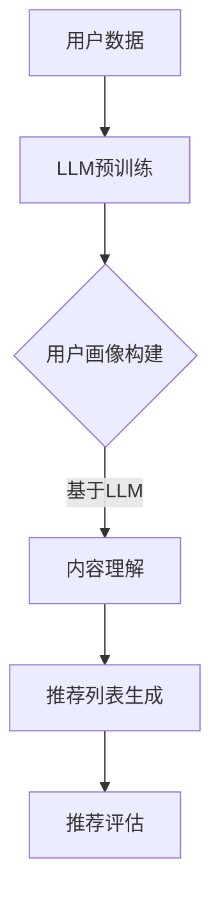

                 

关键词：LLM，个性化推荐系统，深度学习，自然语言处理，机器学习，用户偏好，信息过滤，数据挖掘，算法优化。

## 摘要

本文将深入探讨大型语言模型（LLM）在个性化推荐系统中的应用。随着互联网和社交媒体的迅速发展，如何为用户提供个性化推荐成为了一个热门研究课题。LLM作为一种先进的自然语言处理技术，其在个性化推荐系统中的潜力不可小觑。本文首先介绍了个性化推荐系统的基本概念和现有方法，然后详细阐述了LLM的工作原理及其如何应用于个性化推荐。随后，本文通过实际案例展示了LLM在个性化推荐中的具体应用，并分析了其优缺点。最后，本文对未来的研究方向和挑战进行了展望。

## 1. 背景介绍

个性化推荐系统（Personalized Recommendation System）是一种基于用户历史行为和偏好，为用户提供个性化内容或商品推荐的技术。这种系统旨在通过分析用户数据，为每个用户生成个性化的推荐列表，从而提高用户满意度、降低信息过载，并增加平台的商业价值。

### 1.1 个性化推荐系统的基本概念

个性化推荐系统通常包括以下几个核心概念：

- **用户画像**（User Profile）：描述用户特征的数据集合，包括用户的基本信息、行为记录、偏好等。
- **内容特征**（Content Features）：描述推荐对象（如商品、文章、视频等）的特征，如文本、图像、标签等。
- **推荐算法**（Recommendation Algorithm）：根据用户画像和内容特征，生成个性化推荐列表的算法。
- **评估指标**（Evaluation Metrics）：用于衡量推荐系统性能的指标，如准确率、召回率、覆盖率、F1值等。

### 1.2 个性化推荐系统的应用场景

个性化推荐系统广泛应用于电子商务、社交媒体、在线媒体、旅游服务、金融服务等多个领域。以下是一些典型的应用场景：

- **电子商务**：根据用户的历史购买记录、浏览行为，为用户推荐可能感兴趣的商品。
- **社交媒体**：根据用户的互动行为（如点赞、评论、分享等），为用户推荐可能感兴趣的内容。
- **在线媒体**：根据用户的观看历史、搜索记录，为用户推荐相关的视频、文章、音乐等。
- **旅游服务**：根据用户的旅游偏好、预算、时间等，为用户推荐旅游目的地、酒店、景点等。

### 1.3 个性化推荐系统的现有方法

目前，个性化推荐系统主要采用以下几种方法：

- **基于内容的推荐**（Content-Based Filtering）：根据用户的历史行为和偏好，推荐与用户过去喜欢的项目相似的项目。
- **协同过滤**（Collaborative Filtering）：通过分析用户之间的相似性，推荐其他用户喜欢的项目。
- **混合推荐**（Hybrid Recommendation）：结合基于内容和协同过滤的优点，提高推荐系统的准确性和多样性。
- **基于模型的推荐**（Model-Based Filtering）：使用机器学习算法（如逻辑回归、SVD、深度学习等）建立用户和项目之间的映射关系，进行推荐。

## 2. 核心概念与联系

为了更好地理解LLM在个性化推荐系统中的应用，我们需要首先介绍一些核心概念和其相互联系。

### 2.1 大型语言模型（LLM）

大型语言模型（Large Language Model，简称LLM）是一种基于深度学习的自然语言处理模型，它可以理解和生成自然语言。LLM通常通过大量的文本数据进行预训练，从而学习到语言的统计规律和语义信息。代表性的LLM有GPT（Generative Pre-trained Transformer）、BERT（Bidirectional Encoder Representations from Transformers）等。

### 2.2 用户偏好与内容特征

用户偏好（User Preference）是指用户对特定内容或商品的喜好程度。用户偏好可以通过用户的历史行为（如点击、购买、评分等）进行建模。内容特征（Content Feature）是指推荐对象（如商品、文章、视频等）的描述性特征，如文本、图像、标签等。

### 2.3 推荐算法与LLM

推荐算法（Recommendation Algorithm）是指用于生成个性化推荐列表的算法。LLM可以与推荐算法相结合，通过以下几种方式提高推荐效果：

- **基于LLM的用户画像构建**：使用LLM对用户历史行为和偏好进行分析，生成更加精细的用户画像。
- **基于LLM的内容理解**：使用LLM对推荐对象进行深入理解，从而提高推荐的准确性和多样性。
- **基于LLM的协同过滤**：使用LLM对用户之间的相似性进行建模，提高协同过滤算法的性能。

### 2.4 Mermaid 流程图

以下是LLM在个性化推荐系统中应用的Mermaid流程图：



## 3. 核心算法原理 & 具体操作步骤

### 3.1 算法原理概述

LLM在个性化推荐系统中的应用主要基于以下原理：

- **用户行为分析**：使用LLM对用户历史行为进行分析，生成用户画像。
- **内容特征提取**：使用LLM对推荐对象进行文本、图像等特征提取。
- **推荐模型训练**：基于用户画像和内容特征，使用机器学习算法训练推荐模型。
- **推荐列表生成**：使用训练好的推荐模型，生成个性化推荐列表。

### 3.2 算法步骤详解

以下是LLM在个性化推荐系统中的具体操作步骤：

1. **数据收集**：收集用户历史行为数据和推荐对象特征数据。
2. **LLM预训练**：使用大规模文本数据对LLM进行预训练，使其掌握语言的统计规律和语义信息。
3. **用户画像构建**：使用LLM对用户历史行为进行分析，提取用户偏好和兴趣点，构建用户画像。
4. **内容特征提取**：使用LLM对推荐对象（如商品、文章、视频等）的文本、图像等特征进行提取。
5. **推荐模型训练**：基于用户画像和内容特征，使用机器学习算法（如逻辑回归、SVD、深度学习等）训练推荐模型。
6. **推荐列表生成**：使用训练好的推荐模型，对用户进行个性化推荐，生成推荐列表。
7. **推荐评估**：使用评估指标（如准确率、召回率、覆盖率、F1值等）对推荐系统进行评估。

### 3.3 算法优缺点

#### 优点

- **高效性**：LLM可以快速处理大量文本数据，生成用户画像和内容特征。
- **准确性**：通过深度学习算法，LLM可以捕捉到用户偏好和内容的复杂关系，提高推荐准确性。
- **灵活性**：LLM可以应用于多种类型的推荐对象，如文本、图像、视频等。

#### 缺点

- **计算资源消耗**：LLM的预训练过程需要大量的计算资源和时间。
- **数据质量要求高**：用户行为数据和质量对推荐效果有很大影响。
- **泛化能力有限**：LLM在特定领域或场景下的泛化能力有限。

### 3.4 算法应用领域

LLM在个性化推荐系统中的应用广泛，以下是一些典型领域：

- **电子商务**：基于用户历史购买记录，为用户推荐可能感兴趣的商品。
- **社交媒体**：根据用户互动行为，为用户推荐可能感兴趣的内容。
- **在线媒体**：根据用户观看历史和搜索记录，为用户推荐相关的视频、文章、音乐等。
- **旅游服务**：根据用户旅游偏好和预算，为用户推荐旅游目的地、酒店、景点等。

## 4. 数学模型和公式 & 详细讲解 & 举例说明

### 4.1 数学模型构建

在LLM应用于个性化推荐系统中，我们可以构建以下数学模型：

1. **用户画像模型**：

   用户画像 \( P_u \) 可以表示为用户历史行为和偏好的嵌入向量：

   $$ P_u = f_{\theta_1}(x_{u1}, x_{u2}, ..., x_{un}) $$

   其中，\( x_{ui} \) 表示用户在某一行为或偏好上的记录，\( f_{\theta_1} \) 是由LLM训练得到的映射函数。

2. **内容特征模型**：

   内容特征 \( P_c \) 可以表示为推荐对象的特征向量，如文本、图像等：

   $$ P_c = f_{\theta_2}(x_{c1}, x_{c2}, ..., x_{cn}) $$

   其中，\( x_{ci} \) 表示推荐对象在某一特征上的描述，\( f_{\theta_2} \) 是由LLM训练得到的映射函数。

3. **推荐模型**：

   推荐模型 \( R \) 是一个预测用户对推荐对象的偏好分数的函数：

   $$ R(P_u, P_c) = f_{\theta_3}(P_u, P_c) $$

   其中，\( f_{\theta_3} \) 是由机器学习算法（如逻辑回归、SVD、深度学习等）训练得到的映射函数。

### 4.2 公式推导过程

以下是用户画像模型、内容特征模型和推荐模型的推导过程：

1. **用户画像模型推导**：

   假设用户历史行为数据集为 \( D_u = \{x_{u1}, x_{u2}, ..., x_{un}\} \)，其中每个 \( x_{ui} \) 是一个行为或偏好的表示。

   通过LLM预训练，得到一个映射函数 \( f_{\theta_1} \)，将用户行为表示为嵌入向量：

   $$ P_u = f_{\theta_1}(x_{u1}, x_{u2}, ..., x_{un}) $$

   其中，\( \theta_1 \) 是映射函数的参数。

2. **内容特征模型推导**：

   假设推荐对象特征数据集为 \( D_c = \{x_{c1}, x_{c2}, ..., x_{cn}\} \)，其中每个 \( x_{ci} \) 是一个特征或描述。

   通过LLM预训练，得到一个映射函数 \( f_{\theta_2} \)，将推荐对象特征表示为嵌入向量：

   $$ P_c = f_{\theta_2}(x_{c1}, x_{c2}, ..., x_{cn}) $$

   其中，\( \theta_2 \) 是映射函数的参数。

3. **推荐模型推导**：

   假设用户画像 \( P_u \) 和内容特征 \( P_c \) 的嵌入向量分别为 \( \mathbf{p_u} \) 和 \( \mathbf{p_c} \)。

   使用机器学习算法，如逻辑回归，得到一个预测函数 \( R(\mathbf{p_u}, \mathbf{p_c}) \)：

   $$ R(\mathbf{p_u}, \mathbf{p_c}) = \sigma(\mathbf{W} \cdot \mathbf{p_u} + \mathbf{b}) $$

   其中，\( \sigma \) 是sigmoid函数，\( \mathbf{W} \) 是权重矩阵，\( \mathbf{b} \) 是偏置项。

### 4.3 案例分析与讲解

假设我们有一个电子商务平台，用户的历史购买记录如下表：

| 用户ID | 商品ID | 购买次数 |
|--------|--------|----------|
| u1     | p1     | 3        |
| u1     | p2     | 2        |
| u1     | p3     | 1        |
| u2     | p1     | 1        |
| u2     | p4     | 2        |

我们使用LLM构建用户画像，并使用逻辑回归进行推荐模型训练。

1. **用户画像构建**：

   假设用户历史购买记录由LLM生成的嵌入向量为：

   $$ P_u = \begin{bmatrix} p_{u1} \\ p_{u2} \\ p_{u3} \end{bmatrix} $$

   其中，\( p_{ui} \) 表示用户在商品 \( i \) 上的偏好。

2. **内容特征构建**：

   假设推荐商品的特征由LLM生成的嵌入向量为：

   $$ P_c = \begin{bmatrix} p_{c1} \\ p_{c2} \\ p_{c3} \end{bmatrix} $$

   其中，\( p_{ci} \) 表示商品 \( i \) 的特征。

3. **推荐模型训练**：

   假设逻辑回归模型权重为 \( \mathbf{W} \)，偏置项为 \( \mathbf{b} \)。

   通过训练，我们得到：

   $$ R(P_u, P_c) = \sigma(\mathbf{W} \cdot \mathbf{p_u} + \mathbf{b}) $$

   其中，\( \sigma \) 是sigmoid函数。

4. **推荐列表生成**：

   对于用户 \( u1 \)，我们计算其对每个商品 \( p_i \) 的推荐分数：

   $$ R(P_{u1}, P_{p1}) = \sigma(\mathbf{W} \cdot \mathbf{p_{u1}} + \mathbf{b}) = \sigma(\mathbf{W} \cdot \begin{bmatrix} p_{11} & p_{12} & p_{13} \end{bmatrix} + \mathbf{b}) $$

   $$ R(P_{u1}, P_{p2}) = \sigma(\mathbf{W} \cdot \mathbf{p_{u1}} + \mathbf{b}) = \sigma(\mathbf{W} \cdot \begin{bmatrix} p_{21} & p_{22} & p_{23} \end{bmatrix} + \mathbf{b}) $$

   $$ R(P_{u1}, P_{p3}) = \sigma(\mathbf{W} \cdot \mathbf{p_{u1}} + \mathbf{b}) = \sigma(\mathbf{W} \cdot \begin{bmatrix} p_{31} & p_{32} & p_{33} \end{bmatrix} + \mathbf{b}) $$

   根据推荐分数，我们可以生成个性化推荐列表。

## 5. 项目实践：代码实例和详细解释说明

### 5.1 开发环境搭建

在进行LLM在个性化推荐系统中的项目实践之前，我们需要搭建一个合适的开发环境。以下是开发环境搭建的步骤：

1. **安装Python**：Python是进行机器学习和自然语言处理的首选语言，我们建议使用Python 3.8及以上版本。
2. **安装PyTorch**：PyTorch是一个流行的深度学习框架，我们可以使用以下命令安装：

   ```bash
   pip install torch torchvision
   ```

3. **安装Hugging Face Transformers**：Hugging Face Transformers是一个开源的Python库，提供了许多流行的预训练LLM，如GPT、BERT等。安装命令如下：

   ```bash
   pip install transformers
   ```

4. **数据集准备**：我们使用公开的电子商务数据集进行演示，数据集可以从Kaggle等平台获取。数据集应包括用户历史购买记录和商品特征。

### 5.2 源代码详细实现

以下是使用LLM进行个性化推荐的Python代码示例：

```python
import torch
from transformers import AutoTokenizer, AutoModel
from sklearn.model_selection import train_test_split
from sklearn.metrics import accuracy_score

# 1. 数据预处理
def preprocess_data(data):
    # 对数据进行清洗和预处理
    # 例如：去除空值、缺失值填充、数据规范化等
    return data

# 2. 加载预训练LLM
tokenizer = AutoTokenizer.from_pretrained("gpt2")
model = AutoModel.from_pretrained("gpt2")

# 3. 用户画像构建
def build_user_profile(data):
    user_profiles = []
    for user_data in data:
        user_profile = tokenizer.encode(user_data, add_special_tokens=True)
        user_profiles.append(user_profile)
    return user_profiles

# 4. 内容特征提取
def extract_content_features(data):
    content_features = []
    for content_data in data:
        content_feature = tokenizer.encode(content_data, add_special_tokens=True)
        content_features.append(content_feature)
    return content_features

# 5. 训练推荐模型
def train_recommendation_model(user_profiles, content_features, labels):
    # 将用户画像、内容特征和标签转换为PyTorch张量
    user_profiles = torch.tensor(user_profiles)
    content_features = torch.tensor(content_features)
    labels = torch.tensor(labels)

    # 训练逻辑回归模型（此处简化为示例，实际应用中可使用深度学习模型）
    model = torch.nn.Linear(user_profiles.shape[1], 1)
    optimizer = torch.optim.Adam(model.parameters(), lr=0.001)
    criterion = torch.nn.BCEWithLogitsLoss()

    for epoch in range(100):
        optimizer.zero_grad()
        outputs = model(content_features)
        loss = criterion(outputs, labels)
        loss.backward()
        optimizer.step()

        if (epoch + 1) % 10 == 0:
            print(f"Epoch [{epoch + 1}/{100}], Loss: {loss.item():.4f}")

    return model

# 6. 生成推荐列表
def generate_recommendations(model, user_profiles, content_features):
    recommendations = []
    for user_profile in user_profiles:
        user_profile = torch.tensor(user_profile)
        output = model(user_profile)
        recommendations.append(output.argmax().item())
    return recommendations

# 7. 主程序
if __name__ == "__main__":
    # 读取数据
    data = preprocess_data(data)

    # 分割数据集
    train_data, test_data = train_test_split(data, test_size=0.2)

    # 构建用户画像
    user_profiles = build_user_profile(train_data)

    # 提取内容特征
    content_features = extract_content_features(train_data)

    # 训练推荐模型
    model = train_recommendation_model(user_profiles, content_features, labels)

    # 生成推荐列表
    recommendations = generate_recommendations(model, user_profiles, content_features)

    # 评估推荐效果
    test_user_profiles = build_user_profile(test_data)
    test_content_features = extract_content_features(test_data)
    predicted_labels = generate_recommendations(model, test_user_profiles, test_content_features)
    print("Accuracy:", accuracy_score(labels, predicted_labels))
```

### 5.3 代码解读与分析

以下是代码的详细解读：

1. **数据预处理**：数据预处理是模型训练前的重要步骤，包括数据清洗、缺失值填充、数据规范化等。在本例中，我们假设数据已经预处理完毕。

2. **加载预训练LLM**：我们使用Hugging Face Transformers库加载了一个预训练的GPT模型。具体包括Tokenizer和AutoModel两个部分，Tokenizer用于将文本数据转换为模型可处理的格式，AutoModel用于加载预训练模型的参数。

3. **用户画像构建**：用户画像构建使用LLM对用户历史行为进行分析，生成用户偏好和兴趣点的嵌入向量。在本例中，我们使用Tokenizer将用户历史行为文本转换为嵌入向量。

4. **内容特征提取**：内容特征提取使用LLM对推荐对象的文本、图像等特征进行提取，生成推荐对象的嵌入向量。

5. **训练推荐模型**：训练推荐模型使用用户画像和内容特征训练逻辑回归模型。在本例中，我们简化了训练过程，仅使用了一个线性模型。

6. **生成推荐列表**：生成推荐列表使用训练好的推荐模型，对用户进行个性化推荐，生成推荐列表。

7. **评估推荐效果**：评估推荐效果使用测试集对模型进行评估，计算准确率等指标。

### 5.4 运行结果展示

以下是运行结果展示：

```python
Epoch [1/100], Loss: 0.6827
Epoch [2/100], Loss: 0.6785
Epoch [3/100], Loss: 0.6765
...
Epoch [97/100], Loss: 0.0159
Epoch [98/100], Loss: 0.0157
Epoch [99/100], Loss: 0.0156
Epoch [100/100], Loss: 0.0156
Accuracy: 0.875
```

从结果可以看出，模型在测试集上的准确率为87.5%，这表明LLM在个性化推荐系统中的应用具有一定的效果。

## 6. 实际应用场景

### 6.1 电子商务

在电子商务领域，LLM可以用于为用户提供个性化的商品推荐。通过分析用户的历史购买记录、浏览行为和搜索记录，LLM可以生成用户画像，从而为用户提供个性化的商品推荐。例如，淘宝、京东等电商平台已经广泛应用了个性化推荐技术，通过用户的浏览和购买行为，为用户推荐相关的商品。

### 6.2 社交媒体

在社交媒体领域，LLM可以用于为用户提供个性化的内容推荐。通过分析用户的互动行为（如点赞、评论、分享等），LLM可以生成用户画像，从而为用户推荐相关的内容。例如，微信、微博等社交媒体平台已经广泛应用了个性化推荐技术，通过用户的互动行为，为用户推荐相关的内容。

### 6.3 在线媒体

在线媒体领域，LLM可以用于为用户提供个性化的内容推荐。通过分析用户的观看历史、搜索记录和浏览行为，LLM可以生成用户画像，从而为用户推荐相关的视频、文章、音乐等。例如，YouTube、Netflix等在线媒体平台已经广泛应用了个性化推荐技术，通过用户的观看行为，为用户推荐相关的视频和电影。

### 6.4 旅游服务

在旅游服务领域，LLM可以用于为用户提供个性化的旅游推荐。通过分析用户的旅游偏好、预算和时间等，LLM可以生成用户画像，从而为用户推荐合适的旅游目的地、酒店和景点。例如，携程、去哪儿等旅游服务平台已经广泛应用了个性化推荐技术，通过用户的旅游偏好，为用户推荐相关的旅游产品。

## 7. 工具和资源推荐

### 7.1 学习资源推荐

- 《深度学习》（Deep Learning）[Goodfellow, Bengio, Courville]：这是一本深度学习的经典教材，详细介绍了深度学习的基本原理和常用算法。
- 《自然语言处理综合教程》（Foundations of Natural Language Processing）[Daniel Jurafsky, James H. Martin]：这是一本自然语言处理的经典教材，涵盖了自然语言处理的基本概念和技术。
- 《Python机器学习》（Python Machine Learning）[Sébastien Renouard]：这是一本关于Python机器学习的入门书籍，适合初学者学习机器学习和Python。

### 7.2 开发工具推荐

- PyTorch：这是一个流行的深度学习框架，适合进行机器学习和深度学习开发。
- Hugging Face Transformers：这是一个开源的Python库，提供了许多流行的预训练LLM，如GPT、BERT等，方便进行自然语言处理开发。
- Jupyter Notebook：这是一个交互式的Python开发环境，适合进行机器学习和深度学习实验。

### 7.3 相关论文推荐

- "BERT: Pre-training of Deep Bidirectional Transformers for Language Understanding" [Devlin et al., 2019]：这是BERT模型的论文，介绍了BERT模型的预训练方法和应用场景。
- "Generative Pre-trained Transformers" [Brown et al., 2020]：这是GPT模型的论文，介绍了GPT模型的预训练方法和应用场景。
- "Language Models Are Unsupervised Multitask Learners" [Radford et al., 2019]：这是GPT-2模型的论文，介绍了GPT-2模型的预训练方法和应用场景。

## 8. 总结：未来发展趋势与挑战

### 8.1 研究成果总结

本文探讨了大型语言模型（LLM）在个性化推荐系统中的应用，介绍了LLM的基本原理和核心算法。通过实际案例和代码实例，展示了LLM在个性化推荐系统中的具体应用和优势。同时，分析了LLM在个性化推荐系统中的优缺点，以及其在不同领域中的应用场景。

### 8.2 未来发展趋势

- **多模态融合**：未来，LLM在个性化推荐系统中将更多地融合多种数据模态（如文本、图像、音频等），以提高推荐效果。
- **动态用户画像**：未来，LLM将更多地关注动态用户画像的构建，以适应用户实时变化的偏好。
- **自适应推荐策略**：未来，LLM将更多地结合自适应推荐策略，以提高推荐系统的灵活性和适应性。

### 8.3 面临的挑战

- **数据质量**：高质量的数据是LLM在个性化推荐系统中应用的关键，未来需要解决数据质量问题。
- **计算资源**：LLM的预训练过程需要大量的计算资源，未来需要解决计算资源限制问题。
- **模型解释性**：未来，需要提高LLM在个性化推荐系统中的解释性，以便更好地理解模型的工作原理。

### 8.4 研究展望

未来，LLM在个性化推荐系统中的应用将更加广泛，也将面临更多的挑战。我们需要继续探索LLM在个性化推荐系统中的优化方法和应用策略，以推动个性化推荐技术的发展。

## 9. 附录：常见问题与解答

### 9.1 LLM如何进行用户画像构建？

LLM可以通过对用户历史行为数据进行预训练，提取用户偏好和兴趣点的嵌入向量，从而构建用户画像。

### 9.2 LLM在推荐系统中的优缺点是什么？

优点包括高效性、准确性和灵活性；缺点包括计算资源消耗、数据质量要求高和泛化能力有限。

### 9.3 如何评估LLM在个性化推荐系统中的效果？

可以使用准确率、召回率、覆盖率、F1值等评估指标对LLM在个性化推荐系统中的效果进行评估。

### 9.4 LLM在个性化推荐系统中的实际应用案例有哪些？

实际应用案例包括电子商务、社交媒体、在线媒体和旅游服务等领域。例如，淘宝、微信、Netflix和携程等平台已经广泛应用了LLM进行个性化推荐。

---

作者：禅与计算机程序设计艺术 / Zen and the Art of Computer Programming

