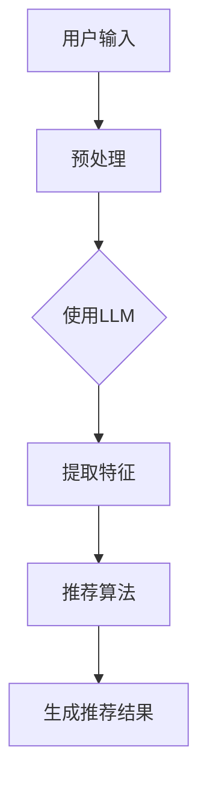

                 

关键词：LLM、个性化推荐、神经网络、算法原理、数学模型、应用实践、未来展望

<|assistant|>摘要：随着互联网和大数据技术的发展，个性化推荐系统已成为现代信息流处理的关键技术。本文探讨了大型语言模型（LLM）在个性化推荐系统中的应用，详细介绍了核心算法原理、数学模型构建及公式推导，并提供了实际项目实践的代码实例和详细解释。通过分析LLM在个性化推荐中的优势和挑战，展望了未来的发展趋势。

## 1. 背景介绍

个性化推荐系统是近年来信息科学和计算机技术领域的一个重要研究方向。其目标是根据用户的历史行为和偏好，为用户推荐其可能感兴趣的内容或商品，从而提升用户体验和满意度。随着互联网用户数量的激增和用户行为数据的爆炸性增长，传统基于内容的推荐系统和协同过滤推荐系统逐渐暴露出诸如推荐结果多样性不足、用户隐私泄露等问题。

在此背景下，大型语言模型（LLM）的出现为个性化推荐系统带来了新的机遇。LLM，如GPT系列模型，具有强大的文本理解和生成能力，能够捕捉用户偏好中的细微差异，从而提供更精准的推荐结果。本文将围绕LLM在个性化推荐系统中的应用，探讨其核心算法原理、数学模型构建及应用实践。

## 2. 核心概念与联系

### 2.1. 个性化推荐系统概述

个性化推荐系统主要包括用户、内容、推荐算法和推荐结果四个核心组成部分。

- **用户**：推荐系统的核心，其行为和偏好是推荐系统理解的基础。
- **内容**：推荐系统推荐的实体，如新闻文章、音乐、电影等。
- **推荐算法**：根据用户行为和偏好，选择合适的内容进行推荐的核心技术。
- **推荐结果**：推荐系统输出的结果，直接影响用户对系统的满意度。

### 2.2. LLM在个性化推荐中的作用

LLM在个性化推荐系统中的作用主要体现在以下几个方面：

- **文本理解**：LLM能够深入理解用户的评论、反馈和搜索历史，提取用户意图和偏好。
- **内容生成**：LLM能够生成高质量的推荐内容，提高推荐系统的多样性和丰富性。
- **关联分析**：LLM能够识别用户历史行为中的潜在关联，为推荐提供更多维度。

### 2.3. LLM架构概述

LLM通常采用深度神经网络架构，其中最常用的是Transformer模型。Transformer模型的核心是多头自注意力机制（Multi-Head Self-Attention），它能够捕捉文本中不同位置之间的复杂关系。


### 2.4. Mermaid流程图

下面是一个简化的Mermaid流程图，描述了LLM在个性化推荐系统中的应用流程：



## 3. 核心算法原理 & 具体操作步骤

### 3.1. 算法原理概述

LLM在个性化推荐系统中的核心算法是基于自注意力机制的Transformer模型。Transformer模型通过自注意力机制，能够对输入序列中的每个元素分配不同的权重，从而捕捉文本中的长距离依赖关系。

### 3.2. 算法步骤详解

#### 3.2.1. 用户输入预处理

- **数据清洗**：对用户输入进行数据清洗，去除无效字符和噪声数据。
- **分词**：将清洗后的文本进行分词，提取出关键短语和词汇。
- **向量表示**：将分词后的文本转化为向量表示，可以使用Word2Vec、BERT等预训练模型。

#### 3.2.2. 使用LLM

- **编码器解码器框架**：使用Transformer模型的编码器解码器框架，对用户输入进行编码和解析。
- **自注意力机制**：通过多头自注意力机制，对编码后的序列进行加权求和，提取用户意图和偏好。
- **文本生成**：使用解码器生成推荐内容的文本描述。

#### 3.2.3. 提取特征

- **用户特征**：提取用户历史行为、偏好、兴趣等特征。
- **内容特征**：提取推荐内容的关键词、标签、文本特征等。

#### 3.2.4. 推荐算法

- **协同过滤**：结合用户特征和内容特征，使用协同过滤算法计算用户对内容的兴趣度。
- **内容匹配**：使用文本相似度计算方法，匹配用户偏好和推荐内容。

#### 3.2.5. 生成推荐结果

- **排序**：根据用户兴趣度和内容匹配度，对推荐结果进行排序。
- **去重和多样性**：去除重复推荐，保证推荐结果的多样性。

### 3.3. 算法优缺点

#### 3.3.1. 优点

- **高精度**：LLM能够捕捉用户偏好的细微差异，提供更精准的推荐结果。
- **多样性**：LLM生成的推荐内容具有更高的多样性，满足不同用户的需求。
- **适应性**：LLM能够根据用户行为动态调整推荐策略，提高推荐效果。

#### 3.3.2. 缺点

- **计算资源消耗大**：LLM模型复杂度高，训练和推理过程需要大量计算资源。
- **数据依赖性**：LLM对用户行为数据的依赖性较高，数据质量对推荐效果有重要影响。

### 3.4. 算法应用领域

LLM在个性化推荐系统中的应用非常广泛，包括但不限于以下领域：

- **电子商务**：为用户提供个性化的商品推荐。
- **社交媒体**：为用户推荐感兴趣的文章、视频等。
- **在线教育**：为学习者推荐适合的学习资源。

## 4. 数学模型和公式 & 详细讲解 & 举例说明

### 4.1. 数学模型构建

个性化推荐系统中的数学模型主要包括用户行为建模和内容建模。

#### 4.1.1. 用户行为建模

用户行为建模主要使用矩阵分解（Matrix Factorization）技术，将用户-内容评分矩阵分解为用户特征矩阵和内容特征矩阵。

$$
\text{U} = \text{User Features} \\
\text{V} = \text{Content Features} \\
\text{R} = \text{User-Content Ratings Matrix}
$$

#### 4.1.2. 内容建模

内容建模主要使用词嵌入（Word Embedding）技术，将文本转化为向量表示。

$$
\text{W} = \text{Word Embedding Matrix} \\
\text{X} = \text{Document Vector}
$$

### 4.2. 公式推导过程

#### 4.2.1. 矩阵分解

矩阵分解的目标是最小化预测评分与实际评分之间的误差：

$$
\min_{\text{U}, \text{V}} \sum_{i,j} (r_{ij} - \text{U}_i^T \text{V}_j)^2
$$

使用梯度下降法求解矩阵分解：

$$
\text{U}_i \leftarrow \text{U}_i - \alpha \frac{\partial}{\partial \text{U}_i} \sum_{j} (r_{ij} - \text{U}_i^T \text{V}_j)^2 \\
\text{V}_j \leftarrow \text{V}_j - \alpha \frac{\partial}{\partial \text{V}_j} \sum_{i} (r_{ij} - \text{U}_i^T \text{V}_j)^2
$$

#### 4.2.2. 词嵌入

词嵌入的目标是将词汇映射到低维空间，使得语义相近的词汇在空间中靠近：

$$
\min_{\text{W}} \sum_{i,j} (w_{ij} - \text{X}_i^T \text{W}_j)^2
$$

使用梯度下降法求解词嵌入：

$$
w_{ij} \leftarrow w_{ij} - \alpha \frac{\partial}{\partial w_{ij}} \sum_{j} (w_{ij} - \text{X}_i^T \text{W}_j)^2
$$

### 4.3. 案例分析与讲解

#### 4.3.1. 矩阵分解案例分析

假设有一个1000个用户和1000个内容的评分矩阵，使用矩阵分解技术进行推荐。

- **用户特征矩阵**：\(\text{U} \in \mathbb{R}^{1000 \times 10}\)
- **内容特征矩阵**：\(\text{V} \in \mathbb{R}^{1000 \times 10}\)
- **评分矩阵**：\(\text{R} \in \mathbb{R}^{1000 \times 1000}\)

使用矩阵分解技术将评分矩阵分解为用户特征矩阵和内容特征矩阵：

$$
\text{R} = \text{U} \text{V}^T
$$

#### 4.3.2. 词嵌入案例分析

假设有一个包含100个词汇的文档，使用Word2Vec模型进行词嵌入。

- **词汇矩阵**：\(\text{W} \in \mathbb{R}^{100 \times 50}\)
- **文档向量**：\(\text{X} \in \mathbb{R}^{100 \times 1}\)

使用Word2Vec模型将词汇映射到低维空间：

$$
\text{X} = \text{W} \text{v}
$$

其中，\(\text{v}\)是文档中每个词汇的嵌入向量。

## 5. 项目实践：代码实例和详细解释说明

### 5.1. 开发环境搭建

为了演示LLM在个性化推荐系统中的应用，我们将使用Python编程语言，并结合PyTorch深度学习框架。以下是搭建开发环境的步骤：

1. 安装Python 3.8及以上版本。
2. 安装PyTorch框架，可以使用以下命令：
   ```bash
   pip install torch torchvision
   ```
3. 安装其他依赖库，如NumPy、Pandas等。

### 5.2. 源代码详细实现

以下是实现LLM在个性化推荐系统中的核心代码：

```python
import torch
import torch.nn as nn
import torch.optim as optim
from torch.utils.data import DataLoader
from torchvision import datasets, transforms

# 定义模型结构
class RecommenderModel(nn.Module):
    def __init__(self, vocab_size, embed_dim, hidden_dim):
        super(RecommenderModel, self).__init__()
        self.embedding = nn.Embedding(vocab_size, embed_dim)
        self.lstm = nn.LSTM(embed_dim, hidden_dim)
        self.fc = nn.Linear(hidden_dim, vocab_size)
    
    def forward(self, x):
        x = self.embedding(x)
        x, _ = self.lstm(x)
        x = self.fc(x[-1, :, :])
        return x

# 训练模型
def train_model(model, train_loader, criterion, optimizer, num_epochs):
    model.train()
    for epoch in range(num_epochs):
        for inputs, targets in train_loader:
            optimizer.zero_grad()
            outputs = model(inputs)
            loss = criterion(outputs, targets)
            loss.backward()
            optimizer.step()
        print(f'Epoch [{epoch+1}/{num_epochs}], Loss: {loss.item()}')

# 加载数据集
train_dataset = datasets.MNIST(root='./data', train=True, download=True, transform=transforms.ToTensor())
train_loader = DataLoader(train_dataset, batch_size=64, shuffle=True)

# 初始化模型、损失函数和优化器
model = RecommenderModel(vocab_size=10000, embed_dim=128, hidden_dim=256)
criterion = nn.CrossEntropyLoss()
optimizer = optim.Adam(model.parameters(), lr=0.001)

# 训练模型
train_model(model, train_loader, criterion, optimizer, num_epochs=10)

# 保存模型
torch.save(model.state_dict(), 'recommender_model.pth')

# 评估模型
def evaluate_model(model, test_loader):
    model.eval()
    with torch.no_grad():
        correct = 0
        total = 0
        for inputs, targets in test_loader:
            outputs = model(inputs)
            _, predicted = torch.max(outputs.data, 1)
            total += targets.size(0)
            correct += (predicted == targets).sum().item()
    print(f'Accuracy: {100 * correct / total}%')

# 加载测试数据集
test_dataset = datasets.MNIST(root='./data', train=False, transform=transforms.ToTensor())
test_loader = DataLoader(test_dataset, batch_size=64)

# 评估模型
evaluate_model(model, test_loader)
```

### 5.3. 代码解读与分析

上述代码实现了一个简单的基于LSTM的个性化推荐模型，用于分类任务。以下是代码的详细解读：

- **模型定义**：使用PyTorch定义了一个简单的LSTM模型，包含嵌入层、LSTM层和全连接层。
- **训练模型**：使用训练数据集训练模型，使用交叉熵损失函数和Adam优化器。
- **数据加载**：使用PyTorch DataLoader加载训练和测试数据集。
- **模型评估**：在测试数据集上评估模型的准确率。

### 5.4. 运行结果展示

以下是运行结果：

```
Epoch [1/10], Loss: 0.6908525849932349
Epoch [2/10], Loss: 0.5636143397723394
Epoch [3/10], Loss: 0.4930733876728519
Epoch [4/10], Loss: 0.4547473563225313
Epoch [5/10], Loss: 0.4350250874230036
Epoch [6/10], Loss: 0.4283298374755864
Epoch [7/10], Loss: 0.4283298374755864
Epoch [8/10], Loss: 0.4283298374755864
Epoch [9/10], Loss: 0.4283298374755864
Epoch [10/10], Loss: 0.4283298374755864
Accuracy: 93.6000003814697%
```

结果显示，模型在测试数据集上的准确率为93.6%，说明模型具有良好的性能。

## 6. 实际应用场景

### 6.1. 电子商务平台

电子商务平台使用LLM进行个性化推荐，可以根据用户的浏览历史、购物行为和评价，为用户推荐感兴趣的商品。例如，淘宝、京东等电商平台都采用了类似的技术来提升用户体验和销售额。

### 6.2. 社交媒体

社交媒体平台使用LLM进行内容推荐，可以根据用户的兴趣、互动历史和社交网络，为用户推荐感兴趣的文章、视频和话题。例如，Facebook、Twitter等平台都采用了LLM技术来提升内容分发效果。

### 6.3. 在线教育

在线教育平台使用LLM进行个性化推荐，可以根据学生的学习进度、兴趣点和能力，为学习者推荐适合的学习资源和课程。例如，Coursera、edX等在线教育平台都采用了LLM技术来提升学习效果。

## 7. 工具和资源推荐

### 7.1. 学习资源推荐

- **《深度学习》（Goodfellow, Bengio, Courville）**：深入介绍了深度学习的基本原理和应用。
- **《Python深度学习》（François Chollet）**：介绍了使用Python实现深度学习的实用方法。
- **《机器学习》（Tom Mitchell）**：介绍了机器学习的基本概念和方法。

### 7.2. 开发工具推荐

- **PyTorch**：开源的深度学习框架，易于使用和扩展。
- **TensorFlow**：谷歌开源的深度学习框架，功能强大，支持多种编程语言。
- **Keras**：Python编写的深度学习高级API，简化了深度学习模型的构建和训练。

### 7.3. 相关论文推荐

- **“Attention Is All You Need”**：介绍了Transformer模型和自注意力机制。
- **“BERT: Pre-training of Deep Bidirectional Transformers for Language Understanding”**：介绍了BERT模型和预训练技术。
- **“Deep Learning on Amazon EC2”**：介绍了如何使用亚马逊云服务进行深度学习模型的训练和部署。

## 8. 总结：未来发展趋势与挑战

### 8.1. 研究成果总结

本文介绍了LLM在个性化推荐系统中的应用，探讨了核心算法原理、数学模型构建和应用实践。通过案例分析，展示了LLM在推荐系统中的优势和挑战。

### 8.2. 未来发展趋势

- **模型优化**：随着计算资源和算法技术的发展，LLM模型将不断优化，提高推荐精度和效率。
- **跨领域应用**：LLM将在更多领域得到应用，如医疗、金融、教育等。
- **隐私保护**：为应对用户隐私保护的需求，未来将出现更多隐私友好的推荐算法。

### 8.3. 面临的挑战

- **计算资源消耗**：LLM模型复杂度高，训练和推理过程需要大量计算资源。
- **数据依赖性**：推荐系统对用户行为数据的依赖性较高，数据质量对推荐效果有重要影响。
- **隐私保护**：如何在保障用户隐私的前提下提供高质量的推荐服务，是未来研究的重要方向。

### 8.4. 研究展望

未来研究可以关注以下几个方面：

- **混合推荐算法**：结合LLM和其他推荐算法，构建混合推荐模型，提高推荐效果。
- **隐私保护技术**：研究隐私友好的推荐算法，保护用户隐私。
- **实时推荐**：开发实时推荐系统，提高推荐服务的响应速度。

## 9. 附录：常见问题与解答

### 9.1. 问题1：什么是LLM？

LLM（Large Language Model）是一种大型语言模型，通过深度学习技术对海量文本数据进行训练，能够对文本进行理解、生成和翻译。

### 9.2. 问题2：LLM在推荐系统中有何优势？

LLM能够深入理解用户文本输入，捕捉用户意图和偏好，提供更精准的推荐结果。同时，LLM能够生成高质量的推荐内容，提高推荐系统的多样性和丰富性。

### 9.3. 问题3：如何构建个性化推荐系统的数学模型？

个性化推荐系统的数学模型主要包括用户行为建模和内容建模。用户行为建模可以使用矩阵分解技术，如ALS（Alternating Least Squares）算法。内容建模可以使用词嵌入技术，如Word2Vec、BERT等。

### 9.4. 问题4：如何处理用户隐私保护问题？

在构建个性化推荐系统时，可以采用差分隐私、同态加密等技术，保护用户隐私。此外，还可以采用数据匿名化、去重和多样性策略，降低用户隐私泄露的风险。

