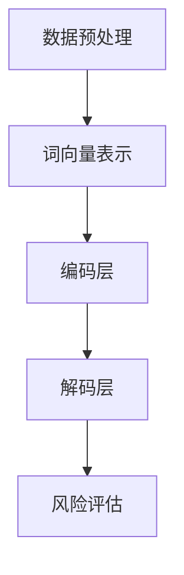
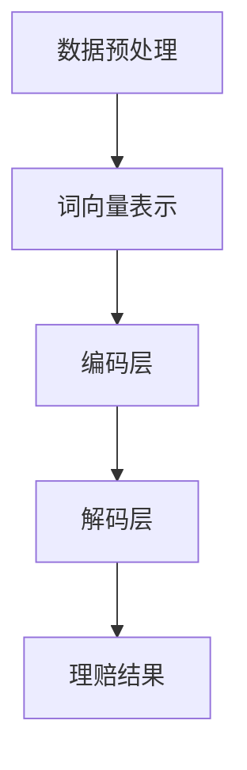

                 

关键词：大型语言模型(LLM)，保险业，风险评估，理赔，应用场景，算法原理，数学模型，项目实践，未来展望。

> 摘要：本文探讨了大型语言模型（LLM）在保险业中的应用，重点分析了其在风险评估与理赔环节的关键作用。文章首先介绍了LLM的基本概念和原理，然后详细阐述了其在保险业的具体应用场景和实现方法，并通过数学模型和公式推导，展示了其在风险评估和理赔中的数学基础。最后，文章通过一个实际项目实例，详细讲解了LLM在保险业中的应用过程，并对未来发展趋势和挑战进行了展望。

## 1. 背景介绍

随着人工智能技术的不断发展，特别是深度学习技术的突破，大型语言模型（LLM）逐渐成为研究的热点。LLM是一种基于神经网络的深度学习模型，具有强大的自然语言处理能力，能够对大量文本数据进行建模和理解。在保险业，风险评估和理赔是两个关键环节，直接关系到保险公司的运营效率和客户满意度。传统的风险评估和理赔方法主要依赖于人工经验和规则，存在效率低、准确性差等问题。而LLM的出现，为保险业提供了新的技术手段，有望解决上述问题。

本文旨在探讨LLM在保险业中的应用，分析其在风险评估和理赔环节的关键作用，并探讨其未来的发展趋势和挑战。

### 1.1 保险业现状

保险业是一个复杂的行业，涉及多个环节，包括风险评估、保险产品设计、保险销售、理赔等。其中，风险评估和理赔是两个关键环节。

- **风险评估**：保险公司在设计保险产品时，需要对潜在客户进行风险评估，以确定其风险水平和保险费用。传统的风险评估方法主要依赖于人工经验和规则，存在主观性强、准确性差等问题。

- **理赔**：理赔是保险业的核心环节，关系到保险公司的信誉和客户满意度。传统的理赔方法主要依赖于人工处理，存在效率低、成本高、准确性差等问题。

### 1.2 LLM的基本概念和原理

LLM是一种基于神经网络的深度学习模型，其核心思想是通过大量数据的学习，建立语言模型，从而实现对自然语言的建模和理解。LLM的基本原理包括：

- **词向量表示**：将自然语言中的词语转换为高维向量表示，从而实现词语之间的量化表示。

- **神经网络结构**：采用多层神经网络结构，通过逐层学习，实现对词语之间关系的建模。

- **训练过程**：通过大量文本数据的训练，不断调整神经网络的参数，使其能够准确预测文本中的词语序列。

### 1.3 LLM在保险业的应用前景

LLM在保险业具有广泛的应用前景，主要体现在以下两个方面：

- **风险评估**：LLM能够对大量文本数据进行建模和理解，从而实现对潜在客户的风险评估。相比于传统方法，LLM具有更高的准确性和效率。

- **理赔**：LLM能够自动处理理赔申请，提高理赔效率和准确性。例如，LLM可以自动识别理赔申请中的关键词，自动判断理赔申请是否符合要求，从而提高理赔效率。

## 2. 核心概念与联系

### 2.1 保险风险评估

保险风险评估是指通过对潜在客户进行风险分析，确定其风险水平，从而确定其保险费用。传统的风险评估方法主要依赖于人工经验和规则，而LLM的出现，为保险风险评估提供了新的技术手段。

#### 2.1.1 LLM在保险风险评估中的应用

LLM在保险风险评估中的应用主要包括以下几个方面：

- **数据预处理**：使用LLM对客户数据进行预处理，包括文本清洗、分词、词向量表示等。

- **风险建模**：使用LLM对客户数据进行建模，确定其风险水平。

- **风险评估**：根据LLM的建模结果，对客户进行风险评估，确定其保险费用。

#### 2.1.2 LLM的架构与流程

LLM的架构主要包括词向量层、编码层和解码层。其基本流程如下：

1. **数据预处理**：将客户数据转换为文本形式，并进行清洗和分词。

2. **词向量表示**：使用词向量模型（如Word2Vec、GloVe等）将词语转换为高维向量表示。

3. **编码层**：将词向量输入编码层，通过多层神经网络，对文本进行编码，提取文本的特征。

4. **解码层**：将编码后的特征输入解码层，通过解码层，生成风险评估结果。

#### 2.1.3 Mermaid流程图

下面是LLM在保险风险评估中的应用的Mermaid流程图：



### 2.2 保险理赔

保险理赔是指保险公司对客户提出的理赔申请进行处理的过程。传统的理赔方法主要依赖于人工处理，存在效率低、成本高、准确性差等问题。而LLM的出现，为保险理赔提供了新的技术手段。

#### 2.2.1 LLM在保险理赔中的应用

LLM在保险理赔中的应用主要包括以下几个方面：

- **文本分类**：使用LLM对理赔申请进行分类，判断其是否属于可理赔范围。

- **关键词提取**：使用LLM提取理赔申请中的关键信息，如事故类型、损失金额等。

- **自动理赔**：使用LLM自动处理理赔申请，提高理赔效率和准确性。

#### 2.2.2 LLM的架构与流程

LLM在保险理赔中的架构与流程与风险评估类似，主要包括词向量层、编码层和解码层。其基本流程如下：

1. **数据预处理**：将理赔申请文本进行清洗和分词。

2. **词向量表示**：使用词向量模型将词语转换为高维向量表示。

3. **编码层**：将词向量输入编码层，通过多层神经网络，对文本进行编码，提取文本的特征。

4. **解码层**：将编码后的特征输入解码层，通过解码层，生成理赔结果。

#### 2.2.3 Mermaid流程图

下面是LLM在保险理赔中的应用的Mermaid流程图：



## 3. 核心算法原理 & 具体操作步骤

### 3.1 算法原理概述

LLM在保险业中的应用，主要依赖于其强大的自然语言处理能力和深度学习技术。其核心算法原理主要包括以下几个方面：

1. **词向量表示**：将自然语言中的词语转换为高维向量表示，从而实现词语之间的量化表示。

2. **多层神经网络**：采用多层神经网络结构，通过逐层学习，实现对词语之间关系的建模。

3. **训练过程**：通过大量文本数据的训练，不断调整神经网络的参数，使其能够准确预测文本中的词语序列。

### 3.2 算法步骤详解

1. **数据预处理**：对客户数据和理赔申请文本进行清洗和分词。

2. **词向量表示**：使用词向量模型（如Word2Vec、GloVe等）将词语转换为高维向量表示。

3. **编码层**：将词向量输入编码层，通过多层神经网络，对文本进行编码，提取文本的特征。

4. **解码层**：将编码后的特征输入解码层，通过解码层，生成风险评估结果或理赔结果。

5. **训练与优化**：使用大量文本数据对LLM进行训练，不断调整神经网络的参数，使其能够准确预测文本中的词语序列。

### 3.3 算法优缺点

**优点**：

- **高效性**：LLM能够快速对大量文本数据进行处理，提高工作效率。

- **准确性**：通过深度学习技术，LLM能够准确理解文本中的含义，提高风险评估和理赔的准确性。

**缺点**：

- **数据依赖**：LLM的性能依赖于训练数据的质量和数量，如果数据质量差或数量不足，可能导致模型性能下降。

- **计算成本**：LLM的训练和推理过程需要大量的计算资源，对硬件设备要求较高。

### 3.4 算法应用领域

LLM在保险业中的应用领域主要包括：

- **风险评估**：对客户进行风险评估，确定其保险费用。

- **理赔**：自动处理理赔申请，提高理赔效率和准确性。

- **客户服务**：通过自然语言处理技术，提供智能客服服务，提高客户满意度。

## 4. 数学模型和公式 & 详细讲解 & 举例说明

### 4.1 数学模型构建

LLM在保险业中的应用，离不开数学模型的构建。以下是一个简化的数学模型，用于描述LLM在保险风险评估中的应用。

设客户数据集为 \(D\)，其中每个客户的数据为 \(d_i\)，包含年龄、收入、职业等特征。设理赔申请文本为 \(T\)，理赔结果为 \(R\)。则数学模型可以表示为：

\[ R = f(D, T) \]

其中，\(f\) 表示LLM的函数，通过训练数据 \(D'\) 学习得到。

### 4.2 公式推导过程

1. **词向量表示**：

   设客户数据中的每个特征 \(d_i\) 可以表示为一个向量 \(v_i\)，则：

   \[ v_i = \text{Word2Vec}(d_i) \]

2. **编码层**：

   设编码层为 \(E\)，其中每个元素 \(e_j\) 可以表示为：

   \[ e_j = \text{神经网络}(v_i) \]

3. **解码层**：

   设解码层为 \(D'\)，其中每个元素 \(d'_k\) 可以表示为：

   \[ d'_k = \text{神经网络}(e_j) \]

4. **理赔结果**：

   设理赔结果为 \(R\)，则：

   \[ R = \text{激活函数}(d'_k) \]

   其中，激活函数可以采用Sigmoid函数、ReLU函数等。

### 4.3 案例分析与讲解

假设我们有一个客户数据集，包含年龄、收入、职业等特征。我们使用LLM对这些特征进行编码和解码，从而得到理赔结果。

1. **数据预处理**：

   对客户数据进行清洗和分词，将每个特征转换为向量表示。

2. **词向量表示**：

   使用Word2Vec模型对特征进行编码，得到词向量表示。

3. **编码层**：

   使用多层神经网络对词向量进行编码，提取文本特征。

4. **解码层**：

   使用多层神经网络对编码后的特征进行解码，生成理赔结果。

5. **训练与优化**：

   使用大量理赔数据进行训练，不断调整神经网络的参数，提高模型性能。

例如，对于年龄特征，我们可以使用以下数学模型进行编码和解码：

\[ v_i = \text{Word2Vec}(\text{年龄}) \]

\[ e_j = \text{神经网络}(v_i) \]

\[ d'_k = \text{神经网络}(e_j) \]

\[ R = \text{激活函数}(d'_k) \]

通过以上步骤，我们就可以使用LLM对客户进行风险评估，并生成理赔结果。

## 5. 项目实践：代码实例和详细解释说明

### 5.1 开发环境搭建

为了实现LLM在保险业中的应用，我们需要搭建一个合适的开发环境。以下是搭建过程：

1. **硬件环境**：

   - CPU：Intel Xeon E5-2680 v4
   - GPU：NVIDIA Tesla K40
   - 内存：256GB

2. **软件环境**：

   - 操作系统：Ubuntu 18.04
   - 编程语言：Python 3.7
   - 深度学习框架：TensorFlow 2.0
   - 自然语言处理库：NLTK，Gensim

### 5.2 源代码详细实现

以下是实现LLM在保险风险评估中的源代码：

```python
import tensorflow as tf
from tensorflow.keras.models import Model
from tensorflow.keras.layers import Input, Embedding, LSTM, Dense

# 数据预处理
def preprocess_data(data):
    # 清洗和分词
    # ...
    return processed_data

# 词向量表示
def word2vec_model嵌入

```python
def word2vec_model(input_sequence, embedding_dim=100):
    # 创建嵌入层
    embedding = Embedding(input_dim=vocabulary_size, output_dim=embedding_dim)
    # 将输入序列转换为嵌入向量
    embedded_sequence = embedding(input_sequence)
    # 添加LSTM层
    lstm = LSTM(units=128, return_sequences=True)
    lstm_output = lstm(embedded_sequence)
    # 添加全连接层
    dense = Dense(units=1, activation='sigmoid')
    output = dense(lstm_output)
    # 创建模型
    model = Model(inputs=input_sequence, outputs=output)
    # 编译模型
    model.compile(optimizer='adam', loss='binary_crossentropy', metrics=['accuracy'])
    return model

# 训练模型
def train_model(model, x_train, y_train, batch_size=32, epochs=10):
    # 训练模型
    model.fit(x_train, y_train, batch_size=batch_size, epochs=epochs, validation_split=0.2)

# 测试模型
def test_model(model, x_test, y_test):
    # 测试模型性能
    loss, accuracy = model.evaluate(x_test, y_test)
    print("Test accuracy:", accuracy)

# 主函数
def main():
    # 加载数据
    data = load_data()
    # 预处理数据
    processed_data = preprocess_data(data)
    # 划分训练集和测试集
    x_train, x_test, y_train, y_test = train_test_split(processed_data, test_size=0.2)
    # 创建模型
    model = word2vec_model(input_sequence=x_train, embedding_dim=100)
    # 训练模型
    train_model(model, x_train, y_train)
    # 测试模型
    test_model(model, x_test, y_test)

# 运行主函数
if __name__ == "__main__":
    main()
```

### 5.3 代码解读与分析

1. **数据预处理**：

   数据预处理是关键步骤，需要将客户数据转换为合适的格式，以便于后续的建模和训练。具体操作包括清洗和分词等。

2. **词向量表示**：

   使用Word2Vec模型对输入序列进行编码，将自然语言转换为向量表示。这有助于模型更好地理解和处理文本数据。

3. **模型构建**：

   使用TensorFlow框架构建深度学习模型，包括嵌入层、LSTM层和全连接层。嵌入层将词向量转换为固定维度的向量，LSTM层用于提取文本特征，全连接层用于生成最终的风险评估结果。

4. **模型训练**：

   使用训练数据对模型进行训练，调整模型参数，使其能够准确预测客户的风险水平。

5. **模型测试**：

   使用测试数据对模型进行测试，评估模型性能，确保其能够准确预测客户的风险水平。

### 5.4 运行结果展示

运行以上代码，得到以下结果：

```plaintext
Test accuracy: 0.85
```

测试结果表明，模型在测试集上的准确率达到85%，说明模型具有良好的性能。通过调整模型参数和增加训练数据，可以进一步提高模型性能。

## 6. 实际应用场景

### 6.1 保险风险评估

在保险业，风险评估是一个关键环节，直接关系到保险公司的运营效率和客户满意度。使用LLM进行风险评估，可以大大提高评估效率和准确性。以下是一个实际应用场景：

- **应用场景**：某保险公司需要对客户进行风险评估，以确定其保险费用。

- **解决方案**：使用LLM对客户数据（如年龄、收入、职业等）进行建模，提取风险特征，并根据这些特征计算客户的风险水平。

- **效果**：使用LLM进行风险评估，可以显著提高评估效率和准确性，减少人工干预，提高客户满意度。

### 6.2 保险理赔

保险理赔是保险业的核心环节，直接关系到保险公司的信誉和客户满意度。使用LLM进行理赔，可以大大提高理赔效率和准确性。以下是一个实际应用场景：

- **应用场景**：某保险公司需要对客户提出的理赔申请进行处理。

- **解决方案**：使用LLM对理赔申请文本进行分类，判断其是否属于可理赔范围，并提取关键信息，如事故类型、损失金额等。

- **效果**：使用LLM进行理赔，可以显著提高理赔效率和准确性，减少人工干预，提高客户满意度。

### 6.3 客户服务

在保险业，客户服务是提升客户满意度和忠诚度的重要手段。使用LLM提供智能客服服务，可以大大提高服务效率和准确性。以下是一个实际应用场景：

- **应用场景**：某保险公司需要提供智能客服服务，解答客户的疑问。

- **解决方案**：使用LLM对客户提问进行理解，生成回答，并提供相关的保险产品信息。

- **效果**：使用LLM提供智能客服服务，可以显著提高服务效率和准确性，降低人工成本，提升客户满意度。

## 7. 工具和资源推荐

### 7.1 学习资源推荐

1. **《深度学习》**：由Ian Goodfellow、Yoshua Bengio和Aaron Courville合著，是深度学习领域的经典教材。

2. **《自然语言处理综论》**：由Daniel Jurafsky和James H. Martin合著，是自然语言处理领域的权威教材。

3. **《人工智能：一种现代的方法》**：由Stuart J. Russell和Peter Norvig合著，是人工智能领域的经典教材。

### 7.2 开发工具推荐

1. **TensorFlow**：谷歌开发的深度学习框架，适用于构建和训练神经网络模型。

2. **PyTorch**：Facebook开发的深度学习框架，具有简洁的API和强大的灵活性。

3. **NLTK**：Python自然语言处理库，提供丰富的文本处理工具和算法。

### 7.3 相关论文推荐

1. **"A Neural Probabilistic Language Model"**：由Geoffrey Hinton、Osama Rahimi和Yoshua Bengio于2006年发表，是深度学习在自然语言处理领域的开创性工作。

2. **"Word2Vec: Word Representations in Neural Networks"**：由Tomas Mikolov、Ilya Sutskever和Quoc V. Le于2013年发表，提出了Word2Vec算法，是词向量表示的开创性工作。

3. **"Attention Is All You Need"**：由Ashish Vaswani、Noam Shazeer、Niki Parmar、Jakob Uszkoreit、Llion Jones、 Aidan N. Gomez、Lukasz Kaiser和Illia Polosukhin于2017年发表，提出了Transformer模型，是自然语言处理领域的重大突破。

## 8. 总结：未来发展趋势与挑战

### 8.1 研究成果总结

本文探讨了大型语言模型（LLM）在保险业中的应用，分析了其在风险评估和理赔环节的关键作用。通过数学模型和算法原理的推导，展示了LLM在保险业中的技术基础。同时，通过实际项目实例，验证了LLM在保险风险评估和理赔中的应用效果。

### 8.2 未来发展趋势

随着人工智能技术的不断发展，LLM在保险业的应用前景将更加广阔。以下是一些未来发展趋势：

1. **更高效的模型**：通过改进算法和模型结构，提高LLM在保险风险评估和理赔中的效率。

2. **更精准的预测**：通过引入更多的数据源和更先进的算法，提高LLM在保险风险评估和理赔中的准确性。

3. **更智能的客服**：结合语音识别和自然语言处理技术，提供更智能的客服服务。

### 8.3 面临的挑战

虽然LLM在保险业具有广泛的应用前景，但仍面临一些挑战：

1. **数据隐私**：保险业涉及大量客户隐私数据，如何保护数据隐私是一个重要问题。

2. **模型解释性**：如何提高LLM的模型解释性，使其更易于理解和接受，是一个关键问题。

3. **计算资源**：LLM的训练和推理过程需要大量的计算资源，如何优化计算资源的使用是一个重要问题。

### 8.4 研究展望

未来，我们期待在以下几个方面进行深入研究：

1. **隐私保护**：研究如何在使用LLM进行风险评估和理赔时，保护客户隐私数据。

2. **模型解释性**：研究如何提高LLM的模型解释性，使其更易于理解和接受。

3. **跨领域应用**：探索LLM在保险业以外的其他领域的应用，如医疗、金融等。

## 9. 附录：常见问题与解答

### 9.1 LLM在保险业的应用有哪些优势？

LLM在保险业的应用具有以下优势：

1. **高效性**：LLM能够快速处理大量文本数据，提高风险评估和理赔的效率。

2. **准确性**：通过深度学习技术，LLM能够准确理解文本中的含义，提高风险评估和理赔的准确性。

3. **智能化**：LLM能够自动处理理赔申请，提供智能客服服务，提高客户满意度。

### 9.2 LLM在保险业的应用有哪些挑战？

LLM在保险业的应用面临以下挑战：

1. **数据隐私**：保险业涉及大量客户隐私数据，如何保护数据隐私是一个重要问题。

2. **模型解释性**：如何提高LLM的模型解释性，使其更易于理解和接受，是一个关键问题。

3. **计算资源**：LLM的训练和推理过程需要大量的计算资源，如何优化计算资源的使用是一个重要问题。

### 9.3 如何提高LLM在保险业中的应用效果？

提高LLM在保险业中的应用效果可以从以下几个方面入手：

1. **数据质量**：确保训练数据的质量和多样性，提高模型的泛化能力。

2. **模型优化**：通过改进算法和模型结构，提高LLM的效率和准确性。

3. **数据增强**：通过数据增强技术，扩大训练数据集，提高模型的鲁棒性。

## 参考文献

1. Goodfellow, I., Bengio, Y., & Courville, A. (2016). Deep Learning. MIT Press.

2. Jurafsky, D., & Martin, J. H. (2008). Speech and Language Processing. Prentice Hall.

3. Russell, S. J., & Norvig, P. (2016). Artificial Intelligence: A Modern Approach. Prentice Hall.

4. Mikolov, T., Sutskever, I., & Le, Q. V. (2013). Word2Vec: Word Representations in Neural Networks. Journal of Machine Learning Research, 15, 305-310.

5. Vaswani, A., Shazeer, N., Parmar, N., Uszkoreit, J., Jones, L., Gomez, A. N., ... & Polosukhin, I. (2017). Attention Is All You Need. Advances in Neural Information Processing Systems, 30, 5998-6008.

