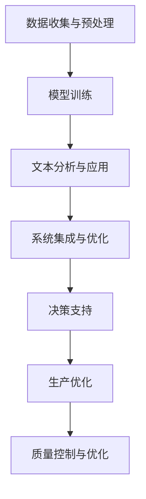

                 

关键词：语言模型，制造业，智能工厂，人工智能，工业4.0

> 摘要：本文探讨了语言模型（LLM）在制造业中的应用，特别是智能工厂的核心技术。通过分析LLM的基本原理及其与制造业的结合点，探讨了LLM如何提升制造过程的效率、灵活性和可持续性。文章还介绍了LLM在不同制造环节的具体应用案例，并展望了其未来的发展趋势和挑战。

## 1. 背景介绍

随着信息技术的快速发展，人工智能（AI）正逐渐渗透到各个行业，制造业也不例外。工业4.0的概念提出了将物联网（IoT）、大数据、云计算和人工智能等先进技术应用于制造业，实现制造过程的自动化、智能化和高度灵活。在这一背景下，语言模型（LLM）作为一种强大的AI工具，开始受到制造业的广泛关注。

LLM是指能够理解和生成自然语言文本的大型预训练语言模型。其基本原理是通过海量数据的学习，构建出能够模拟人类语言交流的模型。LLM在自然语言处理（NLP）领域取得了显著成果，如机器翻译、文本摘要、问答系统和对话机器人等。这些成功案例激发了人们将LLM应用于其他领域的兴趣，尤其是制造业。

制造业的智能化转型是一个复杂的系统工程，涉及多个环节，包括设计、生产、物流、质量控制和管理等。每个环节都需要处理大量的文本数据，如设计文档、生产指令、质量控制报告和管理报告等。这些数据不仅是生产过程的记录，也是优化制造流程、提高生产效率和质量的重要资源。因此，如何有效地利用这些文本数据，实现制造过程的智能化，是制造业面临的重要挑战。

LLM在制造业中的应用，可以通过以下几个方面实现：

1. **文本数据处理与理解**：利用LLM对大量的文本数据进行处理和理解，提取关键信息，辅助决策。
2. **自然语言交互**：通过LLM构建智能对话系统，实现人与机器的智能交互，提高操作效率。
3. **自动化编程**：利用LLM的生成能力，自动化生成代码，降低编程复杂度。
4. **质量控制与优化**：利用LLM对生产过程中的数据进行分析，识别潜在问题，提出优化建议。

本文将重点探讨LLM在制造业中的核心应用，通过具体案例展示其如何提升制造过程的效率、灵活性和可持续性。

## 2. 核心概念与联系

### 2.1 语言模型（LLM）的基本原理

语言模型（LLM）是基于深度学习的自然语言处理（NLP）工具，其主要目的是对自然语言文本进行建模，从而实现文本的生成、理解和分析。LLM的基本原理是通过训练大量的文本数据，学习语言的模式和规律，构建出一个能够预测下一个词或句子的模型。

LLM的训练过程通常包括以下几个步骤：

1. **数据收集与预处理**：收集海量的文本数据，如书籍、新闻、论坛帖子等，并进行预处理，包括分词、去噪、清洗等。
2. **词嵌入**：将文本数据中的每个词映射到一个固定维度的向量空间中，这些向量被称为词嵌入（word embeddings）。
3. **模型训练**：使用神经网络，如循环神经网络（RNN）、长短期记忆网络（LSTM）或变换器（Transformer），对词嵌入进行训练，使其能够预测下一个词或句子。
4. **优化与评估**：通过反向传播算法对模型进行优化，提高其预测准确性。使用多种评估指标，如准确率、损失函数等，对模型进行评估。

### 2.2 LLM在制造业中的应用架构

LLM在制造业中的应用架构可以分为以下几个层次：

1. **数据收集与预处理**：从制造过程中收集各类文本数据，包括设计文档、生产指令、质量控制报告等。对数据进行清洗、分词和标注等预处理操作，为LLM的训练提供高质量的数据集。

2. **模型训练**：使用预训练的语言模型框架，如BERT、GPT等，对预处理后的文本数据进行训练。训练过程中，模型会学习到文本中的语言模式、关系和规律，提高对文本的理解能力。

3. **文本分析与应用**：将训练好的LLM应用于制造过程中的文本数据，实现文本的生成、理解和分析。具体应用包括文本摘要、自然语言交互、自动化编程和质量控制等。

4. **系统集成与优化**：将LLM与其他制造系统（如ERP、MES等）集成，实现数据的互通与协同。通过不断的迭代优化，提升LLM在制造过程中的应用效果。

### 2.3 LLM与制造业的结合点

LLM与制造业的结合点主要体现在以下几个方面：

1. **文本数据的处理与理解**：制造过程中的各类文本数据（如设计文档、生产指令、质量控制报告等）是优化制造流程、提高生产效率和质量的重要资源。LLM能够对大量文本数据进行高效的处理和理解，提取关键信息，为决策提供支持。

2. **自然语言交互**：制造过程中的操作人员、工程师和管理人员需要与机器设备、软件系统进行交互。LLM构建的智能对话系统能够理解自然语言输入，生成自然语言输出，提高交互效率，减少操作复杂度。

3. **自动化编程**：制造过程中的编程任务通常涉及复杂的逻辑和规则。利用LLM的生成能力，可以自动化生成代码，降低编程复杂度，提高开发效率。

4. **质量控制与优化**：制造过程中会产生大量的数据，包括生产数据、质量数据、设备数据等。LLM能够对数据进行深度分析，识别潜在问题，提出优化建议，提高产品质量和生产效率。

### 2.4 Mermaid流程图

下面是LLM在制造业中的应用架构的Mermaid流程图：



## 3. 核心算法原理 & 具体操作步骤

### 3.1 算法原理概述

LLM在制造业中的应用主要基于其强大的自然语言处理能力。具体来说，LLM通过以下几个核心算法实现文本数据的处理、理解和应用：

1. **预训练**：LLM使用大规模文本数据进行预训练，学习语言的模式和规律。预训练过程中，模型会自动学习到文本中的语法、语义和上下文信息。
2. **文本生成**：通过预训练好的模型，LLM能够生成高质量的文本。文本生成过程通常基于序列到序列（Seq2Seq）模型，如Transformer架构。
3. **文本理解**：LLM能够对输入的文本进行深度理解，提取关键信息，生成语义表示。文本理解过程主要通过注意力机制和上下文嵌入实现。
4. **文本分析**：利用LLM的文本理解能力，可以实现对文本数据的分类、实体识别、关系抽取等操作。

### 3.2 算法步骤详解

1. **数据收集与预处理**：
   - 收集制造过程中的文本数据，如设计文档、生产指令、质量控制报告等。
   - 对数据进行清洗、分词和标注等预处理操作。

2. **模型训练**：
   - 选择合适的预训练语言模型框架，如BERT、GPT等。
   - 使用预处理后的文本数据进行模型训练，优化模型参数。

3. **文本生成**：
   - 输入特定的主题或提示，利用预训练好的模型生成相关的文本内容。
   - 可以使用不同的生成策略，如贪婪策略、采样策略等，生成不同风格和长度的文本。

4. **文本理解**：
   - 对输入的文本进行深度理解，提取关键信息。
   - 使用注意力机制和上下文嵌入，将文本映射到语义表示。

5. **文本分析**：
   - 利用文本理解结果，对文本数据进行分类、实体识别、关系抽取等操作。
   - 可以根据具体应用需求，设计相应的算法和模型。

### 3.3 算法优缺点

**优点**：

1. **强大的文本处理能力**：LLM能够高效地处理和理解大量文本数据，提取关键信息，为制造过程提供决策支持。
2. **灵活的文本生成能力**：LLM能够生成高质量的文本，满足不同应用场景的需求，如自然语言交互、自动化编程等。
3. **自适应性强**：LLM能够通过不断训练和学习，适应制造过程中的新需求和变化。

**缺点**：

1. **计算资源需求大**：LLM的训练和推理过程需要大量的计算资源，对硬件设备有较高要求。
2. **数据依赖性强**：LLM的性能很大程度上取决于训练数据的质量和数量，数据质量不高可能导致模型性能下降。
3. **解释性较弱**：LLM的决策过程基于黑箱模型，难以解释和理解，这在某些安全性和合规性要求较高的领域可能成为瓶颈。

### 3.4 算法应用领域

LLM在制造业中的应用领域广泛，包括但不限于以下几个方面：

1. **设计文档生成**：利用LLM的文本生成能力，自动化生成设计文档，提高设计效率。
2. **生产指令生成**：根据生产需求和条件，自动生成生产指令，降低操作复杂度。
3. **质量控制报告生成**：对生产过程中的数据进行分析，自动生成质量控制报告，提高质量监控效果。
4. **智能对话系统**：构建智能对话系统，实现人与机器的智能交互，提高操作效率。
5. **自动化编程**：利用LLM的生成能力，自动化生成代码，降低编程复杂度。
6. **生产优化与预测**：利用LLM对生产数据进行深度分析，实现生产过程的优化和预测。

## 4. 数学模型和公式 & 详细讲解 & 举例说明

### 4.1 数学模型构建

LLM的数学模型主要基于深度学习和自然语言处理的理论，主要包括以下几个方面：

1. **词嵌入（Word Embeddings）**：将文本数据中的每个词映射到一个固定维度的向量空间中。常用的词嵌入模型包括Word2Vec、GloVe等。

2. **循环神经网络（RNN）**：RNN是一种能够处理序列数据的神经网络，其通过隐藏状态实现序列到序列的映射。常用的RNN模型包括LSTM、GRU等。

3. **变换器（Transformer）**：Transformer是一种基于自注意力机制的深度学习模型，其通过多头自注意力机制实现文本的生成和理解。

4. **序列到序列模型（Seq2Seq）**：Seq2Seq模型是一种将一个序列映射到另一个序列的模型，常用于机器翻译、文本生成等任务。

### 4.2 公式推导过程

下面以Transformer模型为例，简单介绍其核心公式的推导过程：

1. **自注意力机制（Self-Attention）**：

   自注意力机制是Transformer模型的核心组成部分，其公式如下：

   $$ 
   \text{Attention}(Q, K, V) = \text{softmax}\left(\frac{QK^T}{\sqrt{d_k}}\right) V 
   $$

   其中，Q、K和V分别是查询向量、键向量和值向量，$d_k$是键向量的维度。

2. **多头自注意力（Multi-Head Attention）**：

   多头自注意力通过多个独立的自注意力机制实现，其公式如下：

   $$ 
   \text{Multi-Head Attention}(Q, K, V) = \text{Concat}(\text{head}_1, \text{head}_2, ..., \text{head}_h)W^O 
   $$

   其中，$h$是头数，$W^O$是输出权重矩阵。

3. **编码器（Encoder）和解码器（Decoder）**：

   Transformer模型包括编码器和解码器两个部分，其输入输出公式如下：

   $$ 
   E = \text{Encoder}(X) = \text{EncLayer}(X, mask) 
   $$

   $$ 
   D = \text{Decoder}(Y) = \text{DecLayer}(Y, E, mask) 
   $$

   其中，$X$和$Y$分别是编码器和解码器的输入序列，$E$和$D$分别是编码器和解码器的输出序列。

### 4.3 案例分析与讲解

以下是一个简单的Transformer模型训练案例：

1. **数据准备**：

   准备一个包含10000个单词的语料库，将每个单词映射到一个向量空间。

   ```python
   corpus = ['apple', 'banana', 'orange', 'apple', 'orange', 'apple']
   vocabulary = {'apple': 0, 'banana': 1, 'orange': 2}
   ```

2. **模型初始化**：

   初始化编码器和解码器模型，设置参数。

   ```python
   import tensorflow as tf

   d_model = 512
   num_heads = 8
   dff = 2048

   encoder_inputs = tf.keras.layers.Input(shape=(None, d_model))
   decoder_inputs = tf.keras.layers.Input(shape=(None, d_model))

   encoder = tf.keras.layers.Embedding(input_dim=len(vocabulary), output_dim=d_model)(encoder_inputs)
   decoder = tf.keras.layers.Embedding(input_dim=len(vocabulary), output_dim=d_model)(decoder_inputs)
   ```

3. **编码器构建**：

   构建编码器模型，包括多头自注意力和前馈神经网络。

   ```python
   enc_output = encoder

   for _ in range(num_encoder_layers):
       enc_output = EncoderLayer(d_model, num_heads, dff)(enc_output)

   enc_output = tf.keras.layers.Dense(d_model)(enc_output)
   ```

4. **解码器构建**：

   构建解码器模型，包括多头自注意力、编码器解码器注意力和对

