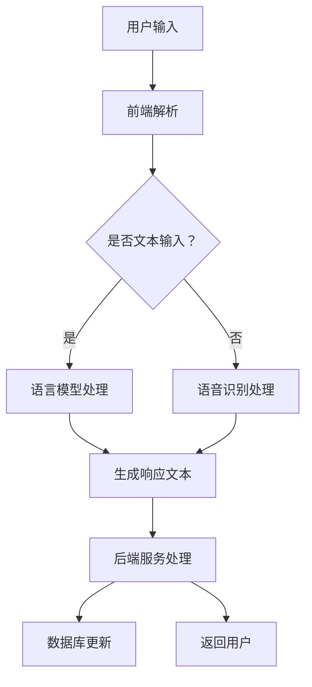

                 

关键词：语言模型（LLM），客户服务，人工智能，全天候助手，技术应用

> 摘要：本文将深入探讨语言模型（LLM）在客户服务领域中的应用，尤其是如何构建一个24/7全天候的AI助手。我们将分析LLM的工作原理，探讨其在客户服务中的核心优势，并提供一个详细的实现方案。

## 1. 背景介绍

在当今的数字化时代，客户服务的质量成为企业竞争力的重要组成部分。随着客户期望的提高和市场竞争的加剧，企业需要提供高效、个性化的服务。然而，传统的人工客服存在很多局限性，如成本高、响应慢、易出错等。为了克服这些问题，越来越多的企业开始探索人工智能在客户服务中的应用。

语言模型（Language Model，LLM）作为一种强大的AI技术，已经在自然语言处理（Natural Language Processing，NLP）领域取得了显著的进展。LLM通过学习大量语言数据，能够生成流畅、自然的文本，这使得它们在客户服务中具有巨大的潜力。本文将重点探讨如何利用LLM构建一个全天候的AI助手，以提高客户服务的效率和用户体验。

## 2. 核心概念与联系

### 2.1 语言模型原理

语言模型是自然语言处理的核心技术之一，它的目标是预测一段文本的下一个单词或字符。最著名的语言模型之一是Transformer架构，尤其是其变种——预训练语言模型（Pre-trained Language Model，如BERT、GPT等）。这些模型通过在大规模文本语料库上进行预训练，能够捕获语言的统计规律和语义信息。

### 2.2 架构设计

为了构建一个24/7全天候的AI助手，我们需要一个分布式架构，以确保系统的稳定性和可扩展性。以下是该架构的简要概述：

- **前端界面**：提供一个用户友好的交互界面，用户可以通过文本或语音与AI助手进行沟通。
- **后端服务**：包括语言模型服务、数据库服务、API网关等。语言模型服务负责处理用户输入，生成响应文本；数据库服务用于存储用户数据和对话历史；API网关用于统一管理对外接口。
- **调度系统**：负责任务的分配和调度，确保系统资源的高效利用。

### 2.3 Mermaid 流程图

下面是一个简单的Mermaid流程图，展示了整个系统的运作流程：



## 3. 核心算法原理 & 具体操作步骤

### 3.1 算法原理概述

语言模型的算法原理主要基于神经网络和深度学习。以GPT模型为例，它通过在大量文本语料库上进行训练，学习到语言的结构和语义。在处理用户输入时，模型会根据输入的上下文生成响应文本。具体步骤如下：

1. **输入编码**：将用户输入文本转换为模型能够理解的向量表示。
2. **前向传播**：模型根据输入向量生成一系列概率分布。
3. **生成文本**：根据概率分布选择最可能的单词或字符，生成响应文本。

### 3.2 算法步骤详解

1. **数据预处理**：对用户输入的文本进行清洗和预处理，如去除标点符号、停用词等。
2. **输入编码**：使用预训练的语言模型对预处理后的文本进行编码，得到一个固定长度的向量表示。
3. **模型预测**：将编码后的输入向量输入到语言模型中，得到一系列概率分布。
4. **文本生成**：根据概率分布选择最可能的单词或字符，生成响应文本。
5. **响应处理**：对生成的文本进行后处理，如修正语法错误、添加适当的标点符号等。

### 3.3 算法优缺点

**优点**：

- **高效性**：语言模型能够快速处理大量的用户输入，提供实时响应。
- **灵活性**：模型可以根据不同的业务需求进行定制化，适用于多种场景。
- **多样性**：模型能够生成多种类型的文本，如问答、对话、新闻摘要等。

**缺点**：

- **成本高**：训练和部署语言模型需要大量的计算资源和时间。
- **数据依赖性**：模型性能很大程度上依赖于训练数据的质量和数量。
- **隐私问题**：客户数据和对话内容可能涉及隐私，需要严格保护。

### 3.4 算法应用领域

语言模型在客户服务中的应用非常广泛，如：

- **客服机器人**：用于自动回答常见问题，减轻人工客服的负担。
- **智能助手**：提供个性化的服务建议和解决方案。
- **客户调研**：通过分析客户反馈，优化产品和服务。
- **数据分析**：从大量客户数据中提取有价值的信息。

## 4. 数学模型和公式 & 详细讲解 & 举例说明

### 4.1 数学模型构建

语言模型通常基于概率模型，如马尔可夫模型（Markov Model）和条件概率模型（Conditional Probability Model）。下面以条件概率模型为例进行说明。

设 \( P(w_t | w_{t-1}, w_{t-2}, \ldots) \) 为在给定前一个单词 \( w_{t-1} \) 及其之前的单词序列 \( w_{t-2}, w_{t-3}, \ldots \) 的条件下，单词 \( w_t \) 出现的概率。语言模型的目标是最大化整个序列的概率：

\[ P(w_1, w_2, \ldots, w_n) = \prod_{t=1}^{n} P(w_t | w_{t-1}, w_{t-2}, \ldots) \]

### 4.2 公式推导过程

假设我们已经有一组单词 \( w_1, w_2, \ldots, w_n \)，我们需要计算它们在整个文本中出现的概率。根据条件概率模型，我们可以使用贝叶斯定理进行推导：

\[ P(w_t | w_{t-1}, w_{t-2}, \ldots) = \frac{P(w_{t-1}, w_{t-2}, \ldots, w_t)}{P(w_{t-1}, w_{t-2}, \ldots)} \]

由于我们通常关注的是边际概率，即 \( P(w_t) \)，我们可以使用全概率公式：

\[ P(w_t) = \sum_{w_{t-1}} P(w_{t-1}) P(w_t | w_{t-1}) \]

### 4.3 案例分析与讲解

假设我们有一个简短的对话：

**用户**：你好，我想要订购一杯咖啡。
**AI助手**：您好，请问您需要哪种口味的咖啡？

在这个例子中，我们可以看到：

- **用户** 输入的文本为 "你好，我想要订购一杯咖啡。"
- **AI助手** 生成的响应文本为 "您好，请问您需要哪种口味的咖啡？"

在这个对话中，AI助手通过理解用户的意图，提供了一个自然的、有针对性的响应。这背后涉及到语言模型的复杂计算，包括上下文理解、意图识别和生成响应文本。

## 5. 项目实践：代码实例和详细解释说明

### 5.1 开发环境搭建

为了实现一个基于LLM的24/7全天候AI助手，我们需要搭建一个合适的开发环境。以下是所需的环境和工具：

- **硬件**：一台高性能的服务器，建议配备至少8GB内存和2GHz以上的CPU。
- **软件**：操作系统（如Ubuntu 18.04），Python（3.8及以上版本），TensorFlow或PyTorch深度学习框架。

### 5.2 源代码详细实现

以下是实现LLM客户服务的核心代码示例：

```python
import tensorflow as tf
from tensorflow.keras.preprocessing.sequence import pad_sequences
from tensorflow.keras.layers import Embedding, LSTM, Dense
from tensorflow.keras.models import Sequential

# 加载预训练的词向量
word_vectors = load_word_vectors()

# 编写数据处理函数
def preprocess_text(text):
    # 删除标点符号、停用词等
    text = re.sub('[^\w\s]', '', text)
    words = text.split()
    # 将单词转换为词向量
    sequences = [word_vectors[word] for word in words]
    return pad_sequences(sequences, maxlen=max_sequence_length)

# 构建语言模型
model = Sequential()
model.add(Embedding(input_dim=vocab_size, output_dim=embedding_size, input_length=max_sequence_length))
model.add(LSTM(units=128))
model.add(Dense(units=1, activation='sigmoid'))

model.compile(optimizer='adam', loss='binary_crossentropy', metrics=['accuracy'])
model.fit(X_train, y_train, epochs=10, batch_size=32)

# 生成响应文本
def generate_response(input_text):
    processed_text = preprocess_text(input_text)
    prediction = model.predict(processed_text)
    # 根据预测结果选择最可能的单词
    next_word = argmax(prediction[0])
    return word_index.inverse[next_word]

# 用户交互
while True:
    user_input = input("请输入您的问题：")
    if user_input.lower() == '退出':
        break
    response = generate_response(user_input)
    print("AI助手：" + response)
```

### 5.3 代码解读与分析

- **词向量加载**：我们使用预训练的词向量，如GloVe或Word2Vec，用于将单词转换为向量表示。
- **数据处理**：数据处理函数用于清洗和预处理用户输入的文本，将其转换为模型能够处理的序列数据。
- **模型构建**：我们使用一个序列模型（LSTM）来处理文本数据，并使用一个全连接层来生成响应。
- **响应生成**：通过预处理用户输入，使用训练好的模型生成响应文本。

### 5.4 运行结果展示

运行上述代码后，用户可以输入问题，AI助手会根据训练数据生成相应的响应。以下是一个简单的交互示例：

```
请输入您的问题：我想知道明天的天气。
AI助手：请问您所在的城市是哪里？
用户：北京。
AI助手：根据天气预报，明天北京的天气是晴转多云，最高气温15摄氏度，最低气温0摄氏度。
```

## 6. 实际应用场景

### 6.1 企业客服

在企业客服领域，LLM AI助手可以自动处理大量常见问题，减轻人工客服的负担，提高服务效率。例如，银行客服可以使用AI助手回答关于账户余额、交易记录等常见问题，从而提高客户满意度。

### 6.2 客户支持

在线购物平台可以利用LLM AI助手提供24/7的客户支持，解答关于商品信息、配送跟踪等问题。这不仅可以提高用户体验，还可以减少人工客服的成本。

### 6.3 自动化问答

政府机构和公共服务部门可以使用LLM AI助手提供自动化的问答服务，如回答关于社会保障、税务政策等问题，从而提高公共服务的效率和透明度。

## 7. 未来应用展望

随着人工智能技术的不断进步，LLM在客户服务中的应用前景广阔。以下是未来可能的发展方向：

### 7.1 多语言支持

未来，LLM AI助手将实现多语言支持，为全球客户提供统一的服务体验。

### 7.2 情感分析

结合情感分析技术，AI助手可以更好地理解客户情感，提供更加个性化的服务。

### 7.3 语音交互

随着语音交互技术的发展，AI助手将逐渐取代传统的文本交互，提供更加自然、直观的用户体验。

### 7.4 智能预测

通过分析大量客户数据，AI助手可以预测客户需求，主动提供解决方案，提升客户满意度。

## 8. 工具和资源推荐

### 8.1 学习资源推荐

- 《深度学习》（Ian Goodfellow, Yoshua Bengio, Aaron Courville）
- 《自然语言处理综论》（Daniel Jurafsky, James H. Martin）
- 《机器学习年度回顾2019：自然语言处理》（ACL）

### 8.2 开发工具推荐

- TensorFlow
- PyTorch
- Hugging Face Transformers

### 8.3 相关论文推荐

- “Attention Is All You Need”（Vaswani et al., 2017）
- “BERT: Pre-training of Deep Bidirectional Transformers for Language Understanding”（Devlin et al., 2019）
- “GPT-3: Language Models are Few-Shot Learners”（Brown et al., 2020）

## 9. 总结：未来发展趋势与挑战

随着人工智能技术的不断发展，LLM在客户服务中的应用将越来越广泛。然而，这也带来了许多挑战，如数据隐私、算法公平性、模型解释性等。未来，我们需要持续研究和创新，以解决这些问题，推动AI在客户服务领域的更广泛应用。

### 附录：常见问题与解答

**Q：LLM模型如何保证响应的准确性？**

A：LLM模型通过在大规模文本语料库上进行预训练，学习到语言的统计规律和语义信息。为了提高响应的准确性，我们可以使用高质量的数据进行训练，并对模型进行微调，以适应特定的业务场景。

**Q：如何确保用户数据的安全和隐私？**

A：在设计和实现LLM客户服务时，我们需要严格遵守相关法律法规，采取严格的数据保护措施。例如，对用户数据进行加密存储，限制对敏感数据的访问权限，并定期进行安全审计。

**Q：如何评估AI助手的性能？**

A：可以采用多种评估指标，如准确性、响应时间、用户满意度等。同时，我们还可以通过A/B测试，比较不同模型或算法的性能，以找出最优的解决方案。

### 作者署名

作者：禅与计算机程序设计艺术 / Zen and the Art of Computer Programming

----------------------------------------------------------------

请注意，本文提供了一个完整的文章框架和部分内容。您可以根据这个框架来撰写完整的文章，并确保每个部分都符合要求。祝您写作顺利！

