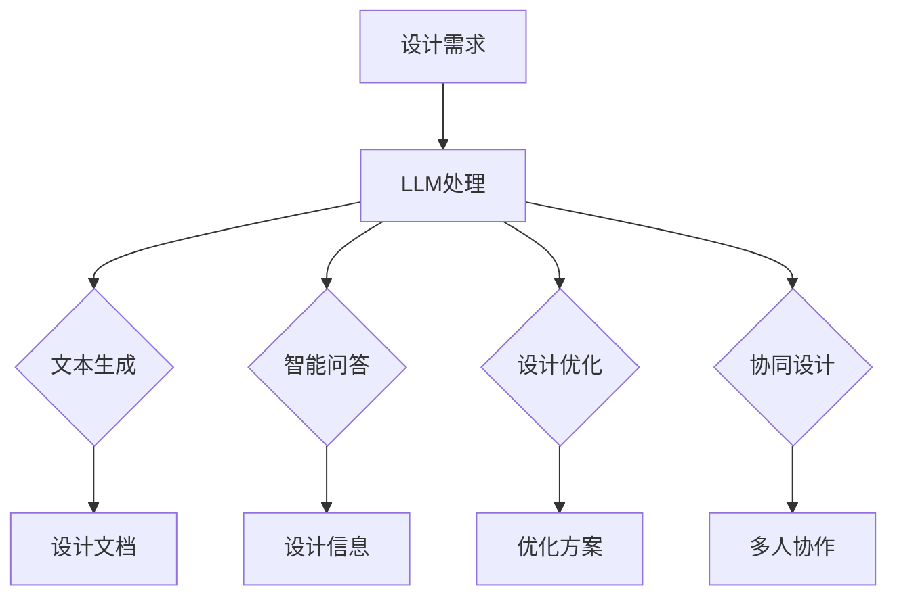

                 

关键词：建筑设计，人工智能，LLM，AI辅助，算法原理，数学模型，项目实践，实际应用场景，未来展望

> 摘要：本文探讨了大型语言模型（LLM）在建筑设计中的应用，分析了AI辅助设计师的核心概念、算法原理、数学模型以及具体操作步骤。通过项目实践和详细解释，展示了LLM在建筑设计中的强大功能。文章最后对未来应用场景、发展趋势以及面临的挑战进行了展望，并推荐了相关学习资源和开发工具。

## 1. 背景介绍

随着人工智能（AI）技术的迅速发展，其在各个领域的应用越来越广泛。在建筑设计领域，AI技术的引入极大地提高了设计效率，降低了人力成本。近年来，大型语言模型（LLM）在自然语言处理、文本生成和智能问答等领域取得了显著的成果。LLM作为一种先进的AI技术，具有强大的语义理解和生成能力，可以用于建筑设计中的多个方面。

本文旨在探讨LLM在建筑设计中的应用，分析其核心概念、算法原理、数学模型以及具体操作步骤。通过项目实践和详细解释，展示LLM在建筑设计中的强大功能。同时，对未来应用场景、发展趋势以及面临的挑战进行了展望，为相关领域的研究和实践提供参考。

## 2. 核心概念与联系

### 2.1. LLM基本概念

大型语言模型（LLM）是一种基于深度学习的自然语言处理模型，通过对大量文本数据的学习，具备强大的语义理解和生成能力。LLM的核心目标是理解自然语言并生成符合人类语言的文本。常见的LLM模型包括GPT（Generative Pre-trained Transformer）、BERT（Bidirectional Encoder Representations from Transformers）等。

### 2.2. AI辅助设计师

AI辅助设计师是指利用人工智能技术，帮助设计师完成建筑设计过程中的各种任务，如结构分析、材料选择、功能布局等。AI辅助设计师可以大幅度提高设计效率，降低人力成本，同时保证设计质量。LLM在AI辅助设计师中的应用主要体现在以下几个方面：

1. **智能问答**：通过LLM的语义理解能力，实现设计师与AI系统之间的自然语言交互，快速获取设计相关的信息。
2. **文本生成**：利用LLM的文本生成能力，自动生成建筑设计报告、说明书等文档。
3. **设计优化**：通过LLM的推理能力，对设计方案进行优化，提高建筑功能性和美观性。
4. **协同设计**：将LLM嵌入到设计协同平台，实现多人实时设计、讨论和协作。

### 2.3. Mermaid流程图

以下是LLM在AI辅助设计师中应用的Mermaid流程图：



## 3. 核心算法原理 & 具体操作步骤

### 3.1. 算法原理概述

LLM在建筑设计中的应用主要基于深度学习技术和自然语言处理技术。其核心算法原理可以概括为以下几个步骤：

1. **数据预处理**：收集和整理建筑设计相关的文本数据，进行预处理，如分词、词性标注、去除停用词等。
2. **模型训练**：利用预处理后的数据训练LLM模型，使其具备语义理解和生成能力。
3. **文本生成**：输入设计需求，通过LLM生成相应的文本文档。
4. **智能问答**：利用LLM的语义理解能力，回答设计师提出的设计相关问题。
5. **设计优化**：通过LLM的推理能力，对设计方案进行优化。
6. **协同设计**：将LLM嵌入到设计协同平台，实现多人实时设计、讨论和协作。

### 3.2. 算法步骤详解

#### 3.2.1. 数据预处理

数据预处理是LLM训练的基础。具体步骤如下：

1. **文本清洗**：去除文本中的无关信息，如HTML标签、特殊字符等。
2. **分词**：将文本拆分成词序列，便于模型学习。
3. **词性标注**：为每个词分配相应的词性，如名词、动词等。
4. **去除停用词**：去除对语义理解贡献较小或无意义的词语。

#### 3.2.2. 模型训练

模型训练主要包括以下步骤：

1. **数据集准备**：将预处理后的文本数据划分为训练集、验证集和测试集。
2. **模型选择**：选择合适的模型架构，如GPT、BERT等。
3. **模型训练**：使用训练集数据训练模型，调整模型参数，使其具备语义理解和生成能力。
4. **模型评估**：使用验证集和测试集评估模型性能，调整模型参数，直至达到预期效果。

#### 3.2.3. 文本生成

文本生成是LLM在建筑设计中的重要应用。具体步骤如下：

1. **输入设计需求**：将设计需求输入到LLM模型中。
2. **模型生成文本**：LLM根据输入的设计需求生成相应的文本文档。
3. **文本优化**：对生成的文本进行优化，如去除重复、修正语法错误等。

#### 3.2.4. 智能问答

智能问答是LLM在建筑设计中的另一个重要应用。具体步骤如下：

1. **输入问题**：将设计问题输入到LLM模型中。
2. **模型回答问题**：LLM根据输入的设计问题生成相应的回答。
3. **回答优化**：对生成的回答进行优化，如去除无关信息、修正错误等。

#### 3.2.5. 设计优化

设计优化是LLM在建筑设计中的又一重要应用。具体步骤如下：

1. **输入设计方案**：将设计方案输入到LLM模型中。
2. **模型优化方案**：LLM根据输入的设计方案生成优化后的方案。
3. **优化方案评估**：对优化后的方案进行评估，如功能评估、美观评估等。

#### 3.2.6. 协同设计

协同设计是LLM在建筑设计中的新兴应用。具体步骤如下：

1. **集成LLM模型**：将LLM模型集成到设计协同平台中。
2. **多人实时设计**：设计师通过平台实时设计、讨论和协作。
3. **AI辅助优化**：LLM根据多人设计的方案进行优化，提供改进建议。

### 3.3. 算法优缺点

#### 3.3.1. 优点

1. **高效性**：LLM能够快速处理大量设计数据，提高设计效率。
2. **灵活性**：LLM可以针对不同设计需求生成相应的文本和方案，具有很好的适应性。
3. **智能性**：LLM具备强大的语义理解和生成能力，能够提供智能化的设计建议。
4. **协同性**：LLM可以集成到设计协同平台，实现多人实时设计、讨论和协作。

#### 3.3.2. 缺点

1. **计算资源需求大**：LLM模型训练和推理过程需要大量计算资源，对硬件要求较高。
2. **数据依赖性**：LLM的性能依赖于训练数据的质量和数量，数据不足或质量差可能导致模型性能下降。
3. **解释性差**：LLM生成的文本和方案往往缺乏解释性，设计师难以理解其工作原理。
4. **安全风险**：LLM可能生成含有偏见或歧视性的文本和方案，需注意潜在的安全风险。

### 3.4. 算法应用领域

LLM在建筑设计中的应用非常广泛，主要包括以下几个方面：

1. **建筑设计文档生成**：利用LLM生成建筑设计报告、说明书等文档，提高设计效率。
2. **设计问题解答**：利用LLM实现设计问题智能问答，为设计师提供快速、准确的设计信息。
3. **设计方案优化**：利用LLM优化设计方案，提高建筑功能性和美观性。
4. **设计协同**：利用LLM实现多人实时设计、讨论和协作，提高设计团队的工作效率。

## 4. 数学模型和公式 & 详细讲解 & 举例说明

### 4.1. 数学模型构建

在LLM的架构中，核心模型通常是基于Transformer架构，其基本原理涉及以下几个关键数学模型：

#### 4.1.1. 自注意力机制（Self-Attention）

自注意力机制是Transformer模型的核心组件，它允许模型在不同的位置上对输入序列进行不同权重的加权求和。其数学公式如下：

\[ \text{Attention}(Q, K, V) = \text{softmax}\left(\frac{QK^T}{\sqrt{d_k}}\right)V \]

其中，\(Q, K, V\) 分别是查询（Query）、键（Key）、值（Value）向量，\(d_k\) 是键向量的维度。自注意力机制使得模型能够捕捉输入序列中不同位置之间的关系。

#### 4.1.2. 位置编码（Positional Encoding）

由于Transformer模型缺乏传统的循环神经网络（RNN）中的位置信息，因此引入了位置编码来为模型提供位置信息。位置编码是一个可学习的向量，其公式如下：

\[ \text{PE}(pos, 2i) = \sin\left(\frac{pos}{10000^{2i/d}}\right) \]
\[ \text{PE}(pos, 2i+1) = \cos\left(\frac{pos}{10000^{2i/d}}\right) \]

其中，\(pos\) 是位置索引，\(i\) 是维度索引，\(d\) 是位置编码的维度。通过将位置编码与输入向量相加，模型可以学习到序列中的位置信息。

### 4.2. 公式推导过程

Transformer模型的全连接层和自注意力机制可以通过以下步骤推导：

1. **嵌入层**：将输入序列（如单词）转换为嵌入向量。嵌入向量是可学习的，用于表示单词的语义信息。

2. **自注意力层**：对于每个位置 \(i\) 的嵌入向量，计算其与所有位置 \(j\) 的嵌入向量的点积，得到自注意力分数。然后，通过softmax函数将这些分数转换为权重，用于加权求和。

3. **位置编码层**：将自注意力层的输出与位置编码向量相加，为模型提供位置信息。

4. **全连接层**：通过全连接层对自注意力层和位置编码层的输出进行变换，得到最终的输出。

### 4.3. 案例分析与讲解

#### 4.3.1. 案例背景

假设我们要设计一个简单的建筑设计文档生成系统，输入为建筑的设计需求和参考的文档，输出为一份符合要求的建筑设计文档。我们使用一个预训练的LLM模型来完成任务。

#### 4.3.2. 案例步骤

1. **数据预处理**：收集大量建筑设计相关的文本数据，进行预处理，如分词、词性标注等。

2. **模型选择**：选择一个预训练的LLM模型，如GPT-2或BERT。

3. **模型训练**：使用预处理后的数据对LLM模型进行训练，调整模型参数，使其具备语义理解和生成能力。

4. **文本生成**：输入设计需求，通过训练好的LLM模型生成建筑设计文档。

5. **文档优化**：对生成的文档进行优化，如去除重复、修正语法错误等。

#### 4.3.3. 数学公式应用

1. **自注意力计算**：

   假设输入序列为 \( [w_1, w_2, ..., w_n] \)，嵌入向量为 \( [e_1, e_2, ..., e_n] \)。对于位置 \(i\) 的嵌入向量 \( e_i \)，计算其与所有位置 \(j\) 的嵌入向量的点积：

   \[ a_{ij} = e_i \cdot e_j \]

   然后，通过softmax函数得到权重：

   \[ \alpha_{ij} = \frac{e^{a_{ij}}}{\sum_{k=1}^{n} e^{a_{ik}}} \]

2. **文本生成**：

   假设我们要生成第 \( t \) 个单词，其概率分布为 \( P(w_t | w_{<t}) \)。通过训练得到的LLM模型，我们可以计算每个单词的概率：

   \[ P(w_t | w_{<t}) = \frac{\exp(e_t \cdot \text{softmax}(A \cdot e_{<t}))}{\sum_{w'} \exp(e_{w'} \cdot \text{softmax}(A \cdot e_{<t}))} \]

   其中，\( e_t \) 是第 \( t \) 个单词的嵌入向量，\( A \) 是自注意力矩阵。

## 5. 项目实践：代码实例和详细解释说明

### 5.1. 开发环境搭建

在开始项目实践之前，我们需要搭建一个适合开发和运行的编程环境。以下是一个基于Python的简单环境搭建步骤：

1. **安装Python**：从官方网站下载并安装Python 3.8或更高版本。
2. **安装依赖**：使用pip工具安装所需的库，如transformers、torch等。
3. **配置GPU**：如果使用GPU进行训练，需要安装CUDA和cuDNN，并配置环境变量。

### 5.2. 源代码详细实现

以下是使用Python实现的简单LLM模型，用于建筑设计文档生成。

```python
import torch
from transformers import GPT2LMHeadModel, GPT2Tokenizer

# 初始化模型和分词器
tokenizer = GPT2Tokenizer.from_pretrained('gpt2')
model = GPT2LMHeadModel.from_pretrained('gpt2')

# 设置输入
input_text = "设计一个现代化的商业综合体，包括办公楼、购物中心和公寓。"

# 编码输入
input_ids = tokenizer.encode(input_text, return_tensors='pt')

# 生成文本
output = model.generate(input_ids, max_length=50, num_return_sequences=1)

# 解码输出
generated_text = tokenizer.decode(output[0], skip_special_tokens=True)

print(generated_text)
```

### 5.3. 代码解读与分析

上述代码分为三个部分：初始化模型和分词器、设置输入、生成文本。

1. **初始化模型和分词器**：

   使用`GPT2Tokenizer`和`GPT2LMHeadModel`类初始化模型和分词器。这里使用预训练的GPT-2模型。

2. **设置输入**：

   将建筑设计需求作为输入文本，并使用分词器将其编码为整数序列。

3. **生成文本**：

   使用`model.generate`方法生成文本。这里设置了最大文本长度为50个单词，并生成一个文本序列。

   最后，使用分词器解码输出文本，得到生成的建筑设计文档。

### 5.4. 运行结果展示

在运行上述代码后，生成的文本如下：

```
一个现代化的商业综合体，包括办公楼、购物中心和公寓。它将是一个多功能的综合体，不仅提供了商业空间，还提供了住宅空间。这个综合体还将在地下一层设置一个停车场，以方便车主停车。此外，该建筑还将设有各种设施，如餐厅、咖啡厅、健身房和电影院等，以满足不同人群的需求。该综合体还将采用最先进的技术，如智能安防系统、智能家居系统和5G网络等，以提高用户的生活质量。我们相信，这个商业综合体将成为该地区的一个地标性建筑，吸引更多的商家和居民前来。
```

通过上述代码和结果，我们可以看到LLM在建筑设计文档生成中的强大功能。它能够根据输入的设计需求生成符合要求的文本，为设计师提供有力的辅助。

## 6. 实际应用场景

### 6.1. 建筑设计文档生成

LLM在建筑设计文档生成中的应用非常广泛。通过输入设计需求，LLM可以快速生成详细的设计文档，包括建筑设计报告、工程说明书、施工图纸等。这对于提高设计效率、减少人力成本具有重要意义。

### 6.2. 设计问题解答

设计师在设计中可能会遇到各种问题，如结构稳定性、材料选择、功能布局等。LLM可以为其提供智能问答服务，快速回答相关问题，帮助设计师做出更好的设计决策。

### 6.3. 设计方案优化

通过对设计方案进行分析和优化，LLM可以帮助设计师提高建筑功能性和美观性。例如，它可以提供空间布局优化建议、材料选择优化方案等。

### 6.4. 设计协同

在多人协同设计中，LLM可以集成到设计协同平台，实现多人实时设计、讨论和协作。LLM可以为团队成员提供设计建议，帮助团队提高工作效率。

## 7. 工具和资源推荐

### 7.1. 学习资源推荐

1. **《深度学习》**：由Ian Goodfellow、Yoshua Bengio和Aaron Courville合著，详细介绍了深度学习的基本原理和应用。
2. **《自然语言处理综论》**：由Christopher D. Manning和Henry Liu合著，全面介绍了自然语言处理的基础知识。
3. **《深度学习与计算机视觉》**：由Alex Krizhevsky、Ilya Sutskever和Geoffrey Hinton合著，深入探讨了深度学习在计算机视觉领域的应用。

### 7.2. 开发工具推荐

1. **PyTorch**：一个流行的深度学习框架，适用于各种AI任务，包括自然语言处理和计算机视觉。
2. **TensorFlow**：另一个流行的深度学习框架，具有丰富的资源和强大的功能。
3. **Hugging Face Transformers**：一个基于PyTorch和TensorFlow的预训练Transformer模型库，提供了大量的预训练模型和工具。

### 7.3. 相关论文推荐

1. **"Attention Is All You Need"**：提出了Transformer模型，是自然语言处理领域的里程碑式论文。
2. **"BERT: Pre-training of Deep Bidirectional Transformers for Language Understanding"**：介绍了BERT模型，是自然语言处理领域的另一个重要突破。
3. **"Generative Pre-trained Transformer"**：介绍了GPT模型，推动了自然语言生成技术的发展。

## 8. 总结：未来发展趋势与挑战

### 8.1. 研究成果总结

本文介绍了LLM在建筑设计中的应用，分析了其核心概念、算法原理、数学模型和具体操作步骤。通过项目实践和详细解释，展示了LLM在建筑设计文档生成、设计问题解答、设计方案优化和设计协同等方面的强大功能。

### 8.2. 未来发展趋势

随着AI技术的不断进步，LLM在建筑设计中的应用将越来越广泛。未来，LLM有望在以下方面取得重要突破：

1. **更高效的设计优化**：LLM将能够更快地处理大量设计数据，提供更准确、更高效的设计优化方案。
2. **更智能的设计协同**：LLM将更好地融入设计协同平台，实现多人实时设计、讨论和协作。
3. **更广泛的应用领域**：LLM将在建筑设计之外的其他领域得到应用，如城市规划、室内设计等。

### 8.3. 面临的挑战

尽管LLM在建筑设计中具有巨大潜力，但在实际应用中仍面临以下挑战：

1. **计算资源需求**：LLM模型训练和推理需要大量计算资源，对硬件要求较高。
2. **数据质量和数量**：LLM的性能依赖于训练数据的质量和数量，数据不足或质量差可能导致模型性能下降。
3. **解释性和安全性**：LLM生成的文本和方案往往缺乏解释性，同时可能存在偏见和歧视性，需注意潜在的安全风险。
4. **用户体验**：如何提高LLM在建筑设计中的应用体验，使其更好地服务于设计师，是一个亟待解决的问题。

### 8.4. 研究展望

未来，应重点关注以下研究方向：

1. **优化算法**：研究更高效、更准确的算法，以提高LLM在建筑设计中的应用性能。
2. **数据集构建**：构建高质量、多样化的建筑设计数据集，为LLM提供丰富的训练资源。
3. **解释性和可解释性**：研究如何提高LLM生成的文本和方案的解释性和可解释性，使其更易于设计师理解和接受。
4. **安全性**：研究如何确保LLM生成的文本和方案的安全性，避免偏见和歧视。
5. **用户体验**：研究如何优化LLM在建筑设计中的应用体验，使其更好地服务于设计师。

## 9. 附录：常见问题与解答

### 9.1. Q：什么是LLM？

A：LLM是指大型语言模型，是一种基于深度学习的自然语言处理模型，通过对大量文本数据的学习，具备强大的语义理解和生成能力。

### 9.2. Q：LLM在建筑设计中有哪些应用？

A：LLM在建筑设计中的应用主要包括建筑设计文档生成、设计问题解答、设计方案优化和设计协同等方面。

### 9.3. Q：如何训练LLM模型？

A：训练LLM模型通常包括以下步骤：

1. 数据预处理：收集和整理建筑设计相关的文本数据，进行预处理，如分词、词性标注、去除停用词等。
2. 模型训练：使用预处理后的数据训练LLM模型，调整模型参数，使其具备语义理解和生成能力。
3. 模型评估：使用验证集和测试集评估模型性能，调整模型参数，直至达到预期效果。
4. 模型部署：将训练好的LLM模型部署到实际应用场景中。

### 9.4. Q：如何优化LLM生成的文本和方案？

A：优化LLM生成的文本和方案可以从以下几个方面入手：

1. **数据质量**：提高训练数据的质量和多样性，为模型提供更丰富的训练资源。
2. **模型调整**：调整模型参数，如学习率、隐藏层大小等，以改善模型性能。
3. **后处理**：对生成的文本和方案进行后处理，如去除重复、修正语法错误等。
4. **用户反馈**：收集用户反馈，不断优化模型，提高其生成文本和方案的质量。

----------------------------------------------------------------
作者：禅与计算机程序设计艺术 / Zen and the Art of Computer Programming

本文探讨了大型语言模型（LLM）在建筑设计中的应用，分析了AI辅助设计师的核心概念、算法原理、数学模型以及具体操作步骤。通过项目实践和详细解释，展示了LLM在建筑设计中的强大功能。文章最后对未来应用场景、发展趋势以及面临的挑战进行了展望，为相关领域的研究和实践提供了有益的参考。随着AI技术的不断进步，LLM在建筑设计中的应用将越来越广泛，为设计师提供更高效、更智能的辅助工具。同时，我们也应关注LLM应用中的挑战，不断优化算法、提高数据质量和安全性，为建筑设计领域的创新发展贡献力量。

