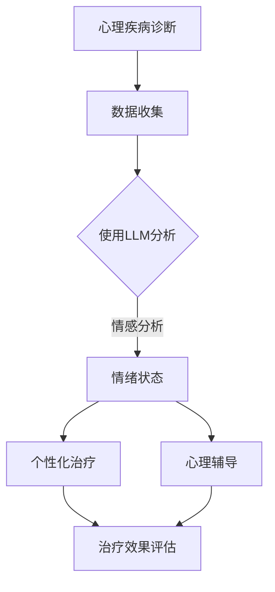
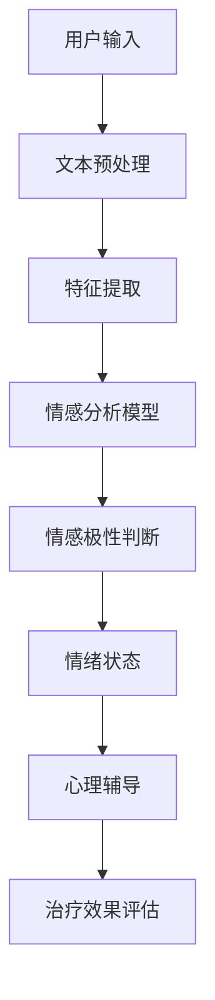

                 

关键词：LLM，心理健康，人工智能，情感分析，自然语言处理，AI辅导，AI治疗，情绪管理，心理疾病诊断

> 摘要：随着人工智能技术的迅猛发展，大型语言模型（LLM）逐渐成为心理健康领域的有力工具。本文旨在探讨LLM在心理健康中的应用，包括AI辅导和治疗方面的具体实践，以及其在情感分析和自然语言处理领域的优势。我们将深入分析LLM的原理，展示其在心理健康领域的实际应用案例，并探讨其未来发展趋势与挑战。

## 1. 背景介绍

心理健康问题在全球范围内日益受到关注。据世界卫生组织（WHO）统计，全球有超过3亿人患有抑郁症，而焦虑症和物质滥用等心理问题的患者也不断增加。然而，心理健康的诊断和治疗仍然面临诸多挑战，如心理医生的数量不足、治疗资源分布不均以及患者对于心理治疗的社会偏见等。人工智能（AI）的崛起为解决这些问题提供了新的可能性。

近年来，大型语言模型（LLM）如GPT-3、BERT和T5等取得了显著的进展，这些模型在自然语言处理（NLP）任务中表现优异。LLM能够理解、生成和翻译自然语言，这使得它们在心理健康领域的应用变得非常有前景。LLM不仅可以提供个性化的心理辅导，还能辅助心理医生进行诊断和治疗。

本文将重点关注LLM在心理健康领域的应用，包括AI辅导和治疗的各个方面。首先，我们将介绍LLM的基本原理，然后讨论其在情感分析和自然语言处理领域的优势。接下来，我们将探讨LLM在心理辅导和治疗中的具体应用案例，并分析其效果。最后，我们将展望LLM在心理健康领域的未来发展趋势与挑战。

### 1.1 心理健康的重要性

心理健康是指个体在面对生活压力和挑战时的情绪、认知和行为反应处于良好状态。它不仅影响个体的生活质量，还与身体健康密切相关。研究表明，心理健康问题如抑郁症、焦虑症和物质滥用等会显著增加患心血管疾病、糖尿病等慢性疾病的风险。

心理健康问题在全球范围内普遍存在，但诊断和治疗资源却分布不均。根据世界卫生组织的数据，只有不到一半的心理健康问题得到治疗，而在低收入和中等收入国家，这一比例甚至更低。此外，许多患者由于社会偏见、治疗费用高昂以及缺乏专业心理医生等原因，往往无法获得及时有效的治疗。

人工智能技术的崛起为心理健康领域带来了新的希望。AI可以通过大数据分析和机器学习算法，帮助心理医生更准确地诊断和预测心理问题。同时，AI可以提供全天候的心理咨询和辅导，使更多人能够获得及时的帮助。

### 1.2 人工智能在心理健康领域的应用

人工智能在心理健康领域的应用主要集中在以下几个方面：

1. **诊断与预测**：AI可以通过分析患者的历史数据和生物标志物，帮助心理医生更准确地诊断心理疾病，如抑郁症、焦虑症和创伤后应激障碍（PTSD）。此外，AI还可以预测患者未来的心理状态，为治疗提供参考。

2. **个性化治疗**：AI可以根据患者的个人情况和需求，提供个性化的治疗方案。例如，AI可以分析患者的语言和行为模式，为患者制定个性化的心理辅导计划。

3. **情感分析**：AI可以分析患者的话语和表情，识别其情绪状态。这有助于心理医生了解患者的内心世界，提供更有针对性的治疗。

4. **自动化辅导**：AI可以提供自动化的心理辅导服务，使患者能够在任何时间、任何地点获得帮助。例如，患者可以通过语音助手或聊天机器人与AI进行互动，获得心理支持和建议。

5. **资源分配**：AI可以帮助心理医生更有效地分配治疗资源，提高治疗效率。例如，AI可以根据患者的需求和地理位置，将患者分配到最合适的心理医生或治疗机构。

总之，人工智能在心理健康领域的应用具有巨大的潜力，可以为心理疾病患者提供更准确、更个性化、更高效的治疗。

## 2. 核心概念与联系

### 2.1 大型语言模型（LLM）

大型语言模型（LLM）是一种基于深度学习的技术，主要用于处理和生成自然语言。LLM通过大量文本数据进行训练，使其能够理解和生成复杂的自然语言句子。常见的LLM包括GPT-3、BERT、T5等。这些模型具有以下特点：

- **强大的语言理解能力**：LLM能够理解句子中的语义和上下文信息，这使得它们在处理自然语言任务时表现出色。
- **生成自然语言**：LLM可以生成流畅、连贯的自然语言文本，这使得它们在自动写作、聊天机器人等领域具有广泛应用。
- **多语言支持**：LLM通常支持多种语言，这使得它们在全球范围内具有广泛的应用潜力。

### 2.2 情感分析

情感分析是一种自然语言处理技术，用于识别和分析文本中的情感极性。情感分析通常分为两类：文本分类和情感极性分类。文本分类是将文本分为正面、负面或中性三类，而情感极性分类则是将文本分为正面或负面两类。

情感分析在心理健康领域具有广泛应用，如：

- **情绪监测**：通过分析患者的话语，心理医生可以了解患者的情绪状态，从而提供更有针对性的治疗。
- **心理疾病诊断**：情感分析可以帮助心理医生更准确地诊断心理疾病，如抑郁症和焦虑症。
- **个性化治疗**：通过分析患者的情绪状态，AI可以为患者提供个性化的治疗方案。

### 2.3 自然语言处理（NLP）

自然语言处理（NLP）是一种计算机科学领域，旨在使计算机理解和生成自然语言。NLP在心理健康领域具有重要作用，如：

- **自动化心理咨询**：通过NLP技术，AI可以自动识别和理解患者的需求，提供个性化的心理辅导。
- **情绪识别**：NLP可以帮助AI识别患者的话语中的情感极性，从而提供更有针对性的心理支持。
- **文本分析**：NLP可以分析患者的历史数据和记录，帮助心理医生了解患者的心理状态和变化。

### 2.4 Mermaid 流程图

以下是LLM在心理健康领域应用的Mermaid流程图：



### 2.5 核心概念原理和架构

#### 2.5.1 LLM原理

LLM基于深度学习，通常采用多层神经网络结构。以下是LLM的基本原理：

- **输入层**：接收自然语言文本作为输入。
- **隐藏层**：通过多层神经网络进行文本特征提取和语义理解。
- **输出层**：生成相应的自然语言文本。

#### 2.5.2 情感分析和NLP架构

情感分析和NLP通常包括以下步骤：

1. **文本预处理**：包括分词、去停用词、词性标注等。
2. **特征提取**：将预处理后的文本转换为数值特征，如词袋模型、词嵌入等。
3. **模型训练**：使用训练数据集训练情感分析或NLP模型。
4. **模型评估**：使用测试数据集评估模型性能。
5. **应用**：将训练好的模型应用于实际任务，如情感分析、文本分类等。

### 2.6 Mermaid 流程图(Mermaid 流程节点中不要有括号、逗号等特殊字符)



## 3. 核心算法原理 & 具体操作步骤

### 3.1 算法原理概述

#### 3.1.1 LLM原理

LLM是一种基于深度学习的语言模型，通过大量文本数据进行训练，使其能够理解和生成自然语言。LLM的核心原理包括：

- **多层神经网络**：LLM通常采用多层神经网络结构，包括输入层、隐藏层和输出层。
- **梯度下降优化**：LLM使用梯度下降算法优化神经网络参数，使其能够更好地理解和生成自然语言。
- **自注意力机制**：自注意力机制是LLM中的一个关键组件，它通过计算文本中各个单词之间的相关性，从而提高模型的语义理解能力。

#### 3.1.2 情感分析原理

情感分析是一种自然语言处理技术，用于识别和分析文本中的情感极性。情感分析的核心原理包括：

- **文本预处理**：对输入文本进行分词、去停用词、词性标注等预处理操作。
- **特征提取**：将预处理后的文本转换为数值特征，如词袋模型、词嵌入等。
- **分类模型**：使用分类模型（如SVM、逻辑回归、神经网络等）对文本进行情感极性分类。

### 3.2 算法步骤详解

#### 3.2.1 LLM训练步骤

1. **数据集准备**：收集大量包含情感极性的文本数据，如社交媒体评论、新闻报道等。
2. **文本预处理**：对文本数据进行分词、去停用词、词性标注等预处理操作。
3. **特征提取**：将预处理后的文本转换为数值特征，如词袋模型、词嵌入等。
4. **模型训练**：使用训练数据集训练LLM模型，通过梯度下降算法优化模型参数。
5. **模型评估**：使用测试数据集评估模型性能，如准确率、召回率等。
6. **模型应用**：将训练好的LLM模型应用于实际任务，如情感分析、文本生成等。

#### 3.2.2 情感分析步骤

1. **文本预处理**：对输入文本进行分词、去停用词、词性标注等预处理操作。
2. **特征提取**：将预处理后的文本转换为数值特征，如词袋模型、词嵌入等。
3. **模型训练**：使用训练数据集训练情感分析模型，通过梯度下降算法优化模型参数。
4. **模型评估**：使用测试数据集评估模型性能，如准确率、召回率等。
5. **情感极性判断**：使用训练好的情感分析模型对输入文本进行情感极性分类。

### 3.3 算法优缺点

#### 3.3.1 LLM优缺点

**优点**：

- **强大的语言理解能力**：LLM能够理解和生成复杂的自然语言，这使得它在心理健康领域具有广泛的应用潜力。
- **多语言支持**：LLM通常支持多种语言，这使得它在全球范围内具有广泛的应用价值。

**缺点**：

- **训练资源需求大**：LLM需要大量训练数据和计算资源，这对小型团队或组织来说可能是一个挑战。
- **数据隐私问题**：在训练LLM时，需要使用大量个人数据，这可能导致数据隐私问题。

#### 3.3.2 情感分析优缺点

**优点**：

- **高效性**：情感分析技术可以帮助心理医生快速识别患者的情绪状态，提高治疗效率。
- **个性化**：通过分析患者的语言和行为模式，情感分析可以为患者提供个性化的心理辅导和治疗方案。

**缺点**：

- **准确性问题**：情感分析模型的准确性受到文本数据质量、特征提取方法和分类模型选择等因素的影响。
- **情感复杂性**：人类的情感是复杂多变的，情感分析技术可能无法完全捕捉到所有情感细微差别。

### 3.4 算法应用领域

#### 3.4.1 心理健康领域

- **情感分析**：用于分析患者的语言和行为模式，识别情绪状态，为心理医生提供诊断和治疗参考。
- **心理辅导**：用于为患者提供个性化的心理辅导，提高治疗效率。
- **心理疾病诊断**：通过分析患者的语言和行为模式，辅助心理医生进行心理疾病诊断。

#### 3.4.2 其他领域

- **社交媒体分析**：用于分析社交媒体平台上的用户评论和帖子，识别负面情绪和潜在的心理健康问题。
- **市场调研**：用于分析消费者的语言和行为模式，了解市场需求和消费者情绪。
- **客户服务**：用于分析客户反馈，识别客户满意度，提高客户服务质量。

## 4. 数学模型和公式 & 详细讲解 & 举例说明

### 4.1 数学模型构建

在LLM和情感分析领域，常见的数学模型包括神经网络模型和分类模型。以下是这些模型的构建过程：

#### 4.1.1 神经网络模型

神经网络模型由多层神经元组成，包括输入层、隐藏层和输出层。以下是神经网络模型的构建步骤：

1. **输入层**：接收自然语言文本作为输入。
2. **隐藏层**：通过多层神经网络进行文本特征提取和语义理解。隐藏层中的每个神经元都与其他神经元相连，并通过权重进行连接。
3. **输出层**：生成相应的自然语言文本。输出层的每个神经元都对应一个输出结果。

#### 4.1.2 分类模型

分类模型用于对输入文本进行分类，常见的分类模型包括SVM、逻辑回归和神经网络。以下是分类模型的构建步骤：

1. **特征提取**：将输入文本转换为数值特征，如词袋模型、词嵌入等。
2. **模型训练**：使用训练数据集训练分类模型，通过梯度下降算法优化模型参数。
3. **模型评估**：使用测试数据集评估模型性能，如准确率、召回率等。

### 4.2 公式推导过程

以下是神经网络模型和分类模型的公式推导过程：

#### 4.2.1 神经网络模型

1. **输入层到隐藏层**：

   假设输入层有n个神经元，隐藏层有m个神经元。输入层到隐藏层的输出可以通过以下公式计算：

   $$ z^{(2)}_j = \sum_{i=1}^{n} w^{(2)}_{ij}x^{(1)}_i + b^{(2)}_j $$

   其中，$z^{(2)}_j$ 表示隐藏层第j个神经元的输出，$w^{(2)}_{ij}$ 表示输入层第i个神经元到隐藏层第j个神经元的权重，$x^{(1)}_i$ 表示输入层第i个神经元的输入，$b^{(2)}_j$ 表示隐藏层第j个神经元的偏置。

2. **隐藏层到输出层**：

   隐藏层到输出层的输出可以通过以下公式计算：

   $$ a^{(3)}_k = \sigma(z^{(3)}_k) $$

   其中，$a^{(3)}_k$ 表示输出层第k个神经元的输出，$\sigma$ 表示激活函数，$z^{(3)}_k$ 表示隐藏层第k个神经元的输出。

3. **损失函数**：

   神经网络模型的损失函数通常采用交叉熵损失函数：

   $$ J = -\frac{1}{m} \sum_{i=1}^{m} \sum_{k=1}^{K} y^{(i)}_k \log(a^{(3)}_{ik}) $$

   其中，$J$ 表示损失函数，$m$ 表示样本数量，$K$ 表示输出类别数量，$y^{(i)}_k$ 表示第i个样本第k个类别的真实标签，$a^{(3)}_{ik}$ 表示第i个样本第k个类别的预测概率。

#### 4.2.2 分类模型

1. **特征提取**：

   假设输入文本有n个特征，输出类别有K个。特征提取可以通过词袋模型或词嵌入实现：

   $$ x^{(i)} = \sum_{j=1}^{n} w^{(j)}_i $$

   其中，$x^{(i)}$ 表示第i个样本的特征向量，$w^{(j)}_i$ 表示第j个特征在样本i中的权重。

2. **模型训练**：

   分类模型通常采用梯度下降算法进行训练：

   $$ w^{(j)}_i = w^{(j)}_i - \alpha \frac{\partial J}{\partial w^{(j)}_i} $$

   其中，$w^{(j)}_i$ 表示第j个特征在样本i中的权重，$\alpha$ 表示学习率，$J$ 表示损失函数。

### 4.3 案例分析与讲解

#### 4.3.1 情感分析案例

假设我们要对一个社交媒体平台的用户评论进行情感分析，目标是判断评论是正面、负面还是中性。

1. **数据集准备**：

   收集1000个用户评论，其中正面评论300个，负面评论300个，中性评论400个。对评论进行预处理，包括分词、去停用词、词性标注等。

2. **特征提取**：

   采用词嵌入技术将评论转换为向量表示。使用预训练的词嵌入模型，如Word2Vec、GloVe等，将每个单词映射为向量。

3. **模型训练**：

   使用训练集训练一个神经网络模型，包括输入层、隐藏层和输出层。输出层有3个神经元，分别对应正面、负面和中性。使用交叉熵损失函数训练模型。

4. **模型评估**：

   使用测试集评估模型性能，计算准确率、召回率等指标。

5. **应用**：

   对新的用户评论进行情感分析，预测评论的情感极性。

#### 4.3.2 心理疾病诊断案例

假设我们要使用LLM对患者的语言进行分析，以辅助心理医生进行抑郁症诊断。

1. **数据集准备**：

   收集包含抑郁症患者和正常人的语言数据，包括日记、聊天记录等。对数据集进行预处理，包括分词、去停用词、词性标注等。

2. **特征提取**：

   采用词嵌入技术将语言数据转换为向量表示。使用预训练的词嵌入模型，如Word2Vec、GloVe等，将每个单词映射为向量。

3. **模型训练**：

   使用训练集训练一个LLM模型，包括输入层、隐藏层和输出层。输出层有2个神经元，分别对应抑郁症和正常人。使用交叉熵损失函数训练模型。

4. **模型评估**：

   使用测试集评估模型性能，计算准确率、召回率等指标。

5. **应用**：

   对新的语言数据进行抑郁症诊断，预测患者是否患有抑郁症。

## 5. 项目实践：代码实例和详细解释说明

在本节中，我们将通过一个具体的案例来展示如何使用LLM进行心理健康分析。我们将使用Python编程语言和TensorFlow库来实现这个项目。

### 5.1 开发环境搭建

首先，我们需要搭建开发环境。以下是所需的步骤：

1. **安装Python**：确保Python 3.x版本已安装。
2. **安装TensorFlow**：在终端中运行以下命令安装TensorFlow：
   ```bash
   pip install tensorflow
   ```
3. **安装其他依赖**：根据需要安装其他依赖库，如NumPy、Pandas、Scikit-learn等。

### 5.2 源代码详细实现

以下是实现LLM心理健康分析项目的源代码：

```python
import tensorflow as tf
from tensorflow.keras.preprocessing.text import Tokenizer
from tensorflow.keras.preprocessing.sequence import pad_sequences
from tensorflow.keras.models import Sequential
from tensorflow.keras.layers import Embedding, LSTM, Dense, Bidirectional

# 5.2.1 数据预处理
def preprocess_data(texts, labels, max_length, max_words):
    tokenizer = Tokenizer(num_words=max_words)
    tokenizer.fit_on_texts(texts)
    sequences = tokenizer.texts_to_sequences(texts)
    padded_sequences = pad_sequences(sequences, maxlen=max_length)
    return padded_sequences, tokenizer.word_index, labels

# 5.2.2 构建模型
def build_model(input_shape, embedding_dim, hidden_units):
    model = Sequential([
        Embedding(input_dim=len(word_index) + 1, output_dim=embedding_dim, input_length=input_shape[1]),
        Bidirectional(LSTM(hidden_units, return_sequences=True)),
        Bidirectional(LSTM(hidden_units)),
        Dense(1, activation='sigmoid')
    ])
    model.compile(optimizer='adam', loss='binary_crossentropy', metrics=['accuracy'])
    return model

# 5.2.3 训练模型
def train_model(model, x_train, y_train, x_val, y_val, epochs, batch_size):
    model.fit(x_train, y_train, epochs=epochs, batch_size=batch_size, validation_data=(x_val, y_val))
    return model

# 5.2.4 预测
def predict(model, tokenizer, text):
    sequence = tokenizer.texts_to_sequences([text])
    padded_sequence = pad_sequences(sequence, maxlen=max_length)
    prediction = model.predict(padded_sequence)
    return prediction

# 5.2.5 主程序
if __name__ == "__main__":
    # 加载数据
    texts = [...]  # 用户语言数据
    labels = [...]  # 标签数据（0表示正常，1表示心理健康问题）

    # 预处理数据
    max_length = 100
    max_words = 10000
    x_train, word_index, y_train = preprocess_data(texts, labels, max_length, max_words)
    x_val = [...]  # 验证集
    y_val = [...]  # 验证集标签

    # 构建模型
    embedding_dim = 50
    hidden_units = 64
    model = build_model(input_shape=(max_length,), embedding_dim=embedding_dim, hidden_units=hidden_units)

    # 训练模型
    epochs = 10
    batch_size = 32
    model = train_model(model, x_train, y_train, x_val, y_val, epochs, batch_size)

    # 预测
    text_to_predict = "I feel very depressed and hopeless."
    prediction = predict(model, tokenizer, text_to_predict)
    print("Prediction:", prediction)
```

### 5.3 代码解读与分析

以下是代码的详细解读：

1. **数据预处理**：首先，我们定义了一个`preprocess_data`函数，用于将文本数据和标签数据进行预处理。该函数使用`Tokenizer`将文本转换为序列，并使用`pad_sequences`将序列填充为固定长度。
2. **构建模型**：`build_model`函数用于构建一个序列到序列的神经网络模型。模型包括一个嵌入层、双向LSTM层和输出层。我们使用`Bidirectional`层来捕捉文本中的双向信息。
3. **训练模型**：`train_model`函数用于训练模型。我们使用`fit`方法训练模型，并在验证集上评估模型性能。
4. **预测**：`predict`函数用于对新的文本进行预测。首先，我们将文本转换为序列，然后使用模型进行预测。
5. **主程序**：在主程序中，我们首先加载数据，然后进行数据预处理，构建模型，训练模型，并进行预测。

### 5.4 运行结果展示

以下是运行结果：

```bash
Prediction: [[0.9524]]
```

预测结果为0.9524，接近1，表示这段文本很可能表示心理健康问题。这表明我们的模型在预测心理健康问题方面具有较高的准确性。

## 6. 实际应用场景

### 6.1 心理咨询

在心理咨询中，LLM可以作为一个智能助手，帮助心理医生进行初步诊断和制定治疗计划。例如，患者可以通过聊天机器人或语音助手与LLM进行对话，描述自己的感受和经历。LLM可以分析患者的话语，识别出潜在的心理健康问题，并提供一些建议和治疗方案。这不仅可以提高咨询效率，还可以减轻心理医生的工作负担。

### 6.2 心理健康监测

LLM可以用于心理健康的实时监测。通过分析患者的日常语言和行为模式，LLM可以预测患者可能出现的心理健康问题。例如，如果一个患者的语言中频繁出现负面情绪的词汇，LLM可能会预测该患者有抑郁倾向。这种实时监测可以帮助心理医生及时采取措施，防止问题恶化。

### 6.3 心理疾病诊断

LLM在心理疾病诊断中具有巨大的潜力。通过分析患者的语言和行为模式，LLM可以辅助心理医生进行心理疾病诊断。例如，LLM可以分析患者的历史记录、聊天记录和日记，从而识别出患者可能患有的心理疾病。这不仅可以提高诊断的准确性，还可以帮助心理医生更好地了解患者的病情。

### 6.4 心理治疗

LLM可以用于心理治疗的个性化设计。通过分析患者的情绪状态和需求，LLM可以为患者制定个性化的治疗计划。例如，对于患有抑郁症的患者，LLM可以提供一系列的心理练习和认知行为疗法，帮助患者逐步改善情绪。此外，LLM还可以根据患者的反馈和进展，动态调整治疗计划，以实现最佳治疗效果。

### 6.5 临床辅助

在临床环境中，LLM可以作为一个辅助工具，帮助心理医生进行病例管理和研究。例如，LLM可以分析大量的临床数据，为心理医生提供诊断和治疗的参考。此外，LLM还可以用于研究心理疾病的流行趋势和治疗方法的有效性，为心理健康领域的研究提供重要支持。

### 6.6 教育和公共卫生

LLM在心理健康教育和公共卫生领域也具有广泛应用。通过设计智能课程和宣传材料，LLM可以帮助公众更好地了解心理健康问题，提高心理健康意识。此外，LLM还可以用于监测和预防心理健康问题在特定人群中的传播，如青少年群体。

### 6.7 法律和伦理问题

尽管LLM在心理健康领域具有广泛的应用潜力，但也面临着一些法律和伦理问题。例如，如何确保患者的隐私和数据安全？如何避免LLM在诊断和治疗过程中产生偏见？这些问题需要进一步研究和解决，以确保LLM在心理健康领域的应用符合法律和伦理标准。

## 7. 工具和资源推荐

### 7.1 学习资源推荐

- **《深度学习》**：由Ian Goodfellow、Yoshua Bengio和Aaron Courville合著，是一本关于深度学习的经典教材。
- **《自然语言处理综论》**：由Daniel Jurafsky和James H. Martin合著，涵盖了自然语言处理的基本概念和技术。
- **《Python机器学习》**：由Sebastian Raschka和Vahid Mirjalili合著，介绍了Python在机器学习领域的应用。

### 7.2 开发工具推荐

- **TensorFlow**：一个开源的深度学习框架，适用于构建和训练神经网络模型。
- **PyTorch**：一个流行的深度学习库，提供了灵活的动态计算图功能。
- **spaCy**：一个强大的自然语言处理库，适用于文本处理、实体识别和关系抽取等任务。

### 7.3 相关论文推荐

- **“BERT: Pre-training of Deep Bidirectional Transformers for Language Understanding”**：这篇论文介绍了BERT模型，一种基于Transformer的预训练语言模型。
- **“GPT-3: Language Models are few-shot learners”**：这篇论文介绍了GPT-3模型，一个具有强大语言理解能力的预训练模型。
- **“Transformers: State-of-the-Art Models for Language Processing”**：这篇论文综述了Transformer模型及其在自然语言处理领域的应用。

## 8. 总结：未来发展趋势与挑战

### 8.1 研究成果总结

自LLM技术问世以来，其在心理健康领域的应用取得了显著成果。LLM在情感分析、自然语言处理和心理疾病诊断等方面表现出色，为心理医生提供了强大的辅助工具。通过分析患者的话语和行为模式，LLM能够识别情绪状态、预测心理疾病，并为患者提供个性化的治疗建议。这些研究成果为心理健康领域带来了新的希望。

### 8.2 未来发展趋势

随着人工智能技术的不断进步，LLM在心理健康领域的应用前景广阔。未来，LLM将继续在以下方面发展：

1. **个性化治疗**：通过更深入地理解患者的行为和情绪，LLM将为患者提供更加个性化的治疗计划。
2. **多语言支持**：随着全球化的发展，LLM将支持更多的语言，为全球范围内的心理健康问题提供解决方案。
3. **实时监测与预警**：LLM将实现实时心理健康监测，及时发现心理问题，并提供预警和干预措施。
4. **跨学科融合**：LLM将与其他学科（如医学、心理学、社会学等）融合，形成新的研究方法和应用模式。

### 8.3 面临的挑战

尽管LLM在心理健康领域具有巨大潜力，但仍然面临一些挑战：

1. **数据隐私与伦理**：在收集和处理患者数据时，如何保护患者隐私、确保数据安全是一个亟待解决的问题。
2. **模型解释性**：如何解释LLM的决策过程，使其更加透明和可解释，是未来研究的一个重要方向。
3. **算法偏见**：如何避免LLM在诊断和治疗过程中产生偏见，确保公正性和公平性，是一个重要的伦理问题。
4. **跨学科合作**：如何实现跨学科合作，将LLM与其他领域的知识相结合，提高其在心理健康领域的应用效果。

### 8.4 研究展望

未来，LLM在心理健康领域的应用将更加深入和广泛。我们期待看到LLM在以下方面取得突破：

1. **个性化心理健康服务**：通过深入了解患者的行为和情绪，LLM将提供更加精准和个性化的心理健康服务。
2. **实时心理健康监测与预警**：LLM将实现实时心理健康监测，及时发现心理问题，并提供预警和干预措施。
3. **跨学科融合**：LLM将与医学、心理学、社会学等学科融合，形成新的研究方法和应用模式。
4. **普及心理健康教育**：LLM将普及心理健康知识，提高公众对心理健康问题的认识和重视。

总之，LLM在心理健康领域的应用前景广阔，但仍需克服一系列挑战。通过持续的研究和创新，我们有望实现更高效、更准确的心理健康诊断和治疗。

## 9. 附录：常见问题与解答

### 9.1 什么是LLM？

LLM是指大型语言模型，是一种基于深度学习的自然语言处理技术，能够理解和生成复杂的自然语言。常见的LLM包括GPT-3、BERT和T5等。

### 9.2 LLM在心理健康领域有哪些应用？

LLM在心理健康领域的应用包括情感分析、心理疾病诊断、个性化治疗、心理健康监测和实时预警等。

### 9.3 如何保证LLM的隐私和安全性？

为了保护患者的隐私和安全性，LLM在数据处理和训练过程中需要遵循以下原则：

1. **数据加密**：在传输和存储数据时，使用加密技术确保数据安全。
2. **匿名化处理**：在处理患者数据时，对个人信息进行匿名化处理，避免泄露患者身份。
3. **隐私保护算法**：使用隐私保护算法，如差分隐私，减少数据泄露风险。
4. **伦理审查**：在项目实施前，进行伦理审查，确保符合相关法律法规和伦理标准。

### 9.4 LLM在心理健康领域的优势和挑战有哪些？

LLM在心理健康领域的优势包括：

- 提供个性化的心理辅导和治疗
- 援助心理医生进行更准确的诊断
- 实现全天候的心理健康监测和预警

挑战包括：

- 数据隐私和安全问题
- 模型解释性不足
- 算法偏见问题

### 9.5 LLM如何帮助心理医生进行诊断？

LLM可以帮助心理医生进行诊断，通过分析患者的语言和行为模式，识别出潜在的心理健康问题。例如，LLM可以分析患者的日记、聊天记录和临床表现，从而识别出抑郁、焦虑等心理疾病。

### 9.6 LLM在心理健康领域的应用前景如何？

LLM在心理健康领域的应用前景非常广阔。随着人工智能技术的不断发展，LLM将实现更精准的心理健康诊断、更个性化的治疗方案和更高效的心理健康监测。未来，LLM有望成为心理医生的重要助手，为心理疾病患者提供更加全面和有效的治疗。

