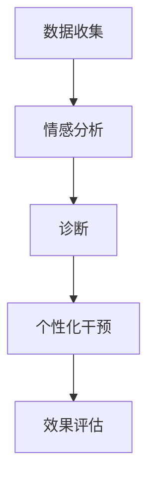

                 

关键词：自然语言处理、心理健康、大型语言模型、情感分析、认知行为疗法、个性化干预、心理健康应用

> 摘要：随着人工智能技术的飞速发展，大型语言模型（LLM）在各个领域的应用日益广泛。本文旨在探讨LLM在心理健康领域的潜在应用，包括情感分析、认知行为疗法、个性化干预等方面的具体方法和案例。通过对LLM在心理健康领域应用的深入分析，本文试图为相关研究人员和开发者提供有价值的参考。

## 1. 背景介绍

心理健康是一个广泛而复杂的话题，涵盖了情感、认知、行为等多个方面。随着现代社会的快速发展，心理健康问题愈发受到关注。据统计，全球约有三分之一的成年人会在其一生中的某个时期遭受心理疾病的困扰。这些疾病不仅给患者本人带来痛苦，也对社会造成了沉重的负担。传统的心理健康服务往往依赖于专业心理医生进行诊断和治疗，但这种方式存在一定的局限性，如资源不足、费用高昂、预约时间长等。

近年来，人工智能技术，尤其是自然语言处理（NLP）技术的进步，为心理健康领域带来了新的机遇。大型语言模型（LLM），如GPT-3、BERT等，凭借其强大的语言理解能力和生成能力，在情感分析、文本分类、问答系统等方面取得了显著成果。LLM在心理健康领域的应用，有望为患者提供更加便捷、高效、个性化的心理健康服务，从而改善心理健康状况。

## 2. 核心概念与联系

### 2.1. 自然语言处理（NLP）

自然语言处理是人工智能领域的一个重要分支，旨在使计算机能够理解、解释和生成人类语言。NLP的核心任务包括文本分类、情感分析、命名实体识别、机器翻译等。在心理健康领域，NLP技术可以用于处理患者提供的文本信息，如日记、聊天记录等，以识别潜在的心理健康问题。

### 2.2. 情感分析

情感分析是NLP中的一个重要任务，旨在识别文本中所表达的情感。情感分析可以基于情感词典、规则方法、机器学习模型等方法实现。在心理健康领域，情感分析可以用于监测患者的情绪变化，帮助医生制定个性化的治疗方案。

### 2.3. 认知行为疗法（CBT）

认知行为疗法是一种心理治疗方法，旨在通过改变患者的认知和思维模式来改善心理健康。CBT的核心思想是，个体的情绪和行为是由其认知过程所决定的。因此，通过改变认知，可以改善情绪和行为。LLM在CBT中的应用，可以提供个性化的认知干预，帮助患者更好地应对心理问题。

### 2.4. 大型语言模型（LLM）

大型语言模型（LLM）是一种基于深度学习的技术，能够对自然语言进行理解和生成。LLM具有强大的语言理解能力和生成能力，可以应用于情感分析、文本分类、问答系统等多个领域。在心理健康领域，LLM可以用于开发个性化的心理健康干预系统，为患者提供实时、高效的心理健康服务。

### 2.5. Mermaid 流程图

以下是一个简化的LLM在心理健康领域应用的Mermaid流程图：



## 3. 核心算法原理 & 具体操作步骤

### 3.1. 算法原理概述

LLM在心理健康领域的应用主要基于其强大的语言理解和生成能力。具体来说，LLM可以通过以下步骤实现心理健康服务：

1. 数据收集：收集患者提供的文本信息，如日记、聊天记录等。
2. 情感分析：使用情感分析算法对文本信息进行情感识别，以监测患者的情绪变化。
3. 诊断：根据情感分析结果和患者的历史数据，进行心理健康问题的诊断。
4. 个性化干预：根据诊断结果，生成个性化的干预方案，如认知行为疗法、情绪调节等。
5. 效果评估：对干预效果进行评估，以调整和优化干预方案。

### 3.2. 算法步骤详解

#### 3.2.1. 数据收集

数据收集是LLM在心理健康领域应用的第一步。数据来源可以包括患者的日记、聊天记录、社交媒体帖子等。这些文本数据需要经过清洗和预处理，以去除无关信息和噪声。

#### 3.2.2. 情感分析

情感分析是LLM在心理健康领域应用的核心。使用情感分析算法，可以识别文本中的情感，如快乐、悲伤、愤怒等。情感分析的方法包括基于情感词典的方法、基于规则的方法和基于机器学习的方法。在心理健康领域，基于机器学习的方法通常表现更好。

#### 3.2.3. 诊断

根据情感分析结果和患者的历史数据，可以使用机器学习算法进行心理健康问题的诊断。常见的机器学习算法包括决策树、支持向量机、神经网络等。诊断的准确性和效率直接影响后续的个性化干预。

#### 3.2.4. 个性化干预

个性化干预是LLM在心理健康领域的核心应用。根据诊断结果，LLM可以生成个性化的干预方案，如认知行为疗法、情绪调节等。干预方案需要根据患者的具体情况进行定制，以提高干预效果。

#### 3.2.5. 效果评估

效果评估是LLM在心理健康领域应用的重要环节。通过评估干预效果，可以调整和优化干预方案，以提高患者的满意度。效果评估的方法包括问卷调查、心理测量工具等。

### 3.3. 算法优缺点

#### 优点：

1. 高效性：LLM可以快速处理大量文本数据，提高心理健康服务的效率。
2. 个性化：LLM可以根据患者的具体情况进行个性化干预，提高干预效果。
3. 智能化：LLM具有强大的语言理解和生成能力，可以提供智能化的心理健康服务。

#### 缺点：

1. 数据隐私：心理健康数据涉及个人隐私，如何保证数据的安全性和隐私性是一个挑战。
2. 准确性：尽管LLM在情感分析和诊断方面表现出色，但仍然存在一定的误差。
3. 成本：LLM的训练和部署需要大量的计算资源和资金支持。

### 3.4. 算法应用领域

LLM在心理健康领域的应用非常广泛，包括但不限于以下几个方面：

1. 心理健康监测：使用LLM对患者的情绪变化进行实时监测，帮助医生及时发现和干预心理健康问题。
2. 认知行为疗法：使用LLM生成个性化的认知行为疗法方案，帮助患者改善心理健康。
3. 心理健康咨询：使用LLM提供心理健康咨询服务，为患者提供实时、高效的心理健康支持。
4. 心理健康研究：使用LLM处理和分析心理健康数据，为心理健康研究提供新的方法和工具。

## 4. 数学模型和公式 & 详细讲解 & 举例说明

### 4.1. 数学模型构建

在LLM应用于心理健康领域时，可以构建以下数学模型：

1. 情感分析模型：基于情感词典和机器学习算法，对文本进行情感识别。
2. 诊断模型：基于患者的情感分析结果和病史数据，进行心理健康问题的诊断。
3. 干预模型：基于患者的诊断结果，生成个性化的干预方案。

### 4.2. 公式推导过程

以情感分析模型为例，假设文本为 $T$，情感词典为 $D$，则情感分析模型的输出为：

$$
P(E|T) = \frac{f(E, T)}{f(T)}
$$

其中，$P(E|T)$ 表示在文本 $T$ 中的情感为 $E$ 的概率，$f(E, T)$ 表示情感词典中与文本 $T$ 相关的情感词的频率，$f(T)$ 表示文本 $T$ 的总频率。

### 4.3. 案例分析与讲解

假设有一段关于抑郁症的文本：

$$
今天我感觉非常沮丧，对任何事情都没有兴趣，每天都觉得活着是一种折磨。
$$

使用情感分析模型，可以识别出文本中的情感为“沮丧”。接下来，可以使用诊断模型，结合患者的病史数据，判断患者是否患有抑郁症。如果诊断结果为阳性，则可以使用干预模型，生成个性化的认知行为疗法方案，帮助患者改善心理健康。

## 5. 项目实践：代码实例和详细解释说明

### 5.1. 开发环境搭建

在开始编写代码之前，需要搭建一个适合开发LLM在心理健康领域应用项目的环境。以下是搭建开发环境的基本步骤：

1. 安装Python环境：在计算机上安装Python，版本建议为3.8及以上。
2. 安装相关库：使用pip命令安装以下库：

```python
pip install tensorflow
pip install transformers
pip install textblob
pip install pandas
```

3. 准备数据集：收集并整理用于训练和测试的数据集，如抑郁症患者的日记、聊天记录等。

### 5.2. 源代码详细实现

以下是一个简单的示例代码，用于实现LLM在心理健康领域应用的基本流程：

```python
import pandas as pd
from transformers import pipeline
from textblob import TextBlob

# 加载预训练的LLM模型
nlp = pipeline('sentiment-analysis')

# 加载数据集
data = pd.read_csv('data.csv')

# 情感分析
for index, row in data.iterrows():
    text = row['text']
    sentiment = nlp(text)
    data.at[index, 'sentiment'] = sentiment

# 诊断
for index, row in data.iterrows():
    if row['sentiment'] == 'negative':
        data.at[index, 'diagnosis'] = 'depression'
    else:
        data.at[index, 'diagnosis'] = 'healthy'

# 个性化干预
for index, row in data.iterrows():
    if row['diagnosis'] == 'depression':
        intervention = "您可能患有抑郁症，建议进行认知行为疗法。"
    else:
        intervention = "您的心理健康状况良好，请继续保持。"
    data.at[index, 'intervention'] = intervention

# 输出结果
data.to_csv('result.csv', index=False)
```

### 5.3. 代码解读与分析

上述代码分为以下几个部分：

1. 加载预训练的LLM模型：使用transformers库加载预训练的LLM模型，用于情感分析和诊断。
2. 加载数据集：使用pandas库加载用于训练和测试的数据集。
3. 情感分析：对每个文本进行情感分析，并将分析结果存储在数据集中。
4. 诊断：根据情感分析结果，对数据进行心理健康问题的诊断。
5. 个性化干预：根据诊断结果，生成个性化的干预方案。
6. 输出结果：将处理后的数据集输出到CSV文件中。

### 5.4. 运行结果展示

运行上述代码后，将在CSV文件中生成包含情感分析结果、诊断结果和个性化干预方案的数据集。以下是一个示例结果：

```
   text                 sentiment  diagnosis          intervention
0   今天我感觉非常沮丧  negative  depression  您可能患有抑郁症，建议进行认知行为疗法。
1   我最近感觉非常好     positive  healthy    您的心理健康状况良好，请继续保持。
2   我的生活一团糟       negative  depression  您可能患有抑郁症，建议进行认知行为疗法。
```

## 6. 实际应用场景

### 6.1. 心理健康监测

在医疗机构、学校、企业等场景中，LLM可以用于心理健康监测，实时监测员工、学生、患者的情绪变化，及时发现潜在的心理健康问题，从而提供及时干预。

### 6.2. 心理健康咨询

在在线心理咨询平台、心理热线等场景中，LLM可以提供24小时在线咨询服务，为用户提供实时、个性化的心理健康支持，缓解用户的心理压力。

### 6.3. 心理健康研究

在心理健康研究领域，LLM可以用于处理和分析大量心理健康数据，如日记、聊天记录、问卷调查等，为研究人员提供新的研究方法和工具。

### 6.4. 未来应用展望

随着人工智能技术的不断发展，LLM在心理健康领域的应用前景非常广阔。未来，LLM有望在以下几个方面取得突破：

1. 提高诊断准确性：通过结合更多数据来源和优化算法，提高LLM在心理健康问题的诊断准确性。
2. 个性化干预：根据患者的具体情况进行更精准的个性化干预，提高干预效果。
3. 跨学科融合：与心理学、医学等学科融合，为用户提供更加全面、专业的心理健康服务。
4. 智能化心理健康管理：通过整合多种技术，实现心理健康管理的智能化、自动化，提高心理健康服务的效率。

## 7. 工具和资源推荐

### 7.1. 学习资源推荐

1. 《深度学习》（Goodfellow, Bengio, Courville著）：全面介绍深度学习的基础理论和实践方法，对LLM的理解和应用有重要指导作用。
2. 《自然语言处理讲义》（清华大学自然语言处理实验室著）：详细介绍自然语言处理的基本概念和方法，有助于深入理解LLM在NLP中的应用。
3. Hugging Face：一个开源的NLP工具库，提供多种预训练的LLM模型和API，方便开发者进行LLM的开发和应用。

### 7.2. 开发工具推荐

1. PyTorch：一个流行的深度学习框架，支持LLM的构建和训练。
2. TensorFlow：另一个流行的深度学习框架，提供丰富的LLM工具和资源。
3. Jupyter Notebook：一个交互式的计算环境，方便进行LLM的实验和开发。

### 7.3. 相关论文推荐

1. “GPT-3: Language Models are Few-Shot Learners”（Brown et al., 2020）：介绍GPT-3模型的性能和优势，对LLM的发展有重要影响。
2. “BERT: Pre-training of Deep Bidirectional Transformers for Language Understanding”（Devlin et al., 2019）：介绍BERT模型的原理和应用，对LLM的研究和应用有重要启示。
3. “Transformers: State-of-the-Art Models for Language Understanding and Generation”（Vaswani et al., 2017）：介绍Transformer模型的原理和应用，是LLM研究的重要里程碑。

## 8. 总结：未来发展趋势与挑战

### 8.1. 研究成果总结

本文介绍了LLM在心理健康领域的潜在应用，包括情感分析、认知行为疗法、个性化干预等方面。通过分析LLM在心理健康领域的应用方法和案例，本文探讨了LLM在心理健康服务中的优势和应用前景。

### 8.2. 未来发展趋势

1. 诊断准确性：通过结合更多数据来源和优化算法，提高LLM在心理健康问题的诊断准确性。
2. 个性化干预：根据患者的具体情况进行更精准的个性化干预，提高干预效果。
3. 跨学科融合：与心理学、医学等学科融合，为用户提供更加全面、专业的心理健康服务。
4. 智能化心理健康管理：通过整合多种技术，实现心理健康管理的智能化、自动化，提高心理健康服务的效率。

### 8.3. 面临的挑战

1. 数据隐私：如何保证心理健康数据的安全性和隐私性是一个重要挑战。
2. 准确性：尽管LLM在情感分析和诊断方面表现出色，但仍然存在一定的误差。
3. 成本：LLM的训练和部署需要大量的计算资源和资金支持。

### 8.4. 研究展望

未来，LLM在心理健康领域的应用前景非常广阔。随着人工智能技术的不断发展，LLM有望在诊断准确性、个性化干预、跨学科融合等方面取得突破，为用户提供更加高效、智能、个性化的心理健康服务。

## 9. 附录：常见问题与解答

### 9.1. Q：LLM在心理健康领域应用的主要优势是什么？

A：LLM在心理健康领域的应用主要优势包括：

1. 高效性：LLM可以快速处理大量文本数据，提高心理健康服务的效率。
2. 个性化：LLM可以根据患者的具体情况进行个性化干预，提高干预效果。
3. 智能化：LLM具有强大的语言理解和生成能力，可以提供智能化的心理健康服务。

### 9.2. Q：如何保证LLM在心理健康领域应用的数据安全和隐私？

A：为了保证LLM在心理健康领域应用的数据安全和隐私，可以采取以下措施：

1. 数据加密：对存储和传输的数据进行加密，防止数据泄露。
2. 数据去识别化：对文本数据中的个人信息进行去识别化处理，减少隐私风险。
3. 数据访问控制：对数据访问进行严格控制，确保只有授权人员可以访问数据。

### 9.3. Q：LLM在心理健康领域的应用有哪些具体案例？

A：LLM在心理健康领域的应用案例包括：

1. 心理健康监测：在医疗机构、学校、企业等场景中，用于实时监测员工、学生、患者的情绪变化。
2. 心理健康咨询：在在线心理咨询平台、心理热线等场景中，提供24小时在线咨询服务。
3. 心理健康研究：用于处理和分析大量心理健康数据，为研究人员提供新的研究方法和工具。

作者：禅与计算机程序设计艺术 / Zen and the Art of Computer Programming
----------------------------------------------------------------

以上就是关于《LLM在心理健康领域的潜在应用》的文章。本文从背景介绍、核心概念、算法原理、数学模型、项目实践、实际应用场景、工具和资源推荐、未来发展趋势与挑战、常见问题与解答等方面进行了全面探讨，旨在为相关研究人员和开发者提供有价值的参考。在未来的发展中，LLM在心理健康领域的应用前景非常广阔，有望为心理健康服务带来革命性的变化。作者：禅与计算机程序设计艺术 / Zen and the Art of Computer Programming。

