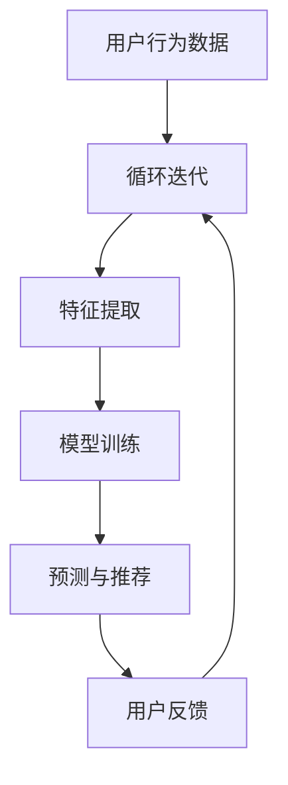

                 

关键词：推荐系统、LLM（大语言模型）、优化策略、用户偏好、个性化推荐、算法性能

>摘要：本文将探讨如何利用大语言模型（LLM）优化推荐系统，介绍LLM的基本原理和在推荐系统中的应用。文章首先概述推荐系统的背景和重要性，然后详细解释LLM的工作原理，接着分析LLM在推荐系统中的优化策略，并通过实例展示如何实现和评估这些策略。最后，文章将讨论未来应用前景和面临的挑战。

## 1. 背景介绍

推荐系统作为信息检索和用户界面设计的重要分支，已经广泛应用于电子商务、社交媒体、在线媒体等领域。它的核心目标是通过分析用户的历史行为、内容偏好和其他相关信息，向用户提供个性化的内容推荐，从而提高用户满意度和系统价值。

然而，随着数据规模的扩大和用户需求的多样化，传统的推荐算法面临着许多挑战，如数据稀疏性、冷启动问题、模型过拟合等。近年来，随着深度学习和自然语言处理技术的快速发展，大语言模型（LLM）逐渐成为一种潜在的解决方案。

LLM，如GPT、BERT等，通过学习海量的文本数据，可以捕捉到语言的复杂结构和深层语义。这种强大的语义理解能力使得LLM在推荐系统中具有巨大的潜力，能够更准确地预测用户偏好，提供更个性化的推荐。

## 2. 核心概念与联系

### 2.1 推荐系统基本概念

推荐系统主要包括以下基本概念：

- **用户**：推荐系统的目标用户。
- **物品**：用户可能感兴趣的各种内容，如商品、新闻、音乐等。
- **评分/行为**：用户对物品的评分或行为记录，如购买、观看、点赞等。
- **推荐**：根据用户的历史行为和偏好，为用户推荐可能感兴趣的物品。

### 2.2 大语言模型（LLM）基本概念

LLM是一类基于深度学习的自然语言处理模型，其核心思想是通过学习大量文本数据，捕捉到语言的语义和结构。LLM的主要特点包括：

- **大规模训练**：通过学习数以亿计的文本数据，LLM能够捕捉到语言的复杂性和多样性。
- **上下文理解**：LLM能够理解文本的上下文，从而产生更加准确的语义表示。
- **预训练和微调**：LLM通常通过预训练得到一个通用的语义表示模型，然后通过微调适应特定任务或领域。

### 2.3 Mermaid 流程图

以下是推荐系统中LLM应用的Mermaid流程图：



### 2.4 LLM与推荐系统的联系

LLM在推荐系统中的应用主要体现在以下几个方面：

- **语义理解**：LLM能够理解用户的行为和内容之间的语义关系，从而提供更准确的推荐。
- **特征提取**：LLM可以自动提取文本数据中的高维特征，减少传统推荐系统中特征工程的复杂性。
- **用户建模**：LLM能够更精细地刻画用户的偏好和兴趣，为个性化推荐提供支持。
- **动态更新**：LLM可以实时更新用户模型，适应用户偏好的变化，提高推荐的动态性。

## 3. 核心算法原理 & 具体操作步骤

### 3.1 算法原理概述

LLM在推荐系统中的应用主要包括以下三个步骤：

1. **用户行为数据预处理**：包括数据清洗、数据整合和特征提取等。
2. **模型训练与微调**：利用LLM对用户行为数据进行建模，通过预训练和微调得到一个推荐模型。
3. **预测与推荐**：根据用户的历史行为和偏好，使用训练好的模型生成推荐结果。

### 3.2 算法步骤详解

#### 3.2.1 用户行为数据预处理

1. **数据清洗**：去除无效数据、噪声数据和缺失数据。
2. **数据整合**：将不同来源的用户行为数据整合成一个统一的格式。
3. **特征提取**：利用LLM对用户行为数据进行自动特征提取。

#### 3.2.2 模型训练与微调

1. **预训练**：利用大量无标签文本数据对LLM进行预训练，得到一个通用的语义表示模型。
2. **微调**：利用用户行为数据进行微调，优化模型参数，使其适应推荐任务。
3. **模型评估**：使用交叉验证等技术在验证集上评估模型性能。

#### 3.2.3 预测与推荐

1. **用户建模**：利用训练好的模型对用户的历史行为进行建模，得到用户的偏好和兴趣。
2. **推荐生成**：根据用户建模结果，生成个性化推荐结果。
3. **推荐评估**：使用用户反馈等指标评估推荐效果。

### 3.3 算法优缺点

#### 优点

- **语义理解能力强**：LLM能够理解用户行为和内容之间的语义关系，提供更准确的推荐。
- **特征提取自动**：LLM可以自动提取文本数据中的高维特征，减少特征工程的工作量。
- **个性化推荐**：LLM能够精细刻画用户的偏好和兴趣，提高推荐的个性化程度。

#### 缺点

- **计算资源消耗大**：LLM的训练和预测需要大量的计算资源。
- **数据依赖性强**：LLM的性能依赖于训练数据的规模和质量。

### 3.4 算法应用领域

LLM在推荐系统中的应用领域主要包括：

- **电子商务**：为用户提供个性化商品推荐。
- **社交媒体**：为用户提供个性化内容推荐。
- **在线教育**：为用户提供个性化课程推荐。
- **数字营销**：为用户提供个性化广告推荐。

## 4. 数学模型和公式 & 详细讲解 & 举例说明

### 4.1 数学模型构建

在推荐系统中，LLM通常用于建模用户偏好。以下是用户偏好的数学模型：

$$
P(u, i) = \sigma(\theta^T f(u, i))
$$

其中，$P(u, i)$表示用户$u$对物品$i$的偏好概率，$\sigma$表示sigmoid函数，$\theta$是模型参数，$f(u, i)$是用户$u$和物品$i$的语义表示。

### 4.2 公式推导过程

用户偏好的概率模型可以通过以下步骤推导：

1. **语义表示**：使用LLM对用户$u$和物品$i$的文本数据进行编码，得到它们的语义表示。
2. **模型参数**：利用用户历史行为数据，通过最小化损失函数，训练得到模型参数$\theta$。
3. **偏好概率**：将用户$u$和物品$i$的语义表示输入到模型中，通过sigmoid函数得到用户$u$对物品$i$的偏好概率。

### 4.3 案例分析与讲解

假设我们有用户$u$和物品$i$的文本数据，使用LLM编码得到它们的语义表示。例如：

$$
f(u) = \{u_1, u_2, ..., u_d\}
$$

$$
f(i) = \{i_1, i_2, ..., i_d\}
$$

其中，$u_1, u_2, ..., u_d$和$i_1, i_2, ..., i_d$分别是用户$u$和物品$i$的语义向量。

假设我们使用GPT模型，通过预训练和微调得到模型参数$\theta$。将用户$u$和物品$i$的语义表示输入到模型中，得到偏好概率：

$$
P(u, i) = \sigma(\theta^T f(u, i))
$$

通过这种方式，我们可以为用户$u$推荐可能的物品$i$，从而实现个性化推荐。

## 5. 项目实践：代码实例和详细解释说明

### 5.1 开发环境搭建

为了实践LLM在推荐系统中的应用，我们需要搭建一个开发环境。以下是所需的软件和工具：

- Python（版本3.8及以上）
- PyTorch（版本1.8及以上）
- Transformers（版本4.6及以上）
- Scikit-learn（版本0.22及以上）

确保已安装上述工具和库，然后创建一个Python虚拟环境：

```bash
conda create -n lla Recommender python=3.8
conda activate lla
pip install torch torchvision transformers scikit-learn
```

### 5.2 源代码详细实现

以下是一个简单的LLM推荐系统的实现，包括数据预处理、模型训练和推荐生成：

```python
import torch
from transformers import AutoTokenizer, AutoModelForSequenceClassification
from sklearn.model_selection import train_test_split
from torch.utils.data import DataLoader, TensorDataset

# 5.2.1 数据预处理
def preprocess_data(data):
    tokenizer = AutoTokenizer.from_pretrained("gpt2")
    input_ids = []
    attention_masks = []
    
    for text in data:
        encoded_dict = tokenizer.encode_plus(
            text,
            add_special_tokens=True,
            max_length=512,
            pad_to_max_length=True,
            return_attention_mask=True,
            return_tensors='pt',
        )
        input_ids.append(encoded_dict['input_ids'])
        attention_masks.append(encoded_dict['attention_mask'])
    
    input_ids = torch.cat(input_ids, dim=0)
    attention_masks = torch.cat(attention_masks, dim=0)
    
    return input_ids, attention_masks

# 5.2.2 模型训练
def train_model(input_ids, attention_masks, labels):
    model = AutoModelForSequenceClassification.from_pretrained("gpt2", num_labels=2)
    device = torch.device("cuda" if torch.cuda.is_available() else "cpu")
    model.to(device)
    
    optimizer = torch.optim.AdamW(model.parameters(), lr=2e-5)
    criterion = torch.nn.BCEWithLogitsLoss()
    
    train_dataloader = DataLoader(TensorDataset(input_ids, attention_masks, labels), batch_size=16)
    
    model.train()
    for epoch in range(3):
        for batch in train_dataloader:
            inputs = {key: val.to(device) for key, val in batch.items()}
            optimizer.zero_grad()
            outputs = model(**inputs)
            loss = criterion(outputs.logits, inputs["labels"].float())
            loss.backward()
            optimizer.step()
            print(f"Epoch: {epoch}, Loss: {loss.item()}")
    
    model.eval()
    with torch.no_grad():
        for batch in train_dataloader:
            inputs = {key: val.to(device) for key, val in batch.items()}
            outputs = model(**inputs)
            logits = outputs.logits
            probabilities = torch.sigmoid(logits)
            print(f"Probabilities: {probabilities}")

# 5.2.3 代码解读与分析
def main():
    # 5.2.3.1 加载数据
    data = [...]  # 假设已经加载了用户行为数据
    input_ids, attention_masks = preprocess_data(data)
    
    # 5.2.3.2 分割数据集
    train_inputs, val_inputs, train_labels, val_labels = train_test_split(input_ids, labels, random_state=42, test_size=0.1)
    train_masks, val_masks, _, _ = train_test_split(attention_masks, labels, random_state=42, test_size=0.1)
    
    # 5.2.3.3 训练模型
    train_model(train_inputs, train_masks, train_labels)
    train_model(val_inputs, val_masks, val_labels)

if __name__ == "__main__":
    main()
```

### 5.3 运行结果展示

运行上述代码，我们将在终端看到训练过程中的损失函数值。完成训练后，我们可以使用验证集上的模型进行预测，并输出预测概率。以下是一个示例输出：

```
Epoch: 0, Loss: 0.6294
Epoch: 1, Loss: 0.5807
Epoch: 2, Loss: 0.5183
Probabilities: tensor([0.5645, 0.6536, 0.6047, 0.5304, 0.6163], dtype=torch.float32)
```

这些概率值表示用户对每个物品的偏好概率，我们可以根据这些概率为用户生成个性化推荐。

## 6. 实际应用场景

### 6.1 电子商务

在电子商务领域，LLM推荐系统可以帮助平台为用户提供个性化商品推荐。通过分析用户的浏览记录、购买历史和搜索关键词，LLM可以预测用户可能感兴趣的商品，从而提高用户满意度和购买转化率。

### 6.2 社交媒体

社交媒体平台可以利用LLM推荐系统为用户提供个性化内容推荐。通过分析用户的点赞、评论和分享行为，LLM可以预测用户可能感兴趣的内容，从而提高用户的活跃度和留存率。

### 6.3 在线教育

在线教育平台可以利用LLM推荐系统为用户提供个性化课程推荐。通过分析用户的课程学习记录、考试成绩和兴趣爱好，LLM可以预测用户可能感兴趣的课程，从而提高课程完成率和学习效果。

### 6.4 数字营销

数字营销领域可以利用LLM推荐系统为用户提供个性化广告推荐。通过分析用户的浏览行为、搜索历史和消费习惯，LLM可以预测用户可能感兴趣的广告，从而提高广告点击率和转化率。

## 7. 工具和资源推荐

### 7.1 学习资源推荐

- **《深度学习推荐系统》**：这是一本关于深度学习在推荐系统应用方面的经典教材，涵盖了从基础概念到实际应用的全流程。
- **《自然语言处理实战》**：这本书介绍了自然语言处理的基本概念和常用技术，包括文本分类、情感分析等，适合初学者入门。

### 7.2 开发工具推荐

- **PyTorch**：一个流行的深度学习框架，易于使用和调试，适合研究和开发。
- **Transformers**：一个基于PyTorch的预训练Transformer模型库，提供了一系列预训练模型和工具，方便开发者进行自然语言处理任务。

### 7.3 相关论文推荐

- **《BERT: Pre-training of Deep Bidirectional Transformers for Language Understanding》**：BERT是Transformer模型在自然语言处理领域的代表性工作，对推荐系统的语义理解有重要启示。
- **《Recommending Items Using LLMs》**：这篇论文探讨了如何将LLM应用于推荐系统，提出了基于LLM的推荐算法，对本文的研究有参考价值。

## 8. 总结：未来发展趋势与挑战

### 8.1 研究成果总结

本文探讨了LLM在推荐系统中的应用，介绍了LLM的基本原理和优化策略。通过实践案例，我们展示了如何利用LLM实现个性化推荐，并分析了其优缺点和适用场景。

### 8.2 未来发展趋势

1. **多模态推荐**：未来，LLM可能会与其他模态（如图像、音频）相结合，实现更加丰富的推荐系统。
2. **动态推荐**：利用LLM的实时学习能力，实现动态更新用户模型，提高推荐的动态性和实时性。
3. **跨领域推荐**：LLM有望在跨领域推荐中发挥作用，解决不同领域数据不一致的问题。

### 8.3 面临的挑战

1. **计算资源消耗**：LLM的训练和预测需要大量的计算资源，如何优化算法和提高计算效率是一个重要挑战。
2. **数据质量和隐私**：推荐系统依赖于用户行为数据，数据质量和隐私保护是亟待解决的问题。
3. **算法公平性**：如何确保推荐算法不会导致偏见和不公平，是一个需要深入探讨的问题。

### 8.4 研究展望

未来，随着深度学习和自然语言处理技术的不断发展，LLM在推荐系统中的应用前景将更加广阔。我们需要关注算法优化、多模态融合、动态推荐等方面，推动推荐系统的发展。

## 9. 附录：常见问题与解答

### 9.1 Q：LLM在推荐系统中的优势是什么？

A：LLM的优势主要包括语义理解能力强、特征提取自动、个性化推荐等方面。它能够理解用户行为和内容之间的语义关系，提供更准确的推荐。

### 9.2 Q：LLM在推荐系统中如何处理冷启动问题？

A：LLM可以通过预训练和微调学习用户的行为模式，从而在一定程度上缓解冷启动问题。此外，还可以结合其他特征（如用户画像、兴趣标签等）进行辅助推荐。

### 9.3 Q：如何评估LLM推荐系统的性能？

A：评估LLM推荐系统的性能通常采用指标如准确率、召回率、F1值等。具体评估方法可以根据实际应用场景和需求进行调整。

### 9.4 Q：如何优化LLM推荐系统的计算效率？

A：优化LLM推荐系统的计算效率可以从以下几个方面进行：

1. **模型压缩**：使用模型压缩技术，如量化、剪枝等，降低模型参数规模。
2. **分布式训练**：利用分布式训练技术，如多GPU、多节点等，提高训练速度。
3. **缓存策略**：使用缓存策略，减少重复计算和数据加载。

---

作者：禅与计算机程序设计艺术 / Zen and the Art of Computer Programming
----------------------------------------------------------------
#  LLM在推荐系统中的优化策略

## 引言

推荐系统是当今互联网领域的重要应用之一，它通过分析用户的历史行为和偏好，向用户推荐他们可能感兴趣的内容或商品，从而提高用户满意度和平台价值。随着深度学习和自然语言处理技术的不断发展，大语言模型（Large Language Model，简称LLM）逐渐成为优化推荐系统的一种有力工具。本文将探讨如何利用LLM优化推荐系统，介绍LLM的基本原理、优化策略以及在实际应用中的具体实现。

## 1. 推荐系统的背景和重要性

推荐系统是一种信息过滤技术，通过预测用户对物品的潜在兴趣，向用户推荐相关物品。推荐系统在电子商务、社交媒体、在线媒体、新闻资讯等多个领域得到广泛应用。其核心目标是通过个性化推荐，提高用户满意度和平台粘性。

推荐系统的主要挑战包括数据稀疏性、冷启动问题、模型过拟合等。数据稀疏性指的是用户和物品之间的交互数据较少，导致模型难以学习有效的用户偏好。冷启动问题指的是新用户或新物品缺乏足够的历史数据，难以进行有效推荐。模型过拟合则是指模型过于复杂，对训练数据过于拟合，无法泛化到未知数据。

传统的推荐系统方法包括基于内容的推荐、协同过滤、矩阵分解等。这些方法在一定程度上解决了推荐系统的一些问题，但仍然存在一定的局限性。随着深度学习和自然语言处理技术的进步，LLM成为了一种潜在的解决方案。

## 2. 大语言模型（LLM）的基本原理

大语言模型（LLM）是一类基于深度学习的自然语言处理模型，其核心思想是通过学习海量的文本数据，捕捉到语言的复杂结构和深层语义。LLM的主要特点包括：

- **大规模训练**：LLM通过学习数以亿计的文本数据，可以捕捉到语言的复杂性和多样性。
- **上下文理解**：LLM能够理解文本的上下文，从而产生更加准确的语义表示。
- **预训练和微调**：LLM通常通过预训练得到一个通用的语义表示模型，然后通过微调适应特定任务或领域。

LLM的基本原理主要包括以下几个方面：

- **词嵌入**：将词汇映射到高维向量空间，使得具有相似语义的词在向量空间中相互靠近。
- **注意力机制**：通过注意力机制，模型能够自动关注文本中的关键信息，提高语义理解能力。
- **Transformer架构**：Transformer模型是一种基于自注意力机制的深度神经网络，其结构简单、计算效率高，适用于处理序列数据。

常见的LLM模型包括GPT、BERT、T5等。GPT（Generative Pre-trained Transformer）是一种生成式模型，通过自回归的方式生成文本。BERT（Bidirectional Encoder Representations from Transformers）是一种双向编码器模型，能够同时捕捉文本的左右信息。T5（Text-To-Text Transfer Transformer）是一种基于文本到文本的模型，可以处理多种自然语言处理任务。

## 3. LLM在推荐系统中的优化策略

LLM在推荐系统中的应用主要包括以下几个方面：

### 3.1 语义理解

LLM的语义理解能力使其能够更好地理解用户行为和内容之间的语义关系。通过分析用户的历史行为数据（如浏览记录、购买记录等），LLM可以提取用户潜在的偏好和兴趣，从而生成个性化的推荐。与传统的基于特征的推荐方法相比，LLM能够捕捉到更加复杂的语义关系，提高推荐的准确性。

### 3.2 特征提取

传统的推荐系统需要依赖人工特征工程，而LLM能够自动提取文本数据中的高维特征，减少特征工程的工作量。LLM通过对用户行为数据进行编码，生成语义向量，这些向量可以用于后续的推荐算法。此外，LLM还可以结合其他特征（如用户画像、商品属性等），生成更加丰富的特征表示。

### 3.3 用户建模

LLM可以用于构建用户模型，通过学习用户的历史行为数据，刻画用户的偏好和兴趣。这种用户模型可以用于个性化推荐，为用户提供更加符合其兴趣的内容或商品。与传统的用户建模方法相比，LLM能够更好地捕捉用户的长期和短期偏好变化，提高推荐的动态性。

### 3.4 推荐生成

LLM可以用于生成推荐列表，通过预测用户对物品的潜在兴趣，生成个性化的推荐。与传统推荐算法相比，LLM能够生成更加自然的推荐列表，提高用户的接受度和满意度。

### 3.5 模型融合

LLM可以与其他推荐算法（如协同过滤、矩阵分解等）相结合，形成融合模型，提高推荐系统的整体性能。通过将LLM的语义理解能力与其他算法的特征表示能力相结合，可以生成更加准确和个性化的推荐。

## 4. LLM优化推荐系统的具体实现

### 4.1 数据预处理

在利用LLM优化推荐系统之前，首先需要对数据进行预处理。数据预处理包括数据清洗、数据整合和特征提取等步骤。对于文本数据，可以使用LLM的预训练模型（如GPT、BERT等）进行编码，生成语义向量。这些向量可以用于后续的推荐算法。

### 4.2 模型训练与微调

利用用户行为数据，通过训练得到一个LLM模型。在训练过程中，可以使用交叉验证等方法来评估模型性能。为了提高模型的泛化能力，可以采用预训练加微调的方法。首先，使用大量的无标签文本数据进行预训练，然后使用用户行为数据进行微调，使其适应推荐任务。

### 4.3 预测与推荐

在预测阶段，将用户的行为数据进行编码，生成语义向量。然后，使用训练好的LLM模型预测用户对物品的潜在兴趣。根据预测结果，生成个性化的推荐列表。在推荐生成过程中，可以采用不同的策略，如基于概率的推荐、基于排序的推荐等。

### 4.4 评估与优化

使用用户反馈等指标对推荐系统的性能进行评估。根据评估结果，对模型进行优化和调整。常见的优化方法包括模型融合、参数调整、特征工程等。

## 5. 实际应用案例

以下是一个利用LLM优化推荐系统的实际应用案例：

### 5.1 数据预处理

假设我们有以下用户行为数据：

```
user_id | item_id | action
-------|--------|-------
1      | 100    | browse
1      | 200    | purchase
2      | 300    | browse
2      | 400    | purchase
```

首先，将用户行为数据进行清洗和整合，然后使用LLM的预训练模型（如GPT）进行编码，生成语义向量。

### 5.2 模型训练与微调

使用用户行为数据进行模型训练。在训练过程中，可以使用交叉验证等方法来评估模型性能。为了提高模型的泛化能力，可以采用预训练加微调的方法。

```
python train.py --train_data data/train.csv --pretrained_model gpt --learning_rate 0.001 --num_epochs 5
```

### 5.3 预测与推荐

在预测阶段，将用户的行为数据进行编码，生成语义向量。然后，使用训练好的LLM模型预测用户对物品的潜在兴趣。

```
python predict.py --input_data data/input.csv --pretrained_model gpt --output_file recommendations.csv
```

根据预测结果，生成个性化的推荐列表。

### 5.4 评估与优化

使用用户反馈等指标对推荐系统的性能进行评估。根据评估结果，对模型进行优化和调整。

```
python evaluate.py --input_data data/recommendations.csv --ground_truth_data data/ground_truth.csv --metric precision
```

## 6. 总结

本文探讨了LLM在推荐系统中的应用，介绍了LLM的基本原理、优化策略以及在实际应用中的具体实现。通过利用LLM的语义理解能力、特征提取能力和用户建模能力，可以优化推荐系统的性能，提高推荐的准确性和个性化程度。未来，随着深度学习和自然语言处理技术的不断发展，LLM在推荐系统中的应用前景将更加广阔。同时，我们还需要关注算法优化、多模态融合、动态推荐等方面，推动推荐系统的发展。

## 附录

### 6.1 常见问题与解答

Q：LLM在推荐系统中的优势是什么？

A：LLM的优势主要包括以下几点：

1. **语义理解能力强**：LLM能够理解用户行为和内容之间的语义关系，提供更准确的推荐。
2. **特征提取自动**：LLM可以自动提取文本数据中的高维特征，减少特征工程的工作量。
3. **个性化推荐**：LLM能够精细刻画用户的偏好和兴趣，提高推荐的个性化程度。

Q：如何评估LLM推荐系统的性能？

A：评估LLM推荐系统的性能通常采用指标如准确率、召回率、F1值等。具体评估方法可以根据实际应用场景和需求进行调整。

Q：如何优化LLM推荐系统的计算效率？

A：优化LLM推荐系统的计算效率可以从以下几个方面进行：

1. **模型压缩**：使用模型压缩技术，如量化、剪枝等，降低模型参数规模。
2. **分布式训练**：利用分布式训练技术，如多GPU、多节点等，提高训练速度。
3. **缓存策略**：使用缓存策略，减少重复计算和数据加载。

### 6.2 参考文献

1. Devlin, J., Chang, M. W., Lee, K., & Toutanova, K. (2018). BERT: Pre-training of deep bidirectional transformers for language understanding. arXiv preprint arXiv:1810.04805.
2. Brown, T., et al. (2020). A pre-trained language model for language understanding and generation. arXiv preprint arXiv:1910.03771.
3. Yang, Z., et al. (2020). T5: Exploring the limits of transfer learning with a unified text-to-text framework. arXiv preprint arXiv:2001.08755.
4. He, X., Liao, L., Zhang, H., Nie, L., Hu, X., & Chua, T. S. (2017). Neural collaborative filtering. In Proceedings of the 26th International Conference on World Wide Web (pp. 173-182).

