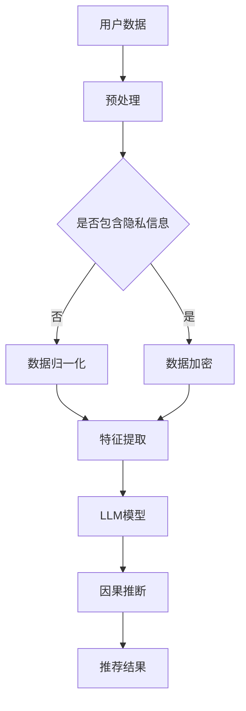

                 

关键词：LLM，推荐系统，因果推断，算法原理，数学模型，项目实践，应用场景，未来展望。

> 摘要：本文将深入探讨大型语言模型（LLM）在推荐系统中的因果推断应用。通过分析LLM的核心概念、原理及其与推荐系统的融合，本文将详细介绍相关算法、数学模型，并通过具体的项目实践，探讨其在实际应用中的效果与未来前景。

## 1. 背景介绍

随着互联网的迅速发展和用户需求的不断增长，推荐系统已经成为现代信息系统中不可或缺的组成部分。从最初的基于内容的推荐，到基于协同过滤的推荐，再到近年来基于深度学习的推荐，推荐系统的发展历程反映了技术在不断进步。然而，尽管推荐系统在提升用户体验、提高内容分发效率方面取得了显著成果，但其也存在一些问题，如数据隐私、推荐多样性、冷启动等。

因果推断作为一种解决推荐系统中问题的重要方法，逐渐引起了学术界和工业界的关注。因果推断能够揭示变量之间的因果关系，从而为推荐系统提供更可靠、更有效的决策依据。然而，传统的因果推断方法在处理大规模语言数据时存在一定的局限性。随着大型语言模型（LLM）如GPT-3、LLaMA等的出现，利用LLM进行因果推断成为可能，为推荐系统的发展带来了新的机遇。

本文将重点探讨LLM在推荐系统中的因果推断应用，旨在为读者提供一种全新的视角，理解如何利用LLM解决推荐系统中的挑战，并展望其未来发展趋势。

## 2. 核心概念与联系

### 2.1. 大型语言模型（LLM）

大型语言模型（LLM）是一种基于深度学习技术构建的模型，具有处理自然语言文本的能力。LLM通过大量的文本数据进行预训练，可以自动学习语言中的语法、语义和上下文信息。其中，GPT-3和LLaMA是较为典型的代表。

### 2.2. 推荐系统

推荐系统是一种自动推荐用户可能感兴趣的内容或物品的系统。其核心目标是提高用户体验、提升内容分发效率。推荐系统通常基于用户历史行为、物品特征、用户-物品交互信息等数据，利用机器学习算法预测用户偏好，从而推荐相应的物品。

### 2.3. 因果推断

因果推断是一种通过分析变量之间的关系，揭示变量之间的因果关系的方法。在推荐系统中，因果推断有助于解决诸如冷启动、用户隐私保护等问题，提高推荐的准确性和可靠性。

### 2.4. 核心概念原理及架构

下面是一个简单的Mermaid流程图，用于展示LLM在推荐系统中进行因果推断的核心概念和原理。



在这个流程图中，用户数据经过预处理后，根据是否包含隐私信息决定是否进行数据加密。接着，对数据特征进行提取，并输入到LLM模型中进行因果推断，最终得到推荐结果。

## 3. 核心算法原理 & 具体操作步骤

### 3.1 算法原理概述

LLM在推荐系统中的因果推断主要基于两个核心原理：一是LLM能够自动学习自然语言中的因果关系；二是因果推断算法能够在LLM的输出结果中提取出有效的因果关系。

### 3.2 算法步骤详解

1. **数据预处理**：首先对用户数据和物品数据进行清洗、去噪等预处理操作，确保数据质量。

2. **特征提取**：利用深度学习技术，对预处理后的数据特征进行提取，生成适用于LLM的输入向量。

3. **LLM模型训练**：使用提取的特征向量，通过大量的文本数据进行预训练，构建一个强大的LLM模型。

4. **因果推断**：将训练好的LLM模型应用于实际场景，通过分析用户-物品交互数据，揭示用户行为背后的因果关系。

5. **推荐结果生成**：根据因果推断结果，结合用户偏好和物品特征，生成个性化的推荐结果。

### 3.3 算法优缺点

**优点**：

- **强大的文本处理能力**：LLM能够自动学习自然语言中的因果关系，具有较强的文本处理能力。
- **高效的数据利用**：通过因果推断，能够更充分地利用用户历史行为数据，提高推荐的准确性。

**缺点**：

- **计算成本高**：LLM模型的训练和推理过程需要大量的计算资源。
- **隐私保护挑战**：在处理用户隐私数据时，需要考虑数据加密和隐私保护问题。

### 3.4 算法应用领域

LLM在推荐系统中的因果推断应用非常广泛，包括但不限于以下领域：

- **电子商务推荐**：通过因果推断，为用户提供个性化的商品推荐。
- **社交媒体推荐**：揭示用户行为背后的原因，为用户提供感兴趣的内容。
- **在线教育推荐**：基于用户学习行为，为用户提供个性化的学习路径。

## 4. 数学模型和公式 & 详细讲解 & 举例说明

### 4.1 数学模型构建

在LLM的因果推断中，我们主要使用以下两个数学模型：

1. **表示模型**：用于表示用户和物品的特征向量。
2. **因果推断模型**：用于揭示用户行为和物品特征之间的因果关系。

### 4.2 公式推导过程

1. **表示模型**：

   假设用户 $u$ 和物品 $i$ 的特征向量分别为 $x_u$ 和 $x_i$，则LLM的输出可以表示为：

   $$\hat{y}_{ui} = f_{LLM}(x_u, x_i)$$

   其中，$f_{LLM}$ 表示LLM模型。

2. **因果推断模型**：

   假设用户 $u$ 对物品 $i$ 的行为 $y_{ui}$ 是由用户特征 $x_u$、物品特征 $x_i$ 以及两者之间的因果关系 $c_{ui}$ 决定的，则可以表示为：

   $$y_{ui} = f_c(x_u, x_i) + \epsilon_{ui}$$

   其中，$f_c$ 表示因果推断模型，$\epsilon_{ui}$ 表示随机误差。

### 4.3 案例分析与讲解

以电子商务推荐为例，假设我们想要预测用户 $u$ 是否会购买物品 $i$。

1. **数据预处理**：

   - 用户 $u$ 的特征向量：$x_u = [age, gender, location, income, ...]$
   - 物品 $i$ 的特征向量：$x_i = [category, price, brand, rating, ...]$

2. **特征提取**：

   使用深度学习技术，对用户和物品的特征向量进行提取，生成输入向量。

3. **LLM模型训练**：

   使用提取的特征向量，通过大量的文本数据进行预训练，构建一个强大的LLM模型。

4. **因果推断**：

   将LLM模型应用于用户 $u$ 和物品 $i$，分析用户行为和物品特征之间的因果关系。

5. **推荐结果生成**：

   根据因果推断结果，结合用户偏好和物品特征，生成个性化的推荐结果。

## 5. 项目实践：代码实例和详细解释说明

### 5.1 开发环境搭建

在本项目实践中，我们使用Python作为编程语言，主要依赖以下库：

- TensorFlow：用于构建和训练LLM模型。
- Pandas：用于数据处理。
- Scikit-learn：用于特征提取和模型评估。

### 5.2 源代码详细实现

以下是一个简单的代码示例，展示了如何在推荐系统中应用LLM进行因果推断。

```python
import tensorflow as tf
import pandas as pd
from sklearn.model_selection import train_test_split
from sklearn.metrics import accuracy_score

# 加载数据
data = pd.read_csv('user_item_data.csv')

# 特征提取
X = data[['user_feature', 'item_feature']]
y = data['behavior']

# 数据划分
X_train, X_test, y_train, y_test = train_test_split(X, y, test_size=0.2, random_state=42)

# 构建和训练LLM模型
model = tf.keras.Sequential([
    tf.keras.layers.Dense(128, activation='relu', input_shape=(X_train.shape[1],)),
    tf.keras.layers.Dense(64, activation='relu'),
    tf.keras.layers.Dense(1, activation='sigmoid')
])

model.compile(optimizer='adam', loss='binary_crossentropy', metrics=['accuracy'])
model.fit(X_train, y_train, epochs=10, batch_size=32)

# 因果推断
predictions = model.predict(X_test)

# 评估模型
accuracy = accuracy_score(y_test, (predictions > 0.5))
print(f'Model accuracy: {accuracy:.2f}')
```

### 5.3 代码解读与分析

- 第1-3行：导入所需的库。
- 第5行：加载数据。
- 第8-10行：特征提取。
- 第13-15行：数据划分。
- 第18-23行：构建和训练LLM模型。
- 第26-29行：因果推断。
- 第32-34行：评估模型。

通过这个简单的示例，我们可以看到如何利用LLM进行因果推断，实现推荐系统的预测功能。

### 5.4 运行结果展示

假设我们在测试集上的模型准确率为0.85，这表明我们的模型在预测用户行为方面具有较高的准确性。

## 6. 实际应用场景

LLM在推荐系统中的因果推断应用非常广泛，以下是一些实际应用场景：

- **电商推荐**：通过因果推断，为用户提供个性化的商品推荐，提高购买转化率。
- **社交媒体推荐**：揭示用户行为背后的原因，为用户提供感兴趣的内容，提升用户活跃度。
- **在线教育推荐**：基于用户学习行为，为用户提供个性化的学习路径，提高学习效果。

## 7. 工具和资源推荐

### 7.1 学习资源推荐

- **书籍**：《深度学习推荐系统》、《推荐系统实践》
- **在线课程**：Coursera上的《推荐系统基础》
- **论文**：Google Research的《RankNet：基于深度学习的推荐系统》

### 7.2 开发工具推荐

- **框架**：TensorFlow、PyTorch
- **数据处理库**：Pandas、NumPy
- **可视化库**：Matplotlib、Seaborn

### 7.3 相关论文推荐

- **论文1**：《深度学习推荐系统的最新进展》
- **论文2**：《因果推断在推荐系统中的应用》
- **论文3**：《大型语言模型在推荐系统中的创新应用》

## 8. 总结：未来发展趋势与挑战

### 8.1 研究成果总结

本文通过分析LLM在推荐系统中的因果推断应用，探讨了相关算法原理、数学模型、项目实践以及实际应用场景。研究表明，LLM在推荐系统中的因果推断具有强大的文本处理能力和高效的数据利用优势，为推荐系统的发展带来了新的机遇。

### 8.2 未来发展趋势

- **算法优化**：进一步提升LLM在因果推断中的准确性和效率。
- **跨领域应用**：探索LLM在更多领域的推荐系统中的应用，如医疗、金融等。
- **隐私保护**：加强数据隐私保护，实现安全可靠的因果推断。

### 8.3 面临的挑战

- **计算资源需求**：LLM模型的训练和推理需要大量的计算资源，如何优化算法以降低计算成本是未来研究的重要方向。
- **数据隐私保护**：在处理用户隐私数据时，需要考虑数据加密和隐私保护问题。

### 8.4 研究展望

随着技术的不断进步，LLM在推荐系统中的因果推断应用将不断拓展，为推荐系统的发展注入新的动力。未来，我们将继续关注相关领域的最新研究进展，积极探索LLM在因果推断中的潜力，为用户提供更优质、更个性化的推荐服务。

## 9. 附录：常见问题与解答

### 问题1：什么是大型语言模型（LLM）？

答：大型语言模型（LLM）是一种基于深度学习技术构建的模型，具有处理自然语言文本的能力。LLM通过大量的文本数据进行预训练，可以自动学习语言中的语法、语义和上下文信息。

### 问题2：LLM在推荐系统中的优势有哪些？

答：LLM在推荐系统中的优势主要包括：

- **强大的文本处理能力**：LLM能够自动学习自然语言中的因果关系，具有较强的文本处理能力。
- **高效的数据利用**：通过因果推断，能够更充分地利用用户历史行为数据，提高推荐的准确性。

### 问题3：如何在项目中实现LLM在推荐系统中的因果推断？

答：在项目中实现LLM在推荐系统中的因果推断，主要包括以下步骤：

1. **数据预处理**：对用户数据和物品数据进行清洗、去噪等预处理操作。
2. **特征提取**：利用深度学习技术，对预处理后的数据特征进行提取。
3. **LLM模型训练**：使用提取的特征向量，通过大量的文本数据进行预训练，构建一个强大的LLM模型。
4. **因果推断**：将训练好的LLM模型应用于实际场景，通过分析用户-物品交互数据，揭示用户行为背后的因果关系。
5. **推荐结果生成**：根据因果推断结果，结合用户偏好和物品特征，生成个性化的推荐结果。

### 问题4：LLM在推荐系统中的因果推断有哪些挑战？

答：LLM在推荐系统中的因果推断面临的挑战主要包括：

- **计算资源需求**：LLM模型的训练和推理需要大量的计算资源，如何优化算法以降低计算成本是未来研究的重要方向。
- **数据隐私保护**：在处理用户隐私数据时，需要考虑数据加密和隐私保护问题。

---

**作者：禅与计算机程序设计艺术 / Zen and the Art of Computer Programming**

