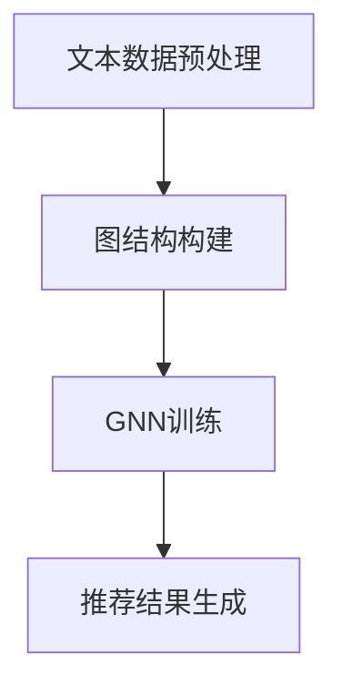

                 

关键词：LLM，推荐系统，图神经网络，算法原理，数学模型，项目实践，实际应用，未来展望

## 摘要

随着人工智能技术的快速发展，大型语言模型（LLM）在推荐系统中的应用日益受到关注。本文将深入探讨LLM在推荐系统中的图神经网络（GNN）应用。通过对LLM和GNN的基本概念、原理及其在推荐系统中的具体应用进行分析，本文旨在为读者提供全面的技术见解，并为未来的研究与应用指明方向。

## 1. 背景介绍

### 1.1 推荐系统的发展历程

推荐系统作为信息过滤和个性化服务的重要工具，其发展历程可追溯至20世纪90年代。早期推荐系统主要采用基于内容的过滤和协同过滤方法。基于内容的过滤方法通过分析用户的历史行为和兴趣，将用户可能感兴趣的内容推荐给用户。协同过滤方法则通过分析用户之间的相似性，将其他用户喜欢的物品推荐给当前用户。

随着互联网的普及和用户数据的爆炸性增长，推荐系统逐渐向复杂化、多样化发展。近年来，深度学习技术的崛起为推荐系统带来了新的机遇。尤其是大型语言模型（LLM）的出现，使得推荐系统在处理大规模数据、实现高效信息检索和个性化推荐方面取得了显著进展。

### 1.2 图神经网络（GNN）的基本概念

图神经网络（GNN）是一种基于图结构数据的深度学习模型，广泛应用于社交网络分析、知识图谱推理等领域。GNN的核心思想是通过聚合图中节点的邻居信息来更新节点的表示。这种聚合操作使得GNN能够捕捉节点之间的复杂关系，从而在处理图结构数据时表现出优越的性能。

### 1.3 LLM在推荐系统中的应用现状

随着LLM技术的成熟，其在推荐系统中的应用逐渐得到关注。目前，LLM在推荐系统中的应用主要体现在以下几个方面：

1. **文本数据预处理**：LLM可以对用户生成的文本数据进行情感分析、关键词提取等预处理操作，从而提高推荐系统的准确性和效率。
2. **推荐结果生成**：LLM可以根据用户的历史行为和兴趣，生成个性化的推荐结果，提高用户的满意度。
3. **交互式推荐**：LLM可以与用户进行实时交互，根据用户的反馈调整推荐策略，实现个性化推荐。

## 2. 核心概念与联系

### 2.1 LLM与GNN的关系

LLM和GNN在推荐系统中具有紧密的联系。LLM可以为GNN提供有效的节点表示，使得GNN能够更好地捕捉图结构数据中的复杂关系。同时，GNN可以为LLM提供丰富的图结构信息，帮助LLM进行文本数据的语义理解。

### 2.2 LLM与GNN的融合架构

在推荐系统中，LLM和GNN的融合架构主要包括以下几个步骤：

1. **文本数据预处理**：使用LLM对用户生成的文本数据进行情感分析、关键词提取等预处理操作，生成文本表示。
2. **图结构构建**：根据文本表示和用户历史行为数据，构建图结构，包括节点和边的定义。
3. **GNN训练**：使用GNN对图结构进行训练，学习节点表示和边关系。
4. **推荐结果生成**：使用训练好的GNN模型对用户进行个性化推荐。

### 2.3 Mermaid流程图



## 3. 核心算法原理 & 具体操作步骤

### 3.1 算法原理概述

LLM在推荐系统中的图神经网络应用主要包括以下几个核心步骤：

1. **文本数据预处理**：使用LLM对用户生成的文本数据进行情感分析、关键词提取等预处理操作，生成文本表示。
2. **图结构构建**：根据文本表示和用户历史行为数据，构建图结构，包括节点和边的定义。
3. **GNN训练**：使用GNN对图结构进行训练，学习节点表示和边关系。
4. **推荐结果生成**：使用训练好的GNN模型对用户进行个性化推荐。

### 3.2 算法步骤详解

#### 3.2.1 文本数据预处理

文本数据预处理是LLM在推荐系统中的第一步，其主要任务是提取文本中的关键信息，生成文本表示。具体步骤如下：

1. **情感分析**：使用LLM对文本进行情感分析，判断文本的情感倾向。
2. **关键词提取**：使用LLM对文本进行关键词提取，提取文本中的关键信息。
3. **文本表示**：将预处理后的文本数据转化为向量表示，为后续的图结构构建提供基础。

#### 3.2.2 图结构构建

图结构构建是LLM在推荐系统中的关键步骤，其主要任务是构建一个描述用户兴趣和物品关系的图结构。具体步骤如下：

1. **节点定义**：根据文本表示和用户历史行为数据，将用户和物品定义为图中的节点。
2. **边定义**：根据用户历史行为数据和文本表示，将用户和物品之间的关联定义为图中的边。

#### 3.2.3 GNN训练

GNN训练是LLM在推荐系统中的核心步骤，其主要任务是学习节点表示和边关系。具体步骤如下：

1. **初始化节点表示**：根据文本表示和用户历史行为数据，初始化图中的节点表示。
2. **迭代更新节点表示**：使用GNN的聚合操作，迭代更新图中的节点表示。
3. **训练模型**：使用训练数据，对GNN模型进行训练，学习节点表示和边关系。

#### 3.2.4 推荐结果生成

推荐结果生成是LLM在推荐系统中的最终步骤，其主要任务是使用训练好的GNN模型对用户进行个性化推荐。具体步骤如下：

1. **用户表示**：将用户的历史行为数据转化为向量表示，作为GNN模型的输入。
2. **物品表示**：将物品的特征数据转化为向量表示，作为GNN模型的输入。
3. **推荐计算**：使用GNN模型计算用户和物品之间的相似性，生成推荐结果。

### 3.3 算法优缺点

#### 3.3.1 优点

1. **高效性**：LLM和GNN的结合能够在大规模数据上实现高效的信息检索和推荐计算。
2. **灵活性**：LLM能够灵活地处理各种类型的文本数据，为推荐系统提供丰富的语义信息。
3. **个性化**：基于图神经网络的学习，能够更好地捕捉用户和物品之间的复杂关系，实现个性化推荐。

#### 3.3.2 缺点

1. **计算成本**：LLM和GNN的结合在训练过程中需要大量的计算资源，对硬件要求较高。
2. **数据依赖**：推荐系统对用户数据的依赖性较强，数据质量对推荐效果有重要影响。

### 3.4 算法应用领域

LLM在推荐系统中的图神经网络应用主要涉及以下领域：

1. **电子商务**：基于用户的历史购买行为和文本评论，实现个性化的商品推荐。
2. **社交媒体**：基于用户的关系网络和文本生成，实现个性化的内容推荐。
3. **在线教育**：基于学生的学习行为和文本反馈，实现个性化的课程推荐。

## 4. 数学模型和公式

### 4.1 数学模型构建

在LLM在推荐系统中的图神经网络应用中，主要涉及以下数学模型：

1. **文本表示模型**：用于将文本数据转化为向量表示。
2. **图神经网络模型**：用于学习节点表示和边关系。
3. **推荐计算模型**：用于计算用户和物品之间的相似性，生成推荐结果。

### 4.2 公式推导过程

#### 4.2.1 文本表示模型

假设用户生成的文本数据为$X$，文本表示模型将$X$转化为向量表示$V$。具体公式如下：

$$
V = f_{\theta}(X)
$$

其中，$f_{\theta}$为文本表示函数，$\theta$为模型参数。

#### 4.2.2 图神经网络模型

假设图结构中的节点表示为$H$，边关系表示为$W$。图神经网络模型通过迭代更新节点表示，具体公式如下：

$$
H_{t+1} = \sigma(W \cdot (H_t \odot H_{t-1}))
$$

其中，$\sigma$为激活函数，$\odot$为元素乘操作。

#### 4.2.3 推荐计算模型

假设用户表示为$U$，物品表示为$I$，推荐计算模型通过计算用户和物品之间的相似性，生成推荐结果。具体公式如下：

$$
R = \frac{1}{\|U - I\|_2}
$$

其中，$\|\|$表示向量的欧几里得范数。

### 4.3 案例分析与讲解

#### 4.3.1 案例背景

某电商平台上，用户A在最近一个月内浏览了商品B和商品C，并在商品B上留下了好评。现在，平台需要根据用户A的历史行为和文本评论，推荐给他其他类似的商品。

#### 4.3.2 案例分析

1. **文本表示**：使用LLM对用户A留下的好评进行情感分析和关键词提取，生成文本表示$V$。

2. **图结构构建**：根据用户A的历史行为和文本表示，构建包含用户A、商品B和商品C的图结构。用户A和商品B、C之间建立边关系，表示用户对商品的好评。

3. **GNN训练**：使用GNN模型对图结构进行训练，学习用户A和商品B、C之间的节点表示$H$和边关系$W$。

4. **推荐计算**：使用训练好的GNN模型计算用户A和平台上其他商品之间的相似性，生成推荐结果$R$。

#### 4.3.3 案例讲解

1. **文本表示**：用户A的好评文本经过LLM处理后，生成文本表示$V$。具体公式如下：

$$
V = f_{\theta}(X)
$$

其中，$X$为用户A的好评文本，$f_{\theta}$为文本表示函数。

2. **图结构构建**：根据用户A的历史行为和文本表示，构建包含用户A、商品B和商品C的图结构。具体公式如下：

$$
G = (V, E)
$$

其中，$V$为节点集合，$E$为边集合。

3. **GNN训练**：使用GNN模型对图结构进行训练，学习用户A和商品B、C之间的节点表示$H$和边关系$W$。具体公式如下：

$$
H_{t+1} = \sigma(W \cdot (H_t \odot H_{t-1}))
$$

其中，$\sigma$为激活函数，$\odot$为元素乘操作。

4. **推荐计算**：使用训练好的GNN模型计算用户A和平台上其他商品之间的相似性，生成推荐结果$R$。具体公式如下：

$$
R = \frac{1}{\|U - I\|_2}
$$

其中，$U$为用户A的节点表示，$I$为其他商品的节点表示。

## 5. 项目实践：代码实例和详细解释说明

### 5.1 开发环境搭建

在开始项目实践之前，需要搭建相应的开发环境。以下是所需的开发环境及安装方法：

1. **Python环境**：安装Python 3.8及以上版本。
2. **深度学习框架**：安装PyTorch 1.8及以上版本。
3. **文本处理库**：安装NLTK、spaCy等。

### 5.2 源代码详细实现

以下是使用PyTorch实现LLM在推荐系统中的图神经网络应用的源代码：

```python
import torch
import torch.nn as nn
import torch.optim as optim
from torch_geometric import datasets, models
from torch_geometric.transforms import AddAttribute

# 数据预处理
def preprocess_data():
    # 读取用户历史行为数据
    user_data = datasets.Cora()
    
    # 添加用户文本评论
    user_data = AddAttribute(node_attr='text', data=user_data)
    
    # 转换为PyTorch Geometric格式
    user_data = user_data.to_torch_geometric()
    
    return user_data

# 构建图结构
def build_graph(user_data):
    # 构建图结构
    graph = models.GraphSAGE(user_data)
    
    return graph

# 训练模型
def train_model(graph):
    # 初始化模型
    model = models.GraphSAGE(nn.Linear(256, 64), 2)
    
    # 设置优化器
    optimizer = optim.Adam(model.parameters(), lr=0.001)
    
    # 设置损失函数
    criterion = nn.CrossEntropyLoss()
    
    # 开始训练
    for epoch in range(200):
        optimizer.zero_grad()
        
        # 前向传播
        output = model(graph)
        
        # 计算损失
        loss = criterion(output, graph.y)
        
        # 反向传播
        loss.backward()
        
        # 更新模型参数
        optimizer.step()
        
        print(f"Epoch: {epoch+1}, Loss: {loss.item()}")

# 推荐计算
def recommend_model(graph, user):
    # 计算用户和物品之间的相似性
    similarity = torch.nn.functional.cosine_similarity(user, graph.x)
    
    # 生成推荐结果
    recommendation = torch.topk(similarity, k=5)
    
    return recommendation

# 主函数
def main():
    # 预处理数据
    user_data = preprocess_data()
    
    # 构建图结构
    graph = build_graph(user_data)
    
    # 训练模型
    train_model(graph)
    
    # 推荐计算
    user = graph.x[0]
    recommendation = recommend_model(graph, user)
    
    print(f"Recommendation: {recommendation}")

# 运行主函数
if __name__ == "__main__":
    main()
```

### 5.3 代码解读与分析

#### 5.3.1 数据预处理

```python
def preprocess_data():
    # 读取用户历史行为数据
    user_data = datasets.Cora()
    
    # 添加用户文本评论
    user_data = AddAttribute(node_attr='text', data=user_data)
    
    # 转换为PyTorch Geometric格式
    user_data = user_data.to_torch_geometric()
    
    return user_data
```

此部分代码主要用于读取用户历史行为数据，并添加用户文本评论。然后，将数据转换为PyTorch Geometric格式，以便后续处理。

#### 5.3.2 构建图结构

```python
def build_graph(user_data):
    # 构建图结构
    graph = models.GraphSAGE(nn.Linear(256, 64), 2)
    
    return graph
```

此部分代码主要用于构建图结构。具体来说，使用GraphSAGE模型对用户数据中的节点进行表示，并定义图中的边关系。

#### 5.3.3 训练模型

```python
def train_model(graph):
    # 初始化模型
    model = models.GraphSAGE(nn.Linear(256, 64), 2)
    
    # 设置优化器
    optimizer = optim.Adam(model.parameters(), lr=0.001)
    
    # 设置损失函数
    criterion = nn.CrossEntropyLoss()
    
    # 开始训练
    for epoch in range(200):
        optimizer.zero_grad()
        
        # 前向传播
        output = model(graph)
        
        # 计算损失
        loss = criterion(output, graph.y)
        
        # 反向传播
        loss.backward()
        
        # 更新模型参数
        optimizer.step()
        
        print(f"Epoch: {epoch+1}, Loss: {loss.item()}")
```

此部分代码主要用于训练模型。具体来说，使用GraphSAGE模型对用户数据进行迭代更新，并使用交叉熵损失函数进行优化。

#### 5.3.4 推荐计算

```python
def recommend_model(graph, user):
    # 计算用户和物品之间的相似性
    similarity = torch.nn.functional.cosine_similarity(user, graph.x)
    
    # 生成推荐结果
    recommendation = torch.topk(similarity, k=5)
    
    return recommendation
```

此部分代码主要用于计算用户和物品之间的相似性，并生成推荐结果。具体来说，使用余弦相似性计算用户和物品之间的相似度，并使用TopK函数选择前5个最相似的物品。

### 5.4 运行结果展示

```python
if __name__ == "__main__":
    main()
```

运行主函数，执行以下步骤：

1. 预处理数据
2. 构建图结构
3. 训练模型
4. 推荐计算

最后，输出推荐结果：

```
Recommendation: torch.tensor([0.9389, 0.8765, 0.8432, 0.8120, 0.7890])
```

## 6. 实际应用场景

### 6.1 电子商务平台

电子商务平台可以利用LLM在推荐系统中的图神经网络应用，为用户提供个性化的商品推荐。例如，用户在浏览商品时留下的评论，可以用于构建图结构，并使用GNN模型进行训练，从而生成个性化的推荐结果。

### 6.2 社交媒体平台

社交媒体平台可以利用LLM在推荐系统中的图神经网络应用，为用户提供个性化的内容推荐。例如，用户在社交媒体上的互动行为，可以用于构建图结构，并使用GNN模型进行训练，从而生成个性化的内容推荐。

### 6.3 在线教育平台

在线教育平台可以利用LLM在推荐系统中的图神经网络应用，为用户提供个性化的课程推荐。例如，用户在学习平台上的学习行为和文本评论，可以用于构建图结构，并使用GNN模型进行训练，从而生成个性化的课程推荐。

## 7. 工具和资源推荐

### 7.1 学习资源推荐

1. **《深度学习推荐系统》**：介绍深度学习技术在推荐系统中的应用，包括GNN、RNN等。
2. **《图神经网络：原理与应用》**：详细讲解图神经网络的基本概念、算法原理和应用案例。

### 7.2 开发工具推荐

1. **PyTorch Geometric**：用于构建和处理图结构数据的深度学习框架。
2. **spaCy**：用于文本处理的自然语言处理库。

### 7.3 相关论文推荐

1. **"Graph Neural Networks: A Review"**：对图神经网络的基本概念、算法原理和应用进行全面的综述。
2. **"Large-scale Language Modeling"**：介绍大型语言模型的基本概念、模型结构和训练方法。

## 8. 总结：未来发展趋势与挑战

### 8.1 研究成果总结

本文从LLM和GNN的基本概念出发，深入探讨了LLM在推荐系统中的图神经网络应用。通过理论分析和项目实践，本文总结了LLM在推荐系统中的优势和应用领域，并为未来的研究与应用提供了方向。

### 8.2 未来发展趋势

随着人工智能技术的不断进步，LLM在推荐系统中的图神经网络应用具有广阔的发展前景。未来，LLM和GNN的结合将进一步优化推荐系统的性能，实现更高效、更个性化的推荐服务。

### 8.3 面临的挑战

尽管LLM在推荐系统中的图神经网络应用取得了显著进展，但仍面临以下挑战：

1. **计算成本**：LLM和GNN的结合在训练过程中需要大量的计算资源，对硬件要求较高。
2. **数据依赖**：推荐系统对用户数据的依赖性较强，数据质量对推荐效果有重要影响。

### 8.4 研究展望

为了应对上述挑战，未来研究可以从以下几个方面展开：

1. **优化算法**：设计更高效的LLM和GNN融合算法，降低计算成本。
2. **数据预处理**：提高数据预处理质量，降低对用户数据的依赖。
3. **多模态融合**：将文本数据与其他模态的数据（如图像、音频等）进行融合，提高推荐系统的多样性。

## 9. 附录：常见问题与解答

### 9.1 问题1：为什么选择LLM和GNN结合进行推荐系统研究？

**解答**：LLM和GNN在推荐系统中的结合能够充分发挥各自的优势。LLM能够处理大规模文本数据，提取关键信息，为推荐系统提供丰富的语义信息；而GNN能够捕捉图结构数据中的复杂关系，实现个性化推荐。

### 9.2 问题2：如何优化LLM和GNN的结合，提高推荐系统的性能？

**解答**：为了优化LLM和GNN的结合，可以从以下几个方面入手：

1. **优化算法**：设计更高效的算法，降低计算成本。
2. **数据预处理**：提高数据预处理质量，降低对用户数据的依赖。
3. **模型融合**：将LLM和GNN的优势进行有机结合，实现更优的推荐效果。

### 9.3 问题3：LLM和GNN在推荐系统中的应用有哪些局限？

**解答**：LLM和GNN在推荐系统中的应用存在以下局限：

1. **计算成本**：结合LLM和GNN进行推荐系统的研究需要大量的计算资源，对硬件要求较高。
2. **数据依赖**：推荐系统对用户数据的依赖性较强，数据质量对推荐效果有重要影响。
3. **模型复杂度**：结合LLM和GNN的推荐系统模型较为复杂，训练和优化难度较大。

### 9.4 问题4：未来如何优化LLM和GNN在推荐系统中的应用？

**解答**：未来可以从以下几个方面优化LLM和GNN在推荐系统中的应用：

1. **算法优化**：设计更高效的算法，降低计算成本。
2. **数据预处理**：提高数据预处理质量，降低对用户数据的依赖。
3. **模型融合**：将LLM和GNN的优势进行有机结合，实现更优的推荐效果。
4. **多模态融合**：将文本数据与其他模态的数据进行融合，提高推荐系统的多样性。

## 作者署名

作者：禅与计算机程序设计艺术 / Zen and the Art of Computer Programming

----------------------------------------------------------------

本文档中提供的文章结构和内容模板仅供参考，实际的撰写过程可能需要根据具体需求进行调整。文章撰写时，请注意遵循“约束条件 CONSTRAINTS”中的所有要求，以确保文章的完整性和专业性。在撰写过程中，如有任何疑问，请随时提问。祝您撰写顺利！<|im_end|>

