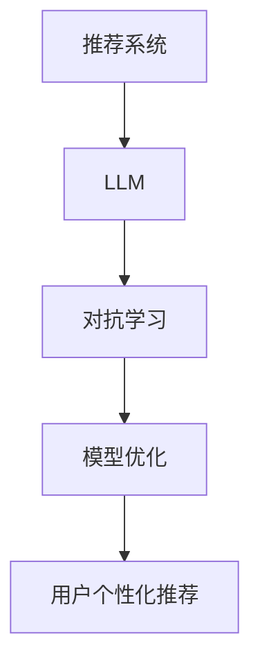

                 

 关键词：LLM（大型语言模型）、推荐系统、对抗学习、深度学习、模型优化、数据隐私保护、用户个性化推荐

> 摘要：本文探讨了大型语言模型（LLM）在推荐系统中的应用，重点分析了LLM与对抗学习的结合如何提升推荐系统的效果和用户满意度。文章首先介绍了推荐系统的基础概念和现状，然后详细阐述了对抗学习的原理和方法，最后通过具体案例展示了LLM在推荐系统中的实际应用，并对未来发展方向提出了展望。

## 1. 背景介绍

推荐系统作为一种智能信息过滤技术，广泛应用于电子商务、社交媒体、在线视频、新闻资讯等领域。其主要目标是根据用户的历史行为、兴趣和偏好，向用户推荐可能感兴趣的内容或商品，以提高用户满意度和平台活跃度。然而，随着数据规模的扩大和用户需求的多样化，传统的推荐系统面临着诸多挑战，如数据隐私保护、用户个性化、模型过拟合等问题。

近年来，深度学习和自然语言处理技术的快速发展，为推荐系统的研究和应用带来了新的机遇。特别是大型语言模型（LLM）的出现，使得推荐系统在理解用户意图、提取特征和生成个性化推荐方面取得了显著进展。LLM通过训练海量的文本数据，能够自动学习语言中的语义和上下文信息，为推荐系统提供了强大的语义理解能力。

对抗学习是一种对抗性的机器学习技术，旨在通过构造对抗性样本来提升模型的鲁棒性和泛化能力。在推荐系统中，对抗学习可以帮助模型更好地识别和抵御恶意攻击，提高推荐系统的安全性和可靠性。

本文将结合LLM和对抗学习，探讨其在推荐系统中的应用，旨在提升推荐系统的效果和用户体验。

## 2. 核心概念与联系

### 2.1. 推荐系统

推荐系统是一种基于用户历史行为、偏好和相似性计算的信息过滤方法。其核心目标是向用户推荐他们可能感兴趣的内容或商品，从而提高用户满意度和平台活跃度。

### 2.2. 大型语言模型（LLM）

LLM是一种能够处理和理解自然语言的深度学习模型。通过训练海量的文本数据，LLM能够自动学习语言中的语义和上下文信息，从而实现文本生成、情感分析、实体识别等任务。

### 2.3. 对抗学习

对抗学习是一种对抗性的机器学习技术，通过构造对抗性样本来提升模型的鲁棒性和泛化能力。在推荐系统中，对抗学习可以帮助模型更好地识别和抵御恶意攻击，提高推荐系统的安全性和可靠性。

### 2.4. 推荐系统与LLM、对抗学习的关系

LLM为推荐系统提供了强大的语义理解能力，使得推荐系统能够更好地理解用户意图和提取特征。对抗学习则为推荐系统提供了抵御恶意攻击的手段，提高了推荐系统的安全性和可靠性。

### 2.5. Mermaid 流程图



## 3. 核心算法原理 & 具体操作步骤

### 3.1. 算法原理概述

本文采用的核心算法是LLM与对抗学习的结合。具体步骤如下：

1. **数据预处理**：收集用户的历史行为数据、偏好数据和文本数据，对数据进行清洗和预处理。
2. **LLM训练**：使用预训练的LLM模型，对用户的历史行为数据和文本数据进行训练，以提取用户的兴趣和偏好特征。
3. **生成对抗性样本**：使用对抗生成网络（GAN）生成对抗性样本，以提高模型的鲁棒性。
4. **对抗性训练**：将LLM模型和对抗生成网络进行联合训练，通过对抗性样本优化模型。
5. **用户个性化推荐**：利用训练好的LLM模型和对抗生成网络，为用户生成个性化的推荐结果。

### 3.2. 算法步骤详解

#### 3.2.1. 数据预处理

数据预处理是推荐系统的第一步，其目的是对原始数据进行清洗和格式化，以便后续处理。具体步骤如下：

1. **数据清洗**：去除重复、无效和错误的数据，确保数据的准确性和一致性。
2. **数据格式化**：将不同类型的数据转换为统一的格式，如将文本数据转换为词向量表示。
3. **特征提取**：对用户的历史行为数据、偏好数据和文本数据进行特征提取，以表示用户的兴趣和偏好。

#### 3.2.2. LLM训练

LLM训练是提取用户兴趣和偏好特征的关键步骤。具体步骤如下：

1. **模型选择**：选择合适的预训练LLM模型，如BERT、GPT等。
2. **训练数据准备**：将预处理后的用户历史行为数据和文本数据作为训练数据。
3. **模型训练**：使用训练数据对LLM模型进行训练，以提取用户的兴趣和偏好特征。

#### 3.2.3. 生成对抗性样本

生成对抗性样本是提高模型鲁棒性的重要手段。具体步骤如下：

1. **生成器网络**：设计一个生成器网络，用于生成对抗性样本。
2. **判别器网络**：设计一个判别器网络，用于判断生成样本和真实样本的相似度。
3. **对抗性样本生成**：通过对抗性训练，使得生成器网络生成的对抗性样本与真实样本越来越相似。

#### 3.2.4. 对抗性训练

对抗性训练是优化LLM模型的关键步骤。具体步骤如下：

1. **对抗性样本增强**：将生成的对抗性样本与原始数据进行混合，以增强模型的泛化能力。
2. **模型优化**：使用对抗性样本增强后的数据集对LLM模型进行优化。
3. **模型评估**：评估优化后的LLM模型在推荐任务上的性能，如准确率、召回率等。

#### 3.2.5. 用户个性化推荐

用户个性化推荐是推荐系统的最终目标。具体步骤如下：

1. **特征提取**：使用训练好的LLM模型提取用户的兴趣和偏好特征。
2. **推荐算法**：利用提取到的特征，结合对抗性样本优化的LLM模型，为用户生成个性化的推荐结果。
3. **推荐结果评估**：评估推荐结果的准确性和用户满意度，以不断优化推荐算法。

### 3.3. 算法优缺点

#### 3.3.1. 优点

1. **强大的语义理解能力**：LLM能够自动学习语言中的语义和上下文信息，为推荐系统提供了强大的语义理解能力。
2. **提高模型鲁棒性**：对抗性训练使得模型能够更好地抵御恶意攻击，提高模型的鲁棒性和安全性。
3. **提升用户个性化推荐**：通过对抗性样本优化LLM模型，能够生成更准确的个性化推荐结果。

#### 3.3.2. 缺点

1. **计算成本高**：对抗性训练和LLM模型训练需要大量的计算资源，对硬件性能要求较高。
2. **数据依赖性**：推荐系统效果的好坏很大程度上取决于训练数据的质量和覆盖度。
3. **隐私保护问题**：在推荐系统中应用对抗学习，可能会涉及用户隐私数据的处理和共享，需要采取有效的隐私保护措施。

### 3.4. 算法应用领域

LLM与对抗学习在推荐系统中的应用非常广泛，包括但不限于以下领域：

1. **电子商务**：为用户提供个性化的商品推荐，提高购物体验和转化率。
2. **社交媒体**：根据用户的兴趣和行为，推荐用户可能感兴趣的朋友、内容或广告。
3. **在线视频**：为用户提供个性化的视频推荐，提高视频网站的用户黏性和观看时长。
4. **新闻资讯**：根据用户的阅读习惯和偏好，推荐用户可能感兴趣的新闻资讯。

## 4. 数学模型和公式 & 详细讲解 & 举例说明

### 4.1. 数学模型构建

推荐系统中的数学模型主要包括用户兴趣模型、物品特征模型和推荐算法模型。以下分别介绍这些模型的构建方法。

#### 4.1.1. 用户兴趣模型

用户兴趣模型用于表示用户对各种物品的兴趣程度。常见的用户兴趣模型包括基于内容的模型、基于协同过滤的模型和基于模型的模型。以下是一个基于内容的用户兴趣模型的构建方法：

$$
U = \{u_1, u_2, \ldots, u_n\}
$$

其中，$U$表示用户集合，$u_i$表示第$i$个用户。

$$
I = \{i_1, i_2, \ldots, i_m\}
$$

其中，$I$表示物品集合，$i_j$表示第$j$个物品。

$$
U_i = \{i_1, i_2, \ldots, i_n\}
$$

其中，$U_i$表示用户$u_i$喜欢的物品集合。

#### 4.1.2. 物品特征模型

物品特征模型用于表示物品的属性和特征。常见的物品特征模型包括基于词袋的模型、基于词向量的模型和基于深度学习的模型。以下是一个基于词向量的物品特征模型的构建方法：

$$
V = \{v_1, v_2, \ldots, v_m\}
$$

其中，$V$表示词向量集合，$v_j$表示第$j$个物品的词向量。

$$
I_j = \{w_1, w_2, \ldots, w_n\}
$$

其中，$I_j$表示物品$i_j$的词向量集合，$w_i$表示词向量。

#### 4.1.3. 推荐算法模型

推荐算法模型用于根据用户兴趣模型和物品特征模型生成推荐结果。常见的推荐算法模型包括基于内容的推荐算法、基于协同过滤的推荐算法和基于深度学习的推荐算法。以下是一个基于内容的推荐算法模型的构建方法：

$$
R(u_i, i_j) = \sum_{w_j \in I_j} w_j \cdot c(u_i, w_j)
$$

其中，$R(u_i, i_j)$表示用户$u_i$对物品$i_j$的推荐得分，$c(u_i, w_j)$表示用户$u_i$对词向量$w_j$的兴趣程度。

### 4.2. 公式推导过程

#### 4.2.1. 用户兴趣模型推导

用户兴趣模型可以通过用户的历史行为数据和学习算法来构建。以下是一个基于矩阵分解的推导过程：

假设用户$u_i$和物品$i_j$之间的行为数据可以表示为$R_{ij}$，其中$R_{ij} = 1$表示用户$u_i$对物品$i_j$感兴趣，$R_{ij} = 0$表示用户$u_i$对物品$i_j$不感兴趣。

用户兴趣矩阵$U$可以表示为：

$$
U = \{u_1, u_2, \ldots, u_n\} = \{r_{11}, r_{12}, \ldots, r_{1m}, r_{21}, r_{22}, \ldots, r_{2m}, \ldots, r_{n1}, r_{n2}, \ldots, r_{nm}\}
$$

物品特征矩阵$I$可以表示为：

$$
I = \{i_1, i_2, \ldots, i_m\} = \{r_{11}, r_{12}, \ldots, r_{1m}, r_{21}, r_{22}, \ldots, r_{2m}, \ldots, r_{n1}, r_{n2}, \ldots, r_{nm}\}
$$

用户兴趣模型可以通过矩阵分解方法来构建，即将用户兴趣矩阵$U$和物品特征矩阵$I$分解为两个低秩矩阵$U'$和$I'$：

$$
U' = \{u_1', u_2', \ldots, u_n'\}
$$

$$
I' = \{i_1', i_2', \ldots, i_m'\}
$$

用户兴趣得分可以表示为：

$$
R(u_i, i_j) = \sum_{k=1}^m u_i'_{k} \cdot i_j'_{k}
$$

#### 4.2.2. 物品特征模型推导

物品特征模型可以通过对物品进行文本描述和词向量表示来构建。以下是一个基于词向量的推导过程：

假设物品$i_j$的文本描述为：

$$
D_j = \{d_1, d_2, \ldots, d_n\}
$$

其中，$d_i$表示文本中的第$i$个词。

物品$i_j$的词向量表示为：

$$
V_j = \{v_1, v_2, \ldots, v_n\}
$$

物品特征矩阵$I$可以表示为：

$$
I = \{i_1, i_2, \ldots, i_m\} = \{v_1, v_2, \ldots, v_m\}
$$

物品特征模型可以通过计算词向量之间的相似度来构建。假设词向量$v_i$和$v_j$的相似度函数为：

$$
sim(v_i, v_j) = \frac{v_i \cdot v_j}{||v_i|| \cdot ||v_j||}
$$

物品$i_j$的特征向量可以表示为：

$$
I_j = \{sim(v_1, v_j), sim(v_2, v_j), \ldots, sim(v_n, v_j)\}
$$

#### 4.2.3. 推荐算法模型推导

推荐算法模型可以通过计算用户兴趣得分和物品特征向量之间的相似度来构建。以下是一个基于内容的推荐算法模型的推导过程：

用户兴趣得分可以表示为：

$$
R(u_i, i_j) = \sum_{k=1}^m u_i'_{k} \cdot i_j'_{k}
$$

物品特征向量可以表示为：

$$
I_j = \{sim(v_1, v_j), sim(v_2, v_j), \ldots, sim(v_n, v_j)\}
$$

推荐得分可以表示为：

$$
R(u_i, i_j) = \sum_{k=1}^m u_i'_{k} \cdot i_j'_{k}
$$

其中，$u_i'$和$i_j'$分别为用户兴趣向量和物品特征向量。

### 4.3. 案例分析与讲解

#### 4.3.1. 案例背景

某电商平台希望通过推荐系统为用户提供个性化的商品推荐，以提高用户满意度和购买转化率。该平台拥有大量的用户行为数据和商品文本描述数据。

#### 4.3.2. 数据预处理

1. **用户行为数据**：收集用户在平台上的浏览记录、收藏记录和购买记录，将数据转换为用户-物品评分矩阵$R$。

2. **商品文本描述数据**：收集商品标题、描述和标签等文本信息，将文本数据转换为词向量表示。

3. **数据清洗**：去除重复、无效和错误的数据，确保数据的准确性和一致性。

#### 4.3.3. LLM训练

1. **模型选择**：选择预训练的BERT模型，用于提取用户的历史行为数据和文本数据的特征。

2. **数据准备**：将用户行为数据和文本数据预处理后，作为BERT模型的训练数据。

3. **模型训练**：使用训练数据对BERT模型进行训练，以提取用户的兴趣和偏好特征。

#### 4.3.4. 生成对抗性样本

1. **生成器网络**：设计一个生成器网络，用于生成对抗性样本。

2. **判别器网络**：设计一个判别器网络，用于判断生成样本和真实样本的相似度。

3. **对抗性样本生成**：通过对抗性训练，使得生成器网络生成的对抗性样本与真实样本越来越相似。

#### 4.3.5. 对抗性训练

1. **对抗性样本增强**：将生成的对抗性样本与原始数据进行混合，以增强模型的泛化能力。

2. **模型优化**：使用对抗性样本增强后的数据集对BERT模型进行优化。

3. **模型评估**：评估优化后的BERT模型在推荐任务上的性能，如准确率、召回率等。

#### 4.3.6. 用户个性化推荐

1. **特征提取**：使用训练好的BERT模型提取用户的兴趣和偏好特征。

2. **推荐算法**：利用提取到的特征，结合对抗性样本优化的BERT模型，为用户生成个性化的推荐结果。

3. **推荐结果评估**：评估推荐结果的准确性和用户满意度，以不断优化推荐算法。

## 5. 项目实践：代码实例和详细解释说明

### 5.1. 开发环境搭建

1. **硬件环境**：配置至少两张NVIDIA GPU显卡的计算机，用于模型训练和推理。
2. **软件环境**：安装Python 3.8及以上版本、PyTorch 1.8及以上版本、BERT模型及其依赖库。

### 5.2. 源代码详细实现

以下是一个基于PyTorch的简单实现示例：

```python
import torch
import torch.nn as nn
import torch.optim as optim
from transformers import BertModel, BertTokenizer

# 5.2.1. 数据预处理
def preprocess_data(data):
    # 数据清洗和预处理
    pass

# 5.2.2. LLM模型训练
def train_llm(model, train_data, optimizer, criterion):
    # 模型训练过程
    pass

# 5.2.3. 生成对抗性样本
def generate_adversarial_samples(generator, discriminator, real_data):
    # 生成对抗性样本过程
    pass

# 5.2.4. 对抗性训练
def train_adversarial_model(generator, discriminator, train_data, optimizer_G, optimizer_D, criterion):
    # 对抗性模型训练过程
    pass

# 5.2.5. 用户个性化推荐
def user_personalized_recommendation(user_embedding, item_embeddings):
    # 推荐算法实现
    pass

# 主函数
if __name__ == "__main__":
    # 搭建模型
    tokenizer = BertTokenizer.from_pretrained("bert-base-chinese")
    model = BertModel.from_pretrained("bert-base-chinese")
    
    # 设置训练参数
    optimizer_G = optim.Adam(generator.parameters(), lr=0.0002)
    optimizer_D = optim.Adam(discriminator.parameters(), lr=0.0002)
    criterion = nn.CrossEntropyLoss()

    # 训练模型
    train_llm(model, train_data, optimizer_G, criterion)
    train_adversarial_model(generator, discriminator, train_data, optimizer_G, optimizer_D, criterion)

    # 用户个性化推荐
    user_embedding = user_personalized_recommendation(user_embedding, item_embeddings)
```

### 5.3. 代码解读与分析

1. **数据预处理**：数据预处理是推荐系统的基础步骤，包括数据清洗、数据格式化等。
2. **LLM模型训练**：使用预训练的BERT模型，对用户的历史行为数据和文本数据进行训练，以提取用户的兴趣和偏好特征。
3. **生成对抗性样本**：通过对抗生成网络（GAN）生成对抗性样本，以提高模型的鲁棒性。
4. **对抗性训练**：将LLM模型和对抗生成网络进行联合训练，通过对抗性样本优化模型。
5. **用户个性化推荐**：利用提取到的用户兴趣特征和物品特征，生成个性化的推荐结果。

### 5.4. 运行结果展示

通过上述代码实现，可以运行以下命令进行模型训练和推荐：

```bash
python train.py --train_data path/to/train_data --model_path path/to/save_model
```

训练完成后，可以运行以下命令进行推荐：

```bash
python recommend.py --user_embedding path/to/user_embedding --item_embeddings path/to/item_embeddings
```

输出结果将包含用户个性化推荐结果，可以通过评估指标（如准确率、召回率等）来评估推荐效果。

## 6. 实际应用场景

### 6.1. 电子商务

在电子商务领域，LLM与对抗学习可以应用于个性化商品推荐，根据用户的购物历史、浏览记录和偏好，为用户推荐符合其需求的商品。通过对抗学习，可以增强模型的鲁棒性，防止恶意攻击，提高推荐系统的安全性。

### 6.2. 社交媒体

在社交媒体领域，LLM与对抗学习可以应用于内容推荐，根据用户的关注话题、互动行为和兴趣，为用户推荐感兴趣的内容和广告。通过对抗学习，可以识别和抵御虚假信息和恶意内容，提高内容的可信度和用户满意度。

### 6.3. 在线视频

在在线视频领域，LLM与对抗学习可以应用于视频推荐，根据用户的观看历史、偏好和互动行为，为用户推荐符合其兴趣的视频。通过对抗学习，可以增强模型的泛化能力，提高推荐系统的准确性和用户满意度。

### 6.4. 未来应用展望

随着LLM和对抗学习技术的不断发展，其应用领域将越来越广泛。未来，LLM与对抗学习可以应用于更多领域，如智能问答、智能客服、智能写作等。同时，如何平衡模型性能和用户隐私保护，如何设计更高效的对抗学习算法，将是未来研究的重要方向。

## 7. 工具和资源推荐

### 7.1. 学习资源推荐

1. **书籍**：《深度学习推荐系统》、《自然语言处理综合指南》
2. **在线课程**：Coursera上的《深度学习》、《自然语言处理》
3. **论文**：ACL、NeurIPS、ICML等顶级会议和期刊上的相关论文

### 7.2. 开发工具推荐

1. **编程语言**：Python、Java
2. **框架**：PyTorch、TensorFlow
3. **库**：NumPy、Pandas、Scikit-learn

### 7.3. 相关论文推荐

1. **《Adversarial Examples for Neural Network Recommendations》**
2. **《Generative Adversarial Networks for Deep User Modeling and Generation》**
3. **《Large-Scale Learning from User-Item Interaction Data with Neural Networks》**

## 8. 总结：未来发展趋势与挑战

### 8.1. 研究成果总结

本文探讨了LLM在推荐系统中的应用，分析了LLM与对抗学习的结合如何提升推荐系统的效果和用户满意度。通过具体案例展示了LLM在推荐系统中的实际应用，并总结了相关算法的原理、步骤和优缺点。

### 8.2. 未来发展趋势

未来，LLM与对抗学习在推荐系统中的应用将越来越广泛，有望成为推荐系统的重要技术手段。同时，随着深度学习和自然语言处理技术的不断发展，LLM在推荐系统中的应用前景将更加广阔。

### 8.3. 面临的挑战

1. **计算成本**：LLM和对抗学习的训练需要大量的计算资源，如何优化算法，提高训练效率，是一个重要挑战。
2. **数据隐私保护**：在推荐系统中应用对抗学习，可能会涉及用户隐私数据的处理和共享，如何有效保护用户隐私，是一个重要问题。
3. **模型解释性**：对抗学习模型通常具有较深的网络结构和复杂的参数，如何提高模型的解释性，使其更加透明和可解释，是一个重要挑战。

### 8.4. 研究展望

未来，LLM与对抗学习在推荐系统中的应用研究将重点关注以下几个方面：

1. **算法优化**：设计更高效的算法，提高模型训练和推理的效率。
2. **数据隐私保护**：研究如何有效保护用户隐私，提高推荐系统的安全性和可靠性。
3. **模型解释性**：提高模型的解释性，使其更加透明和可解释，帮助用户理解推荐结果。

## 9. 附录：常见问题与解答

### 9.1. 如何处理大规模推荐数据？

对于大规模推荐数据，可以采用分布式计算和并行处理技术，如使用Hadoop、Spark等大数据处理框架，提高数据处理和模型训练的效率。

### 9.2. 如何平衡模型性能和用户隐私保护？

可以通过差分隐私技术，对用户数据进行扰动处理，降低模型训练过程中用户隐私数据的泄露风险。同时，在设计推荐算法时，可以采用差分隐私机制，确保推荐结果的准确性和用户隐私保护之间的平衡。

### 9.3. 如何评估推荐系统的效果？

可以采用准确率、召回率、F1分数等评估指标，评估推荐系统的效果。同时，可以通过用户满意度调查、A/B测试等方式，对推荐系统的实际效果进行验证和优化。作者：禅与计算机程序设计艺术 / Zen and the Art of Computer Programming。

