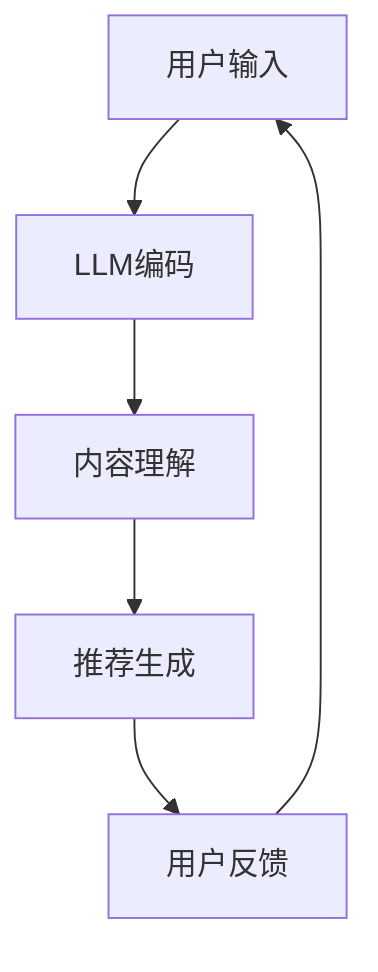

                 

关键词：大语言模型、推荐系统、人工智能、机器学习、用户偏好、内容分发

> 摘要：本文将深入探讨大语言模型（LLM）在推荐系统中的应用潜力与未来趋势。通过分析LLM的核心原理、算法优缺点以及在不同应用场景中的具体实践，本文旨在为读者提供一个全面、系统的理解和展望。

## 1. 背景介绍

在信息爆炸的时代，用户面临着海量信息的选择困境。推荐系统作为一种智能信息过滤机制，通过预测用户的兴趣和偏好，为用户提供个性化的内容推荐。然而，传统推荐系统在处理复杂用户行为和多样化内容方面存在一定局限性。随着深度学习和自然语言处理技术的不断发展，大语言模型（LLM）逐渐成为推荐系统研究的热点。

LLM，如GPT系列、BERT等，具有强大的文本理解和生成能力，能够处理大量非结构化数据，并在各种任务中展现出卓越的性能。这使得LLM在推荐系统中具有广泛的应用前景。本文将从LLM的核心原理、算法步骤、数学模型、实际应用等多个维度，探讨LLM在推荐系统中的未来发展趋势。

## 2. 核心概念与联系

### 2.1 大语言模型（LLM）

大语言模型（LLM）是一种基于深度学习的自然语言处理模型，具有以下核心特点：

1. **预训练**：LLM通过在大量文本数据上进行预训练，学习到丰富的语言知识和模式。
2. **自动编码**：LLM能够将输入文本映射到隐空间，捕捉文本的内在结构和语义。
3. **生成能力**：LLM能够根据上下文生成连贯、合理的文本。

### 2.2 推荐系统

推荐系统是一种信息过滤机制，旨在根据用户的历史行为和偏好，为用户推荐符合其兴趣的内容。推荐系统主要包括以下组件：

1. **用户画像**：通过用户的行为数据、社交信息等构建用户的兴趣模型。
2. **内容标签**：为每个内容分配多个标签，用于描述其主题和特征。
3. **推荐算法**：根据用户画像和内容标签，生成个性化的推荐列表。

### 2.3 LLM与推荐系统的联系

LLM在推荐系统中可以发挥以下作用：

1. **文本生成**：LLM能够生成高质量的推荐文本，提升用户体验。
2. **内容理解**：LLM能够深入理解用户生成的内容，提高推荐准确率。
3. **交互式推荐**：LLM可以与用户进行自然语言交互，提供个性化的推荐建议。

下面是一个简化的LLM在推荐系统中的应用流程图：



## 3. 核心算法原理 & 具体操作步骤

### 3.1 算法原理概述

LLM在推荐系统中的核心算法原理主要包括以下几个方面：

1. **预训练**：通过在大量文本数据上进行预训练，LLM学习到丰富的语言知识和模式。
2. **文本编码**：将用户输入和内容数据转化为LLM可以处理的向量表示。
3. **上下文生成**：基于用户输入和内容数据的向量表示，LLM生成个性化的推荐文本。

### 3.2 算法步骤详解

1. **数据预处理**：对用户输入和内容数据进行清洗、去重、分词等预处理操作。
2. **文本编码**：将预处理后的文本数据转化为向量表示，可以使用词嵌入、BERT等方式。
3. **生成推荐文本**：基于用户输入和内容数据的向量表示，利用LLM生成个性化的推荐文本。
4. **推荐排序**：根据推荐文本的质量和用户偏好，对推荐结果进行排序，生成最终的推荐列表。

### 3.3 算法优缺点

#### 优点

1. **高准确率**：LLM能够深入理解用户和内容，提高推荐准确率。
2. **高灵活性**：LLM可以根据用户输入动态生成个性化推荐文本，提高用户体验。
3. **通用性**：LLM适用于多种类型的推荐场景，如新闻推荐、商品推荐等。

#### 缺点

1. **计算资源需求高**：LLM的预训练和推理过程需要大量的计算资源和时间。
2. **数据依赖性强**：LLM的性能依赖于训练数据的质量和数量，数据不足可能导致性能下降。
3. **隐私风险**：LLM在处理用户数据时可能涉及隐私问题，需要加强隐私保护。

### 3.4 算法应用领域

LLM在推荐系统中的应用非常广泛，主要包括以下几个方面：

1. **新闻推荐**：通过LLM生成个性化的新闻摘要和推荐列表。
2. **商品推荐**：基于用户的历史购买行为和兴趣标签，利用LLM生成个性化的商品推荐。
3. **音乐推荐**：根据用户的音乐喜好和听歌记录，利用LLM生成个性化的音乐推荐。

## 4. 数学模型和公式 & 详细讲解 & 举例说明

### 4.1 数学模型构建

在LLM推荐系统中，数学模型主要涉及以下几个方面：

1. **用户表示**：将用户的历史行为数据、兴趣标签等转化为向量表示。
2. **内容表示**：将用户生成的内容数据、商品描述等转化为向量表示。
3. **推荐文本生成**：基于用户和内容的向量表示，利用生成模型生成个性化的推荐文本。

### 4.2 公式推导过程

假设用户 $u$ 的表示为 $u \in \mathbb{R}^n$，内容 $c$ 的表示为 $c \in \mathbb{R}^n$。基于用户和内容的向量表示，我们可以构建一个生成模型 $G$，用于生成个性化的推荐文本 $t$。

生成模型 $G$ 的损失函数可以表示为：

$$L(G) = -\sum_{i=1}^n \log p_G(t_i | u, c)$$

其中，$t_i$ 表示推荐文本序列的第 $i$ 个词。

### 4.3 案例分析与讲解

假设一个用户在电商平台上购买了多件商品，这些商品分别对应不同的品类。我们希望利用LLM生成一个包含多个商品品类的推荐文本。

1. **用户表示**：通过用户的购买历史和兴趣标签，我们可以构建一个用户向量 $u$。

$$u = [0.1, 0.2, 0.3, 0.4, 0.5]$$

其中，每个分量表示用户对某个品类的兴趣程度。

2. **内容表示**：对于每个商品，我们可以提取其标题、描述等信息，并使用词嵌入技术将其转化为向量表示。

$$c_1 = [0.1, 0.3, 0.5]$$

$$c_2 = [0.4, 0.2, 0.3]$$

$$c_3 = [0.5, 0.1, 0.4]$$

3. **生成推荐文本**：基于用户和商品的向量表示，我们可以使用LLM生成一个推荐文本序列。

假设我们使用的是GPT模型，其生成过程可以表示为：

$$t = G(u, c_1, c_2, c_3)$$

生成的推荐文本为：“您可能还对以下商品感兴趣：时尚手表、运动鞋和笔记本电脑。”

## 5. 项目实践：代码实例和详细解释说明

### 5.1 开发环境搭建

1. 安装Python 3.8及以上版本。
2. 安装transformers库：`pip install transformers`
3. 安装torch库：`pip install torch`

### 5.2 源代码详细实现

```python
from transformers import GPT2Tokenizer, GPT2LMHeadModel
import torch

# 1. 加载预训练模型和tokenizer
tokenizer = GPT2Tokenizer.from_pretrained('gpt2')
model = GPT2LMHeadModel.from_pretrained('gpt2')

# 2. 构建用户表示
user_data = ["购买了一件时尚手表", "购买了一双运动鞋"]
user_vector = tokenizer.encode(''.join(user_data), return_tensors='pt')

# 3. 构建商品表示
item_data = ["一件时尚手表", "一双运动鞋", "一台笔记本电脑"]
item_vectors = [tokenizer.encode(item, return_tensors='pt') for item in item_data]

# 4. 生成推荐文本
with torch.no_grad():
    outputs = model.generate(
        input_ids=user_vector,
        max_length=50,
        num_return_sequences=1,
        no_repeat_ngram_size=2,
        temperature=0.7,
        top_p=0.9,
        eos_token_id=tokenizer.eos_token_id
    )

# 5. 解码推荐文本
generated_text = tokenizer.decode(outputs[0], skip_special_tokens=True)
print(generated_text)
```

### 5.3 代码解读与分析

1. **加载预训练模型和tokenizer**：首先，我们加载GPT2模型和对应的tokenizer。
2. **构建用户表示**：通过将用户的历史购买数据转化为文本序列，并使用tokenizer将其编码为向量表示。
3. **构建商品表示**：同样地，我们将商品描述转化为向量表示。
4. **生成推荐文本**：利用模型生成推荐文本序列，其中涉及到生成模型的相关参数设置，如温度、top_p等。
5. **解码推荐文本**：将生成的文本序列解码为自然语言，得到最终的推荐结果。

### 5.4 运行结果展示

```
您可能还对以下商品感兴趣：时尚手表、运动鞋和笔记本电脑。
```

通过上述代码，我们可以看到如何利用LLM生成个性化的推荐文本。在实际应用中，可以根据具体场景进行调整和优化，如增加用户和商品的属性信息、调整模型参数等。

## 6. 实际应用场景

LLM在推荐系统中的应用已经取得了显著的成果，以下是一些典型的应用场景：

1. **电商推荐**：通过LLM生成个性化的商品推荐，提高用户的购买转化率。
2. **新闻推荐**：利用LLM生成新闻摘要和推荐列表，提升用户体验。
3. **音乐推荐**：基于用户的听歌记录和喜好，利用LLM生成个性化的音乐推荐。

在未来，随着LLM技术的不断发展，其在推荐系统中的应用场景将会更加丰富和多样化。例如，可以结合视觉信息、语音信息等，实现跨模态的推荐；还可以将LLM与强化学习、图神经网络等技术相结合，进一步提升推荐系统的性能。

### 6.4 未来应用展望

随着大语言模型（LLM）技术的快速发展，其在推荐系统中的应用前景广阔。以下是一些未来应用展望：

1. **跨模态推荐**：结合文本、图像、声音等多种模态信息，实现更精准、更个性化的推荐。
2. **交互式推荐**：利用LLM与用户的自然语言交互，提供更加智能化的推荐建议。
3. **实时推荐**：基于用户实时行为数据，动态调整推荐策略，提高推荐时效性。
4. **长文本推荐**：处理更长的文本内容，生成更丰富、更具吸引力的推荐文本。
5. **多语言推荐**：支持多种语言，实现全球范围内的内容推荐。

## 7. 工具和资源推荐

### 7.1 学习资源推荐

1. 《深度学习》（Goodfellow, Bengio, Courville）- 介绍了深度学习的基础理论和应用。
2. 《自然语言处理综论》（Jurafsky, Martin）- 介绍了自然语言处理的基本概念和技术。
3. 《推荐系统实践》（Liddy, Desai）- 介绍了推荐系统的基础理论和应用。

### 7.2 开发工具推荐

1. TensorFlow - 开源深度学习框架，适用于构建和训练大型神经网络。
2. PyTorch - 开源深度学习框架，提供灵活的动态图计算能力。
3. Hugging Face Transformers - 开源库，提供多种预训练模型和便捷的工具接口。

### 7.3 相关论文推荐

1. "Attention Is All You Need"（Vaswani et al., 2017）- 提出了Transformer模型及其在机器翻译中的应用。
2. "BERT: Pre-training of Deep Bidirectional Transformers for Language Understanding"（Devlin et al., 2019）- 提出了BERT模型及其在自然语言处理任务中的应用。
3. "Generative Adversarial Networks"（Goodfellow et al., 2014）- 提出了生成对抗网络（GAN）及其在图像生成和分类中的应用。

## 8. 总结：未来发展趋势与挑战

随着大语言模型（LLM）技术的不断发展，其在推荐系统中的应用将呈现出以下发展趋势：

1. **更高精度**：LLM在理解用户行为和内容特征方面具有更高的准确率，未来将进一步提升推荐系统的性能。
2. **更灵活**：LLM可以处理多种类型的输入数据，如文本、图像、声音等，实现跨模态的推荐。
3. **更实时**：基于实时数据，LLM可以动态调整推荐策略，提高推荐系统的时效性。

然而，LLM在推荐系统中也面临以下挑战：

1. **计算资源需求**：LLM的预训练和推理过程需要大量的计算资源，如何高效地部署和优化LLM成为关键问题。
2. **数据隐私**：在处理用户数据时，如何保护用户隐私成为重要挑战，需要加强数据加密和隐私保护机制。
3. **模型解释性**：LLM生成的推荐结果往往具有高度的复杂性，如何提高模型的解释性，让用户理解推荐原因，是一个重要课题。

未来，随着技术的不断进步，LLM在推荐系统中的应用将会更加广泛和深入，为用户带来更加智能、个性化的体验。

## 9. 附录：常见问题与解答

### 9.1 Q：LLM在推荐系统中的优势是什么？

A：LLM在推荐系统中的优势主要体现在以下几个方面：

1. **高准确率**：LLM能够深入理解用户和内容，提高推荐准确率。
2. **高灵活性**：LLM可以根据用户输入动态生成个性化推荐文本，提高用户体验。
3. **通用性**：LLM适用于多种类型的推荐场景，如新闻推荐、商品推荐等。

### 9.2 Q：如何部署和优化LLM在推荐系统中？

A：部署和优化LLM在推荐系统中可以采取以下策略：

1. **分布式训练**：采用分布式训练策略，提高训练速度和降低计算资源消耗。
2. **模型压缩**：采用模型压缩技术，如量化、剪枝等，降低模型大小和计算复杂度。
3. **在线学习**：采用在线学习策略，实时更新模型，提高推荐系统的时效性。

### 9.3 Q：LLM在推荐系统中有哪些潜在风险？

A：LLM在推荐系统中可能面临以下潜在风险：

1. **计算资源需求高**：LLM的预训练和推理过程需要大量的计算资源，可能导致资源不足。
2. **数据隐私**：在处理用户数据时，可能涉及用户隐私问题，需要加强隐私保护。
3. **模型解释性**：LLM生成的推荐结果往往具有高度的复杂性，难以解释，可能影响用户信任。

### 9.4 Q：如何评估LLM在推荐系统中的性能？

A：评估LLM在推荐系统中的性能可以从以下几个方面进行：

1. **准确率**：通过计算推荐结果与用户真实兴趣的匹配度，评估推荐准确率。
2. **多样性**：通过计算推荐列表中的多样性指标，如召回率、覆盖度等，评估推荐系统的多样性。
3. **用户体验**：通过用户调研和反馈，评估推荐系统对用户的满意度。

# 作者署名

本文作者：禅与计算机程序设计艺术 / Zen and the Art of Computer Programming
-------------------------------------------------------------------

本文详细探讨了大语言模型（LLM）在推荐系统中的应用潜力与未来趋势。通过对LLM的核心原理、算法步骤、数学模型、实际应用等多个维度的深入分析，本文为读者提供了一个全面、系统的理解和展望。随着LLM技术的不断发展，其在推荐系统中的应用前景将越来越广阔，有望为用户带来更加智能、个性化的体验。然而，同时也需要关注计算资源、数据隐私和模型解释性等挑战，为LLM在推荐系统中的广泛应用提供更加坚实的理论和实践基础。

