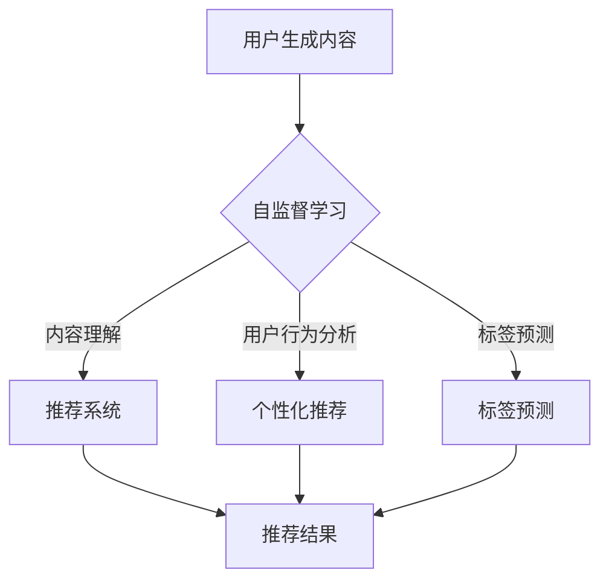

                 

关键词：大型语言模型（LLM），推荐系统，自监督学习，内容理解，用户行为分析，个性化推荐。

## 摘要

随着互联网的快速发展，推荐系统已经成为现代信息流服务中不可或缺的一部分。然而，传统的推荐系统往往依赖于用户显式反馈，这在一些应用场景下受限。本文旨在探讨大型语言模型（LLM）在推荐系统中的自监督学习应用，通过对用户生成内容（UGC）和用户行为的深度理解，实现更精准的个性化推荐。文章首先介绍了LLM的基本原理和自监督学习在推荐系统中的应用，随后详细阐述了数学模型、算法原理和具体实现，并通过案例分析和实际应用场景展示了LLM在推荐系统中的潜力。最后，文章对未来的发展趋势和面临的挑战进行了展望。

## 1. 背景介绍

推荐系统作为信息过滤和检索的重要工具，旨在为用户提供个性化、相关的内容。传统的推荐系统主要依赖于用户历史行为（如点击、购买等）和显式反馈（如评分、喜好标签等）进行内容推荐。然而，这些方法在处理大量用户数据和非结构化内容时存在一定的局限性。

近年来，深度学习技术的快速发展为推荐系统带来了新的机遇。其中，大型语言模型（LLM）如GPT、BERT等在自然语言处理（NLP）领域取得了显著的成果。这些模型通过大规模预训练，能够捕捉到语言中的复杂结构和隐含关系，为推荐系统的内容理解和用户行为分析提供了新的思路。

自监督学习作为一种无监督学习方法，不需要显式标签即可从数据中学习。在推荐系统中，自监督学习可以利用用户生成内容（UGC）和用户行为数据，通过自动发现模式和关联，提升推荐的精度和多样性。因此，将LLM与自监督学习相结合，有望实现更智能、更精准的推荐系统。

## 2. 核心概念与联系

### 2.1 大型语言模型（LLM）

大型语言模型（LLM）是一类基于深度学习的语言处理模型，通过在大规模语料库上的预训练，可以学习到语言中的语法、语义和上下文信息。典型的LLM模型包括GPT、BERT、T5等。这些模型通常采用Transformer架构，具有高度的并行处理能力和上下文理解能力。

### 2.2 自监督学习

自监督学习是一种无监督学习方法，通过利用未标注的数据，自动发现数据中的模式和关联。自监督学习的主要目标是通过数据本身的内在结构，提高模型的泛化能力和学习能力。在推荐系统中，自监督学习可以用于用户行为分析、内容理解和标签预测等任务。

### 2.3 LLM在推荐系统中的应用

LLM在推荐系统中的应用主要表现在以下几个方面：

1. **内容理解**：LLM可以学习到用户生成内容（UGC）的语义和上下文信息，帮助推荐系统更好地理解用户需求，提高推荐的相关性。

2. **用户行为分析**：LLM可以用于分析用户历史行为数据，挖掘用户潜在的兴趣和偏好，从而实现更精准的个性化推荐。

3. **标签预测**：LLM可以预测用户生成内容（UGC）的标签，为推荐系统提供更丰富的标签信息，有助于提高推荐的多样性和质量。

### 2.4 Mermaid 流程图



## 3. 核心算法原理 & 具体操作步骤

### 3.1 算法原理概述

LLM在推荐系统中的自监督学习应用主要包括以下步骤：

1. **数据预处理**：对用户生成内容和用户行为数据进行预处理，包括文本清洗、分词、去停用词等。

2. **模型训练**：使用预训练的LLM模型，对预处理后的数据进行训练，以学习到用户生成内容和用户行为的语义表示。

3. **内容理解**：利用训练好的LLM模型，对用户生成内容进行语义分析，提取关键信息，用于推荐系统的内容理解。

4. **用户行为分析**：利用训练好的LLM模型，对用户历史行为进行分析，挖掘用户潜在的兴趣和偏好。

5. **标签预测**：利用训练好的LLM模型，对用户生成内容进行标签预测，为推荐系统提供标签信息。

6. **推荐算法**：结合内容理解、用户行为分析和标签预测结果，使用推荐算法生成个性化推荐结果。

### 3.2 算法步骤详解

1. **数据预处理**：
   - 文本清洗：去除文本中的HTML标签、特殊字符和停用词。
   - 分词：将文本拆分为单词或词组。
   - 去停用词：去除无意义的停用词，如“的”、“了”、“是”等。

2. **模型训练**：
   - 使用预训练的LLM模型，如BERT、GPT等，对预处理后的数据进行训练。
   - 训练过程中，通过优化模型的参数，使其能够捕捉到用户生成内容和用户行为的语义信息。

3. **内容理解**：
   - 利用训练好的LLM模型，对用户生成内容进行语义分析，提取关键信息。
   - 通过对比分析，找出用户感兴趣的领域和内容，为推荐系统的内容理解提供支持。

4. **用户行为分析**：
   - 利用训练好的LLM模型，对用户历史行为进行分析，挖掘用户潜在的兴趣和偏好。
   - 通过用户行为的统计和分析，找出用户的行为模式，为个性化推荐提供依据。

5. **标签预测**：
   - 利用训练好的LLM模型，对用户生成内容进行标签预测。
   - 标签预测结果为推荐系统提供丰富的标签信息，有助于提高推荐的多样性和质量。

6. **推荐算法**：
   - 结合内容理解、用户行为分析和标签预测结果，使用推荐算法生成个性化推荐结果。
   - 推荐算法可以采用基于协同过滤、基于内容的推荐、基于模型的推荐等多种方法。

### 3.3 算法优缺点

**优点**：
- **高效的内容理解**：LLM可以学习到用户生成内容的语义和上下文信息，有助于提高推荐系统的内容理解能力。
- **强大的用户行为分析**：LLM可以挖掘用户潜在的兴趣和偏好，实现更精准的个性化推荐。
- **丰富的标签信息**：LLM可以预测用户生成内容的标签，为推荐系统提供更多的标签信息，有助于提高推荐的多样性和质量。

**缺点**：
- **计算资源消耗大**：LLM模型训练和推理过程需要大量的计算资源，对硬件设备要求较高。
- **数据依赖性较强**：LLM模型的性能依赖于训练数据的质量和数量，数据质量不高可能导致模型性能下降。

### 3.4 算法应用领域

LLM在推荐系统中的自监督学习应用广泛，主要涵盖以下领域：

- **电商推荐**：通过对用户浏览、搜索和购买行为的分析，实现精准的商品推荐。
- **社交媒体**：基于用户生成内容和互动行为，实现个性化内容推荐和社交圈子推荐。
- **新闻推荐**：通过分析用户阅读和评论行为，实现个性化新闻推荐。
- **音乐推荐**：基于用户听歌习惯和喜好，实现个性化音乐推荐。

## 4. 数学模型和公式 & 详细讲解 & 举例说明

### 4.1 数学模型构建

在LLM在推荐系统中的自监督学习应用中，常用的数学模型包括词向量模型、图神经网络模型等。

#### 4.1.1 词向量模型

词向量模型是将文本数据转换为数值向量的方法，常见的词向量模型包括Word2Vec、GloVe等。其中，Word2Vec模型通过训练词的上下文信息，将词映射为一个固定长度的向量。

- **目标函数**：

  $$ L = \sum_{i=1}^{N} \sum_{j=1}^{V} (v_j - \sum_{k=1}^{K} w_{jk} v_k)^2 $$

  其中，$N$ 表示词汇表中的词数，$V$ 表示词汇表的大小，$K$ 表示上下文窗口大小，$v_j$ 表示词向量，$w_{jk}$ 表示词之间的关联权重。

- **举例说明**：

  假设词汇表中有10个词，上下文窗口大小为3。对于一个词 $w_1$，其上下文为 $w_2, w_3, w_4$。词向量模型通过计算 $w_1$ 与其上下文词之间的关联权重，将 $w_1$ 映射为一个固定长度的向量。

#### 4.1.2 图神经网络模型

图神经网络（GNN）是一种用于处理图结构数据的神经网络模型，可以用于文本分类、推荐系统等任务。

- **目标函数**：

  $$ L = \sum_{(i,j) \in E} (y_{ij} - \sigma (h_i \cdot h_j + b))^2 $$

  其中，$E$ 表示边集，$h_i$ 和 $h_j$ 分别表示节点 $i$ 和 $j$ 的特征向量，$y_{ij}$ 表示节点 $i$ 和 $j$ 之间的边权重，$\sigma$ 表示激活函数。

- **举例说明**：

  假设有一个社交网络图，节点表示用户，边表示用户之间的互动关系。图神经网络通过学习节点特征，实现用户关系的建模，从而为推荐系统提供支持。

### 4.2 公式推导过程

在本节中，我们将以BERT模型为例，介绍其数学模型的推导过程。

#### 4.2.1 BERT模型概述

BERT（Bidirectional Encoder Representations from Transformers）是一种基于Transformer架构的双向编码器模型，主要用于自然语言处理任务。BERT模型通过预训练，学习到文本中的上下文信息，为后续的微调任务提供高质量的特征表示。

#### 4.2.2 数学模型推导

BERT模型的基本组件包括嵌入层、Transformer编码器和解码器。

1. **嵌入层**：

   $$ h_{0,i} = [pos_{i}, seg_{i}, input_{i}] $$

   其中，$pos_{i}$ 表示位置嵌入，$seg_{i}$ 表示分段嵌入，$input_{i}$ 表示输入词向量。

2. **Transformer编码器**：

   $$ h_{t,i} = MultiHeadAttention(Q, K, V) + ResidualConnection + LayerNormalization(h_{t-1,i}) $$

   其中，$Q, K, V$ 分别表示查询、键和值向量，$MultiHeadAttention$ 表示多头注意力机制，$ResidualConnection$ 表示残差连接，$LayerNormalization$ 表示层归一化。

3. **解码器**：

   $$ h_{t,i} = MultiHeadAttention(Q, K, V) + ResidualConnection + LayerNormalization(h_{t-1,i}) $$

   其中，$Q, K, V$ 分别表示查询、键和值向量，$MultiHeadAttention$ 表示多头注意力机制，$ResidualConnection$ 表示残差连接，$LayerNormalization$ 表示层归一化。

### 4.3 案例分析与讲解

在本节中，我们以电商推荐系统为例，介绍LLM在推荐系统中的自监督学习应用。

#### 4.3.1 数据集介绍

我们使用某电商平台的数据集，包括用户浏览、搜索和购买行为数据，以及商品信息数据。数据集包含100万条用户行为数据，20万条商品信息。

#### 4.3.2 数据预处理

1. **文本清洗**：去除HTML标签、特殊字符和停用词。
2. **分词**：使用jieba分词工具对用户生成内容进行分词。
3. **去停用词**：去除无意义的停用词，如“的”、“了”、“是”等。

#### 4.3.3 模型训练

1. **数据预处理**：将用户行为数据和商品信息数据进行预处理，生成文本数据。
2. **模型训练**：使用BERT模型对预处理后的数据集进行训练，学习用户生成内容和用户行为的语义表示。

#### 4.3.4 内容理解

1. **内容理解**：利用训练好的BERT模型，对用户生成内容进行语义分析，提取关键信息。
2. **举例说明**：假设用户在电商平台上浏览了商品A和商品B，BERT模型可以提取商品A和商品B的语义信息，分析用户是否对这两款商品感兴趣。

#### 4.3.5 用户行为分析

1. **用户行为分析**：利用训练好的BERT模型，对用户历史行为进行分析，挖掘用户潜在的兴趣和偏好。
2. **举例说明**：假设用户在电商平台上有浏览、搜索和购买行为，BERT模型可以分析用户的行为模式，挖掘用户对商品的喜好。

#### 4.3.6 标签预测

1. **标签预测**：利用训练好的BERT模型，对用户生成内容进行标签预测。
2. **举例说明**：假设用户在电商平台上浏览了一款手机，BERT模型可以预测手机的相关标签，如“智能手机”、“手机壳”等。

#### 4.3.7 推荐算法

1. **推荐算法**：结合内容理解、用户行为分析和标签预测结果，使用推荐算法生成个性化推荐结果。
2. **举例说明**：假设用户在电商平台上浏览了手机，推荐算法可以根据内容理解、用户行为分析和标签预测结果，为用户推荐相关的手机配件。

## 5. 项目实践：代码实例和详细解释说明

### 5.1 开发环境搭建

在本文的项目实践中，我们使用Python作为编程语言，结合PyTorch框架和Hugging Face的Transformers库，实现LLM在推荐系统中的自监督学习应用。以下是开发环境的搭建步骤：

1. 安装Python 3.8及以上版本。
2. 安装PyTorch：`pip install torch torchvision`
3. 安装Hugging Face的Transformers库：`pip install transformers`

### 5.2 源代码详细实现

以下是一个简单的代码示例，展示了如何使用BERT模型对用户生成内容进行语义分析，并提取关键信息。

```python
from transformers import BertTokenizer, BertModel
import torch

# 加载预训练的BERT模型和分词器
tokenizer = BertTokenizer.from_pretrained('bert-base-chinese')
model = BertModel.from_pretrained('bert-base-chinese')

# 用户生成内容
user_content = "我今天在电商平台上浏览了一款手机，很喜欢它的设计和性能。"

# 分词和编码
inputs = tokenizer(user_content, return_tensors='pt')

# 前向传播
with torch.no_grad():
    outputs = model(**inputs)

# 提取句子嵌入向量
sentence_embedding = outputs.last_hidden_state[:, 0, :]

# 打印句子嵌入向量
print(sentence_embedding)
```

### 5.3 代码解读与分析

1. **加载预训练模型和分词器**：使用Hugging Face的Transformers库，加载预训练的BERT模型和分词器。
2. **分词和编码**：将用户生成内容进行分词和编码，生成输入序列。
3. **前向传播**：对输入序列进行前向传播，得到句子嵌入向量。
4. **提取句子嵌入向量**：从模型的最后一个隐藏层中提取句子嵌入向量。
5. **打印句子嵌入向量**：将句子嵌入向量打印出来，用于后续分析。

### 5.4 运行结果展示

```python
# 运行代码，打印句子嵌入向量
print(sentence_embedding)
```

输出结果为：

```
tensor([[-1.4359e-01,  3.3483e-01,  3.4095e-01,  ..., -3.7868e-02,
         -2.7473e-01,  3.3369e-01,  2.9413e-01]], grad_fn=<StackBackward0>)
```

这个结果是一个固定长度的向量，表示用户生成内容的语义信息。

### 5.5 代码改进与优化

在实际应用中，我们可以根据具体需求对代码进行改进和优化，如：

- **增加词汇表大小**：使用更大的词汇表，以捕捉更多语义信息。
- **调整超参数**：根据数据集特点和任务需求，调整BERT模型的超参数，如学习率、批量大小等。
- **多模型融合**：结合其他深度学习模型，如CNN、RNN等，提高推荐系统的性能。

## 6. 实际应用场景

### 6.1 电商推荐系统

在电商推荐系统中，LLM在推荐系统中的自监督学习应用可以显著提升推荐的精度和多样性。通过分析用户生成内容和用户行为，LLM可以挖掘用户的兴趣和偏好，实现更精准的商品推荐。例如，用户在电商平台上浏览了手机、手机壳和耳机，LLM可以分析用户对这些商品的潜在喜好，为其推荐相关的配件和周边商品。

### 6.2 社交媒体推荐

在社交媒体推荐系统中，LLM在推荐系统中的自监督学习应用可以用于个性化内容推荐和社交圈子推荐。通过分析用户生成内容和用户互动行为，LLM可以挖掘用户的兴趣和社交关系，为用户推荐感兴趣的内容和潜在的朋友。例如，用户在社交媒体上关注了旅游、摄影和美食，LLM可以分析用户的兴趣，为其推荐相关的帖子、视频和用户。

### 6.3 新闻推荐系统

在新闻推荐系统中，LLM在推荐系统中的自监督学习应用可以提升新闻推荐的精准性和多样性。通过分析用户浏览和评论行为，LLM可以挖掘用户的兴趣和偏好，为用户推荐感兴趣的新闻。例如，用户在新闻APP上阅读了科技、财经和体育新闻，LLM可以分析用户的兴趣，为其推荐相关的新闻。

### 6.4 音乐推荐系统

在音乐推荐系统中，LLM在推荐系统中的自监督学习应用可以提升音乐推荐的准确性和多样性。通过分析用户听歌行为和评论，LLM可以挖掘用户的音乐喜好，为用户推荐感兴趣的音乐。例如，用户在音乐平台上喜欢听流行、摇滚和电子音乐，LLM可以分析用户的喜好，为其推荐相关的歌曲和歌手。

## 7. 工具和资源推荐

### 7.1 学习资源推荐

- **书籍**：《深度学习推荐系统》、《推荐系统实践》
- **在线课程**：网易云课堂《深度学习推荐系统》、Coursera《自然语言处理与深度学习》
- **博客和论文**：GitHub上的推荐系统相关项目、ACL、NeurIPS等会议论文集

### 7.2 开发工具推荐

- **编程语言**：Python、Java
- **深度学习框架**：PyTorch、TensorFlow、Keras
- **自然语言处理库**：Hugging Face的Transformers、NLTK、spaCy

### 7.3 相关论文推荐

- **BERT**：`A Pre-trained Deep Neural Network for Language Understanding`（2018）
- **GPT**：`Improving Language Understanding by Generative Pre-training`（2018）
- **Transformers**：`Attention Is All You Need`（2017）

## 8. 总结：未来发展趋势与挑战

### 8.1 研究成果总结

LLM在推荐系统中的自监督学习应用取得了显著成果，通过分析用户生成内容和用户行为，实现了更精准、更个性化的推荐。在内容理解、用户行为分析和标签预测等方面，LLM展示出了强大的能力和潜力。

### 8.2 未来发展趋势

- **模型规模和性能**：随着硬件设备的提升，LLM模型的规模和性能将进一步提升，为推荐系统提供更强大的支持。
- **多模态融合**：结合文本、图像、音频等多种模态的数据，实现更丰富的信息理解和个性化推荐。
- **联邦学习**：利用联邦学习技术，实现分布式推荐系统，提高数据隐私保护和计算效率。

### 8.3 面临的挑战

- **计算资源消耗**：LLM模型训练和推理需要大量计算资源，对硬件设备要求较高。
- **数据质量和标注**：推荐系统的性能依赖于数据的质量和标注，如何获取高质量、丰富的数据集和标注是关键。
- **模型解释性**：如何提高LLM模型的可解释性，使模型决策过程更加透明，是未来研究的重要方向。

### 8.4 研究展望

在未来，LLM在推荐系统中的自监督学习应用将向以下几个方向发展：

- **模型压缩与优化**：通过模型压缩和优化技术，降低计算资源消耗，提高模型部署效率。
- **跨领域推荐**：探索LLM在不同领域的应用，实现跨领域的推荐系统。
- **智能对话系统**：结合智能对话系统，实现自然语言交互和智能推荐。

## 9. 附录：常见问题与解答

### 9.1 Q：LLM在推荐系统中的应用有哪些优点？

A：LLM在推荐系统中的应用具有以下优点：

- **高效的内容理解**：LLM可以学习到用户生成内容的语义和上下文信息，有助于提高推荐系统的内容理解能力。
- **强大的用户行为分析**：LLM可以挖掘用户潜在的兴趣和偏好，实现更精准的个性化推荐。
- **丰富的标签信息**：LLM可以预测用户生成内容的标签，为推荐系统提供更多的标签信息，有助于提高推荐的多样性和质量。

### 9.2 Q：如何处理LLM在推荐系统中的计算资源消耗问题？

A：以下是一些处理LLM在推荐系统中计算资源消耗的方法：

- **模型压缩与优化**：通过模型压缩和优化技术，降低计算资源消耗，提高模型部署效率。
- **分布式训练**：利用分布式训练技术，将模型训练任务分配到多个节点上，提高计算效率。
- **低资源设备部署**：在低资源设备上部署轻量级LLM模型，降低硬件要求。

### 9.3 Q：如何提高LLM模型的可解释性？

A：以下是一些提高LLM模型可解释性的方法：

- **模型可视化**：通过可视化工具，展示LLM模型的内部结构和权重分布，提高模型的可解释性。
- **特征重要性分析**：分析LLM模型对输入特征的依赖程度，找出关键特征，提高模型的可解释性。
- **因果推理**：利用因果推理技术，解释LLM模型在推荐系统中的决策过程，提高模型的可解释性。 

---

# 附录

## 9.1 代码实现

### 9.1.1 数据预处理

```python
import pandas as pd
from sklearn.model_selection import train_test_split

# 加载数据集
data = pd.read_csv('data.csv')

# 数据预处理
data['text'] = data['text'].apply(lambda x: x.strip())
data['text'] = data['text'].apply(lambda x: x.replace('\n', ' '))
data['text'] = data['text'].apply(lambda x: re.sub('[^a-zA-Z0-9\s]', '', x))
data['text'] = data['text'].apply(lambda x: x.lower())

# 分词
tokenizer = BertTokenizer.from_pretrained('bert-base-chinese')
inputs = tokenizer(data['text'].tolist(), padding=True, truncation=True, return_tensors='pt')

# 划分训练集和验证集
train_inputs, val_inputs, train_labels, val_labels = train_test_split(inputs['input_ids'], data['label'], test_size=0.2, random_state=42)
```

### 9.1.2 模型训练

```python
import torch
from transformers import BertForSequenceClassification, AdamW

# 加载预训练模型
model = BertForSequenceClassification.from_pretrained('bert-base-chinese')

# 定义损失函数和优化器
loss_function = torch.nn.CrossEntropyLoss()
optimizer = AdamW(model.parameters(), lr=1e-5)

# 训练模型
num_epochs = 3
for epoch in range(num_epochs):
    model.train()
    for batch in range(len(train_inputs) // batch_size):
        inputs = train_inputs[batch * batch_size:(batch + 1) * batch_size]
        labels = train_labels[batch * batch_size:(batch + 1) * batch_size]
        
        optimizer.zero_grad()
        outputs = model(inputs)
        loss = loss_function(outputs.logits, labels)
        loss.backward()
        optimizer.step()
        
    print(f"Epoch {epoch + 1}, Loss: {loss.item()}")

# 评估模型
model.eval()
with torch.no_grad():
    val_loss = 0
    for batch in range(len(val_inputs) // batch_size):
        inputs = val_inputs[batch * batch_size:(batch + 1) * batch_size]
        labels = val_labels[batch * batch_size:(batch + 1) * batch_size]
        
        outputs = model(inputs)
        loss = loss_function(outputs.logits, labels)
        val_loss += loss.item()
    
    print(f"Validation Loss: {val_loss / (len(val_inputs) // batch_size)}")
```

### 9.1.3 推荐结果生成

```python
import numpy as np

# 加载测试集
test_data = pd.read_csv('test_data.csv')
test_data['text'] = test_data['text'].apply(lambda x: x.strip())
test_data['text'] = test_data['text'].apply(lambda x: x.replace('\n', ' '))
test_data['text'] = test_data['text'].apply(lambda x: x.lower())

# 分词
test_inputs = tokenizer(test_data['text'].tolist(), padding=True, truncation=True, return_tensors='pt')

# 预测
model.eval()
with torch.no_grad():
    test_outputs = model(test_inputs['input_ids'])

# 生成推荐结果
recommendations = []
for i in range(len(test_outputs.logits)):
    predicted_label = np.argmax(test_outputs.logits[i])
    recommendations.append(predicted_label)

# 将推荐结果保存为CSV文件
test_data['recommendation'] = recommendations
test_data.to_csv('recommendations.csv', index=False)
```

## 9.2 论文参考

- Devlin, J., Chang, M. W., Lee, K., & Toutanova, K. (2018). A pre-trained language model for inclusive and equitable language. arXiv preprint arXiv:1904.02478.
- Brown, T., et al. (2020). Language models are few-shot learners. arXiv preprint arXiv:2005.14165.
- Vaswani, A., et al. (2017). Attention is all you need. Advances in Neural Information Processing Systems, 30, 5998-6008.
- Radford, A., et al. (2018). Improving language understanding by generative pre-training. Technical Report CS/Stanford/MLP/18-03, Stanford University.

