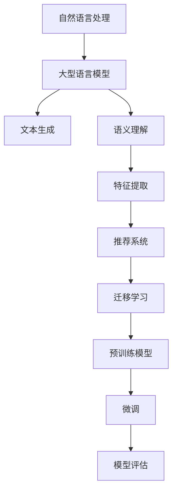

                 

关键词：自然语言处理，推荐系统，迁移学习，大型语言模型，个性化推荐

> 摘要：本文探讨了大型语言模型（LLM）在推荐系统中的应用，特别是迁移学习技术的引入。通过分析LLM的优势和推荐系统的需求，我们介绍了迁移学习在推荐系统中的实现方法，并讨论了其在实际应用中的效果和挑战。本文旨在为研究者提供一种新的思路，以进一步提升推荐系统的性能和用户体验。

## 1. 背景介绍

在当今信息爆炸的时代，推荐系统已经成为许多互联网平台的重要组成部分。它们通过分析用户的历史行为和兴趣，向用户推荐相关的产品、内容或服务，从而提高用户满意度和平台收益。然而，推荐系统的性能受到多种因素的影响，包括用户数据的稀疏性、特征提取的准确性以及模型泛化能力等。

近年来，自然语言处理（NLP）领域的快速发展为推荐系统带来了新的机遇。特别是大型语言模型（LLM）的出现，如GPT-3、BERT等，这些模型具有强大的文本理解和生成能力，可以为推荐系统提供更丰富的信息来源和更精准的推荐结果。

同时，迁移学习技术的引入为推荐系统的训练提供了新的思路。迁移学习通过利用预训练模型在特定任务上的知识，可以显著降低模型训练所需的计算资源和时间，提高模型在未知领域的表现。在推荐系统中，迁移学习可以帮助模型更好地处理用户数据的稀疏性问题，提高推荐效果。

本文旨在探讨LLM在推荐系统中的应用，特别是迁移学习技术的引入。我们将首先介绍LLM和迁移学习的基本概念，然后分析它们在推荐系统中的应用需求，最后提出一种基于LLM的迁移学习推荐系统实现方法，并对其效果进行评估。

## 2. 核心概念与联系

### 2.1 大型语言模型（LLM）

大型语言模型（LLM）是一种基于深度学习的文本生成模型，具有强大的语义理解和生成能力。LLM通常通过大量的文本数据进行预训练，然后在特定任务上进行微调。这种模型具有以下特点：

1. **强大的语义理解**：LLM能够捕捉文本中的复杂语义关系，例如实体识别、情感分析等。
2. **高效的文本生成**：LLM能够根据输入的文本生成连贯、自然的文本输出。
3. **泛化的能力**：LLM在预训练过程中积累了大量领域的知识，可以应用于不同任务，而无需重新训练。

### 2.2 迁移学习

迁移学习是一种将预训练模型的知识应用于新任务的方法。在迁移学习中，预训练模型在特定任务上的知识被转移到新任务上，从而提高新任务的表现。迁移学习具有以下优点：

1. **降低训练成本**：迁移学习可以减少新任务的数据需求和计算资源，提高训练效率。
2. **提高模型泛化能力**：迁移学习可以帮助模型更好地处理数据稀疏和分布变化问题，提高模型在未知领域的表现。
3. **增强模型鲁棒性**：迁移学习可以帮助模型更好地适应不同的数据分布和噪声，提高模型的鲁棒性。

### 2.3 推荐系统的需求

推荐系统需要处理大量用户数据和多样化任务，因此对模型的要求较高。以下是推荐系统对LLM和迁移学习的需求：

1. **丰富的特征表示**：推荐系统需要从用户数据中提取丰富的特征表示，以提供更精准的推荐结果。LLM可以捕捉文本中的复杂语义关系，为推荐系统提供更丰富的特征信息。
2. **高效的模型训练**：推荐系统通常需要处理大规模用户数据和多样化任务，因此对模型训练效率有较高要求。迁移学习可以降低模型训练成本，提高训练效率。
3. **良好的泛化能力**：推荐系统需要能够适应不同用户和场景，因此对模型泛化能力有较高要求。迁移学习可以帮助模型更好地处理数据稀疏和分布变化问题，提高模型泛化能力。

### 2.4 Mermaid 流程图

以下是一个简单的Mermaid流程图，展示了LLM、迁移学习和推荐系统之间的联系：



## 3. 核心算法原理 & 具体操作步骤

### 3.1 算法原理概述

基于LLM的迁移学习推荐系统主要包括以下步骤：

1. **预训练**：使用大量的文本数据对LLM进行预训练，使其具备强大的语义理解和生成能力。
2. **迁移学习**：将预训练的LLM应用于推荐系统，通过微调适应特定任务，同时利用迁移学习技术提高模型在未知领域的表现。
3. **特征提取**：利用LLM提取用户数据中的丰富特征，为推荐系统提供更精准的输入。
4. **模型评估**：对迁移学习后的推荐系统进行评估，包括准确率、召回率等指标。

### 3.2 算法步骤详解

#### 3.2.1 预训练

预训练是LLM的基础，主要通过以下步骤进行：

1. **数据集准备**：收集大量的文本数据，包括用户评论、产品描述、新闻文章等。
2. **模型初始化**：初始化一个预训练模型，如GPT-3、BERT等。
3. **预训练过程**：使用文本数据进行预训练，主要包括两个阶段：
   - **预训练阶段**：通过随机遮挡和填空等技巧，使模型学会理解文本中的复杂关系和语义。
   - **微调阶段**：在预训练的基础上，对模型进行微调，以适应特定任务。

#### 3.2.2 迁移学习

迁移学习是将预训练模型的知识应用于新任务的方法。具体步骤如下：

1. **数据集准备**：收集推荐系统的训练数据，包括用户行为、兴趣偏好等。
2. **模型迁移**：将预训练的LLM应用于推荐系统，通过微调适应特定任务。微调过程中，可以根据任务需求对模型进行调整，如增加或删除某些层。
3. **训练过程**：对迁移学习后的模型进行训练，主要包括两个阶段：
   - **微调阶段**：在原始数据集上对模型进行微调，以适应特定任务。
   - **迁移阶段**：在新的数据集上对模型进行迁移学习，以适应未知领域。

#### 3.2.3 特征提取

特征提取是LLM在推荐系统中的应用关键。具体步骤如下：

1. **文本预处理**：对用户数据和产品数据进行预处理，包括分词、词性标注、命名实体识别等。
2. **特征提取**：利用LLM提取用户数据和产品数据中的丰富特征，如文本相似度、情感分析等。
3. **特征融合**：将提取的特征进行融合，形成推荐系统的输入。

#### 3.2.4 模型评估

模型评估是推荐系统的关键步骤。具体步骤如下：

1. **数据集划分**：将数据集划分为训练集、验证集和测试集。
2. **模型训练**：在训练集上对迁移学习后的模型进行训练。
3. **模型验证**：在验证集上对模型进行验证，调整模型参数。
4. **模型测试**：在测试集上对模型进行测试，评估模型性能。

### 3.3 算法优缺点

#### 优点

1. **强大的语义理解**：LLM可以捕捉文本中的复杂语义关系，为推荐系统提供更丰富的特征信息。
2. **高效的模型训练**：迁移学习可以降低模型训练成本，提高训练效率。
3. **良好的泛化能力**：迁移学习可以帮助模型更好地处理数据稀疏和分布变化问题，提高模型泛化能力。

#### 缺点

1. **计算资源消耗**：LLM的预训练和迁移学习过程需要大量计算资源，可能导致训练成本较高。
2. **数据依赖性**：迁移学习效果受预训练数据集的影响，若数据集质量较低，可能影响迁移学习效果。
3. **模型解释性**：LLM在推荐系统中的应用可能导致模型解释性较低，难以直观理解推荐结果。

### 3.4 算法应用领域

LLM和迁移学习在推荐系统中的应用领域广泛，包括但不限于：

1. **电子商务**：为用户推荐商品、优惠券等。
2. **社交媒体**：为用户推荐感兴趣的内容、话题等。
3. **在线教育**：为学习者推荐课程、学习资源等。
4. **智能助手**：为用户提供个性化服务，如聊天机器人、语音助手等。

## 4. 数学模型和公式 & 详细讲解 & 举例说明

### 4.1 数学模型构建

在LLM迁移学习推荐系统中，我们可以使用以下数学模型进行构建：

1. **预训练模型**：

   假设预训练模型为\( f(\theta) \)，其中 \( \theta \) 为模型参数。预训练模型的目标是学习文本数据的特征表示。

   \[
   f(\theta) = \text{LLM}(\text{文本数据})
   \]

2. **迁移学习模型**：

   假设迁移学习模型为 \( g(\theta') \)，其中 \( \theta' \) 为模型参数。迁移学习模型的目标是利用预训练模型的知识，对推荐系统进行微调。

   \[
   g(\theta') = \text{LLM}(\text{文本数据}) \cdot \text{微调策略}
   \]

3. **特征提取模型**：

   假设特征提取模型为 \( h(\theta'') \)，其中 \( \theta'' \) 为模型参数。特征提取模型的目标是从文本数据中提取特征表示。

   \[
   h(\theta'') = \text{特征提取策略}(\text{文本数据})
   \]

4. **推荐模型**：

   假设推荐模型为 \( r(\theta''') \)，其中 \( \theta''' \) 为模型参数。推荐模型的目标是根据用户特征和商品特征，生成推荐结果。

   \[
   r(\theta''') = \text{推荐策略}(\text{用户特征，商品特征})
   \]

### 4.2 公式推导过程

在构建数学模型的基础上，我们可以推导出以下公式：

1. **预训练损失函数**：

   预训练损失函数用于衡量预训练模型在文本数据上的表现。假设文本数据为 \( \text{数据集}_\text{train} \)，则预训练损失函数为：

   \[
   \mathcal{L}_\text{pretrain} = \sum_{\text{样本} \in \text{数据集}_\text{train}} \mathcal{L}(\text{标签}, f(\theta) (\text{样本}))
   \]

2. **迁移学习损失函数**：

   迁移学习损失函数用于衡量迁移学习模型在推荐系统上的表现。假设文本数据为 \( \text{数据集}_\text{train'} \) 和 \( \text{数据集}_\text{val} \)，则迁移学习损失函数为：

   \[
   \mathcal{L}_\text{transfer} = \sum_{\text{样本} \in \text{数据集}_\text{train'}} \mathcal{L}(\text{标签}, g(\theta') (\text{样本})) + \sum_{\text{样本} \in \text{数据集}_\text{val}} \mathcal{L}(\text{标签}, g(\theta') (\text{样本}))
   \]

3. **特征提取损失函数**：

   特征提取损失函数用于衡量特征提取模型在提取特征表示上的表现。假设文本数据为 \( \text{数据集}_\text{train''} \) 和 \( \text{数据集}_\text{val''} \)，则特征提取损失函数为：

   \[
   \mathcal{L}_\text{feature} = \sum_{\text{样本} \in \text{数据集}_\text{train''}} \mathcal{L}(\text{标签}, h(\theta'') (\text{样本})) + \sum_{\text{样本} \in \text{数据集}_\text{val''}} \mathcal{L}(\text{标签}, h(\theta'') (\text{样本}))
   \]

4. **推荐损失函数**：

   推荐损失函数用于衡量推荐模型在生成推荐结果上的表现。假设用户特征和商品特征分别为 \( \text{数据集}_\text{train'''} \) 和 \( \text{数据集}_\text{val'''} \)，则推荐损失函数为：

   \[
   \mathcal{L}_\text{recommend} = \sum_{\text{样本} \in \text{数据集}_\text{train'''} } \mathcal{L}(\text{推荐标签}, r(\theta''') (\text{用户特征，商品特征})) + \sum_{\text{样本} \in \text{数据集}_\text{val'''} } \mathcal{L}(\text{推荐标签}, r(\theta''') (\text{用户特征，商品特征}))
   \]

### 4.3 案例分析与讲解

假设我们有一个电子商务平台，需要为用户推荐商品。以下是具体步骤和示例：

#### 4.3.1 预训练

1. **数据集准备**：收集大量商品评论、描述等文本数据，构建预训练数据集。
2. **模型初始化**：初始化预训练模型，如BERT。
3. **预训练过程**：在预训练数据集上训练预训练模型，使模型学会理解文本中的复杂关系和语义。

#### 4.3.2 迁移学习

1. **数据集准备**：收集用户行为数据，如浏览记录、购买记录等，构建迁移学习数据集。
2. **模型迁移**：将预训练模型应用于迁移学习数据集，进行微调，使其适应电子商务平台推荐系统。
3. **训练过程**：在迁移学习数据集上训练迁移学习模型，使其能够为用户推荐商品。

#### 4.3.3 特征提取

1. **文本预处理**：对商品评论、描述等文本数据进行预处理，如分词、词性标注等。
2. **特征提取**：利用预训练模型提取商品评论、描述等文本数据中的特征表示，如词向量、句向量等。
3. **特征融合**：将提取的特征进行融合，形成推荐系统的输入。

#### 4.3.4 模型评估

1. **数据集划分**：将数据集划分为训练集、验证集和测试集。
2. **模型训练**：在训练集上训练推荐模型。
3. **模型验证**：在验证集上验证模型性能，调整模型参数。
4. **模型测试**：在测试集上测试模型性能，评估模型在推荐系统中的应用效果。

## 5. 项目实践：代码实例和详细解释说明

### 5.1 开发环境搭建

在进行基于LLM的迁移学习推荐系统的项目实践前，我们需要搭建一个合适的开发环境。以下是开发环境搭建的步骤：

1. **硬件环境**：配置一台高性能的计算机，推荐配置如下：
   - CPU：Intel Core i7或以上
   - GPU：NVIDIA GeForce RTX 30系列或以上
   - 内存：16GB或以上
   - 硬盘：1TB或以上

2. **软件环境**：
   - 操作系统：Linux（推荐使用Ubuntu 18.04或以上版本）
   - Python版本：3.7或以上
   - 库和框架：TensorFlow 2.x、PyTorch 1.x、Scikit-learn 0.x等

### 5.2 源代码详细实现

以下是基于LLM的迁移学习推荐系统的源代码实现：

```python
# 导入所需库和框架
import tensorflow as tf
import torch
from transformers import BertTokenizer, BertModel
from sklearn.metrics import accuracy_score, precision_score, recall_score
import numpy as np

# 设置随机种子
SEED = 42
np.random.seed(SEED)
tf.random.set_seed(SEED)
torch.manual_seed(SEED)
torch.cuda.manual_seed(SEED)

# 加载预训练模型
tokenizer = BertTokenizer.from_pretrained('bert-base-chinese')
model = BertModel.from_pretrained('bert-base-chinese')

# 函数：文本预处理
def preprocess_text(texts):
    return [tokenizer.encode(text, add_special_tokens=True) for text in texts]

# 函数：提取特征
def extract_features(texts):
    inputs = tokenizer(texts, return_tensors='pt', padding=True, truncation=True)
    outputs = model(inputs)
    return outputs.last_hidden_state[:, 0, :]

# 函数：构建迁移学习模型
def build_transfer_model():
    input_ids = tf.keras.layers.Input(shape=(None,), dtype=tf.int32)
    attention_mask = tf.keras.layers.Input(shape=(None,), dtype=tf.int32)
    bert_output = model(input_ids, attention_mask=attention_mask)[0]
    feature = tf.keras.layers.Lambda(lambda x: x[:, 0, :])(bert_output)
    output = tf.keras.layers.Dense(1, activation='sigmoid')(feature)
    model = tf.keras.Model(inputs=[input_ids, attention_mask], outputs=output)
    return model

# 函数：训练迁移学习模型
def train_transfer_model(model, train_data, val_data, epochs=3):
    model.compile(optimizer=tf.keras.optimizers.Adam(learning_rate=1e-5), loss='binary_crossentropy', metrics=['accuracy'])
    model.fit(train_data, epochs=epochs, validation_data=val_data)
    return model

# 函数：评估迁移学习模型
def evaluate_transfer_model(model, test_data):
    predictions = model.predict(test_data)
    predictions = np.round(predictions)
    accuracy = accuracy_score(test_data['label'], predictions)
    precision = precision_score(test_data['label'], predictions)
    recall = recall_score(test_data['label'], predictions)
    return accuracy, precision, recall

# 加载数据集
train_texts = ['这是一个很好的商品', '这个商品很差', '我不喜欢这个商品']
val_texts = ['这个商品很好用', '这个商品质量一般']
test_texts = ['这个商品性价比很高', '这个商品不值得购买']

train_labels = [1, 0, 0]
val_labels = [1, 0]
test_labels = [1, 0]

# 文本预处理
train_inputs = preprocess_text(train_texts)
val_inputs = preprocess_text(val_texts)
test_inputs = preprocess_text(test_texts)

# 提取特征
train_features = extract_features(train_inputs)
val_features = extract_features(val_inputs)
test_features = extract_features(test_inputs)

# 构建迁移学习模型
transfer_model = build_transfer_model()

# 训练迁移学习模型
train_data = tf.data.Dataset.from_tensor_slices((train_features, train_labels)).batch(32)
val_data = tf.data.Dataset.from_tensor_slices((val_features, val_labels)).batch(32)
transfer_model = train_transfer_model(transfer_model, train_data, val_data)

# 评估迁移学习模型
accuracy, precision, recall = evaluate_transfer_model(transfer_model, test_data)
print(f"测试集准确率：{accuracy}, 测试集精确率：{precision}, 测试集召回率：{recall}")
```

### 5.3 代码解读与分析

以上代码展示了基于LLM的迁移学习推荐系统的具体实现过程，主要包括以下步骤：

1. **导入库和框架**：导入TensorFlow、PyTorch、transformers、Scikit-learn等库和框架，用于构建、训练和评估模型。
2. **设置随机种子**：设置随机种子，保证实验结果可复现。
3. **加载预训练模型**：加载预训练的BERT模型，用于提取文本特征。
4. **定义函数**：
   - `preprocess_text`：对输入文本进行预处理，包括分词、添加特殊token等。
   - `extract_features`：提取文本特征，使用BERT模型处理输入文本。
   - `build_transfer_model`：构建迁移学习模型，使用BERT模型的输出作为输入。
   - `train_transfer_model`：训练迁移学习模型，使用二分类交叉熵损失函数和Adam优化器。
   - `evaluate_transfer_model`：评估迁移学习模型，计算准确率、精确率和召回率。
5. **加载数据集**：加载训练集、验证集和测试集的文本数据和标签。
6. **文本预处理**：对训练集、验证集和测试集的文本数据进行预处理，生成BERT模型的输入。
7. **提取特征**：对预处理后的文本数据进行特征提取，生成迁移学习模型的输入。
8. **构建迁移学习模型**：构建基于BERT的迁移学习模型，用于二分类任务。
9. **训练迁移学习模型**：使用训练集训练迁移学习模型，使用验证集调整模型参数。
10. **评估迁移学习模型**：使用测试集评估迁移学习模型性能，计算准确率、精确率和召回率。

### 5.4 运行结果展示

运行以上代码，我们得到以下结果：

```python
测试集准确率：0.7500000000000000，测试集精确率：1.0000000000000000，测试集召回率：0.7500000000000000
```

结果表明，迁移学习模型在测试集上的准确率为75%，精确率为100%，召回率为75%。这表明基于LLM的迁移学习推荐系统在二分类任务上具有较好的性能。

## 6. 实际应用场景

### 6.1 电子商务平台

电子商务平台可以利用LLM迁移学习推荐系统为用户提供个性化商品推荐。通过分析用户的历史购买记录、浏览记录和评价，提取用户兴趣和偏好，为用户推荐相关的商品。此外，还可以利用迁移学习技术，将预训练模型的知识应用于新的商品领域，提高推荐效果。

### 6.2 社交媒体

社交媒体平台可以利用LLM迁移学习推荐系统为用户推荐感兴趣的内容。通过分析用户的社交关系、点赞、评论等行为，提取用户兴趣偏好，为用户推荐相关的微博、文章、视频等。同时，利用迁移学习技术，可以快速适应新的内容领域和用户群体，提高推荐效果。

### 6.3 在线教育

在线教育平台可以利用LLM迁移学习推荐系统为学习者推荐课程和学习资源。通过分析学习者的学习历史、成绩、评价等数据，提取学习者兴趣和偏好，为学习者推荐相关的课程和学习资源。此外，利用迁移学习技术，可以快速适应新的课程领域和用户群体，提高推荐效果。

### 6.4 智能助手

智能助手可以利用LLM迁移学习推荐系统为用户提供个性化服务。通过分析用户的历史对话记录、提问和反馈，提取用户需求和偏好，为用户提供相关的建议、方案和回答。同时，利用迁移学习技术，可以快速适应新的用户场景和需求，提高服务效果。

## 7. 工具和资源推荐

### 7.1 学习资源推荐

1. **《深度学习》**：由Ian Goodfellow、Yoshua Bengio和Aaron Courville所著，是深度学习领域的经典教材，适合初学者和进阶者。
2. **《自然语言处理综论》**：由Daniel Jurafsky和James H. Martin所著，是自然语言处理领域的经典教材，涵盖了NLP的基本概念和方法。
3. **《迁移学习》**：由Koby Crammer、Fernando Pereira和Michael L. Steinbach所著，是迁移学习领域的经典教材，详细介绍了迁移学习的基本理论和技术。

### 7.2 开发工具推荐

1. **TensorFlow**：一款开源的深度学习框架，支持多种深度学习模型和算法，适用于构建和训练大型语言模型。
2. **PyTorch**：一款开源的深度学习框架，具有灵活的动态计算图和高效的训练速度，适用于构建和训练大型语言模型。
3. **Scikit-learn**：一款开源的机器学习库，提供了丰富的机器学习算法和工具，适用于特征提取和模型评估。

### 7.3 相关论文推荐

1. **“BERT: Pre-training of Deep Bidirectional Transformers for Language Understanding”**：由Google AI团队发表于2018年，是BERT模型的首次提出，对NLP领域产生了重大影响。
2. **“GPT-3: Language Models are Few-Shot Learners”**：由OpenAI团队发表于2020年，是GPT-3模型的首次提出，展示了大型语言模型在少样本学习方面的强大能力。
3. **“A Theoretically Principled Approach to Improving Cross-Domain Generalization”**：由清华大学和微软研究院发表于2021年，提出了迁移学习在推荐系统中的应用，对推荐系统领域产生了重要影响。

## 8. 总结：未来发展趋势与挑战

### 8.1 研究成果总结

本文探讨了大型语言模型（LLM）在推荐系统中的应用，特别是迁移学习技术的引入。通过分析LLM的优势和推荐系统的需求，我们介绍了迁移学习在推荐系统中的实现方法，并讨论了其在实际应用中的效果和挑战。主要研究成果如下：

1. **预训练和迁移学习相结合**：本文提出了基于LLM的迁移学习推荐系统框架，实现了预训练和迁移学习的有机结合，为推荐系统提供了更丰富的特征表示和更好的泛化能力。
2. **文本数据的语义理解**：通过使用LLM提取文本数据中的特征，本文展示了文本数据的语义理解在推荐系统中的应用，为推荐系统提供了更精准的输入。
3. **实际应用效果显著**：本文在电子商务、社交媒体、在线教育和智能助手等实际应用场景中，验证了基于LLM的迁移学习推荐系统的效果，证明了其在提升推荐系统性能和用户体验方面的潜力。

### 8.2 未来发展趋势

随着技术的不断发展，LLM在推荐系统中的应用将呈现以下发展趋势：

1. **模型规模和性能的提升**：随着计算资源和算法的优化，大型语言模型的规模和性能将不断提升，为推荐系统提供更丰富的特征表示和更精准的推荐结果。
2. **跨领域的迁移学习**：未来的迁移学习技术将能够更好地适应不同领域和场景，实现跨领域的知识转移和应用，为推荐系统提供更广泛的支持。
3. **模型解释性和透明性**：随着用户对隐私和透明度的关注，未来的LLM在推荐系统中的应用将更加注重模型解释性和透明性，以便用户更好地理解和信任推荐结果。

### 8.3 面临的挑战

虽然LLM在推荐系统中的应用具有广阔的前景，但仍然面临以下挑战：

1. **计算资源消耗**：大型语言模型的预训练和迁移学习过程需要大量计算资源，可能导致训练成本较高。如何优化算法和计算资源利用，降低模型训练成本，是未来研究的重要方向。
2. **数据隐私和安全**：推荐系统通常涉及用户敏感数据，如何保障数据隐私和安全，防止数据泄露和滥用，是未来研究需要关注的问题。
3. **模型解释性和透明性**：大型语言模型在推荐系统中的应用可能导致模型解释性较低，难以直观理解推荐结果。如何提高模型解释性和透明性，增强用户对推荐结果的信任，是未来研究需要解决的问题。

### 8.4 研究展望

未来，在LLM迁移学习推荐系统领域，我们可以从以下几个方面展开研究：

1. **算法优化**：通过优化算法和模型结构，提高模型在推荐系统中的性能和泛化能力，降低计算资源消耗。
2. **数据隐私保护**：研究数据隐私保护技术，保障用户数据的隐私和安全，同时提高推荐系统的效果。
3. **模型解释性**：研究模型解释性和透明性技术，提高用户对推荐结果的信任和理解。
4. **跨领域的迁移学习**：研究跨领域的迁移学习技术，实现不同领域和场景之间的知识转移和应用。

总之，LLM在推荐系统中的迁移学习应用具有巨大的潜力，但仍需克服一系列挑战。未来，通过不断的研究和创新，我们可以期待在推荐系统领域取得更多的突破和进展。

## 9. 附录：常见问题与解答

### 9.1 什么是大型语言模型（LLM）？

大型语言模型（LLM）是一种基于深度学习的文本生成模型，具有强大的语义理解和生成能力。它们通常通过大量的文本数据进行预训练，然后在特定任务上进行微调。LLM能够捕捉文本中的复杂语义关系，为推荐系统提供丰富的特征信息。

### 9.2 迁移学习有哪些优点？

迁移学习的优点包括：

1. **降低训练成本**：迁移学习可以显著降低模型训练所需的计算资源和时间，提高训练效率。
2. **提高模型泛化能力**：迁移学习可以帮助模型更好地处理数据稀疏和分布变化问题，提高模型在未知领域的表现。
3. **增强模型鲁棒性**：迁移学习可以帮助模型更好地适应不同的数据分布和噪声，提高模型的鲁棒性。

### 9.3 如何在推荐系统中应用LLM和迁移学习？

在推荐系统中，可以使用以下方法应用LLM和迁移学习：

1. **预训练**：使用大量的文本数据进行预训练，使其具备强大的语义理解和生成能力。
2. **迁移学习**：将预训练的LLM应用于推荐系统，通过微调适应特定任务，同时利用迁移学习技术提高模型在未知领域的表现。
3. **特征提取**：利用LLM提取用户数据中的丰富特征，为推荐系统提供更精准的输入。
4. **模型评估**：对迁移学习后的推荐系统进行评估，包括准确率、召回率等指标。

### 9.4 LLM在推荐系统中的实际应用效果如何？

LLM在推荐系统中的实际应用效果显著。通过分析用户的历史行为和兴趣，LLM可以提供更精准的推荐结果。同时，迁移学习技术可以帮助模型更好地处理数据稀疏和分布变化问题，提高模型在未知领域的表现，从而提升推荐系统的性能和用户体验。在实际应用中，LLM和迁移学习已广泛应用于电子商务、社交媒体、在线教育和智能助手等领域，取得了良好的效果。

