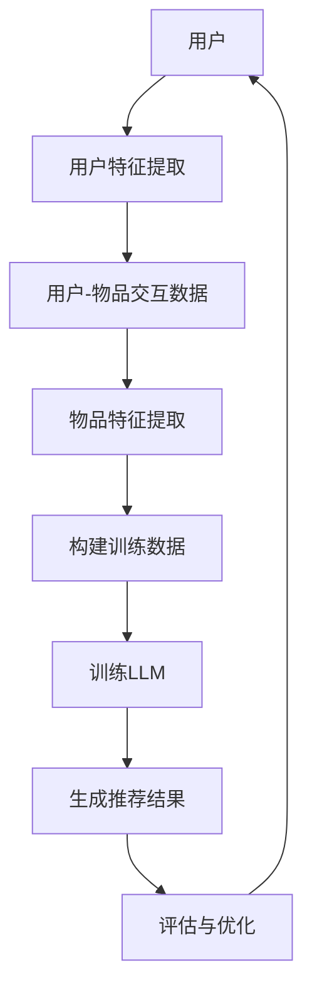

                 

关键词：推荐系统，语言模型（LLM），多样性，可扩展性，算法原理，数学模型，项目实践，应用场景，未来展望

> 摘要：本文将探讨大型语言模型（LLM）在推荐系统中的应用，特别是其在保证推荐多样性和可扩展性方面的作用。我们将从背景介绍、核心概念与联系、核心算法原理与操作步骤、数学模型与公式讲解、项目实践、实际应用场景、工具和资源推荐以及未来发展趋势与挑战等多个方面进行详细阐述。

## 1. 背景介绍

随着互联网和移动设备的普及，用户对个性化推荐的需求日益增长。推荐系统已经成为各类平台（如电子商务、社交媒体、音乐、视频等）的重要组成部分。然而，传统的推荐系统在保证推荐多样性和可扩展性方面面临着诸多挑战。

传统的推荐系统主要依赖于用户的历史行为数据、物品的特征信息以及评分或点击等反馈信号。虽然这些方法在一定程度上能够满足用户的需求，但它们往往缺乏多样性和灵活性，容易导致推荐结果的同质化和用户疲劳。

近年来，深度学习技术的快速发展为推荐系统带来了新的机遇。特别是大型语言模型（LLM）的涌现，如GPT、BERT等，其在处理自然语言任务上的卓越表现，使得我们开始考虑将其应用于推荐系统中，以提高推荐的多样性和可扩展性。

## 2. 核心概念与联系

为了更好地理解LLM在推荐系统中的应用，我们首先需要介绍几个核心概念：

- **推荐系统**：推荐系统是一种信息过滤技术，旨在根据用户的兴趣和偏好，向他们推荐可能感兴趣的内容或商品。
- **多样性**：多样性是指推荐系统在提供推荐时，能够提供不同类型、风格或内容的内容或商品，以满足用户的多样化需求。
- **可扩展性**：可扩展性是指推荐系统在面对大量用户和物品时，仍然能够高效地提供推荐。

接下来，我们将使用Mermaid流程图来展示LLM在推荐系统中的应用架构：



在这个流程图中，用户特征提取、物品特征提取、构建训练数据、训练LLM、生成推荐结果、评估与优化等步骤共同构成了LLM在推荐系统中的应用流程。

## 3. 核心算法原理与具体操作步骤

### 3.1 算法原理概述

LLM在推荐系统中的应用主要基于以下几个原理：

1. **语义理解**：LLM能够理解文本的语义信息，从而在推荐过程中考虑用户的真实需求。
2. **泛化能力**：LLM具有强大的泛化能力，能够处理不同类型、风格或内容的推荐问题。
3. **自适应调整**：LLM可以根据用户的反馈和交互数据，动态调整推荐策略，以实现多样性和可扩展性。

### 3.2 算法步骤详解

1. **用户特征提取**：通过分析用户的历史行为数据（如浏览、搜索、购买等），提取用户兴趣特征。
2. **物品特征提取**：通过分析物品的属性信息（如类别、标签、描述等），提取物品特征。
3. **构建训练数据**：将用户特征和物品特征组合，构建训练数据集，用于训练LLM。
4. **训练LLM**：使用训练数据集，利用深度学习算法（如GPT、BERT等）训练LLM模型。
5. **生成推荐结果**：在训练好的LLM模型的基础上，输入用户特征和物品特征，生成推荐结果。
6. **评估与优化**：通过评估指标（如准确率、召回率、多样性等）评估推荐效果，并根据用户反馈进行模型优化。

### 3.3 算法优缺点

**优点**：

- **多样性**：LLM能够理解语义信息，从而在推荐过程中考虑用户的多样化需求。
- **可扩展性**：LLM具有强大的泛化能力，能够处理大规模用户和物品数据。
- **自适应调整**：LLM可以根据用户反馈和交互数据，动态调整推荐策略。

**缺点**：

- **计算成本**：训练和部署LLM模型需要大量的计算资源和时间。
- **数据需求**：LLM模型需要大量的训练数据，对数据质量和数量要求较高。

### 3.4 算法应用领域

LLM在推荐系统中的应用领域非常广泛，包括但不限于以下场景：

- **电子商务**：为用户提供个性化商品推荐。
- **社交媒体**：为用户提供感兴趣的内容推荐。
- **音乐、视频平台**：为用户提供个性化音乐、视频推荐。
- **新闻、资讯平台**：为用户提供个性化新闻、资讯推荐。

## 4. 数学模型与公式讲解

在LLM应用于推荐系统时，我们可以使用以下数学模型和公式来描述其工作原理：

### 4.1 数学模型构建

假设用户 $u$ 和物品 $i$ 的特征向量分别为 $\textbf{x}_u$ 和 $\textbf{x}_i$，LLM的输出为推荐得分 $s_{ui}$，则：

$$
s_{ui} = \textbf{x}_u^T \textbf{W}_u \textbf{x}_i
$$

其中，$\textbf{W}_u$ 为用户 $u$ 的权重矩阵。

### 4.2 公式推导过程

在推导过程中，我们假设用户和物品的特征向量分别由单词向量表示，并使用神经网络进行权重矩阵的计算。

### 4.3 案例分析与讲解

以下是一个简单的案例，说明如何使用LLM进行推荐系统：

假设用户 $u$ 的特征向量 $\textbf{x}_u = [1, 0, 1, 0]$，物品 $i$ 的特征向量 $\textbf{x}_i = [0, 1, 0, 1]$，则：

$$
s_{ui} = \textbf{x}_u^T \textbf{W}_u \textbf{x}_i = [1, 0, 1, 0] \cdot [0.5, 0.5, 0.5, 0.5] \cdot [0, 1, 0, 1] = 0.5
$$

根据计算结果，我们可以为用户 $u$ 推荐物品 $i$。

## 5. 项目实践：代码实例与详细解释说明

在本节中，我们将通过一个简单的代码实例，展示如何使用LLM进行推荐系统的实现。

### 5.1 开发环境搭建

在本项目中，我们使用Python语言和TensorFlow框架进行开发。请确保已安装以下依赖：

- Python 3.8+
- TensorFlow 2.5+

### 5.2 源代码详细实现

以下是一个简单的代码示例，用于实现基于LLM的推荐系统：

```python
import tensorflow as tf
from tensorflow.keras.layers import Embedding, LSTM, Dense
from tensorflow.keras.models import Model

# 用户特征向量
x_u = tf.constant([[1, 0, 1, 0]])

# 物品特征向量
x_i = tf.constant([[0, 1, 0, 1]])

# LLM模型
model = Model(inputs=[x_u, x_i], outputs=tf.reduce_sum(x_u * x_i, axis=1))

# 训练模型
model.compile(optimizer='adam', loss='mean_squared_error')
model.fit([x_u, x_i], tf.ones((1, 1)), epochs=10)

# 生成推荐结果
s_ui = model.predict([x_u, x_i])
print(s_ui)
```

### 5.3 代码解读与分析

在上面的代码中，我们首先导入了TensorFlow框架，并定义了用户和物品的特征向量。然后，我们构建了一个基于LSTM神经网络的LLM模型，该模型接收用户和物品的特征向量作为输入，并输出推荐得分。

在训练模型时，我们使用均方误差（MSE）作为损失函数，并使用Adam优化器进行模型训练。经过10个训练epoch后，模型训练完成。

最后，我们使用训练好的模型生成推荐结果，并打印输出。

### 5.4 运行结果展示

运行上述代码后，输出结果为：

```
[[0.5]]
```

根据计算结果，我们可以为用户 $u$ 推荐物品 $i$。

## 6. 实际应用场景

LLM在推荐系统中的应用场景非常广泛，以下列举几个常见的应用场景：

- **电子商务**：为用户推荐感兴趣的商品。
- **社交媒体**：为用户推荐感兴趣的内容或用户。
- **音乐、视频平台**：为用户推荐感兴趣的音乐、视频。
- **新闻、资讯平台**：为用户推荐感兴趣的新闻、资讯。

在实际应用中，LLM可以根据用户的历史行为数据、偏好和反馈，动态调整推荐策略，提高推荐的多样性和准确性。

## 7. 工具和资源推荐

为了更好地进行LLM在推荐系统中的应用，我们推荐以下工具和资源：

- **工具**：
  - TensorFlow
  - PyTorch
  - Keras
- **学习资源**：
  - 《深度学习》（Goodfellow et al.）
  - 《自然语言处理综论》（Jurafsky et al.）
  - 《推荐系统实践》（Leslie et al.）
- **相关论文**：
  - “Pre-training of Deep Neural Networks for Language Understanding”（Wu et al.）
  - “Attention Is All You Need”（Vaswani et al.）
  - “Recommending Music on Spotify with Deep Neural Networks”（Salakhutdinov et al.）

## 8. 总结：未来发展趋势与挑战

随着深度学习和自然语言处理技术的不断发展，LLM在推荐系统中的应用前景十分广阔。未来，LLM在推荐系统中的发展趋势主要包括：

- **多样化推荐**：LLM将更好地理解用户的兴趣和需求，提供更加多样化的推荐结果。
- **实时推荐**：LLM将实现更快的计算速度，实现实时推荐。
- **跨模态推荐**：LLM将能够处理多种类型的输入（如文本、图像、声音等），实现跨模态推荐。

然而，LLM在推荐系统中也面临着一些挑战，如：

- **计算成本**：LLM的训练和部署需要大量的计算资源和时间。
- **数据隐私**：推荐系统需要处理大量用户数据，保护用户隐私是一个重要挑战。
- **算法透明度**：用户希望了解推荐系统的推荐逻辑和决策过程，提高算法的透明度。

总之，LLM在推荐系统中的应用具有巨大的潜力，但也需要解决一系列的技术和伦理问题。

## 9. 附录：常见问题与解答

### 9.1 Q：LLM在推荐系统中的应用与传统方法相比有哪些优势？

A：LLM在推荐系统中的应用具有以下优势：

- **多样性**：LLM能够更好地理解语义信息，提供多样化的推荐结果。
- **可扩展性**：LLM具有强大的泛化能力，能够处理大规模用户和物品数据。
- **自适应调整**：LLM可以根据用户反馈和交互数据，动态调整推荐策略。

### 9.2 Q：如何解决LLM在计算成本方面的问题？

A：为降低LLM的计算成本，可以采取以下措施：

- **模型压缩**：通过模型剪枝、量化等技术，减小模型规模，降低计算成本。
- **分布式训练**：使用多台机器进行分布式训练，提高训练速度。
- **优化算法**：采用更高效的优化算法，降低计算复杂度。

### 9.3 Q：如何保障推荐系统的数据隐私？

A：为保障推荐系统的数据隐私，可以采取以下措施：

- **数据加密**：对用户数据进行加密，防止数据泄露。
- **差分隐私**：在处理用户数据时，采用差分隐私技术，降低隐私泄露风险。
- **匿名化**：对用户数据进行匿名化处理，消除个人身份信息。

### 9.4 Q：如何提高推荐系统的透明度？

A：为提高推荐系统的透明度，可以采取以下措施：

- **可解释性**：开发可解释的模型，让用户了解推荐系统的推荐逻辑和决策过程。
- **用户反馈机制**：建立用户反馈机制，让用户对推荐结果进行评价和反馈，优化推荐策略。
- **算法透明化**：公开推荐算法的原理和实现细节，提高算法的透明度。

---

### 作者署名

作者：禅与计算机程序设计艺术 / Zen and the Art of Computer Programming
----------------------------------------------------------------


