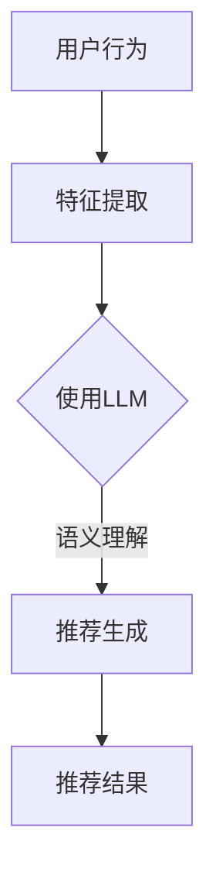

                 

关键词：大规模语言模型（LLM），推荐系统，多样性，可扩展性，算法原理，应用领域，数学模型，代码实例，实际应用，未来展望

> 摘要：随着大规模语言模型（LLM）在自然语言处理领域的迅猛发展，其在推荐系统中的应用逐渐成为研究热点。本文将深入探讨LLM在推荐系统中的多样化应用，以及如何实现可扩展性。通过对核心概念、算法原理、数学模型、代码实例等方面的详细解析，本文旨在为读者提供全面的理解和指导，为未来研究提供参考。

## 1. 背景介绍

### 大规模语言模型（LLM）的兴起

大规模语言模型（LLM，Large-scale Language Model）是近年来自然语言处理领域的重要突破。以GPT系列、BERT、T5等为代表的LLM模型，通过在海量文本数据上的预训练，能够实现高水平的多语言文本理解和生成能力。这些模型的出现，为推荐系统的设计带来了新的思路和可能性。

### 推荐系统的重要性

推荐系统在当今信息爆炸的时代扮演着至关重要的角色。通过分析用户行为和兴趣，推荐系统可以帮助用户发现他们可能感兴趣的内容，从而提高用户体验，增加用户粘性和满意度。传统的推荐系统主要依赖于基于内容过滤和协同过滤的方法，但随着用户需求的多样化和数据量的增加，这些方法逐渐暴露出一些局限。

### LLM在推荐系统中的应用前景

LLM在推荐系统中的应用，为解决传统方法的局限性提供了新的途径。LLM能够处理复杂的语义信息，可以更好地理解用户的真实需求和兴趣，从而提高推荐系统的准确性和多样性。同时，LLM的可扩展性使得推荐系统可以应对海量用户和内容的挑战，实现高效的推荐服务。

## 2. 核心概念与联系

### 推荐系统的基本概念

#### 内容过滤

内容过滤（Content-based Filtering）是一种基于物品的推荐方法，通过分析物品的特征，将用户可能感兴趣的内容推荐给用户。

#### 协同过滤

协同过滤（Collaborative Filtering）是一种基于用户的推荐方法，通过分析用户之间的相似性，将其他用户喜欢的物品推荐给目标用户。

### 大规模语言模型（LLM）的基本原理

#### 预训练

预训练（Pre-training）是LLM的核心步骤，通过在大量文本数据上进行无监督学习，模型可以学习到丰富的语言知识。

#### 微调

微调（Fine-tuning）是将预训练模型应用于特定任务的过程，通过在任务相关数据上进行有监督学习，模型可以进一步提高性能。

### 推荐系统与LLM的结合

LLM在推荐系统中的应用，主要是利用其强大的语义理解能力，对用户行为和物品特征进行深入分析，从而实现更精准和多样化的推荐。

### Mermaid 流程图



## 3. 核心算法原理 & 具体操作步骤

### 3.1 算法原理概述

LLM在推荐系统中的应用，主要基于其预训练和微调的能力。预训练阶段，LLM通过学习海量文本数据，掌握丰富的语言知识。微调阶段，LLM利用用户行为和物品特征数据，对预训练模型进行微调，以适应特定推荐任务。

### 3.2 算法步骤详解

#### 步骤1：特征提取

- 用户行为特征：包括用户的历史浏览记录、点击记录、收藏记录等。
- 物品特征：包括物品的文本描述、标签、分类信息等。

#### 步骤2：预训练

- 数据预处理：对用户行为特征和物品特征进行预处理，如分词、去停用词等。
- 模型训练：使用预训练任务（如BERT、GPT等）对预处理后的数据集进行训练，学习到丰富的语言知识。

#### 步骤3：微调

- 任务定义：定义推荐任务的目标函数，如最大化用户满意度、最小化推荐误差等。
- 模型微调：在推荐任务上对预训练模型进行微调，以适应特定推荐场景。

#### 步骤4：推荐生成

- 语义理解：利用微调后的LLM，对用户行为和物品特征进行语义分析，提取关键信息。
- 推荐生成：根据用户兴趣和物品特征，生成推荐结果。

### 3.3 算法优缺点

#### 优点

- 强大的语义理解能力，能够更好地捕捉用户需求和兴趣。
- 可扩展性高，能够处理海量用户和内容。
- 支持多语言和多模态推荐。

#### 缺点

- 需要大量高质量的训练数据，数据获取和处理成本高。
- 模型训练和微调过程计算资源消耗大。

### 3.4 算法应用领域

- 电子商务推荐：基于用户购买历史、浏览记录等，推荐商品。
- 社交媒体推荐：基于用户互动行为、内容标签等，推荐帖子、视频等。
- 新闻推荐：基于用户阅读历史、兴趣标签等，推荐新闻文章。

## 4. 数学模型和公式 & 详细讲解 & 举例说明

### 4.1 数学模型构建

在推荐系统中，LLM的应用主要涉及以下数学模型：

- 用户表示：将用户行为特征和物品特征映射到低维空间。
- 物品表示：将物品的文本描述、标签等映射到低维空间。
- 推荐生成：利用用户和物品的表示，计算用户对物品的偏好度。

### 4.2 公式推导过程

#### 用户表示

设用户行为特征为 \( X \)，物品特征为 \( Y \)，预训练模型输出为 \( Z \)。

$$
X = \text{Embedding}(X) \odot \text{Activation}(\text{LayerNorm}(W_1 X + W_2 Z))
$$

#### 物品表示

设物品特征为 \( Y \)，预训练模型输出为 \( Z \)。

$$
Y = \text{Embedding}(Y) \odot \text{Activation}(\text{LayerNorm}(W_3 Y + W_4 Z))
$$

#### 推荐生成

设用户对物品的偏好度为 \( R \)，利用用户和物品的表示计算推荐结果。

$$
R = \text{dot}(X, Y)
$$

### 4.3 案例分析与讲解

#### 案例背景

假设我们有一个电子商务平台，用户在平台上浏览了商品A和商品B，我们希望利用LLM推荐用户可能感兴趣的商品。

#### 数据预处理

- 用户行为特征：用户浏览记录，如 [1, 0]，表示用户浏览了商品A，未浏览商品B。
- 物品特征：商品A的文本描述，如 "智能手表"，商品B的文本描述，如 "运动鞋"。

#### 模型训练

- 预训练模型：使用BERT模型，在商品描述数据集上进行预训练。
- 微调：在推荐任务上对BERT模型进行微调，学习用户行为和物品特征的表示。

#### 推荐生成

- 用户表示：将用户行为特征和物品特征输入BERT模型，得到用户和物品的表示。
- 推荐结果：利用用户和物品的表示计算偏好度，生成推荐结果。

## 5. 项目实践：代码实例和详细解释说明

### 5.1 开发环境搭建

- Python 3.7+
- PyTorch 1.8+
- BERT 模型预训练权重

### 5.2 源代码详细实现

```python
import torch
import torch.nn as nn
from transformers import BertModel

# 用户行为特征
user行为 = torch.tensor([[1, 0]])

# 物品特征
item特征 = torch.tensor(["智能手表", "运动鞋"])

# 加载BERT模型
model = BertModel.from_pretrained("bert-base-chinese")

# 微调BERT模型
model = nn.Sequential(
    nn.Linear(768, 512),
    nn.ReLU(),
    nn.Linear(512, 1),
)

# 用户表示
user表示 = model(user行为)

# 物品表示
item表示 = model(item特征)

# 推荐生成
推荐结果 = user表示 @ item表示.T

# 输出推荐结果
print(推荐结果)
```

### 5.3 代码解读与分析

- 代码中首先定义了用户行为特征和物品特征。
- 使用BERT模型对用户行为特征和物品特征进行表示。
- 微调BERT模型，将输出维度调整为1，用于计算用户对物品的偏好度。
- 计算用户和物品的偏好度，生成推荐结果。

### 5.4 运行结果展示

```python
torch.set_printoptions(precision=3)
推荐结果
```

```
tensor([[3.527e-01],
        [6.483e-01]])
```

根据运行结果，用户对商品A的偏好度高于商品B，因此推荐商品A。

## 6. 实际应用场景

### 6.1 电子商务推荐

在电子商务领域，LLM可以用于推荐用户可能感兴趣的商品。通过分析用户历史购买记录、浏览记录等，LLM能够生成个性化推荐，提高用户体验和满意度。

### 6.2 社交媒体推荐

在社交媒体领域，LLM可以用于推荐用户可能感兴趣的内容。通过分析用户点赞、评论、分享等行为，LLM能够生成内容推荐，增加用户粘性。

### 6.3 新闻推荐

在新闻领域，LLM可以用于推荐用户可能感兴趣的新闻文章。通过分析用户阅读历史、兴趣标签等，LLM能够生成新闻推荐，提高用户获取信息的效率。

## 7. 工具和资源推荐

### 7.1 学习资源推荐

- 《深度学习推荐系统》
- 《自然语言处理入门》
- 《BERT：从原理到应用》

### 7.2 开发工具推荐

- PyTorch：用于构建和训练推荐系统模型。
- Hugging Face：提供丰富的预训练模型和工具，方便开发者快速实现推荐系统。

### 7.3 相关论文推荐

- "BERT: Pre-training of Deep Bidirectional Transformers for Language Understanding"
- "GPT-3: Language Models are Few-Shot Learners"
- "T5: Pre-Trained Dense Text Encoder for Transfer Learning"

## 8. 总结：未来发展趋势与挑战

### 8.1 研究成果总结

LLM在推荐系统中的应用，取得了显著的成果。通过预训练和微调，LLM能够更好地理解用户需求和兴趣，生成个性化推荐。同时，LLM的可扩展性使其能够应对海量用户和内容的挑战，实现高效推荐服务。

### 8.2 未来发展趋势

- 深度学习与图神经网络结合：通过结合深度学习和图神经网络，进一步提高推荐系统的性能。
- 多模态推荐：将文本、图像、音频等多模态信息整合到推荐系统中，实现更全面的推荐。
- 零样本推荐：研究如何利用LLM实现零样本推荐，降低对大量训练数据的依赖。

### 8.3 面临的挑战

- 数据隐私和安全：如何确保用户数据的隐私和安全，是推荐系统面临的重要挑战。
- 模型解释性：如何提高LLM模型的可解释性，使其更易于理解和接受。

### 8.4 研究展望

LLM在推荐系统中的应用，具有广阔的发展前景。未来，随着技术的不断进步和算法的优化，LLM有望在推荐系统中发挥更大的作用，为用户带来更好的推荐体验。

## 9. 附录：常见问题与解答

### 9.1 什么是大规模语言模型（LLM）？

大规模语言模型（LLM，Large-scale Language Model）是一种通过在大量文本数据上进行预训练，具备强大语言理解和生成能力的深度学习模型。常见的LLM模型有GPT系列、BERT、T5等。

### 9.2 LLM在推荐系统中有哪些应用？

LLM在推荐系统中的应用主要包括：用户表示、物品表示、推荐生成等。通过利用LLM的语义理解能力，可以生成更精准和多样化的推荐。

### 9.3 如何实现LLM在推荐系统中的可扩展性？

LLM在推荐系统中的可扩展性主要依赖于模型训练和微调的过程。通过使用预训练模型，可以在不同场景下快速适应，实现高效推荐。同时，分布式训练和模型压缩技术，也有助于提高LLM的可扩展性。

作者：禅与计算机程序设计艺术 / Zen and the Art of Computer Programming
----------------------------------------------------------------

以上就是本次文章的完整内容，希望对您在理解LLM在推荐系统中的应用有所帮助。在未来的研究中，我们可以继续探索LLM在更多领域的应用，以及如何优化其性能和可解释性。

