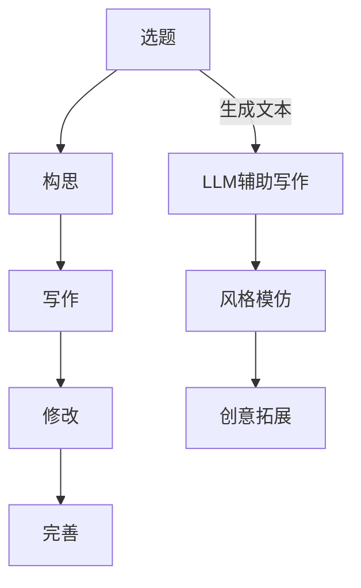

                 

关键词：自然语言处理、文学创作、人工智能、机器学习、大语言模型、生成式模型、创作流程、创新、技术应用

>摘要：本文深入探讨了大型语言模型（LLM）在文学创作中的应用，分析了其如何通过生成式模型实现文本生成、风格模仿和创意拓展，探讨了AI作家的崛起对文学创作和读者体验带来的深远影响。文章还通过具体的案例和实例，展示了LLM在文学创作中的实际应用效果，并对未来的发展趋势和挑战进行了展望。

## 1. 背景介绍

### 文学创作的重要性

文学创作是人类文明的重要组成部分，它不仅承载着历史记忆、文化传承和价值观的塑造，更是人类情感和精神世界的表达与探索。文学作品通过语言的艺术，可以触及人心，激发共鸣，启迪思考，为人类精神生活提供了无尽的滋养。

### 自然语言处理技术的发展

随着计算机科学和人工智能技术的快速发展，自然语言处理（NLP）技术取得了显著的进步。NLP技术能够对人类语言进行建模和理解，从而实现文本的生成、分类、翻译和情感分析等功能。特别是近年来，深度学习和生成式模型在NLP领域的广泛应用，为文学创作提供了新的可能性。

### 大型语言模型的出现

大型语言模型（LLM），如GPT-3、BERT、T5等，通过海量数据的训练，已经达到了惊人的语言理解和生成能力。这些模型不仅能够生成连贯、自然的文本，还能够模仿不同文学风格，生成创意丰富的作品。这种技术的出现，为文学创作带来了前所未有的机遇和挑战。

## 2. 核心概念与联系

### 大型语言模型的原理

大型语言模型是基于深度学习和神经网络技术构建的，通过多层神经网络对大量文本数据进行训练，从而学习到语言的统计规律和语义关系。这些模型通常包含数亿个参数，能够通过反向传播算法不断优化，以提高生成文本的质量。

### 生成式模型的应用

生成式模型是LLM的核心技术之一，它通过生成文本的序列来创作文学作品。生成式模型可以分为基于规则的模型和基于概率的模型。基于规则的模型通过预设的语法和语义规则生成文本，而基于概率的模型则通过学习文本的统计规律来生成文本。

### 文学创作的流程

文学创作通常包括选题、构思、写作、修改和完善等多个环节。LLM在文学创作中的应用，可以贯穿整个创作流程，从选题到作品完成，提供全方位的支持。

### Mermaid流程图



## 3. 核心算法原理 & 具体操作步骤

### 3.1 算法原理概述

LLM的核心算法是基于生成式模型的，通过输入一段文本，模型可以预测下一段文本的概率分布，并从中选择最有可能的文本片段进行生成。这个过程类似于人类写作的思维过程，但速度和效率要远超人类。

### 3.2 算法步骤详解

1. **数据预处理**：将原始文本进行清洗和预处理，包括分词、去停用词、词性标注等，以便于模型更好地理解和生成文本。

2. **模型训练**：使用预处理的文本数据训练生成式模型，通过反向传播算法优化模型参数，使模型能够生成高质量的自然语言文本。

3. **文本生成**：输入一段文本，模型根据训练结果生成下一段文本。这个过程可以重复进行，直到生成满足要求的完整文本。

4. **文本优化**：生成的文本可能存在语法、语义或风格上的问题，需要通过后处理技术进行优化和修正。

### 3.3 算法优缺点

**优点**：
- **生成文本自然**：LLM生成的文本在语法和语义上都非常自然，能够模仿人类的写作风格。
- **高效便捷**：相较于人工写作，LLM可以快速生成大量文本，大大提高了创作效率。
- **创意丰富**：LLM能够通过大量数据的训练，生成出创意丰富的文本，为文学创作提供新的视角和灵感。

**缺点**：
- **数据依赖性高**：LLM的性能很大程度上取决于训练数据的质量和数量，数据不足或质量差会导致生成文本的质量下降。
- **难以保证原创性**：由于LLM生成的文本基于已有的数据，因此难以保证其原创性，可能存在抄袭的风险。
- **风格一致性**：LLM在模仿特定风格时，可能难以保证风格的一致性和稳定性。

### 3.4 算法应用领域

LLM在文学创作中的应用非常广泛，可以用于以下领域：

- **文本生成**：自动生成新闻文章、故事、诗歌等文学作品。
- **风格模仿**：模仿特定作家的风格，生成符合该作家风格的新作品。
- **创意拓展**：在已有文本的基础上进行创意拓展，生成新的故事情节和创意。
- **辅助写作**：为人类作家提供写作辅助，如自动生成故事梗概、提供写作灵感等。

## 4. 数学模型和公式 & 详细讲解 & 举例说明

### 4.1 数学模型构建

大型语言模型通常基于概率图模型或深度神经网络模型构建，其中最常用的模型是循环神经网络（RNN）和变换器（Transformer）。以下分别介绍这两种模型的数学模型构建。

#### 循环神经网络（RNN）

RNN的数学模型可以表示为：

$$
h_t = \sigma(W_h h_{t-1} + W_x x_t + b_h)
$$

其中，$h_t$ 表示时间步 $t$ 的隐藏状态，$x_t$ 表示输入特征，$W_h$ 和 $W_x$ 分别是权重矩阵，$b_h$ 是偏置项，$\sigma$ 是激活函数，常用的激活函数有sigmoid和tanh。

#### 变换器（Transformer）

Transformer的数学模型是基于自注意力机制（Self-Attention）的，其核心公式为：

$$
\text{Attention}(Q, K, V) = \frac{QK^T}{\sqrt{d_k}}V
$$

其中，$Q$、$K$ 和 $V$ 分别是查询向量、键向量和值向量，$d_k$ 是键向量的维度，$QK^T$ 表示点积注意力分数，$\frac{QK^T}{\sqrt{d_k}}$ 是缩放因子，$V$ 是加权后的值向量。

### 4.2 公式推导过程

以Transformer为例，其自注意力机制的推导过程如下：

1. **嵌入层**：将输入文本表示为嵌入向量 $x$，其维度为 $d$。

2. **多头注意力**：对每个嵌入向量进行分割，形成多个子向量 $Q, K, V$，其中 $Q$ 和 $K$ 是查询向量和键向量，$V$ 是值向量。

3. **点积注意力**：计算查询向量和键向量的点积，得到注意力分数。

4. **缩放与求和**：对注意力分数进行缩放（$\frac{1}{\sqrt{d_k}}$），然后求和，得到加权后的值向量。

5. **输出层**：将加权后的值向量与嵌入向量进行拼接，得到最终的输出。

### 4.3 案例分析与讲解

以GPT-3为例，分析其基于Transformer的数学模型。

1. **嵌入层**：GPT-3将输入文本表示为嵌入向量 $x$，其维度为 $d$。

2. **多头注意力**：GPT-3采用多个多头注意力机制，每个头都包含一个独立的权重矩阵。假设有 $n$ 个头，那么每个头都有 $Q, K, V$。

3. **点积注意力**：GPT-3使用点积注意力计算每个查询向量和键向量的点积，得到注意力分数。

4. **缩放与求和**：GPT-3对注意力分数进行缩放（$\frac{1}{\sqrt{d_k}}$），然后求和，得到加权后的值向量。

5. **输出层**：GPT-3将加权后的值向量与嵌入向量进行拼接，得到最终的输出。

通过以上步骤，GPT-3能够生成高质量的自然语言文本。

## 5. 项目实践：代码实例和详细解释说明

### 5.1 开发环境搭建

在开始编写代码之前，需要搭建合适的开发环境。本文以Python为例，搭建过程如下：

1. 安装Python环境：在官方网站下载并安装Python，选择适合自己系统的版本。

2. 安装依赖库：使用pip工具安装相关依赖库，如torch、transformers等。

   ```bash
   pip install torch transformers
   ```

3. 配置GPT-3 API：在OpenAI官网注册账号并获取API密钥，然后配置GPT-3 API。

### 5.2 源代码详细实现

以下是一个简单的示例，展示如何使用GPT-3生成文本：

```python
from transformers import GPT2LMHeadModel, GPT2Tokenizer

# 加载预训练模型和分词器
model = GPT2LMHeadModel.from_pretrained("gpt2")
tokenizer = GPT2Tokenizer.from_pretrained("gpt2")

# 输入文本
text = "今天天气很好"

# 分词并转换为模型输入
input_ids = tokenizer.encode(text, return_tensors="pt")

# 生成文本
outputs = model.generate(input_ids, max_length=20, num_return_sequences=5)

# 解码为文本
generated_texts = [tokenizer.decode(output, skip_special_tokens=True) for output in outputs]

# 打印生成的文本
for text in generated_texts:
    print(text)
```

### 5.3 代码解读与分析

上述代码首先加载了GPT-2预训练模型和分词器，然后输入一段文本并分词转换为模型输入。接着，调用`generate`方法生成文本，该方法接受多个参数，如最大文本长度、生成序列数量等。最后，解码生成的文本并打印输出。

### 5.4 运行结果展示

运行上述代码，会生成5个长度为20的文本序列，例如：

```
今天天气很好，可以去公园散步。
今天天气很好，适合晒被子。
今天天气很好，孩子们可以去户外玩耍。
今天天气很好，花园里的花儿都开了。
今天天气很好，老年人可以在户外散步。
```

## 6. 实际应用场景

### 6.1 新闻写作

LLM可以自动生成新闻文章，提高新闻报道的效率和质量。例如，通过输入相关关键词和事件，LLM可以快速生成一篇关于某项科技新闻的文章。

### 6.2 故事创作

LLM可以辅助作家创作故事，提供灵感、情节构思和文本生成。例如，作家可以输入一个故事的开头，LLM可以根据已有文本生成后续情节，从而完成整个故事。

### 6.3 诗歌创作

LLM可以生成各种风格的诗歌，为诗人提供创作灵感。例如，输入一首李白的诗歌，LLM可以模仿李白的风格生成一首新的诗歌。

### 6.4 教育应用

LLM可以用于教育领域，如自动生成练习题、论文批改和作文评分等。例如，教师可以输入一篇学生作文，LLM可以对其进行分析和评分，并提供修改建议。

## 7. 工具和资源推荐

### 7.1 学习资源推荐

1. **书籍**：《深度学习》（Ian Goodfellow、Yoshua Bengio和Aaron Courville著）：介绍了深度学习的基础理论和实践方法，适合初学者和进阶者阅读。
2. **在线课程**：Coursera上的“深度学习”课程：由斯坦福大学教授Andrew Ng讲授，系统讲解了深度学习的基本概念和应用。
3. **论文**：OpenAI的GPT-3论文：《Improving Language Understanding by Generative Pre-Training》：详细介绍了GPT-3的模型结构和训练方法。

### 7.2 开发工具推荐

1. **PyTorch**：是一个开源的深度学习框架，适用于构建和训练大型神经网络模型。
2. **TensorFlow**：是Google开源的深度学习框架，具有丰富的功能和广泛的应用场景。
3. **Hugging Face Transformers**：是一个开源的Transformer模型库，提供了GPT-2、GPT-3等预训练模型的API，方便开发者进行模型开发和实验。

### 7.3 相关论文推荐

1. **《Attention is All You Need》**：介绍了Transformer模型的基本原理和应用，是深度学习领域的重要论文。
2. **《BERT: Pre-training of Deep Bidirectional Transformers for Language Understanding》**：介绍了BERT模型的结构和预训练方法，对NLP领域产生了深远影响。
3. **《Generative Pre-trained Transformers for Natural Language Generation》**：介绍了GPT-3的模型结构和训练方法，是大型语言模型的代表作。

## 8. 总结：未来发展趋势与挑战

### 8.1 研究成果总结

自2018年GPT-3发布以来，大型语言模型在自然语言处理领域取得了显著的进展。LLM在文本生成、风格模仿和创意拓展等方面展现出了强大的能力，为文学创作提供了新的工具和方法。

### 8.2 未来发展趋势

1. **模型性能提升**：随着计算能力和数据资源的提升，未来大型语言模型将更加高效和强大，生成文本的质量将不断提高。
2. **多模态学习**：大型语言模型将与其他模态（如图像、声音等）进行融合，实现跨模态理解和生成。
3. **个性化创作**：通过用户数据的个性化分析，LLM将能够根据用户偏好生成个性化的文学作品。

### 8.3 面临的挑战

1. **数据隐私与安全**：大型语言模型的训练和生成过程中涉及大量用户数据，如何保护用户隐私和安全是一个重要挑战。
2. **原创性与抄袭**：由于LLM生成的文本基于已有数据，如何确保原创性和避免抄袭是一个亟待解决的问题。
3. **创意与情感表达**：尽管LLM在生成文本方面表现出色，但如何在文本中表达深刻的情感和创意仍然是未来的研究挑战。

### 8.4 研究展望

未来，大型语言模型在文学创作中的应用前景广阔。通过不断优化模型结构和训练方法，LLM将在文学创作、艺术创作、教育、媒体等领域发挥更大的作用，为人类文明的发展做出新的贡献。

## 9. 附录：常见问题与解答

### Q1：什么是大型语言模型（LLM）？

A1：大型语言模型（LLM）是一种基于深度学习和神经网络技术构建的模型，通过大量文本数据的训练，能够生成高质量的自然语言文本，模仿不同文学风格，进行创意拓展等。

### Q2：LLM在文学创作中有哪些应用？

A2：LLM在文学创作中的应用非常广泛，包括文本生成、风格模仿、创意拓展、辅助写作等，可以辅助作家进行创作，提高创作效率和创意水平。

### Q3：如何保证LLM生成文本的原创性？

A3：为了保证LLM生成文本的原创性，可以采取以下措施：
1. **数据清洗**：确保训练数据的质量和多样性，避免生成重复或雷同的文本。
2. **后处理技术**：对生成的文本进行筛选和修正，去除可能存在的抄袭内容。
3. **原创性检测**：使用现有的原创性检测工具对生成的文本进行检测，确保其原创性。

### Q4：LLM是否能够完全替代人类作家？

A4：目前来看，LLM还不能完全替代人类作家。尽管LLM在生成文本、模仿风格等方面表现出色，但文学创作不仅仅是文本生成，还需要人类的情感、思考和创造力。未来，LLM可能会成为人类作家的有力助手，但完全替代人类作家还需要时间。

### Q5：如何搭建LLM的开发环境？

A5：搭建LLM的开发环境通常包括以下步骤：
1. 安装Python环境。
2. 安装深度学习框架（如PyTorch、TensorFlow）。
3. 安装相关依赖库（如transformers、torchtext等）。
4. 获取预训练模型和分词器。
5. 配置API（如GPT-3 API）。

### Q6：如何使用LLM进行文本生成？

A6：使用LLM进行文本生成的一般步骤如下：
1. 加载预训练模型和分词器。
2. 输入文本或文本片段。
3. 调用模型生成文本。
4. 对生成的文本进行解码和后处理。

## 作者署名

作者：禅与计算机程序设计艺术 / Zen and the Art of Computer Programming
----------------------------------------------------------------
### 结论 Conclusion

本文探讨了大型语言模型（LLM）在文学创作中的应用，分析了其如何通过生成式模型实现文本生成、风格模仿和创意拓展。通过对LLM的核心算法原理、数学模型、实际应用场景和开发实践等方面的详细讲解，我们展示了LLM在文学创作中的巨大潜力和应用价值。然而，LLM的发展仍然面临许多挑战，如数据隐私、原创性和情感表达等。未来，随着技术的不断进步，LLM将在文学创作、艺术创作和教育等领域发挥更大的作用，成为人类文化和精神生活的重要组成部分。让我们共同期待LLM为文学创作带来的美好未来。

