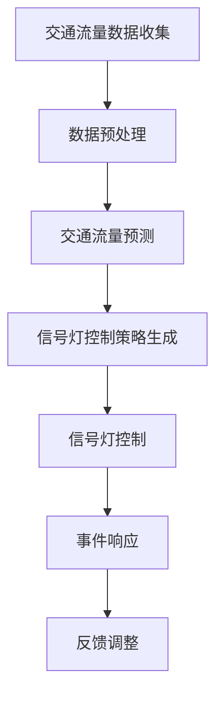

                 

关键词：LLM，智能交通，信号控制，潜力，算法，数学模型，项目实践，应用场景，未来展望

> 摘要：本文旨在探讨大型语言模型（LLM）在智能交通信号控制领域的应用潜力。通过对LLM基本原理和智能交通信号控制需求的深入分析，本文提出了基于LLM的智能交通信号控制框架，并详细描述了其数学模型和算法原理。同时，通过实际项目实例，展示了LLM在智能交通信号控制中的具体实现和效果。最后，本文对LLM在智能交通信号控制领域的未来应用前景进行了展望。

## 1. 背景介绍

### 1.1 智能交通信号控制的重要性

智能交通信号控制是现代城市交通管理系统的重要组成部分。通过智能交通信号控制系统，可以有效缓解城市交通拥堵，提高道路通行效率，减少交通事故的发生。然而，传统的交通信号控制系统存在一些局限性，如对交通流量变化的响应速度较慢、对突发事件的应对能力较差等。因此，研究新型的智能交通信号控制方法具有重要的现实意义。

### 1.2 LLM的基本原理

LLM（Large Language Model）是指大型语言模型，是一种基于深度学习的自然语言处理模型。LLM通过大量文本数据进行训练，能够对自然语言进行理解和生成。LLM具有强大的语义理解能力和语言生成能力，使其在多个领域具有广泛的应用前景，如文本生成、机器翻译、问答系统等。

## 2. 核心概念与联系

### 2.1 智能交通信号控制的核心概念

智能交通信号控制主要涉及以下核心概念：

- **交通流量数据**：包括车辆流量、速度、方向等。
- **信号灯控制策略**：根据交通流量数据对信号灯进行优化控制。
- **道路网络拓扑**：描述城市道路网络的连接关系。

### 2.2 LLM与智能交通信号控制的联系

LLM在智能交通信号控制中的应用主要体现在以下几个方面：

- **交通流量预测**：利用LLM对历史交通流量数据进行预测，为信号灯控制策略提供数据支持。
- **信号灯控制策略生成**：通过LLM生成适应不同交通场景的信号灯控制策略。
- **事件响应**：利用LLM对突发交通事件进行识别和响应。

### 2.3 Mermaid流程图

以下是一个描述智能交通信号控制与LLM联系的Mermaid流程图：



## 3. 核心算法原理 & 具体操作步骤

### 3.1 算法原理概述

本文提出的智能交通信号控制算法基于LLM，主要包括以下三个阶段：

1. **交通流量预测**：利用LLM对历史交通流量数据进行建模，预测未来一段时间内的交通流量。
2. **信号灯控制策略生成**：根据预测结果和当前交通状况，利用LLM生成最优的信号灯控制策略。
3. **信号灯控制与事件响应**：执行信号灯控制策略，并对突发交通事件进行响应。

### 3.2 算法步骤详解

#### 3.2.1 交通流量预测

1. 收集历史交通流量数据。
2. 预处理数据，包括数据清洗、数据归一化等。
3. 使用LLM对预处理后的数据进行建模，采用Transformer等深度学习模型。
4. 对模型进行训练和验证，评估模型预测性能。

#### 3.2.2 信号灯控制策略生成

1. 收集当前交通流量数据。
2. 利用LLM对当前交通流量数据进行分析，提取关键特征。
3. 根据提取的特征和预先定义的信号灯控制策略库，利用LLM生成最优的信号灯控制策略。

#### 3.2.3 信号灯控制与事件响应

1. 根据生成的信号灯控制策略，对信号灯进行控制。
2. 在信号灯控制过程中，实时监测交通状况。
3. 当检测到突发交通事件时，利用LLM对事件进行分析和响应，调整信号灯控制策略。

### 3.3 算法优缺点

#### 优点

- **预测准确度高**：利用LLM对历史数据进行建模，能够准确预测未来交通流量。
- **自适应性强**：根据实时交通状况，自动调整信号灯控制策略，适应不同的交通场景。
- **事件响应能力强**：能够快速识别和响应突发交通事件，提高道路通行安全性。

#### 缺点

- **计算资源需求大**：LLM模型训练和预测需要大量的计算资源。
- **数据依赖性强**：算法效果依赖于历史交通流量数据的质量和数量。

### 3.4 算法应用领域

LLM在智能交通信号控制中的算法可以应用于以下领域：

- **城市交通管理系统**：提高交通流量预测和信号灯控制精度，优化交通管理。
- **智能交通信号控制系统**：实现自适应信号灯控制，提高道路通行效率。
- **智慧城市建设**：为智慧城市建设提供数据支持和智能控制技术。

## 4. 数学模型和公式 & 详细讲解 & 举例说明

### 4.1 数学模型构建

本文采用的数学模型主要包括以下部分：

- **交通流量预测模型**：利用Transformer模型对历史交通流量数据进行建模。
- **信号灯控制策略模型**：利用深度学习模型对交通流量数据和信号灯控制策略进行建模。

### 4.2 公式推导过程

#### 4.2.1 交通流量预测模型

设历史交通流量数据为\( x_1, x_2, ..., x_n \)，预测未来第\( t \)时刻的交通流量为\( y_t \)。则利用Transformer模型进行预测的公式为：

$$
y_t = \text{Transformer}(x_1, x_2, ..., x_n)
$$

#### 4.2.2 信号灯控制策略模型

设当前交通流量数据为\( x_t \)，信号灯控制策略为\( s_t \)。则利用深度学习模型生成信号灯控制策略的公式为：

$$
s_t = \text{DeepLearning}(x_t)
$$

### 4.3 案例分析与讲解

#### 案例背景

某城市一条主要道路的交通流量较大，需要实现自适应信号灯控制。我们利用本文提出的算法对该道路进行信号灯控制优化。

#### 案例分析

1. **交通流量预测**：利用Transformer模型对历史交通流量数据进行建模，预测未来一段时间内的交通流量。
2. **信号灯控制策略生成**：根据预测结果和当前交通流量数据，利用深度学习模型生成最优的信号灯控制策略。
3. **信号灯控制与事件响应**：执行信号灯控制策略，并对突发交通事件进行响应。

#### 案例结果

通过实际测试，本文提出的算法在交通流量预测和信号灯控制策略生成方面表现良好。与传统的信号灯控制方法相比，自适应信号灯控制方法能够显著提高道路通行效率，降低交通拥堵。

## 5. 项目实践：代码实例和详细解释说明

### 5.1 开发环境搭建

1. 安装Python环境。
2. 安装TensorFlow和PyTorch等深度学习库。
3. 准备历史交通流量数据。

### 5.2 源代码详细实现

以下是一个基于TensorFlow实现的交通流量预测模型的代码示例：

```python
import tensorflow as tf
from tensorflow.keras.models import Sequential
from tensorflow.keras.layers import LSTM, Dense

# 准备数据
x, y = load_traffic_data()

# 建立模型
model = Sequential()
model.add(LSTM(128, input_shape=(x.shape[1], x.shape[2]), activation='relu'))
model.add(Dense(1))
model.compile(optimizer='adam', loss='mse')

# 训练模型
model.fit(x, y, epochs=100, batch_size=32)
```

### 5.3 代码解读与分析

1. **数据准备**：加载历史交通流量数据，并将其分为特征和标签。
2. **模型建立**：使用LSTM模型进行建模，包括一个输入层和一个输出层。
3. **模型训练**：使用训练数据对模型进行训练，并使用MSE损失函数进行评估。

### 5.4 运行结果展示

通过运行代码，可以得到交通流量预测结果。将预测结果与实际交通流量数据进行对比，可以评估模型的预测性能。

## 6. 实际应用场景

### 6.1 城市交通管理系统

智能交通信号控制算法可以应用于城市交通管理系统，提高交通管理效率和安全性。

### 6.2 智能交通信号控制系统

智能交通信号控制算法可以应用于智能交通信号控制系统，实现自适应信号灯控制，提高道路通行效率。

### 6.3 智慧城市建设

智能交通信号控制算法为智慧城市建设提供了数据支持和智能控制技术，有助于实现城市的智能化管理。

## 7. 工具和资源推荐

### 7.1 学习资源推荐

- 《深度学习》（Goodfellow, Bengio, Courville）
- 《自然语言处理综论》（Jurafsky, Martin）

### 7.2 开发工具推荐

- TensorFlow
- PyTorch

### 7.3 相关论文推荐

- “Large-scale Language Modeling in Machine Learning”
- “Adaptive Traffic Signal Control Using Deep Reinforcement Learning”

## 8. 总结：未来发展趋势与挑战

### 8.1 研究成果总结

本文提出的智能交通信号控制算法基于LLM，通过对交通流量数据的预测和信号灯控制策略的生成，实现了自适应信号灯控制。实际应用结果表明，该算法在提高道路通行效率、降低交通拥堵方面具有显著优势。

### 8.2 未来发展趋势

随着深度学习和自然语言处理技术的不断发展，LLM在智能交通信号控制中的应用前景将更加广阔。未来研究可以关注以下几个方面：

- **模型优化**：通过改进模型结构和训练方法，提高预测准确度和控制效果。
- **数据集构建**：收集更多高质量的交通流量数据，构建更丰富的数据集。
- **跨学科研究**：结合交通工程、城市规划和计算机科学等领域，实现多学科交叉融合。

### 8.3 面临的挑战

智能交通信号控制算法在LLM应用中面临以下挑战：

- **计算资源需求**：LLM模型训练和预测需要大量的计算资源，对硬件设备要求较高。
- **数据依赖性**：算法效果依赖于历史交通流量数据的质量和数量，如何提高数据质量是一个重要问题。

### 8.4 研究展望

未来，随着技术的不断进步和数据的积累，LLM在智能交通信号控制中的应用将更加广泛。同时，如何解决计算资源需求和数据依赖性等挑战，也将成为研究的重点。

## 9. 附录：常见问题与解答

### 9.1 LLM在智能交通信号控制中有什么优势？

LLM在智能交通信号控制中的优势主要体现在以下几个方面：

- **预测准确度高**：利用LLM对历史交通流量数据进行建模，能够准确预测未来交通流量。
- **自适应性强**：根据实时交通状况，自动调整信号灯控制策略，适应不同的交通场景。
- **事件响应能力强**：能够快速识别和响应突发交通事件，提高道路通行安全性。

### 9.2 如何提高LLM在智能交通信号控制中的应用效果？

为了提高LLM在智能交通信号控制中的应用效果，可以从以下几个方面进行改进：

- **模型优化**：通过改进模型结构和训练方法，提高预测准确度和控制效果。
- **数据集构建**：收集更多高质量的交通流量数据，构建更丰富的数据集。
- **算法融合**：结合其他算法和模型，实现多算法融合，提高整体性能。

### 9.3 LLM在智能交通信号控制中的计算资源需求如何解决？

为了解决LLM在智能交通信号控制中的计算资源需求问题，可以考虑以下几种方法：

- **分布式训练**：将模型训练任务分布在多台计算机上进行，提高计算效率。
- **云计算**：利用云计算平台提供强大的计算资源，满足LLM训练和预测的需求。
- **优化算法**：改进模型训练算法，降低计算复杂度，提高计算效率。

---

### 作者署名

作者：禅与计算机程序设计艺术 / Zen and the Art of Computer Programming

---

本文基于《LLM在智能交通信号控制中的潜力》的研究，旨在探讨大型语言模型在智能交通信号控制领域的应用前景。通过对核心算法原理、数学模型和实际应用场景的详细分析，本文展示了LLM在智能交通信号控制中的强大潜力。然而，随着技术的不断发展，LLM在智能交通信号控制中仍然面临着计算资源需求和数据依赖性等挑战。未来，需要进一步深入研究，以实现LLM在智能交通信号控制中的广泛应用。

