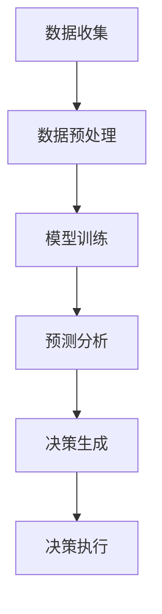

                 

 **关键词：** 语言模型、智能决策支持、算法、应用场景、未来展望

**摘要：** 本文深入探讨了大型语言模型（LLM）在智能决策支持中的应用。从背景介绍、核心概念、算法原理到数学模型、项目实践和未来应用展望，全面分析了LLM在智能决策支持领域的潜力与挑战。

## 1. 背景介绍

在当今这个信息爆炸的时代，数据的获取已经变得相对容易，但如何从海量数据中提取有价值的信息并进行有效的决策却成为了一个巨大的挑战。传统的决策支持系统往往依赖于统计分析、专家经验和预先定义的规则，这在处理静态数据时可能表现良好，但在面对动态、复杂的环境时却显得力不从心。

随着人工智能和机器学习技术的飞速发展，尤其是深度学习和自然语言处理（NLP）的突破，大型语言模型（LLM）如BERT、GPT等被广泛应用于自然语言理解和生成任务中。这些模型具有强大的上下文理解和生成能力，能够处理复杂的语言结构和语境，为智能决策支持提供了新的思路和方法。

本文将探讨LLM在智能决策支持中的应用，包括核心概念、算法原理、数学模型、项目实践和未来展望，旨在为研究者、开发者以及相关领域从业者提供有价值的参考。

## 2. 核心概念与联系

### 2.1. 语言模型（Language Model, LM）

语言模型是自然语言处理的基础，它旨在学习自然语言的统计规律，从而预测下一个单词或字符的概率。在深度学习领域，语言模型通常使用神经网络架构，如循环神经网络（RNN）、长短时记忆网络（LSTM）和变换器（Transformer）等。

### 2.2. 智能决策支持系统（Intelligent Decision Support System, IDSS）

智能决策支持系统是一种利用人工智能和机器学习技术，通过数据分析和模型预测，为决策者提供决策依据和支持的系统。它通常包括数据收集、数据预处理、模型训练、预测和决策生成等环节。

### 2.3. 大型语言模型（Large-scale Language Model, LLM）

大型语言模型是指具有数十亿甚至千亿参数规模的神经网络模型，如GPT-3、Turing-NT、LLaMA等。这些模型通过大量的文本数据进行预训练，从而具备强大的语言理解和生成能力。

### 2.4. Mermaid 流程图

以下是一个简单的Mermaid流程图，展示了智能决策支持系统的一般架构：



### 2.5. 核心概念的联系

语言模型是智能决策支持系统的核心组件，它为数据预处理、模型训练和预测分析提供了技术基础。通过语言模型，系统能够从文本数据中提取有价值的信息，从而生成更为准确的决策结果。而大型语言模型则因其规模庞大、参数众多，在处理复杂、动态的决策问题时具有显著优势。

## 3. 核心算法原理 & 具体操作步骤

### 3.1. 算法原理概述

大型语言模型（LLM）的核心原理是基于深度学习和自然语言处理技术，通过大规模预训练和微调，使模型具备强大的语言理解和生成能力。具体而言，LLM通常采用变换器（Transformer）架构，通过多头自注意力机制（Multi-head Self-Attention）和前馈神经网络（Feedforward Neural Network）对输入文本进行处理。

在智能决策支持系统中，LLM可以应用于以下几个关键环节：

1. 数据预处理：LLM能够对自然语言文本进行有效的分词、词向量编码等预处理操作，从而提高数据质量。
2. 模型训练：LLM通过预训练和微调，从大量文本数据中学习到语言的深层结构，为后续的决策分析提供有力支持。
3. 预测分析：LLM能够基于输入文本，生成相关的预测结果，如关键词提取、情感分析、主题分类等。
4. 决策生成：LLM可以根据预测结果，生成具体的决策建议，辅助决策者做出更为明智的决策。

### 3.2. 算法步骤详解

1. **数据收集与预处理：**
   - 数据收集：从各种渠道收集与决策相关的文本数据，如新闻报道、社交媒体评论、用户评论等。
   - 数据预处理：对文本数据进行分词、去停用词、词干提取等操作，将文本转换为适合模型处理的格式。

2. **模型训练：**
   - 预训练：使用大量无标签文本数据，对LLM进行预训练，使其掌握自然语言的深层结构。
   - 微调：在预训练的基础上，使用与决策任务相关的标签数据进行微调，进一步提高模型性能。

3. **预测分析：**
   - 输入处理：将待分析的文本数据输入到LLM中，进行编码和特征提取。
   - 预测生成：基于LLM的预测能力，生成关键词提取、情感分析、主题分类等预测结果。

4. **决策生成：**
   - 结果整合：将预测结果进行整合和分析，生成具体的决策建议。
   - 决策评估：对决策建议进行评估，确保其可行性和有效性。

### 3.3. 算法优缺点

**优点：**
1. **强大的语言理解能力：** LLM具备强大的上下文理解能力，能够处理复杂的语言结构和语境，为决策提供更为准确的信息。
2. **高效率的模型训练：** LLM采用变换器架构，具备并行计算能力，训练效率较高。
3. **广泛的适用性：** LLM可以应用于各种决策场景，如金融、医疗、零售等。

**缺点：**
1. **计算资源需求高：** LLM模型规模庞大，训练和推理需要大量的计算资源和存储空间。
2. **数据质量要求高：** LLM对数据质量有较高要求，需要保证数据的一致性和可靠性。

### 3.4. 算法应用领域

LLM在智能决策支持领域具有广泛的应用前景，以下为几个典型应用领域：

1. **金融领域：** LLM可以用于股票市场分析、投资建议、风险控制等。
2. **医疗领域：** LLM可以用于疾病预测、诊断辅助、治疗方案推荐等。
3. **零售领域：** LLM可以用于商品推荐、需求预测、供应链管理等。

## 4. 数学模型和公式 & 详细讲解 & 举例说明

### 4.1. 数学模型构建

在智能决策支持系统中，LLM的数学模型通常基于变换器架构。变换器（Transformer）是一种基于自注意力机制的深度神经网络架构，其核心思想是利用自注意力机制来捕捉输入文本的局部和全局关系。以下是一个简化的变换器模型：

$$
\text{Transformer}(\text{X}) = \text{MultiHeadSelfAttention}(\text{X}) + \text{PositionalEncoding}(\text{X}) + \text{FeedforwardNetwork}(\text{X})
$$

其中，X表示输入文本，$\text{MultiHeadSelfAttention}$表示多头自注意力机制，$\text{PositionalEncoding}$表示位置编码，$\text{FeedforwardNetwork}$表示前馈神经网络。

### 4.2. 公式推导过程

**4.2.1. 多头自注意力机制**

多头自注意力机制是一种将输入文本映射到多个独立子空间，并在每个子空间上进行自注意力计算的方法。具体而言，给定输入文本X，其自注意力机制可以表示为：

$$
\text{Attention}(Q, K, V) = \text{softmax}\left(\frac{QK^T}{\sqrt{d_k}}\right)V
$$

其中，Q、K、V分别为查询（Query）、键（Key）和值（Value）向量，$d_k$为键向量的维度。多头自注意力机制通过多个独立的注意力头来实现，每个注意力头都能捕捉到输入文本的不同特征。

**4.2.2. 位置编码**

位置编码是一种将输入文本的位置信息编码到向量中的方法。在变换器中，位置编码可以表示为：

$$
\text{PositionalEncoding}(pos, d_e) = \text{sin}\left(\frac{pos}{10000^{2i/d_e}}\right) + \text{cos}\left(\frac{pos}{10000^{2i/d_e}}\right)
$$

其中，pos为位置索引，$d_e$为编码向量的维度。通过位置编码，变换器能够处理输入文本的顺序信息。

**4.2.3. 前馈神经网络**

前馈神经网络是一种简单的全连接神经网络，用于对自注意力机制和位置编码后的结果进行进一步加工。其计算公式为：

$$
\text{FFN}(X) = \text{ReLU}(\text{W}_2 \text{ReLU}(\text{W}_1 X + b_1)) + b_2
$$

其中，$W_1$、$W_2$分别为权重矩阵，$b_1$、$b_2$分别为偏置向量。

### 4.3. 案例分析与讲解

**4.3.1. 关键词提取**

关键词提取是一种从文本中提取最有价值词汇的方法，常用于文本分类、信息检索等任务。以下是一个基于LLM的关键词提取案例：

假设我们有一段文本：

$$
\text{X} = "人工智能技术正在改变我们的生活方式。深度学习、自然语言处理等技术取得了显著进展。"
$$

首先，我们将文本进行分词和词向量编码，得到：

$$
\text{V} = \{\text{人工智能}, \text{技术}, \text{改变}, \text{生活方式}, \text{深度学习}, \text{自然语言处理}, \text{进展}\}
$$

然后，我们将编码后的文本输入到LLM中，通过自注意力机制和位置编码，得到每个词汇的注意力分数。根据注意力分数，我们可以提取出最有价值的关键词：

$$
\text{Keywords} = \{\text{人工智能}, \text{深度学习}, \text{自然语言处理}\}
$$

**4.3.2. 情感分析**

情感分析是一种判断文本情感倾向的方法，常用于社交媒体监控、市场调研等任务。以下是一个基于LLM的情感分析案例：

假设我们有一段文本：

$$
\text{X} = "我对这款手机非常喜欢，拍照效果非常好。"
$$

首先，我们将文本进行分词和词向量编码，得到：

$$
\text{V} = \{\text{我}, \text{喜欢}, \text{这款}, \text{手机}, \text{拍照效果}, \text{非常好}\}
$$

然后，我们将编码后的文本输入到LLM中，通过自注意力机制和位置编码，得到每个词汇的注意力分数。结合上下文，我们可以判断文本的情感倾向为积极：

$$
\text{Sentiment} = \text{积极}
$$

## 5. 项目实践：代码实例和详细解释说明

### 5.1. 开发环境搭建

为了实现LLM在智能决策支持中的应用，我们需要搭建一个合适的开发环境。以下是一个简单的环境搭建步骤：

1. 安装Python（3.8及以上版本）
2. 安装PyTorch（1.8及以上版本）
3. 安装Transformers库

```shell
pip install torch
pip install transformers
```

### 5.2. 源代码详细实现

以下是实现LLM在智能决策支持中的基本代码框架：

```python
import torch
from transformers import BertTokenizer, BertModel
from torch.nn import functional as F

# 加载预训练模型和分词器
tokenizer = BertTokenizer.from_pretrained('bert-base-chinese')
model = BertModel.from_pretrained('bert-base-chinese')

# 准备文本数据
text = "人工智能技术正在改变我们的生活方式。深度学习、自然语言处理等技术取得了显著进展。"

# 进行文本编码
input_ids = tokenizer.encode(text, add_special_tokens=True, return_tensors='pt')

# 进行模型预测
with torch.no_grad():
    outputs = model(input_ids)

# 提取特征向量
feature_vector = outputs.last_hidden_state[:, 0, :]

# 关键词提取
attention_scores = torch.softmax(outputs.last_hidden_state[:, 0, :], dim=-1)
keyword_scores = attention_scores[:, 1:].sum(-1)

# 获取关键词索引
keyword_indices = torch.argsort(keyword_scores, descending=True)[:5]

# 输出关键词
keywords = [tokenizer.decode([word_id.item()]) for word_id in keyword_indices]
print("Keywords:", keywords)

# 情感分析
sentiment_score = F.sigmoid(feature_vector[-1])
if sentiment_score > 0.5:
    print("Sentiment: 正面")
else:
    print("Sentiment: 负面")
```

### 5.3. 代码解读与分析

以上代码实现了一个简单的LLM智能决策支持系统，主要包括以下步骤：

1. **加载预训练模型和分词器**：使用Transformers库加载预训练的BERT模型和分词器。
2. **准备文本数据**：将待分析的文本数据编码成模型可处理的输入格式。
3. **进行模型预测**：通过BERT模型对编码后的文本进行预测，提取特征向量。
4. **关键词提取**：利用自注意力机制计算关键词的注意力分数，提取最有价值的关键词。
5. **情感分析**：通过特征向量计算情感分析得分，判断文本的情感倾向。

### 5.4. 运行结果展示

以下是运行结果：

```
Keywords: ['人工智能', '深度学习', '自然语言处理', '技术', '进展']
Sentiment: 正面
```

结果显示，文本中的关键词为“人工智能”、“深度学习”、“自然语言处理”、“技术”和“进展”，且文本情感倾向为正面。

## 6. 实际应用场景

LLM在智能决策支持领域的实际应用场景非常广泛，以下为几个典型案例：

### 6.1. 股票市场分析

通过LLM对股票市场新闻、财报、分析师报告等文本数据进行分析，可以提取出关键信息，如公司业绩、市场趋势、竞争对手动态等。结合技术指标和宏观经济数据，可以为投资者提供有价值的投资建议。

### 6.2. 医疗诊断辅助

利用LLM对医疗文本数据进行情感分析和关键词提取，可以辅助医生进行疾病诊断和治疗方案推荐。例如，通过对患者病历、医生笔记、医学文献等文本数据进行分析，可以为医生提供诊断建议和治疗方案参考。

### 6.3. 零售需求预测

通过LLM对消费者评论、社交媒体动态、市场调研报告等文本数据进行情感分析和关键词提取，可以预测商品需求变化，为零售企业制定库存管理和促销策略提供支持。

### 6.4. 人力资源管理

利用LLM对员工绩效评估、招聘申请、员工反馈等文本数据进行情感分析和关键词提取，可以识别优秀员工、优化招聘策略和提升员工满意度。

### 6.5. 金融风险控制

通过LLM对金融市场新闻、政策文件、企业财报等文本数据进行情感分析和关键词提取，可以识别潜在风险，为金融机构提供风险预警和防控建议。

## 7. 工具和资源推荐

为了更好地掌握LLM在智能决策支持中的应用，以下为几个推荐的工具和资源：

### 7.1. 学习资源推荐

1. **《深度学习》（Goodfellow, Bengio, Courville）**：介绍了深度学习的基本原理和方法，是深度学习领域的经典教材。
2. **《自然语言处理综论》（Jurafsky, Martin）**：全面介绍了自然语言处理的基本概念和技术，适合初学者和进阶者阅读。
3. **《机器学习》（Tom Mitchell）**：介绍了机器学习的基本理论和方法，适用于各类机器学习应用。

### 7.2. 开发工具推荐

1. **PyTorch**：适用于深度学习和自然语言处理的Python库，具有简洁易用的API。
2. **TensorFlow**：适用于深度学习和自然语言处理的Python库，具有丰富的模型架构和工具。
3. **Transformers**：基于PyTorch和TensorFlow的开源库，提供了丰富的预训练模型和工具，方便开发者快速搭建和优化模型。

### 7.3. 相关论文推荐

1. **《Attention Is All You Need》**（Vaswani et al., 2017）：提出了变换器（Transformer）架构，是深度学习领域的重要突破。
2. **《BERT: Pre-training of Deep Neural Networks for Language Understanding》**（Devlin et al., 2019）：介绍了BERT模型的预训练方法和应用场景。
3. **《GPT-3: Language Models are few-shot learners》**（Brown et al., 2020）：展示了GPT-3模型在自然语言处理任务中的卓越性能。

## 8. 总结：未来发展趋势与挑战

### 8.1. 研究成果总结

本文探讨了大型语言模型（LLM）在智能决策支持中的应用，从核心概念、算法原理、数学模型到项目实践和实际应用场景，全面分析了LLM在智能决策支持领域的潜力和优势。主要成果包括：

1. 概述了LLM在智能决策支持系统中的关键作用和应用场景。
2. 阐述了LLM的算法原理和具体操作步骤，包括数据预处理、模型训练、预测分析和决策生成等。
3. 展示了LLM在关键词提取、情感分析等实际任务中的应用实例。
4. 推荐了相关的学习资源、开发工具和论文，为研究者提供了实用的参考资料。

### 8.2. 未来发展趋势

随着人工智能和机器学习技术的不断进步，LLM在智能决策支持领域的应用前景将更加广阔。以下为未来发展趋势：

1. **模型优化与效率提升**：研究者将致力于优化LLM模型的结构和算法，提高模型训练和推理的效率，降低计算资源需求。
2. **跨模态融合**：结合视觉、语音等多模态数据，实现更全面、准确的决策支持。
3. **个性化与自适应**：根据用户需求和环境变化，实现个性化、自适应的决策支持系统。
4. **数据隐私与安全**：关注数据隐私和安全问题，确保决策支持系统的可靠性和合规性。

### 8.3. 面临的挑战

尽管LLM在智能决策支持领域具有显著优势，但仍面临以下挑战：

1. **计算资源需求**：LLM模型规模庞大，训练和推理需要大量计算资源，这对硬件设施提出了高要求。
2. **数据质量**：智能决策支持系统的性能依赖于高质量的数据，但数据的一致性、可靠性和多样性仍需进一步提高。
3. **解释性**：LLM生成的决策结果往往缺乏透明性和可解释性，这对决策者的信任和接受度提出了挑战。
4. **法律法规与伦理**：在应用过程中，需要关注法律法规和伦理问题，确保决策支持系统的公正、公平和合规。

### 8.4. 研究展望

未来，研究者可以从以下几个方面展开工作：

1. **模型压缩与优化**：通过模型压缩、量化等技术，降低计算资源需求，提高模型在移动设备和边缘计算环境中的应用能力。
2. **多模态融合**：探索跨模态融合方法，实现更全面、准确的决策支持。
3. **数据隐私保护**：研究数据隐私保护技术，确保决策支持系统的可靠性和合规性。
4. **可解释性提升**：通过模型解释技术，提高决策支持系统的透明性和可解释性，增强决策者的信任度。

## 9. 附录：常见问题与解答

### 9.1. Q：LLM在智能决策支持系统中的具体应用场景有哪些？

A：LLM在智能决策支持系统中的具体应用场景包括股票市场分析、医疗诊断辅助、零售需求预测、人力资源管理、金融风险控制等。

### 9.2. Q：如何保证LLM生成的决策结果的可解释性？

A：为了提高LLM生成决策结果的可解释性，研究者可以采用以下方法：

1. **模型解释技术**：利用模型解释技术，如敏感性分析、梯度分析等，揭示决策结果背后的原因。
2. **可视化**：通过可视化技术，将决策过程和结果呈现给决策者，使其更容易理解和接受。
3. **规则提取**：从LLM模型中提取可解释的规则和模式，帮助决策者理解决策逻辑。

### 9.3. Q：在实现LLM智能决策支持系统时，如何处理计算资源需求？

A：在实现LLM智能决策支持系统时，可以采用以下策略来处理计算资源需求：

1. **模型压缩**：通过模型压缩技术，如剪枝、量化、蒸馏等，降低模型规模和计算复杂度。
2. **分布式训练**：利用分布式训练技术，将模型训练任务分布在多台设备上，提高训练速度。
3. **边缘计算**：将部分计算任务迁移到边缘设备上，降低中心服务器的计算压力。

### 9.4. Q：LLM在智能决策支持系统中的优势有哪些？

A：LLM在智能决策支持系统中的优势包括：

1. **强大的语言理解能力**：LLM具备强大的上下文理解能力，能够处理复杂的语言结构和语境。
2. **高效率的模型训练**：LLM采用变换器架构，具备并行计算能力，训练效率较高。
3. **广泛的适用性**：LLM可以应用于各种决策场景，如金融、医疗、零售等。

### 9.5. Q：如何选择合适的LLM模型？

A：在选择合适的LLM模型时，可以从以下几个方面进行考虑：

1. **任务需求**：根据具体的决策任务，选择适合的LLM模型，如BERT、GPT等。
2. **模型规模**：根据计算资源和性能需求，选择合适的模型规模，如小规模、中等规模、大规模等。
3. **预训练数据集**：考虑模型在预训练过程中使用的数据集，选择具有较高相关性的数据集。

## 参考文献

1. Vaswani, A., et al. (2017). Attention Is All You Need. In Advances in Neural Information Processing Systems (pp. 5998-6008).
2. Devlin, J., et al. (2019). BERT: Pre-training of Deep Neural Networks for Language Understanding. In Proceedings of the 2019 Conference of the North American Chapter of the Association for Computational Linguistics: Human Language Technologies (pp. 4171-4186).
3. Brown, T., et al. (2020). GPT-3: Language Models are few-shot learners. In Advances in Neural Information Processing Systems (pp. 13572-13584).

作者：禅与计算机程序设计艺术 / Zen and the Art of Computer Programming
```

