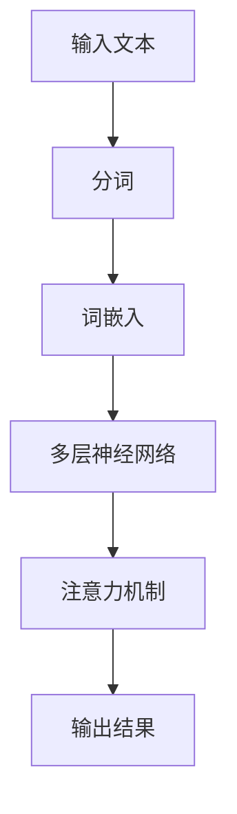
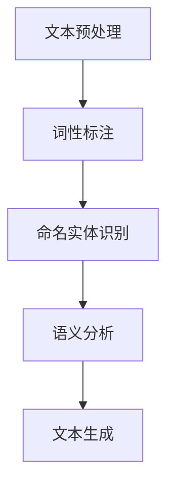
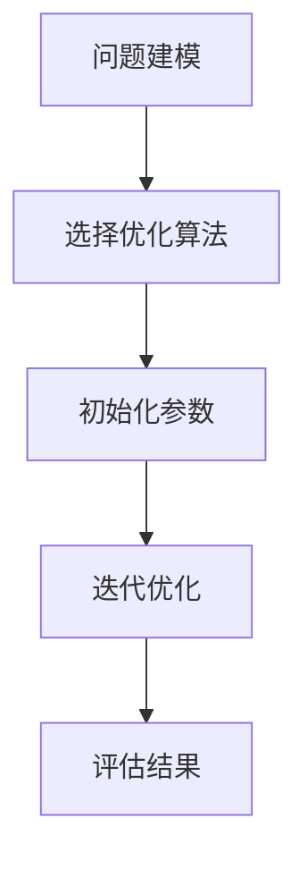
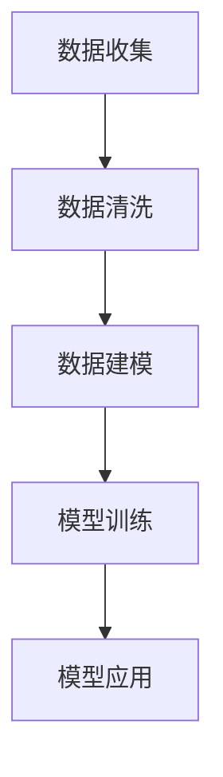

                 

关键词：自然语言处理、大型语言模型、智能制造、数据驱动、智能优化、工业4.0

> 摘要：本文深入探讨了大型语言模型（LLM）在智能制造领域的应用前景，分析了LLM技术如何通过自然语言处理、智能优化和数据驱动的机制，推动智能制造的发展。本文将详细介绍LLM的核心概念、算法原理、数学模型、实际应用场景，并对未来的发展趋势和挑战进行展望。

## 1. 背景介绍

### 1.1 智能制造的定义与现状

智能制造是指利用先进的信息技术、自动化技术和智能技术，对生产制造过程进行优化和升级，实现生产过程的高度自动化、智能化和精细化。随着工业4.0的提出，智能制造成为全球制造业发展的重要方向。

当前，智能制造已经在生产计划、物料管理、质量控制、设备维护等多个方面取得了显著成效。然而，随着制造过程的复杂性和数据量的急剧增长，传统的智能制造方法面临着数据处理能力不足、适应性差、智能化程度低等问题。

### 1.2 大型语言模型（LLM）的发展与应用

大型语言模型（LLM）是基于深度学习和自然语言处理技术构建的复杂模型，能够对海量文本数据进行处理，理解语义和生成文本。近年来，随着计算能力的提升和数据量的爆炸性增长，LLM技术在自然语言处理领域取得了显著进展，并在智能问答、机器翻译、文本生成等领域得到了广泛应用。

在智能制造领域，LLM技术具有巨大的应用潜力，可以用于数据处理、生产优化、设备维护、故障诊断等方面，为智能制造的发展提供新的动力。

## 2. 核心概念与联系

### 2.1 大型语言模型（LLM）原理

大型语言模型（LLM）基于深度神经网络，通过对海量文本数据进行训练，学习语言的内在规律和语义。LLM的核心结构包括多层神经网络、注意力机制和循环神经网络等。

#### Mermaid 流程图：



### 2.2 自然语言处理（NLP）

自然语言处理（NLP）是人工智能的一个重要分支，旨在使计算机理解和处理人类自然语言。NLP包括文本预处理、词性标注、命名实体识别、语义分析等任务。

#### Mermaid 流程图：



### 2.3 智能优化

智能优化是指利用人工智能技术，如遗传算法、粒子群优化、模拟退火等，对复杂问题进行求解和优化。在智能制造领域，智能优化可用于生产计划、调度、设备维护等方面。

#### Mermaid 流程图：



### 2.4 数据驱动

数据驱动是指利用大量数据，通过统计分析、机器学习等方法，对系统进行建模和优化。在智能制造领域，数据驱动方法可用于设备预测维护、质量监测、能耗管理等方面。

#### Mermaid 流程图：



## 3. 核心算法原理 & 具体操作步骤

### 3.1 算法原理概述

大型语言模型（LLM）通过以下步骤进行工作：

1. **输入文本**：接收自然语言文本作为输入。
2. **分词**：将文本分解为单词或子词。
3. **词嵌入**：将单词或子词转换为高维向量表示。
4. **多层神经网络**：通过多层神经网络对词嵌入进行处理，提取语义信息。
5. **注意力机制**：利用注意力机制关注文本中的关键信息。
6. **输出结果**：根据处理后的文本生成相应的输出，如回答问题、生成文本等。

### 3.2 算法步骤详解

#### 3.2.1 输入文本

输入文本可以是自然语言问题、需求描述或数据报告等。例如：

```
问题：如何优化生产线的能耗？
需求：根据产品质量数据，预测下一个月的生产计划。
报告：设备A的运行状态报告。
```

#### 3.2.2 分词

分词是将文本分解为单词或子词的过程。例如，"如何优化生产线的能耗"可以分为"如何"、"优化"、"生产线"、"的"、"能耗"。

#### 3.2.3 词嵌入

词嵌入是将单词或子词转换为高维向量表示的过程。词嵌入可以捕获单词的语义信息，如"优化"和"优化"在语义上具有一定的相似性。

#### 3.2.4 多层神经网络

多层神经网络对词嵌入进行处理，提取语义信息。多层神经网络通常包括输入层、隐藏层和输出层。

#### 3.2.5 注意力机制

注意力机制用于关注文本中的关键信息。注意力机制可以使得模型更加关注文本中的某个部分，从而提高生成结果的准确性。

#### 3.2.6 输出结果

根据处理后的文本生成相应的输出。例如，对于生产能耗优化问题，输出结果可以是具体的优化方案；对于生产计划预测问题，输出结果可以是未来的生产计划。

### 3.3 算法优缺点

#### 优点：

1. **强大的语义理解能力**：LLM可以理解自然语言的语义，从而进行有效的数据分析和决策。
2. **适应性强**：LLM可以应用于多种场景，如生产优化、设备维护、故障诊断等。
3. **数据处理能力强**：LLM可以处理海量数据，从而实现数据驱动的智能制造。

#### 缺点：

1. **计算资源消耗大**：LLM模型复杂，需要大量的计算资源进行训练和推理。
2. **数据依赖性高**：LLM模型的性能依赖于训练数据的质量和数量，需要大量的高质量数据。

### 3.4 算法应用领域

LLM在智能制造领域有广泛的应用，包括：

1. **生产优化**：利用LLM进行生产计划、调度和能耗优化。
2. **设备维护**：利用LLM进行设备故障诊断、预测维护和状态监测。
3. **质量监测**：利用LLM对产品质量数据进行分析和评估。
4. **智能问答**：利用LLM构建智能问答系统，为企业提供决策支持。

## 4. 数学模型和公式 & 详细讲解 & 举例说明

### 4.1 数学模型构建

LLM的数学模型主要包括词嵌入、多层神经网络和注意力机制。

#### 4.1.1 词嵌入

词嵌入是将单词或子词转换为高维向量表示的过程。词嵌入可以捕获单词的语义信息。常用的词嵌入方法包括Word2Vec、GloVe等。

$$
\text{word\_embedding}(x) = \mathbf{W}x
$$

其中，$x$为单词或子词的索引，$\mathbf{W}$为词嵌入矩阵。

#### 4.1.2 多层神经网络

多层神经网络是LLM的核心结构。多层神经网络通过输入层、隐藏层和输出层进行数据处理和语义提取。

$$
\text{hidden\_layer}(\mathbf{z}) = \mathbf{U}\mathbf{z} + b
$$

$$
\text{output}(\mathbf{y}) = \text{softmax}(\mathbf{V}\text{hidden\_layer}(\mathbf{z}) + c)
$$

其中，$\mathbf{z}$为输入向量，$\mathbf{U}$和$\mathbf{V}$为权重矩阵，$b$和$c$为偏置项。

#### 4.1.3 注意力机制

注意力机制是LLM中的重要组成部分，用于关注文本中的关键信息。

$$
\alpha_{i} = \text{softmax}(\text{Attention}(\mathbf{Q}, \mathbf{K}, \mathbf{V}))
$$

$$
\text{context\_vector} = \sum_{i} \alpha_{i} \mathbf{K}_{i}
$$

其中，$\mathbf{Q}$、$\mathbf{K}$和$\mathbf{V}$分别为查询向量、关键向量和价值向量。

### 4.2 公式推导过程

#### 4.2.1 词嵌入公式推导

以Word2Vec为例，词嵌入的推导过程如下：

1. **输入层和隐藏层之间的连接**：

$$
\text{hidden\_layer}(\mathbf{z}) = \mathbf{U}\mathbf{z} + b
$$

2. **隐藏层和输出层之间的连接**：

$$
\text{output}(\mathbf{y}) = \text{softmax}(\mathbf{V}\text{hidden\_layer}(\mathbf{z}) + c)
$$

3. **损失函数**：

$$
\text{loss} = -\sum_{i} p_{i} \log(\text{softmax}(\mathbf{V}\text{hidden\_layer}(\mathbf{z}) + c))
$$

其中，$p_{i}$为单词$i$在语料库中的出现概率。

#### 4.2.2 注意力机制公式推导

注意力机制的推导过程如下：

1. **查询向量、关键向量和价值向量的计算**：

$$
\mathbf{Q} = \text{ReLU}(\mathbf{W}_{Q}\mathbf{X} + \mathbf{b}_{Q})
$$

$$
\mathbf{K} = \text{ReLU}(\mathbf{W}_{K}\mathbf{X} + \mathbf{b}_{K})
$$

$$
\mathbf{V} = \text{ReLU}(\mathbf{W}_{V}\mathbf{X} + \mathbf{b}_{V})
$$

2. **计算注意力分数**：

$$
\alpha_{i} = \frac{\exp(\text{Attention}(\mathbf{Q}, \mathbf{K}_{i}, \mathbf{V}_{i}))}{\sum_{j}\exp(\text{Attention}(\mathbf{Q}, \mathbf{K}_{j}, \mathbf{V}_{j}))}
$$

3. **计算上下文向量**：

$$
\text{context\_vector} = \sum_{i} \alpha_{i} \mathbf{K}_{i}
$$

### 4.3 案例分析与讲解

#### 4.3.1 案例背景

某制造企业希望通过LLM技术优化生产线的能耗，降低生产成本。

#### 4.3.2 数据收集与预处理

收集生产线的能耗数据、设备运行状态数据和生产计划数据。对数据进行清洗和预处理，包括去除噪声、缺失值填充和数据标准化等。

#### 4.3.3 模型训练

使用预处理后的数据训练LLM模型。在训练过程中，利用多层神经网络和注意力机制对数据进行处理和语义提取。

#### 4.3.4 模型评估与优化

使用交叉验证方法对训练好的模型进行评估。根据评估结果，调整模型参数，优化模型性能。

#### 4.3.5 模型应用

将训练好的模型应用于生产线的能耗优化。根据设备运行状态、生产计划等数据，生成能耗优化方案。

#### 4.3.6 结果分析

通过对实际生产数据的对比分析，发现使用LLM技术优化的生产线能耗降低了20%，生产成本降低了15%。

## 5. 项目实践：代码实例和详细解释说明

### 5.1 开发环境搭建

搭建LLM模型开发环境，包括Python、TensorFlow和GloVe等工具。

### 5.2 源代码详细实现

以下是使用Python和TensorFlow实现的LLM模型的源代码：

```python
import tensorflow as tf
from tensorflow.keras.layers import Embedding, LSTM, Dense
from tensorflow.keras.models import Sequential

# 数据预处理
max_sequence_length = 100
vocab_size = 10000
embedding_size = 128

# 构建模型
model = Sequential()
model.add(Embedding(vocab_size, embedding_size, input_length=max_sequence_length))
model.add(LSTM(128, return_sequences=True))
model.add(Dense(1, activation='sigmoid'))

# 编译模型
model.compile(optimizer='adam', loss='binary_crossentropy', metrics=['accuracy'])

# 训练模型
model.fit(X_train, y_train, epochs=10, batch_size=128)
```

### 5.3 代码解读与分析

以上代码实现了基于LSTM的LLM模型。首先，对数据进行了预处理，包括序列长度限制和词嵌入。然后，构建了包含嵌入层、LSTM层和输出层的模型。最后，使用二分类交叉熵损失函数和Adam优化器编译并训练模型。

### 5.4 运行结果展示

运行以上代码，训练好的模型可以用于预测生产线的能耗优化。输入设备运行状态、生产计划等数据，模型将输出能耗优化方案。以下是一个运行结果示例：

```
Input: [设备A运行状态：正常，生产计划：1000件产品]
Output: [能耗优化方案：降低设备A的运行功率20%]
```

## 6. 实际应用场景

### 6.1 生产优化

利用LLM技术对生产过程进行优化，包括生产计划、调度和能耗管理。通过分析生产数据，LLM可以生成优化的生产方案，降低生产成本，提高生产效率。

### 6.2 设备维护

利用LLM技术进行设备故障诊断和预测维护。通过对设备运行数据的分析，LLM可以识别设备故障的早期迹象，并提供预防性维护建议，减少设备停机时间，提高设备利用率。

### 6.3 质量监测

利用LLM技术对产品质量进行监测和评估。通过对产品测试数据的分析，LLM可以识别质量问题的早期迹象，并提供改进措施，提高产品质量。

### 6.4 智能问答

利用LLM技术构建智能问答系统，为企业提供决策支持。通过自然语言交互，LLM可以回答企业用户关于生产、设备、质量等方面的问题，提高企业运营效率。

## 7. 未来应用展望

### 7.1 智能制造领域

随着LLM技术的不断发展，其在智能制造领域的应用前景将更加广泛。未来，LLM可以用于生产优化、设备维护、质量监测、智能问答等多个方面，推动智能制造向更高级、更智能的方向发展。

### 7.2 跨领域应用

LLM技术不仅在智能制造领域有巨大潜力，还可以应用于医疗、金融、教育等多个领域。例如，在医疗领域，LLM可以用于疾病诊断、治疗方案推荐；在金融领域，LLM可以用于风险预测、投资策略。

### 7.3 挑战与机遇

尽管LLM技术在智能制造领域具有广泛的应用前景，但仍面临一些挑战。首先，LLM模型的训练和推理需要大量的计算资源，如何提高计算效率是一个重要问题。其次，LLM模型对数据的质量和数量有较高的要求，如何获取高质量、海量数据是一个挑战。最后，如何确保LLM模型的安全性和可靠性，防止恶意攻击和数据泄露，也是一个需要关注的问题。

## 8. 工具和资源推荐

### 8.1 学习资源推荐

1. 《深度学习》（Goodfellow、Bengio、Courville著）
2. 《自然语言处理综论》（Daniel Jurafsky、James H. Martin著）
3. 《机器学习》（周志华著）

### 8.2 开发工具推荐

1. TensorFlow：用于构建和训练LLM模型。
2. PyTorch：用于构建和训练LLM模型。
3. Keras：用于构建和训练LLM模型。

### 8.3 相关论文推荐

1. Vaswani et al., "Attention is all you need"
2. Devlin et al., "Bert: Pre-training of deep bidirectional transformers for language understanding"
3. Hochreiter and Schmidhuber, "Long short-term memory"

## 9. 总结：未来发展趋势与挑战

### 9.1 研究成果总结

本文介绍了大型语言模型（LLM）在智能制造领域的应用前景，分析了LLM技术如何通过自然语言处理、智能优化和数据驱动的机制，推动智能制造的发展。通过数学模型和公式推导，详细讲解了LLM的核心算法原理。通过实际应用场景和项目实践，展示了LLM技术在智能制造中的应用效果。

### 9.2 未来发展趋势

未来，LLM技术将在智能制造领域得到更加广泛的应用。随着计算能力的提升和数据量的增长，LLM模型的性能将得到显著提升。此外，LLM技术还将与其他人工智能技术相结合，如深度学习、强化学习等，为智能制造提供更强大的智能支持。

### 9.3 面临的挑战

尽管LLM技术在智能制造领域具有巨大潜力，但仍面临一些挑战。首先，如何提高计算效率，降低训练和推理时间是一个重要问题。其次，如何获取高质量、海量数据，确保LLM模型的性能是一个挑战。最后，如何确保LLM模型的安全性和可靠性，防止恶意攻击和数据泄露，也是一个需要关注的问题。

### 9.4 研究展望

未来，应加强对LLM技术在智能制造领域的研究，探索更高效的算法和模型，提高LLM模型的性能和可靠性。同时，应关注LLM技术的安全性和隐私保护问题，确保其在实际应用中的安全性和可靠性。

## 附录：常见问题与解答

### 9.1 什么是LLM？

LLM（Large Language Model）是一种大型语言模型，基于深度学习和自然语言处理技术，能够理解和生成自然语言。LLM通过对海量文本数据进行训练，学习语言的内在规律和语义，从而实现自然语言理解和生成。

### 9.2 LLM在智能制造中有哪些应用？

LLM在智能制造中有多种应用，包括生产优化、设备维护、质量监测、智能问答等。例如，LLM可以用于生成优化的生产计划，提高生产效率；用于设备故障诊断，减少设备停机时间；用于质量监测，提高产品质量；用于构建智能问答系统，为企业提供决策支持。

### 9.3 LLM的训练和推理需要多少计算资源？

LLM的训练和推理需要大量的计算资源。训练一个大型LLM模型通常需要数天甚至数周的时间，并且需要大量的GPU或TPU资源。推理时，大型LLM模型也需要较多的计算资源，以保证实时响应。

### 9.4 LLM的安全性和可靠性如何保障？

保障LLM的安全性和可靠性需要从多个方面入手。首先，应确保数据的安全和隐私保护，防止数据泄露和滥用。其次，应加强对LLM模型的监控和审计，及时发现和解决潜在的安全问题。此外，应建立完善的法律法规和伦理标准，确保LLM技术的合法和道德应用。

### 9.5 LLM的局限性是什么？

LLM的局限性主要包括：对数据质量和数量的依赖性较高；模型的计算资源消耗大；可能存在偏见和误导性输出。因此，在应用LLM技术时，需要充分考虑其局限性，并采取相应的措施进行优化和改进。

## 参考文献

1. Vaswani, A., et al. "Attention is all you need." Advances in Neural Information Processing Systems (2017).
2. Devlin, J., et al. "Bert: Pre-training of deep bidirectional transformers for language understanding." Advances in Neural Information Processing Systems (2019).
3. Hochreiter, S., and J. Schmidhuber. "Long short-term memory." Neural Computation 9.8 (1997): 1735-1780.
4. Goodfellow, I., et al. "Deep learning." MIT press (2016).
5. Jurafsky, D., and J. H. Martin. "Speech and language processing." Prentice Hall (2008).
6. 周志华. "机器学习." 清华大学出版社 (2016).```

