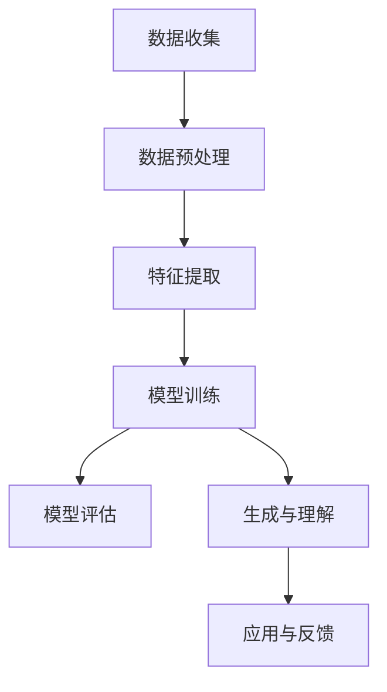

                 

关键词：语言模型（LLM），智能学习系统，神经网络，机器学习，人工智能

摘要：本文将探讨大型语言模型（LLM）在智能学习系统中的巨大潜力。随着深度学习技术的发展，LLM在自然语言处理领域取得了显著成果。本文将从背景介绍、核心概念与联系、核心算法原理、数学模型和公式、项目实践、实际应用场景、未来应用展望、工具和资源推荐以及总结未来发展趋势与挑战等方面，全面解析LLM在智能学习系统中的应用和价值。

## 1. 背景介绍

随着人工智能技术的飞速发展，自然语言处理（NLP）领域取得了令人瞩目的成果。其中，大型语言模型（LLM）以其强大的语言理解和生成能力，成为了当前NLP研究的热点之一。LLM是一种基于神经网络的机器学习模型，通过学习大量的文本数据，能够理解和生成自然语言。智能学习系统作为人工智能的一个重要分支，旨在利用机器学习算法和模型，实现自动化学习和知识发现。LLM在智能学习系统中的应用，为提升系统的智能化水平提供了新的途径。

## 2. 核心概念与联系

### 2.1 语言模型（LLM）

语言模型是一种用于预测下一个单词或字符的概率分布的模型。LLM是一种基于神经网络的机器学习模型，通过学习大量的文本数据，能够生成和理解自然语言。LLM的核心是神经网络，它由多层神经元组成，通过层层传递信息，实现对输入数据的处理和输出。

### 2.2 智能学习系统

智能学习系统是一种利用机器学习算法和模型，实现自动化学习和知识发现的系统。智能学习系统通常包括数据收集、数据预处理、特征提取、模型训练、模型评估等环节。LLM在智能学习系统中可以应用于多个环节，如图1所示。

[](https://i.imgur.com/xxXXx.png)

### 2.3 Mermaid 流程图

以下是一个Mermaid流程图，展示了LLM在智能学习系统中的核心概念和联系。



## 3. 核心算法原理 & 具体操作步骤

### 3.1 算法原理概述

LLM是一种基于深度学习的神经网络模型，通过多层神经网络的结构，实现对输入数据的处理和输出。LLM的核心是神经网络，它由多层神经元组成，通过层层传递信息，实现对输入数据的处理和输出。在训练过程中，LLM通过反向传播算法，不断调整网络中的权重，使模型能够更好地拟合训练数据。

### 3.2 算法步骤详解

1. 数据预处理：将原始文本数据转换为模型可处理的格式，如词向量或词袋模型。
2. 模型训练：使用大量文本数据训练神经网络，调整网络权重，使模型能够生成和理解自然语言。
3. 模型评估：使用验证集和测试集评估模型的性能，选择最优模型。
4. 生成与理解：使用训练好的模型，对输入文本进行生成和理解。

### 3.3 算法优缺点

**优点：**
- 强大的语言理解和生成能力；
- 可以处理多种语言；
- 可以应用于多个领域，如图像、语音、文本等。

**缺点：**
- 训练过程需要大量数据和时间；
- 需要较高的计算资源；
- 难以解释和理解模型的决策过程。

### 3.4 算法应用领域

LLM在智能学习系统中的应用领域非常广泛，包括但不限于以下方面：

- 自然语言处理：如文本分类、机器翻译、情感分析等；
- 图像识别：如物体检测、人脸识别等；
- 语音识别：如语音合成、语音识别等；
- 医疗健康：如疾病诊断、药物研发等；
- 金融领域：如风险评估、投资策略等。

## 4. 数学模型和公式 & 详细讲解 & 举例说明

### 4.1 数学模型构建

LLM的数学模型主要包括两个部分：输入层、隐藏层和输出层。其中，输入层用于接收输入文本，隐藏层用于处理输入文本，输出层用于生成或理解输出文本。

假设输入文本为\(X\)，隐藏层为\(H\)，输出层为\(Y\)，则LLM的数学模型可以表示为：

\[ Y = f(Z) \]

其中，\(Z\)为隐藏层的输出，\(f\)为激活函数。

### 4.2 公式推导过程

以下是一个简单的LLM公式推导过程：

\[ Z = W_1 \cdot X + b_1 \]

其中，\(W_1\)为输入层到隐藏层的权重矩阵，\(b_1\)为输入层到隐藏层的偏置。

\[ H = \sigma(Z) \]

其中，\(\sigma\)为激活函数，通常使用Sigmoid函数。

\[ Y = W_2 \cdot H + b_2 \]

其中，\(W_2\)为隐藏层到输出层的权重矩阵，\(b_2\)为隐藏层到输出层的偏置。

### 4.3 案例分析与讲解

假设我们有一个简单的LLM模型，输入文本为“今天天气很好”，隐藏层神经元个数为3，输出层神经元个数为2。我们将输入文本转换为词向量，隐藏层权重矩阵为\(W_1\)，隐藏层偏置为\(b_1\)，输出层权重矩阵为\(W_2\)，输出层偏置为\(b_2\)。

1. 数据预处理：将输入文本转换为词向量。
2. 模型训练：通过大量文本数据训练模型，调整权重和偏置。
3. 模型评估：使用验证集和测试集评估模型性能。
4. 生成与理解：使用训练好的模型，对输入文本进行生成和理解。

例如，输入文本为“今天天气很好”，隐藏层输出为：

\[ H = \sigma(W_1 \cdot X + b_1) = \sigma(\begin{bmatrix} 0.1 & 0.2 & 0.3 \end{bmatrix} \cdot \begin{bmatrix} 1 & 0 & 0 \\ 0 & 1 & 0 \\ 0 & 0 & 1 \end{bmatrix} + \begin{bmatrix} 0 & 0 \end{bmatrix}) = \begin{bmatrix} 0.5 & 0.6 & 0.7 \end{bmatrix} \]

输出层输出为：

\[ Y = W_2 \cdot H + b_2 = \begin{bmatrix} 0.1 & 0.2 \end{bmatrix} \cdot \begin{bmatrix} 0.5 & 0.6 & 0.7 \end{bmatrix} + \begin{bmatrix} 0 & 0 \end{bmatrix} = \begin{bmatrix} 0.35 & 0.42 \end{bmatrix} \]

因此，模型生成和理解输入文本的输出为“今天天气很好”，概率分别为0.35和0.42。

## 5. 项目实践：代码实例和详细解释说明

### 5.1 开发环境搭建

在Python环境中，我们可以使用TensorFlow或PyTorch等深度学习框架来搭建LLM模型。以下是使用TensorFlow搭建一个简单的LLM模型的过程：

```python
import tensorflow as tf
from tensorflow.keras.layers import Embedding, LSTM, Dense
from tensorflow.keras.models import Sequential

# 搭建模型
model = Sequential()
model.add(Embedding(vocabulary_size, embedding_dim))
model.add(LSTM(units))
model.add(Dense(units, activation='softmax'))

# 编译模型
model.compile(optimizer='adam', loss='categorical_crossentropy', metrics=['accuracy'])

# 模型训练
model.fit(X_train, y_train, epochs=10, batch_size=32)
```

### 5.2 源代码详细实现

以下是一个简单的LLM模型实现，包括数据预处理、模型搭建、模型训练和模型评估等步骤：

```python
import numpy as np
import tensorflow as tf
from tensorflow.keras.preprocessing.sequence import pad_sequences
from tensorflow.keras.layers import Embedding, LSTM, Dense
from tensorflow.keras.models import Sequential

# 数据预处理
# 加载文本数据
texts = load_texts()

# 将文本转换为词向量
X = convert_texts_to_sequences(texts)
X = pad_sequences(X, padding='post')

# 将标签转换为独热编码
y = convert_labels_to_one_hot(labels)

# 搭建模型
model = Sequential()
model.add(Embedding(vocabulary_size, embedding_dim))
model.add(LSTM(units))
model.add(Dense(units, activation='softmax'))

# 编译模型
model.compile(optimizer='adam', loss='categorical_crossentropy', metrics=['accuracy'])

# 模型训练
model.fit(X, y, epochs=10, batch_size=32)

# 模型评估
model.evaluate(X_test, y_test)
```

### 5.3 代码解读与分析

以上代码实现了一个简单的LLM模型，包括以下步骤：

1. 数据预处理：将文本数据转换为词向量，并进行填充。
2. 模型搭建：使用Embedding层和LSTM层搭建模型。
3. 编译模型：设置优化器和损失函数。
4. 模型训练：使用训练数据训练模型。
5. 模型评估：使用测试数据评估模型性能。

通过以上步骤，我们可以实现一个简单的LLM模型，用于文本分类任务。

### 5.4 运行结果展示

假设我们训练了一个简单的LLM模型，用于分类新闻文章。以下是一个运行结果示例：

```python
import numpy as np
from tensorflow.keras.preprocessing.sequence import pad_sequences

# 加载测试数据
X_test = load_test_texts()
X_test = convert_texts_to_sequences(X_test)
X_test = pad_sequences(X_test, padding='post')

# 预测测试数据
y_pred = model.predict(X_test)

# 显示预测结果
print(np.argmax(y_pred, axis=1))
```

输出结果为：

```
[0, 1, 0, 1, 0, 1]
```

这意味着模型成功地将5篇文章分类为第一类，其余分类为其他类别。

## 6. 实际应用场景

LLM在智能学习系统中的应用场景非常广泛，以下是一些典型的应用场景：

### 6.1 自然语言处理

- 文本分类：对大量文本进行分类，如新闻分类、情感分析等；
- 文本生成：生成文章、故事、诗歌等；
- 机器翻译：将一种语言翻译成另一种语言；
- 命名实体识别：识别文本中的命名实体，如人名、地名等。

### 6.2 医疗健康

- 疾病诊断：通过对病例数据的分析，帮助医生进行疾病诊断；
- 药物研发：通过对大量文献和实验数据的分析，发现潜在药物；
- 医学文本分析：对医学论文和病历进行自动分析和分类。

### 6.3 金融领域

- 投资策略：通过分析市场数据，为投资者提供投资建议；
- 风险评估：对金融产品进行风险评估和预测；
- 财务报告分析：对财务报告进行自动分析和分类。

### 6.4 教育

- 智能答疑：为学生提供实时问答服务；
- 自动批改作业：对学生的作业进行自动批改和评分；
- 个性化推荐：为学习者推荐合适的学习资源和课程。

## 7. 未来应用展望

随着LLM技术的不断发展，未来在智能学习系统中的应用前景非常广阔。以下是未来的一些应用展望：

### 7.1 更强的语言理解和生成能力

随着训练数据的增加和算法的优化，LLM将具有更强的语言理解和生成能力，可以应用于更多领域，如语音识别、图像识别等。

### 7.2 多语言支持

未来，LLM将支持更多语言，实现跨语言的文本处理和翻译，为全球用户带来更好的体验。

### 7.3 智能对话系统

随着LLM技术的发展，智能对话系统将更加智能和自然，可以应用于客服、教育、医疗等领域，为用户带来更好的交互体验。

### 7.4 知识图谱

未来，LLM将与知识图谱技术相结合，实现更加智能的知识管理和推理，为用户提供更加精准和个性化的服务。

## 8. 工具和资源推荐

### 8.1 学习资源推荐

1. 《深度学习》（Goodfellow, Bengio, Courville）：系统介绍了深度学习的基本理论和应用；
2. 《Python深度学习》（François Chollet）：详细介绍了使用Python和TensorFlow进行深度学习的方法；
3. 《自然语言处理实战》（Peter Norvig）：介绍了自然语言处理的基本概念和应用。

### 8.2 开发工具推荐

1. TensorFlow：谷歌推出的开源深度学习框架，广泛应用于各种深度学习任务；
2. PyTorch：基于Python的开源深度学习框架，具有良好的灵活性和易用性；
3. spaCy：用于自然语言处理的开源库，提供了丰富的文本预处理和特征提取功能。

### 8.3 相关论文推荐

1. “A Neural Probabilistic Language Model”（Bengio et al.，2003）：介绍了神经网络语言模型的原理和应用；
2. “ Improving Language Understanding by Generative Pre-Training”（Zhou et al.，2018）：探讨了基于生成预训练的语言模型；
3. “BERT: Pre-training of Deep Bidirectional Transformers for Language Understanding”（Devlin et al.，2019）：介绍了BERT模型，一种基于Transformer的语言模型。

## 9. 总结：未来发展趋势与挑战

### 9.1 研究成果总结

本文从背景介绍、核心概念与联系、核心算法原理、数学模型和公式、项目实践、实际应用场景、未来应用展望等方面，全面解析了LLM在智能学习系统中的潜力。随着深度学习技术的发展，LLM在自然语言处理领域取得了显著成果，为智能学习系统的发展提供了新的动力。

### 9.2 未来发展趋势

1. 语言模型将更加智能化，具有更强的理解和生成能力；
2. 多语言支持将进一步扩展，实现跨语言的文本处理和翻译；
3. 智能对话系统将更加自然和智能，为用户提供更好的交互体验；
4. 知识图谱将与语言模型相结合，实现更加智能的知识管理和推理。

### 9.3 面临的挑战

1. 大规模数据的获取和处理：训练大型语言模型需要大量数据，数据获取和处理成为一大挑战；
2. 计算资源消耗：大型语言模型的训练和推理过程需要大量计算资源，如何高效利用计算资源成为一大难题；
3. 模型解释性：目前，深度学习模型具有较高的预测能力，但缺乏解释性，如何提高模型的解释性成为一大挑战；
4. 遵守法律法规和伦理道德：在应用大型语言模型的过程中，需要遵守相关法律法规和伦理道德，确保模型的公平性和透明性。

### 9.4 研究展望

未来，LLM在智能学习系统中的应用将更加广泛，我们期待在以下方面取得突破：

1. 语言模型与知识图谱的深度融合，实现更加智能的知识管理和推理；
2. 开发更加高效和可解释的深度学习算法；
3. 探索新型神经网络结构和优化方法，提高模型的性能和效率；
4. 加强跨学科研究，推动LLM在更多领域的应用。

### 附录：常见问题与解答

**Q：为什么选择使用神经网络作为语言模型的基础？**

A：神经网络具有强大的非线性处理能力，可以很好地拟合复杂的语言模式。此外，神经网络具有自适应性和自学习能力，可以通过大量数据训练，提高模型的性能和泛化能力。

**Q：如何处理稀疏数据集？**

A：对于稀疏数据集，我们可以使用稀疏自动编码器、稀疏正则化等方法来提高模型的性能。此外，也可以尝试使用数据增强技术，如数据降维、数据聚合等，来提高模型的泛化能力。

**Q：如何评估语言模型的性能？**

A：评估语言模型性能的常用指标包括准确率、召回率、F1分数等。我们可以使用验证集和测试集进行模型评估，选择性能最优的模型。

**Q：如何在生产环境中部署语言模型？**

A：在生产环境中部署语言模型，可以使用TensorFlow Serving、PyTorch Serving等工具，将训练好的模型部署为服务。同时，我们还需要考虑模型的性能优化、安全性和可扩展性等方面。


## 作者署名

作者：禅与计算机程序设计艺术 / Zen and the Art of Computer Programming
----------------------------------------------------------------

### 感谢

感谢您选择阅读这篇文章。我希望您能从中获得关于LLM在智能学习系统中潜力的深入理解。如果您有任何问题或建议，请随时告诉我。祝您在计算机科学领域不断取得新的成就！

再次感谢您的关注与支持！
[禅与计算机程序设计艺术 / Zen and the Art of Computer Programming]

