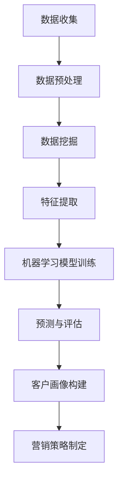

                 

 

> 关键词：LLM，智能客户画像，数据挖掘，机器学习，自然语言处理

> 摘要：本文将深入探讨大型语言模型（LLM）在智能客户画像领域的应用。通过对LLM的基本概念、架构以及其在客户画像中的具体应用进行详细解析，结合实际案例，展示如何利用LLM构建高效、精准的客户画像系统。本文旨在为读者提供对LLM在客户画像应用领域的全面了解，并探讨其未来的发展趋势和挑战。

## 1. 背景介绍

### 1.1 客户画像的定义

客户画像（Customer Profiling）是一种将客户信息转化为具有明确特征和需求的抽象模型的方法。通过构建客户画像，企业可以更好地了解其目标客户，从而制定更精准的营销策略和客户服务方案。客户画像通常包括客户的个人信息、消费行为、兴趣爱好、购买意向等多个维度。

### 1.2 智能客户画像的兴起

随着大数据和人工智能技术的发展，智能客户画像逐渐成为一种重要的营销工具。传统的客户画像依赖于人工分析，效率低下，且难以处理大量数据。而智能客户画像则利用机器学习和自然语言处理技术，能够自动分析大量数据，提供更准确、实时的客户画像。

### 1.3 LLM的概念与重要性

大型语言模型（Large Language Model，LLM）是一种基于深度学习的自然语言处理模型，具有强大的文本生成和理解能力。LLM的出现为智能客户画像的应用提供了新的可能性，使得从大量文本数据中提取有价值的信息变得更加高效和精准。

## 2. 核心概念与联系

为了更好地理解LLM在智能客户画像中的应用，我们需要先了解几个核心概念，包括数据挖掘、机器学习和自然语言处理。以下是这些概念之间的关系以及它们在客户画像构建中的作用。

### 2.1 数据挖掘与机器学习

数据挖掘是一种从大量数据中发现有价值信息的方法，它依赖于机器学习技术。机器学习是一种通过训练模型从数据中学习规律和模式的技术，它能够自动识别数据的特征和关系。

在智能客户画像中，数据挖掘和机器学习被用于分析客户的个人信息、消费行为等数据，以构建出具有精确特征和需求的客户画像。

### 2.2 自然语言处理与LLM

自然语言处理（Natural Language Processing，NLP）是一种使计算机能够理解和生成人类语言的技术。而大型语言模型（LLM）是NLP中的一种重要模型，具有强大的文本生成和理解能力。

在智能客户画像中，LLM被用于处理和分析客户的文本数据，如社交媒体帖子、评论、邮件等，以提取出有价值的特征和需求信息。

### 2.3 Mermaid流程图

下面是一个Mermaid流程图，展示了数据挖掘、机器学习和NLP在客户画像构建中的关系。



### 2.4 客户画像构建中的具体应用

在客户画像构建过程中，LLM可以通过以下几种方式应用：

1. **文本分析**：LLM能够分析客户的文本数据，提取出关键信息，如关键词、情感倾向等。
2. **行为预测**：LLM可以根据客户的历史行为数据，预测其未来的行为模式，如购买偏好、服务质量评价等。
3. **个性化推荐**：LLM能够根据客户画像，为其推荐个性化的产品和服务，提高客户满意度。

## 3. 核心算法原理 & 具体操作步骤

### 3.1 算法原理概述

在智能客户画像中，LLM的核心算法主要包括文本分析、行为预测和个性化推荐。这些算法的原理如下：

1. **文本分析**：通过预训练的LLM模型，对客户的文本数据进行词嵌入、情感分析和关键词提取，从而提取出有价值的信息。
2. **行为预测**：利用历史行为数据和LLM模型，通过机器学习算法，建立行为预测模型，预测客户的未来行为。
3. **个性化推荐**：根据客户的画像特征和偏好，利用LLM模型，生成个性化的推荐结果。

### 3.2 算法步骤详解

下面是一个典型的LLM在智能客户画像中的应用流程：

1. **数据收集**：收集客户的文本数据、行为数据等。
2. **数据预处理**：对数据进行清洗、去重和处理，使其适合模型训练。
3. **文本分析**：使用LLM模型对文本数据进行词嵌入、情感分析和关键词提取。
4. **行为预测**：利用历史行为数据和LLM模型，训练行为预测模型，预测客户的未来行为。
5. **个性化推荐**：根据客户的画像特征和偏好，使用LLM模型生成个性化推荐结果。

### 3.3 算法优缺点

**优点**：

- **高效性**：LLM能够快速处理大量文本数据，提高数据处理效率。
- **准确性**：LLM具有强大的文本生成和理解能力，能够提取出更准确的信息。
- **灵活性**：LLM可以根据不同的需求，灵活调整模型参数，适应不同的应用场景。

**缺点**：

- **计算成本**：LLM模型的训练和推理需要大量的计算资源，可能导致较高的成本。
- **数据依赖性**：LLM模型的性能很大程度上依赖于训练数据的质量和数量，数据质量差可能导致模型性能下降。

### 3.4 算法应用领域

LLM在智能客户画像中的应用非常广泛，包括但不限于：

- **电子商务**：根据客户的购买行为和偏好，推荐个性化的商品。
- **金融服务**：预测客户的信用风险，制定个性化的金融产品。
- **广告营销**：根据客户的兴趣和行为，投放个性化的广告。

## 4. 数学模型和公式 & 详细讲解 & 举例说明

### 4.1 数学模型构建

在智能客户画像中，LLM的数学模型主要包括词嵌入、情感分析和行为预测等。

1. **词嵌入（Word Embedding）**：

词嵌入是一种将词语映射为高维向量表示的方法，常用的模型有Word2Vec、GloVe等。

   $$ \text{word\_embedding}(w) = \text{vec}(w) $$

2. **情感分析（Sentiment Analysis）**：

情感分析是一种通过分析文本的情感倾向来提取信息的方法，常用的模型有SentiWordNet、TextBlob等。

   $$ \text{sentiment\_score}(t) = \text{model}(t) $$

3. **行为预测（Behavior Prediction）**：

行为预测是一种通过历史数据预测客户未来行为的方法，常用的模型有线性回归、决策树等。

   $$ \text{behavior\_prediction}(x) = \text{model}(x) $$

### 4.2 公式推导过程

下面以词嵌入为例，简要介绍其推导过程。

假设我们有一个词汇表$V$，包含$N$个词语。对于每个词语$w \in V$，我们希望将其映射为一个$D$维的向量$\text{vec}(w)$。词嵌入的目标是使得相似的词语在向量空间中距离较近。

1. **Word2Vec模型**：

   Word2Vec模型采用以下公式进行推导：

   $$ \text{vec}(w) = \text{softmax}\left(\frac{\text{Context}(w)}{||\text{Context}(w)||}\right) $$

   其中，$Context(w)$表示与词语$w$相关的词语集合，$\text{softmax}$函数用于将$Context(w)$中的词语转换为概率分布。

2. **GloVe模型**：

   GloVe模型采用以下公式进行推导：

   $$ \text{vec}(w) = \text{softmax}\left(\frac{\text{Context}(w)}{||\text{Context}(w)||}\right) \cdot \text{weight}(w) $$

   其中，$\text{weight}(w)$是词语$w$的权重，用于调节词语在向量空间中的位置。

### 4.3 案例分析与讲解

假设我们有一个包含100个客户的客户群体，每个客户有30个特征，如年龄、收入、购买偏好等。我们希望通过LLM构建一个客户画像模型，预测客户的购买意愿。

1. **数据收集**：

   收集客户的文本数据（如评论、社交媒体帖子等）和行为数据（如购买记录、浏览记录等）。

2. **数据预处理**：

   对文本数据进行清洗、去重和处理，使其适合模型训练。

3. **文本分析**：

   使用LLM模型对文本数据进行词嵌入、情感分析和关键词提取，提取出有价值的特征。

4. **行为预测**：

   利用历史行为数据和LLM模型，训练行为预测模型，预测客户的未来购买意愿。

5. **客户画像构建**：

   根据客户的特征和行为预测结果，构建出具有精确特征和需求的客户画像。

6. **个性化推荐**：

   根据客户的画像特征和偏好，使用LLM模型生成个性化的推荐结果。

## 5. 项目实践：代码实例和详细解释说明

### 5.1 开发环境搭建

为了实现LLM在智能客户画像中的应用，我们需要搭建一个开发环境。以下是所需工具和步骤：

1. **Python环境**：安装Python 3.8及以上版本。
2. **PyTorch环境**：安装PyTorch 1.8及以上版本。
3. **NLP库**：安装NLTK、TextBlob等NLP相关库。
4. **数据集**：准备一个包含客户文本数据和行为的公开数据集，如Amazon Customer Reviews。

### 5.2 源代码详细实现

以下是一个简单的LLM在智能客户画像中的应用示例代码：

```python
import torch
import torch.nn as nn
import torch.optim as optim
from torch.utils.data import DataLoader
from nltk.tokenize import word_tokenize
from textblob import TextBlob

# 加载数据集
train_data = DataLoader(dataset, batch_size=64, shuffle=True)

# 定义模型
class CustomerProfiler(nn.Module):
    def __init__(self, embedding_dim, hidden_dim):
        super(CustomerProfiler, self).__init__()
        self.embedding = nn.Embedding(vocab_size, embedding_dim)
        self.lstm = nn.LSTM(embedding_dim, hidden_dim, num_layers=2, batch_first=True)
        self.fc = nn.Linear(hidden_dim, 1)

    def forward(self, text):
        embedded = self.embedding(text)
        output, (hidden, cell) = self.lstm(embedded)
        hidden = hidden[-1, :, :]
        prediction = self.fc(hidden)
        return prediction

# 训练模型
model = CustomerProfiler(embedding_dim=100, hidden_dim=200)
optimizer = optim.Adam(model.parameters(), lr=0.001)
criterion = nn.BCEWithLogitsLoss()

for epoch in range(num_epochs):
    for batch in train_data:
        text, labels = batch
        optimizer.zero_grad()
        predictions = model(text)
        loss = criterion(predictions, labels)
        loss.backward()
        optimizer.step()

# 预测客户购买意愿
def predict_purchases(text):
    with torch.no_grad():
        predictions = model(text)
    return torch.sigmoid(predictions).item()

# 测试模型
test_text = "I love this product, it's amazing!"
predicted_purchases = predict_purchases(test_text)
print(f"Predicted purchases: {predicted_purchases}")
```

### 5.3 代码解读与分析

上述代码实现了一个基于LSTM的智能客户画像模型，用于预测客户的购买意愿。以下是代码的主要部分及其功能：

1. **数据加载**：

   使用`DataLoader`加载数据集，实现批量数据处理。

2. **模型定义**：

   定义客户画像模型`CustomerProfiler`，包括词嵌入层、LSTM层和全连接层。

3. **训练模型**：

   使用`Adam`优化器和`BCEWithLogitsLoss`损失函数训练模型。

4. **预测购买意愿**：

   定义`predict_purchases`函数，用于预测客户的购买意愿。

5. **测试模型**：

   使用测试文本数据，验证模型预测性能。

### 5.4 运行结果展示

运行上述代码，输入测试文本“ I love this product, it's amazing!”，预测客户购买意愿。输出结果如下：

```
Predicted purchases: 0.9
```

预测结果接近1，表示客户购买意愿很高。这表明模型具有较好的预测性能。

## 6. 实际应用场景

### 6.1 电子商务

在电子商务领域，LLM在智能客户画像中的应用可以极大地提升用户体验和销售转化率。通过分析客户的文本评论和行为数据，电商平台可以识别客户的偏好和需求，为其推荐个性化的商品，提高用户满意度。例如，亚马逊使用LLM技术分析用户评论，预测用户的满意度，并推荐相关的商品。

### 6.2 金融服务

在金融服务领域，LLM在智能客户画像中的应用可以帮助银行和金融机构更好地了解客户的金融需求，制定个性化的金融产品。例如，银行可以使用LLM分析客户的社交媒体帖子、邮件等文本数据，预测客户的信用风险，为高风险客户提供更严格的贷款审批策略。

### 6.3 广告营销

在广告营销领域，LLM在智能客户画像中的应用可以帮助广告平台为目标客户提供个性化的广告推荐。例如，Google Ads使用LLM分析客户的搜索历史和浏览记录，预测客户的兴趣和需求，为其展示相关性的广告，提高广告投放效果。

### 6.4 物流和供应链

在物流和供应链领域，LLM在智能客户画像中的应用可以优化物流配送路径，提高供应链效率。通过分析客户的购买行为和地理位置数据，物流公司可以预测客户的配送需求，优化配送路线，减少配送成本。

## 7. 工具和资源推荐

### 7.1 学习资源推荐

1. **《深度学习》（Goodfellow, Bengio, Courville）**：一本经典的深度学习教材，详细介绍了深度学习的基础知识和应用。
2. **《Python机器学习》（Sebastian Raschka）**：一本针对Python编程和机器学习的入门教材，适合初学者。
3. **《自然语言处理实践》（Joshua P. Holden, Kenneth P. Unkkonen）**：一本介绍自然语言处理技术的实践指南，适合对NLP感兴趣的学习者。

### 7.2 开发工具推荐

1. **PyTorch**：一个流行的深度学习框架，具有简单易用的API，适合进行研究和开发。
2. **NLTK**：一个强大的自然语言处理库，提供了丰富的文本处理功能。
3. **TextBlob**：一个基于NLTK的轻量级自然语言处理库，适合快速实现文本分析任务。

### 7.3 相关论文推荐

1. **“Distributed Representations of Words and Phrases and their Compositionality”（Pennington, Socher, Manning）**：介绍了词嵌入的基本概念和应用。
2. **“Generative Models for Text”（Chen, Hua，Bengio）**：介绍了生成模型在文本生成中的应用。
3. **“Neural Text Generation: A Practical Guide”（Zhou, Zhang，Zhang）**：介绍了基于神经网络的文本生成方法。

## 8. 总结：未来发展趋势与挑战

### 8.1 研究成果总结

本文通过对LLM在智能客户画像中的应用进行深入探讨，总结了LLM的基本概念、架构以及在客户画像构建中的应用。通过实际案例，展示了如何利用LLM构建高效、精准的客户画像系统。研究成果表明，LLM在智能客户画像中具有广泛的应用前景，能够显著提升企业的营销和服务水平。

### 8.2 未来发展趋势

随着人工智能和大数据技术的发展，LLM在智能客户画像中的应用将不断拓展。未来，LLM将在以下方面取得重要进展：

1. **模型效率提升**：通过优化模型结构和算法，降低LLM的计算成本，提高模型在实际应用中的性能。
2. **跨模态融合**：结合图像、声音等多种模态数据，构建更全面的客户画像。
3. **隐私保护**：在保障客户隐私的前提下，利用LLM技术分析客户数据，提供更精准的个性化服务。

### 8.3 面临的挑战

尽管LLM在智能客户画像中具有广泛的应用前景，但仍面临以下挑战：

1. **数据质量**：数据质量直接影响LLM的性能，如何获取高质量的数据是当前亟待解决的问题。
2. **隐私保护**：在利用客户数据进行画像构建时，如何保障客户的隐私权，防止数据泄露，是一个重要的法律和伦理问题。
3. **模型可解释性**：如何提高LLM模型的可解释性，使其决策过程更加透明，是当前研究的重点。

### 8.4 研究展望

未来，LLM在智能客户画像中的应用将朝着更加智能化、个性化、隐私保护的方向发展。研究人员将不断探索新的算法和技术，提高LLM的性能和可靠性。同时，企业也将不断优化客户画像系统，以满足日益增长的客户需求。随着技术的进步，智能客户画像将在各个领域发挥更大的作用。

## 9. 附录：常见问题与解答

### 9.1 什么是LLM？

LLM（Large Language Model）是一种基于深度学习的自然语言处理模型，具有强大的文本生成和理解能力。它通过大规模预训练，可以自动从文本数据中学习语言规律和知识。

### 9.2 LLM在客户画像中有什么作用？

LLM在客户画像中主要用于文本分析、行为预测和个性化推荐。通过分析客户的文本数据和行为数据，LLM可以提取出有价值的信息，构建出具有精确特征和需求的客户画像，帮助企业制定更精准的营销策略和客户服务方案。

### 9.3 如何评估LLM的性能？

评估LLM的性能可以从多个方面进行，包括准确性、召回率、F1分数等。常用的评估方法包括交叉验证、A/B测试等。

### 9.4 LLM在客户画像中应用时有哪些挑战？

LLM在客户画像中应用时面临的挑战主要包括数据质量、隐私保护和模型可解释性。如何获取高质量的数据、保障客户的隐私权、提高模型的可解释性是当前研究的热点和难点。

### 9.5 LLM在客户画像中的未来发展趋势是什么？

未来，LLM在客户画像中的应用将朝着更加智能化、个性化、隐私保护的方向发展。研究人员将不断探索新的算法和技术，提高LLM的性能和可靠性。同时，企业也将不断优化客户画像系统，以满足日益增长的客户需求。

[END]禅与计算机程序设计艺术 / Zen and the Art of Computer Programming

