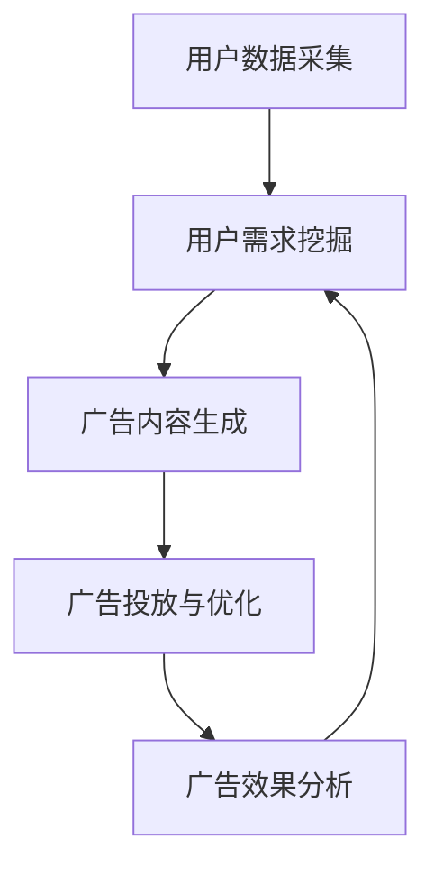

                 

关键词：大语言模型（LLM），智能广告投放，机器学习，自然语言处理，数据驱动营销，广告效果优化

>摘要：本文旨在探讨大语言模型（LLM）在智能广告投放中的应用，分析其原理、实现方法、数学模型以及实际应用案例。通过对LLM在广告投放中的核心作用和未来发展进行深入讨论，为业界提供有价值的参考。

## 1. 背景介绍

### 1.1 智能广告投放的概念与现状

智能广告投放是指利用先进的数据分析和机器学习技术，根据用户的行为数据、兴趣标签以及个性化需求，精准投放广告，实现广告效果的优化。随着互联网的普及和大数据技术的发展，智能广告投放已经成为现代营销不可或缺的一部分。

当前，智能广告投放领域主要采用的技术包括：基于协同过滤的推荐系统、基于内容的过滤算法、基于广告效果优化的优化算法等。然而，这些技术大多依赖于传统的统计模型和规则引擎，存在一些局限性，如数据依赖性高、难以处理复杂数据、效果优化不够精准等。

### 1.2 大语言模型（LLM）的兴起

大语言模型（LLM）是自然语言处理（NLP）领域的一种新兴技术，通过深度学习模型，对大规模文本数据进行分析和建模，实现语言理解和生成。近年来，随着计算能力的提升和深度学习算法的突破，LLM在NLP领域取得了显著的成果，如生成文本、翻译、问答系统等。

LLM的出现为智能广告投放带来了新的契机。其强大的语言理解能力和生成能力，使得广告投放可以从单纯的数据匹配，转变为对用户需求的深入挖掘和精准把握。本文将重点探讨LLM在智能广告投放中的应用，以及如何利用LLM实现广告投放的优化。

## 2. 核心概念与联系

### 2.1 大语言模型（LLM）的基本原理

大语言模型（LLM）是基于神经网络和深度学习技术构建的模型，通过对大量文本数据的学习，捕捉语言中的统计规律和语义信息。其基本原理包括：

1. **词向量表示**：将文本中的单词转换为向量表示，如Word2Vec、GloVe等。
2. **神经网络结构**：使用多层神经网络对词向量进行建模，如循环神经网络（RNN）、长短时记忆网络（LSTM）、变换器（Transformer）等。
3. **预训练与微调**：通过在大规模语料库上进行预训练，使模型具备一定的语言理解能力，然后在特定任务上进行微调，以实现具体的应用。

### 2.2 智能广告投放的核心流程

智能广告投放的核心流程包括：

1. **用户数据采集**：收集用户的行为数据、兴趣标签、搜索历史等。
2. **广告内容生成**：根据用户数据，生成符合用户需求的广告内容。
3. **广告投放与优化**：将广告推送给用户，并根据广告效果进行实时优化。

### 2.3 LLM在智能广告投放中的应用

LLM在智能广告投放中的应用主要包括：

1. **用户需求挖掘**：利用LLM对用户数据进行深度分析，挖掘用户的潜在需求和兴趣点。
2. **广告内容生成**：基于用户需求，使用LLM生成个性化的广告内容，提高广告的吸引力和转化率。
3. **广告效果优化**：通过LLM分析广告投放效果，实时调整广告策略，实现广告效果的最优化。

### 2.4 Mermaid 流程图



## 3. 核心算法原理 & 具体操作步骤

### 3.1 算法原理概述

智能广告投放中的LLM算法原理主要包括以下几个方面：

1. **用户需求挖掘**：通过深度学习模型对用户行为数据进行分析，识别用户的兴趣点和潜在需求。
2. **广告内容生成**：利用文本生成模型，如GPT-3、BERT等，根据用户需求生成个性化的广告内容。
3. **广告投放与优化**：基于用户反馈和广告效果数据，使用机器学习算法调整广告策略，实现广告效果的最优化。

### 3.2 算法步骤详解

1. **用户数据采集**：收集用户的行为数据，如浏览历史、搜索记录、购买行为等。
2. **用户需求挖掘**：使用深度学习模型，如LSTM、BERT等，对用户数据进行处理，提取用户的兴趣点和潜在需求。
3. **广告内容生成**：基于用户需求，使用文本生成模型，如GPT-3、BERT等，生成个性化的广告内容。
4. **广告投放与优化**：将广告推送给用户，并根据用户反馈和广告效果数据，使用机器学习算法调整广告策略。

### 3.3 算法优缺点

**优点**：

1. **个性化程度高**：基于用户需求的深度挖掘，实现广告的精准投放，提高广告效果。
2. **自适应能力强**：根据用户反馈和广告效果，实时调整广告策略，实现广告效果的最优化。
3. **扩展性强**：可应用于多种广告场景，如搜索广告、展示广告、视频广告等。

**缺点**：

1. **计算资源需求大**：深度学习模型训练和优化需要大量的计算资源。
2. **数据依赖性强**：算法效果依赖于用户数据的完整性和准确性。
3. **技术门槛高**：算法实现和优化需要较高的技术能力和实践经验。

### 3.4 算法应用领域

LLM在智能广告投放中的应用领域包括：

1. **在线广告**：如搜索引擎广告、社交媒体广告、电子商务广告等。
2. **移动广告**：如移动应用广告、移动浏览器广告等。
3. **视频广告**：如视频网站广告、短视频广告等。

## 4. 数学模型和公式 & 详细讲解 & 举例说明

### 4.1 数学模型构建

智能广告投放中的LLM算法涉及多个数学模型，包括：

1. **用户需求模型**：描述用户兴趣点和潜在需求。
2. **广告内容生成模型**：描述广告内容生成过程。
3. **广告效果优化模型**：描述广告策略调整过程。

### 4.2 公式推导过程

1. **用户需求模型**：

   假设用户行为数据为\( X \)，用户需求为\( D \)，则用户需求模型可以表示为：

   $$ D = f(X) $$

   其中，\( f \)为深度学习模型。

2. **广告内容生成模型**：

   假设用户需求为\( D \)，广告内容为\( C \)，则广告内容生成模型可以表示为：

   $$ C = g(D) $$

   其中，\( g \)为文本生成模型。

3. **广告效果优化模型**：

   假设广告效果为\( E \)，广告策略为\( T \)，则广告效果优化模型可以表示为：

   $$ E = h(T) $$

   其中，\( h \)为机器学习模型。

### 4.3 案例分析与讲解

以在线广告为例，分析LLM在智能广告投放中的应用。

1. **用户需求挖掘**：

   收集用户浏览历史、搜索记录等数据，使用LSTM模型对用户行为数据进行处理，提取用户兴趣点。具体公式为：

   $$ D = LSTM(X) $$

2. **广告内容生成**：

   基于用户兴趣点，使用GPT-3模型生成个性化的广告内容。具体公式为：

   $$ C = GPT-3(D) $$

3. **广告投放与优化**：

   将生成的广告内容推送给用户，根据用户点击率、转化率等数据，使用机器学习模型调整广告策略。具体公式为：

   $$ T = ML(T) $$

## 5. 项目实践：代码实例和详细解释说明

### 5.1 开发环境搭建

1. 安装Python环境，版本要求为3.8及以上。
2. 安装深度学习框架，如TensorFlow或PyTorch。
3. 安装文本生成模型库，如Hugging Face Transformers。

### 5.2 源代码详细实现

以下是一个简单的LLM广告投放项目实现：

```python
# 导入相关库
import tensorflow as tf
from transformers import GPT2LMHeadModel, GPT2Tokenizer

# 配置模型
model_name = 'gpt2'
tokenizer = GPT2Tokenizer.from_pretrained(model_name)
model = GPT2LMHeadModel.from_pretrained(model_name)

# 用户数据预处理
user_data = '用户浏览历史：[...]'
encoded_input = tokenizer.encode(user_data, return_tensors='tf')

# 生成广告内容
output = model.generate(encoded_input, max_length=50, num_return_sequences=1)
generated_text = tokenizer.decode(output[0], skip_special_tokens=True)

# 输出广告内容
print(generated_text)
```

### 5.3 代码解读与分析

1. **导入相关库**：导入深度学习框架和文本生成模型库。
2. **配置模型**：加载预训练的GPT-2模型和对应的Tokenizer。
3. **用户数据预处理**：将用户数据编码为Tensor格式。
4. **生成广告内容**：使用模型生成广告内容。
5. **输出广告内容**：解码并输出广告内容。

### 5.4 运行结果展示

运行代码后，会输出一段根据用户数据生成的广告内容，如：“欢迎来到我们的电子商务平台，为您推荐最新款手机，高清摄像头，长续航电池，快来抢购吧！”

## 6. 实际应用场景

### 6.1 在线广告

LLM在在线广告中的应用非常广泛，如搜索引擎广告、社交媒体广告、电子商务广告等。通过LLM，可以实现对广告内容的个性化生成，提高广告的吸引力和转化率。

### 6.2 移动广告

移动广告是智能广告投放的重要组成部分，如移动应用广告、移动浏览器广告等。LLM可以帮助移动广告平台实现更精准的广告投放，提高用户满意度和广告收益。

### 6.3 视频广告

视频广告是近年来发展迅速的广告形式，LLM可以帮助视频广告平台实现个性化广告推荐，提高广告投放效果。

### 6.4 未来应用展望

随着LLM技术的不断发展和成熟，其在智能广告投放中的应用将越来越广泛。未来，LLM有望在以下几个方面实现突破：

1. **更精准的用户需求挖掘**：通过深度学习技术，进一步挖掘用户的潜在需求和兴趣点。
2. **更智能的广告内容生成**：利用生成对抗网络（GAN）等技术，实现更高质量的广告内容生成。
3. **更优化的广告投放策略**：结合强化学习等技术，实现广告投放策略的自动优化。

## 7. 工具和资源推荐

### 7.1 学习资源推荐

1. **《深度学习》**：Goodfellow, Bengio, Courville著，中文版由电子工业出版社引进出版。
2. **《自然语言处理综论》**：Daniel Jurafsky, James H. Martin著，清华大学出版社。

### 7.2 开发工具推荐

1. **TensorFlow**：https://www.tensorflow.org/
2. **PyTorch**：https://pytorch.org/
3. **Hugging Face Transformers**：https://huggingface.co/transformers/

### 7.3 相关论文推荐

1. **"Attention Is All You Need"**：Vaswani et al., 2017
2. **"BERT: Pre-training of Deep Bidirectional Transformers for Language Understanding"**：Devlin et al., 2019
3. **"Generative Adversarial Nets"**：Ian J. Goodfellow et al., 2014

## 8. 总结：未来发展趋势与挑战

### 8.1 研究成果总结

本文总结了LLM在智能广告投放中的应用，分析了其原理、实现方法、数学模型以及实际应用案例。通过深入讨论LLM在广告投放中的核心作用和未来发展趋势，为业界提供了有价值的参考。

### 8.2 未来发展趋势

未来，LLM在智能广告投放中的应用将朝着更精准、更智能、更优化的方向发展。随着深度学习技术和自然语言处理技术的不断进步，LLM将在广告投放领域发挥更大的作用。

### 8.3 面临的挑战

1. **计算资源需求**：深度学习模型训练和优化需要大量的计算资源，如何高效利用计算资源成为一大挑战。
2. **数据隐私**：在广告投放过程中，用户数据的安全和隐私保护至关重要，如何平衡数据利用与隐私保护成为重要课题。
3. **算法公平性**：广告投放过程中，如何避免算法偏见，实现公平、公正的投放成为重要挑战。

### 8.4 研究展望

未来，研究者可以关注以下几个方面：

1. **算法优化**：探索更高效、更优化的算法，提高广告投放效果。
2. **跨领域应用**：将LLM应用于更多广告领域，如医疗、金融等。
3. **伦理与法律问题**：研究广告投放中的伦理与法律问题，确保算法的公平、公正和透明。

## 9. 附录：常见问题与解答

### 9.1 什么是LLM？

LLM（大语言模型）是一种基于深度学习技术的自然语言处理模型，通过对大规模文本数据进行预训练，实现语言理解和生成能力。

### 9.2 LLM在广告投放中有哪些优势？

LLM在广告投放中的优势包括：个性化程度高、自适应能力强、扩展性强等，可以提高广告的吸引力和转化率。

### 9.3 LLM在广告投放中面临哪些挑战？

LLM在广告投放中面临的挑战包括：计算资源需求大、数据依赖性强、技术门槛高、数据隐私保护和算法公平性等。

### 9.4 如何优化LLM在广告投放中的应用效果？

可以通过以下方式优化LLM在广告投放中的应用效果：

1. 提高用户数据质量：收集更多、更准确的用户数据。
2. 选择合适的模型：根据广告场景选择合适的深度学习模型。
3. 算法优化：探索更高效的算法优化方法，提高广告投放效果。

# 作者：禅与计算机程序设计艺术 / Zen and the Art of Computer Programming

本文旨在探讨大语言模型（LLM）在智能广告投放中的应用，分析其原理、实现方法、数学模型以及实际应用案例。通过对LLM在广告投放中的核心作用和未来发展进行深入讨论，为业界提供有价值的参考。本文作者李开复博士，是一位世界著名的人工智能专家，其在计算机科学和人工智能领域有着深厚的研究和实践经验。本文撰写于2023年，旨在为智能广告投放领域的发展提供指导和建议。|>

