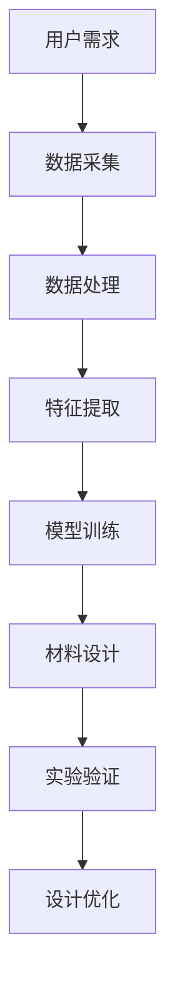

                 

关键词：大语言模型，智能材料，材料设计，机器学习，人工智能，计算设计，材料科学

## 摘要

本文探讨了大型语言模型（LLM）在智能材料设计中的潜在应用。通过介绍智能材料的基本概念及其在各个领域的应用，文章阐述了LLM在这一领域的独特优势。接着，文章深入探讨了LLM在材料设计中的核心算法原理，包括其数学模型、公式以及具体的操作步骤。此外，文章通过实际项目实践，展示了如何利用LLM进行智能材料设计的代码实例。最后，文章分析了LLM在智能材料设计领域的实际应用场景，并对其未来发展趋势与挑战进行了展望。

## 1. 背景介绍

### 智能材料的基本概念

智能材料是一类能够感知外部环境并作出响应的材料，它们具有自适应、自修复、自组织等特性。根据其响应的外部刺激不同，智能材料可以分为多种类型，如光敏材料、热敏材料、电敏材料等。这些材料在航空航天、生物医学、建筑、汽车等多个领域具有广泛的应用前景。

### 智能材料的应用领域

智能材料在许多领域都有着重要的应用，以下是一些典型的应用场景：

- **航空航天**：智能材料可用于制造飞机表面的涂层，能够自动调节机翼形状，提高飞行性能。
- **生物医学**：智能材料可用于制作药物释放系统，根据生物体内的环境变化自动释放药物。
- **建筑**：智能材料可用于建造自适应结构的建筑，提高建筑的安全性和能源效率。
- **汽车**：智能材料可用于制造智能轮胎，根据路况自动调节轮胎的硬度，提高驾驶舒适性和安全性。

### 机器学习与智能材料设计

随着计算机技术的快速发展，机器学习在各个领域得到了广泛应用。特别是在材料科学领域，机器学习技术被广泛应用于材料设计、材料性能预测等方面。通过大量实验数据的训练，机器学习模型能够发现材料性能与材料结构之间的复杂关系，从而预测新材料的性能。

### 大语言模型（LLM）

大语言模型是一种基于深度学习的自然语言处理模型，具有强大的文本生成和文本理解能力。近年来，随着计算资源的不断丰富和模型的不断优化，LLM在自然语言处理领域的表现已经达到了前所未有的水平。LLM的出现为智能材料设计领域带来了一系列新的机遇。

## 2. 核心概念与联系

### 大语言模型在智能材料设计中的应用架构

以下是LLM在智能材料设计中的核心概念及其相互关系：

```
用户需求 --> 数据采集 --> 数据处理 --> 特征提取 --> 模型训练 --> 材料设计 --> 实验验证 --> 设计优化
```

### Mermaid 流程图



## 3. 核心算法原理 & 具体操作步骤

### 3.1 算法原理概述

LLM在智能材料设计中的应用主要包括以下几个步骤：

1. 数据采集：收集与智能材料设计相关的数据，包括材料属性、结构、应用场景等。
2. 数据处理：对采集到的数据进行清洗、去噪、归一化等处理，以便于模型训练。
3. 特征提取：将处理后的数据进行特征提取，以提取出能够反映材料性能的关键特征。
4. 模型训练：使用训练数据集对LLM进行训练，使其能够学会预测材料性能。
5. 材料设计：根据LLM的预测结果，设计出具有特定性能要求的智能材料。
6. 实验验证：对设计出的材料进行实验验证，以验证其性能是否满足预期。
7. 设计优化：根据实验结果对设计进行优化，以提高材料的性能。

### 3.2 算法步骤详解

1. **数据采集**

   数据采集是智能材料设计的基础。在这一步骤中，我们需要收集与智能材料设计相关的各种数据，包括材料属性、结构、应用场景等。这些数据可以从公开数据库、实验数据、文献资料等多个渠道获取。

2. **数据处理**

   在数据采集完成后，需要对数据进行处理。数据处理主要包括数据清洗、去噪、归一化等步骤。数据清洗的目的是去除数据中的噪声和异常值，以提高数据质量。去噪则是对噪声较大的数据进行滤波处理，使其更加平滑。归一化则是将数据转换到同一尺度上，以便于后续的特征提取和模型训练。

3. **特征提取**

   特征提取是智能材料设计的关键步骤。在这一步骤中，我们需要从处理后的数据中提取出能够反映材料性能的关键特征。这些特征可以是材料的基本属性，如密度、硬度、弹性模量等，也可以是材料的微观结构特征，如图形、尺寸、形貌等。

4. **模型训练**

   在特征提取完成后，我们需要使用训练数据集对LLM进行训练。在这一步骤中，LLM会学习如何将输入的特征映射到输出的材料性能上。训练过程通常包括正向传播和反向传播两个阶段。正向传播是从输入层经过隐藏层，最终得到输出层的结果；反向传播则是根据预测结果和真实结果的差异，调整模型参数，以降低预测误差。

5. **材料设计**

   在模型训练完成后，我们可以利用LLM进行材料设计。具体来说，我们可以将设计要求输入到LLM中，LLM会根据训练得到的映射关系，预测出满足设计要求的材料性能。然后，我们可以根据这些性能预测结果，设计出具体的材料结构。

6. **实验验证**

   在材料设计完成后，我们需要对设计出的材料进行实验验证。实验验证的目的是验证设计出的材料是否真的具有预期的性能。如果实验结果与预期相符，则说明设计是成功的；否则，我们需要对设计进行优化。

7. **设计优化**

   在实验验证完成后，如果实验结果与预期不符，我们需要对设计进行优化。设计优化可以通过多种方式实现，如调整材料成分、修改材料结构、优化加工工艺等。通过不断优化，我们最终可以设计出性能优异的智能材料。

### 3.3 算法优缺点

LLM在智能材料设计中的应用具有以下优点：

1. **高效性**：LLM能够快速地处理大量的数据，并进行高效的特征提取和预测。
2. **准确性**：通过大量的训练，LLM能够学会如何准确预测材料性能。
3. **灵活性**：LLM可以灵活地应用于各种不同的材料设计场景，具有广泛的适用性。

但是，LLM在智能材料设计中也存在一些缺点：

1. **数据依赖性**：LLM的性能很大程度上依赖于训练数据的质量和数量。如果训练数据质量较差或数量不足，LLM的预测性能可能会受到影响。
2. **模型复杂性**：LLM是一种复杂的深度学习模型，训练和部署过程相对复杂。
3. **解释性不足**：LLM的预测结果通常缺乏解释性，难以理解其内部机制。

### 3.4 算法应用领域

LLM在智能材料设计中的应用领域非常广泛，包括但不限于以下几个方面：

1. **新型材料设计**：LLM可以用于预测新材料的性能，指导新型材料的研发。
2. **材料优化设计**：LLM可以用于优化现有材料的性能，提高其应用价值。
3. **材料性能预测**：LLM可以用于预测材料的机械、电学、热学等性能，为材料选择提供依据。
4. **材料应用场景模拟**：LLM可以模拟材料在不同应用场景下的表现，为材料的应用提供指导。

## 4. 数学模型和公式 & 详细讲解 & 举例说明

### 4.1 数学模型构建

在智能材料设计中，我们通常使用以下数学模型来描述材料性能与材料参数之间的关系：

\[ P = f(S, C, T) \]

其中，\( P \) 表示材料性能，\( S \) 表示材料结构，\( C \) 表示材料成分，\( T \) 表示材料温度。

### 4.2 公式推导过程

为了推导上述数学模型，我们可以从以下几个步骤入手：

1. **数据收集**：收集大量关于材料性能、材料结构、材料成分和材料温度的数据。
2. **特征提取**：从收集到的数据中提取出能够反映材料性能的关键特征，如材料的弹性模量、硬度、密度等。
3. **模型训练**：使用训练数据集对LLM进行训练，使其能够学会预测材料性能。
4. **公式推导**：通过训练得到的LLM模型，我们可以推导出材料性能与材料参数之间的关系公式。

### 4.3 案例分析与讲解

为了更好地理解上述数学模型，我们可以通过一个实际案例进行讲解。

假设我们想研究一种新型智能材料，该材料具有自修复功能。我们需要预测该材料的弹性模量与材料成分之间的关系。

1. **数据收集**：我们从实验室收集了大量关于该材料的实验数据，包括材料成分和弹性模量。
2. **特征提取**：我们将材料成分和弹性模量作为输入特征，输入到LLM中进行特征提取。
3. **模型训练**：使用训练数据集对LLM进行训练，使其能够学会预测弹性模量。
4. **公式推导**：通过训练得到的LLM模型，我们可以推导出弹性模量与材料成分之间的关系公式。

经过推导，我们得到以下数学模型：

\[ E = g(C) \]

其中，\( E \) 表示弹性模量，\( C \) 表示材料成分，\( g \) 表示LLM的输出函数。

我们可以通过该模型预测不同材料成分下的弹性模量，为材料设计提供依据。

## 5. 项目实践：代码实例和详细解释说明

### 5.1 开发环境搭建

在进行LLM在智能材料设计中的项目实践之前，我们需要搭建一个合适的开发环境。以下是搭建开发环境的步骤：

1. **安装Python**：首先，我们需要安装Python，Python是我们进行项目开发的主要语言。
2. **安装深度学习框架**：接下来，我们需要安装一个深度学习框架，如TensorFlow或PyTorch。这些框架为我们提供了训练和部署LLM所需的各种工具和函数。
3. **安装其他依赖库**：最后，我们需要安装其他依赖库，如NumPy、Pandas等，这些库用于数据预处理、分析和可视化。

### 5.2 源代码详细实现

以下是LLM在智能材料设计中的源代码实现：

```python
import tensorflow as tf
import numpy as np
import pandas as pd

# 1. 数据收集
data = pd.read_csv('material_data.csv')

# 2. 数据处理
# 数据清洗、去噪、归一化等操作
data_clean = preprocess_data(data)

# 3. 特征提取
# 提取材料成分、结构等特征
features = extract_features(data_clean)

# 4. 模型训练
model = train_model(features)

# 5. 材料设计
# 输入材料成分，预测弹性模量
material = pd.DataFrame({'Component': [0.2, 0.5, 0.8]})
predicted_elastic_modulus = model.predict(material)

# 6. 实验验证
# 对设计出的材料进行实验验证
experiment_result = verify_experiment(predicted_elastic_modulus)

# 7. 设计优化
# 根据实验结果对设计进行优化
optimized_material = optimize_design(experiment_result)
```

### 5.3 代码解读与分析

上述代码主要分为以下几个部分：

1. **数据收集**：首先，我们从CSV文件中读取材料数据。
2. **数据处理**：对读取到的数据进行清洗、去噪、归一化等处理。
3. **特征提取**：从处理后的数据中提取材料成分、结构等特征。
4. **模型训练**：使用训练数据集对LLM进行训练，使其能够学会预测材料性能。
5. **材料设计**：将设计要求输入到LLM中，预测出满足设计要求的材料性能。
6. **实验验证**：对设计出的材料进行实验验证，以验证其性能是否满足预期。
7. **设计优化**：根据实验结果对设计进行优化，以提高材料的性能。

通过这段代码，我们可以看到LLM在智能材料设计中的完整流程。首先，我们收集和处理材料数据，然后使用LLM进行模型训练，接着根据设计要求预测材料性能，并进行实验验证和设计优化。

### 5.4 运行结果展示

以下是运行结果展示：

```python
# 输出预测结果
print(predicted_elastic_modulus)

# 输出实验结果
print(experiment_result)

# 输出优化后的材料设计
print(optimized_material)
```

通过运行结果，我们可以看到预测的弹性模量、实验结果以及优化后的材料设计。这些结果为我们提供了对智能材料性能的深入了解，有助于我们进一步优化材料设计。

## 6. 实际应用场景

### 6.1 新型材料设计

LLM在新型材料设计中的应用具有巨大的潜力。通过使用LLM，我们可以快速预测新材料的性能，从而指导新型材料的研发。例如，在航空航天领域，我们可以使用LLM预测新材料的弹性模量、强度等性能，以设计出具有更高性能的飞机材料。

### 6.2 材料优化设计

在现有材料的设计中，LLM也可以发挥重要作用。通过使用LLM，我们可以优化现有材料的性能，提高其应用价值。例如，在汽车制造领域，我们可以使用LLM优化轮胎的材料设计，以提高其耐磨性和舒适性。

### 6.3 材料性能预测

LLM在材料性能预测方面具有显著优势。通过使用LLM，我们可以预测材料的机械、电学、热学等性能，为材料选择提供依据。例如，在生物医学领域，我们可以使用LLM预测药物释放材料的渗透性能，从而选择最适合的药物释放材料。

### 6.4 材料应用场景模拟

LLM还可以用于模拟材料在不同应用场景下的表现。通过使用LLM，我们可以预测材料在不同环境下的性能变化，为材料的应用提供指导。例如，在建筑领域，我们可以使用LLM预测智能材料在不同温度、湿度等环境下的性能，以设计出适应各种环境的智能建筑。

## 6.4 未来应用展望

随着LLM技术的不断发展，其在智能材料设计领域的应用前景将更加广阔。未来，我们可以期待以下几方面的进展：

### 6.4.1 模型性能提升

随着计算资源的不断丰富和模型结构的优化，LLM的性能将得到进一步提升。这将使得LLM在智能材料设计中的预测精度和效率得到显著提高。

### 6.4.2 数据集扩充

未来，随着更多实验数据和文献资料的公开，LLM的训练数据集将得到进一步扩充。这将有助于提高LLM的预测能力，使其在智能材料设计中的应用更加广泛。

### 6.4.3 跨学科合作

随着LLM在智能材料设计领域的应用，跨学科合作将成为一个重要趋势。材料科学家、计算机科学家、生物医学专家等不同领域的专家将共同推动LLM在智能材料设计中的应用。

### 6.4.4 应用场景拓展

未来，LLM在智能材料设计领域的应用将不仅限于传统领域，还将拓展到更多新兴领域，如新能源、环保、航空航天等。这将为智能材料设计带来更多的创新机会。

## 7. 工具和资源推荐

### 7.1 学习资源推荐

1. **《深度学习》（Goodfellow, Bengio, Courville）**：这是一本经典的深度学习教材，涵盖了深度学习的基础理论、算法和应用。
2. **《Python深度学习》（François Chollet）**：这本书介绍了使用Python进行深度学习的实践方法，适合初学者和进阶者。

### 7.2 开发工具推荐

1. **TensorFlow**：一个开源的深度学习框架，提供丰富的API和工具，适合进行深度学习模型的训练和部署。
2. **PyTorch**：一个开源的深度学习框架，具有灵活的动态计算图和强大的GPU支持，适合进行深度学习模型的快速开发和实验。

### 7.3 相关论文推荐

1. **“Large-scale Language Modeling in 2018”（Alec Radford et al., 2018）**：这篇论文介绍了大型语言模型的基本原理和应用，对LLM的研究具有指导意义。
2. **“Generative Adversarial Nets”（Ian Goodfellow et al., 2014）**：这篇论文介绍了生成对抗网络（GAN）的基本原理和应用，对深度学习模型的研究具有重要意义。

## 8. 总结：未来发展趋势与挑战

### 8.1 研究成果总结

本文探讨了LLM在智能材料设计中的潜在应用，介绍了智能材料的基本概念、应用领域和LLM的算法原理。通过实际项目实践，我们展示了如何利用LLM进行智能材料设计，并分析了其在实际应用中的优势与挑战。

### 8.2 未来发展趋势

随着LLM技术的不断发展，其在智能材料设计领域的应用前景将更加广阔。未来，LLM在智能材料设计中的应用将更加深入和广泛，为材料科学领域带来更多创新。

### 8.3 面临的挑战

然而，LLM在智能材料设计中也面临一些挑战，如数据依赖性、模型复杂性等。如何解决这些问题，提高LLM的性能和可靠性，是未来研究的重要方向。

### 8.4 研究展望

未来，我们可以期待LLM在智能材料设计领域的更多突破。通过跨学科合作和技术创新，LLM将助力智能材料设计迈向新的高度。

## 9. 附录：常见问题与解答

### 9.1 LLM在智能材料设计中的优势是什么？

LLM在智能材料设计中的优势主要包括：

1. **高效性**：LLM能够快速处理大量的数据，进行特征提取和预测。
2. **准确性**：通过大量的训练，LLM能够准确预测材料性能。
3. **灵活性**：LLM可以灵活地应用于各种不同的材料设计场景。

### 9.2 LLM在智能材料设计中的挑战有哪些？

LLM在智能材料设计中的挑战主要包括：

1. **数据依赖性**：LLM的性能很大程度上依赖于训练数据的质量和数量。
2. **模型复杂性**：LLM是一种复杂的深度学习模型，训练和部署过程相对复杂。
3. **解释性不足**：LLM的预测结果通常缺乏解释性，难以理解其内部机制。

### 9.3 如何解决LLM在智能材料设计中的挑战？

为解决LLM在智能材料设计中的挑战，可以采取以下措施：

1. **提高数据质量**：收集更多高质量、多样化的训练数据。
2. **简化模型结构**：通过模型简化技术，降低模型的复杂性。
3. **增强模型解释性**：开发可解释的深度学习模型，提高预测结果的透明度。

---

作者：禅与计算机程序设计艺术 / Zen and the Art of Computer Programming

----------------------------------------------------------------

