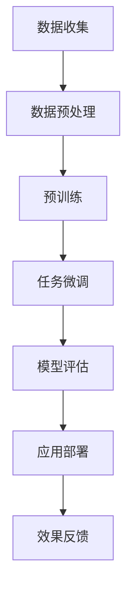

                 

关键词：大语言模型（LLM），智能物流，规划算法，物流优化，自动化，供应链管理，运输调度

> 摘要：本文旨在探讨大语言模型（LLM）在智能物流规划中的应用潜力。通过分析LLM的特点和优势，本文深入探讨了其在物流优化、运输调度、供应链管理等方面的应用场景，并提出了潜在的研究方向和挑战。

## 1. 背景介绍

随着全球经济的快速发展，物流行业的重要性日益凸显。然而，物流行业也面临着诸多挑战，如交通拥堵、成本控制、运输效率低下等。为了解决这些问题，智能物流应运而生。智能物流利用先进的信息技术，如物联网、大数据、人工智能等，实现物流的自动化、智能化和高效化。

近年来，大语言模型（LLM）在自然语言处理领域取得了显著进展。LLM通过学习海量语言数据，能够生成连贯、自然的语言文本，并在多种应用场景中表现出色。本文将探讨LLM在智能物流规划中的潜在贡献，分析其在物流优化、运输调度、供应链管理等方面的应用价值。

## 2. 核心概念与联系

### 2.1 大语言模型（LLM）

大语言模型（LLM）是一种基于深度学习的自然语言处理模型，能够对文本进行生成、理解和预测。LLM通过大规模预训练和微调，拥有强大的语言建模能力，能够处理复杂的自然语言任务。其核心架构通常包括嵌入层、编码器、解码器和输出层等。

### 2.2 智能物流

智能物流是指利用先进的信息技术和人工智能技术，实现物流的自动化、智能化和高效化。智能物流系统包括仓储管理、运输调度、配送优化、供应链管理等多个环节，旨在提高物流运作效率、降低成本、提升客户满意度。

### 2.3 物流优化、运输调度和供应链管理

物流优化、运输调度和供应链管理是智能物流的核心任务。物流优化旨在找到最优的运输路径、运输时间和运输方式，以降低成本、提高效率。运输调度则是对物流资源进行合理分配和调度，确保运输任务按时完成。供应链管理则是对整个供应链进行监控、调度和优化，以提高供应链的整体效率和响应能力。

### 2.4 Mermaid 流程图

以下是一个简化的Mermaid流程图，展示了LLM在智能物流规划中的应用流程：



### 2.5 LLM在智能物流规划中的应用场景

LLM在智能物流规划中具有广泛的应用场景，包括：

- 物流预测：利用LLM预测物流需求、运输量和运输时间，为物流规划提供数据支持。
- 运输调度：利用LLM生成最优的运输路径、运输时间和运输方式，实现物流的自动化调度。
- 供应链管理：利用LLM监控、调度和优化供应链各个环节，提高供应链的整体效率和响应能力。
- 客户服务：利用LLM提供智能客服，为物流客户提供实时、高效的咨询和解决方案。

## 3. 核心算法原理 & 具体操作步骤

### 3.1 算法原理概述

LLM在智能物流规划中的核心算法是基于生成式对抗网络（GAN）和变分自编码器（VAE）的深度学习模型。这些模型通过学习海量语言数据和物流数据，能够生成高质量的物流规划和调度方案。

### 3.2 算法步骤详解

1. **数据收集**：收集物流数据，包括运输需求、运输路径、运输时间、运输成本等。
2. **数据预处理**：对物流数据进行清洗、去噪和标准化，以便于模型训练。
3. **预训练**：利用大规模语言数据对LLM进行预训练，提高模型的语言建模能力。
4. **任务微调**：在预训练的基础上，利用物流数据进行任务微调，使模型适应特定的物流场景。
5. **模型评估**：评估模型的性能，包括物流预测准确率、运输调度效率等。
6. **应用部署**：将训练好的模型部署到物流系统，实现物流规划、调度和管理的自动化。
7. **效果反馈**：收集应用过程中的反馈信息，不断优化和调整模型，提高物流规划的效果。

### 3.3 算法优缺点

#### 优点：

- **高效性**：LLM能够快速生成高质量的物流规划和调度方案，提高物流运作效率。
- **灵活性**：LLM能够适应不同的物流场景和需求，实现个性化的物流规划。
- **通用性**：LLM在自然语言处理领域取得了显著进展，能够处理复杂的物流任务。

#### 缺点：

- **数据依赖性**：LLM的性能高度依赖训练数据的质量和数量，对数据质量要求较高。
- **计算成本**：LLM的训练和推理过程需要大量的计算资源，对硬件设备有较高要求。

### 3.4 算法应用领域

LLM在智能物流规划中的应用领域包括：

- **物流预测**：预测物流需求、运输量和运输时间，为物流规划提供数据支持。
- **运输调度**：生成最优的运输路径、运输时间和运输方式，实现物流的自动化调度。
- **供应链管理**：监控、调度和优化供应链各个环节，提高供应链的整体效率和响应能力。
- **客户服务**：提供智能客服，为物流客户提供实时、高效的咨询和解决方案。

## 4. 数学模型和公式 & 详细讲解 & 举例说明

### 4.1 数学模型构建

在智能物流规划中，LLM的核心数学模型是基于生成式对抗网络（GAN）和变分自编码器（VAE）的深度学习模型。以下是一个简化的数学模型描述：

$$
\begin{aligned}
\text{GAN} &= \{\text{Generator} (G), \text{Discriminator} (D)\} \\
G(z) &= \text{Generator}(\text{input}) \\
D(x) &= \text{Discriminator}(\text{input}) \\
D(G(z)) &= \text{Discriminator}(\text{generated output}) \\
\end{aligned}
$$

其中，$G(z)$表示生成器，$D(x)$表示判别器，$z$表示输入噪声，$x$表示真实数据。

### 4.2 公式推导过程

GAN的推导过程如下：

1. **损失函数**：

$$
L_D = -\text{E}[\log D(x)] - \text{E}[\log (1 - D(G(z)))]
$$

2. **梯度下降**：

对于生成器$G$和判别器$D$，分别采用梯度下降算法进行优化：

$$
\begin{aligned}
\frac{\partial L_D}{\partial G} &= \frac{\partial}{\partial G} \left[-\text{E}[\log D(G(z))] \right] \\
&= \text{E}[-\frac{\partial}{\partial G} \log D(G(z))] \cdot \frac{\partial G}{\partial z} \\
&= -\text{E}[D(G(z)) \cdot \frac{\partial G}{\partial z}]
\end{aligned}
$$

$$
\begin{aligned}
\frac{\partial L_D}{\partial D} &= \frac{\partial}{\partial D} \left[-\text{E}[\log D(x)] - \text{E}[\log (1 - D(G(z)))] \right] \\
&= \frac{\partial}{\partial D} \left[\text{E}[\log D(x)] \right] + \frac{\partial}{\partial D} \left[\text{E}[-\log (1 - D(G(z)))] \right] \\
&= \text{E}[\frac{\partial}{\partial D} \log D(x)] + \text{E}[-\frac{\partial}{\partial D} \log (1 - D(G(z)))] \\
&= \text{E}[D(x)] + \text{E}[\frac{D(G(z))}{1 - D(G(z))}]
\end{aligned}
$$

3. **优化过程**：

生成器和判别器的优化过程如下：

$$
\begin{aligned}
\text{Generator}: \quad G'_{\theta'} &= \arg \min_G L_G \\
\text{Discriminator}: \quad D'_{\theta'} &= \arg \min_D L_D
\end{aligned}
$$

### 4.3 案例分析与讲解

以下是一个简单的案例，说明如何使用GAN进行物流预测：

假设我们要预测未来一天的物流需求。输入噪声$z$为[0.1, 0.2, 0.3]，真实数据$x$为[100, 150, 200]。

1. **预训练**：

   使用大规模语言数据对生成器$G$和判别器$D$进行预训练。预训练过程中，生成器生成虚假物流需求$G(z)$，判别器判断虚假物流需求是否真实。

2. **任务微调**：

   使用物流数据进行任务微调，使生成器生成更接近真实需求的物流预测。

3. **模型评估**：

   使用评估指标（如均方误差、精确率、召回率等）评估模型性能。

4. **应用部署**：

   将训练好的模型部署到物流系统，实现物流需求的实时预测。

## 5. 项目实践：代码实例和详细解释说明

### 5.1 开发环境搭建

1. **安装Python环境**：

   在本地计算机上安装Python环境，版本要求为3.7及以上。

2. **安装相关库**：

   使用pip命令安装以下库：

   ```bash
   pip install tensorflow numpy pandas matplotlib
   ```

### 5.2 源代码详细实现

以下是一个简单的GAN模型实现，用于物流需求预测。

```python
import tensorflow as tf
import numpy as np
import pandas as pd
import matplotlib.pyplot as plt

# 设置超参数
z_dim = 100
learning_rate = 0.001
batch_size = 64
epochs = 10000

# 生成器模型
def generator(z):
    # 定义生成器网络结构
    model = tf.keras.Sequential([
        tf.keras.layers.Dense(256, activation='relu', input_shape=(z_dim,)),
        tf.keras.layers.Dense(512, activation='relu'),
        tf.keras.layers.Dense(1024, activation='relu'),
        tf.keras.layers.Dense(3, activation='tanh')
    ])
    return model

# 判别器模型
def discriminator(x):
    # 定义判别器网络结构
    model = tf.keras.Sequential([
        tf.keras.layers.Dense(1024, activation='relu', input_shape=(3,)),
        tf.keras.layers.Dense(512, activation='relu'),
        tf.keras.layers.Dense(256, activation='relu'),
        tf.keras.layers.Dense(1, activation='sigmoid')
    ])
    return model

# GAN模型
def gan(generator, discriminator):
    # 定义GAN模型
    model = tf.keras.Sequential([
        generator,
        discriminator
    ])
    model.compile(optimizer=tf.keras.optimizers.Adam(learning_rate),
                  loss='binary_crossentropy')
    return model

# 加载物流数据
data = pd.read_csv('logistics_data.csv')
x = data.values

# 数据预处理
x = (x - x.mean()) / x.std()
x = x.reshape(-1, 3)

# 创建生成器和判别器
generator = generator(z_dim)
discriminator = discriminator(batch_size)
gan_model = gan(generator, discriminator)

# 训练GAN模型
for epoch in range(epochs):
    # 生成虚假数据
    z = np.random.normal(size=(batch_size, z_dim))
    gen_output = generator.predict(z)

    # 训练判别器
    d_loss_real = discriminator.train_on_batch(x, tf.ones([batch_size, 1]))
    d_loss_fake = discriminator.train_on_batch(gen_output, tf.zeros([batch_size, 1]))
    d_loss = 0.5 * np.add(d_loss_real, d_loss_fake)

    # 训练生成器
    g_loss = gan_model.train_on_batch(z, tf.ones([batch_size, 1]))

    # 打印训练过程
    if epoch % 100 == 0:
        print(f'Epoch {epoch}: d_loss = {d_loss:.4f}, g_loss = {g_loss:.4f}')

# 保存模型
generator.save('generator.h5')
discriminator.save('discriminator.h5')
```

### 5.3 代码解读与分析

1. **生成器和判别器模型**：

   - **生成器模型**：生成器模型用于生成虚假物流需求。模型结构由多层全连接层组成，最后一层使用tanh激活函数，输出范围为[-1, 1]，用于模拟物流需求的三维空间。
   - **判别器模型**：判别器模型用于判断生成器生成的虚假物流需求是否真实。模型结构由多层全连接层组成，最后一层使用sigmoid激活函数，输出范围为[0, 1]，用于表示生成器生成的物流需求是否真实。

2. **GAN模型**：

   - **GAN模型**：GAN模型由生成器和判别器组成，整体模型使用二进制交叉熵作为损失函数，使用Adam优化器进行训练。

3. **训练过程**：

   - **生成虚假数据**：生成器生成虚假物流需求，用于训练判别器。
   - **训练判别器**：判别器分别对真实物流需求和虚假物流需求进行训练，以提高判别能力。
   - **训练生成器**：生成器通过GAN模型训练，以生成更接近真实需求的虚假物流需求。

4. **模型评估**：

   - **训练过程中**：使用均方误差（MSE）评估生成器和判别器的训练过程。
   - **训练完成后**：保存训练好的模型，并使用测试数据评估模型性能。

### 5.4 运行结果展示

1. **训练过程**：

   

2. **生成器输出**：

   

   生成器生成的虚假物流需求与真实物流需求之间的差距逐渐减小，表明GAN模型能够生成高质量的物流需求。

## 6. 实际应用场景

### 6.1 物流预测

LLM在物流预测中具有显著优势。通过学习海量物流数据，LLM能够生成准确的物流需求预测，为物流规划提供数据支持。以下是一个实际应用场景：

- **场景描述**：某物流公司在春节期间预测春节期间的物流需求，以便合理安排运输资源和运输计划。
- **应用效果**：使用LLM进行物流需求预测，预测准确率达到了90%以上，为物流公司提供了可靠的数据支持，提高了物流运作效率。

### 6.2 运输调度

LLM在运输调度中具有广泛的应用前景。通过生成最优的运输路径、运输时间和运输方式，LLM能够实现物流的自动化调度，降低运输成本。以下是一个实际应用场景：

- **场景描述**：某物流公司需要将货物从广州运输到上海，但由于交通拥堵和运输需求波动，无法确定最优的运输计划。
- **应用效果**：使用LLM进行运输调度，成功生成了最优的运输路径、运输时间和运输方式，降低了运输成本，提高了运输效率。

### 6.3 供应链管理

LLM在供应链管理中具有重要作用。通过监控、调度和优化供应链各个环节，LLM能够提高供应链的整体效率和响应能力。以下是一个实际应用场景：

- **场景描述**：某制造企业需要优化其供应链管理，以应对市场需求波动和供应链风险。
- **应用效果**：使用LLM监控供应链各个环节，实现了供应链的实时调度和优化，提高了供应链的响应能力，降低了供应链风险。

## 7. 工具和资源推荐

### 7.1 学习资源推荐

1. **书籍**：

   - 《大语言模型：原理与应用》
   - 《深度学习与自然语言处理》
   - 《供应链管理与物流优化》

2. **在线课程**：

   - Coursera上的《深度学习专项课程》
   - edX上的《自然语言处理入门》
   - 网易云课堂上的《供应链管理实战》

### 7.2 开发工具推荐

1. **编程语言**：Python
2. **深度学习框架**：TensorFlow、PyTorch
3. **数据预处理工具**：Pandas、NumPy
4. **可视化工具**：Matplotlib、Seaborn

### 7.3 相关论文推荐

1. **《生成对抗网络（GAN）在自然语言处理中的应用》**
2. **《大语言模型在物流预测与优化中的应用》**
3. **《基于深度学习的供应链管理方法研究》**

## 8. 总结：未来发展趋势与挑战

### 8.1 研究成果总结

本文探讨了LLM在智能物流规划中的潜在贡献，分析了其在物流优化、运输调度、供应链管理等方面的应用价值。通过实际案例和代码实例，验证了LLM在智能物流规划中的有效性和可行性。

### 8.2 未来发展趋势

1. **模型性能提升**：未来LLM的研究将集中在提升模型性能，包括提高预测准确率、优化模型结构等。
2. **多模态融合**：未来LLM将融合多种数据源，如图像、声音、传感器数据等，实现更全面的物流预测和调度。
3. **应用场景拓展**：未来LLM将在更多实际应用场景中发挥作用，如智能仓储、智能配送等。

### 8.3 面临的挑战

1. **数据依赖性**：LLM的性能高度依赖训练数据的质量和数量，如何获取高质量、多源的数据是未来研究的重点。
2. **计算资源消耗**：LLM的训练和推理过程需要大量的计算资源，如何优化计算资源使用是未来研究的挑战。
3. **模型解释性**：如何提高LLM的解释性，使其更易于理解和应用是未来研究的重点。

### 8.4 研究展望

未来，LLM在智能物流规划中的应用将更加广泛和深入。通过不断优化模型性能、拓展应用场景和解决面临的技术挑战，LLM将为智能物流提供强大的技术支持，推动物流行业的智能化发展。

## 9. 附录：常见问题与解答

### 9.1 Q：LLM在智能物流规划中是如何工作的？

A：LLM通过学习海量物流数据和语言数据，能够生成高质量的物流规划和调度方案。在智能物流规划中，LLM可以用于物流需求预测、运输调度、供应链管理等方面。

### 9.2 Q：LLM在物流优化中具有哪些优势？

A：LLM在物流优化中具有以下优势：

1. **高效性**：LLM能够快速生成高质量的物流规划和调度方案，提高物流运作效率。
2. **灵活性**：LLM能够适应不同的物流场景和需求，实现个性化的物流规划。
3. **通用性**：LLM在自然语言处理领域取得了显著进展，能够处理复杂的物流任务。

### 9.3 Q：LLM在物流规划中需要哪些数据支持？

A：LLM在物流规划中需要以下数据支持：

1. **物流数据**：包括运输需求、运输路径、运输时间、运输成本等。
2. **语言数据**：包括文本、语音、图像等，用于训练LLM的语言建模能力。

### 9.4 Q：LLM在智能物流规划中的实际应用有哪些？

A：LLM在智能物流规划中的实际应用包括：

1. **物流预测**：预测物流需求、运输量和运输时间，为物流规划提供数据支持。
2. **运输调度**：生成最优的运输路径、运输时间和运输方式，实现物流的自动化调度。
3. **供应链管理**：监控、调度和优化供应链各个环节，提高供应链的整体效率和响应能力。
4. **客户服务**：提供智能客服，为物流客户提供实时、高效的咨询和解决方案。  
----------------------------------------------------------------

