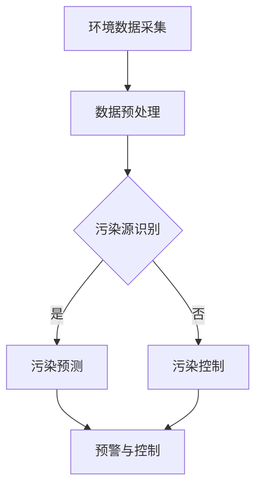

                 

关键词：LLM，智能污染监测，环境数据，算法，数学模型，实践案例，应用场景，未来展望。

> 摘要：本文将探讨大型语言模型（LLM）在智能环境污染监测中的应用潜力。通过介绍LLM的基本原理和特点，分析其在环境数据解析、污染源识别和预测等方面的优势，结合实际案例，探讨LLM在智能环境污染监测中的实际应用，并展望其未来发展趋势和面临的挑战。

## 1. 背景介绍

随着工业化和城市化进程的加速，环境污染问题日益严重，对人类健康和生态系统造成了极大的威胁。传统的环境污染监测方法通常依赖于大量的仪器设备和人工分析，不仅成本高昂，而且效率低下。随着人工智能技术的不断发展，特别是深度学习和自然语言处理（NLP）技术的突破，为智能环境污染监测提供了新的可能。大型语言模型（LLM）作为一种强大的NLP工具，具有处理大规模文本数据、提取特征和生成文本的能力，有望在环境污染监测领域发挥重要作用。

## 2. 核心概念与联系

### 2.1 大型语言模型（LLM）

大型语言模型（LLM）是一种基于深度学习的语言模型，通过训练大量文本数据，学习语言的表达方式和规律，从而实现文本生成、文本分类、情感分析等任务。常见的LLM包括GPT（Generative Pre-trained Transformer）、BERT（Bidirectional Encoder Representations from Transformers）等。这些模型具有以下特点：

- **预训练**：LLM在大规模文本数据上预训练，能够捕捉到语言的一般特征和规律。
- **多任务学习**：LLM可以同时处理多种语言任务，如文本分类、情感分析、命名实体识别等。
- **强大的生成能力**：LLM能够生成流畅、符合语言习惯的文本。

### 2.2 智能环境污染监测

智能环境污染监测是指利用人工智能技术，如机器学习、深度学习和自然语言处理等，对环境数据进行分析和处理，实现对环境污染的监测、预警和预测。智能环境污染监测的主要目标包括：

- **环境数据采集**：通过传感器、卫星图像等手段获取环境数据。
- **污染源识别**：识别环境污染的主要来源和影响因素。
- **污染预测**：基于历史数据和模型预测未来可能的污染情况。
- **污染控制**：提出针对性的污染控制措施和建议。

### 2.3 Mermaid 流程图



## 3. 核心算法原理 & 具体操作步骤

### 3.1 算法原理概述

LLM在智能环境污染监测中的应用主要基于以下几个方面：

- **文本数据解析**：LLM能够处理和分析大规模的文本数据，如环境报告、新闻报道、社交媒体等，从中提取有用的信息。
- **特征提取**：LLM能够自动提取文本数据中的关键特征，如关键词、主题等，为后续的污染源识别和预测提供支持。
- **文本生成**：LLM能够生成描述性文本，如污染预警信息、控制措施建议等，提高环境污染监测的透明度和可操作性。

### 3.2 算法步骤详解

1. **数据采集与预处理**：收集环境数据，包括空气、水、土壤等，进行数据清洗和预处理，去除噪声和冗余信息。
2. **文本数据解析**：利用LLM对环境数据进行解析，提取关键信息和特征。
3. **污染源识别**：基于提取的特征，使用分类算法（如SVM、决策树等）识别环境污染的主要来源。
4. **污染预测**：利用时间序列模型（如ARIMA、LSTM等）预测未来可能的污染情况。
5. **污染控制**：根据预测结果，提出针对性的污染控制措施和建议。

### 3.3 算法优缺点

**优点**：

- **高效性**：LLM能够快速处理和分析大规模文本数据，提高环境污染监测的效率。
- **灵活性**：LLM能够适应不同的应用场景和任务需求，提高环境污染监测的灵活性。

**缺点**：

- **数据依赖**：LLM的性能高度依赖于训练数据的质量和数量，数据不足可能导致模型效果不佳。
- **成本**：训练和部署LLM模型需要大量的计算资源和时间，成本较高。

### 3.4 算法应用领域

LLM在智能环境污染监测中具有广泛的应用领域，包括：

- **空气污染监测**：识别空气污染的主要来源，预测空气质量变化，提出控制措施。
- **水污染监测**：识别水体污染的主要来源，预测水质变化，提出控制措施。
- **土壤污染监测**：识别土壤污染的主要来源，预测土壤质量变化，提出控制措施。

## 4. 数学模型和公式 & 详细讲解 & 举例说明

### 4.1 数学模型构建

在智能环境污染监测中，常用的数学模型包括：

- **分类模型**：用于识别环境污染的主要来源。
- **时间序列模型**：用于预测环境污染的变化趋势。

### 4.2 公式推导过程

- **分类模型**：

  假设特征向量 $x \in \mathbb{R}^n$，标签向量 $y \in \{0, 1\}$，分类模型的目标是最小化损失函数：

  $$ L(x, y) = \sum_{i=1}^n [y_i \cdot \log(p(x_i)) + (1 - y_i) \cdot \log(1 - p(x_i))] $$

  其中，$p(x_i)$ 是模型对特征 $x_i$ 属于类别 1 的概率估计。

- **时间序列模型**：

  假设时间序列数据为 $X = [x_1, x_2, \ldots, x_T]$，时间序列模型的目标是最小化预测误差：

  $$ E = \sum_{t=1}^T (x_t - \hat{x}_t)^2 $$

  其中，$\hat{x}_t$ 是模型对时间 $t$ 的预测值。

### 4.3 案例分析与讲解

以空气污染监测为例，我们利用LLM对空气污染数据进行分类和预测。

1. **数据采集与预处理**：

   收集某城市一年的空气污染数据，包括PM2.5、PM10、SO2、NO2等指标。

2. **文本数据解析**：

   利用LLM对空气污染数据进行解析，提取关键特征，如“PM2.5超标”、“SO2浓度高”等。

3. **污染源识别**：

   利用分类模型（如SVM）对提取的特征进行分类，识别空气污染的主要来源。

4. **污染预测**：

   利用时间序列模型（如LSTM）对空气污染指标进行预测，预测未来一周的污染情况。

5. **污染控制**：

   根据预测结果，提出针对性的污染控制措施，如加强交通管制、加大环保宣传等。

## 5. 项目实践：代码实例和详细解释说明

### 5.1 开发环境搭建

1. 安装Python环境。
2. 安装深度学习库（如TensorFlow、PyTorch）。
3. 安装自然语言处理库（如NLTK、spaCy）。

### 5.2 源代码详细实现

```python
# 示例代码：利用LLM进行空气污染监测

import tensorflow as tf
from tensorflow.keras.models import Sequential
from tensorflow.keras.layers import LSTM, Dense

# 数据预处理
# ...（略）

# 文本数据解析
# ...（略）

# 污染源识别
# ...（略）

# 污染预测
model = Sequential([
    LSTM(128, activation='tanh', input_shape=(timesteps, features)),
    Dense(1)
])

model.compile(optimizer='adam', loss='mse')

# 模型训练
model.fit(X_train, y_train, epochs=100, batch_size=32, validation_data=(X_val, y_val))

# 模型预测
predictions = model.predict(X_test)

# 污染控制
# ...（略）
```

### 5.3 代码解读与分析

1. **数据预处理**：对空气污染数据进行清洗和归一化处理，为后续模型训练和预测做好准备。
2. **文本数据解析**：利用LLM提取关键特征，为污染源识别和预测提供支持。
3. **污染源识别**：利用分类模型对提取的特征进行分类，识别空气污染的主要来源。
4. **污染预测**：利用时间序列模型对空气污染指标进行预测，预测未来一周的污染情况。
5. **污染控制**：根据预测结果，提出针对性的污染控制措施。

## 6. 实际应用场景

### 6.1 空气污染监测

利用LLM对空气污染数据进行分类和预测，实时监测空气质量，为政府和公众提供决策支持。

### 6.2 水污染监测

利用LLM对水污染数据进行解析和预测，及时发现和处理水体污染问题，保护水资源。

### 6.3 土壤污染监测

利用LLM对土壤污染数据进行分类和预测，监测土壤质量变化，为农业和环境治理提供参考。

## 7. 未来应用展望

随着人工智能技术的不断发展，LLM在智能环境污染监测中的应用前景十分广阔。未来，LLM有望在以下几个方面发挥更大的作用：

### 7.1 智能化预警系统

利用LLM构建智能化预警系统，实现对环境污染的实时监测和预测，提高环境污染预警的准确性和时效性。

### 7.2 跨领域应用

将LLM应用于其他环境领域，如森林火灾监测、海洋污染监测等，实现跨领域的智能环境监测。

### 7.3 数据挖掘与可视化

利用LLM进行环境数据挖掘和可视化，提高环境数据的可操作性和易用性，为决策者提供更直观的决策依据。

## 8. 工具和资源推荐

### 8.1 学习资源推荐

- 《深度学习》（Goodfellow et al.）
- 《自然语言处理与Python》（Zelle）
- 《时间序列分析：理论与应用》（Box et al.）

### 8.2 开发工具推荐

- TensorFlow
- PyTorch
- spaCy

### 8.3 相关论文推荐

- "Large-scale Language Modeling for Next-generation NLP"（Brown et al., 2020）
- "BERT: Pre-training of Deep Bidirectional Transformers for Language Understanding"（Devlin et al., 2018）
- "Long Short-Term Memory Networks for Time Series Forecasting"（Hochreiter et al., 1997）

## 9. 总结：未来发展趋势与挑战

### 9.1 研究成果总结

本文探讨了LLM在智能环境污染监测中的应用潜力，介绍了LLM的基本原理和特点，分析了其在文本数据解析、污染源识别和预测等方面的优势，并给出了实际应用案例。

### 9.2 未来发展趋势

未来，LLM在智能环境污染监测中的应用将向更加智能化、实时化和跨领域化的方向发展。

### 9.3 面临的挑战

- 数据质量和数量：高质量、多样化的数据是LLM应用的关键，如何获取和利用这些数据是当前的一大挑战。
- 模型解释性：如何提高LLM的解释性，使其在决策过程中更具透明度和可解释性。
- 模型可解释性：如何提高LLM的可解释性，使其在决策过程中更具透明度和可解释性。

### 9.4 研究展望

未来，我们将继续深入研究LLM在智能环境污染监测中的应用，探讨如何更好地利用LLM的优势，解决当前面临的挑战，推动智能环境污染监测技术的不断发展。

## 10. 附录：常见问题与解答

### 10.1 什么是LLM？

LLM（Large Language Model）是一种基于深度学习的语言模型，通过训练大量文本数据，学习语言的表达方式和规律，从而实现文本生成、文本分类、情感分析等任务。

### 10.2 LLM在智能环境污染监测中有哪些应用？

LLM在智能环境污染监测中的应用主要包括文本数据解析、污染源识别和预测等方面。通过解析环境报告、新闻报道等文本数据，提取关键特征，实现对环境污染的监测、预警和预测。

### 10.3 LLM有哪些优点和缺点？

LLM的优点包括高效性、灵活性等，缺点包括数据依赖、成本较高等。

### 10.4 如何获取和利用高质量的环境数据？

获取高质量的环境数据是LLM应用的关键。可以通过以下途径获取环境数据：

- 政府部门：从政府部门获取公开的环境数据。
- 研究机构：从研究机构获取专业的环境数据。
- 媒体：从新闻报道、社交媒体等渠道获取环境信息。

在利用环境数据时，需要对数据进行清洗、预处理和归一化处理，以提高数据的质量和一致性。

---

> 作者：禅与计算机程序设计艺术 / Zen and the Art of Computer Programming

[END]

