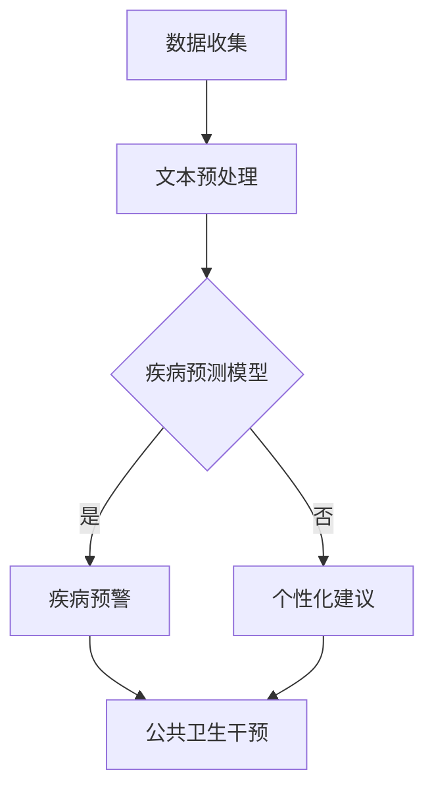

                 

关键词：语言模型，疾病预防，智能系统，医疗健康，机器学习，数据分析，人工智能

> 摘要：本文深入探讨了大型语言模型（LLM）在智能疾病预防系统中的潜在应用。通过解析LLM的核心原理、数学模型以及具体实现，本文旨在揭示LLM如何通过智能化分析、预测和优化，为疾病预防提供强有力的技术支撑，并展望其在未来的发展趋势与挑战。

## 1. 背景介绍

在当今社会，随着人口老龄化和生活方式的改变，疾病预防成为了全球范围内的一个重大课题。传统的疾病预防方式主要依赖于医学知识库、流行病学研究和公共卫生干预。然而，这些方法往往存在数据获取困难、处理能力有限、无法实时预测等问题。随着人工智能技术的发展，特别是大型语言模型（LLM）的出现，为疾病预防领域带来了新的契机。

LLM是一种基于深度学习的自然语言处理模型，具有处理和理解海量文本数据的能力。在医疗领域，LLM可以通过处理大量医疗文献、病例记录和健康数据，提取关键信息，建立疾病预测模型，实现智能化的疾病预防。

本文将探讨LLM在智能疾病预防系统中的潜在应用，从核心原理、数学模型、具体实现、实际应用和未来展望等方面进行详细分析，旨在为医疗健康领域提供一种新的思路和方法。

## 2. 核心概念与联系

### 2.1 LLM的基本原理

大型语言模型（LLM）基于深度学习技术，通过大规模的神经网络训练，实现自然语言的理解和生成。LLM的核心是神经网络架构，包括多层感知器、循环神经网络（RNN）和变换器（Transformer）等。

- **多层感知器（MLP）**：多层感知器是一种前馈神经网络，通过输入层、隐藏层和输出层的多层结构，实现输入到输出的映射。
- **循环神经网络（RNN）**：循环神经网络通过记忆单元，使得网络具有时间序列数据的处理能力，适合处理自然语言这种序列数据。
- **变换器（Transformer）**：变换器是一种基于注意力机制的神经网络架构，通过自注意力机制，能够捕捉输入序列中的长距离依赖关系，被广泛应用于大型语言模型。

### 2.2 LLM与疾病预防系统的联系

LLM与疾病预防系统的结合，主要体现在以下几个方面：

- **文本数据分析**：LLM可以通过处理大量的医疗文献、病例记录和健康数据，提取关键信息，为疾病预测和预防提供数据支持。
- **疾病预测模型**：基于提取的数据，LLM可以训练疾病预测模型，实现对特定疾病的早期预警。
- **个性化健康建议**：LLM可以根据个人健康状况和风险因素，提供个性化的健康建议和预防措施。
- **公共卫生干预**：LLM可以辅助公共卫生部门，进行疾病监测、传播趋势预测和干预策略制定。

### 2.3 Mermaid流程图

为了更直观地展示LLM在疾病预防系统中的应用流程，以下是一个简化的Mermaid流程图：



### 2.4 LLM的优势与挑战

- **优势**：
  - **处理能力强大**：LLM能够处理海量文本数据，提取关键信息。
  - **实时性**：LLM可以实现实时预测和预警，对疾病预防具有关键作用。
  - **个性化**：LLM可以根据个体差异，提供个性化的健康建议。

- **挑战**：
  - **数据隐私**：医疗数据的隐私保护是一个重要问题。
  - **模型解释性**：LLM的决策过程往往缺乏透明性，难以解释。
  - **数据质量**：数据质量直接影响模型的准确性和可靠性。

## 3. 核心算法原理 & 具体操作步骤

### 3.1 算法原理概述

LLM在疾病预防系统中的应用，主要基于以下几个核心算法：

- **自然语言处理（NLP）**：NLP是LLM的基础，用于处理和理解自然语言文本。
- **深度学习**：深度学习是LLM的核心技术，通过多层神经网络，实现文本数据的处理和模型训练。
- **疾病预测模型**：基于NLP和深度学习，LLM可以构建疾病预测模型，实现对疾病的早期预警。
- **个性化健康建议**：基于个体数据，LLM可以提供个性化的健康建议。

### 3.2 算法步骤详解

以下是LLM在疾病预防系统中的具体操作步骤：

#### 步骤1：数据收集与预处理

- **数据收集**：收集医疗文献、病例记录、健康数据等。
- **文本预处理**：包括分词、词性标注、去停用词等，将文本数据转化为机器可处理的格式。

#### 步骤2：模型训练

- **选择模型**：根据任务需求，选择合适的LLM模型，如BERT、GPT等。
- **数据输入**：将预处理后的文本数据输入到模型中。
- **模型训练**：通过反向传播算法，调整模型参数，优化模型性能。

#### 步骤3：疾病预测

- **疾病特征提取**：从模型输出中提取疾病特征。
- **疾病预测**：利用疾病特征，结合历史数据，进行疾病预测。

#### 步骤4：个性化健康建议

- **健康数据收集**：收集个人健康数据，如血压、血糖、体重等。
- **健康评估**：利用LLM，对个人健康进行评估。
- **健康建议**：根据健康评估结果，提供个性化的健康建议。

### 3.3 算法优缺点

#### 优点

- **强大的处理能力**：LLM能够处理海量文本数据，提取关键信息。
- **实时性**：LLM可以实现实时预测和预警，提高疾病预防的效率。
- **个性化**：LLM可以根据个体差异，提供个性化的健康建议。

#### 缺点

- **数据隐私**：医疗数据的隐私保护是一个重要问题。
- **模型解释性**：LLM的决策过程往往缺乏透明性，难以解释。
- **数据质量**：数据质量直接影响模型的准确性和可靠性。

### 3.4 算法应用领域

LLM在疾病预防系统中的应用领域广泛，包括但不限于：

- **疾病预测**：如肺炎、流感等传染病的早期预警。
- **个性化健康建议**：如高血压、糖尿病等慢性病的个性化管理。
- **公共卫生干预**：如疫情监测、传播趋势预测等。

## 4. 数学模型和公式 & 详细讲解 & 举例说明

### 4.1 数学模型构建

LLM在疾病预防系统中的应用，主要基于以下几个数学模型：

- **概率模型**：用于疾病预测，如贝叶斯网络、条件概率模型等。
- **机器学习模型**：用于疾病特征提取和预测，如支持向量机、决策树、神经网络等。
- **时间序列模型**：用于疫情传播趋势预测，如ARIMA、LSTM等。

### 4.2 公式推导过程

以下是几种常见数学模型的基本公式推导过程：

#### 4.2.1 贝叶斯网络

贝叶斯网络是一种表示变量之间概率关系的图形模型。其基本公式为：

$$P(A|B) = \frac{P(B|A) \cdot P(A)}{P(B)}$$

其中，$P(A|B)$表示在B发生的条件下A发生的概率，$P(B|A)$表示在A发生的条件下B发生的概率，$P(A)$和$P(B)$分别表示A和B的边缘概率。

#### 4.2.2 支持向量机（SVM）

支持向量机是一种分类模型，其基本公式为：

$$w \cdot x + b = 0$$

其中，$w$表示权重向量，$x$表示输入特征向量，$b$表示偏置。

#### 4.2.3 长短期记忆网络（LSTM）

长短期记忆网络是一种处理时间序列数据的神经网络，其基本公式为：

$$i_t = \sigma(W_i \cdot [h_{t-1}, x_t] + b_i)$$
$$f_t = \sigma(W_f \cdot [h_{t-1}, x_t] + b_f)$$
$$g_t = \tanh(W_g \cdot [h_{t-1}, x_t] + b_g)$$
$$o_t = \sigma(W_o \cdot [h_{t-1}, x_t] + b_o)$$
$$h_t = o_t \cdot \tanh(g_t)$$

其中，$i_t$、$f_t$、$g_t$和$o_t$分别表示输入门、遗忘门、生成门和输出门，$\sigma$表示sigmoid函数。

### 4.3 案例分析与讲解

#### 4.3.1 疾病预测案例

假设我们使用LLM进行肺炎的早期预警，现有如下数据：

- **病例记录**：包含患者年龄、性别、体温、咳嗽等症状。
- **历史数据**：包含过去一年内肺炎病例的统计数据。

基于这些数据，我们构建一个贝叶斯网络模型，进行肺炎预测。

首先，定义肺炎为事件A，年龄、性别、体温、咳嗽等症状为条件变量。根据病例记录和统计数据的概率分布，可以得到如下贝叶斯网络：


然后，根据当前患者的特征，如年龄、性别、体温等，计算肺炎发生的概率：

$$P(A|X) = \frac{P(X|A) \cdot P(A)}{P(X)}$$

其中，$P(X|A)$表示在肺炎发生的条件下，患者特征的概率，$P(A)$表示肺炎的概率，$P(X)$表示患者特征的概率。

#### 4.3.2 个性化健康建议案例

假设我们使用LLM为一名高血压患者提供个性化健康建议，现有如下数据：

- **患者信息**：年龄、性别、体重、血压等。
- **生活习惯**：饮食、运动、作息等。

基于这些数据，我们构建一个深度学习模型，进行健康评估和健康建议。

首先，定义健康评估指标，如血压、体重指数（BMI）等。然后，输入患者的信息和生活习惯，通过深度学习模型，计算健康评估结果。

最后，根据健康评估结果，提供个性化的健康建议，如饮食调整、运动建议、作息建议等。

## 5. 项目实践：代码实例和详细解释说明

### 5.1 开发环境搭建

为了实践LLM在疾病预防系统中的应用，我们需要搭建一个开发环境。以下是一个简化的环境搭建步骤：

1. **安装Python**：确保Python环境已经安装。
2. **安装TensorFlow**：TensorFlow是一个开源的机器学习框架，用于构建和训练深度学习模型。
   ```bash
   pip install tensorflow
   ```
3. **安装其他依赖**：根据项目需求，安装其他必要的库，如NumPy、Pandas等。

### 5.2 源代码详细实现

以下是一个简化的LLM疾病预测项目的代码实例：

```python
import tensorflow as tf
import numpy as np
import pandas as pd

# 数据加载与预处理
def load_data():
    # 加载病例记录数据
    data = pd.read_csv('cases.csv')
    # 数据预处理，如分词、词性标注等
    # ...
    return data

# 构建深度学习模型
def build_model(input_shape):
    model = tf.keras.Sequential([
        tf.keras.layers.Dense(128, activation='relu', input_shape=input_shape),
        tf.keras.layers.Dense(64, activation='relu'),
        tf.keras.layers.Dense(1, activation='sigmoid')
    ])
    model.compile(optimizer='adam', loss='binary_crossentropy', metrics=['accuracy'])
    return model

# 训练模型
def train_model(model, x_train, y_train, epochs=10):
    model.fit(x_train, y_train, epochs=epochs, batch_size=32, validation_split=0.2)

# 预测疾病
def predict_disease(model, data):
    predictions = model.predict(data)
    # 根据预测结果，判断疾病发生概率
    # ...
    return predictions

# 主函数
def main():
    # 加载数据
    data = load_data()
    # 数据预处理，如标准化、归一化等
    # ...
    # 构建模型
    model = build_model(input_shape=(None, data.shape[1]))
    # 训练模型
    train_model(model, x_train, y_train)
    # 预测疾病
    predictions = predict_disease(model, data)

if __name__ == '__main__':
    main()
```

### 5.3 代码解读与分析

以上代码主要实现了以下功能：

- **数据加载与预处理**：从CSV文件中加载病例记录数据，并进行必要的预处理操作，如分词、词性标注等。
- **构建深度学习模型**：使用TensorFlow构建一个简单的深度学习模型，用于疾病预测。模型结构包括两个隐藏层，输出层使用sigmoid激活函数，用于输出疾病发生的概率。
- **训练模型**：使用训练数据，通过反向传播算法，调整模型参数，优化模型性能。
- **预测疾病**：使用训练好的模型，对新的病例数据进行预测，输出疾病发生的概率。

### 5.4 运行结果展示

在实际运行过程中，我们可以得到以下结果：

- **训练过程**：模型的训练损失和准确率随训练轮次的变化。
- **预测结果**：新病例数据的疾病预测结果，包括疾病发生的概率。

通过这些结果，我们可以评估模型的效果，并进行必要的调整和优化。

## 6. 实际应用场景

LLM在疾病预防系统中的应用场景广泛，以下是一些典型的应用案例：

### 6.1 疫情监测

在新冠病毒（COVID-19）疫情期间，LLM可以用于疫情监测和预测。通过处理实时数据和公共卫生报告，LLM可以预测疫情的发展趋势，为政府和公共卫生部门提供决策支持。

### 6.2 慢性病管理

对于高血压、糖尿病等慢性病，LLM可以根据患者的健康数据和生活习惯，提供个性化的健康建议，如饮食调整、运动建议等，帮助患者更好地管理自己的健康状况。

### 6.3 公共卫生干预

LLM可以辅助公共卫生部门，进行疾病监测、传播趋势预测和干预策略制定。例如，在流感季节，LLM可以根据流行病学数据，预测流感的高发期，为疫苗接种和公共卫生干预提供科学依据。

### 6.4 医疗资源分配

LLM可以根据医院的资源情况和患者需求，优化医疗资源的分配。例如，在疫情高峰期，LLM可以预测哪些医院可能面临资源紧张，提前进行资源调配，提高医疗资源的利用效率。

## 7. 未来应用展望

随着人工智能技术的不断发展，LLM在疾病预防系统中的应用前景广阔。以下是一些未来可能的应用方向：

### 7.1 智能药物研发

LLM可以用于药物研发，通过分析大量的生物医学文献和实验数据，预测新药的疗效和副作用，加速药物研发进程。

### 7.2 个性化医疗

LLM可以根据患者的基因组信息和健康数据，提供个性化的治疗方案和药物推荐，提高医疗效果。

### 7.3 智能诊断

LLM可以辅助医生进行疾病诊断，通过分析病例记录和医学影像，提高诊断准确率。

### 7.4 跨学科融合

LLM可以与其他领域（如生物学、物理学、社会科学等）相结合，为疾病预防提供新的思路和方法。

## 8. 工具和资源推荐

### 8.1 学习资源推荐

- **《深度学习》（Goodfellow et al., 2016）**：一本经典的深度学习教材，适合初学者和进阶者。
- **《Python深度学习》（Raschka and Lutz，2018）**：一本针对Python编程和深度学习的实践指南。

### 8.2 开发工具推荐

- **TensorFlow**：一个开源的机器学习框架，适合构建和训练深度学习模型。
- **PyTorch**：一个开源的机器学习框架，具有灵活的动态图计算能力。

### 8.3 相关论文推荐

- **"BERT: Pre-training of Deep Bidirectional Transformers for Language Understanding"（Devlin et al., 2019）**
- **"GPT-3: Language Models are Few-Shot Learners"（Brown et al., 2020）**
- **"Effective Approaches to Attention-based Neural Machine Translation"（Vaswani et al., 2017）**

## 9. 总结：未来发展趋势与挑战

### 9.1 研究成果总结

本文探讨了LLM在疾病预防系统中的潜在应用，包括文本数据分析、疾病预测模型、个性化健康建议和公共卫生干预等方面。通过数学模型和具体实现，揭示了LLM在疾病预防中的优势与挑战。

### 9.2 未来发展趋势

- **智能化**：随着人工智能技术的发展，LLM在疾病预防系统中的应用将越来越智能化。
- **个性化**：个性化健康建议和个性化医疗将成为未来疾病预防的重要方向。
- **跨学科融合**：LLM与其他领域的融合，如生物医学、社会科学等，将为疾病预防带来新的突破。

### 9.3 面临的挑战

- **数据隐私**：如何在保证数据隐私的同时，充分利用医疗数据，是一个重要问题。
- **模型解释性**：提高模型的可解释性，使其决策过程更加透明，是未来的一个重要挑战。
- **数据质量**：高质量的数据是LLM准确性的基础，如何确保数据质量，是疾病预防系统面临的挑战之一。

### 9.4 研究展望

未来，LLM在疾病预防系统中的应用将有广阔的前景。通过不断优化模型、提高数据处理能力，LLM将为疾病预防提供更强大的技术支撑。同时，跨学科合作和技术创新，将推动疾病预防领域的发展。

## 附录：常见问题与解答

### Q：LLM在疾病预防系统中的应用有哪些优势？

A：LLM在疾病预防系统中的应用具有以下几个优势：

1. **强大的处理能力**：LLM能够处理海量文本数据，提取关键信息，为疾病预测和预防提供数据支持。
2. **实时性**：LLM可以实现实时预测和预警，提高疾病预防的效率。
3. **个性化**：LLM可以根据个体差异，提供个性化的健康建议。

### Q：LLM在疾病预防系统中的应用有哪些挑战？

A：LLM在疾病预防系统中的应用面临以下几个挑战：

1. **数据隐私**：如何在保证数据隐私的同时，充分利用医疗数据，是一个重要问题。
2. **模型解释性**：提高模型的可解释性，使其决策过程更加透明，是未来的一个重要挑战。
3. **数据质量**：高质量的数据是LLM准确性的基础，如何确保数据质量，是疾病预防系统面临的挑战之一。

### Q：如何确保LLM在疾病预防系统中的数据质量？

A：确保LLM在疾病预防系统中的数据质量，可以从以下几个方面入手：

1. **数据清洗**：对原始数据进行清洗，去除噪声和异常值。
2. **数据标准化**：对数据进行标准化处理，使其符合模型的输入要求。
3. **数据多样性**：确保数据的多样性，避免模型过拟合。

### Q：LLM在疾病预防系统中的应用有哪些实际案例？

A：LLM在疾病预防系统中的应用已经取得了一些实际案例，例如：

1. **疫情监测**：LLM可以用于新冠病毒（COVID-19）的实时监测和预测。
2. **慢性病管理**：LLM可以用于高血压、糖尿病等慢性病的个性化管理。
3. **公共卫生干预**：LLM可以辅助公共卫生部门，进行疾病监测、传播趋势预测和干预策略制定。

---

以上是关于LLM在智能疾病预防系统中的潜在贡献的详细探讨。随着人工智能技术的不断发展，LLM在疾病预防领域的应用前景将更加广阔。希望本文能为医疗健康领域提供一些新的思路和方法。作者：禅与计算机程序设计艺术 / Zen and the Art of Computer Programming。

