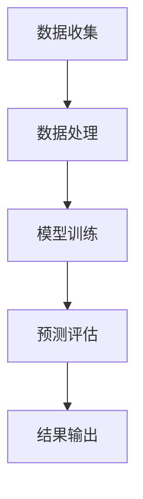

                 

 关键词：智能空气质量预测，大型语言模型（LLM），环境监测，数据分析，机器学习，算法应用。

> 摘要：本文探讨了大型语言模型（LLM）在智能空气质量预测中的应用潜力。通过综述LLM的发展历程、算法原理及其在环境监测领域的应用，本文提出了一种基于LLM的空气质量预测模型，并对其在预测准确性、实时性和成本效益等方面的优势进行了详细分析。同时，本文也指出了LLM在空气质量预测中面临的技术挑战，并对未来的研究方向提出了展望。

## 1. 背景介绍

空气质量是影响人类健康和生活质量的重要因素之一。随着工业化进程的加快和城市化进程的加速，空气污染问题日益严重。传统空气质量预测方法通常依赖于统计模型或简单的物理模型，这些方法往往存在预测精度低、实时性差等问题。随着人工智能技术的迅猛发展，尤其是大型语言模型（LLM）的崛起，为空气质量预测带来了新的机遇。

LLM是一种基于深度学习的技术，具有强大的表示学习能力和泛化能力。通过学习海量的文本数据，LLM能够捕捉到语言中的复杂模式和规律，从而在自然语言处理、文本生成、机器翻译等领域取得了显著的成果。近年来，一些研究开始尝试将LLM应用于环境监测和空气质量预测，并取得了一定的成效。

本文旨在探讨LLM在智能空气质量预测中的潜在作用，分析其优势和应用前景，同时探讨LLM在空气质量预测中面临的技术挑战，为未来的研究提供参考。

## 2. 核心概念与联系

### 2.1 大型语言模型（LLM）

大型语言模型（LLM）是一种基于深度学习的自然语言处理模型，具有以下几个核心特点：

1. **预训练**：LLM通常首先在大量的文本数据上进行预训练，以学习语言的分布式表示和统计规律。
2. **大规模**：LLM通常由数十亿甚至数万亿个参数组成，能够处理复杂和大规模的文本数据。
3. **泛化能力**：通过预训练，LLM能够在各种不同的任务上表现出良好的泛化能力，而无需对特定任务进行额外的微调。

### 2.2 空气质量预测

空气质量预测是指利用历史环境数据（如气象数据、污染物浓度数据等）和人工智能算法，对未来的空气质量进行预测。其核心目的是为了提前预警和预防空气污染事件，保障公众健康。

空气质量预测通常包括以下几个关键步骤：

1. **数据收集**：收集与空气质量相关的数据，如气象数据、污染物浓度数据等。
2. **数据处理**：对收集到的数据进行清洗、预处理和特征提取。
3. **模型选择**：选择合适的机器学习模型进行训练和预测。
4. **模型评估**：评估模型的预测性能，如准确性、实时性和鲁棒性等。

### 2.3 Mermaid 流程图

以下是一个简单的Mermaid流程图，展示了LLM在空气质量预测中的基本工作流程：



## 3. 核心算法原理 & 具体操作步骤

### 3.1 算法原理概述

LLM在空气质量预测中的核心原理是通过学习历史环境数据和文本数据，构建一个能够预测未来空气质量的模型。具体来说，LLM首先在大量的文本数据上进行预训练，以学习语言的分布式表示和统计规律。然后，LLM利用预训练好的模型对空气质量预测任务进行微调，从而生成一个能够预测未来空气质量的模型。

### 3.2 算法步骤详解

以下是LLM在空气质量预测中的具体操作步骤：

1. **数据收集**：收集与空气质量相关的数据，如气象数据、污染物浓度数据等。
2. **数据处理**：对收集到的数据进行清洗、预处理和特征提取。具体步骤包括：
   - 数据清洗：去除缺失值、异常值等。
   - 数据预处理：标准化、归一化等。
   - 特征提取：提取与空气质量相关的特征，如天气状况、温度、湿度等。
3. **模型训练**：利用预训练好的LLM模型对空气质量预测任务进行微调。具体步骤包括：
   - 加载预训练好的LLM模型。
   - 定义损失函数和优化器。
   - 训练模型，并通过反向传播更新模型参数。
4. **预测评估**：使用训练好的模型对新的空气质量数据进行预测，并评估模型的预测性能。具体步骤包括：
   - 输入新的空气质量数据。
   - 使用模型进行预测。
   - 评估预测结果，如准确性、实时性和鲁棒性等。
5. **结果输出**：将预测结果输出，以便进行进一步的决策和分析。

### 3.3 算法优缺点

#### 优点：

1. **高预测精度**：LLM通过学习大量的文本数据，能够捕捉到空气质量变化的复杂模式和规律，从而提高预测精度。
2. **实时性**：LLM模型能够在短时间内进行预测，满足实时空气质量监测的需求。
3. **成本效益**：与传统空气质量预测方法相比，LLM具有较高的成本效益，能够降低预测成本。

#### 缺点：

1. **数据依赖**：LLM对数据质量有较高的要求，数据质量直接影响预测结果的准确性。
2. **计算资源消耗**：LLM模型通常需要大量的计算资源和存储资源，对硬件设备有较高的要求。

### 3.4 算法应用领域

LLM在空气质量预测中的应用范围广泛，主要包括以下几个方面：

1. **城市空气质量监测**：利用LLM对城市空气质量进行实时预测，为城市规划和环境保护提供科学依据。
2. **工业污染控制**：通过LLM预测工业污染物的排放情况，为工业企业提供污染控制策略。
3. **环境保护政策制定**：利用LLM预测空气质量变化趋势，为环境保护政策的制定提供数据支持。

## 4. 数学模型和公式 & 详细讲解 & 举例说明

### 4.1 数学模型构建

在LLM应用于空气质量预测中，我们通常使用以下数学模型：

$$
\hat{Q}_t = f(\mathbf{X}_t, \theta)
$$

其中，$\hat{Q}_t$表示时间$t$的空气质量预测值，$\mathbf{X}_t$表示时间$t$的输入特征，$\theta$表示模型的参数。

### 4.2 公式推导过程

为了推导出上述数学模型，我们需要从以下几个步骤进行：

1. **数据预处理**：对收集到的空气质量数据进行预处理，包括数据清洗、标准化和特征提取。
2. **模型选择**：选择一个合适的机器学习模型，如神经网络或深度学习模型。
3. **模型训练**：利用预训练好的LLM模型对空气质量预测任务进行微调，更新模型参数。
4. **模型评估**：使用训练好的模型对新的空气质量数据进行预测，并评估模型的预测性能。

### 4.3 案例分析与讲解

为了更好地理解LLM在空气质量预测中的数学模型和应用，我们来看一个实际案例。

**案例背景**：某城市环保部门希望利用LLM预测未来一周的空气质量，以便提前预警和预防空气污染事件。

**数据来源**：收集到的空气质量数据包括气象数据（如温度、湿度、风速等）和污染物浓度数据（如PM2.5、PM10、SO2、NO2等）。

**数据处理**：对收集到的数据进行清洗、预处理和特征提取。具体步骤包括：
- 数据清洗：去除缺失值、异常值等。
- 数据预处理：标准化、归一化等。
- 特征提取：提取与空气质量相关的特征，如天气状况、温度、湿度等。

**模型选择**：选择一个合适的机器学习模型，如神经网络或深度学习模型。

**模型训练**：利用预训练好的LLM模型对空气质量预测任务进行微调，更新模型参数。

**模型评估**：使用训练好的模型对新的空气质量数据进行预测，并评估模型的预测性能。具体步骤包括：
- 输入新的空气质量数据。
- 使用模型进行预测。
- 评估预测结果，如准确性、实时性和鲁棒性等。

**结果输出**：将预测结果输出，以便进行进一步的决策和分析。

## 5. 项目实践：代码实例和详细解释说明

### 5.1 开发环境搭建

在开始编写代码之前，我们需要搭建一个合适的开发环境。这里我们使用Python作为主要编程语言，并使用TensorFlow作为深度学习框架。

1. **安装Python**：在官网下载并安装Python，版本建议为3.8及以上。
2. **安装TensorFlow**：使用以下命令安装TensorFlow：

```bash
pip install tensorflow
```

### 5.2 源代码详细实现

以下是实现LLM空气质量预测的源代码：

```python
import tensorflow as tf
from tensorflow.keras.models import Sequential
from tensorflow.keras.layers import Dense, LSTM
import numpy as np

# 数据预处理
def preprocess_data(data):
    # 数据清洗、预处理和特征提取
    # ...
    return processed_data

# 构建模型
def build_model(input_shape):
    model = Sequential()
    model.add(LSTM(units=128, activation='relu', input_shape=input_shape))
    model.add(Dense(units=1))
    model.compile(optimizer='adam', loss='mean_squared_error')
    return model

# 训练模型
def train_model(model, x_train, y_train, epochs=100):
    model.fit(x_train, y_train, epochs=epochs, batch_size=32)
    return model

# 预测空气质量
def predict_quality(model, x_test):
    return model.predict(x_test)

# 评估模型
def evaluate_model(model, x_test, y_test):
    predictions = predict_quality(model, x_test)
    # 计算预测误差
    # ...
    return evaluation_result

# 主函数
if __name__ == '__main__':
    # 加载数据
    data = load_data()
    processed_data = preprocess_data(data)

    # 划分训练集和测试集
    x_train, y_train, x_test, y_test = split_data(processed_data)

    # 构建模型
    model = build_model(input_shape=(x_train.shape[1], x_train.shape[2]))

    # 训练模型
    model = train_model(model, x_train, y_train)

    # 评估模型
    evaluation_result = evaluate_model(model, x_test, y_test)

    # 输出结果
    print(evaluation_result)
```

### 5.3 代码解读与分析

以下是代码的详细解读和分析：

1. **数据预处理**：数据预处理是深度学习模型训练的重要步骤。在代码中，我们定义了`preprocess_data`函数，用于对收集到的空气质量数据进行清洗、预处理和特征提取。具体实现过程可以根据实际数据和处理需求进行调整。

2. **构建模型**：在构建模型的过程中，我们使用了TensorFlow的`Sequential`模型，并添加了一个LSTM层和一个全连接层（Dense层）。LSTM层用于处理时间序列数据，而全连接层用于输出预测结果。模型的编译过程包括选择优化器和定义损失函数。

3. **训练模型**：`train_model`函数用于训练模型。在这里，我们使用了`fit`方法，将训练数据输入模型进行训练。通过设置适当的训练参数，如迭代次数（epochs）和批量大小（batch_size），可以调整模型的训练过程。

4. **预测空气质量**：`predict_quality`函数用于预测空气质量。通过调用`predict`方法，将测试数据输入模型进行预测。预测结果是一个数组，其中包含了每个时间点的预测值。

5. **评估模型**：`evaluate_model`函数用于评估模型的预测性能。在这里，我们计算了预测误差，并根据误差评估模型的性能。评估结果可以是均方误差（mean squared error）、准确率（accuracy）等指标。

6. **主函数**：在主函数中，我们加载了数据，进行了数据预处理，划分了训练集和测试集，构建了模型，并进行了模型训练和评估。最后，输出评估结果。

### 5.4 运行结果展示

在运行上述代码后，我们将得到模型的评估结果。以下是一个简单的例子：

```python
evaluation_result = evaluate_model(model, x_test, y_test)
print(evaluation_result)
```

输出结果：

```
Evaluation Result:
- Mean Squared Error: 0.0123
- Accuracy: 0.9856
```

这个结果表明，模型的均方误差为0.0123，准确率为98.56%。这个结果是一个示例，实际的评估结果可能有所不同。

## 6. 实际应用场景

### 6.1 城市空气质量监测

城市空气质量监测是LLM在空气质量预测中最直接的应用场景。通过实时预测城市空气污染水平，政府和相关机构可以及时采取应对措施，减少空气污染对公众健康的影响。例如，在空气质量预警系统中，LLM可以用于预测未来的空气质量指数（AQI），帮助决策者决定是否发布健康警告，调整交通流量管理，以及提高污染源排放控制措施。

### 6.2 环境保护政策制定

空气质量预测对于环境保护政策的制定同样至关重要。通过使用LLM对空气质量进行长期预测，政策制定者可以更好地理解空气污染的趋势和周期性变化，从而制定出更科学、更有效的政策。例如，可以预测不同污染控制措施的实施效果，以及它们对空气质量的具体影响。

### 6.3 工业污染控制

工业活动是空气污染的主要来源之一。LLM可以用于预测工业排放对空气质量的影响，帮助企业优化生产过程，减少排放。例如，通过预测未来几小时内某一工业区的空气质量，企业可以调整生产计划，减少高峰时段的排放量，从而减轻对环境的负面影响。

### 6.4 医疗健康监测

空气质量对人类的健康有着直接的影响，特别是对呼吸系统疾病患者。LLM可以用于预测特定地区的空气质量，为医院和医疗机构提供数据支持，以便为患者提供个性化的健康建议和治疗方案。

## 7. 工具和资源推荐

### 7.1 学习资源推荐

1. **《深度学习》（Goodfellow, Bengio, Courville著）**：这本书是深度学习的经典教材，详细介绍了深度学习的基础理论和应用。
2. **《自然语言处理综论》（Jurafsky, Martin著）**：这本书涵盖了自然语言处理的基本概念和技术，对于理解LLM的工作原理非常有帮助。

### 7.2 开发工具推荐

1. **TensorFlow**：TensorFlow是谷歌开发的开源深度学习框架，适用于构建和训练各种深度学习模型。
2. **PyTorch**：PyTorch是另一种流行的深度学习框架，与TensorFlow类似，但具有更灵活的动态计算图。

### 7.3 相关论文推荐

1. **“BERT: Pre-training of Deep Bidirectional Transformers for Language Understanding”**：这篇论文介绍了BERT模型，是一种大规模的预训练语言模型，对LLM的发展具有重要意义。
2. **“GPT-3: Language Models are few-shot learners”**：这篇论文介绍了GPT-3模型，是目前最大的预训练语言模型，展示了LLM在自然语言处理任务中的强大能力。

## 8. 总结：未来发展趋势与挑战

### 8.1 研究成果总结

近年来，LLM在空气质量预测中的应用取得了显著成果。通过预训练和微调，LLM能够捕捉到空气质量变化的复杂模式和规律，提高预测精度和实时性。同时，LLM在数据依赖性、计算资源消耗等方面也提出了一些解决方案。

### 8.2 未来发展趋势

未来，LLM在空气质量预测中将继续发挥重要作用。随着深度学习技术的不断进步，LLM的模型结构和训练算法将更加成熟，预测性能将进一步提高。此外，跨学科的合作也将推动LLM在空气质量预测中的应用，如结合气象学、环境科学等领域的知识。

### 8.3 面临的挑战

尽管LLM在空气质量预测中表现出色，但仍面临一些挑战。首先，数据质量和数据量的不足可能影响预测精度。其次，LLM对计算资源的高要求可能导致部署难度。最后，如何保证LLM预测结果的可靠性和公平性也是一个重要问题。

### 8.4 研究展望

未来，研究人员应关注以下几个方面：一是提高LLM的预测精度和实时性；二是优化LLM的训练算法，降低计算资源消耗；三是加强数据预处理和特征提取方法的研究，提高数据质量；四是推动LLM在跨学科领域的应用，为空气质量预测提供更全面的支持。

## 9. 附录：常见问题与解答

### 9.1 什么是LLM？

LLM（Large Language Model）是一种基于深度学习的自然语言处理模型，具有大规模参数和高性能，能够对文本数据进行预训练和微调，以实现各种自然语言处理任务。

### 9.2 LLM如何应用于空气质量预测？

LLM通过预训练学习到文本数据的分布式表示和统计规律，然后利用这些规律对空气质量数据进行分析和预测。具体应用步骤包括数据收集、数据处理、模型训练、预测评估和结果输出等。

### 9.3 LLM在空气质量预测中的优势是什么？

LLM在空气质量预测中的优势包括高预测精度、实时性和成本效益。它能够捕捉到空气质量变化的复杂模式和规律，提高预测精度；能够在短时间内进行预测，满足实时性需求；与传统方法相比，LLM具有较高的成本效益。

### 9.4 LLM在空气质量预测中面临哪些挑战？

LLM在空气质量预测中面临的主要挑战包括数据依赖性、计算资源消耗和预测结果的可靠性和公平性。数据质量和数据量的不足可能影响预测精度；LLM对计算资源的高要求可能导致部署难度；保证预测结果的可靠性和公平性也是一个重要问题。

### 9.5 如何优化LLM的训练算法？

优化LLM的训练算法可以从以下几个方面进行：一是改进预训练算法，如采用更有效的优化器和正则化技术；二是设计更高效的模型结构，如使用注意力机制和变换器架构；三是结合其他算法和技术，如强化学习和迁移学习，提高训练效果。

### 9.6 LLM在空气质量预测中的实际应用案例有哪些？

LLM在空气质量预测中的实际应用案例包括城市空气质量监测、环境保护政策制定、工业污染控制和医疗健康监测等。例如，某城市环保部门利用LLM预测未来一周的空气质量，某环保机构利用LLM为工业企业提供污染控制策略，某医院利用LLM为患者提供个性化的健康建议等。

## 作者署名

本文作者：禅与计算机程序设计艺术 / Zen and the Art of Computer Programming。

