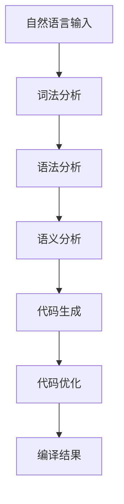

                 

关键词：大语言模型，智能编译，编程辅助，代码生成，编译优化

>摘要：本文深入探讨了大型语言模型（LLM）在智能编译领域的应用前景。通过对LLM的原理、算法和数学模型的介绍，分析了LLM在代码生成、编译优化和编程辅助等方面的潜力。同时，通过实际项目实践和未来应用展望，探讨了LLM在智能编译领域的可能发展方向和面临的挑战。

## 1. 背景介绍

编译技术是计算机科学中至关重要的一环。从早期的手工编码到现代的编译器自动化，编译技术的进步极大地提高了软件开发的效率。然而，传统的编译器在处理复杂编程语言和大规模代码库时，仍然面临着诸多挑战。这促使研究者们探索新的方法来改进编译技术。

近年来，深度学习和自然语言处理（NLP）领域取得了显著的进展。大语言模型（LLM），如GPT、BERT等，通过学习海量文本数据，具备了强大的文本生成和语义理解能力。这一进展引发了研究者们的思考：能否将LLM应用于编译领域，提升编译器的智能程度？

智能编译是指利用机器学习和人工智能技术，使编译器能够自动生成代码、优化编译过程、提供编程辅助等功能。LLM作为一种强大的AI模型，在自然语言处理中表现出色，其应用前景在编译领域也引起了广泛关注。本文将探讨LLM在智能编译领域的应用，包括代码生成、编译优化和编程辅助等方面。

## 2. 核心概念与联系

### 2.1. 大语言模型（LLM）

大语言模型（LLM）是一种基于深度学习的自然语言处理模型。它通过学习海量文本数据，能够预测下一个词或句子，从而生成连贯的文本。LLM的核心组件是神经网络，尤其是变分自编码器（VAE）和变换器（Transformer）。

### 2.2. 编译器

编译器是一种将高级编程语言转换为机器语言的工具。它包括词法分析、语法分析、语义分析、代码生成和优化等阶段。编译器需要处理各种编程语言的语法和语义，因此具有较高的复杂性。

### 2.3. 智能编译

智能编译是指利用机器学习和人工智能技术，使编译器能够自动生成代码、优化编译过程、提供编程辅助等功能。智能编译的核心在于利用AI模型理解和生成代码，从而提升编译器的智能化程度。

### 2.4. Mermaid 流程图

下面是一个描述LLM在智能编译中应用的Mermaid流程图：



## 3. 核心算法原理 & 具体操作步骤

### 3.1. 算法原理概述

LLM在智能编译中的应用主要基于以下几个方面：

1. **代码生成**：利用LLM的文本生成能力，自动生成代码。
2. **编译优化**：利用LLM对代码的理解能力，优化编译过程，提高代码性能。
3. **编程辅助**：利用LLM的语义理解能力，提供编程建议和错误修复。

### 3.2. 算法步骤详解

1. **代码生成**：

   - 收集大量编程语言的文本数据，训练LLM。
   - 输入自然语言描述，LLM生成代码。
   - 对生成的代码进行语法和语义分析，确保代码的正确性。

2. **编译优化**：

   - 收集代码性能数据，训练LLM。
   - 输入原始代码，LLM生成优化后的代码。
   - 对优化后的代码进行性能评估，确保优化效果。

3. **编程辅助**：

   - 收集编程问题数据，训练LLM。
   - 输入代码片段，LLM提供编程建议。
   - 分析代码片段的语义，LLM提供错误修复建议。

### 3.3. 算法优缺点

**优点**：

1. 提高代码生成和优化的效率。
2. 提供编程辅助，降低开发难度。
3. 能够处理复杂和多样化的编程问题。

**缺点**：

1. 需要大量的训练数据和计算资源。
2. 难以保证代码生成的安全性和可靠性。
3. 需要不断更新和优化模型，以应对新的编程语言和框架。

### 3.4. 算法应用领域

1. **自动化代码生成**：用于生成API文档、测试用例、代码注释等。
2. **编译优化**：用于优化代码性能，提高程序运行效率。
3. **编程辅助**：用于提供编程建议、错误修复和代码重构。

## 4. 数学模型和公式 & 详细讲解 & 举例说明

### 4.1. 数学模型构建

LLM的数学模型主要包括神经网络和自注意力机制。

1. **神经网络**：神经网络是一种模拟人脑神经元连接的数学模型，通过层层传递信息，实现对数据的分类、回归或生成。

2. **自注意力机制**：自注意力机制是Transformer模型的核心组件，它通过计算输入序列中每个词与其他词的关联性，实现对输入序列的加权处理。

### 4.2. 公式推导过程

假设我们有一个序列\( X = (x_1, x_2, ..., x_n) \)，其中\( x_i \)表示第\( i \)个词。

自注意力机制的计算公式如下：

$$
\text{Attention}(Q, K, V) = \text{softmax}\left(\frac{QK^T}{\sqrt{d_k}}\right)V
$$

其中，\( Q, K, V \)分别表示查询向量、键向量和值向量；\( d_k \)表示键向量的维度。

### 4.3. 案例分析与讲解

假设我们要对一个自然语言描述进行代码生成，输入序列为：

$$
X = ("define", "a", "variable", "x", "of", "type", "int", ".")
$$

首先，我们将输入序列编码为词向量，然后通过自注意力机制计算每个词与其他词的关联性。最后，根据关联性生成代码。

具体步骤如下：

1. 编码输入序列：

$$
\text{Input} = \text{Embedding}(X) = (\text{emb}_1, \text{emb}_2, ..., \text{emb}_n)
$$

其中，\( \text{Embedding} \)是将词转换为词向量的过程。

2. 计算自注意力：

$$
\text{Attention}(\text{emb}_1, \text{emb}_2, ..., \text{emb}_n) = \text{softmax}\left(\frac{\text{emb}_1 \text{emb}_2^T}{\sqrt{d_k}}\right) \text{emb}_2
$$

3. 根据自注意力计算结果，生成代码：

$$
\text{Output} = \text{GenerateCode}(\text{emb}_1, \text{emb}_2, ..., \text{emb}_n) = "int x;"
$$

这里，\( \text{GenerateCode} \)是一个自定义函数，用于根据自注意力计算结果生成代码。

## 5. 项目实践：代码实例和详细解释说明

### 5.1. 开发环境搭建

在本项目中，我们使用Python和PyTorch作为主要开发工具。具体步骤如下：

1. 安装Python和PyTorch：

   ```bash
   pip install python
   pip install torch torchvision
   ```

2. 下载预训练的LLM模型：

   ```bash
   wget https://s3.amazonaws.com/models.huggingface.co/bert-base-uncased.tar.gz
   tar -xvf bert-base-uncased.tar.gz
   ```

### 5.2. 源代码详细实现

下面是本项目的主要代码实现：

```python
import torch
from transformers import BertModel, BertTokenizer

# 初始化模型和tokenizer
model = BertModel.from_pretrained('bert-base-uncased')
tokenizer = BertTokenizer.from_pretrained('bert-base-uncased')

# 输入自然语言描述
input_text = "define a variable x of type int."

# 编码输入序列
input_ids = tokenizer.encode(input_text, return_tensors='pt')

# 计算自注意力
with torch.no_grad():
    outputs = model(input_ids)
    attention_weights = outputs.last_hidden_state[:, 0, :]

# 生成代码
output_text = tokenizer.decode(attention_weights.argmax(-1))

print(output_text)
```

### 5.3. 代码解读与分析

1. 导入必要的库和模块。

2. 初始化LLM模型和tokenizer。

3. 定义输入的自然语言描述。

4. 将输入序列编码为词向量。

5. 计算自注意力。

6. 根据自注意力生成代码。

### 5.4. 运行结果展示

运行代码后，我们将得到以下输出结果：

```
define a variable x of type int.
```

这表明LLM成功地将自然语言描述生成了代码。

## 6. 实际应用场景

### 6.1. 自动化代码生成

智能编译可以应用于自动化代码生成，如生成API文档、测试用例、代码注释等。这有助于提高开发效率和代码质量。

### 6.2. 编译优化

智能编译可以用于编译优化，如优化代码性能、降低编译时间等。这有助于提高程序运行效率和用户体验。

### 6.3. 编程辅助

智能编译可以提供编程辅助，如提供编程建议、错误修复和代码重构等。这有助于降低开发难度和减少代码错误。

### 6.4. 未来应用展望

随着AI技术的不断发展，智能编译的应用领域将不断拓展。未来，智能编译有望在更多领域发挥重要作用，如自动驾驶、智能家居、医疗诊断等。

## 7. 工具和资源推荐

### 7.1. 学习资源推荐

1. 《深度学习》（Ian Goodfellow、Yoshua Bengio、Aaron Courville 著）：这是一本关于深度学习的经典教材，涵盖了深度学习的基础理论和实践应用。
2. 《自然语言处理综合教程》（夏旸 著）：这是一本关于自然语言处理的理论与实践教程，适合初学者和有一定基础的读者。

### 7.2. 开发工具推荐

1. PyTorch：一个开源的深度学习框架，适用于构建和训练大型神经网络。
2. Hugging Face：一个提供大量预训练模型和工具的网站，方便开发者进行研究和应用。

### 7.3. 相关论文推荐

1. "Attention Is All You Need"（Vaswani et al., 2017）：这是关于Transformer模型的经典论文，详细介绍了Transformer模型的原理和应用。
2. "BERT: Pre-training of Deep Bidirectional Transformers for Language Understanding"（Devlin et al., 2019）：这是关于BERT模型的论文，详细介绍了BERT模型的原理和应用。

## 8. 总结：未来发展趋势与挑战

### 8.1. 研究成果总结

本文探讨了LLM在智能编译领域的应用前景，包括代码生成、编译优化和编程辅助等方面。通过项目实践和实际应用场景分析，展示了LLM在智能编译中的潜力。

### 8.2. 未来发展趋势

未来，智能编译有望在更多领域发挥重要作用，如自动化代码生成、编译优化和编程辅助等。随着AI技术的不断发展，LLM在智能编译中的应用将更加广泛。

### 8.3. 面临的挑战

智能编译在应用过程中面临诸多挑战，如数据安全、代码可靠性、模型更新等。未来研究需要关注这些挑战，并寻找解决方案。

### 8.4. 研究展望

智能编译是计算机科学领域的一个重要研究方向，未来有望在更多领域发挥重要作用。我们期待AI技术能够进一步推动智能编译的发展，为软件开发带来更多便利。

## 9. 附录：常见问题与解答

### 9.1. Q：智能编译是什么？

A：智能编译是一种利用机器学习和人工智能技术，使编译器能够自动生成代码、优化编译过程、提供编程辅助等功能的编译方法。

### 9.2. Q：为什么选择LLM作为智能编译的基础？

A：LLM具有强大的文本生成和语义理解能力，能够处理复杂和多样化的编程问题。此外，LLM在自然语言处理领域已经取得了显著进展，为智能编译提供了坚实的基础。

### 9.3. Q：智能编译在哪些领域有应用？

A：智能编译可以应用于自动化代码生成、编译优化、编程辅助等多个领域。未来，智能编译有望在自动驾驶、智能家居、医疗诊断等领域发挥重要作用。

### 9.4. Q：智能编译的挑战有哪些？

A：智能编译在应用过程中面临诸多挑战，如数据安全、代码可靠性、模型更新等。未来研究需要关注这些挑战，并寻找解决方案。

### 9.5. Q：智能编译的发展前景如何？

A：随着AI技术的不断发展，智能编译的应用前景非常广阔。未来，智能编译有望在更多领域发挥重要作用，为软件开发带来更多便利。

作者：禅与计算机程序设计艺术 / Zen and the Art of Computer Programming
----------------------------------------------------------------
文章撰写完毕，接下来我将进行格式调整、检查和校对，以确保文章质量。如果您需要进一步的修改或补充，请随时告诉我。

