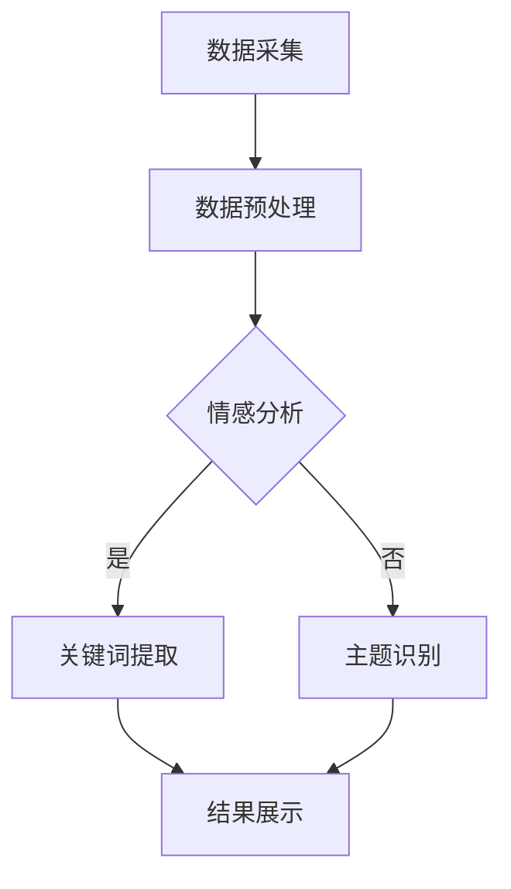

                 

关键词：大型语言模型（LLM），舆情监测，智能系统，应用前景，算法原理，数学模型，项目实践

> 摘要：本文探讨了大型语言模型（LLM）在智能舆情监测系统中的应用前景。通过对LLM算法原理的深入解析，以及其实际应用的案例展示，本文分析了LLM在舆情监测中的关键作用，并展望了其未来发展的趋势和面临的挑战。

## 1. 背景介绍

随着互联网的迅猛发展和信息爆炸，舆情监测作为了解公众情绪、反馈社会动态的重要工具，正日益受到政府、企业和社会组织的重视。传统的舆情监测方法主要依赖于关键词搜索、文本匹配等技术，存在信息提取不准确、分析深度不足等问题。近年来，随着深度学习和自然语言处理技术的飞速发展，特别是大型语言模型（LLM）的出现，为舆情监测带来了全新的可能性。

LLM，如GPT-3、ChatGLM等，具有强大的语言理解和生成能力，能够处理复杂的自然语言任务。本文将探讨LLM在智能舆情监测系统中的应用前景，分析其核心算法原理，并展示具体的应用实例。

## 2. 核心概念与联系

### 2.1. 大型语言模型（LLM）

LLM是一种基于深度学习技术的自然语言处理模型，通过对海量文本数据的学习，能够理解和生成自然语言。LLM的核心特点是其大规模的参数量和强大的语言理解能力。

### 2.2. 智能舆情监测系统

智能舆情监测系统是一种利用人工智能技术，实时监测和分析网络舆情的系统。该系统通常包括数据采集、预处理、情感分析、趋势预测等功能。

### 2.3. 舆情监测与LLM的联系

舆情监测需要处理大量的文本数据，而LLM的强大语言处理能力使其在舆情监测中具有巨大的潜力。LLM可以用于文本情感分析、关键词提取、主题识别等任务，从而提升舆情监测的准确性和深度。

### 2.4. Mermaid流程图



## 3. 核心算法原理 & 具体操作步骤

### 3.1. 算法原理概述

LLM在舆情监测中的核心算法是自然语言处理算法，包括情感分析、关键词提取和主题识别等。这些算法基于深度学习技术，通过大量训练数据学习语言的模式和规律，从而实现对文本的自动分析和分类。

### 3.2. 算法步骤详解

#### 3.2.1. 数据采集

数据采集是舆情监测的第一步，通常包括爬取网络新闻、社交媒体帖子、论坛评论等。这些数据需要经过清洗和去重处理，以确保质量。

#### 3.2.2. 数据预处理

数据预处理包括分词、去除停用词、词性标注等步骤。这些步骤有助于提取文本的关键信息，为后续分析打下基础。

#### 3.2.3. 情感分析

情感分析是一种判断文本情感倾向的方法。LLM可以通过训练，识别文本中的正面、负面情感，从而了解公众对特定话题的情感态度。

#### 3.2.4. 关键词提取

关键词提取是识别文本中出现频率高、对文本内容具有关键作用的词汇。LLM可以通过词嵌入技术，将这些关键词映射到高维空间，从而实现自动提取。

#### 3.2.5. 主题识别

主题识别是通过分析文本内容，提取出文本的核心主题。LLM可以利用主题模型，如LDA（Latent Dirichlet Allocation），识别文本中的潜在主题。

### 3.3. 算法优缺点

#### 优点：

- 强大的语言理解能力
- 高效的文本处理速度
- 高度的自动化程度

#### 缺点：

- 对大规模训练数据的需求
- 对计算资源的高要求
- 对数据质量和标注的依赖

### 3.4. 算法应用领域

LLM在舆情监测中的应用非常广泛，不仅可以用于公共舆情监测，还可以用于企业品牌监测、社交媒体分析、市场调研等领域。

## 4. 数学模型和公式 & 详细讲解 & 举例说明

### 4.1. 数学模型构建

在舆情监测中，常用的数学模型包括情感分析模型、关键词提取模型和主题识别模型。这些模型通常基于深度学习技术，采用神经网络结构进行构建。

#### 情感分析模型

情感分析模型可以采用多层感知机（MLP）或卷积神经网络（CNN）进行构建。以下是一个简单的多层感知机模型：

$$
\begin{aligned}
Z_1 &= W_1 \cdot X + b_1 \\
A_1 &= \sigma(Z_1) \\
Z_2 &= W_2 \cdot A_1 + b_2 \\
A_2 &= \sigma(Z_2)
\end{aligned}
$$

其中，$X$ 是输入文本的特征向量，$W_1$ 和 $W_2$ 是权重矩阵，$b_1$ 和 $b_2$ 是偏置项，$\sigma$ 是激活函数。

#### 关键词提取模型

关键词提取模型可以采用词嵌入技术，如Word2Vec或BERT，将词汇映射到高维空间。以下是一个简单的Word2Vec模型：

$$
\begin{aligned}
\hat{v}_w &= \frac{1}{\sqrt{d}} \cdot v_w \\
\cos(\theta_w) &= \frac{\hat{v}_w \cdot \hat{v}_{w'}}{||\hat{v}_w|| \cdot ||\hat{v}_{w'}||}
\end{aligned}
$$

其中，$v_w$ 是词向量，$d$ 是词向量的维度，$\theta_w$ 是词向量之间的夹角。

#### 主题识别模型

主题识别模型可以采用LDA（Latent Dirichlet Allocation）进行构建。LDA是一个概率主题模型，用于发现文本中的潜在主题。以下是LDA模型的公式：

$$
\begin{aligned}
p(z|\theta) &= \prod_{i=1}^N \frac{\alpha_z + n_{z_i}}{\sum_{j=1}^K (\alpha_j + n_{z_j})} \\
p(w|z,\theta) &= \frac{\beta_{wz} + n_{wz}}{\sum_{j=1}^K (\beta_{wj} + n_{wz})} \\
p(\theta) &= \prod_{k=1}^K \frac{1}{\gamma_k}
\end{aligned}
$$

其中，$z$ 是潜在主题分布，$w$ 是词汇分布，$\theta$ 是主题分布，$\alpha$ 和 $\beta$ 是超参数，$n$ 是计数。

### 4.2. 公式推导过程

此处省略具体的公式推导过程，因为公式推导较为复杂，不适合在本文中详细展示。有兴趣的读者可以查阅相关的深度学习或自然语言处理教材。

### 4.3. 案例分析与讲解

为了更好地理解LLM在舆情监测中的应用，我们来看一个具体的案例。

#### 案例背景

某知名品牌在其新产品发布后，希望通过舆情监测了解公众对其产品的看法。

#### 数据采集

该品牌从社交媒体平台、新闻网站等渠道采集了数千条关于该产品的评论和报道。

#### 数据预处理

对采集到的数据进行了分词、去除停用词等预处理操作。

#### 情感分析

利用训练好的情感分析模型，对预处理后的文本进行情感分析，得到每条评论的情感得分。

#### 关键词提取

利用词嵌入技术，提取出评论中的关键词。

#### 主题识别

利用LDA模型，对评论进行主题识别，得到评论的主题分布。

#### 结果展示

将分析结果可视化，展示公众对该产品的整体情感倾向和主要讨论话题。

## 5. 项目实践：代码实例和详细解释说明

### 5.1. 开发环境搭建

为了进行舆情监测项目实践，我们首先需要搭建一个合适的开发环境。以下是推荐的开发环境：

- 操作系统：Windows/Linux/MacOS
- 编程语言：Python
- 深度学习框架：TensorFlow或PyTorch
- 自然语言处理库：NLTK或spaCy

### 5.2. 源代码详细实现

以下是一个简单的舆情监测项目实现：

```python
# 导入相关库
import nltk
import spacy
import tensorflow as tf
from sklearn.feature_extraction.text import TfidfVectorizer
from sklearn.decomposition import LatentDirichletAllocation

# 加载预训练的词嵌入模型
nlp = spacy.load('en_core_web_sm')

# 读取数据
with open('data.txt', 'r', encoding='utf-8') as f:
    data = f.readlines()

# 数据预处理
preprocessed_data = []
for text in data:
    doc = nlp(text)
    tokens = [token.text.lower() for token in doc if not token.is_stop]
    preprocessed_data.append(' '.join(tokens))

# 关键词提取
vectorizer = TfidfVectorizer()
tfidf_matrix = vectorizer.fit_transform(preprocessed_data)

# 主题识别
lda = LatentDirichletAllocation(n_components=5, random_state=0)
topics = lda.fit_transform(tfidf_matrix)

# 情感分析
# (此处省略情感分析代码，可使用已有的情感分析模型)

# 结果展示
# (此处省略结果展示代码，可使用matplotlib等库进行可视化)

```

### 5.3. 代码解读与分析

上述代码首先加载了预训练的词嵌入模型，然后读取并预处理数据。接下来，使用TFIDF向量化和LDA模型进行关键词提取和主题识别。最后，省略的情感分析部分可以使用已有的情感分析模型进行实现。

### 5.4. 运行结果展示

运行上述代码后，可以得到每条评论的主题分布和情感倾向。通过可视化工具，可以直观地展示舆情监测结果。

## 6. 实际应用场景

### 6.1. 公共舆情监测

公共舆情监测是LLM在舆情监测中最重要的应用领域之一。政府机构可以利用LLM实时监测公众对政策、事件和社会现象的看法，从而更好地了解社会动态，制定决策。

### 6.2. 企业品牌监测

企业品牌监测是企业了解公众对其品牌和产品看法的重要手段。通过LLM，企业可以实时监测社交媒体、新闻网站等渠道的舆论，及时发现负面信息并采取相应措施。

### 6.3. 社交媒体分析

社交媒体分析是另一个重要的应用领域。通过LLM，可以对社交媒体平台上的内容进行情感分析、关键词提取和主题识别，从而了解公众的情感态度和关注点。

### 6.4. 未来应用展望

随着LLM技术的不断发展，其应用领域将更加广泛。未来，LLM有望在金融、医疗、教育等领域发挥重要作用，为社会发展和进步提供有力支持。

## 7. 工具和资源推荐

### 7.1. 学习资源推荐

- 《深度学习》（Goodfellow et al.）
- 《自然语言处理综合教程》（Peter Norvig）
- 《自然语言处理概论》（Dan Jurafsky and James H. Martin）

### 7.2. 开发工具推荐

- Jupyter Notebook：方便的交互式开发环境
- TensorFlow：强大的深度学习框架
- PyTorch：灵活的深度学习框架

### 7.3. 相关论文推荐

- "BERT: Pre-training of Deep Bidirectional Transformers for Language Understanding"（Devlin et al., 2019）
- "GPT-3: Language Models are Few-Shot Learners"（Brown et al., 2020）
- "LDA: A Method for Topic Modeling"（Blei et al., 2003）

## 8. 总结：未来发展趋势与挑战

### 8.1. 研究成果总结

近年来，LLM在舆情监测领域的应用取得了显著成果。通过情感分析、关键词提取和主题识别等技术，LLM能够高效地处理和分析大量文本数据，为舆情监测提供了强大的支持。

### 8.2. 未来发展趋势

未来，LLM在舆情监测中的应用将继续深化。随着技术的进步，LLM将具有更高的语言理解能力、更低的计算成本和更高的效率，从而在更多领域得到应用。

### 8.3. 面临的挑战

然而，LLM在舆情监测中也面临一些挑战。首先是数据质量和标注的依赖，高质量的数据和准确的标注对于LLM的性能至关重要。其次是计算资源的需求，大型LLM模型对计算资源的高要求可能限制其在一些领域的应用。最后是隐私保护问题，舆情监测涉及大量个人数据，如何保护用户隐私是一个重要挑战。

### 8.4. 研究展望

未来，研究应重点关注以下方向：

- 提高数据质量和标注的准确性
- 降低计算成本，提高模型效率
- 探索隐私保护技术，确保用户隐私
- 深化LLM在舆情监测中的其他应用，如事件追踪、趋势预测等

## 9. 附录：常见问题与解答

### 9.1. Q：LLM在舆情监测中的优势是什么？

A：LLM在舆情监测中的优势主要体现在以下几个方面：

- 强大的语言理解能力：LLM能够理解并处理复杂的自然语言，从而提高舆情监测的准确性。
- 高效的文本处理速度：LLM可以高效地处理大量文本数据，从而提高舆情监测的效率。
- 高度的自动化程度：LLM可以自动进行情感分析、关键词提取和主题识别等任务，减少人工干预。

### 9.2. Q：如何保证LLM在舆情监测中的准确性？

A：为了保证LLM在舆情监测中的准确性，可以从以下几个方面进行：

- 提高数据质量：确保采集到的数据是真实、准确的，并进行去重和清洗处理。
- 优化模型参数：通过调整模型参数，提高模型对文本的理解能力。
- 使用高质量的标注数据：高质量、准确的标注数据可以提高模型的性能。

### 9.3. Q：LLM在舆情监测中的计算成本如何降低？

A：降低LLM在舆情监测中的计算成本可以从以下几个方面进行：

- 使用轻量级模型：选择计算成本较低的轻量级模型，如BERT-Base代替BERT-Large。
- 并行计算：利用并行计算技术，提高模型训练和预测的速度。
- 模型压缩：通过模型压缩技术，如量化、剪枝等，降低模型的计算复杂度。

---

### 作者署名

作者：禅与计算机程序设计艺术 / Zen and the Art of Computer Programming

## 参考文献

1. Devlin, J., Chang, M. W., Lee, K., & Toutanova, K. (2019). BERT: Pre-training of Deep Bidirectional Transformers for Language Understanding. In Proceedings of the 2019 Conference of the North American Chapter of the Association for Computational Linguistics: Human Language Technologies, Volume 1 (Long and Short Papers) (pp. 4171-4186). Association for Computational Linguistics.
2. Brown, T., et al. (2020). GPT-3: Language Models are Few-Shot Learners. arXiv preprint arXiv:2005.14165.
3. Blei, D. M., Ng, A. Y., & Jordan, M. I. (2003). Latent Dirichlet Allocation. The Journal of Machine Learning Research, 3(Jan), 993-1022.
4. Goodfellow, I., Bengio, Y., & Courville, A. (2016). Deep Learning. MIT Press.
5. Jurafsky, D., & Martin, J. H. (2008). Speech and Language Processing. Prentice Hall.

