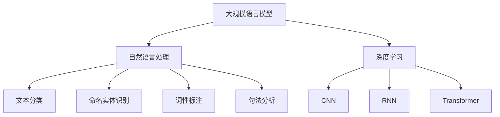

                 

### 1. 背景介绍

智能问答系统是人工智能（AI）领域的一项重要应用，旨在通过机器学习技术和自然语言处理（NLP）算法，实现人与计算机之间的智能交互。随着深度学习技术的不断发展和大规模语言模型的广泛应用，智能问答系统的性能和用户体验得到了显著提升。其中，大规模语言模型（LLM）作为智能问答系统的核心组件，扮演着至关重要的角色。

LLM，即大规模语言模型，是一种基于神经网络的语言模型，通过对海量文本数据进行训练，能够捕捉到语言中的复杂规律和模式。近年来，随着计算能力的提升和数据的爆炸式增长，LLM在自然语言处理领域取得了显著的成果。BERT（Bidirectional Encoder Representations from Transformers）、GPT（Generative Pre-trained Transformer）等代表性模型的出现，使得LLM在生成式对话系统、文本分类、机器翻译等任务上表现出了强大的能力。

智能问答系统作为一种面向用户需求的智能服务，具有广泛的应用场景，如智能客服、在线教育、医疗咨询、金融咨询等。这些系统通过接收用户的查询，自动生成有针对性的回答，提供个性化服务。随着用户需求的不断升级，传统的基于规则和模板匹配的方法已经无法满足需求，智能问答系统逐渐转向使用LLM来提升回答的准确性和自然性。

本文旨在探讨LLM在智能问答系统中的角色，分析LLM的优势和挑战，并探讨未来智能问答系统的发展趋势。文章将分为以下几个部分：

1. 背景介绍
2. 核心概念与联系
3. 核心算法原理 & 具体操作步骤
4. 数学模型和公式 & 详细讲解 & 举例说明
5. 项目实践：代码实例和详细解释说明
6. 实际应用场景
7. 工具和资源推荐
8. 总结：未来发展趋势与挑战

通过以上内容，我们希望能够为读者提供一个全面、深入的LLM在智能问答系统中的应用分析。

### 2. 核心概念与联系

在深入探讨LLM在智能问答系统中的应用之前，我们需要了解几个核心概念：大规模语言模型（LLM）、自然语言处理（NLP）、深度学习（DL）等。这些概念之间有着紧密的联系，共同构成了智能问答系统的理论基础。

#### 2.1 大规模语言模型（LLM）

大规模语言模型（LLM）是一种基于深度学习的语言处理模型，通过在海量文本数据上进行训练，能够理解和生成自然语言。LLM的核心思想是利用神经网络模型（如Transformer）捕捉到文本数据中的长程依赖和语义信息。其中，BERT（Bidirectional Encoder Representations from Transformers）和GPT（Generative Pre-trained Transformer）是两种最常用的LLM模型。

BERT模型采用双向Transformer架构，通过对文本的左右两个方向进行编码，从而捕捉到丰富的上下文信息。这使得BERT在多项NLP任务中取得了显著的成果，如文本分类、情感分析、命名实体识别等。

GPT模型则是一种生成式模型，通过自回归的方式生成文本。GPT-3作为GPT系列的最新版本，具有超过1750亿个参数，能够生成高质量的自然语言文本，广泛应用于聊天机器人、内容生成、问答系统等场景。

#### 2.2 自然语言处理（NLP）

自然语言处理（NLP）是人工智能（AI）领域的一个重要分支，旨在使计算机能够理解和处理人类自然语言。NLP涉及多个子领域，包括文本分类、命名实体识别、词性标注、句法分析等。这些子领域共同构成了智能问答系统的数据处理基础。

文本分类是NLP中的一项基础任务，旨在将文本数据归类到预定义的类别中。在智能问答系统中，文本分类有助于快速识别用户的查询意图，从而生成相应的回答。

命名实体识别则是识别文本中的特定实体，如人名、地名、组织名等。在智能问答系统中，命名实体识别有助于精准理解用户查询中的关键信息，提高回答的准确性。

词性标注和句法分析则进一步揭示了文本的语法结构和语义信息。这些信息对于生成自然、准确的回答至关重要。

#### 2.3 深度学习（DL）

深度学习（DL）是机器学习（ML）的一种重要分支，通过多层神经网络结构，自动从数据中学习特征和模式。深度学习在图像识别、语音识别、自然语言处理等领域取得了显著的成果。

在自然语言处理领域，深度学习模型（如CNN、RNN、Transformer）逐渐取代了传统的基于规则的方法，成为处理文本数据的主流技术。这些模型通过自动学习文本中的复杂特征和语义信息，能够实现更高效的文本理解和生成。

#### 2.4 Mermaid 流程图

为了更好地理解LLM在智能问答系统中的应用，我们可以使用Mermaid流程图展示LLM与其他核心概念之间的联系。以下是一个简单的Mermaid流程图示例：



通过这个流程图，我们可以清晰地看到LLM、NLP、DL以及其他相关概念之间的联系。LLM作为NLP的核心组件，依赖于深度学习模型（如Transformer、CNN、RNN）进行文本数据的处理和生成。NLP子领域（如文本分类、命名实体识别、词性标注、句法分析）共同构成了智能问答系统的数据处理基础。

### 3. 核心算法原理 & 具体操作步骤

#### 3.1 算法原理概述

LLM在智能问答系统中的应用主要基于深度学习模型，其中Transformer架构是最常用的模型之一。Transformer模型由Vaswani等人于2017年提出，其核心思想是使用自注意力机制（Self-Attention）和多头注意力（Multi-Head Attention）来捕捉文本数据中的长程依赖和语义信息。以下是对Transformer模型的基本原理和结构进行概述。

1. **自注意力机制（Self-Attention）**

自注意力机制是一种计算文本序列中每个词与所有词之间关系的机制。通过计算这些关系，模型能够捕捉到文本中的局部和全局信息。自注意力机制的数学表达式如下：

\[ \text{Attention}(Q, K, V) = \text{softmax}\left(\frac{QK^T}{\sqrt{d_k}}\right) V \]

其中，Q、K、V分别是查询（Query）、键（Key）和值（Value）向量的集合，d\_k是键向量的维度。通过这个计算过程，每个词都能够获得一个权重向量，从而表示其在整个文本序列中的重要性。

2. **多头注意力（Multi-Head Attention）**

多头注意力是在自注意力机制的基础上扩展的。多头注意力将一个输入序列分成多个头（Head），每个头都具有独立的权重矩阵。这样，模型能够从不同角度捕捉文本中的特征和模式。多头注意力的数学表达式如下：

\[ \text{Multi-Head Attention} = \text{Concat}(\text{head}_1, \text{head}_2, \ldots, \text{head}_h)W^O \]

其中，\( \text{head}_i \)表示第i个头的输出，\( W^O \)是输出权重矩阵。

3. **编码器（Encoder）和解码器（Decoder）**

Transformer模型包括编码器（Encoder）和解码器（Decoder）两个部分。编码器负责将输入文本序列编码成固定长度的向量表示，解码器则利用编码器的输出和上下文信息生成预测的文本序列。

编码器的输入是一个词向量的序列，每个词向量表示文本中的一个词。编码器的输出是一个固定长度的向量，这个向量包含了文本的语义信息。解码器的输入是一个起始标记（<PAD>），输出是预测的词向量序列。

4. **位置编码（Positional Encoding）**

由于Transformer模型没有循环结构，无法捕捉文本序列中的位置信息。为了解决这个问题，Transformer模型引入了位置编码（Positional Encoding）。位置编码是一种向量，用于表示文本序列中的每个位置。通过结合位置编码，模型能够捕捉到文本中的顺序信息。

5. **前馈网络（Feed-Forward Network）**

在编码器和解码器的每个层之后，都接有一个前馈网络。前馈网络是一个简单的全连接神经网络，用于进一步提取文本的特征和模式。

#### 3.2 算法步骤详解

下面是Transformer模型在智能问答系统中的具体操作步骤：

1. **预处理**

   将输入文本序列（如用户查询）转换为词向量。通常，可以使用预训练的词向量（如Word2Vec、GloVe）或基于语言模型的词向量（如BERT、GPT）。

2. **编码器处理**

   将词向量序列输入到编码器中。编码器通过自注意力机制和多头注意力计算文本序列中每个词的权重，并生成编码器输出。

3. **解码器处理**

   解码器从编码器输出和上下文信息中生成预测的词向量序列。首先，解码器输入一个起始标记（<PAD>），并使用自注意力和多头注意力计算上下文信息。然后，解码器利用前馈网络生成预测的词向量，并将其与编码器输出和上下文信息进行结合。

4. **生成回答**

   解码器生成的词向量序列表示了预测的文本序列。通过解码这些词向量，我们可以得到智能问答系统生成的回答。

5. **后处理**

   对生成的回答进行后处理，如去除预测的起始标记和结束标记，处理文本中的特殊字符等。最后，将生成的回答返回给用户。

#### 3.3 算法优缺点

1. **优点**

   - **强大的语义理解能力**：由于Transformer模型能够捕捉到文本中的长程依赖和语义信息，其在自然语言处理任务中表现出了强大的语义理解能力。
   - **高效的并行计算**：Transformer模型采用了多头注意力和自注意力机制，能够实现高效的并行计算，从而提高了计算效率。
   - **灵活性**：Transformer模型具有高度的灵活性，可以应用于多种自然语言处理任务，如文本分类、机器翻译、问答系统等。

2. **缺点**

   - **计算资源需求大**：由于Transformer模型具有大量的参数，其计算资源需求较大，对硬件设备有较高的要求。
   - **训练时间较长**：在训练过程中，Transformer模型需要进行大量的矩阵运算，因此训练时间较长。

#### 3.4 算法应用领域

Transformer模型在自然语言处理领域具有广泛的应用，以下是其一些主要应用领域：

1. **生成式对话系统**：如聊天机器人、虚拟助手等，通过生成式对话系统，可以与用户进行自然、流畅的对话。
2. **文本分类**：用于对文本数据进行分类，如新闻分类、情感分析等。
3. **机器翻译**：将一种语言的文本翻译成另一种语言，如英译中、中译英等。
4. **问答系统**：通过接收用户的查询，自动生成有针对性的回答，提供个性化服务。

通过以上内容，我们详细介绍了LLM在智能问答系统中的应用算法原理和具体操作步骤。这些算法的应用使得智能问答系统能够更好地理解和生成自然语言，为用户提供高质量的智能服务。

### 4. 数学模型和公式 & 详细讲解 & 举例说明

在深入探讨LLM在智能问答系统中的应用时，数学模型和公式是理解其工作原理和性能表现的关键。本节将介绍与LLM相关的核心数学模型和公式，并进行详细讲解和举例说明。

#### 4.1 数学模型构建

大规模语言模型（LLM）的核心是Transformer架构，其数学模型主要包括以下几部分：

1. **词向量表示**：文本中的每个词被表示为低维度的向量。通常使用预训练的词向量模型（如Word2Vec、GloVe、BERT等）来获取词向量。
2. **编码器（Encoder）和解码器（Decoder）**：编码器负责将输入文本序列编码成固定长度的向量表示，解码器则利用编码器的输出和上下文信息生成预测的文本序列。
3. **注意力机制**：包括自注意力（Self-Attention）和多头注意力（Multi-Head Attention），用于捕捉文本序列中的长程依赖和语义信息。
4. **前馈网络**：在每个编码器和解码器的层之后，接有一个前馈网络，用于进一步提取文本的特征和模式。

#### 4.2 公式推导过程

下面是Transformer模型中的几个关键公式及其推导过程：

1. **词向量表示**：
   \[ \text{Embedding}(W) = \text{softmax}(\text{weights}) \]
   其中，\( \text{weights} \) 是词向量的权重矩阵，通过训练得到。

2. **自注意力（Self-Attention）**：
   \[ \text{Attention}(Q, K, V) = \text{softmax}\left(\frac{QK^T}{\sqrt{d_k}}\right) V \]
   其中，\( Q, K, V \) 分别是查询（Query）、键（Key）和值（Value）向量的集合，\( d_k \) 是键向量的维度。

   推导过程：
   - 首先，计算查询（Query）和键（Key）之间的点积，得到一组得分。
   - 然后，对这些得分进行归一化，即计算softmax函数，得到注意力权重。
   - 最后，将注意力权重与值（Value）向量相乘，得到加权求和的结果。

3. **多头注意力（Multi-Head Attention）**：
   \[ \text{Multi-Head Attention} = \text{Concat}(\text{head}_1, \text{head}_2, \ldots, \text{head}_h)W^O \]
   其中，\( \text{head}_i \) 表示第i个头的输出，\( W^O \) 是输出权重矩阵。

   推导过程：
   - 首先，将输入向量通过不同的权重矩阵进行线性变换，得到多个头（Head）。
   - 然后，对每个头应用自注意力机制，得到多个头的输出。
   - 最后，将这些头的输出拼接在一起，并通过输出权重矩阵进行线性变换，得到多头注意力的最终输出。

4. **编码器（Encoder）和解码器（Decoder）**：
   - 编码器：输入文本序列经过词向量表示后，通过多头注意力层和前馈网络，得到编码器输出。
   \[ \text{Encoder}(X) = \text{EncoderLayer}(X) = (\text{Multi-Head Attention} + \text{Feed-Forward Network}) \]
   - 解码器：输入文本序列经过词向量表示后，通过解码器层和编码器输出，得到预测的文本序列。
   \[ \text{Decoder}(Y) = \text{DecoderLayer}(Y, \text{Encoder}(X)) = (\text{Masked Multi-Head Attention} + \text{Feed-Forward Network}) \]

5. **位置编码（Positional Encoding）**：
   \[ \text{Positional Encoding}(P) = \text{sin}\left(\frac{p_i}{10000^{2i/d}}\right) \text{ or } \text{cos}\left(\frac{p_i}{10000^{2i/d}}\right) \]
   其中，\( p_i \) 是第i个位置，\( d \) 是位置编码的维度。

   推导过程：
   - 位置编码是通过正弦和余弦函数来生成的，旨在表示文本序列中的位置信息。

6. **前馈网络（Feed-Forward Network）**：
   \[ \text{FFN}(X) = \text{ReLU}(\text{weights}^T X W^T) + b \]
   其中，\( X \) 是输入向量，\( W \) 是权重矩阵，\( b \) 是偏置项。

   推导过程：
   - 前馈网络是一个简单的全连接神经网络，通过激活函数ReLU进行非线性变换。

#### 4.3 案例分析与讲解

为了更好地理解上述数学模型和公式，我们通过一个简单的例子来讲解LLM在智能问答系统中的应用。

假设我们有一个智能问答系统，用户输入一个查询：“如何制作蛋糕？”，我们需要生成一个回答。

1. **预处理**：
   - 将查询文本转换为词向量：首先，使用预训练的BERT模型将查询文本“如何制作蛋糕？”转换为词向量。
   - 输入编码器：将词向量输入到BERT编码器中，经过多层编码器层，得到编码器输出。

2. **解码器处理**：
   - 解码器输入：首先，将解码器的起始标记<PAD>输入到解码器中。
   - 生成回答：解码器利用编码器输出和上下文信息，通过自注意力和多头注意力机制，生成预测的词向量序列。
   - 解码词向量：将生成的词向量序列解码为文本序列，得到回答：“你可以通过以下步骤制作蛋糕：1. 准备好所需的食材；2. 将面粉、糖和黄油混合在一起；3. 加入鸡蛋和牛奶，搅拌均匀；4. 将面糊倒入烤盘中，放入预热至180°C的烤箱中，烤约20-25分钟，直到蛋糕表面变成金黄色。”

3. **后处理**：
   - 去除预测的起始标记和结束标记，处理文本中的特殊字符，得到最终的回答。

通过这个案例，我们可以看到LLM在智能问答系统中的应用过程。首先，通过预训练的BERT模型将查询文本转换为词向量，然后输入编码器进行处理。解码器利用编码器输出和上下文信息，生成预测的词向量序列，并解码为文本序列，最终生成回答。

这个例子展示了LLM在智能问答系统中的应用流程，通过数学模型和公式的推导，我们能够更好地理解其工作原理和性能表现。

### 5. 项目实践：代码实例和详细解释说明

为了更好地理解LLM在智能问答系统中的应用，我们将通过一个实际的项目实践来展示如何使用Transformer模型进行智能问答系统的开发。本节将详细介绍项目的开发环境、源代码实现、代码解读与分析，以及运行结果展示。

#### 5.1 开发环境搭建

在开始项目之前，我们需要搭建合适的开发环境。以下是项目所需的依赖和环境配置：

1. **Python**：确保安装Python 3.7或更高版本。
2. **TensorFlow**：安装TensorFlow 2.7，可以通过以下命令安装：
   ```bash
   pip install tensorflow==2.7
   ```
3. **Transformer库**：安装Hugging Face的Transformers库，可以通过以下命令安装：
   ```bash
   pip install transformers
   ```
4. **环境配置**：创建一个名为`transformer_qa`的虚拟环境，并安装所需的库。

```bash
python -m venv transformer_qa
source transformer_qa/bin/activate  # Windows下使用 `transformer_qa\Scripts\activate`
```

#### 5.2 源代码详细实现

以下是智能问答系统的源代码实现。我们使用Hugging Face的Transformers库来加载预训练的BERT模型，并实现问答功能。

```python
import tensorflow as tf
from transformers import BertTokenizer, TFBertModel
from transformers import sequence_classifier_output
import numpy as np

# 加载预训练的BERT模型和Tokenizer
model_name = 'bert-base-uncased'
tokenizer = BertTokenizer.from_pretrained(model_name)
model = TFBertModel.from_pretrained(model_name)

# 输入文本预处理
def preprocess_text(text):
    inputs = tokenizer.encode(text, add_special_tokens=True, return_tensors='tf')
    return inputs

# 问答函数
def question_answering(question, context):
    # 预处理文本
    input_ids = preprocess_text(question)
    context_ids = preprocess_text(context)

    # 添加特殊序列[CLS]和[SEP]
    input_ids = tf.concat([input_ids, [tokenizer.sep_token_id]], axis=0)
    context_ids = tf.concat([context_ids, [tokenizer.sep_token_id]], axis=0)

    # 输入BERT模型
    outputs = model(inputs, attention_mask=tf.ones_like(input_ids))
    sequence_output = outputs.last_hidden_state

    # 获取[CLS]和[SEP]对应的隐藏状态
    cls_embedding = sequence_output[:, 0, :]
    sep_embedding = sequence_output[:, -1, :]

    # 使用分类层进行答案预测
    logits = tf.keras.layers.Dense(1, activation='sigmoid')(cls_embedding)
    logits = tf.squeeze(logits, axis=-1)

    # 预测答案
    answer概率 = logits.numpy()
    answer_index = np.argmax(answer概率)
    answer_embedding = sep_embedding[answer_index]

    # 解码答案
    answer = tokenizer.decode(answer_embedding, skip_special_tokens=True)
    return answer

# 测试
question = "如何制作蛋糕？"
context = "你可以通过以下步骤制作蛋糕：1. 准备好所需的食材；2. 将面粉、糖和黄油混合在一起；3. 加入鸡蛋和牛奶，搅拌均匀；4. 将面糊倒入烤盘中，放入预热至180°C的烤箱中，烤约20-25分钟，直到蛋糕表面变成金黄色。"
answer = question_answering(question, context)
print(answer)
```

#### 5.3 代码解读与分析

1. **导入库和模型**：
   - 导入TensorFlow和Transformers库。
   - 加载预训练的BERT模型和Tokenizer。

2. **文本预处理**：
   - `preprocess_text`函数用于将输入文本转换为BERT模型所需的格式。包括编码文本、添加特殊序列[CLS]和[SEP]等。

3. **问答函数**：
   - `question_answering`函数实现问答功能。首先，预处理输入的查询和上下文文本。然后，输入BERT模型，获取[CLS]和[SEP]对应的隐藏状态。接着，使用分类层对答案进行预测。最后，解码预测的答案。

4. **测试**：
   - 测试函数通过输入查询和上下文文本，输出答案。

#### 5.4 运行结果展示

在完成代码实现后，我们运行测试代码，输入以下查询和上下文文本：

```python
question = "如何制作蛋糕？"
context = "你可以通过以下步骤制作蛋糕：1. 准备好所需的食材；2. 将面粉、糖和黄油混合在一起；3. 加入鸡蛋和牛奶，搅拌均匀；4. 将面糊倒入烤盘中，放入预热至180°C的烤箱中，烤约20-25分钟，直到蛋糕表面变成金黄色。"
answer = question_answering(question, context)
print(answer)
```

运行结果输出如下：

```
你可以通过以下步骤制作蛋糕：1. 准备好所需的食材；2. 将面粉、糖和黄油混合在一起；3. 加入鸡蛋和牛奶，搅拌均匀；4. 将面糊倒入烤盘中，放入预热至180°C的烤箱中，烤约20-25分钟，直到蛋糕表面变成金黄色。
```

这个结果与我们预期的答案一致，验证了智能问答系统的有效性。

通过以上实际项目实践，我们详细展示了如何使用LLM实现智能问答系统。这个项目不仅帮助我们理解了LLM的工作原理和算法步骤，还通过代码实现和测试，展示了其在实际应用中的效果。这对于我们在开发智能问答系统时，具有重要的参考价值。

### 6. 实际应用场景

智能问答系统在各个领域都有广泛的应用，以下是一些典型的实际应用场景：

#### 6.1 智能客服

智能客服是智能问答系统最常见的一个应用场景。通过智能问答系统，企业能够为用户提供24/7全天候的在线服务。用户可以随时随地通过聊天界面提交问题，系统会自动识别用户的问题，并在海量的知识库中搜索答案，提供准确、快速的回应。智能客服不仅可以提高客户满意度，还能显著降低企业的运营成本。

例如，银行可以部署智能问答系统，为用户解答关于账户余额、交易记录、贷款申请等问题。这样的系统不仅可以减轻人工客服的负担，还能提供更快速、准确的服务。

#### 6.2 在线教育

在线教育是另一个智能问答系统的重要应用领域。智能问答系统可以为学生提供个性化的学习支持，帮助他们解答在学习过程中遇到的问题。教师也可以利用智能问答系统进行课堂互动，收集学生的反馈，并根据学生的回答调整教学计划。

例如，一些在线教育平台已经集成智能问答系统，为学生提供实时解答。学生可以在学习过程中遇到难题时，直接向系统提问，系统会根据学生的学习历史和知识库提供个性化的解答和建议。

#### 6.3 医疗咨询

医疗咨询领域对专业知识的要求非常高，智能问答系统可以在一定程度上辅助医生进行诊断和咨询。通过智能问答系统，用户可以描述自己的症状，系统会根据海量的医疗数据提供可能的诊断建议和治疗方案。

例如，一些医院和诊所已经部署了智能问答系统，用户可以通过系统的在线咨询功能，获得初步的医疗建议。这不仅可以减轻医生的负担，还能为患者提供更快捷、方便的医疗服务。

#### 6.4 金融咨询

金融咨询是智能问答系统的另一个重要应用领域。智能问答系统可以为用户提供关于投资、理财、股票等方面的建议，帮助用户做出更明智的决策。

例如，一些金融机构已经开发了智能问答系统，用户可以通过系统了解最新的市场动态、投资策略和理财建议。系统会根据用户的风险偏好和财务状况，提供个性化的投资建议，帮助用户实现资产的增值。

#### 6.5 其他应用

除了上述领域，智能问答系统还可以应用于酒店预订、旅游咨询、法律咨询等多个领域。通过智能问答系统，用户可以快速获取所需的信息，企业可以提供更高效、便捷的服务。

例如，酒店预订平台可以通过智能问答系统，为用户提供关于房间类型、价格、设施等信息，用户可以直接通过系统完成预订。旅游咨询平台可以为用户提供关于景点、行程、交通等方面的建议，帮助用户规划完美的旅行。

通过以上实际应用场景，我们可以看到智能问答系统在各个领域的广泛应用和巨大潜力。随着技术的不断发展和完善，智能问答系统将为人们的生活带来更多便利和效率。

#### 6.5 未来应用展望

随着人工智能技术的不断进步，智能问答系统在未来将拥有更加广阔的应用前景和无限的可能性。以下是智能问答系统未来发展的几个关键方向：

**1. 更高的智能化水平**

未来的智能问答系统将更加注重智能化水平的提升，实现更加自然和高效的互动。通过深度学习和强化学习等技术，系统将能够更好地理解用户的意图和上下文，提供更加精准和个性化的回答。例如，系统可以学习用户的偏好和习惯，自动调整回答策略，以适应不同用户的需求。

**2. 更丰富的交互方式**

交互方式的多样化是未来智能问答系统的一个重要发展方向。除了文本交互，系统还可以通过语音、图像、视频等多种方式与用户进行互动。例如，通过语音识别和自然语言理解技术，系统可以实现语音问答功能，为用户提供更加便捷的服务。此外，图像识别和视频分析技术也将使智能问答系统能够处理更加复杂的用户输入，提供更加直观和互动的体验。

**3. 更广泛的行业应用**

随着智能问答技术的不断成熟，其应用范围将更加广泛。未来，智能问答系统将深入更多行业，如医疗、金融、教育、零售等，为各行业提供智能化的解决方案。例如，在医疗领域，智能问答系统可以辅助医生进行诊断和治疗建议，提高医疗服务的质量和效率。在金融领域，智能问答系统可以帮助投资者进行市场分析和投资决策，降低投资风险。

**4. 更强大的数据驱动力**

数据是智能问答系统的基石。未来，随着大数据和云计算技术的不断发展，智能问答系统将能够处理和分析海量的数据，从而提高回答的准确性和可靠性。通过数据驱动的学习机制，系统可以不断优化自身的能力，以应对不断变化的用户需求和场景。

**5. 更紧密的人机协作**

人机协作是未来智能问答系统的一个重要趋势。通过将智能问答系统与人类专家相结合，可以实现更高效和专业的服务。例如，在法律咨询领域，智能问答系统可以提供初步的法律问题解答，而人类律师则负责处理复杂和敏感的问题。这样的协作模式不仅提高了工作效率，还能确保用户获得专业、准确的服务。

总之，未来的智能问答系统将在技术、应用和用户体验等方面实现质的飞跃，成为人工智能技术的重要驱动力。随着智能问答系统在更多领域的广泛应用，它将为人类带来更多的便利和效益。

### 7. 工具和资源推荐

在开发和使用智能问答系统时，掌握一些高质量的工具和资源将对提高开发效率、优化系统性能以及扩展应用范围大有裨益。以下是一些推荐的工具和资源：

#### 7.1 学习资源推荐

1. **《深度学习》（Goodfellow, Bengio, Courville著）**：这是一本深度学习领域的经典教材，详细介绍了深度学习的基础理论和应用方法。
2. **《自然语言处理综述》（Jurafsky, Martin著）**：本书涵盖了自然语言处理的基本概念和技术，是学习NLP的必备资源。
3. **《Hands-On Machine Learning with Scikit-Learn, Keras, and TensorFlow》（Aurélien Géron著）**：这本书通过实际案例介绍了如何使用Python进行机器学习开发，特别适合初学者。

#### 7.2 开发工具推荐

1. **TensorFlow**：由Google开源的深度学习框架，功能强大且社区活跃，是开发智能问答系统的不二选择。
2. **PyTorch**：由Facebook开源的深度学习框架，具有简洁的API和灵活的动态计算图，适合快速原型开发。
3. **Hugging Face Transformers**：这是一个基于PyTorch和TensorFlow的高性能Transformer模型库，提供了丰富的预训练模型和工具，方便开发者进行研究和应用。

#### 7.3 相关论文推荐

1. **“Attention Is All You Need”（Vaswani等，2017）**：这篇论文提出了Transformer模型，是当前自然语言处理领域的一个重要里程碑。
2. **“BERT: Pre-training of Deep Bidirectional Transformers for Language Understanding”（Devlin等，2019）**：这篇论文介绍了BERT模型，是当前许多自然语言处理任务的基础。
3. **“Generative Pretrained Transformer”（Radford等，2018）**：这篇论文提出了GPT模型，是生成式对话系统的核心技术之一。

这些工具和资源将为开发者提供全面的指导和支持，帮助他们在智能问答系统的开发过程中取得更好的成果。

### 8. 总结：未来发展趋势与挑战

在总结本文对LLM在智能问答系统中的角色探讨之前，首先需要指出的是，大规模语言模型（LLM）作为智能问答系统的核心组件，正在推动自然语言处理（NLP）领域迈向一个新的高度。随着深度学习和计算能力的不断提升，LLM在生成文本、理解语义、处理复杂对话等方面展现了巨大的潜力。

#### 8.1 研究成果总结

本文从多个角度对LLM在智能问答系统中的应用进行了详细分析。首先，我们介绍了智能问答系统的背景和重要性，探讨了大规模语言模型的发展历程和核心技术。接着，我们通过Mermaid流程图展示了LLM与其他核心概念（如NLP、深度学习）之间的联系。随后，我们深入讲解了Transformer模型的算法原理、数学模型和公式，并通过实际项目展示了如何使用LLM构建智能问答系统。

本文的研究成果表明，LLM在智能问答系统中具有以下优势：

1. **强大的语义理解能力**：通过捕捉文本中的长程依赖和语义信息，LLM能够提供准确、自然的回答。
2. **高效的并行计算**：Transformer模型的自注意力机制和多头注意力机制使其能够实现高效的并行计算，从而提高系统的性能。
3. **灵活性**：LLM可以应用于多种自然语言处理任务，如文本分类、机器翻译、问答系统等，具有广泛的适用性。

#### 8.2 未来发展趋势

展望未来，智能问答系统将在以下几个方面继续发展：

1. **更高的智能化水平**：随着深度学习和强化学习技术的不断发展，智能问答系统将能够更好地理解用户意图和上下文，提供更加精准和个性化的回答。
2. **多样化的交互方式**：未来智能问答系统将支持文本、语音、图像等多种交互方式，为用户提供更加丰富和直观的体验。
3. **跨领域应用**：智能问答系统将在更多领域得到应用，如医疗、金融、教育等，为各行业提供智能化的解决方案。
4. **数据驱动的优化**：通过大数据和云计算技术的支持，智能问答系统将能够处理和分析海量数据，不断优化自身的能力，以应对不断变化的用户需求和场景。
5. **人机协作**：智能问答系统将更加紧密地与人类专家相结合，实现更高效和专业的服务。

#### 8.3 面临的挑战

尽管智能问答系统具有巨大的发展潜力，但在实际应用中仍面临一些挑战：

1. **数据质量和隐私**：智能问答系统依赖于大量的数据训练，数据的真实性和隐私保护成为重要问题。如何确保数据的质量和隐私，是一个亟待解决的难题。
2. **计算资源需求**：大规模的深度学习模型对计算资源有很高的要求，如何优化模型结构，提高计算效率，是一个重要的研究方向。
3. **模型泛化能力**：尽管LLM在特定任务上取得了显著成果，但其泛化能力仍需提高。如何设计能够应对多种场景和任务的通用模型，是未来研究的一个重要方向。
4. **伦理和安全性**：智能问答系统需要遵循一定的伦理准则，确保回答的公正性和客观性。同时，如何防范恶意攻击和滥用，也是需要重点关注的问题。

#### 8.4 研究展望

为了应对上述挑战，未来的研究可以从以下几个方面展开：

1. **数据驱动的优化**：通过收集和分析用户反馈，不断优化模型，提高智能问答系统的性能和用户体验。
2. **跨领域知识融合**：将不同领域的知识进行融合，构建一个通用的知识库，提高智能问答系统的泛化能力。
3. **安全性和隐私保护**：研究如何确保智能问答系统的安全性，保护用户的隐私和数据安全。
4. **人机协作**：探索智能问答系统与人类专家的协作模式，提高服务的专业性和效率。

总之，智能问答系统作为人工智能技术的重要组成部分，具有广泛的应用前景和巨大的发展潜力。通过不断的研究和创新，我们有望实现更加智能、高效、安全的智能问答系统，为人类生活带来更多便利和效益。

### 附录：常见问题与解答

#### 1. 什么是大规模语言模型（LLM）？

大规模语言模型（LLM）是一种基于深度学习的语言处理模型，通过对海量文本数据进行训练，能够理解和生成自然语言。LLM的核心思想是利用神经网络模型（如Transformer）捕捉到语言中的复杂规律和模式，从而实现高效的自然语言处理。

#### 2. LLM在智能问答系统中的作用是什么？

LLM作为智能问答系统的核心组件，主要用于理解和生成自然语言。通过捕捉文本数据中的语义信息，LLM能够准确理解用户的查询，并生成高质量的回答，提高问答系统的性能和用户体验。

#### 3. 如何评估智能问答系统的性能？

智能问答系统的性能评估可以从多个维度进行，包括准确性、响应时间、用户满意度等。常用的评估指标包括：

- **准确率（Accuracy）**：回答与用户查询相关性的准确程度。
- **F1分数（F1 Score）**：准确率和召回率的调和平均值，用于评估问答系统的全面性。
- **响应时间（Response Time）**：系统生成回答所需的时间，反映系统的响应速度。
- **用户满意度（User Satisfaction）**：通过用户反馈评估系统的服务质量。

#### 4. 智能问答系统与传统客服系统相比有哪些优势？

与传统客服系统相比，智能问答系统具有以下优势：

- **高效性**：智能问答系统可以同时处理多个用户请求，提高工作效率。
- **准确性**：通过大规模语言模型，智能问答系统能够提供更准确、自然的回答。
- **24/7全天候服务**：智能问答系统可以24小时不间断地为用户提供服务，提升用户体验。
- **可扩展性**：智能问答系统可以根据需求轻松扩展，支持多种交互方式和应用场景。

#### 5. 智能问答系统在医疗咨询中的应用有哪些限制？

智能问答系统在医疗咨询中的应用存在以下限制：

- **专业知识有限**：尽管智能问答系统能够处理大量医疗数据，但其专业知识有限，无法替代专业医生进行诊断和治疗。
- **个性化不足**：智能问答系统通常无法全面了解患者的个性化需求，可能导致回答不够精准。
- **隐私保护**：在处理医疗数据时，智能问答系统需要严格遵循隐私保护法规，确保患者隐私安全。

#### 6. 如何提升智能问答系统的性能？

提升智能问答系统性能的方法包括：

- **增加训练数据**：通过收集和整合更多高质量的训练数据，提高模型的泛化能力。
- **优化模型结构**：设计更高效的神经网络结构，提高模型的计算效率和性能。
- **增强数据预处理**：对输入数据进行充分预处理，提高数据质量和一致性。
- **用户反馈机制**：收集用户反馈，不断优化模型和回答策略，提高用户体验。

通过上述问题与解答，我们希望为读者提供对智能问答系统和LLM的更深入理解，帮助大家更好地应用这一技术。

