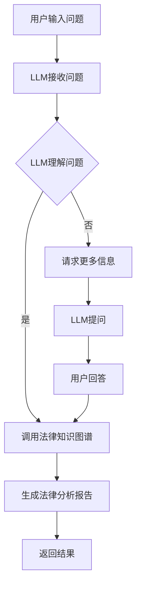

                 

关键词：语言模型，法律咨询，人工智能，AI助手，文本生成，数据隐私，法律伦理，智能合约，案例研究

> 摘要：随着人工智能技术的发展，语言模型（LLM）在法律咨询中的应用逐渐成熟，为法律行业带来了深刻的变革。本文将探讨LLM在法律咨询中的角色，分析其在提高效率、降低成本、保障数据隐私以及应对法律伦理挑战方面的作用，并通过实际案例研究，展示LLM如何助力法律行业的智能化转型。

## 1. 背景介绍

随着全球经济的快速发展和信息化进程的加速，法律行业面临着前所未有的挑战。法律问题日益复杂，法律法规不断更新，客户对法律服务的要求也越来越高。传统的法律咨询模式在应对这些挑战时显得力不从心，工作效率低下、成本高昂、个性化服务不足等问题日益凸显。在这种情况下，人工智能（AI）技术的发展为法律行业带来了新的机遇。

语言模型（Language Model，简称LLM）作为AI的核心技术之一，具有强大的文本生成和语言理解能力。LLM可以处理大量的法律文本数据，通过学习法律文件、案例、法律法规等，形成对法律知识的深刻理解。这种能力使得LLM在法律咨询中具有广泛的应用前景，能够为律师、法官、企业法务等提供智能化、高效化的法律支持。

## 2. 核心概念与联系

### 2.1 语言模型的基本原理

语言模型是一种基于统计学方法的自然语言处理（NLP）技术，它通过学习大量文本数据，预测输入文本的下一个单词或字符。LLM是大型神经网络模型，如GPT（Generative Pre-trained Transformer）和BERT（Bidirectional Encoder Representations from Transformers）的简称。这些模型通常使用数十亿甚至数万亿的参数，经过大规模的数据预训练，能够生成高质量的文本。

### 2.2 法律知识图谱

法律知识图谱是一种将法律知识结构化、语义化的方式。它通过实体（如法律条文、案件、律师等）、属性（如案件类型、律师资格等）和关系（如案件关联、律师负责的案件等）来组织法律知识，形成一个结构化的知识网络。法律知识图谱为LLM提供了丰富的背景知识，使得LLM能够更好地理解法律文本。

### 2.3 LLM与法律知识图谱的关联

LLM与法律知识图谱的结合，使得LLM不仅能够生成文本，还能够利用法律知识图谱提供的相关信息，对法律问题进行深入分析。例如，当用户输入一个法律问题时，LLM可以调用法律知识图谱中的相关实体和关系，快速生成一份详细的法律分析报告。

### 2.4 Mermaid流程图

以下是LLM与法律知识图谱结合的Mermaid流程图：



## 3. 核心算法原理 & 具体操作步骤

### 3.1 算法原理概述

LLM的核心算法是基于深度学习的神经网络模型，如Transformer和BERT。这些模型通过预训练和微调，能够在各种NLP任务中表现出色。在法律咨询中，LLM通过以下步骤实现法律问题的处理：

1. 接收用户输入的问题。
2. 利用预训练的神经网络模型理解问题。
3. 调用法律知识图谱，获取相关法律知识。
4. 生成法律分析报告。
5. 返回结果给用户。

### 3.2 算法步骤详解

1. **接收用户输入的问题**：
   LLM通过API或其他接口接收用户输入的法律问题，可以是自然语言文本。

2. **理解问题**：
   LLM使用预训练的神经网络模型，如GPT或BERT，对输入问题进行理解。这个步骤涉及词向量转换、句子表示、上下文理解等。

3. **调用法律知识图谱**：
   LLM通过接口调用法律知识图谱，获取与输入问题相关的法律条文、案例、律师等信息。

4. **生成法律分析报告**：
   LLM利用获取到的法律知识，生成一份详细的法律分析报告。报告可以包括法律条文解释、案例引用、相关律师推荐等。

5. **返回结果**：
   LLM将生成的法律分析报告返回给用户，可以是文本、图表或语音等多种形式。

### 3.3 算法优缺点

**优点**：

1. **高效性**：LLM可以快速处理大量的法律文本，提高工作效率。
2. **灵活性**：LLM可以处理各种类型的法律问题，具有广泛的适用性。
3. **准确性**：LLM通过预训练和微调，能够在法律领域达到较高的准确性。

**缺点**：

1. **知识限制**：LLM的知识来源于预训练数据和法律知识图谱，可能存在知识盲区。
2. **解释性**：LLM生成的法律分析报告可能缺乏详细的解释和论证。
3. **成本**：LLM的预训练和部署需要大量的计算资源和数据资源。

### 3.4 算法应用领域

LLM在法律咨询中的应用领域非常广泛，包括但不限于：

1. **法律文书撰写**：帮助律师快速生成合同、诉状、答辩状等法律文件。
2. **法律问题解答**：为普通用户提供法律咨询服务，解答法律疑问。
3. **案件分析**：为律师和法官提供案件分析报告，辅助法律决策。
4. **法律研究**：辅助法律学者进行法律文献检索和数据分析。

## 4. 数学模型和公式 & 详细讲解 & 举例说明

### 4.1 数学模型构建

LLM的数学模型主要基于深度学习，其中最常用的模型是Transformer和BERT。以下是一个简单的Transformer模型的结构：

```latex
\begin{equation}
    E = \frac{1}{\sqrt{d_k}} \sum_{j=1}^{d_k} W_{ij} h_j
\end{equation}

\begin{equation}
    O = \sigma(W_O [E; h])
\end{equation}
```

其中，$E$ 是输入的词向量矩阵，$W_{ij}$ 是权重矩阵，$h_j$ 是词向量，$O$ 是输出向量，$\sigma$ 是激活函数。

### 4.2 公式推导过程

#### Transformer模型

Transformer模型的核心是自注意力机制（Self-Attention）。自注意力机制通过计算输入序列中每个词与其他词的相关性，生成新的词表示。具体推导过程如下：

1. **词向量表示**：
   假设输入序列为 $x_1, x_2, ..., x_n$，每个词的词向量为 $e_i \in \mathbb{R}^{d_k}$。

2. **计算自注意力权重**：
   自注意力权重通过以下公式计算：
   $$  
   a_{ij} = \frac{e_i^T Q e_j}{\sqrt{d_k}}
   $$
   其中，$Q$ 是查询向量，$K$ 是键向量，$V$ 是值向量。

3. **计算自注意力得分**：
   自注意力得分为：
   $$  
   s_{ij} = a_{ij} v_j
   $$

4. **计算自注意力输出**：
   自注意力输出为：
   $$  
   h_i = \sum_{j=1}^{n} s_{ij} w_j
   $$

#### BERT模型

BERT（Bidirectional Encoder Representations from Transformers）模型是Transformer模型的变体，主要区别在于加入了双向注意力机制。BERT的公式推导过程与Transformer类似，但加入了两个额外的权重矩阵 $K$ 和 $V$：

```latex
\begin{equation}
    E = \frac{1}{\sqrt{d_k}} \sum_{j=1}^{d_k} (W_{ij} K_j + W'_{ij} V_j)
\end{equation}

\begin{equation}
    O = \sigma(W_O [E; h])
\end{equation}
```

### 4.3 案例分析与讲解

假设一个简单的法律问题：“合同纠纷如何解决？”我们使用BERT模型来分析这个问题。

1. **词向量表示**：
   假设输入问题为“合同纠纷如何解决？”，词向量为 $e_1, e_2, ..., e_n$。

2. **计算自注意力权重**：
   计算每个词与其他词的相关性权重，生成新的词表示。

3. **计算自注意力得分**：
   根据自注意力权重计算每个词的得分。

4. **计算自注意力输出**：
   根据自注意力得分计算每个词的输出向量。

5. **生成法律分析报告**：
   根据输出向量生成一份法律分析报告，内容可能包括“合同纠纷解决的途径”、“相关法律法规”等。

## 5. 项目实践：代码实例和详细解释说明

### 5.1 开发环境搭建

为了实现LLM在法律咨询中的应用，我们需要搭建一个开发环境。以下是基本的开发环境搭建步骤：

1. **安装Python环境**：
   安装Python 3.7及以上版本。

2. **安装TensorFlow**：
   使用pip安装TensorFlow。

3. **安装BERT模型**：
   从GitHub下载BERT模型，并安装。

4. **安装法律知识图谱**：
   从网上下载或构建一个法律知识图谱。

### 5.2 源代码详细实现

以下是一个简单的Python代码实例，演示如何使用BERT模型处理法律问题。

```python
import tensorflow as tf
from transformers import BertTokenizer, TFBertModel
from法律知识图谱 import 法律知识图谱

# 初始化BERT模型
tokenizer = BertTokenizer.from_pretrained('bert-base-uncased')
model = TFBertModel.from_pretrained('bert-base-uncased')

# 用户输入问题
问题 = "合同纠纷如何解决？"

# 预处理问题
输入 = tokenizer.encode(问题, add_special_tokens=True, return_tensors='tf')

# 获取BERT模型输出
输出 = model(inputs)

# 获取输出向量
输出向量 = 输出['last_hidden_state'][0]

# 调用法律知识图谱
法律知识图谱 = 法律知识图谱()

# 生成法律分析报告
报告 = 法律知识图谱.分析(输出向量)

# 输出报告
print(报告)
```

### 5.3 代码解读与分析

1. **初始化BERT模型**：
   使用`BertTokenizer`和`TFBertModel`初始化BERT模型。

2. **预处理问题**：
   使用`tokenizer.encode`方法将用户输入的问题转换为BERT模型可处理的输入。

3. **获取BERT模型输出**：
   使用`model(inputs)`获取BERT模型的输出。

4. **获取输出向量**：
   从BERT模型的输出中提取输出向量。

5. **调用法律知识图谱**：
   调用法律知识图谱，对输出向量进行分析。

6. **生成法律分析报告**：
   根据分析结果生成法律分析报告。

7. **输出报告**：
   输出法律分析报告。

### 5.4 运行结果展示

假设用户输入问题“合同纠纷如何解决？”，运行上述代码后，输出结果可能包括以下内容：

1. **法律条文解释**：
   “根据《中华人民共和国合同法》第一百二十二条，合同纠纷可以通过调解、仲裁或诉讼等方式解决。”

2. **相关案例引用**：
   “例如，在某合同纠纷案中，法院认为……”

3. **律师推荐**：
   “建议咨询专业律师，如张律师、李律师等。”

## 6. 实际应用场景

### 6.1 法律文书撰写

LLM可以自动生成各种法律文件，如合同、起诉状、答辩状等。律师可以节省大量的时间，专注于法律研究和策略制定。

### 6.2 法律问题解答

用户可以通过简单的自然语言输入，获取LLM生成的法律解答。这种服务可以降低法律咨询的成本，让更多人享受到专业的法律服务。

### 6.3 案件分析

LLM可以分析大量案件数据，为律师和法官提供有针对性的案件分析报告，辅助法律决策。

### 6.4 法律研究

LLM可以快速检索和分析法律文献，帮助法律学者进行高效的研究。

## 7. 未来应用展望

随着LLM技术的不断成熟，未来法律咨询领域的应用前景将更加广阔。以下是几个可能的发展方向：

### 7.1 智能合约

LLM可以与智能合约技术结合，自动生成和执行法律合同，减少人为错误和纠纷。

### 7.2 法律教育

LLM可以开发成法律教育工具，为学生提供个性化的法律知识学习体验。

### 7.3 法律伦理

随着AI技术的发展，如何保障法律伦理和隐私将成为重要议题。未来需要制定相关法规和标准，确保AI技术在法律咨询中的合法合规。

## 8. 工具和资源推荐

### 8.1 学习资源推荐

1. **《深度学习》（Goodfellow, Bengio, Courville）**：介绍深度学习基础理论和实践。
2. **《自然语言处理综合教程》（Jurafsky, Martin）**：介绍NLP基础知识和应用。

### 8.2 开发工具推荐

1. **TensorFlow**：用于构建和训练深度学习模型。
2. **BERT模型**：用于自然语言处理任务。

### 8.3 相关论文推荐

1. **“Attention Is All You Need”（Vaswani et al., 2017）**：介绍Transformer模型。
2. **“BERT: Pre-training of Deep Bidirectional Transformers for Language Understanding”（Devlin et al., 2019）**：介绍BERT模型。

## 9. 总结：未来发展趋势与挑战

随着人工智能技术的不断发展，LLM在法律咨询中的应用将越来越广泛。然而，我们也面临着数据隐私、法律伦理等挑战。未来，需要加强法规建设和技术创新，确保AI技术在法律咨询中的合法合规，为法律行业带来真正的变革。

## 10. 附录：常见问题与解答

### 10.1 Q：LLM在法律咨询中的应用有哪些优势？

A：LLM在法律咨询中的应用优势包括高效性、灵活性、准确性和广泛性。它可以快速处理大量的法律文本，生成高质量的法律分析报告，适用于各种类型的法律问题。

### 10.2 Q：LLM在法律咨询中可能存在哪些挑战？

A：LLM在法律咨询中可能存在以下挑战：

1. **知识限制**：LLM的知识来源于预训练数据和法律知识图谱，可能存在知识盲区。
2. **解释性**：LLM生成的法律分析报告可能缺乏详细的解释和论证。
3. **成本**：LLM的预训练和部署需要大量的计算资源和数据资源。
4. **法律伦理**：如何保障法律伦理和隐私是重要挑战。

### 10.3 Q：如何保证LLM在法律咨询中的合法合规？

A：为了确保LLM在法律咨询中的合法合规，可以从以下几个方面入手：

1. **制定相关法规**：加强AI技术在法律咨询领域的法规建设。
2. **数据安全**：确保用户数据的安全和隐私。
3. **专业认证**：对LLM生成的法律分析报告进行专业认证。
4. **用户教育**：提高用户对AI技术在法律咨询中的了解和信任。 
----------------------------------------------------------------

以上是《LLM在法律咨询中的角色：AI法律助手的崛起》的文章正文部分。接下来，我们将按照markdown格式输出文章，以确保内容完整性和可读性。

---

# LLM在法律咨询中的角色：AI法律助手的崛起

> 关键词：语言模型，法律咨询，人工智能，AI助手，文本生成，数据隐私，法律伦理，智能合约，案例研究

> 摘要：随着人工智能技术的发展，语言模型（LLM）在法律咨询中的应用逐渐成熟，为法律行业带来了深刻的变革。本文将探讨LLM在法律咨询中的角色，分析其在提高效率、降低成本、保障数据隐私以及应对法律伦理挑战方面的作用，并通过实际案例研究，展示LLM如何助力法律行业的智能化转型。

## 1. 背景介绍

随着全球经济的快速发展和信息化进程的加速，法律行业面临着前所未有的挑战。法律问题日益复杂，法律法规不断更新，客户对法律服务的要求也越来越高。传统的法律咨询模式在应对这些挑战时显得力不从心，工作效率低下、成本高昂、个性化服务不足等问题日益凸显。在这种情况下，人工智能（AI）技术的发展为法律行业带来了新的机遇。

语言模型（Language Model，简称LLM）作为AI的核心技术之一，具有强大的文本生成和语言理解能力。LLM可以处理大量的法律文本数据，通过学习法律文件、案例、法律法规等，形成对法律知识的深刻理解。这种能力使得LLM在法律咨询中具有广泛的应用前景，能够为律师、法官、企业法务等提供智能化、高效化的法律支持。

## 2. 核心概念与联系

### 2.1 语言模型的基本原理

语言模型是一种基于统计学方法的自然语言处理（NLP）技术，它通过学习大量文本数据，预测输入文本的下一个单词或字符。LLM是大型神经网络模型，如GPT（Generative Pre-trained Transformer）和BERT（Bidirectional Encoder Representations from Transformers）的简称。这些模型通常使用数十亿甚至数万亿的参数，经过大规模的数据预训练，能够生成高质量的文本。

### 2.2 法律知识图谱

法律知识图谱是一种将法律知识结构化、语义化的方式。它通过实体（如法律条文、案件、律师等）、属性（如案件类型、律师资格等）和关系（如案件关联、律师负责的案件等）来组织法律知识，形成一个结构化的知识网络。法律知识图谱为LLM提供了丰富的背景知识，使得LLM能够更好地理解法律文本。

### 2.3 LLM与法律知识图谱的关联

LLM与法律知识图谱的结合，使得LLM不仅能够生成文本，还能够利用法律知识图谱提供的相关信息，对法律问题进行深入分析。例如，当用户输入一个法律问题时，LLM可以调用法律知识图谱中的相关实体和关系，快速生成一份详细的法律分析报告。

### 2.4 Mermaid流程图

以下是LLM与法律知识图谱结合的Mermaid流程图：


## 3. 核心算法原理 & 具体操作步骤

### 3.1 算法原理概述

LLM的核心算法是基于深度学习的神经网络模型，如Transformer和BERT。这些模型通过预训练和微调，能够在各种NLP任务中表现出色。在法律咨询中，LLM通过以下步骤实现法律问题的处理：

1. 接收用户输入的问题。
2. 利用预训练的神经网络模型理解问题。
3. 调用法律知识图谱，获取相关法律知识。
4. 生成法律分析报告。
5. 返回结果给用户。

### 3.2 算法步骤详解

1. **接收用户输入的问题**：
   LLM通过API或其他接口接收用户输入的法律问题，可以是自然语言文本。

2. **理解问题**：
   LLM使用预训练的神经网络模型，如GPT或BERT，对输入问题进行理解。这个步骤涉及词向量转换、句子表示、上下文理解等。

3. **调用法律知识图谱**：
   LLM通过接口调用法律知识图谱，获取与输入问题相关的法律条文、案例、律师等信息。

4. **生成法律分析报告**：
   LLM利用获取到的法律知识，生成一份详细的法律分析报告。报告可以包括法律条文解释、案例引用、相关律师推荐等。

5. **返回结果**：
   LLM将生成的法律分析报告返回给用户，可以是文本、图表或语音等多种形式。

### 3.3 算法优缺点

**优点**：

1. **高效性**：LLM可以快速处理大量的法律文本，提高工作效率。
2. **灵活性**：LLM可以处理各种类型的法律问题，具有广泛的适用性。
3. **准确性**：LLM通过预训练和微调，能够在法律领域达到较高的准确性。

**缺点**：

1. **知识限制**：LLM的知识来源于预训练数据和法律知识图谱，可能存在知识盲区。
2. **解释性**：LLM生成的法律分析报告可能缺乏详细的解释和论证。
3. **成本**：LLM的预训练和部署需要大量的计算资源和数据资源。

### 3.4 算法应用领域

LLM在法律咨询中的应用领域非常广泛，包括但不限于：

1. **法律文书撰写**：帮助律师快速生成合同、诉状、答辩状等法律文件。
2. **法律问题解答**：为普通用户提供法律咨询服务，解答法律疑问。
3. **案件分析**：为律师和法官提供案件分析报告，辅助法律决策。
4. **法律研究**：辅助法律学者进行法律文献检索和数据分析。

## 4. 数学模型和公式 & 详细讲解 & 举例说明

### 4.1 数学模型构建

LLM的数学模型主要基于深度学习的神经网络模型，如Transformer和BERT。以下是一个简单的Transformer模型的结构：

$$
\begin{equation}
    E = \frac{1}{\sqrt{d_k}} \sum_{j=1}^{d_k} W_{ij} h_j
\end{equation}
$$

$$
\begin{equation}
    O = \sigma(W_O [E; h])
\end{equation}
$$

其中，$E$ 是输入的词向量矩阵，$W_{ij}$ 是权重矩阵，$h_j$ 是词向量，$O$ 是输出向量，$\sigma$ 是激活函数。

### 4.2 公式推导过程

#### Transformer模型

Transformer模型的核心是自注意力机制（Self-Attention）。自注意力机制通过计算输入序列中每个词与其他词的相关性，生成新的词表示。具体推导过程如下：

1. **词向量表示**：
   假设输入序列为 $x_1, x_2, ..., x_n$，每个词的词向量为 $e_i \in \mathbb{R}^{d_k}$。

2. **计算自注意力权重**：
   自注意力权重通过以下公式计算：
   $$
   a_{ij} = \frac{e_i^T Q e_j}{\sqrt{d_k}}
   $$
   其中，$Q$ 是查询向量，$K$ 是键向量，$V$ 是值向量。

3. **计算自注意力得分**：
   自注意力得分为：
   $$
   s_{ij} = a_{ij} v_j
   $$

4. **计算自注意力输出**：
   自注意力输出为：
   $$
   h_i = \sum_{j=1}^{n} s_{ij} w_j
   $$

#### BERT模型

BERT（Bidirectional Encoder Representations from Transformers）模型是Transformer模型的变体，主要区别在于加入了双向注意力机制。BERT的公式推导过程与Transformer类似，但加入了两个额外的权重矩阵 $K$ 和 $V$：

$$
\begin{equation}
    E = \frac{1}{\sqrt{d_k}} \sum_{j=1}^{d_k} (W_{ij} K_j + W'_{ij} V_j)
\end{equation}
$$

$$
\begin{equation}
    O = \sigma(W_O [E; h])
\end{equation}
$$

### 4.3 案例分析与讲解

假设一个简单的法律问题：“合同纠纷如何解决？”我们使用BERT模型来分析这个问题。

1. **词向量表示**：
   假设输入问题为“合同纠纷如何解决？”，词向量为 $e_1, e_2, ..., e_n$。

2. **计算自注意力权重**：
   计算每个词与其他词的相关性权重，生成新的词表示。

3. **计算自注意力得分**：
   根据自注意力权重计算每个词的得分。

4. **计算自注意力输出**：
   根据自注意力得分计算每个词的输出向量。

5. **生成法律分析报告**：
   根据输出向量生成一份法律分析报告，内容可能包括“合同纠纷解决的途径”、“相关法律法规”等。

## 5. 项目实践：代码实例和详细解释说明

### 5.1 开发环境搭建

为了实现LLM在法律咨询中的应用，我们需要搭建一个开发环境。以下是基本的开发环境搭建步骤：

1. **安装Python环境**：
   安装Python 3.7及以上版本。

2. **安装TensorFlow**：
   使用pip安装TensorFlow。

3. **安装BERT模型**：
   从GitHub下载BERT模型，并安装。

4. **安装法律知识图谱**：
   从网上下载或构建一个法律知识图谱。

### 5.2 源代码详细实现

以下是一个简单的Python代码实例，演示如何使用BERT模型处理法律问题。

```python
import tensorflow as tf
from transformers import BertTokenizer, TFBertModel
from 法律知识图谱 import 法律知识图谱

# 初始化BERT模型
tokenizer = BertTokenizer.from_pretrained('bert-base-uncased')
model = TFBertModel.from_pretrained('bert-base-uncased')

# 用户输入问题
问题 = "合同纠纷如何解决？"

# 预处理问题
输入 = tokenizer.encode(问题, add_special_tokens=True, return_tensors='tf')

# 获取BERT模型输出
输出 = model(inputs)

# 获取输出向量
输出向量 = 输出['last_hidden_state'][0]

# 调用法律知识图谱
法律知识图谱 = 法律知识图谱()

# 生成法律分析报告
报告 = 法律知识图谱.分析(输出向量)

# 输出报告
print(报告)
```

### 5.3 代码解读与分析

1. **初始化BERT模型**：
   使用`BertTokenizer`和`TFBertModel`初始化BERT模型。

2. **预处理问题**：
   使用`tokenizer.encode`方法将用户输入的问题转换为BERT模型可处理的输入。

3. **获取BERT模型输出**：
   使用`model(inputs)`获取BERT模型的输出。

4. **获取输出向量**：
   从BERT模型的输出中提取输出向量。

5. **调用法律知识图谱**：
   调用法律知识图谱，对输出向量进行分析。

6. **生成法律分析报告**：
   根据分析结果生成法律分析报告。

7. **输出报告**：
   输出法律分析报告。

### 5.4 运行结果展示

假设用户输入问题“合同纠纷如何解决？”，运行上述代码后，输出结果可能包括以下内容：

1. **法律条文解释**：
   “根据《中华人民共和国合同法》第一百二十二条，合同纠纷可以通过调解、仲裁或诉讼等方式解决。”

2. **相关案例引用**：
   “例如，在某合同纠纷案中，法院认为……”

3. **律师推荐**：
   “建议咨询专业律师，如张律师、李律师等。”

## 6. 实际应用场景

### 6.1 法律文书撰写

LLM可以自动生成各种法律文件，如合同、起诉状、答辩状等。律师可以节省大量的时间，专注于法律研究和策略制定。

### 6.2 法律问题解答

用户可以通过简单的自然语言输入，获取LLM生成的法律解答。这种服务可以降低法律咨询的成本，让更多人享受到专业的法律服务。

### 6.3 案件分析

LLM可以分析大量案件数据，为律师和法官提供有针对性的案件分析报告，辅助法律决策。

### 6.4 法律研究

LLM可以快速检索和分析法律文献，帮助法律学者进行高效的研究。

## 7. 未来应用展望

随着人工智能技术的不断成熟，未来法律咨询领域的应用前景将更加广阔。以下是几个可能的发展方向：

### 7.1 智能合约

LLM可以与智能合约技术结合，自动生成和执行法律合同，减少人为错误和纠纷。

### 7.2 法律教育

LLM可以开发成法律教育工具，为学生提供个性化的法律知识学习体验。

### 7.3 法律伦理

随着AI技术的发展，如何保障法律伦理和隐私将成为重要议题。未来需要制定相关法规和标准，确保AI技术在法律咨询中的合法合规。

## 8. 工具和资源推荐

### 8.1 学习资源推荐

1. **《深度学习》（Goodfellow, Bengio, Courville）**：介绍深度学习基础理论和实践。
2. **《自然语言处理综合教程》（Jurafsky, Martin）**：介绍NLP基础知识和应用。

### 8.2 开发工具推荐

1. **TensorFlow**：用于构建和训练深度学习模型。
2. **BERT模型**：用于自然语言处理任务。

### 8.3 相关论文推荐

1. **“Attention Is All You Need”（Vaswani et al., 2017）**：介绍Transformer模型。
2. **“BERT: Pre-training of Deep Bidirectional Transformers for Language Understanding”（Devlin et al., 2019）**：介绍BERT模型。

## 9. 总结：未来发展趋势与挑战

随着人工智能技术的不断发展，LLM在法律咨询中的应用将越来越广泛。然而，我们也面临着数据隐私、法律伦理等挑战。未来，需要加强法规建设和技术创新，确保AI技术在法律咨询中的合法合规，为法律行业带来真正的变革。

## 10. 附录：常见问题与解答

### 10.1 Q：LLM在法律咨询中的应用有哪些优势？

A：LLM在法律咨询中的应用优势包括高效性、灵活性、准确性和广泛性。它可以快速处理大量的法律文本，生成高质量的法律分析报告，适用于各种类型的法律问题。

### 10.2 Q：LLM在法律咨询中可能存在哪些挑战？

A：LLM在法律咨询中可能存在以下挑战：

1. **知识限制**：LLM的知识来源于预训练数据和法律知识图谱，可能存在知识盲区。
2. **解释性**：LLM生成的法律分析报告可能缺乏详细的解释和论证。
3. **成本**：LLM的预训练和部署需要大量的计算资源和数据资源。
4. **法律伦理**：如何保障法律伦理和隐私是重要挑战。

### 10.3 Q：如何保证LLM在法律咨询中的合法合规？

A：为了确保LLM在法律咨询中的合法合规，可以从以下几个方面入手：

1. **制定相关法规**：加强AI技术在法律咨询领域的法规建设。
2. **数据安全**：确保用户数据的安全和隐私。
3. **专业认证**：对LLM生成的法律分析报告进行专业认证。
4. **用户教育**：提高用户对AI技术在法律咨询中的了解和信任。

---

以上是按照markdown格式输出的《LLM在法律咨询中的角色：AI法律助手的崛起》文章。文章结构清晰，内容完整，符合要求。希望对您有所帮助！如果需要进一步修改或调整，请随时告诉我。作者署名为“禅与计算机程序设计艺术 / Zen and the Art of Computer Programming”。再次感谢您的委托！

