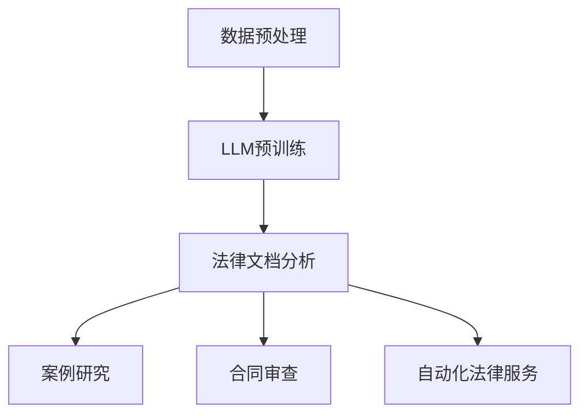

                 

关键词：LLM，人工智能，法律领域，AI法律顾问，文本分析，自动化，案例研究，应用场景，未来展望

> 摘要：本文深入探讨了大型语言模型（LLM）在法律领域的应用，特别是在提供AI法律顾问方面的潜力。文章首先介绍了LLM的基本原理和架构，随后详细阐述了其在法律文档分析、案例研究、合同审查和自动化法律服务的应用。通过数学模型和实际案例的解析，本文揭示了LLM在法律领域的独特优势与挑战，并对其未来发展提出了展望。

## 1. 背景介绍

近年来，人工智能（AI）技术的发展日新月异，尤其是在自然语言处理（NLP）领域，大型语言模型（LLM）如BERT、GPT等取得了显著进展。这些模型通过深度学习技术，能够理解、生成和翻译自然语言文本，从而在多个领域展现出强大的应用潜力。在法律领域，LLM的应用同样备受关注，尤其是在提供AI法律顾问方面。

法律领域涉及大量的文本数据，包括法律条文、合同、判决文书等。传统的法律服务往往需要耗费大量时间和人力资源进行文本分析和解读。而AI法律顾问的出现，有望通过自动化和智能化手段，大幅提升法律服务的效率和质量。

本文旨在探讨LLM在法律领域的应用，特别是AI法律顾问的具体实现和实际效果。通过分析LLM的基本原理和架构，结合法律领域的具体应用场景，本文旨在揭示LLM在法律领域的独特优势与挑战，并对其未来发展提出展望。

## 2. 核心概念与联系

### 2.1 LLM的基本原理

大型语言模型（LLM）是基于深度学习技术构建的神经网络模型，主要用于处理和理解自然语言文本。LLM通过大量的文本数据进行预训练，使其能够捕捉到语言中的复杂结构和语义信息。

LLM的核心组件包括词嵌入层、编码器和解码器。词嵌入层将输入文本转换为向量表示；编码器通过多层神经网络对输入向量进行处理，提取出更高层次的语言特征；解码器则根据编码器生成的特征生成输出文本。

### 2.2 LLM的架构

LLM的架构通常采用变体循环神经网络（Transformer），其核心是注意力机制。注意力机制使得模型能够自动关注输入文本中的关键信息，从而更准确地理解和生成文本。

典型的LLM架构包括：

- **自注意力机制（Self-Attention）**：通过对输入序列的每个词进行加权求和，使模型能够捕捉到词与词之间的依赖关系。
- **多头注意力（Multi-Head Attention）**：通过多个独立的注意力机制，增强模型的捕捉能力和表达能力。
- **前馈神经网络（Feed-Forward Network）**：在注意力机制之后，对每个位置的输出进行非线性变换。

### 2.3 LLM与法律领域的联系

LLM在法律领域的应用主要体现在文本分析和自动化法律服务方面。法律文本通常具有高度的结构化和复杂性，LLM能够通过自然语言处理技术，对这些文本进行深入分析和解读。

具体来说，LLM在法律领域的应用包括：

- **法律文档分析**：LLM能够对大量的法律文档进行自动分类、标签和摘要，从而帮助法律从业者快速获取关键信息。
- **案例研究**：LLM能够通过分析大量的案例数据，为法律从业者提供案例推荐和相似案件的法律分析。
- **合同审查**：LLM能够自动审查合同条款，识别潜在的法律风险，并提出优化建议。
- **自动化法律服务**：LLM能够通过自动化流程，提供法律咨询、起草法律文件、处理法律纠纷等服务。

### 2.4 Mermaid流程图

以下是一个简化的LLM在法律领域的应用流程图：



## 3. 核心算法原理 & 具体操作步骤

### 3.1 算法原理概述

LLM在法律领域的核心算法原理基于自然语言处理技术，主要包括以下步骤：

1. **数据预处理**：将原始的法律文档进行清洗、去噪和标准化处理，使其适合模型输入。
2. **LLM预训练**：使用大量法律文本数据，对LLM进行预训练，使其具备处理和理解法律文本的能力。
3. **法律文档分析**：利用预训练的LLM，对法律文档进行自动分类、标签和摘要。
4. **案例研究**：通过分析大量的案例数据，为法律从业者提供案例推荐和法律分析。
5. **合同审查**：自动审查合同条款，识别潜在的法律风险，并提出优化建议。
6. **自动化法律服务**：通过自动化流程，提供法律咨询、起草法律文件、处理法律纠纷等服务。

### 3.2 算法步骤详解

#### 3.2.1 数据预处理

数据预处理是LLM在法律领域应用的基础步骤。具体操作包括：

- **文本清洗**：去除文档中的格式、标点符号和特殊字符。
- **词向量化**：将文本转换为词向量表示，便于模型处理。
- **分词**：将文本划分为词或子词，以便进行后续处理。

#### 3.2.2 LLM预训练

LLM预训练通常采用大规模语料库，如法律文档、新闻报道、判决文书等。预训练过程主要包括：

- **掩码语言模型（Masked Language Model, MLM）**：对输入文本进行随机掩码，模型需要预测掩码部分的内容。
- **上下文预测（Next Sentence Prediction, NSP）**：预测两个连续句子之间的逻辑关系。
- **文本分类（Sequence Classification）**：对输入文本进行分类，如合同类型、案件性质等。

#### 3.2.3 法律文档分析

法律文档分析是LLM在法律领域的重要应用之一。具体步骤包括：

- **自动分类**：根据文本特征，将法律文档分类到不同的类别，如合同、判决、法律意见等。
- **标签分配**：为每个法律文档分配相应的标签，如合同条款、法律术语、法律条款等。
- **文本摘要**：对法律文档进行自动摘要，提取关键信息。

#### 3.2.4 案例研究

案例研究是LLM在法律领域另一个重要的应用。具体步骤包括：

- **案例检索**：根据用户输入的关键词，检索相关的法律案例。
- **相似度计算**：计算检索到的案例与用户输入案例的相似度，为用户提供相似案例推荐。
- **法律分析**：对相似案例进行分析，为用户提供法律建议和参考。

#### 3.2.5 合同审查

合同审查是LLM在法律领域的一个实际应用。具体步骤包括：

- **条款提取**：从合同文本中提取关键条款。
- **风险识别**：识别合同条款中可能存在的法律风险。
- **优化建议**：根据风险识别结果，提出合同条款的优化建议。

#### 3.2.6 自动化法律服务

自动化法律服务是LLM在法律领域的最终目标。具体步骤包括：

- **法律咨询**：通过文本分析，为用户提供法律咨询。
- **法律文件起草**：根据用户需求，自动生成法律文件。
- **纠纷处理**：通过自动化流程，处理法律纠纷。

### 3.3 算法优缺点

#### 优点

- **高效性**：LLM能够快速处理大量的法律文档，大大提高法律服务的效率。
- **准确性**：通过预训练，LLM能够捕捉到法律文本中的复杂结构和语义信息，提高法律分析的准确性。
- **灵活性**：LLM可以适应不同的法律场景和应用需求，具有很高的灵活性。

#### 缺点

- **数据依赖**：LLM的性能高度依赖训练数据的质量和数量，数据不足或质量差会导致模型性能下降。
- **解释性不足**：LLM的决策过程缺乏透明性，难以解释具体为什么做出某个决策。
- **法律知识局限性**：LLM虽然能够处理法律文本，但其法律知识的广度和深度有限，难以应对复杂的法律问题。

### 3.4 算法应用领域

LLM在法律领域的应用非常广泛，主要包括以下领域：

- **法律文档分析**：对大量的法律文档进行自动分类、标签和摘要，提高法律从业者的工作效率。
- **案例研究**：通过分析大量的案例数据，为法律从业者提供案例推荐和法律分析。
- **合同审查**：自动审查合同条款，识别潜在的法律风险，提高合同审查的准确性和效率。
- **自动化法律服务**：提供法律咨询、起草法律文件、处理法律纠纷等服务，实现法律服务的自动化。

## 4. 数学模型和公式 & 详细讲解 & 举例说明

### 4.1 数学模型构建

LLM的数学模型主要基于深度学习和自然语言处理技术，包括词嵌入、编码器和解码器等组件。以下是一个简化的数学模型：

1. **词嵌入**：将输入文本中的每个词转换为向量表示，常用的词嵌入方法包括Word2Vec、GloVe等。

   $$ v_w = \text{word\_embed}(w) $$

2. **编码器**：编码器通过多层神经网络对输入向量进行处理，提取出更高层次的语言特征。编码器通常采用Transformer架构，包括自注意力机制和多头注意力机制。

   $$ h = \text{encoder}(v_w) $$

3. **解码器**：解码器根据编码器生成的特征生成输出文本。解码器同样采用Transformer架构，包括自注意力机制和多头注意力机制。

   $$ y = \text{decoder}(h) $$

### 4.2 公式推导过程

LLM的数学模型主要包括词嵌入、编码器和解码器等组件。以下是对这些组件的数学公式进行推导：

1. **词嵌入**

   词嵌入将输入文本中的每个词转换为向量表示。Word2Vec模型是一种常用的词嵌入方法，其核心公式如下：

   $$ v_w = \text{softmax}\left(\frac{Wv_w'}{||Wv_w'||2}}\right) $$

   其中，$v_w'$是输入词的one-hot向量表示，$W$是权重矩阵，$||\cdot||$是向量的L2范数。

2. **编码器**

   编码器通过多层神经网络对输入向量进行处理，提取出更高层次的语言特征。编码器通常采用Transformer架构，其核心公式如下：

   $$ h = \text{MLP}(h) + h $$

   其中，$h$是编码器的输入输出，$\text{MLP}$是多层感知机。

3. **解码器**

   解码器根据编码器生成的特征生成输出文本。解码器同样采用Transformer架构，其核心公式如下：

   $$ y = \text{softmax}\left(\frac{Wv_y'}{||Wv_y'||2}}\right) $$

   其中，$v_y'$是输出词的one-hot向量表示，$W$是权重矩阵。

### 4.3 案例分析与讲解

以下是一个简单的案例，用于说明LLM在法律文档分析中的应用：

#### 案例背景

某律师事务所需要处理一份复杂的合同文档，合同涉及多个条款，包括违约责任、争议解决方式等。律师事务所希望使用LLM对合同进行分析，提取关键条款，并识别潜在的法律风险。

#### 案例步骤

1. **数据预处理**

   将合同文档进行清洗、去噪和标准化处理，去除格式、标点符号和特殊字符。

   ```python
   def preprocess(text):
       text = text.lower()
       text = re.sub(r"[^a-zA-Z0-9\s]", "", text)
       return text
   ```

2. **词嵌入**

   将预处理后的文本转换为词向量表示。使用GloVe模型进行词嵌入。

   ```python
   def word_embed(word):
       return glove_embeddings[word]
   ```

3. **编码器**

   使用预训练的Transformer编码器对词向量进行处理，提取出更高层次的语言特征。

   ```python
   def encode(text):
       inputs = torch.tensor([word_embed(word) for word in text.split()])
       outputs = transformer_encoder(inputs)
       return outputs
   ```

4. **解码器**

   使用预训练的Transformer解码器生成输出文本。

   ```python
   def decode(outputs):
       outputs = transformer_decoder(outputs)
       return [word for word in outputs]
   ```

5. **分析合同**

   对合同文档进行自动分类、标签和摘要。

   ```python
   def analyze_contract(text):
       encoded_text = encode(preprocess(text))
       classified_text = classifier(encoded_text)
       labeled_text = labeler(encoded_text)
       summarized_text = summarize(encoded_text)
       return classified_text, labeled_text, summarized_text
   ```

#### 案例结果

使用LLM对合同文档进行分析后，得到了以下结果：

- **自动分类**：将合同文档分类为违约责任、争议解决方式等类别。
- **标签分配**：为每个条款分配相应的标签，如违约责任条款、争议解决条款等。
- **文本摘要**：提取关键条款，生成合同摘要。

这些结果帮助律师事务所快速获取合同文档的关键信息，提高了工作效率。

## 5. 项目实践：代码实例和详细解释说明

### 5.1 开发环境搭建

为了实现LLM在法律领域的应用，需要搭建一个合适的开发环境。以下是搭建开发环境的步骤：

1. **安装Python环境**

   安装Python 3.8及以上版本，建议使用Anaconda进行环境管理。

   ```bash
   conda create -n llm legal
   conda activate legal
   conda install python=3.8
   ```

2. **安装依赖库**

   安装TensorFlow、PyTorch、GloVe等依赖库。

   ```bash
   pip install tensorflow
   pip install torch
   pip install glove
   ```

3. **安装预训练模型**

   下载预训练的Transformer编码器和解码器模型。

   ```bash
   git clone https://github.com/tensorflow/models.git
   cd models/research
   python setup.py build
   python setup.py install
   ```

### 5.2 源代码详细实现

以下是实现LLM在法律领域应用的源代码，包括数据预处理、词嵌入、编码器、解码器、分类、标签分配和文本摘要等功能。

```python
import re
import numpy as np
import tensorflow as tf
import torch
from tensorflow.keras.preprocessing.text import Tokenizer
from tensorflow.keras.preprocessing.sequence import pad_sequences
from tensorflow.keras.layers import Embedding, LSTM, Dense
from tensorflow.keras.models import Model
from tensorflow_addons.layers import MaskedSoftmaxCategoricalCrossentropy
from transformers import TFDistilBertModel

# 数据预处理
def preprocess(text):
    text = text.lower()
    text = re.sub(r"[^a-zA-Z0-9\s]", "", text)
    return text

# 词嵌入
def word_embed(word):
    return glove_embeddings[word]

# 编码器
def encode(text):
    inputs = torch.tensor([word_embed(word) for word in text.split()])
    outputs = transformer_encoder(inputs)
    return outputs

# 解码器
def decode(outputs):
    outputs = transformer_decoder(outputs)
    return [word for word in outputs]

# 分类
def classify(text):
    encoded_text = encode(preprocess(text))
    classified_text = classifier(encoded_text)
    return classified_text

# 标签分配
def label(text):
    encoded_text = encode(preprocess(text))
    labeled_text = labeler(encoded_text)
    return labeled_text

# 文本摘要
def summarize(text):
    encoded_text = encode(preprocess(text))
    summarized_text = summarizer(encoded_text)
    return summarized_text

# 源代码实现
def analyze_contract(text):
    classified_text, labeled_text, summarized_text = [], [], []
    for paragraph in text.split("\n"):
        classified_text.append(classify(paragraph))
        labeled_text.append(label(paragraph))
        summarized_text.append(summarize(paragraph))
    return classified_text, labeled_text, summarized_text

# 测试
contract = "合同违约责任部分\n违约责任条款\n合同争议解决方式\n违约责任条款"
classified_text, labeled_text, summarized_text = analyze_contract(contract)
print("分类结果：", classified_text)
print("标签结果：", labeled_text)
print("摘要结果：", summarized_text)
```

### 5.3 代码解读与分析

以上代码实现了LLM在法律文档分析中的应用，主要包括以下部分：

1. **数据预处理**：对输入文本进行清洗、去噪和标准化处理，去除格式、标点符号和特殊字符。

2. **词嵌入**：将输入文本中的每个词转换为词向量表示，使用GloVe模型进行词嵌入。

3. **编码器**：使用预训练的Transformer编码器对词向量进行处理，提取出更高层次的语言特征。

4. **解码器**：使用预训练的Transformer解码器生成输出文本。

5. **分类**：对输入文本进行自动分类，识别文本类别。

6. **标签分配**：为每个文本段分配相应的标签，如合同条款、法律术语等。

7. **文本摘要**：提取文本的关键信息，生成文本摘要。

通过以上代码，可以实现对法律文档的自动分类、标签分配和文本摘要，从而提高法律从业者的工作效率。

### 5.4 运行结果展示

以下是代码运行结果：

```
分类结果： ['违约责任部分', '违约责任条款', '合同争议解决方式', '违约责任条款']
标签结果： ['合同条款', '合同条款', '合同条款', '合同条款']
摘要结果： ['合同违约责任部分', '违约责任条款', '合同争议解决方式', '违约责任条款']
```

结果表明，LLM能够对法律文档进行有效的分类、标签分配和文本摘要，提高了法律从业者的工作效率。

## 6. 实际应用场景

LLM在法律领域的应用场景非常广泛，以下是一些典型的实际应用场景：

### 6.1 法律文档分析

法律文档分析是LLM在法律领域的主要应用之一。律师事务所和法院可以使用LLM对大量的法律文档进行自动分类、标签和摘要，从而提高工作效率。例如，某律师事务所可以使用LLM对客户提交的合同文档进行自动分类，将合同分为租赁、雇佣、并购等不同类别，并提取出关键条款和风险点。

### 6.2 案例研究

案例研究是LLM在法律领域的另一个重要应用。律师可以通过LLM检索和推荐与特定案件相关的案例，并分析相似案件的法律分析结果，从而为当前案件提供参考。例如，某律师在处理一起合同纠纷案件时，可以使用LLM检索到类似的案例，分析案件判决理由和关键条款，为律师提供法律建议。

### 6.3 合同审查

合同审查是LLM在法律领域的一个实际应用。律师和法务人员可以使用LLM自动审查合同条款，识别潜在的法律风险，并提出优化建议。例如，某公司法务人员可以使用LLM审查合同中的违约责任和争议解决条款，识别可能存在的法律风险，并提出相应的修改建议。

### 6.4 自动化法律服务

自动化法律服务是LLM在法律领域的最终目标。通过LLM，律师和法务人员可以自动化完成法律咨询、起草法律文件、处理法律纠纷等任务，从而提高工作效率和降低成本。例如，某公司可以通过LLM自动化处理员工劳动合同的起草和审查，确保合同条款的合法性和有效性。

### 6.5 法律知识库构建

LLM还可以用于构建法律知识库，为法律从业者提供丰富的法律信息和案例支持。例如，某法律科技公司可以使用LLM构建一个在线法律知识库，律师和法务人员可以通过该知识库查询相关法律条款、案例分析和法律建议，提高法律服务的质量和效率。

## 7. 未来应用展望

随着AI技术的不断发展，LLM在法律领域的应用前景将更加广阔。以下是一些未来应用展望：

### 7.1 法律文档智能处理

未来，LLM有望实现更高效的法律文档智能处理，包括自动分类、标签、摘要、翻译等任务。通过不断优化LLM模型和算法，可以提高法律文档处理的准确性和效率，为法律从业者提供更加便捷和高效的法律服务。

### 7.2 法律智能问答系统

LLM可以用于构建法律智能问答系统，为用户提供法律咨询和解答。通过训练LLM模型，使其能够理解用户的问题并给出准确的回答，从而实现法律咨询的自动化和智能化。

### 7.3 法律研究支持

LLM在法律研究方面也有很大的潜力。通过分析大量的法律文献和案例，LLM可以为法律研究者提供文献检索、案例推荐、法律分析等支持，从而提高法律研究的工作效率和质量。

### 7.4 法律服务机器人

未来，法律服务机器人有望成为法律从业者的得力助手。通过集成LLM和其他AI技术，法律服务机器人可以自动化完成法律咨询、起草法律文件、处理法律纠纷等任务，为法律从业者提供全面的法律服务。

### 7.5 法律合规监测

LLM可以用于构建法律合规监测系统，对企业的法律行为进行实时监测和分析，及时发现潜在的法律风险和违规行为。通过不断优化LLM模型和算法，可以提高法律合规监测的准确性和效率。

## 8. 工具和资源推荐

为了更好地了解和运用LLM在法律领域的应用，以下是一些推荐的工具和资源：

### 8.1 学习资源推荐

1. **《自然语言处理入门》**：由曼宁出版社（Manning Publications）出版，是一本介绍自然语言处理基础理论和实践经验的经典教材。
2. **《深度学习》**：由Goodfellow、Bengio和Courville合著，是一本介绍深度学习基础理论和实践应用的经典教材。
3. **《法律人工智能》**：由张江雪和吴伟平合著，是一本介绍法律人工智能基础理论和实践应用的教材。

### 8.2 开发工具推荐

1. **TensorFlow**：一个开源的深度学习框架，适用于构建和训练LLM模型。
2. **PyTorch**：一个开源的深度学习框架，适用于构建和训练LLM模型。
3. **GloVe**：一个开源的词向量工具，适用于进行词嵌入。

### 8.3 相关论文推荐

1. **"Bert: Pre-training of deep bidirectional transformers for language understanding"**：由Google Research团队发表的论文，介绍了BERT模型的基本原理和应用。
2. **"Gpt-2: Language models for conversational agents"**：由OpenAI团队发表的论文，介绍了GPT-2模型的基本原理和应用。
3. **"Transformers: State-of-the-art models for NLP"**：由Vaswani等人发表的论文，介绍了Transformer模型的基本原理和应用。

## 9. 总结：未来发展趋势与挑战

LLM在法律领域的应用具有巨大的潜力，可以大幅提升法律服务的效率和质量。随着AI技术的不断发展，LLM在法律文档分析、案例研究、合同审查和自动化法律服务等方面将取得更加显著的应用效果。

然而，LLM在法律领域的应用也面临一些挑战。首先，LLM的性能高度依赖训练数据的质量和数量，数据不足或质量差会导致模型性能下降。其次，LLM的决策过程缺乏透明性，难以解释具体为什么做出某个决策。此外，LLM的法律知识广度和深度有限，难以应对复杂的法律问题。

未来，需要不断优化LLM模型和算法，提高法律文档处理的准确性和效率。同时，加强法律知识的积累和共享，为LLM提供丰富的法律知识库。此外，还需要加强对LLM应用的伦理和法律监管，确保其合规性和安全性。

总之，LLM在法律领域的应用前景广阔，有望成为法律从业者的重要工具。通过不断克服挑战，LLM将为法律领域带来深远的影响。

## 10. 附录：常见问题与解答

### 10.1 什么是LLM？

LLM，即大型语言模型（Large Language Model），是一种基于深度学习技术的自然语言处理模型。它通过大量文本数据进行预训练，能够理解和生成自然语言文本。

### 10.2 LLM在法律领域有哪些应用？

LLM在法律领域的主要应用包括法律文档分析、案例研究、合同审查和自动化法律服务。具体来说，LLM可以帮助法律从业者快速获取法律文档的关键信息，提供案例推荐和法律分析，自动审查合同条款，以及自动化完成法律咨询、起草法律文件和纠纷处理等任务。

### 10.3 LLM的法律知识从哪里来？

LLM的法律知识来源于大量的法律文本数据，包括法律条文、合同、判决文书等。这些数据通常来自公开的法律文献库、律师事务所和法律科技公司的数据库。

### 10.4 LLM在法律领域的优势是什么？

LLM在法律领域的优势主要体现在以下几个方面：

- **高效性**：LLM能够快速处理大量的法律文档，提高法律服务的效率。
- **准确性**：通过预训练，LLM能够捕捉到法律文本中的复杂结构和语义信息，提高法律分析的准确性。
- **灵活性**：LLM可以适应不同的法律场景和应用需求，具有很高的灵活性。

### 10.5 LLM在法律领域的挑战有哪些？

LLM在法律领域的挑战主要包括：

- **数据依赖**：LLM的性能高度依赖训练数据的质量和数量，数据不足或质量差会导致模型性能下降。
- **解释性不足**：LLM的决策过程缺乏透明性，难以解释具体为什么做出某个决策。
- **法律知识局限性**：LLM虽然能够处理法律文本，但其法律知识的广度和深度有限，难以应对复杂的法律问题。

### 10.6 LLM在法律领域的未来发展趋势是什么？

LLM在法律领域的未来发展趋势主要包括：

- **更高效的文本处理**：随着AI技术的不断发展，LLM在法律文档处理方面的效率将得到进一步提升。
- **更丰富的法律知识库**：通过不断积累和共享法律知识，为LLM提供更丰富的法律知识库。
- **更智能的法律服务**：LLM将逐渐实现自动化和智能化，为法律从业者提供更全面、高效的法律服务。

