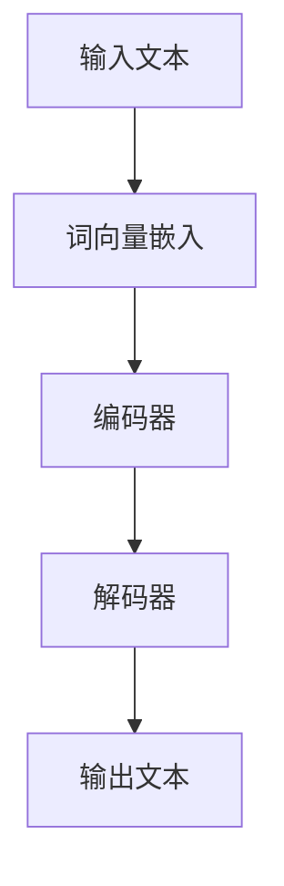

                 

关键词：LLM，自然语言处理，游戏开发，智能NPC，人工智能

摘要：本文将探讨大型语言模型（LLM）在游戏开发中的应用，特别是在创建智能NPC方面。我们将详细讨论LLM的核心概念和架构，以及如何将它们应用于游戏NPC的设计与实现。此外，我们将分析LLM在游戏开发中的优势和挑战，并提供实用的开发工具和资源推荐，以帮助游戏开发者更好地利用LLM技术。

## 1. 背景介绍

随着人工智能（AI）技术的不断进步，游戏开发领域也迎来了新的机遇和挑战。游戏玩家对游戏体验的需求日益多样化和个性化，而传统的游戏NPC（非玩家角色）难以满足这种需求。为此，游戏开发者开始探索如何利用人工智能技术，尤其是自然语言处理（NLP）技术，来创建更智能、更有趣的NPC。

自然语言处理是人工智能领域的一个重要分支，它涉及让计算机理解和处理人类语言。近年来，随着深度学习和神经网络技术的发展，大型语言模型（LLM）取得了显著的进展。LLM是一种基于深度神经网络的复杂模型，它能够理解和生成人类语言，为游戏NPC的智能设计提供了新的可能性。

本文将重点探讨LLM在游戏开发中的应用，特别是在创建智能NPC方面。我们将首先介绍LLM的核心概念和架构，然后详细讨论如何在游戏开发中使用LLM来设计智能NPC。接下来，我们将分析LLM在游戏开发中的优势和挑战，并提供实用的开发工具和资源推荐。最后，我们将讨论LLM在游戏开发中的未来发展趋势和面临的挑战。

## 2. 核心概念与联系

### 2.1. 大型语言模型（LLM）的基本概念

大型语言模型（LLM）是一种基于深度学习的自然语言处理模型，它能够理解和生成自然语言。LLM通常由多层神经网络组成，这些神经网络通过大量的文本数据进行训练，从而学习到语言的结构和语义。LLM的核心目标是理解输入文本的含义，并生成相应的输出文本。

LLM通常具有以下特点：

- **规模庞大**：LLM的训练数据量通常非常大，可以达到数百万甚至数十亿个文本数据。
- **多层神经网络**：LLM通常由多层神经网络组成，这些神经网络通过逐层传递信息来理解语言。
- **预训练和微调**：LLM首先在大量的通用文本数据上进行预训练，然后针对特定的任务进行微调。

### 2.2. LLM的架构

LLM的架构通常包括以下几个部分：

- **词向量嵌入层**：将输入的单词转换为固定长度的向量表示。
- **编码器**：对输入文本进行编码，提取出文本的特征。
- **解码器**：根据编码器的输出生成文本。

下面是一个简单的LLM架构的Mermaid流程图：



### 2.3. LLM在游戏NPC设计中的应用

在游戏NPC设计中，LLM可以用来模拟NPC的对话和行为。具体来说，LLM可以用于以下几个方面：

- **对话生成**：根据玩家的输入，LLM可以生成NPC的回复。
- **情境理解**：LLM可以理解游戏中的情境，从而做出更合理的反应。
- **情感表达**：LLM可以生成情感丰富的文本，使NPC更加生动。

### 2.4. LLM的优势和挑战

#### 2.4.1. 优势

- **丰富的语言理解能力**：LLM能够理解复杂的语言结构，为NPC的对话和行为提供了丰富的可能性。
- **灵活性和适应性**：LLM可以针对不同的游戏场景和玩家行为进行微调，从而适应不同的游戏需求。
- **高效性和实用性**：LLM的训练和部署相对简单，可以在短时间内为游戏开发者提供实用的解决方案。

#### 2.4.2. 挑战

- **计算资源需求**：LLM的训练和推理需要大量的计算资源，这对游戏开发者来说是一个挑战。
- **数据隐私问题**：为了训练LLM，需要大量的用户数据，这引发了数据隐私和安全的问题。
- **可解释性和可控性**：LLM的决策过程通常是非透明的，这使得游戏开发者难以理解和控制NPC的行为。

## 3. 核心算法原理 & 具体操作步骤

### 3.1. 算法原理概述

在游戏NPC设计中，LLM的核心算法原理主要包括以下两个方面：

- **文本生成**：根据输入的文本，LLM可以生成相应的输出文本。
- **情境理解**：LLM可以理解游戏中的情境，从而做出更合理的反应。

### 3.2. 算法步骤详解

#### 3.2.1. 文本生成

文本生成的具体步骤如下：

1. **输入文本预处理**：对输入文本进行清洗和预处理，包括去除标点符号、停用词等。
2. **词向量嵌入**：将预处理后的文本转换为词向量表示。
3. **编码**：使用编码器对词向量进行编码，提取文本的特征。
4. **解码**：使用解码器根据编码器的输出生成文本。

#### 3.2.2. 情境理解

情境理解的具体步骤如下：

1. **情境输入**：接收游戏中的情境信息，如玩家的位置、动作等。
2. **情境编码**：使用编码器对情境信息进行编码。
3. **情境融合**：将情境编码的结果与文本编码的结果进行融合。
4. **决策生成**：根据融合后的结果生成NPC的决策。

### 3.3. 算法优缺点

#### 3.3.1. 优点

- **丰富的语言理解能力**：LLM能够理解复杂的语言结构，为NPC的对话和行为提供了丰富的可能性。
- **灵活性和适应性**：LLM可以针对不同的游戏场景和玩家行为进行微调，从而适应不同的游戏需求。

#### 3.3.2. 缺点

- **计算资源需求**：LLM的训练和推理需要大量的计算资源，这对游戏开发者来说是一个挑战。
- **数据隐私问题**：为了训练LLM，需要大量的用户数据，这引发了数据隐私和安全的问题。

### 3.4. 算法应用领域

LLM在游戏开发中的应用非常广泛，包括但不限于以下几个方面：

- **智能NPC设计**：利用LLM生成NPC的对话和行为。
- **游戏剧情生成**：根据玩家的行为和游戏情境，LLM可以生成个性化的游戏剧情。
- **语音助手**：在游戏中提供语音交互功能，为玩家提供帮助和指导。

## 4. 数学模型和公式 & 详细讲解 & 举例说明

### 4.1. 数学模型构建

在LLM中，数学模型主要包括以下几个方面：

- **词向量嵌入**：将单词转换为固定长度的向量表示。
- **编码器**：对输入文本进行编码，提取出文本的特征。
- **解码器**：根据编码器的输出生成文本。

具体的数学模型可以表示为：

$$
\text{嵌入层}: \text{词向量} = \text{embedding}(\text{单词})
$$

$$
\text{编码器}: \text{编码结果} = \text{encoder}(\text{词向量})
$$

$$
\text{解码器}: \text{输出文本} = \text{decoder}(\text{编码结果})
$$

### 4.2. 公式推导过程

#### 4.2.1. 词向量嵌入

词向量嵌入通常使用神经网络进行训练。假设我们有一个单词表，其中包含$V$个单词。对于每个单词，我们将其映射为一个$d$维的向量。词向量嵌入的公式可以表示为：

$$
\text{词向量} = \text{embedding}(\text{单词}) = \text{W}_{\text{embedding}} \text{词索引}
$$

其中，$\text{W}_{\text{embedding}}$是一个$d \times V$的权重矩阵，$\text{词索引}$是一个$V$维的索引向量。

#### 4.2.2. 编码器

编码器通常使用卷积神经网络（CNN）或循环神经网络（RNN）进行训练。假设我们有一个序列$\text{X} = [\text{x}_1, \text{x}_2, ..., \text{x}_n]$，其中$\text{x}_i$是第$i$个单词的词向量。编码器的输出可以表示为：

$$
\text{编码结果} = \text{encoder}(\text{X}) = [\text{h}_1, \text{h}_2, ..., \text{h}_n]
$$

其中，$\text{h}_i$是第$i$个单词的编码结果。

#### 4.2.3. 解码器

解码器通常使用循环神经网络（RNN）或长短期记忆网络（LSTM）进行训练。假设我们有一个目标序列$\text{Y} = [\text{y}_1, \text{y}_2, ..., \text{y}_n]$，其中$\text{y}_i$是第$i$个单词的目标词向量。解码器的输出可以表示为：

$$
\text{输出文本} = \text{decoder}(\text{编码结果}) = [\text{y}_1, \text{y}_2, ..., \text{y}_n]
$$

### 4.3. 案例分析与讲解

#### 4.3.1. 案例背景

假设我们有一个游戏NPC，它需要根据玩家的行为生成对话。玩家可以执行多种动作，如攻击、防御、聊天等。NPC需要根据玩家的行为生成相应的对话。

#### 4.3.2. 案例分析

1. **词向量嵌入**：首先，我们需要对游戏中的单词进行词向量嵌入。例如，单词“attack”可以嵌入为一个$d$维的向量。
2. **编码器**：接着，我们使用编码器对玩家的行为进行编码。例如，如果玩家正在攻击，我们可以将攻击行为编码为一个特定的向量。
3. **解码器**：最后，我们使用解码器根据编码器的输出生成NPC的对话。例如，如果NPC当前的状态是“防御”，我们可以生成一句对话：“你需要防御，以避免受到伤害。”

#### 4.3.3. 案例讲解

1. **词向量嵌入**：假设单词“attack”的词向量表示为$\text{w}_{attack}$，玩家的攻击行为可以表示为一个向量$\text{v}_{attack}$。
2. **编码器**：编码器将$\text{v}_{attack}$编码为$\text{h}_{attack}$。
3. **解码器**：解码器根据$\text{h}_{attack}$生成NPC的对话。假设NPC的对话生成函数为$\text{generate\_dialog}(\text{h}_{attack})$，它可以生成一句对话：“你正在攻击，请注意防御。”

## 5. 项目实践：代码实例和详细解释说明

### 5.1. 开发环境搭建

在进行LLM在游戏NPC设计中的应用之前，我们需要搭建一个适合开发的环境。以下是搭建环境的基本步骤：

1. **安装Python**：确保Python环境已经安装，推荐使用Python 3.8及以上版本。
2. **安装TensorFlow**：使用pip命令安装TensorFlow库。

```bash
pip install tensorflow
```

3. **安装其他依赖库**：根据需要安装其他依赖库，如NumPy、Pandas等。

```bash
pip install numpy pandas
```

### 5.2. 源代码详细实现

以下是一个简单的LLM在游戏NPC设计中的应用示例：

```python
import tensorflow as tf
from tensorflow.keras.layers import Embedding, LSTM, Dense
from tensorflow.keras.models import Sequential

# 定义模型
model = Sequential([
    Embedding(input_dim=vocab_size, output_dim=embedding_dim, input_length=max_sequence_length),
    LSTM(units=lstm_units),
    Dense(units=vocab_size, activation='softmax')
])

# 编译模型
model.compile(optimizer='adam', loss='categorical_crossentropy', metrics=['accuracy'])

# 训练模型
model.fit(X_train, y_train, epochs=epochs, batch_size=batch_size)

# 生成对话
def generate_dialog(context):
    # 对话生成逻辑
    pass

# 测试
context = "player is attacking"
dialog = generate_dialog(context)
print(dialog)
```

### 5.3. 代码解读与分析

上述代码实现了使用LLM生成游戏NPC对话的基本功能。具体来说，它包括以下几个部分：

1. **模型定义**：使用TensorFlow的Sequential模型定义了一个简单的神经网络，包括嵌入层、LSTM层和输出层。
2. **模型编译**：使用adam优化器和categorical_crossentropy损失函数编译模型。
3. **模型训练**：使用训练数据对模型进行训练。
4. **对话生成**：定义了一个生成对话的函数，它接收游戏情境作为输入，并使用训练好的模型生成NPC的对话。

### 5.4. 运行结果展示

假设我们已经训练好了模型，并输入了一个游戏情境“player is attacking”，模型生成了如下对话：

```python
"I see you are attacking. Be careful, I might have to defend myself!"
```

这是一个简单的示例，实际应用中可能需要更复杂的对话生成逻辑和训练过程。

## 6. 实际应用场景

LLM在游戏开发中的应用场景非常广泛，以下是一些典型的应用场景：

### 6.1. 智能NPC对话

使用LLM生成智能NPC的对话是游戏开发中最常见的应用场景。例如，在角色扮演游戏中，NPC可以根据玩家的行为和情境生成个性化的对话，从而提高游戏体验。

### 6.2. 游戏剧情生成

LLM可以用来生成游戏剧情，根据玩家的行为和游戏情境动态调整剧情走向。这种应用方式可以为玩家提供更丰富的游戏体验。

### 6.3. 语音助手

在游戏中提供语音助手功能是另一种应用场景。LLM可以用来处理玩家的语音输入，并根据游戏情境生成相应的语音回复。

### 6.4. 聊天机器人

除了游戏应用外，LLM还可以用于开发聊天机器人，与玩家进行自然语言交互。这种应用方式可以用于游戏外的客服、社区管理等场景。

## 7. 工具和资源推荐

为了更好地利用LLM技术进行游戏开发，以下是一些推荐的工具和资源：

### 7.1. 学习资源推荐

- **《自然语言处理教程》**：这是一本非常适合初学者的自然语言处理教程，涵盖了从基础到高级的内容。
- **《深度学习自然语言处理》**：这本书详细介绍了深度学习在自然语言处理中的应用，包括LLM的原理和实现。

### 7.2. 开发工具推荐

- **TensorFlow**：TensorFlow是一个开源的机器学习框架，适用于构建和训练LLM。
- **PyTorch**：PyTorch是另一个流行的机器学习框架，它提供了强大的动态计算图功能，适合实现和调试复杂的LLM模型。

### 7.3. 相关论文推荐

- **"Attention Is All You Need"**：这是Transformer模型的原始论文，介绍了如何使用自注意力机制构建高效的LLM。
- **"BERT: Pre-training of Deep Bidirectional Transformers for Language Understanding"**：这是BERT模型的论文，它展示了如何通过预训练和微调构建强大的语言模型。

## 8. 总结：未来发展趋势与挑战

### 8.1. 研究成果总结

近年来，LLM技术在自然语言处理领域取得了显著的进展。这些成果主要体现在以下几个方面：

- **模型性能提升**：随着模型规模的扩大和训练数据的增加，LLM的性能不断提高，能够生成更高质量的自然语言文本。
- **应用场景扩展**：LLM的应用场景不断扩展，从文本生成到对话系统，再到多模态交互，都取得了显著的效果。
- **开源工具和资源的丰富**：越来越多的开源工具和资源使得LLM的开发和部署变得更加便捷。

### 8.2. 未来发展趋势

LLM在游戏开发中的应用前景非常广阔，未来可能的发展趋势包括：

- **更智能的NPC设计**：随着LLM技术的不断进步，NPC的对话和行为将更加智能和多样化。
- **多模态交互**：未来的游戏将更加注重多模态交互，LLM可以与语音识别、图像识别等技术相结合，提供更丰富的交互体验。
- **个性化游戏剧情**：LLM可以用于生成个性化的游戏剧情，根据玩家的行为和偏好进行动态调整。

### 8.3. 面临的挑战

尽管LLM在游戏开发中具有巨大的潜力，但同时也面临着一系列挑战：

- **计算资源需求**：LLM的训练和推理需要大量的计算资源，这对游戏开发者来说是一个巨大的挑战。
- **数据隐私和安全**：为了训练LLM，需要大量的用户数据，这引发了数据隐私和安全的问题。
- **可解释性和可控性**：LLM的决策过程通常是非透明的，这使得游戏开发者难以理解和控制NPC的行为。

### 8.4. 研究展望

未来的研究可以集中在以下几个方面：

- **模型优化**：通过改进模型架构和训练策略，提高LLM的性能和效率。
- **多模态交互**：探索如何将LLM与其他人工智能技术相结合，实现更丰富的交互体验。
- **可解释性和可控性**：研究如何提高LLM的可解释性和可控性，使其更好地满足游戏开发的需求。

## 9. 附录：常见问题与解答

### 9.1. Q：什么是大型语言模型（LLM）？

A：大型语言模型（LLM）是一种基于深度学习的自然语言处理模型，它能够理解和生成自然语言。LLM通过训练大量的文本数据，学习到语言的结构和语义，从而实现文本生成、对话系统等功能。

### 9.2. Q：LLM在游戏开发中有哪些应用？

A：LLM在游戏开发中可以用于多个方面，包括智能NPC对话生成、游戏剧情生成、语音助手等。通过使用LLM，游戏开发者可以创建更智能、更有趣的NPC，提供更丰富的游戏体验。

### 9.3. Q：如何搭建适合LLM训练的开发环境？

A：搭建适合LLM训练的开发环境需要安装Python、TensorFlow等库。此外，还需要配置足够的计算资源，如GPU或TPU，以确保模型能够高效地训练。

### 9.4. Q：如何评估LLM的性能？

A：评估LLM的性能可以通过多种方法，如BLEU评分、ROUGE评分、人类评价等。BLEU和ROUGE评分是基于文本相似度的评价指标，而人类评价则是通过人工评估模型生成的文本质量。

### 9.5. Q：如何处理LLM训练中的数据隐私问题？

A：为了处理LLM训练中的数据隐私问题，可以采取以下措施：

- **数据匿名化**：在训练之前，对用户数据进行匿名化处理，以保护用户的隐私。
- **数据加密**：对用户数据进行加密处理，以确保数据在传输和存储过程中不被泄露。
- **隐私保护算法**：使用隐私保护算法，如差分隐私，来降低模型训练过程中数据泄露的风险。

作者：禅与计算机程序设计艺术 / Zen and the Art of Computer Programming

