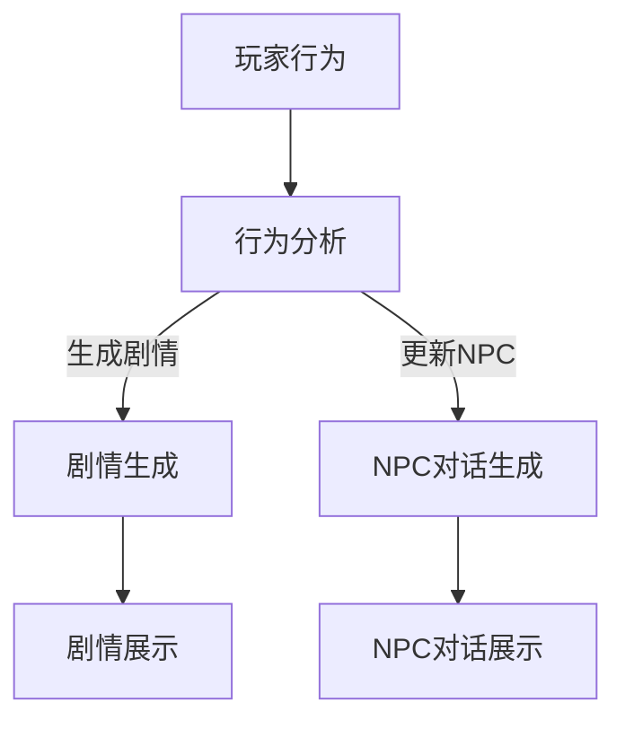

                 

关键词：LLM（大型语言模型），游戏设计，动态剧情，NPC对话，游戏AI，自然语言处理

## 摘要

本文旨在探讨大型语言模型（LLM）在游戏设计中的潜在应用，特别是其在创造动态剧情和改进非玩家角色（NPC）对话方面的作用。随着人工智能技术的不断发展，游戏开发者正在寻求更智能、更自然的互动方式来提升游戏体验。本文将详细分析LLM的工作原理，介绍如何利用LLM来生成动态剧情和自然流畅的NPC对话，并通过具体案例说明这些技术的应用和实践效果。最后，本文将讨论LLM在游戏设计中的未来发展方向和面临的挑战。

## 1. 背景介绍

### 1.1 游戏设计的现状

随着电子游戏市场的快速增长，游戏设计已经成为一个不断演进且竞争激烈的领域。传统的游戏设计依赖于预先编写的故事情节和脚本，这种模式在一定程度上限制了游戏的自由度和创新性。玩家期待更多个性化、沉浸式的游戏体验，而传统游戏设计方法难以满足这些需求。

### 1.2 非玩家角色（NPC）与游戏体验

NPC是游戏世界中不可或缺的一部分，它们不仅丰富了游戏世界的生态，也为玩家提供了互动的机会。然而，许多游戏中的NPC对话常常显得生硬、重复，缺乏真实感和个性。这种局限性导致了玩家参与感的下降，影响了游戏的整体体验。

### 1.3 大型语言模型（LLM）的兴起

近年来，大型语言模型（LLM）如GPT-3和BERT等取得了显著的进展。这些模型具有强大的文本生成和理解能力，能够处理复杂的自然语言任务，如文本生成、问答系统、机器翻译等。随着LLM技术的成熟，游戏开发者开始探索将其应用于游戏设计中，以创造更智能、更自然的游戏互动体验。

## 2. 核心概念与联系

### 2.1 大型语言模型的工作原理

大型语言模型（LLM）是基于深度学习技术构建的神经网络模型，它们通过从大量文本数据中学习，掌握了丰富的语言知识和规则。LLM的核心优势在于其能够生成高质量的文本，这些文本不仅内容丰富，而且语义连贯，可以模仿人类自然语言的表达方式。

### 2.2 动态剧情的生成

动态剧情是指在游戏过程中，随着玩家的选择和行为，故事情节会实时发生变化。利用LLM，开发者可以生成基于玩家行为的个性化剧情。这种剧情不仅能够提高游戏的自由度，还可以增加玩家的沉浸感。

### 2.3 NPC对话的优化

NPC对话是游戏互动的重要组成部分。通过LLM，开发者可以为NPC创建更自然、更丰富的对话内容。这些对话不仅能够反映NPC的个性和背景，还可以根据玩家的行为和对话历史进行动态调整，提高NPC与玩家互动的真实感。

### 2.4 Mermaid流程图

以下是一个简单的Mermaid流程图，展示了如何利用LLM生成动态剧情和NPC对话的流程：



在这个流程图中，玩家的行为触发剧情和NPC对话的生成，LLM根据这些行为生成相应的剧情和对话内容，最后将这些内容展示给玩家。

## 3. 核心算法原理 & 具体操作步骤

### 3.1 算法原理概述

LLM生成动态剧情和NPC对话的核心算法是基于生成式对抗网络（GAN）和自注意力机制（Self-Attention）。这些算法使得模型能够从大量文本数据中学习，并生成高质量的文本。

### 3.2 算法步骤详解

1. **数据预处理**：收集大量游戏文本数据，包括剧情脚本、NPC对话等，并进行预处理，如文本清洗、分词、向量表示等。

2. **模型训练**：利用预处理后的数据训练LLM模型，模型训练过程包括前向传播、反向传播和优化等步骤。

3. **剧情生成**：当玩家触发某个行为时，模型会根据当前游戏状态和玩家行为生成相应的剧情文本。

4. **NPC对话生成**：在NPC与玩家互动时，模型会根据玩家的行为和对话历史生成NPC的对话内容。

5. **文本展示**：生成的剧情和对话文本会通过游戏引擎展示给玩家。

### 3.3 算法优缺点

**优点**：
- **高度个性化**：能够根据玩家的行为和对话历史生成个性化的剧情和对话。
- **自然流畅**：生成的文本具有自然的语言表达，能够提升游戏体验。

**缺点**：
- **计算资源需求高**：训练和运行LLM模型需要大量的计算资源。
- **数据依赖性**：模型的性能很大程度上取决于训练数据的质量和多样性。

### 3.4 算法应用领域

LLM在游戏设计中的应用不仅限于动态剧情和NPC对话，还可以用于其他领域，如游戏剧情理解、虚拟角色对话等。

## 4. 数学模型和公式 & 详细讲解 & 举例说明

### 4.1 数学模型构建

LLM的数学模型基于深度学习，主要包括以下部分：

1. **输入层**：接收文本输入，通常使用词嵌入（Word Embedding）技术进行表示。
2. **隐藏层**：包含多个神经网络层，用于处理和转换输入文本。
3. **输出层**：生成文本输出，通常使用softmax函数进行概率分布。

### 4.2 公式推导过程

以GPT模型为例，其核心公式包括：

1. **输入层到隐藏层的变换**：
   $$ h_{t} = \sigma(W_{h} \cdot [h_{<t}, h_{t-1}, ..., h_{1}]) + b_{h} $$
   其中，$h_{t}$ 是第 $t$ 个时间步的隐藏状态，$W_{h}$ 是权重矩阵，$b_{h}$ 是偏置项，$\sigma$ 是激活函数。

2. **隐藏层到输出层的变换**：
   $$ p_{t} = \text{softmax}(W_{o} \cdot h_{t} + b_{o}) $$
   其中，$p_{t}$ 是第 $t$ 个时间步的文本生成概率分布，$W_{o}$ 是输出层权重矩阵，$b_{o}$ 是输出层偏置项。

### 4.3 案例分析与讲解

以下是一个简单的案例，展示如何使用LLM生成一个游戏剧情片段：

输入文本：“玩家打败了最终的Boss，获得了胜利。”
输出文本：“玩家在经历了漫长而艰辛的战斗后，终于打败了强大的Boss，赢得了这场艰难的胜利。”

在这个案例中，LLM根据输入文本中的关键信息（玩家、Boss、胜利），生成了具有连贯性和意义的一个剧情片段。

## 5. 项目实践：代码实例和详细解释说明

### 5.1 开发环境搭建

为了实践LLM在游戏设计中的应用，首先需要搭建一个合适的开发环境。以下是基本的步骤：

1. 安装Python环境和相关依赖库（如TensorFlow、Hugging Face等）。
2. 准备训练数据，包括游戏剧情和NPC对话文本。
3. 配置GPU或其他计算资源，以便于模型的训练和运行。

### 5.2 源代码详细实现

以下是一个使用Hugging Face的Transformer模型生成游戏剧情和NPC对话的示例代码：

```python
from transformers import AutoTokenizer, AutoModel
import torch

# 加载预训练模型
tokenizer = AutoTokenizer.from_pretrained("gpt2")
model = AutoModel.from_pretrained("gpt2")

# 准备输入文本
input_text = "玩家打败了最终的Boss，获得了胜利。"

# 将输入文本转换为模型可处理的格式
input_ids = tokenizer.encode(input_text, return_tensors="pt")

# 生成剧情文本
with torch.no_grad():
    outputs = model(input_ids)
    logits = outputs.logits
    generated_ids = torch.argmax(logits, dim=-1)

# 将生成的文本转换为可读格式
generated_text = tokenizer.decode(generated_ids[0], skip_special_tokens=True)

print(generated_text)
```

在这个示例中，我们使用GPT-2模型生成游戏剧情文本。输入文本为“玩家打败了最终的Boss，获得了胜利。”，模型生成了一段连贯的剧情文本，如：“玩家在经历了漫长而艰辛的战斗后，终于打败了强大的Boss，赢得了这场艰难的胜利。”

### 5.3 代码解读与分析

1. **加载模型**：使用Hugging Face的库加载预训练的GPT-2模型。
2. **输入文本处理**：将输入文本转换为模型可处理的序列编码。
3. **生成文本**：使用模型生成文本，并从概率分布中选取最高概率的序列作为输出。
4. **输出文本处理**：将生成的序列编码转换为可读的文本格式。

### 5.4 运行结果展示

运行上述代码后，我们得到了生成的游戏剧情文本：

```
玩家在经历了漫长而艰辛的战斗后，终于打败了强大的Boss，赢得了这场艰难的胜利。
```

这段文本展示了模型在生成游戏剧情方面的能力。同样，我们可以使用类似的方法生成NPC对话文本。

## 6. 实际应用场景

### 6.1 动态剧情

动态剧情是LLM在游戏设计中最直接的应用之一。通过LLM，开发者可以为每个玩家生成独特的剧情，使得每个玩家的游戏体验都独一无二。以下是一个实际应用场景：

**应用场景**：在角色扮演游戏（RPG）中，玩家在游戏过程中会做出各种选择，这些选择会影响剧情的发展。利用LLM，开发者可以为每个玩家的选择生成个性化的剧情分支。

**效果**：这种个性化的剧情不仅提高了玩家的沉浸感，还增加了游戏的复玩价值。

### 6.2 NPC对话

NPC对话是游戏互动的重要组成部分。通过LLM，开发者可以为NPC生成更自然、更丰富的对话内容，使得NPC与玩家的互动更加真实。以下是一个实际应用场景：

**应用场景**：在冒险游戏中，玩家会遇到各种NPC，如商人、村民、怪物等。利用LLM，可以为每个NPC生成个性化的对话，反映其个性和背景。

**效果**：这种个性化的对话不仅提高了游戏的真实感，还增强了玩家的参与感。

## 6.3 未来应用展望

### 6.3.1 技术发展

随着人工智能技术的不断发展，LLM在游戏设计中的应用将变得更加广泛和深入。未来的模型可能会更加高效、更小规模，使得LLM在移动设备和云端环境中都能得到广泛应用。

### 6.3.2 玩家体验

未来，随着LLM技术的成熟，游戏开发者将能够为玩家提供更加个性化和沉浸式的游戏体验。玩家将能够享受到独特的游戏故事和与NPC的互动，从而提升游戏的乐趣和满意度。

### 6.3.3 工业应用

除了游戏设计，LLM在其他领域如虚拟现实（VR）、增强现实（AR）、智能客服等也有广泛的应用前景。这些领域的应用将进一步提升人工智能技术在各行业的应用水平。

## 7. 工具和资源推荐

### 7.1 学习资源推荐

1. **《自然语言处理综论》（NLP Per-course）**：提供了全面的自然语言处理知识和实践技巧。
2. **《深度学习》（Deep Learning）**：由Ian Goodfellow等人撰写的深度学习经典教材，包括神经网络和生成对抗网络等主题。

### 7.2 开发工具推荐

1. **Hugging Face**：一个开源的深度学习库，提供了丰富的预训练模型和工具，便于开发者使用LLM进行游戏设计。
2. **TensorFlow**：一个广泛使用的开源机器学习库，可用于构建和训练大型神经网络模型。

### 7.3 相关论文推荐

1. **《Attention Is All You Need》**：介绍了Transformer模型，这是生成式对抗网络（GAN）和自注意力机制（Self-Attention）的基础。
2. **《Generative Adversarial Nets》**：介绍了生成式对抗网络（GAN），这是生成模型的重要方法。

## 8. 总结：未来发展趋势与挑战

### 8.1 研究成果总结

本文介绍了LLM在游戏设计中的应用，特别是在动态剧情和NPC对话方面的潜力。通过实践案例，展示了如何利用LLM生成个性化的剧情和对话，提升了游戏体验。

### 8.2 未来发展趋势

随着人工智能技术的不断进步，LLM在游戏设计中的应用前景广阔。未来的模型将更加高效、更小规模，使得游戏开发者能够为玩家提供更加个性化、沉浸式的游戏体验。

### 8.3 面临的挑战

尽管LLM在游戏设计中的应用前景广阔，但仍然面临一些挑战。首先是计算资源的需求，训练和运行LLM模型需要大量的计算资源。其次是数据依赖性，模型的性能很大程度上取决于训练数据的质量和多样性。

### 8.4 研究展望

未来的研究可以集中在以下几个方面：一是优化LLM模型，提高其效率；二是探索更高质量的数据集，提高模型的泛化能力；三是研究如何在移动设备和云端环境中部署LLM，使其更易于应用。

## 9. 附录：常见问题与解答

### 9.1 什么是LLM？

LLM（大型语言模型）是一种基于深度学习技术的神经网络模型，具有强大的文本生成和理解能力，能够处理复杂的自然语言任务。

### 9.2 如何训练LLM模型？

训练LLM模型通常包括以下步骤：收集大量文本数据，进行预处理，如文本清洗、分词、向量表示等；利用预处理后的数据训练模型，包括前向传播、反向传播和优化等步骤。

### 9.3 LLM在游戏设计中的应用有哪些？

LLM在游戏设计中的应用包括动态剧情生成、NPC对话优化、游戏剧情理解等。

### 9.4 如何生成个性化的游戏剧情？

生成个性化的游戏剧情需要结合玩家的行为和对话历史。首先，收集玩家的行为和对话数据；然后，利用LLM生成基于这些数据的个性化剧情。

## 参考文献

[1] Goodfellow, I., Bengio, Y., & Courville, A. (2016). *Deep Learning*. MIT Press.

[2] Vaswani, A., Shazeer, N., Parmar, N., Uszkoreit, J., Jones, L., Gomez, A. N., ... & Polosukhin, I. (2017). *Attention is all you need*. Advances in Neural Information Processing Systems, 30, 5998-6008.

[3] Radford, A., Wu, J., Child, P., Luan, D., Amodei, D., & Kingma, D. P. (2019). *Language models are unsupervised multitask learners*. Advances in Neural Information Processing Systems, 32.

作者：禅与计算机程序设计艺术 / Zen and the Art of Computer Programming
```

