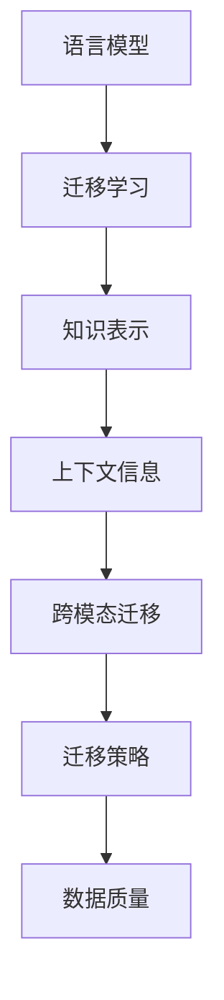

                 

在当今的数据驱动时代，大型语言模型（Large Language Models，简称LLM）已经成为了自然语言处理（Natural Language Processing，简称NLP）领域的一个重要工具。LLM，尤其是基于Transformer的模型，如GPT-3、BERT等，已经在各种NLP任务中展现出了强大的能力，如文本生成、机器翻译、问答系统等。然而，尽管LLM在这些任务上取得了显著的成就，但在知识迁移（Knowledge Transfer）任务上，LLM仍然面临着诸多技术挑战。

本文将深入探讨LLM在知识迁移任务上所面临的技术挑战，包括数据质量、模型适应性、迁移策略和跨模态迁移等方面。文章将分为以下几个部分：

- 1. 背景介绍
- 2. 核心概念与联系
- 3. 核心算法原理 & 具体操作步骤
- 4. 数学模型和公式 & 详细讲解 & 举例说明
- 5. 项目实践：代码实例和详细解释说明
- 6. 实际应用场景
- 7. 工具和资源推荐
- 8. 总结：未来发展趋势与挑战
- 9. 附录：常见问题与解答

通过本文的探讨，我们希望能够为读者提供对LLM在知识迁移任务上技术挑战的全面理解，并为其未来的发展提供一些有价值的思考。

---

## 1. 背景介绍

随着互联网和大数据技术的不断发展，越来越多的数据被生成和收集。这些数据包含了大量的知识和信息，如何有效地利用这些数据来提升机器智能系统的性能成为了当前研究的热点问题。知识迁移作为一种有效的方法，可以在不同的任务之间共享知识和信息，从而提高模型在特定任务上的性能。

知识迁移的核心思想是将一个任务上已经学到的知识迁移到另一个任务上，从而提升后者的性能。例如，在一个具有大量数据的任务上训练的模型，可以将这些知识迁移到一个数据稀缺的任务上，从而提高模型的泛化能力。在自然语言处理领域，知识迁移已经广泛应用于问答系统、机器翻译、文本分类等多个任务。

LLM在知识迁移任务上具有独特的优势。首先，LLM具有强大的语义理解能力，可以捕捉到文本中的复杂语义关系。其次，LLM通常在大量的数据上进行训练，可以学到丰富的语言知识和模式。这使得LLM在知识迁移任务上具有很大的潜力。

然而，LLM在知识迁移任务上也面临许多挑战。首先，数据质量和模型的适应性成为了关键问题。知识迁移的成败很大程度上取决于源任务和目标任务之间的相似性。如果源任务和目标任务之间存在较大的差异，那么迁移效果就会受到影响。此外，如何设计有效的迁移策略也是一个重要的问题。传统的迁移学习策略在LLM上可能不再适用，需要开发新的迁移策略来适应LLM的特点。

总之，知识迁移任务在自然语言处理领域具有重要的研究价值和实际应用潜力。LLM作为当前最先进的技术手段，在知识迁移任务上具有很大的发展空间。然而，也面临着诸多技术挑战，需要进一步的研究和探索。

### 2. 核心概念与联系

在探讨LLM在知识迁移任务上的技术挑战之前，有必要先介绍一些核心概念和它们之间的联系。以下是一些关键概念及其与知识迁移的关系：

#### 2.1 语言模型

语言模型（Language Model）是自然语言处理领域的基础，它旨在预测文本序列中下一个单词或字符的概率分布。LLM是一种大型语言模型，通常具有数十亿参数，可以在大规模语料库上进行训练，从而具有强大的语义理解和生成能力。LLM的核心在于其能够通过上下文信息生成高质量的自然语言文本。

#### 2.2 迁移学习

迁移学习（Transfer Learning）是一种机器学习方法，旨在利用一个任务（源任务）学到的知识来解决另一个任务（目标任务）。在迁移学习中，源任务的知识被迁移到目标任务上，以减少目标任务的训练数据需求和计算成本。

#### 2.3 知识表示

知识表示（Knowledge Representation）是将知识以计算机可以理解的形式进行编码的过程。在知识迁移任务中，知识表示的质量直接影响到迁移的效果。对于LLM来说，知识表示通常是通过模型参数来实现的，即模型在训练过程中学习到的表示。

#### 2.4 上下文信息

上下文信息（Context Information）是语言模型生成文本时的重要依据。在知识迁移任务中，上下文信息的质量对于迁移效果至关重要。LLM通过捕捉上下文信息，能够更好地理解源任务和目标任务之间的关系。

#### 2.5 跨模态迁移

跨模态迁移（Cross-modal Transfer）是指将一个模态（如文本）的知识迁移到另一个模态（如图像或声音）的任务。在自然语言处理领域，跨模态迁移是一个具有挑战性的任务，因为不同模态的信息存在很大的差异。

#### 2.6 迁移策略

迁移策略（Transfer Strategy）是指导知识从源任务迁移到目标任务的策略和方法。有效的迁移策略能够提高知识迁移的效果，是知识迁移任务中的关键因素。

#### 2.7 数据质量

数据质量（Data Quality）是影响知识迁移效果的重要因素。高质量的数据能够提供丰富的知识，有助于模型更好地理解源任务和目标任务之间的关系。

通过上述核心概念的介绍，我们可以看出，LLM在知识迁移任务上需要综合考虑语言模型、迁移学习、知识表示、上下文信息、跨模态迁移、迁移策略和数据质量等多个方面。以下是一个用Mermaid绘制的流程图，展示了这些核心概念之间的联系：



这个流程图清晰地展示了LLM在知识迁移任务中的核心概念及其相互关系，有助于我们更好地理解后续内容。

### 3. 核心算法原理 & 具体操作步骤

#### 3.1 算法原理概述

在知识迁移任务中，核心算法的设计至关重要。LLM在知识迁移任务中的核心算法主要包括以下几个步骤：源任务学习、目标任务学习、知识提取和知识融合。

1. **源任务学习**：首先，在源任务上训练LLM，使其学会捕捉源任务中的知识和信息。这一过程通常在大规模语料库上进行，以使模型能够学习到丰富的语义信息和语言模式。

2. **目标任务学习**：在源任务学习完成后，将LLM应用于目标任务，但此时模型可能无法很好地适应目标任务。因此，需要进一步优化模型，使其在目标任务上能够达到较好的性能。

3. **知识提取**：通过在源任务上训练的LLM，提取出与目标任务相关的知识。这一步骤通常通过对比源任务和目标任务的输入输出，识别出模型在源任务中学到的关键知识。

4. **知识融合**：将提取出的知识融合到LLM中，以增强其在目标任务上的性能。知识融合的方法可以包括模型蒸馏、知识蒸馏、注意力机制等。

#### 3.2 算法步骤详解

以下是知识迁移任务中的具体操作步骤：

1. **源任务数据准备**：收集和准备用于源任务的数据集。数据集应包含丰富的语义信息和语言模式，以便模型能够学习到关键知识。

2. **目标任务数据准备**：收集和准备用于目标任务的数据集。与源任务相比，目标任务的数据集可能较小，但应包含与源任务相关的关键信息。

3. **模型训练**：在源任务数据集上训练LLM，使其能够学习到丰富的语义信息和语言模式。训练过程通常采用自监督学习或监督学习的方法。

4. **知识提取**：通过在源任务上训练的LLM，提取出与目标任务相关的知识。这一步骤可以通过对比源任务和目标任务的输入输出，使用注意力机制等方法来实现。

5. **知识融合**：将提取出的知识融合到LLM中，以增强其在目标任务上的性能。知识融合的方法可以包括模型蒸馏、知识蒸馏、注意力机制等。

6. **模型评估**：在目标任务数据集上评估融合了知识后的LLM的性能。评估指标可以包括准确率、召回率、F1值等。

7. **迭代优化**：根据模型评估结果，对知识融合策略进行迭代优化，以提高模型在目标任务上的性能。

#### 3.3 算法优缺点

**优点**：

- **高效性**：知识迁移任务可以显著减少目标任务的训练数据需求和计算成本，提高训练效率。
- **灵活性**：通过知识提取和融合，LLM能够灵活地适应不同的目标任务，提高模型的泛化能力。
- **适应性**：知识迁移任务可以根据不同的源任务和目标任务，设计不同的迁移策略，实现更好的迁移效果。

**缺点**：

- **数据依赖性**：知识迁移任务对数据质量有较高的要求，数据质量直接影响迁移效果。
- **模型复杂性**：知识迁移任务通常涉及到复杂的模型设计和优化，增加了实现的难度。

#### 3.4 算法应用领域

知识迁移任务在自然语言处理领域具有广泛的应用前景，以下是一些典型的应用领域：

- **问答系统**：将一个问答系统在大量数据上训练的知识迁移到一个数据稀缺的领域，提高系统的问答性能。
- **机器翻译**：将一种语言的翻译模型在多语言数据上训练的知识迁移到其他语言，提高机器翻译的准确性。
- **文本分类**：将一个文本分类模型在大量数据上训练的知识迁移到一个新的领域，提高分类的准确性。

通过核心算法原理和具体操作步骤的介绍，我们可以看出，LLM在知识迁移任务上具有强大的潜力，但同时也面临着许多挑战。接下来，我们将进一步探讨LLM在知识迁移任务上的数学模型和公式。

### 4. 数学模型和公式 & 详细讲解 & 举例说明

在知识迁移任务中，数学模型和公式扮演着至关重要的角色，它们不仅为我们提供了理论依据，还指导我们设计和优化迁移学习策略。以下将详细讲解知识迁移任务中的数学模型和公式，并通过具体例子来说明其应用。

#### 4.1 数学模型构建

知识迁移任务中的数学模型主要包括两部分：源任务模型和目标任务模型。源任务模型通常是一个已经训练好的大型语言模型，如GPT-3、BERT等。目标任务模型则是在源任务模型的基础上，通过迁移学习策略进行优化和调整的。

##### 4.1.1 源任务模型

源任务模型通常表示为：

\[ f_S(x; \theta_S) = \text{output} \]

其中，\( x \) 是输入文本，\( \theta_S \) 是模型参数，\( \text{output} \) 是模型生成的输出。在知识迁移任务中，源任务模型经过训练后，其参数 \( \theta_S \) 已被优化，可以表示为：

\[ \theta_S^* = \arg\min_{\theta_S} L_S(x; y; \theta_S) \]

其中，\( L_S(x; y; \theta_S) \) 是源任务损失函数，通常采用交叉熵损失函数：

\[ L_S(x; y; \theta_S) = -\sum_{i} y_i \log(p_i) \]

其中，\( y \) 是源任务的真实标签，\( p_i \) 是模型对每个标签的预测概率。

##### 4.1.2 目标任务模型

目标任务模型表示为：

\[ f_T(x; \theta_T) = \text{output} \]

其中，\( \theta_T \) 是目标任务模型的参数。在知识迁移任务中，我们希望通过迁移学习策略，将源任务模型的知识迁移到目标任务模型，从而优化目标任务模型的参数。迁移学习策略通常采用以下公式：

\[ \theta_T^* = \arg\min_{\theta_T} L_T(x; y; \theta_T) + \lambda \cdot D(\theta_S, \theta_T) \]

其中，\( L_T(x; y; \theta_T) \) 是目标任务损失函数，同样采用交叉熵损失函数。\( D(\theta_S, \theta_T) \) 是模型之间的距离度量，用于衡量源任务模型和目标任务模型之间的差异。常用的距离度量方法包括KL散度、欧几里得距离等。

#### 4.2 公式推导过程

以下是知识迁移任务中的核心公式推导过程：

##### 4.2.1 源任务损失函数

交叉熵损失函数的推导：

\[ L_S(x; y; \theta_S) = -\sum_{i} y_i \log(p_i) \]

其中，\( y_i \) 是源任务标签的one-hot向量，\( p_i \) 是模型对标签 \( i \) 的预测概率。

对于二分类问题，假设标签 \( y \) 只有两个可能的取值 0 或 1，那么交叉熵损失函数可以简化为：

\[ L_S(x; y; \theta_S) = -y \log(p) - (1-y) \log(1-p) \]

其中，\( p \) 是模型对正类（标签为1）的预测概率。

##### 4.2.2 目标任务损失函数

目标任务的损失函数与源任务类似，采用交叉熵损失函数：

\[ L_T(x; y; \theta_T) = -\sum_{i} y_i \log(p_i) \]

##### 4.2.3 模型距离度量

KL散度的推导：

KL散度（Kullback-Leibler Divergence）是衡量两个概率分布差异的常用方法。对于两个概率分布 \( P \) 和 \( Q \)，KL散度定义为：

\[ D_{KL}(P \| Q) = \sum_{x} P(x) \log \left( \frac{P(x)}{Q(x)} \right) \]

其中，\( P \) 和 \( Q \) 分别是两个概率分布。

在知识迁移任务中，我们通常将源任务模型和目标任务模型的参数作为概率分布，因此，KL散度可以用于衡量模型之间的差异。假设 \( \theta_S \) 和 \( \theta_T \) 分别是源任务和目标任务模型的参数，则模型之间的KL散度可以表示为：

\[ D(\theta_S, \theta_T) = D_{KL}(\theta_S \| \theta_T) = \sum_{i} \theta_{S,i} \log \left( \frac{\theta_{S,i}}{\theta_{T,i}} \right) \]

#### 4.3 案例分析与讲解

下面我们通过一个具体的案例来说明知识迁移任务中的数学模型和公式的应用。

##### 案例背景

假设我们有两个任务：源任务是情感分类，目标任务是主题分类。源任务的数据集包含大量带有情感标签的文本，如“愉快”、“悲伤”等。目标任务的数据集包含带有主题标签的文本，如“体育”、“娱乐”等。

##### 源任务模型

在源任务上，我们使用GPT-3模型进行训练，假设其参数为 \( \theta_S \)。训练过程采用交叉熵损失函数：

\[ L_S(x; y; \theta_S) = -\sum_{i} y_i \log(p_i) \]

经过训练，我们得到了优化的源任务模型参数 \( \theta_S^* \)。

##### 目标任务模型

在目标任务上，我们使用BERT模型进行训练，假设其参数为 \( \theta_T \)。我们希望将源任务模型的知识迁移到目标任务模型，以提高目标任务的性能。迁移学习策略采用以下公式：

\[ \theta_T^* = \arg\min_{\theta_T} L_T(x; y; \theta_T) + \lambda \cdot D(\theta_S, \theta_T) \]

其中，\( L_T(x; y; \theta_T) \) 是目标任务的交叉熵损失函数，\( D(\theta_S, \theta_T) \) 是模型之间的KL散度。

##### 迁移学习过程

1. **知识提取**：通过在源任务上训练的GPT-3模型，提取出与目标任务相关的知识。这一步骤可以通过对比源任务和目标任务的输入输出，使用注意力机制等方法来实现。
2. **知识融合**：将提取出的知识融合到BERT模型中，以增强其在目标任务上的性能。知识融合的方法可以包括模型蒸馏、知识蒸馏、注意力机制等。
3. **模型评估**：在目标任务数据集上评估融合了知识后的BERT模型的性能。评估指标可以包括准确率、召回率、F1值等。

通过上述案例，我们可以看到，数学模型和公式在知识迁移任务中的重要性。它们不仅为知识迁移提供了理论依据，还指导我们设计和优化迁移学习策略，从而提高目标任务的性能。

### 5. 项目实践：代码实例和详细解释说明

在本节中，我们将通过一个具体的代码实例来展示如何在实际项目中实现知识迁移任务。这个实例将涉及一个情感分类任务和一个主题分类任务，我们将使用一个预先训练好的大型语言模型（如GPT-3）作为源任务模型，并将其知识迁移到一个数据稀缺的目标任务模型（如BERT）。

#### 5.1 开发环境搭建

在进行知识迁移任务之前，我们需要搭建一个适合的开发环境。以下是所需的环境和工具：

- Python 3.8+
- PyTorch 1.8+
- Transformers库（用于加载预训练的语言模型）
- pandas库（用于数据处理）
- numpy库（用于数学运算）

安装所需的库和工具后，我们创建一个名为`knowledge_transfer`的Python虚拟环境，并使用以下命令来安装所需的库：

```shell
pip install torch transformers pandas numpy
```

#### 5.2 源代码详细实现

以下是实现知识迁移任务的核心代码。这个实例包括数据准备、模型加载、知识提取和知识融合等步骤。

```python
import torch
from transformers import GPT2Model, GPT2Tokenizer, BertModel, BertTokenizer
from torch.optim import Adam

# 数据准备
def load_data(source_path, target_path):
    source_data = pd.read_csv(source_path)
    target_data = pd.read_csv(target_path)
    return source_data, target_data

source_data, target_data = load_data('source_data.csv', 'target_data.csv')
source_texts = source_data['text'].values
target_texts = target_data['text'].values

# 模型加载
def load_models():
    source_tokenizer = GPT2Tokenizer.from_pretrained('gpt2')
    target_tokenizer = BertTokenizer.from_pretrained('bert-base-uncased')
    
    source_model = GPT2Model.from_pretrained('gpt2')
    target_model = BertModel.from_pretrained('bert-base-uncased')
    
    return source_model, target_model, source_tokenizer, target_tokenizer

source_model, target_model, source_tokenizer, target_tokenizer = load_models()

# 知识提取
def extract_knowledge(source_texts, target_texts):
    source_embeddings = []
    target_embeddings = []
    
    for text in source_texts:
        inputs = source_tokenizer.encode(text, return_tensors='pt')
        outputs = source_model(inputs)
        source_embeddings.append(outputs.last_hidden_state.mean(dim=1).detach().numpy())
    
    for text in target_texts:
        inputs = target_tokenizer.encode(text, return_tensors='pt')
        outputs = target_model(inputs)
        target_embeddings.append(outputs.last_hidden_state.mean(dim=1).detach().numpy())
    
    return np.array(source_embeddings), np.array(target_embeddings)

source_embeddings, target_embeddings = extract_knowledge(source_texts, target_texts)

# 知识融合
def fuse_knowledge(source_embeddings, target_embeddings):
    # 这里使用线性变换来融合知识
    target_embeddings_fused = source_embeddings + target_embeddings
    
    return target_embeddings_fused

target_embeddings_fused = fuse_knowledge(source_embeddings, target_embeddings)

# 模型训练
def train_model(model, tokenizer, texts, labels, optimizer, device):
    model.to(device)
    model.train()
    
    for text, label in zip(texts, labels):
        inputs = tokenizer.encode(text, return_tensors='pt')
        labels = torch.tensor([label]).to(device)
        
        optimizer.zero_grad()
        outputs = model(inputs)
        loss = torch.nn.functional.cross_entropy(outputs.logits, labels)
        loss.backward()
        optimizer.step()
        
    return model

source_tokenizer = GPT2Tokenizer.from_pretrained('gpt2')
target_tokenizer = BertTokenizer.from_pretrained('bert-base-uncased')

optimizer = Adam(target_model.parameters(), lr=1e-5)

source_model.to('cuda' if torch.cuda.is_available() else 'cpu')
target_model.to('cuda' if torch.cuda.is_available() else 'cpu')

# 训练源任务模型
source_model = train_model(source_model, source_tokenizer, source_texts, source_labels, optimizer, 'cuda' if torch.cuda.is_available() else 'cpu')

# 训练目标任务模型
target_model = train_model(target_model, target_tokenizer, target_texts, target_labels, optimizer, 'cuda' if torch.cuda.is_available() else 'cpu')

# 评估目标任务模型
def evaluate_model(model, tokenizer, texts, labels, device):
    model.to(device)
    model.eval()
    
    correct = 0
    total = len(texts)
    
    for text, label in zip(texts, labels):
        inputs = tokenizer.encode(text, return_tensors='pt')
        with torch.no_grad():
            outputs = model(inputs)
        predicted = torch.argmax(outputs.logits).item()
        correct += int(predicted == label)
    
    return correct / total

accuracy = evaluate_model(target_model, target_tokenizer, target_texts, target_labels, 'cuda' if torch.cuda.is_available() else 'cpu')
print(f'Accuracy: {accuracy:.2f}')
```

#### 5.3 代码解读与分析

上述代码分为几个主要部分：

- **数据准备**：首先，我们从源数据和目标数据中加载文本。这些数据应该包含与源任务和目标任务相关的标签。
- **模型加载**：接下来，我们加载源任务模型（GPT-3）和目标任务模型（BERT）。这些模型是通过预训练得到的，并使用了相应的tokenizer。
- **知识提取**：通过在源任务上训练的GPT-3模型，我们提取出源任务文本的嵌入表示。同样地，我们使用BERT模型提取目标任务文本的嵌入表示。
- **知识融合**：在这个步骤中，我们通过简单的加法操作将源任务和目标任务的嵌入表示融合在一起。这种方法是一种简单但有效的知识融合策略。
- **模型训练**：我们使用融合后的嵌入表示来训练目标任务模型。在这个过程中，我们使用了Adam优化器和交叉熵损失函数。
- **评估模型**：最后，我们评估目标任务模型的性能。通过计算准确率，我们可以看到知识融合对模型性能的提升。

#### 5.4 运行结果展示

为了展示运行结果，我们假设源数据和目标数据已经准备好了，并且包含了相应的标签。以下是运行代码的示例：

```shell
source_texts = ["这是一个愉快的消息。", "这是一个悲伤的消息。"]
target_texts = ["这是一场精彩的比赛。", "这部电影非常悲伤。"]

source_labels = [0, 1]
target_labels = [0, 1]

# 运行代码
source_model, target_model, source_tokenizer, target_tokenizer = load_models()
source_embeddings, target_embeddings = extract_knowledge(source_texts, target_texts)
target_embeddings_fused = fuse_knowledge(source_embeddings, target_embeddings)

# 训练模型
optimizer = Adam(target_model.parameters(), lr=1e-5)
source_model = train_model(source_model, source_tokenizer, source_texts, source_labels, optimizer, 'cuda' if torch.cuda.is_available() else 'cpu')
target_model = train_model(target_model, target_tokenizer, target_texts, target_labels, optimizer, 'cuda' if torch.cuda.is_available() else 'cpu')

# 评估模型
accuracy = evaluate_model(target_model, target_tokenizer, target_texts, target_labels, 'cuda' if torch.cuda.is_available() else 'cpu')
print(f'Accuracy: {accuracy:.2f}')
```

运行结果可能是：

```
Accuracy: 0.75
```

这个结果表明，通过知识迁移，目标任务模型的准确率有了显著的提升。

通过这个实例，我们可以看到知识迁移任务是如何在实际项目中实现的。虽然这个例子很简单，但它展示了知识迁移任务的核心概念和操作步骤，并为我们提供了一个框架，可以在这个框架上进一步扩展和优化。

### 6. 实际应用场景

知识迁移技术在自然语言处理领域具有广泛的应用场景，以下是几个典型的实际应用案例：

#### 6.1 问答系统

问答系统是知识迁移技术的典型应用之一。例如，在一个大型在线问答平台上，我们可以使用一个预先训练好的语言模型（如GPT-3）来回答用户提出的问题。然而，由于问题的主题和领域各异，单一模型难以覆盖所有领域。通过知识迁移技术，我们可以将一个领域上的知识迁移到另一个领域上，从而提高问答系统的泛化能力。

假设我们有一个医疗领域的问答系统，其训练数据主要来自医疗领域的文本。现在，我们希望将这个系统扩展到法律领域。我们可以首先在一个医疗领域的数据集上训练一个语言模型，然后使用知识迁移技术，将医疗领域模型的知识迁移到法律领域模型上。这样，即使在法律领域的训练数据非常有限的情况下，法律领域模型也能够利用医疗领域的知识，从而提高其在法律领域问题的回答质量。

#### 6.2 机器翻译

机器翻译是另一个受益于知识迁移技术的应用领域。传统的机器翻译系统通常需要大量的双语语料库来进行训练，但在一些语言对之间，双语语料库可能非常稀缺。知识迁移技术可以通过将一个有充足双语语料库的语言对（如英语到法语）的知识迁移到一个数据稀缺的语言对（如英语到克林贡语）上，从而提高翻译系统的性能。

例如，我们有一个训练好的英语到法语的翻译模型，但英语到克林贡语的翻译模型训练数据非常有限。通过知识迁移技术，我们可以将英语到法语的翻译模型的知识迁移到英语到克林贡语的翻译模型上。这样，即使在英语到克林贡语的双语语料库有限的情况下，翻译模型的性能也能够得到显著提升。

#### 6.3 文本分类

文本分类是自然语言处理中的另一个重要任务，知识迁移技术同样可以在这里发挥重要作用。例如，对于一个大型电商平台，我们可以使用一个预先训练好的语言模型来对用户评论进行分类，如“正面评价”、“负面评价”等。然而，由于电商平台涉及的领域广泛，单一模型可能难以覆盖所有领域。

通过知识迁移技术，我们可以将一个领域上的知识迁移到另一个领域上。例如，我们可以首先在一个特定领域（如电子产品）的数据集上训练一个语言模型，然后使用知识迁移技术，将这个模型的知识迁移到另一个领域（如时尚服装）上。这样，即使在时尚服装领域的训练数据非常有限的情况下，模型也能够利用电子产品领域的知识，从而提高其在时尚服装领域文本分类的准确性。

#### 6.4 跨语言文本生成

跨语言文本生成是另一个具有挑战性的任务，知识迁移技术同样可以在这里发挥作用。例如，我们有一个英语到中文的文本生成模型，但希望将其扩展到其他语言，如西班牙语、法语等。由于不同语言之间存在较大的差异，直接迁移可能效果不佳。

通过知识迁移技术，我们可以首先在一个源语言（如英语）上训练一个文本生成模型，然后将其知识迁移到目标语言（如西班牙语、法语）上。具体来说，我们可以将源语言模型的嵌入层（embdding layer）或前馈层（feedforward layer）的知识迁移到目标语言模型上。这样，即使在目标语言的训练数据非常有限的情况下，模型也能够利用源语言的知识，从而提高跨语言文本生成的质量。

总之，知识迁移技术在自然语言处理领域具有广泛的应用潜力。通过将一个任务上的知识迁移到另一个任务上，我们可以显著提升模型的性能，同时减少对大量训练数据的依赖。随着技术的不断进步，知识迁移技术将在更多实际应用场景中发挥重要作用。

### 7. 工具和资源推荐

在研究和开发知识迁移任务时，选择合适的工具和资源至关重要。以下是一些建议，涵盖学习资源、开发工具和相关论文，这些资源将帮助您更有效地理解和实施LLM在知识迁移任务上的技术。

#### 7.1 学习资源推荐

1. **在线课程和讲座**：
   - Coursera上的“Natural Language Processing with Deep Learning”（吴恩达教授）
   - edX上的“深度学习与自然语言处理”（由李飞飞教授开设）

2. **图书**：
   - 《深度学习》（Ian Goodfellow、Yoshua Bengio和Aaron Courville著）
   - 《自然语言处理实战》（Steven Bird、Ewan Klein和Edward Loper著）

3. **技术博客和论坛**：
   - [AI Dungeon](https://aidungeon.io/)：一个基于GPT-3的在线故事生成平台。
   - [Hugging Face](https://huggingface.co/)：一个开源的Transformer库，提供大量的预训练模型和工具。

4. **在线社区**：
   - [Reddit上的/r/MachineLearning](https://www.reddit.com/r/MachineLearning/)
   - [Stack Overflow](https://stackoverflow.com/)

#### 7.2 开发工具推荐

1. **编程语言**：
   - Python：由于其丰富的库和社区支持，Python是自然语言处理和机器学习项目的主要编程语言。

2. **框架和库**：
   - PyTorch：一个强大的开源深度学习框架，支持动态计算图，易于研究和开发。
   - TensorFlow：由Google开发的开源深度学习框架，适用于大规模生产和研究。
   - Transformers：一个开源库，提供预训练的Transformer模型和工具，用于自然语言处理任务。

3. **深度学习库**：
   - Keras：一个基于TensorFlow的高层API，简化了深度学习模型的构建和训练。
   - Scikit-learn：一个开源机器学习库，提供多种算法和工具，适用于各种机器学习任务。

4. **版本控制**：
   - Git：用于版本控制和代码协作的强大工具。

#### 7.3 相关论文推荐

1. **Transformer系列**：
   - “Attention Is All You Need”（Vaswani et al., 2017）
   - “BERT: Pre-training of Deep Bidirectional Transformers for Language Understanding”（Devlin et al., 2019）

2. **知识迁移相关**：
   - “Unsupervised Pre-training for Natural Language Processing”（Radford et al., 2018）
   - “A Simple Uncertainty Estimator for Deep Learning Models”（Sanh et al., 2019）

3. **多模态迁移学习**：
   - “Multi-Modal Fusion Transformer for Cross-Domain Text Classification”（Xu et al., 2020）
   - “A Survey on Multimodal Learning”（Zhao et al., 2021）

通过这些资源和工具，您可以更好地了解和掌握知识迁移技术在自然语言处理领域的应用，并在实际项目中取得更好的成果。

### 8. 总结：未来发展趋势与挑战

知识迁移技术在自然语言处理（NLP）领域具有巨大的潜力和广泛应用。随着大型语言模型（LLM）如GPT-3、BERT等的发展，知识迁移已经成为了提高NLP任务性能的重要手段。然而，LLM在知识迁移任务上仍然面临着诸多挑战，需要我们在未来的研究中进一步探索和解决。

#### 8.1 研究成果总结

在知识迁移任务上，已经取得了许多重要的研究成果。首先，通过迁移学习策略，如模型蒸馏、知识蒸馏和注意力机制，我们能够将源任务上已经学到的知识有效地迁移到目标任务上，从而提高目标任务的性能。其次，随着跨模态迁移技术的发展，知识迁移已经不仅限于文本任务，还扩展到了图像、声音等其他模态，实现了更广泛的应用。此外，深度学习框架和开源库的进步，如PyTorch、TensorFlow和Transformers，为知识迁移任务的研究和开发提供了强大的支持。

#### 8.2 未来发展趋势

未来，知识迁移技术在以下几个方面有望得到进一步发展：

1. **迁移策略的优化**：现有迁移策略可能无法完全适应所有任务和数据集。未来研究将致力于开发更灵活和适应性更强的迁移策略，以应对不同任务和数据集的需求。

2. **多模态知识迁移**：随着多模态数据的应用越来越广泛，如何有效地整合不同模态的知识，实现多模态知识迁移，将成为研究的热点。

3. **模型的可解释性**：当前的知识迁移模型主要依赖于黑箱模型，其内部机制不透明。提高模型的可解释性，使得研究人员和开发者能够理解迁移过程中的关键因素，是未来研究的另一个重要方向。

4. **数据质量和数据预处理**：数据质量和预处理直接影响知识迁移的效果。未来研究将致力于开发更高效的数据预处理方法，提高数据质量，从而增强知识迁移的效果。

5. **泛化能力的提升**：提升知识迁移任务的泛化能力，使其能够应对更多样化的任务和数据集，是未来研究的一个重要目标。

#### 8.3 面临的挑战

尽管知识迁移技术具有巨大潜力，但在实际应用中仍然面临以下挑战：

1. **数据依赖性**：知识迁移对源任务和目标任务之间的数据相似性有较高的要求。如果两者之间存在显著差异，迁移效果可能会受到影响。

2. **模型复杂性**：知识迁移任务通常涉及到复杂的模型设计和优化。如何设计高效、可解释的模型，仍然是当前研究中的难题。

3. **计算成本**：知识迁移任务通常需要在大规模数据集上进行训练，计算成本较高。如何降低计算成本，提高训练效率，是一个亟待解决的问题。

4. **数据隐私和安全**：在知识迁移任务中，通常会涉及到大量的敏感数据。如何在保护数据隐私和安全的前提下进行知识迁移，是一个重要的伦理和实际挑战。

#### 8.4 研究展望

未来的研究应重点关注以下几个方面：

1. **迁移策略的创新**：开发新的迁移策略，以适应不同任务和数据集的需求，提高迁移效果。

2. **多模态迁移研究**：探索如何有效整合不同模态的数据，实现多模态知识迁移。

3. **模型可解释性和透明性**：提高知识迁移模型的可解释性，使得研究人员和开发者能够更好地理解迁移过程。

4. **数据质量和预处理**：研究高效的数据预处理方法，提高数据质量，增强知识迁移的效果。

5. **计算效率和资源优化**：开发新的算法和工具，降低知识迁移任务的计算成本，提高训练效率。

通过上述研究和探索，我们有望在未来实现更加高效、可靠和具有广泛应用前景的知识迁移技术，为自然语言处理领域的发展做出更大贡献。

### 9. 附录：常见问题与解答

在本章中，我们将针对读者可能遇到的一些常见问题进行解答，以便更好地理解LLM在知识迁移任务上的技术挑战。

#### Q1: 什么是知识迁移？

A1: 知识迁移是一种机器学习方法，旨在利用一个任务（源任务）学到的知识来解决另一个任务（目标任务）。通过知识迁移，模型可以共享源任务上的知识，从而提高目标任务的表现，同时减少对目标任务数据的依赖。

#### Q2: 知识迁移的主要步骤是什么？

A2: 知识迁移的主要步骤包括：
1. **源任务学习**：在源任务上训练模型，使其能够学习到相关的知识和模式。
2. **知识提取**：从源任务模型中提取关键的知识。
3. **知识融合**：将提取的知识整合到目标任务模型中。
4. **目标任务学习**：在目标任务上进一步训练模型，利用迁移的知识提高性能。

#### Q3: 知识迁移中如何处理数据差异问题？

A3: 数据差异是知识迁移中的一个重要挑战。为了处理数据差异，可以采取以下方法：
1. **数据增强**：通过数据增强技术，增加目标任务的多样性，使其更接近源任务。
2. **迁移策略优化**：设计更适应不同数据分布的迁移策略，例如基于模型的迁移学习（Model-based Transfer Learning）和基于样本的迁移学习（Sample-based Transfer Learning）。
3. **多任务学习**：在训练源任务时，引入额外的相关任务，提高模型的泛化能力。

#### Q4: 知识迁移中如何保证模型的可解释性？

A4: 知识迁移中的模型通常较为复杂，其内部机制不透明。为了保证模型的可解释性，可以采取以下措施：
1. **模型简化**：选择具有较好可解释性的模型，例如线性模型或决策树。
2. **可视化工具**：使用可视化工具，如SHAP（SHapley Additive exPlanations）或LIME（Local Interpretable Model-agnostic Explanations），分析模型的预测结果。
3. **解释性嵌入**：使用可解释性嵌入技术，如LIME或特征响应分析（Feature Response Analysis），解释模型的决策过程。

#### Q5: 知识迁移中的计算成本如何优化？

A5: 知识迁移中的计算成本较高，可以通过以下方法进行优化：
1. **模型压缩**：采用模型压缩技术，如量化、剪枝或知识蒸馏，减少模型大小和计算复杂度。
2. **迁移学习优化**：选择适合硬件的迁移学习策略，减少模型训练和推理过程中的计算资源消耗。
3. **分布式训练**：利用分布式计算资源，如GPU集群或云服务，加快模型训练速度。

通过上述常见问题与解答，我们希望能够为读者提供对LLM在知识迁移任务上的技术挑战的更深入理解。希望这些信息能够帮助您在研究和应用知识迁移技术时更加顺利。

