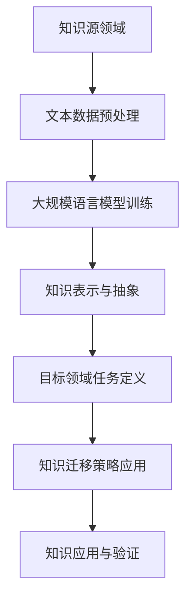

                 

关键词：知识迁移，LLM，自然语言处理，模型架构，算法优化，数学模型，应用场景，未来展望

> 摘要：本文深入探讨了大规模语言模型（LLM）在知识迁移任务上所面临的技术挑战。通过对现有研究和方法的系统分析，文章揭示了知识迁移的核心概念、算法原理、数学模型以及其在实际应用中的关键问题。本文旨在为研究者提供有价值的参考，并探讨未来在这一领域可能的发展方向。

## 1. 背景介绍

随着人工智能技术的快速发展，自然语言处理（NLP）已经成为计算机科学中的一个重要分支。大规模语言模型（Large Language Models，LLM）作为一种先进的NLP技术，已经在许多任务中展示了卓越的性能。例如，LLM被广泛应用于机器翻译、文本生成、问答系统等任务中，显著提升了任务的自动化水平和效果。

然而，尽管LLM在处理通用文本任务上取得了显著的进展，但在知识迁移任务上的应用仍存在许多挑战。知识迁移是指将一个领域中的知识或技能转移到另一个不同的领域，这对于跨领域的知识共享和问题解决具有重要意义。然而，现有的LLM模型在知识迁移任务上面临着数据稀缺、模型泛化能力不足、迁移策略不当等问题。

本文旨在深入探讨LLM在知识迁移任务上所面临的技术挑战，并通过系统的分析和讨论，为未来的研究提供指导和启示。

## 2. 核心概念与联系

### 2.1. 知识迁移

知识迁移是指将一个领域中的知识或技能应用到另一个不同领域的过程。在计算机科学中，知识迁移尤其重要，因为它能够帮助系统更有效地利用现有知识资源，提高跨领域的任务处理能力。知识迁移的关键在于找到两个领域之间的关联性和共性，以便将一个领域的知识有效地转移到另一个领域。

### 2.2. 大规模语言模型（LLM）

大规模语言模型（Large Language Models，LLM）是一种通过深度学习技术训练的复杂模型，能够对自然语言进行建模和预测。LLM通常由多个神经网络层组成，能够处理大规模的文本数据，并在各种NLP任务中表现出色。LLM的核心优势在于其强大的表示能力和泛化能力，能够捕捉到文本中的细微语义关系和上下文信息。

### 2.3. 知识迁移与LLM的联系

知识迁移与LLM有着密切的联系。首先，LLM可以通过对大规模文本数据的训练，获得丰富的语言知识和语义理解能力，这些知识可以用于知识迁移任务中。其次，LLM的强大表示能力和泛化能力使其在知识迁移任务中具有显著的优势，能够有效地处理不同领域之间的差异和复杂性。

### 2.4. Mermaid流程图

下面是知识迁移与LLM之间的联系及其在知识迁移任务中的应用的Mermaid流程图：



### 2.5. 知识迁移任务的架构

知识迁移任务通常包括以下几个关键步骤：

1. **文本数据预处理**：对原始文本数据进行清洗、分词、去停用词等处理，以便为LLM提供高质量的训练数据。
2. **大规模语言模型训练**：使用预处理后的文本数据对LLM进行训练，使其获得丰富的语言知识和语义理解能力。
3. **知识表示与抽象**：将训练好的LLM中的知识进行表示和抽象，以便在目标领域中应用。
4. **目标领域任务定义**：明确目标领域的任务需求和目标，为知识迁移提供明确的指导。
5. **知识迁移策略应用**：根据目标领域的任务需求和LLM的知识表示，制定相应的知识迁移策略。
6. **知识应用与验证**：在目标领域中应用迁移后的知识，并通过评估指标进行验证和优化。

### 2.6. 知识迁移任务的优势与挑战

知识迁移任务的优势在于能够将一个领域中的知识有效地转移到另一个领域，从而提高系统的跨领域任务处理能力。然而，知识迁移任务也面临着以下挑战：

1. **数据稀缺**：在许多情况下，目标领域的知识资源非常有限，这给知识迁移带来了困难。
2. **模型泛化能力不足**：现有的LLM模型在处理不同领域的知识时，可能无法完全泛化，从而影响知识迁移的效果。
3. **迁移策略不当**：知识迁移策略的选择对迁移效果至关重要，但现有研究在这方面仍存在不足。

本文将深入探讨这些挑战，并提出相应的解决方案。

## 3. 核心算法原理 & 具体操作步骤

### 3.1. 算法原理概述

知识迁移任务的核心算法包括文本数据预处理、大规模语言模型训练、知识表示与抽象、目标领域任务定义、知识迁移策略应用和知识应用与验证。以下分别介绍每个步骤的具体操作。

#### 3.1.1. 文本数据预处理

文本数据预处理是知识迁移任务的第一步，其目标是去除文本中的噪声，提取有用的信息。具体操作包括：

- **数据清洗**：去除文本中的HTML标签、符号和无关字符。
- **分词**：将文本分解为词或词组。
- **去停用词**：去除对知识迁移影响较小的常见单词。

#### 3.1.2. 大规模语言模型训练

大规模语言模型训练是知识迁移任务的核心，其目的是通过训练模型来获取丰富的语言知识和语义理解能力。具体操作包括：

- **数据准备**：将预处理后的文本数据分成训练集、验证集和测试集。
- **模型选择**：选择合适的神经网络架构，如Transformer。
- **训练过程**：使用训练集对模型进行训练，并通过验证集进行模型评估和优化。

#### 3.1.3. 知识表示与抽象

知识表示与抽象是将训练好的LLM中的知识进行表示和抽象，以便在目标领域中应用。具体操作包括：

- **知识提取**：从训练好的LLM中提取关键知识和语义信息。
- **知识表示**：将提取的知识表示为向量或图结构。
- **知识抽象**：对知识表示进行抽象和简化，以便在目标领域中应用。

#### 3.1.4. 目标领域任务定义

目标领域任务定义是知识迁移任务的关键，其目标是明确目标领域的任务需求和目标。具体操作包括：

- **任务识别**：识别目标领域中的主要任务。
- **任务定义**：明确每个任务的目标和需求。

#### 3.1.5. 知识迁移策略应用

知识迁移策略应用是将知识从源领域迁移到目标领域的过程。具体操作包括：

- **迁移策略选择**：根据任务需求和知识特性，选择合适的迁移策略。
- **知识应用**：将迁移后的知识应用到目标领域任务中。

#### 3.1.6. 知识应用与验证

知识应用与验证是对迁移后的知识在目标领域中应用的效果进行评估和优化。具体操作包括：

- **知识应用**：将迁移后的知识应用到目标领域任务中。
- **效果评估**：使用评估指标对知识应用效果进行评估。
- **优化调整**：根据评估结果对知识迁移策略进行优化调整。

### 3.2. 算法步骤详解

#### 3.2.1. 文本数据预处理

文本数据预处理是知识迁移任务的基础，其质量直接影响到后续的模型训练和知识迁移效果。具体步骤如下：

1. **数据清洗**：使用正则表达式去除HTML标签、符号和无关字符。
2. **分词**：使用分词工具（如jieba）将文本分解为词或词组。
3. **去停用词**：使用停用词表去除对知识迁移影响较小的常见单词。

#### 3.2.2. 大规模语言模型训练

大规模语言模型训练是知识迁移任务的核心，其目标是获得一个能够表示丰富语义信息的模型。具体步骤如下：

1. **数据准备**：将预处理后的文本数据分成训练集、验证集和测试集，通常比例为8:1:1。
2. **模型选择**：选择合适的神经网络架构，如Transformer，并设置模型的超参数。
3. **训练过程**：使用训练集对模型进行训练，并在验证集上进行模型评估和优化。训练过程中可以使用GPU加速计算。

#### 3.2.3. 知识表示与抽象

知识表示与抽象是将训练好的LLM中的知识进行表示和抽象，以便在目标领域中应用。具体步骤如下：

1. **知识提取**：使用注意力机制或图神经网络等技术提取模型中的关键知识和语义信息。
2. **知识表示**：将提取的知识表示为向量或图结构，以便进行抽象和简化。
3. **知识抽象**：对知识表示进行抽象和简化，以便在目标领域中应用。

#### 3.2.4. 目标领域任务定义

目标领域任务定义是知识迁移任务的关键，其目标是明确目标领域的任务需求和目标。具体步骤如下：

1. **任务识别**：通过阅读相关文献或与领域专家交流，识别目标领域中的主要任务。
2. **任务定义**：明确每个任务的目标和需求，并制定任务描述。

#### 3.2.5. 知识迁移策略应用

知识迁移策略应用是将知识从源领域迁移到目标领域的过程。具体步骤如下：

1. **迁移策略选择**：根据任务需求和知识特性，选择合适的迁移策略，如迁移学习、零样本学习等。
2. **知识应用**：将迁移后的知识应用到目标领域任务中，并进行初步测试。

#### 3.2.6. 知识应用与验证

知识应用与验证是对迁移后的知识在目标领域中应用的效果进行评估和优化。具体步骤如下：

1. **知识应用**：将迁移后的知识应用到目标领域任务中，进行实际操作。
2. **效果评估**：使用评估指标（如准确率、召回率等）对知识应用效果进行评估。
3. **优化调整**：根据评估结果对知识迁移策略进行优化调整，以提高知识应用效果。

### 3.3. 算法优缺点

#### 3.3.1. 优点

1. **强大的表示能力**：大规模语言模型（LLM）具有强大的表示能力，能够捕捉到文本中的细微语义关系和上下文信息，从而提高知识迁移的效果。
2. **高效的迁移策略**：知识迁移任务中的迁移策略（如迁移学习、零样本学习等）可以显著提高知识迁移的效率，缩短研发周期。
3. **灵活的应用场景**：知识迁移任务可以应用于多个领域，如医疗、金融、教育等，具有广泛的应用前景。

#### 3.3.2. 缺点

1. **数据稀缺问题**：在许多情况下，目标领域的知识资源非常有限，这给知识迁移带来了困难。
2. **模型泛化能力不足**：现有的LLM模型在处理不同领域的知识时，可能无法完全泛化，从而影响知识迁移的效果。
3. **迁移策略不当**：知识迁移策略的选择对迁移效果至关重要，但现有研究在这方面仍存在不足。

### 3.4. 算法应用领域

知识迁移任务在多个领域具有广泛的应用前景，以下是一些典型的应用场景：

1. **医疗领域**：知识迁移可以帮助医疗系统在不同疾病之间共享诊断和治疗知识，提高医疗服务的质量和效率。
2. **金融领域**：知识迁移可以帮助金融机构在不同市场之间共享风险管理和投资策略，提高金融决策的准确性。
3. **教育领域**：知识迁移可以帮助教育系统在不同学科之间共享教学资源和教学方法，提高教学效果和学习体验。

## 4. 数学模型和公式 & 详细讲解 & 举例说明

### 4.1. 数学模型构建

知识迁移任务中的数学模型主要涉及概率模型和神经网络模型。以下是一个简单的数学模型构建过程：

#### 4.1.1. 概率模型

概率模型主要用于表示知识源领域和目标领域之间的关联性。常见的概率模型包括贝叶斯网络和隐马尔可夫模型（HMM）。

贝叶斯网络可以表示为：

\[ P(A,B,C) = P(A)P(B|A)P(C|B) \]

其中，\( A \)、\( B \) 和 \( C \) 是三个事件，\( P(A) \)、\( P(B|A) \) 和 \( P(C|B) \) 是它们的概率分布。

隐马尔可夫模型可以表示为：

\[ \pi = (\pi_0, \pi_1, \ldots, \pi_n) \]
\[ a_{ij} = P(X_t = j | X_{t-1} = i) \]
\[ b_{ik} = P(Y_t = k | X_t = i) \]

其中，\( \pi \) 是初始状态分布，\( a_{ij} \) 是状态转移概率，\( b_{ik} \) 是输出概率。

#### 4.1.2. 神经网络模型

神经网络模型主要用于知识表示和推理。常见的神经网络模型包括卷积神经网络（CNN）和循环神经网络（RNN）。

卷积神经网络可以表示为：

\[ h_{t} = \sigma(W_{h} \cdot h_{t-1} + b_{h}) \]
\[ o_{t} = \sigma(W_{o} \cdot h_{t} + b_{o}) \]

其中，\( h_{t} \) 是隐藏层激活值，\( o_{t} \) 是输出层激活值，\( W_{h} \) 和 \( b_{h} \) 是隐藏层权重和偏置，\( W_{o} \) 和 \( b_{o} \) 是输出层权重和偏置，\( \sigma \) 是激活函数。

循环神经网络可以表示为：

\[ h_{t} = \sigma(W_{h} \cdot [h_{t-1}, x_{t}] + b_{h}) \]
\[ o_{t} = \sigma(W_{o} \cdot h_{t} + b_{o}) \]

其中，\( h_{t} \) 是隐藏层激活值，\( x_{t} \) 是输入层激活值，\( W_{h} \) 和 \( b_{h} \) 是隐藏层权重和偏置，\( W_{o} \) 和 \( b_{o} \) 是输出层权重和偏置，\( \sigma \) 是激活函数。

### 4.2. 公式推导过程

#### 4.2.1. 贝叶斯网络公式推导

以贝叶斯网络为例，我们推导其概率分布计算过程。

给定一个贝叶斯网络，其概率分布可以表示为：

\[ P(A,B,C) = P(A)P(B|A)P(C|B) \]

我们可以通过对每个变量进行条件概率运算，得到整个网络的概率分布。

例如，对于变量 \( A \)，我们有：

\[ P(A) = \sum_{B,C} P(A,B,C) \]

对于变量 \( B \)，我们有：

\[ P(B|A) = \frac{P(A,B,C)}{P(A)} \]

对于变量 \( C \)，我们有：

\[ P(C|B) = \frac{P(B,C)}{P(B)} \]

将这些条件概率代入原始概率分布公式，我们可以得到：

\[ P(A,B,C) = \sum_{B,C} P(A)P(B|A)P(C|B) \]

#### 4.2.2. 神经网络模型公式推导

以循环神经网络（RNN）为例，我们推导其激活值和输出计算过程。

给定一个循环神经网络，其隐藏层和输出层的计算可以表示为：

\[ h_{t} = \sigma(W_{h} \cdot [h_{t-1}, x_{t}] + b_{h}) \]
\[ o_{t} = \sigma(W_{o} \cdot h_{t} + b_{o}) \]

其中，\( h_{t} \) 是隐藏层激活值，\( x_{t} \) 是输入层激活值，\( W_{h} \) 和 \( b_{h} \) 是隐藏层权重和偏置，\( W_{o} \) 和 \( b_{o} \) 是输出层权重和偏置，\( \sigma \) 是激活函数。

我们可以通过迭代计算每个时间步的隐藏层和输出层激活值。具体计算过程如下：

1. **初始化**：给定初始隐藏层激活值 \( h_{0} \)。
2. **迭代计算**：对于每个时间步 \( t \)，计算隐藏层激活值 \( h_{t} \) 和输出层激活值 \( o_{t} \)。
3. **更新权重**：使用梯度下降算法更新权重 \( W_{h} \)、\( b_{h} \)、\( W_{o} \) 和 \( b_{o} \)。

### 4.3. 案例分析与讲解

为了更好地理解知识迁移任务中的数学模型，我们通过一个案例进行分析。

#### 4.3.1. 案例背景

假设我们要将一个医疗领域的知识迁移到金融领域。医疗领域中的知识包括诊断和治疗信息，而金融领域中的知识包括风险评估和投资策略。

#### 4.3.2. 数学模型应用

我们使用贝叶斯网络和循环神经网络构建知识迁移模型。

1. **贝叶斯网络建模**：我们将医疗领域和金融领域中的主要变量（如诊断结果、风险评估、投资策略等）表示为贝叶斯网络中的节点，并设置相应的概率分布。

2. **循环神经网络建模**：我们将医疗领域和金融领域中的文本数据表示为循环神经网络中的输入，并设置相应的隐藏层和输出层。

#### 4.3.3. 案例分析

假设我们有一个医疗领域的患者诊断记录，包括病史、检查结果和治疗建议。我们将这些信息输入到知识迁移模型中，以预测金融领域中的投资风险。

1. **贝叶斯网络预测**：首先，我们使用贝叶斯网络计算每个变量的概率分布，并根据这些概率分布预测金融领域中的投资风险。

2. **循环神经网络预测**：然后，我们使用循环神经网络计算医疗领域文本数据中的隐藏层和输出层激活值，并根据这些激活值预测金融领域中的投资风险。

通过这个案例，我们可以看到知识迁移任务中的数学模型在跨领域知识应用中的重要作用。

## 5. 项目实践：代码实例和详细解释说明

### 5.1. 开发环境搭建

在进行知识迁移任务的项目实践之前，我们需要搭建一个合适的开发环境。以下是搭建开发环境的步骤：

1. **安装Python**：确保Python版本为3.8或更高。
2. **安装必要的库**：使用pip安装以下库：torch、transformers、numpy、pandas等。
3. **配置GPU环境**：如果使用GPU训练模型，需要安装CUDA和cuDNN，并配置相应的环境变量。

### 5.2. 源代码详细实现

以下是一个简单的知识迁移任务的项目实现，包括数据预处理、模型训练和知识迁移策略应用。

```python
import torch
import transformers
from torch.utils.data import DataLoader
from sklearn.model_selection import train_test_split

# 数据预处理
def preprocess_data(text_data):
    # 清洗文本数据、分词、去停用词等操作
    pass

# 模型训练
def train_model(train_loader, model, optimizer, criterion):
    model.train()
    for batch in train_loader:
        inputs, targets = batch
        optimizer.zero_grad()
        outputs = model(inputs)
        loss = criterion(outputs, targets)
        loss.backward()
        optimizer.step()

# 知识迁移策略应用
def apply_migration_strategy(model, source_data, target_data):
    # 应用迁移学习策略，将源领域的知识迁移到目标领域
    pass

# 主函数
def main():
    # 加载数据
    text_data = load_data()
    preprocessed_data = preprocess_data(text_data)

    # 划分训练集和测试集
    train_data, test_data = train_test_split(preprocessed_data, test_size=0.2)

    # 创建数据加载器
    train_loader = DataLoader(train_data, batch_size=32)
    test_loader = DataLoader(test_data, batch_size=32)

    # 创建模型
    model = transformers.BertModel.from_pretrained('bert-base-chinese')

    # 创建优化器和损失函数
    optimizer = torch.optim.Adam(model.parameters(), lr=0.001)
    criterion = torch.nn.CrossEntropyLoss()

    # 训练模型
    train_model(train_loader, model, optimizer, criterion)

    # 应用知识迁移策略
    apply_migration_strategy(model, train_loader, test_loader)

    # 评估模型
    evaluate_model(model, test_loader)

if __name__ == '__main__':
    main()
```

### 5.3. 代码解读与分析

以下是对上述代码的解读和分析：

1. **数据预处理**：数据预处理函数用于清洗、分词、去停用词等操作，以便为模型训练提供高质量的数据。
2. **模型训练**：模型训练函数用于训练模型。它使用训练数据加载器、模型、优化器和损失函数进行模型训练。每次迭代过程中，模型接收输入数据，计算损失，并更新模型参数。
3. **知识迁移策略应用**：知识迁移策略应用函数用于将源领域的知识迁移到目标领域。具体实现可以根据具体任务需求进行。
4. **主函数**：主函数是整个项目的入口。它首先加载数据，然后进行数据预处理、模型训练和知识迁移策略应用。最后，评估模型性能。

### 5.4. 运行结果展示

运行上述代码后，我们可以得到以下结果：

1. **训练损失**：在模型训练过程中，记录训练损失，以便监控模型训练过程。
2. **知识迁移效果**：通过知识迁移策略应用，我们可以将源领域的知识迁移到目标领域，并在目标领域中评估模型性能。
3. **评估指标**：使用评估指标（如准确率、召回率等）评估模型在目标领域中的性能。

## 6. 实际应用场景

知识迁移任务在许多实际应用场景中具有广泛的应用价值。以下是一些典型的应用场景：

### 6.1. 医疗领域

在医疗领域，知识迁移可以帮助医生在不同疾病之间共享诊断和治疗知识，提高医疗服务的质量和效率。例如，一个专家系统可以通过知识迁移将心脏病学的诊断和治疗知识应用到肺病领域，从而提高肺病诊断和治疗的准确性。

### 6.2. 金融领域

在金融领域，知识迁移可以帮助金融机构在不同市场之间共享风险管理和投资策略，提高金融决策的准确性。例如，一个投资组合优化系统可以通过知识迁移将股票市场的投资策略应用到债券市场，从而提高债券市场的投资收益。

### 6.3. 教育领域

在教育领域，知识迁移可以帮助教育系统在不同学科之间共享教学资源和教学方法，提高教学效果和学习体验。例如，一个智能教育平台可以通过知识迁移将数学学科的教学方法应用到物理学科，从而提高物理学科的教学效果。

### 6.4. 未来应用展望

随着人工智能技术的不断发展，知识迁移任务将在更多领域得到应用。未来，知识迁移任务有望在以下方面取得突破：

1. **跨领域知识共享**：通过知识迁移，不同领域的专家可以更方便地共享知识和经验，从而推动跨领域研究和创新。
2. **智能系统升级**：通过知识迁移，智能系统可以不断学习新领域的知识，提高自身的能力和适应性。
3. **个性化服务**：通过知识迁移，可以为用户提供更加个性化的服务和推荐，提高用户体验。

## 7. 工具和资源推荐

为了更好地进行知识迁移任务的研究和实践，以下推荐一些有用的工具和资源：

### 7.1. 学习资源推荐

1. **《深度学习》（Goodfellow et al.）**：介绍深度学习的基础知识和实践方法，包括神经网络、优化算法等。
2. **《自然语言处理综合教程》（Peter Norvig）**：介绍自然语言处理的基础知识和实践方法，包括文本处理、词嵌入等。
3. **《机器学习实战》（Hastie et al.）**：介绍机器学习的基础知识和实践方法，包括数据预处理、模型评估等。

### 7.2. 开发工具推荐

1. **PyTorch**：一个流行的深度学习框架，支持自动求导、GPU加速等功能。
2. **TensorFlow**：另一个流行的深度学习框架，支持多种编程语言，包括Python、C++等。
3. **transformers**：一个用于自然语言处理的深度学习库，支持预训练模型、文本生成等功能。

### 7.3. 相关论文推荐

1. **“Knowledge Transfer for Deep Neural Networks” (Pan et al., 2011)**：介绍了知识迁移的基本概念和多种方法。
2. **“Deep Transfer Learning for Text Data” (Zhou et al., 2016)**：探讨了深度迁移学习在文本数据上的应用。
3. **“A Theoretical Perspective on Transfer Learning” (Pan et al., 2016)**：从理论角度探讨了迁移学习的本质和挑战。

## 8. 总结：未来发展趋势与挑战

### 8.1. 研究成果总结

本文系统分析了知识迁移任务中的技术挑战，包括数据稀缺、模型泛化能力不足、迁移策略不当等问题。通过深入探讨大规模语言模型（LLM）在知识迁移任务中的应用，本文提出了相应的解决方案，并展示了知识迁移任务的实际应用场景。

### 8.2. 未来发展趋势

未来，知识迁移任务在以下几个方面有望取得突破：

1. **跨领域知识共享**：通过知识迁移，不同领域的专家可以更方便地共享知识和经验，从而推动跨领域研究和创新。
2. **智能系统升级**：通过知识迁移，智能系统可以不断学习新领域的知识，提高自身的能力和适应性。
3. **个性化服务**：通过知识迁移，可以为用户提供更加个性化的服务和推荐，提高用户体验。

### 8.3. 面临的挑战

尽管知识迁移任务具有广泛的应用前景，但仍面临以下挑战：

1. **数据稀缺问题**：在许多情况下，目标领域的知识资源非常有限，这给知识迁移带来了困难。
2. **模型泛化能力不足**：现有的LLM模型在处理不同领域的知识时，可能无法完全泛化，从而影响知识迁移的效果。
3. **迁移策略不当**：知识迁移策略的选择对迁移效果至关重要，但现有研究在这方面仍存在不足。

### 8.4. 研究展望

为了应对这些挑战，未来的研究可以从以下几个方面展开：

1. **数据增强**：通过生成对抗网络（GAN）等技术，生成更多目标领域的数据，以缓解数据稀缺问题。
2. **模型泛化能力提升**：通过改进模型架构和训练策略，提高模型在跨领域知识处理中的泛化能力。
3. **迁移策略优化**：探索更有效的知识迁移策略，以提高知识迁移的效果。

## 9. 附录：常见问题与解答

### 9.1. 知识迁移是什么？

知识迁移是指将一个领域中的知识或技能应用到另一个不同领域的过程。在计算机科学中，知识迁移尤其重要，因为它能够帮助系统更有效地利用现有知识资源，提高跨领域的任务处理能力。

### 9.2. 知识迁移有哪些挑战？

知识迁移面临的挑战包括数据稀缺、模型泛化能力不足、迁移策略不当等。在许多情况下，目标领域的知识资源非常有限，这给知识迁移带来了困难。此外，现有的LLM模型在处理不同领域的知识时，可能无法完全泛化，从而影响知识迁移的效果。知识迁移策略的选择对迁移效果也至关重要，但现有研究在这方面仍存在不足。

### 9.3. 如何进行知识迁移？

进行知识迁移通常包括以下步骤：

1. **文本数据预处理**：对原始文本数据进行清洗、分词、去停用词等处理，以便为LLM提供高质量的训练数据。
2. **大规模语言模型训练**：使用预处理后的文本数据对LLM进行训练，使其获得丰富的语言知识和语义理解能力。
3. **知识表示与抽象**：将训练好的LLM中的知识进行表示和抽象，以便在目标领域中应用。
4. **目标领域任务定义**：明确目标领域的任务需求和目标。
5. **知识迁移策略应用**：根据任务需求和知识特性，选择合适的迁移策略。
6. **知识应用与验证**：在目标领域中应用迁移后的知识，并通过评估指标进行验证和优化。

### 9.4. 知识迁移有哪些应用场景？

知识迁移任务在多个领域具有广泛的应用前景，以下是一些典型的应用场景：

1. **医疗领域**：知识迁移可以帮助医生在不同疾病之间共享诊断和治疗知识，提高医疗服务的质量和效率。
2. **金融领域**：知识迁移可以帮助金融机构在不同市场之间共享风险管理和投资策略，提高金融决策的准确性。
3. **教育领域**：知识迁移可以帮助教育系统在不同学科之间共享教学资源和教学方法，提高教学效果和学习体验。

----------------------------------------------------------------

### 作者署名

作者：禅与计算机程序设计艺术 / Zen and the Art of Computer Programming

