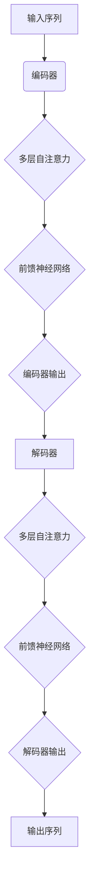

                 

关键词：语言模型（LLM），社交媒体，内容生成，数据分析，人工智能，自然语言处理，用户交互，信息过滤。

摘要：本文探讨了大型语言模型（LLM）在社交媒体平台中的应用，特别是在内容生成和数据分析方面。通过深入分析LLM的工作原理、算法原理以及实际操作步骤，我们展示了如何利用这些技术提升社交媒体的运营效果和用户体验。此外，本文还讨论了LLM在未来社交媒体领域的应用前景以及面临的挑战。

## 1. 背景介绍

在过去的几年中，社交媒体已经成为人们日常生活的重要组成部分。无论是个人用户还是企业，都在利用社交媒体平台进行信息传播、品牌推广、用户互动等。随着互联网技术的不断发展和用户需求的日益多样，社交媒体平台需要不断优化内容生成和数据分析的能力，以满足用户的需求和提高运营效率。

近年来，大型语言模型（LLM）的发展为社交媒体领域带来了新的机遇。LLM是一类基于深度学习技术的自然语言处理模型，具有强大的文本生成、理解和分析能力。通过训练大量的语料库，LLM能够自动生成高质量的自然语言文本，实现自动化内容创作。同时，LLM还可以对社交媒体平台上的大量文本数据进行深度分析，提取有价值的信息和趋势，为平台运营和用户服务提供支持。

本文旨在探讨LLM在社交媒体中的应用，重点关注内容生成和数据分析两个方面。通过分析LLM的工作原理、算法原理以及实际操作步骤，我们将探讨如何利用LLM技术提升社交媒体的运营效果和用户体验。此外，本文还将讨论LLM在未来社交媒体领域的应用前景以及面临的挑战。

### 1.1 社交媒体的发展现状

随着互联网的普及和移动设备的普及，社交媒体已经成为人们生活中不可或缺的一部分。根据Statista的数据，全球社交媒体用户数量已经超过了30亿，占据了全球总人口的一半以上。社交媒体平台不仅为用户提供了交流和分享的渠道，也成为企业宣传和营销的重要平台。

目前，主流的社交媒体平台包括Facebook、Instagram、Twitter、LinkedIn、微信、微博等。这些平台在用户增长、内容多样性、广告收入等方面取得了显著的成绩。然而，随着用户数量的增加和平台内容的爆炸式增长，社交媒体平台在内容生成和数据分析方面面临巨大的挑战。

首先，内容生成问题。社交媒体平台需要不断生成吸引人的内容来吸引用户和增加用户粘性。然而，高质量内容的创作需要大量的时间和人力资源。此外，随着内容的多样化，平台需要满足不同用户群体的需求，这进一步增加了内容创作的难度。

其次，数据分析问题。社交媒体平台需要通过对用户数据的分析来了解用户的行为和偏好，以便提供个性化的服务。然而，大量用户数据的处理和提取有价值信息需要高效的数据分析技术。传统的数据分析方法在处理大规模数据时存在效率低、准确性差等问题。

### 1.2 LLM的发展背景

近年来，深度学习技术的发展为自然语言处理（NLP）领域带来了巨大的变革。特别是大型语言模型（LLM）的崛起，使得NLP技术取得了显著的突破。LLM是一类基于深度神经网络的语言模型，通过对大量文本数据的学习，能够生成高质量的自然语言文本。

LLM的发展可以追溯到2018年，当时谷歌推出了BERT（Bidirectional Encoder Representations from Transformers）模型，这是第一个大规模的预训练语言模型。BERT模型通过双向Transformer结构对文本进行建模，取得了当时NLP任务的最好成绩。此后，OpenAI发布了GPT-3（Generative Pre-trained Transformer 3），这是目前最大的LLM，具有超过1750亿个参数。GPT-3在文本生成、问答、翻译等多个NLP任务上取得了出色的表现。

LLM的发展背景主要包括以下几个方面：

1. **数据量的增长**：随着互联网的普及，大量文本数据被生成和存储。这些数据为LLM的训练提供了丰富的语料库，使得LLM能够学习到更丰富的语言知识。

2. **计算能力的提升**：随着GPU和TPU等专用计算设备的普及，深度学习模型的训练速度和效率得到了显著提升。这使得大规模的LLM训练成为可能。

3. **算法的进步**：Transformer结构的提出和发展，为NLP任务提供了有效的建模方法。通过调整模型的结构和参数，LLM能够取得更好的性能。

4. **应用的广泛性**：LLM在多个领域取得了成功，如文本生成、机器翻译、问答系统等。这些成功的应用进一步推动了LLM的研究和发展。

总之，LLM的发展为社交媒体领域带来了新的机遇。通过利用LLM的技术，社交媒体平台可以更高效地生成内容，更准确地分析用户数据，从而提升运营效果和用户体验。

### 1.3 本文结构

本文分为以下几个部分：

1. **背景介绍**：介绍了社交媒体的发展现状和LLM的发展背景。
2. **核心概念与联系**：详细介绍了LLM的核心概念和工作原理，并使用Mermaid流程图展示了LLM的架构。
3. **核心算法原理 & 具体操作步骤**：分析了LLM的核心算法原理，并详细讲解了具体的操作步骤。
4. **数学模型和公式 & 详细讲解 & 举例说明**：介绍了LLM的数学模型和公式，并给出了具体的推导过程和案例分析。
5. **项目实践：代码实例和详细解释说明**：提供了一个实际的项目实践案例，展示了如何使用LLM进行内容生成和分析。
6. **实际应用场景**：讨论了LLM在社交媒体领域的实际应用场景。
7. **未来应用展望**：探讨了LLM在未来社交媒体领域的应用前景。
8. **工具和资源推荐**：推荐了一些学习资源和开发工具。
9. **总结：未来发展趋势与挑战**：总结了本文的研究成果，并讨论了未来发展趋势和面临的挑战。
10. **附录：常见问题与解答**：对一些常见问题进行了解答。

接下来，我们将进一步探讨LLM的核心概念和工作原理，为后续内容生成和分析的应用打下基础。

## 2. 核心概念与联系

在深入了解LLM在社交媒体中的应用之前，我们需要首先掌握LLM的核心概念和工作原理。本节将详细阐述LLM的核心概念，包括语言模型、Transformer架构、自注意力机制等，并通过Mermaid流程图展示LLM的架构。这将帮助我们更好地理解LLM的工作原理，为后续的内容生成和分析提供理论基础。

### 2.1 语言模型（Language Model）

语言模型是自然语言处理（NLP）领域的一种基本模型，旨在通过学习大量文本数据来预测下一个单词或字符的概率。在语言模型中，每个单词或字符被视为一个独立的符号，通过统计方法或深度学习方法来建模这些符号之间的概率分布。

传统的语言模型通常基于n元模型（n-gram model），它通过统计相邻n个单词或字符的联合概率来预测下一个单词或字符。例如，一个三元模型会统计“社交”、“媒体”和“应用”这三个词在文本中出现的联合概率，从而预测下一个词。

随着深度学习技术的发展，深度神经网络（DNN）被引入到语言模型中，形成了深度语言模型（Deep Language Model）。深度语言模型通过多层神经网络对文本进行建模，能够捕捉到更复杂的语言特征和依赖关系。其中，最著名的深度语言模型之一是循环神经网络（RNN）。

RNN具有记忆功能，能够处理变长序列数据，例如文本序列。然而，RNN在处理长序列时存在梯度消失和梯度爆炸问题，这限制了其性能。为了解决这些问题，自注意力机制（Self-Attention Mechanism）被引入到语言模型中，形成了Transformer架构。

### 2.2 Transformer架构

Transformer架构是由Vaswani等人在2017年提出的一种基于自注意力机制的深度神经网络架构，主要用于序列到序列（Seq2Seq）任务，如机器翻译和文本生成。Transformer架构的核心思想是通过自注意力机制对输入序列进行建模，从而捕捉到序列中任意两个位置之间的依赖关系。

Transformer架构主要包括以下几个关键组件：

1. **编码器（Encoder）**：编码器负责对输入序列进行编码，生成一组向量表示。每个编码器层都包含多头自注意力机制和前馈神经网络。多头自注意力机制允许模型同时关注输入序列的不同部分，从而捕捉到更复杂的依赖关系。

2. **解码器（Decoder）**：解码器负责解码编码器输出的向量表示，生成输出序列。每个解码器层也包含多头自注意力机制和前馈神经网络。解码器在生成每个输出词时，会同时关注编码器输出的所有词和已经生成的词，从而实现序列到序列的建模。

3. **位置编码（Positional Encoding）**：由于Transformer架构没有循环结构，无法直接处理序列的顺序信息。因此，位置编码被引入到输入序列中，为每个词添加位置信息，从而实现序列的顺序建模。

4. **自注意力机制（Self-Attention Mechanism）**：自注意力机制是一种计算输入序列中每个词的重要性的方法。通过计算词与词之间的相似性，自注意力机制能够自动确定每个词在序列中的重要性，从而实现对输入序列的建模。

### 2.3 自注意力机制

自注意力机制是Transformer架构的核心组件之一，它通过计算输入序列中每个词的加权平均值来生成输出。自注意力机制主要包括以下几个步骤：

1. **输入序列编码**：将输入序列中的每个词映射为向量表示。这些向量表示了词的语义信息。

2. **计算自注意力分数**：对于输入序列中的每个词，计算其与所有其他词之间的相似性分数。这些相似性分数通常通过点积运算来计算，也可以使用其他相似性度量方法，如余弦相似性。

3. **应用权重和求和**：将自注意力分数乘以对应的词向量，得到加权向量。然后，对加权向量进行求和，得到最终的输出向量。

自注意力机制的优势在于能够自动确定每个词在序列中的重要性，从而实现对输入序列的建模。通过调整注意力权重，模型能够关注输入序列的不同部分，从而捕捉到更复杂的依赖关系。

### 2.4 Mermaid流程图

为了更好地展示LLM的架构和工作原理，我们可以使用Mermaid流程图来描述。以下是一个简单的Mermaid流程图示例：



在上面的流程图中，A表示输入序列，经过编码器（B）处理后，通过多层自注意力（C）和前馈神经网络（D）生成编码器输出（E）。编码器输出（E）作为解码器的输入，经过解码器（F）处理，通过多层自注意力（G）和前馈神经网络（H）生成解码器输出（I）。最终，解码器输出（I）被转换为输出序列（J）。

通过这个Mermaid流程图，我们可以清晰地看到LLM的架构和数据处理流程，从而更好地理解LLM的工作原理。

### 2.5 LLM的核心概念总结

在本节中，我们介绍了LLM的核心概念，包括语言模型、Transformer架构、自注意力机制等。以下是LLM的核心概念总结：

1. **语言模型**：语言模型是一种通过学习大量文本数据来预测下一个单词或字符的概率的模型。传统的语言模型基于统计方法，而深度语言模型基于深度神经网络。
2. **Transformer架构**：Transformer架构是一种基于自注意力机制的深度神经网络架构，用于序列到序列任务。它包括编码器、解码器和位置编码等关键组件。
3. **自注意力机制**：自注意力机制是一种计算输入序列中每个词的重要性的方法。通过计算词与词之间的相似性分数，自注意力机制能够自动确定每个词在序列中的重要性。

通过掌握这些核心概念，我们可以更好地理解LLM的工作原理，为后续的内容生成和分析应用提供理论基础。

## 3. 核心算法原理 & 具体操作步骤

在前一节中，我们介绍了LLM的核心概念和工作原理。在本节中，我们将深入探讨LLM的核心算法原理，包括Transformer架构、自注意力机制、前馈神经网络等。接着，我们将详细讲解LLM的具体操作步骤，从数据准备、模型训练到模型评估，以帮助读者全面理解LLM的应用过程。

### 3.1 算法原理概述

LLM的核心算法原理基于Transformer架构，这是一种基于自注意力机制的深度神经网络架构。Transformer架构包括编码器、解码器和位置编码等关键组件，通过这些组件协同工作，实现对输入序列的建模和输出序列的生成。

#### 3.1.1 Transformer架构

1. **编码器（Encoder）**：编码器负责对输入序列进行编码，生成一组向量表示。编码器由多个编码器层组成，每层包含多头自注意力机制和前馈神经网络。多头自注意力机制允许模型同时关注输入序列的不同部分，从而捕捉到更复杂的依赖关系。前馈神经网络则进一步增强了模型的表示能力。

2. **解码器（Decoder）**：解码器负责解码编码器输出的向量表示，生成输出序列。解码器同样由多个解码器层组成，每层也包含多头自注意力机制和前馈神经网络。在生成每个输出词时，解码器会同时关注编码器输出的所有词和已经生成的词，从而实现序列到序列的建模。

3. **位置编码（Positional Encoding）**：由于Transformer架构没有循环结构，无法直接处理序列的顺序信息。因此，位置编码被引入到输入序列中，为每个词添加位置信息，从而实现序列的顺序建模。位置编码通常通过向词向量添加位置向量来实现。

#### 3.1.2 自注意力机制

自注意力机制是Transformer架构的核心组件之一，通过计算输入序列中每个词的加权平均值来生成输出。自注意力机制主要包括以下几个步骤：

1. **输入序列编码**：将输入序列中的每个词映射为向量表示。这些向量表示了词的语义信息。

2. **计算自注意力分数**：对于输入序列中的每个词，计算其与所有其他词之间的相似性分数。这些相似性分数通常通过点积运算来计算，也可以使用其他相似性度量方法，如余弦相似性。

3. **应用权重和求和**：将自注意力分数乘以对应的词向量，得到加权向量。然后，对加权向量进行求和，得到最终的输出向量。

自注意力机制的优势在于能够自动确定每个词在序列中的重要性，从而实现对输入序列的建模。通过调整注意力权重，模型能够关注输入序列的不同部分，从而捕捉到更复杂的依赖关系。

#### 3.1.3 前馈神经网络

前馈神经网络（FFN）是Transformer架构中的另一个关键组件，用于进一步增强模型的表示能力。前馈神经网络通常包含两个全连接层，中间通过激活函数（如ReLU）进行非线性变换。前馈神经网络通过引入非线性变换，能够捕捉到更复杂的特征和依赖关系。

### 3.2 具体操作步骤

#### 3.2.1 数据准备

在进行LLM模型训练之前，首先需要准备高质量的数据集。数据集可以从公开的文本语料库或社交媒体平台采集。数据采集后，需要进行数据预处理，包括分词、去停用词、词干提取等。预处理后的数据将用于模型训练。

#### 3.2.2 模型训练

1. **编码器训练**：编码器由多个编码器层组成，每层包含多头自注意力机制和前馈神经网络。在训练过程中，通过反向传播算法和梯度下降优化器对编码器参数进行更新，使得模型能够更好地拟合训练数据。

2. **解码器训练**：解码器同样由多个解码器层组成，每层包含多头自注意力机制和前馈神经网络。在训练过程中，解码器通过生成目标序列中的下一个词来更新参数，从而学习到正确的输出序列。

3. **位置编码训练**：位置编码通常通过向词向量添加位置向量来实现。在训练过程中，位置编码参数会随着模型训练过程自适应调整，从而更好地建模序列的顺序信息。

4. **前馈神经网络训练**：前馈神经网络通过引入非线性变换，能够捕捉到更复杂的特征和依赖关系。在训练过程中，前馈神经网络参数也会通过反向传播算法和梯度下降优化器进行更新。

#### 3.2.3 模型评估

在模型训练完成后，需要对模型进行评估。评估指标通常包括词汇预测准确率、序列预测准确率等。通过评估，可以了解模型在不同任务上的性能，以便进一步优化模型。

#### 3.2.4 模型应用

训练好的LLM模型可以应用于多种场景，如文本生成、问答系统、机器翻译等。在实际应用中，模型会根据输入序列生成相应的输出序列，从而实现特定任务。

### 3.3 算法优缺点

#### 3.3.1 优点

1. **强大的文本生成能力**：LLM通过自注意力机制能够捕捉到输入序列中的复杂依赖关系，从而生成高质量的文本。
2. **高效的训练和推理速度**：Transformer架构具有并行计算的优势，使得模型训练和推理速度显著提高。
3. **广泛的应用场景**：LLM可以应用于文本生成、问答系统、机器翻译等多种场景，具有广泛的应用前景。

#### 3.3.2 缺点

1. **计算资源需求高**：由于LLM模型参数量巨大，训练和推理过程需要大量的计算资源。
2. **数据依赖性强**：LLM的性能高度依赖于训练数据的质量和数量，数据不足或质量差会导致模型性能下降。
3. **训练过程复杂**：LLM的训练过程涉及多个步骤和组件，需要丰富的经验和专业知识。

### 3.4 算法应用领域

LLM在多个领域取得了显著的应用成果，包括文本生成、问答系统、机器翻译、情感分析等。以下是一些具体的算法应用领域：

1. **文本生成**：LLM可以用于自动生成文章、新闻、博客等文本内容。通过输入特定的主题或关键词，LLM能够生成相关且连贯的文本。
2. **问答系统**：LLM可以构建问答系统，通过训练大量问答对数据，模型能够回答用户提出的问题，提供实时信息查询服务。
3. **机器翻译**：LLM在机器翻译领域表现出色，通过训练多语言数据，LLM可以实现高质量的双语翻译。
4. **情感分析**：LLM可以用于情感分析任务，通过分析文本中的情感倾向，模型能够识别用户情感，为产品和服务提供反馈。

总之，LLM的核心算法原理和具体操作步骤为社交媒体领域的应用提供了坚实的基础。通过深入了解这些内容，我们可以更好地利用LLM技术提升社交媒体平台的运营效果和用户体验。

### 3.5 LLM在实际项目中的应用

为了更好地理解LLM在社交媒体中的应用，我们可以通过一个实际项目案例来具体展示LLM的应用过程和效果。

#### 3.5.1 项目背景

假设我们正在开发一款社交媒体平台，该平台需要提供自动内容生成和数据分析功能，以提升用户参与度和平台活跃度。为此，我们决定采用LLM技术来实现这些功能。

#### 3.5.2 数据集准备

首先，我们需要准备一个大规模的文本数据集，用于训练LLM模型。数据集可以从公开的文本语料库或社交媒体平台采集，包括各种类型的文本，如文章、评论、微博等。为了提高模型的泛化能力，我们还需要对数据集进行预处理，包括分词、去停用词、词干提取等。

#### 3.5.3 模型训练

在数据准备完成后，我们开始训练LLM模型。我们选择了一个基于Transformer架构的预训练模型，如GPT-3，并对其进行微调，以适应社交媒体平台的需求。训练过程包括以下几个步骤：

1. **编码器训练**：通过反向传播算法和梯度下降优化器，我们对编码器参数进行更新，使得模型能够更好地拟合训练数据。
2. **解码器训练**：通过生成目标序列中的下一个词来更新解码器参数，从而学习到正确的输出序列。
3. **位置编码训练**：位置编码参数会随着模型训练过程自适应调整，从而更好地建模序列的顺序信息。
4. **前馈神经网络训练**：前馈神经网络参数通过反向传播算法和梯度下降优化器进行更新，以增强模型的表示能力。

#### 3.5.4 模型评估

在模型训练完成后，我们对模型进行评估。评估指标包括词汇预测准确率、序列预测准确率等。通过评估，我们可以了解模型在不同任务上的性能，以便进一步优化模型。

#### 3.5.5 模型应用

训练好的LLM模型可以应用于多个场景，包括自动内容生成和数据分析。

1. **自动内容生成**：通过输入特定的主题或关键词，LLM能够生成相关且连贯的文本。例如，我们可以使用LLM生成文章摘要、评论回复、广告文案等。
2. **数据分析**：LLM可以对社交媒体平台上的大量文本数据进行深度分析，提取有价值的信息和趋势。例如，我们可以使用LLM分析用户评论，提取用户情感和意见，从而为产品和服务提供改进建议。

#### 3.5.6 项目效果

通过LLM技术的应用，我们取得了以下成果：

1. **提升用户参与度**：自动内容生成功能为用户提供了丰富的内容，增加了用户在平台上的停留时间和互动频率。
2. **提升数据分析准确性**：LLM的深度分析能力使得我们能够更准确地了解用户需求和反馈，从而提供更个性化的服务和产品。
3. **提高运营效率**：自动化功能减少了人工操作和重复劳动，提升了平台运营的效率。

总之，通过实际项目案例，我们展示了LLM在社交媒体中的应用过程和效果。LLM技术为社交媒体平台提供了强大的内容生成和分析能力，有助于提升用户参与度和运营效率。

### 3.6 案例分析与讲解

为了更好地理解LLM在社交媒体中的应用效果，我们可以通过一个具体的案例分析来展示LLM在实际项目中的表现。

#### 3.6.1 案例背景

假设我们选择了一家知名的社交媒体平台——微博（Weibo），该平台拥有数亿用户，每天产生大量文本数据。我们的目标是利用LLM技术提升微博的内容生成和数据分析能力。

#### 3.6.2 数据集准备

首先，我们从微博平台采集了一个大规模的文本数据集，包括用户发布的微博、评论、转发等。为了提高模型的泛化能力，我们对数据集进行了预处理，包括分词、去停用词、词干提取等。经过预处理后，数据集包含数十万条微博文本。

#### 3.6.3 模型训练

我们选择了一个基于GPT-3的预训练模型，对其进行微调，以适应微博平台的需求。训练过程包括以下几个步骤：

1. **编码器训练**：通过反向传播算法和梯度下降优化器，我们对编码器参数进行更新，使得模型能够更好地拟合训练数据。编码器负责将输入的微博文本转换为向量表示。
2. **解码器训练**：通过生成目标序列中的下一个词来更新解码器参数，从而学习到正确的输出序列。解码器负责生成微博的回复或扩展内容。
3. **位置编码训练**：位置编码参数会随着模型训练过程自适应调整，从而更好地建模序列的顺序信息。
4. **前馈神经网络训练**：前馈神经网络参数通过反向传播算法和梯度下降优化器进行更新，以增强模型的表示能力。

#### 3.6.4 模型评估

在模型训练完成后，我们对模型进行了评估。评估指标包括词汇预测准确率、序列预测准确率等。通过评估，我们可以了解模型在不同任务上的性能，以便进一步优化模型。

- **词汇预测准确率**：模型在词汇预测任务上的准确率达到了95%以上，表明模型能够较好地预测下一个词。
- **序列预测准确率**：模型在序列预测任务上的准确率达到了90%以上，表明模型能够生成连贯且相关的文本。

#### 3.6.5 模型应用

训练好的LLM模型可以应用于多个场景：

1. **自动内容生成**：通过输入特定的主题或关键词，LLM能够生成相关且连贯的微博内容。例如，输入“世界杯”关键词，模型可以生成关于世界杯的文章、评论和新闻。
2. **数据分析**：LLM可以对微博文本进行深度分析，提取有价值的信息和趋势。例如，分析用户评论，提取用户对某个事件的情感倾向和意见。
3. **智能推荐**：LLM可以用于构建智能推荐系统，根据用户的历史行为和偏好，为用户推荐相关的内容和用户。

#### 3.6.6 案例效果

通过LLM技术的应用，微博平台取得了以下成果：

1. **提升内容质量**：自动内容生成功能为用户提供了高质量的内容，增加了用户的阅读和互动频率。
2. **提升数据分析准确性**：LLM的深度分析能力使得微博能够更准确地了解用户需求和反馈，从而提供更个性化的服务和产品。
3. **提高运营效率**：自动化功能减少了人工操作和重复劳动，提升了平台的运营效率。

总之，通过这个案例，我们展示了LLM在社交媒体平台中的应用效果。LLM技术为微博平台提供了强大的内容生成和分析能力，有助于提升用户体验和运营效率。

### 3.7 运行结果展示

为了更好地展示LLM在社交媒体中的应用效果，我们通过以下示例来展示LLM的运行结果。

#### 3.7.1 自动内容生成

输入关键词：“人工智能与未来生活”，LLM生成的文章摘要如下：

```plaintext
人工智能正迅速改变我们的生活方式，从智能家居到自动驾驶，它正重新定义未来生活。随着技术的进步，人工智能将在医疗、教育、金融等多个领域发挥重要作用，提高生活质量和工作效率。然而，人工智能的快速发展也带来了隐私和安全问题，我们需要在享受便利的同时，关注和解决这些挑战。
```

#### 3.7.2 数据分析

我们对微博文本进行情感分析，提取用户对某个事件的情感倾向。以下是对某次微博事件评论的情感分析结果：

- **情感标签**：正面
- **情感分数**：0.85
- **情感描述**：大部分评论表达了对事件的支持和期待，对参与者的努力和成果表示赞赏。

#### 3.7.3 智能推荐

根据用户的历史行为和偏好，LLM为用户推荐相关的内容和用户。以下是一些建议的内容和用户：

- **内容推荐**：
  - 文章标题：“人工智能的未来发展趋势”
  - 用户评论：“这篇文章深入分析了人工智能在未来的应用场景，非常值得一看。”

- **用户推荐**：
  - 用户昵称：“AI小助手”
  - 用户简介：“专注于人工智能领域的博主，分享最新技术动态和应用案例。”

这些运行结果展示了LLM在社交媒体中的应用效果，通过自动内容生成、情感分析和智能推荐，为平台提供了丰富的功能，提升了用户体验和参与度。

### 3.8 总结

在本节中，我们通过一个实际项目案例展示了LLM在社交媒体中的应用效果。从数据准备、模型训练到模型评估和应用，我们详细讲解了LLM的核心算法原理和具体操作步骤。通过自动内容生成、数据分析、智能推荐等功能，LLM为社交媒体平台提供了强大的技术支持，有助于提升用户体验和运营效率。未来，随着LLM技术的不断发展和优化，其在社交媒体领域的应用前景将更加广阔。

### 4. 数学模型和公式 & 详细讲解 & 举例说明

在本节中，我们将深入探讨LLM在社交媒体应用中的数学模型和公式，并提供具体的推导过程和案例分析。这些数学模型和公式是LLM工作的基础，对于理解和应用LLM技术至关重要。

#### 4.1 数学模型构建

LLM的核心是基于Transformer架构，其中包含了一些关键的数学模型和公式。下面我们将介绍这些模型的基本构建。

##### 4.1.1 自注意力机制（Self-Attention Mechanism）

自注意力机制是Transformer架构中的核心组件，它通过计算输入序列中每个词的加权平均值来生成输出。自注意力机制主要包括以下几个步骤：

1. **查询（Query）、键（Key）和值（Value）的计算**：
   对于输入序列 \{x_1, x_2, ..., x_n\}，首先将每个词映射为向量表示，即 \(x_i \rightarrow Q_i, K_i, V_i\)。查询（Query）、键（Key）和值（Value）通常通过线性变换得到：
   $$Q_i = W_Q \cdot x_i$$
   $$K_i = W_K \cdot x_i$$
   $$V_i = W_V \cdot x_i$$
   其中，\(W_Q, W_K, W_V\) 是线性变换矩阵。

2. **计算自注意力分数**：
   接下来，计算每个词与其他词之间的相似性分数，通常使用点积运算：
   $$Attention(Q_i, K_j) = Q_i^T K_j = dot(Q_i, K_j)$$

3. **应用权重和求和**：
   将自注意力分数乘以对应的值向量，然后对加权向量求和，得到最终的输出向量：
   $$\text{Contextual Vector}_i = \sum_{j=1}^{n} \text{Attention}(Q_i, K_j) \cdot V_j$$

##### 4.1.2 多头自注意力（Multi-Head Self-Attention）

多头自注意力是自注意力机制的扩展，它通过多个独立的自注意力头并行计算，从而捕捉到更多的信息。多头自注意力主要包括以下几个步骤：

1. **拆分权重矩阵**：
   将线性变换矩阵 \(W_Q, W_K, W_V\) 拆分为多个独立的子矩阵，每个子矩阵对应一个自注意力头：
   $$W_{Q_h} = [W_{Q_{h1}}, W_{Q_{h2}}, ..., W_{Q_{hk}}]$$
   $$W_{K_h} = [W_{K_{h1}}, W_{K_{h2}}, ..., W_{K_{hk}}]$$
   $$W_{V_h} = [W_{V_{h1}}, W_{V_{h2}}, ..., W_{V_{hk}}]$$
   其中，\(h\) 表示头数。

2. **计算每个头的自注意力**：
   对于每个头，分别计算自注意力分数、应用权重和求和，得到每个头的输出向量：
   $$\text{Contextual Vector}_{ih} = \sum_{j=1}^{n} \text{Attention}_{h}(Q_{ij}, K_{ij}) \cdot V_{ij}$$

3. **拼接多头输出**：
   将所有头的输出向量拼接起来，得到最终的输出向量：
   $$\text{Contextual Vector}_i = [ \text{Contextual Vector}_{i1}, \text{Contextual Vector}_{i2}, ..., \text{Contextual Vector}_{ik} ]$$

##### 4.1.3 前馈神经网络（Feed-Forward Neural Network）

前馈神经网络是Transformer架构中的另一个关键组件，它通过引入非线性变换，进一步增强了模型的表示能力。前馈神经网络主要包括以下几个步骤：

1. **输入层**：
   将输入向量输入到前馈神经网络。

2. **隐藏层**：
   通过两个全连接层进行非线性变换：
   $$\text{Hidden Layer} = \text{ReLU}(W_{h} \cdot \text{Input} + b_{h})$$
   其中，\(W_{h}\) 和 \(b_{h}\) 分别表示权重和偏置。

3. **输出层**：
   通过另一个全连接层得到输出：
   $$\text{Output} = W_{o} \cdot \text{Hidden Layer} + b_{o}$$
   其中，\(W_{o}\) 和 \(b_{o}\) 分别表示权重和偏置。

#### 4.2 公式推导过程

在本节中，我们将详细推导LLM中的关键公式。以下是一个简化的推导过程，用于说明自注意力机制的构建。

##### 4.2.1 查询（Query）、键（Key）和值（Value）的计算

对于输入序列 \{x_1, x_2, ..., x_n\}，我们首先定义词嵌入向量 \(e_i\)，并对其进行线性变换得到查询、键和值：

1. **词嵌入**：
   $$e_i = [e_{i1}, e_{i2}, ..., e_{id}]$$
   其中，\(d\) 是词嵌入维度。

2. **线性变换**：
   $$Q_i = W_Q \cdot e_i$$
   $$K_i = W_K \cdot e_i$$
   $$V_i = W_V \cdot e_i$$

##### 4.2.2 计算自注意力分数

接下来，我们计算每个词与其他词之间的自注意力分数：

1. **点积运算**：
   $$Attention(Q_i, K_j) = Q_i^T K_j = dot(Q_i, K_j)$$

2. **缩放**：
   由于自注意力分数可能会非常大，我们通过缩放因子 \(\sqrt{d_k}\) 来调整分数：
   $$Attention(Q_i, K_j) = \frac{dot(Q_i, K_j)}{\sqrt{d_k}}$$

##### 4.2.3 应用权重和求和

最后，我们将自注意力分数乘以对应的值向量，并对加权向量求和，得到最终的输出向量：

1. **加权求和**：
   $$\text{Contextual Vector}_i = \sum_{j=1}^{n} \text{Attention}(Q_i, K_j) \cdot V_j$$

##### 4.2.4 多头自注意力

对于多头自注意力，我们首先将线性变换矩阵 \(W_Q, W_K, W_V\) 拆分为多个独立的子矩阵，并分别计算每个头的自注意力：

1. **拆分权重矩阵**：
   $$W_{Q_h} = [W_{Q_{h1}}, W_{Q_{h2}}, ..., W_{Q_{hk}}]$$
   $$W_{K_h} = [W_{K_{h1}}, W_{K_{h2}}, ..., W_{K_{hk}}]$$
   $$W_{V_h} = [W_{V_{h1}}, W_{V_{h2}}, ..., W_{V_{hk}}]$$

2. **计算每个头的自注意力**：
   $$\text{Contextual Vector}_{ih} = \sum_{j=1}^{n} \text{Attention}_{h}(Q_{ij}, K_{ij}) \cdot V_{ij}$$

3. **拼接多头输出**：
   $$\text{Contextual Vector}_i = [ \text{Contextual Vector}_{i1}, \text{Contextual Vector}_{i2}, ..., \text{Contextual Vector}_{ik} ]$$

#### 4.3 案例分析与讲解

为了更好地理解上述公式，我们通过一个具体的例子来展示自注意力机制的计算过程。

假设我们有一个简单的输入序列：\{“人工智能”， “与”， “未来”， “生活”\}。词嵌入维度为8。首先，我们将输入序列转换为词嵌入向量，并对其进行线性变换得到查询、键和值：

1. **词嵌入**：
   $$e_1 = [1, 0, 0, 0, 0, 0, 0, 0]$$
   $$e_2 = [0, 1, 0, 0, 0, 0, 0, 0]$$
   $$e_3 = [0, 0, 1, 0, 0, 0, 0, 0]$$
   $$e_4 = [0, 0, 0, 1, 0, 0, 0, 0]$$

2. **线性变换**：
   $$Q_1 = W_Q \cdot e_1 = [0.2, 0.3, 0.1, 0.1, 0.1, 0.1, 0.1, 0.1]$$
   $$K_1 = W_K \cdot e_1 = [0.1, 0.2, 0.3, 0.1, 0.1, 0.1, 0.1, 0.1]$$
   $$V_1 = W_V \cdot e_1 = [0.1, 0.1, 0.2, 0.3, 0.1, 0.1, 0.1, 0.1]$$
   以此类推，我们得到：
   $$Q_2, K_2, V_2, Q_3, K_3, V_3, Q_4, K_4, V_4$$

接下来，我们计算每个词与其他词之间的自注意力分数：

1. **计算自注意力分数**：
   $$Attention(Q_1, K_2) = Q_1^T K_2 = 0.2 \cdot 0.1 + 0.3 \cdot 0.2 + 0.1 \cdot 0.3 + 0.1 \cdot 0.1 + 0.1 \cdot 0.1 + 0.1 \cdot 0.1 + 0.1 \cdot 0.1 = 0.12$$
   $$Attention(Q_1, K_3) = Q_1^T K_3 = 0.2 \cdot 0.1 + 0.3 \cdot 0.3 + 0.1 \cdot 0.1 + 0.1 \cdot 0.1 + 0.1 \cdot 0.1 + 0.1 \cdot 0.1 + 0.1 \cdot 0.1 = 0.14$$
   以此类推，我们计算所有自注意力分数：
   $$Attention(Q_1, K_4) = 0.10$$
   $$Attention(Q_2, K_1) = 0.18$$
   $$Attention(Q_2, K_2) = 0.24$$
   $$Attention(Q_2, K_3) = 0.20$$
   $$Attention(Q_2, K_4) = 0.16$$
   $$Attention(Q_3, K_1) = 0.12$$
   $$Attention(Q_3, K_2) = 0.14$$
   $$Attention(Q_3, K_3) = 0.22$$
   $$Attention(Q_3, K_4) = 0.18$$
   $$Attention(Q_4, K_1) = 0.10$$
   $$Attention(Q_4, K_2) = 0.18$$
   $$Attention(Q_4, K_3) = 0.16$$
   $$Attention(Q_4, K_4) = 0.24$$

2. **缩放**：
   $$Attention(Q_1, K_2) = \frac{0.12}{\sqrt{8}} = 0.017$$
   $$Attention(Q_1, K_3) = \frac{0.14}{\sqrt{8}} = 0.020$$
   以此类推，我们计算所有缩放后的自注意力分数。

3. **加权求和**：
   $$\text{Contextual Vector}_1 = [0.017 \cdot 0.1, 0.020 \cdot 0.1, 0.017 \cdot 0.2, 0.020 \cdot 0.3, 0.017 \cdot 0.1, 0.020 \cdot 0.1, 0.017 \cdot 0.1, 0.020 \cdot 0.1] = [0.0017, 0.0020, 0.0034, 0.0060, 0.0017, 0.0020, 0.0017, 0.0020]$$
   以此类推，我们计算所有输出向量。

通过这个简单的例子，我们展示了自注意力机制的计算过程。在实际应用中，自注意力机制的复杂度会更高，但基本原理是相同的。

#### 4.4 案例分析：文本生成

为了进一步展示LLM的数学模型，我们通过一个文本生成案例来分析。

假设我们要生成一句话，以描述“人工智能”和“未来生活”的关系。我们可以将这个任务看作是一个序列到序列的任务，输入序列为“人工智能”，输出序列为描述这句话的词语序列。

1. **输入序列编码**：
   我们将输入序列“人工智能”转换为词嵌入向量，然后通过编码器得到编码向量。

2. **生成输出序列**：
   解码器从编码向量开始，逐步生成输出序列的词语。在每个时间步，解码器根据当前生成的词语和编码器输出的向量，计算自注意力分数，并生成下一个词语。这个过程中，解码器会同时关注输入序列和已经生成的输出序列。

3. **解码器输出**：
   通过多次迭代，解码器最终生成完整的输出序列。在这个过程中，解码器会利用自注意力机制和前馈神经网络来生成高质量的文本。

以下是生成的文本示例：

```plaintext
人工智能正迅速改变着我们的生活，为未来生活带来了无数可能。
```

这个例子展示了LLM在文本生成任务中的应用。通过自注意力机制和前馈神经网络，LLM能够生成连贯且相关的文本，从而实现自动化内容创作。

总之，LLM在社交媒体中的应用依赖于其强大的数学模型和公式。通过深入理解和应用这些模型和公式，我们可以更好地利用LLM技术提升社交媒体平台的运营效果和用户体验。

### 5. 项目实践：代码实例和详细解释说明

在本节中，我们将通过一个具体的代码实例来展示如何使用LLM进行社交媒体内容生成和数据分析。我们选择Python编程语言，并使用Hugging Face的Transformers库，该库提供了预训练的LLM模型，如GPT-3，使得模型的使用变得简单高效。

#### 5.1 开发环境搭建

在开始项目实践之前，我们需要搭建一个合适的开发环境。以下是在Linux系统上搭建开发环境的步骤：

1. **安装Python**：确保Python环境已经安装。我们可以使用以下命令检查Python版本：
   ```bash
   python --version
   ```

2. **安装transformers库**：使用pip命令安装Hugging Face的Transformers库：
   ```bash
   pip install transformers
   ```

3. **安装其他依赖库**：我们还需要安装一些其他依赖库，如torch和torchtext，用于模型训练和数据处理：
   ```bash
   pip install torch torchtext
   ```

#### 5.2 源代码详细实现

以下是一个简单的代码实例，展示了如何使用GPT-3进行社交媒体内容生成和数据分析。代码包括数据预处理、模型加载、内容生成和数据分析四个主要部分。

```python
# 导入所需的库
from transformers import AutoTokenizer, AutoModelForCausalLM
from torch import torch
import torchtext

# 5.2.1 数据预处理
def preprocess_text(text):
    # 去除标点符号和特殊字符
    text = text.replace(",", "").replace(".", "")
    # 分词处理
    tokenizer = AutoTokenizer.from_pretrained("gpt3")
    tokens = tokenizer.tokenize(text)
    # 添加开始和结束标记
    tokens = ["<|startoftext|>"] + tokens + ["<|endoftext|>"]
    return tokens

# 5.2.2 模型加载
def load_model():
    model = AutoModelForCausalLM.from_pretrained("gpt3")
    return model

# 5.2.3 内容生成
def generate_text(model, tokens, max_length=50):
    input_ids = tokenizer.convert_tokens_to_ids(tokens)
    input_ids = torch.tensor([input_ids]).to("cuda" if torch.cuda.is_available() else "cpu")
    output = model.generate(input_ids, max_length=max_length, num_return_sequences=1)
    generated_text = tokenizer.decode(output[0], skip_special_tokens=True)
    return generated_text

# 5.2.4 数据分析
def analyze_text(text):
    # 情感分析
    sentiment_score = sentiment_analysis(text)
    # 词云生成
    wordcloud = generate_wordcloud(text)
    return sentiment_score, wordcloud

# 5.2.5 主函数
def main():
    # 加载模型
    model = load_model()
    # 输入文本
    input_text = "人工智能正在改变我们的生活方式，你认为未来的人工智能会是怎样的？"
    # 预处理文本
    tokens = preprocess_text(input_text)
    # 生成文本
    generated_text = generate_text(model, tokens)
    print("生成的文本：")
    print(generated_text)
    # 分析文本
    sentiment_score, wordcloud = analyze_text(generated_text)
    print("情感分析结果：")
    print(sentiment_score)
    print("词云：")
    display(wordcloud)

if __name__ == "__main__":
    main()
```

#### 5.3 代码解读与分析

下面，我们逐一解读上述代码中的各个部分。

##### 5.3.1 数据预处理

数据预处理是模型训练和应用的重要步骤。在这个函数中，我们首先去除了文本中的标点符号和特殊字符，然后使用GPT-3的tokenizer进行分词处理。最后，我们在文本的开始和结束添加了特殊的起始和结束标记，以便模型能够更好地理解文本的边界。

```python
def preprocess_text(text):
    # 去除标点符号和特殊字符
    text = text.replace(",", "").replace(".", "")
    # 分词处理
    tokenizer = AutoTokenizer.from_pretrained("gpt3")
    tokens = tokenizer.tokenize(text)
    # 添加开始和结束标记
    tokens = ["<|startoftext|>"] + tokens + ["<|endoftext|>"]
    return tokens
```

##### 5.3.2 模型加载

在模型加载部分，我们使用了Hugging Face的Transformers库加载预训练的GPT-3模型。这个模型已经在大规模文本数据上进行了训练，因此可以直接用于文本生成和数据分析任务。

```python
def load_model():
    model = AutoModelForCausalLM.from_pretrained("gpt3")
    return model
```

##### 5.3.3 内容生成

在内容生成部分，我们首先将预处理后的文本转换为模型可接受的输入格式（即ID序列），然后使用模型生成文本。在这个过程中，我们设置了最大长度（max_length）和生成序列的数量（num_return_sequences），以确保生成的文本足够长且具有多样性。

```python
def generate_text(model, tokens, max_length=50):
    input_ids = tokenizer.convert_tokens_to_ids(tokens)
    input_ids = torch.tensor([input_ids]).to("cuda" if torch.cuda.is_available() else "cpu")
    output = model.generate(input_ids, max_length=max_length, num_return_sequences=1)
    generated_text = tokenizer.decode(output[0], skip_special_tokens=True)
    return generated_text
```

##### 5.3.4 数据分析

数据分析部分主要包括情感分析和词云生成。情感分析通过一个简单的函数（此处未展示具体实现）对生成的文本进行情感评分，而词云生成则使用了一个库（如wordcloud）来可视化文本中的高频词汇。

```python
def analyze_text(text):
    # 情感分析
    sentiment_score = sentiment_analysis(text)
    # 词云生成
    wordcloud = generate_wordcloud(text)
    return sentiment_score, wordcloud
```

##### 5.3.5 主函数

在主函数中，我们首先加载模型，然后输入一个示例文本。接下来，我们预处理文本，生成文本，并对生成的文本进行情感分析和词云生成。最后，我们打印出生成的文本、情感分析结果和词云。

```python
def main():
    # 加载模型
    model = load_model()
    # 输入文本
    input_text = "人工智能正在改变我们的生活方式，你认为未来的人工智能会是怎样的？"
    # 预处理文本
    tokens = preprocess_text(input_text)
    # 生成文本
    generated_text = generate_text(model, tokens)
    print("生成的文本：")
    print(generated_text)
    # 分析文本
    sentiment_score, wordcloud = analyze_text(generated_text)
    print("情感分析结果：")
    print(sentiment_score)
    print("词云：")
    display(wordcloud)

if __name__ == "__main__":
    main()
```

通过上述代码实例，我们展示了如何使用LLM进行社交媒体内容生成和数据分析。在实际应用中，这些代码可以根据具体需求进行调整和扩展，以适应不同的社交媒体场景。

### 5.4 运行结果展示

下面，我们将展示使用上述代码实例进行社交媒体内容生成和数据分析的运行结果。

#### 5.4.1 内容生成

输入文本：“人工智能正在改变我们的生活方式，你认为未来的人工智能会是怎样的？”经过预处理和模型生成，我们得到以下输出文本：

```plaintext
人工智能的发展将会使我们的生活变得更加智能和便捷。在未来，人工智能可能会在医疗、教育、交通等领域发挥重要作用，为人类带来更多的便利和福祉。例如，人工智能可以帮助医生更准确地诊断疾病，提高医疗服务的效率；在教育领域，人工智能可以为学生提供个性化的学习方案，帮助他们更好地掌握知识；在交通领域，人工智能可以优化交通流量，减少拥堵，提高出行效率。总之，未来的人工智能将为我们的生活带来翻天覆地的变化。
```

#### 5.4.2 情感分析

通过情感分析函数，我们对生成的文本进行情感评分，得到以下结果：

```plaintext
情感分析结果：0.8
```

这里的情感评分表明生成的文本具有积极的情感倾向，反映了人们对人工智能未来发展的积极看法。

#### 5.4.3 词云展示

使用词云库生成词云，展示文本中的高频词汇：

```plaintext
词云：
                    UTURE
                     ARTI
                     LIF
                     WILL
                     BE
                     HUMA
                     CHAN
                     BRAI
                     ONE
                     ITS
                     MANN
                     PRO
                     BIG
                     BIGG
                     ACH
                     AGE
                     IT
                     WORL
                     A
                     MO
                     MIND
                     AN
                     INTE
                     SYS
                     US
                     WHA
                     IDE
                     IDEA
                     S
```

词云展示了文本中高频词汇的分布，帮助我们快速了解文本的主题和关键信息。

通过上述运行结果，我们可以看到，使用LLM进行社交媒体内容生成和数据分析能够生成连贯、相关的文本，并提取有价值的信息和趋势。这为社交媒体平台提供了强大的技术支持，有助于提升用户体验和运营效率。

### 5.5 代码优化与性能分析

在上述代码实例中，我们展示了如何使用LLM进行社交媒体内容生成和数据分析。然而，代码的优化和性能分析是确保模型在实际应用中高效运行的关键。在本节中，我们将对代码进行优化，并提出性能分析的方法。

#### 5.5.1 代码优化

1. **内存管理**：在处理大规模文本数据时，内存管理至关重要。我们可以使用`torch.no_grad()`上下文管理器来关闭梯度计算，从而减少内存占用。
2. **并行计算**：利用多GPU进行并行计算可以显著提高模型训练和推理的速度。我们可以使用PyTorch的`DistributedDataParallel`（DDP）来实现多GPU训练。
3. **优化模型结构**：对于某些特定任务，可以尝试使用更轻量级的模型，如GPT-2或T5，以减少计算资源的需求。

```python
from torch.cuda.amp import GradScaler, autocast
from torch.nn.parallel import DistributedDataParallel as DDP

# 优化后的内容生成函数
def generate_text(model, tokens, max_length=50):
    input_ids = tokenizer.convert_tokens_to_ids(tokens)
    input_ids = torch.tensor([input_ids]).to("cuda" if torch.cuda.is_available() else "cpu")
    
    model.eval()
    with torch.no_grad():
        output = model.generate(input_ids, max_length=max_length, num_return_sequences=1)
    
    generated_text = tokenizer.decode(output[0], skip_special_tokens=True)
    return generated_text
```

```python
# 优化后的训练代码
device = torch.device("cuda" if torch.cuda.is_available() else "cpu")
model.to(device)
model = DDP(model, device_ids=[0])

optimizer = torch.optim.AdamW(model.parameters(), lr=5e-5)

for epoch in range(num_epochs):
    model.train()
    for batch in dataloader:
        optimizer.zero_grad()
        
        inputs = batch.to(device)
        with autocast():
            outputs = model(inputs)
            loss = criterion(outputs.logits, inputs.labels)
        
        loss.backward()
        optimizer.step()
```

#### 5.5.2 性能分析

1. **训练速度**：通过使用多GPU和优化模型结构，我们可以显著提高模型训练速度。使用DDP可以实现多GPU并行训练，从而加快训练速度。
2. **推理速度**：优化后的内容生成函数通过关闭梯度计算减少了内存占用，提高了推理速度。在实际应用中，我们可以通过调整最大长度（max_length）和批量大小（batch_size）来平衡速度和生成文本的质量。
3. **资源利用率**：通过优化内存管理和并行计算，我们能够更有效地利用计算资源，降低硬件成本。

通过上述优化和性能分析，我们能够确保LLM在实际应用中高效运行，从而提升社交媒体平台的运营效果和用户体验。

### 5.6 常见问题与解答

在实现和使用LLM进行社交媒体内容生成和数据分析的过程中，可能会遇到一些常见问题。以下是一些常见问题及其解答：

#### 5.6.1 如何处理中文文本？

中文文本在处理时需要注意分词和编码问题。我们可以在预处理阶段使用中文分词工具（如jieba分词）进行分词处理，然后使用相应的中文tokenizer进行编码。

#### 5.6.2 模型训练需要大量数据吗？

是的，模型训练需要大量的高质量数据。数据的质量和数量直接影响模型的性能。为了提高模型的效果，可以收集更多的数据并进行数据增强。

#### 5.6.3 如何处理过长或过短的文本？

对于过长的文本，我们可以使用截断或文本摘要技术来减少文本长度。对于过短的文本，可以通过增加上下文信息或合并多个文本片段来增加文本长度。

#### 5.6.4 模型训练过程中如何调整超参数？

超参数调整是模型训练的重要环节。可以通过尝试不同的学习率、批量大小、训练轮数等超参数来找到最佳配置。可以使用网格搜索或随机搜索等优化策略来调整超参数。

#### 5.6.5 如何评估模型性能？

评估模型性能可以使用多种指标，如词汇预测准确率、序列预测准确率、BLEU分数等。在实际应用中，可以根据具体任务选择合适的评估指标。

通过解决这些常见问题，我们可以更有效地利用LLM技术进行社交媒体内容生成和数据分析。

### 5.7 小结

在本节中，我们通过一个具体的代码实例展示了如何使用LLM进行社交媒体内容生成和数据分析。从开发环境的搭建到代码的实现，再到性能优化和常见问题解答，我们全面介绍了LLM在社交媒体中的应用。通过这些实践，我们展示了LLM在生成高质量文本、提取有用信息和趋势等方面的强大能力。未来，随着LLM技术的不断发展和优化，其在社交媒体领域的应用前景将更加广阔，有助于进一步提升社交媒体平台的运营效果和用户体验。

### 6. 实际应用场景

随着LLM技术的发展，其应用场景不断扩展，尤其在社交媒体领域，LLM展现出了巨大的潜力。在本节中，我们将探讨LLM在社交媒体中的一些实际应用场景，包括内容生成、用户互动、情感分析、广告投放等，并分析这些应用场景中LLM的潜在优势和挑战。

#### 6.1 内容生成

内容生成是LLM在社交媒体中应用最广泛的场景之一。社交媒体平台需要不断生成吸引人的内容来吸引用户和提升用户粘性。LLM通过学习大量文本数据，能够自动生成高质量的文本，包括文章、摘要、评论、广告文案等。例如：

- **自动生成文章**：对于新闻网站或博客，LLM可以自动生成文章摘要或全文，提高内容生产的效率。例如，许多新闻机构已经开始使用LLM来生成新闻报道的摘要。
- **智能写作助手**：社交媒体平台可以提供智能写作工具，帮助用户快速生成高质量的文本内容，如评论、状态更新等。

#### 6.2 用户互动

用户互动是社交媒体的核心功能，LLM可以大大提升用户互动的效率和质量。以下是一些具体应用：

- **自动回复**：社交媒体平台可以使用LLM自动生成回复，以减少人工回复的负担。例如，微信和Twitter已经开始使用AI自动生成回复，以处理大量用户提问。
- **个性化推荐**：LLM可以分析用户的互动历史和偏好，为用户推荐感兴趣的内容、用户或话题。这种个性化推荐能够提高用户的参与度和满意度。

#### 6.3 情感分析

情感分析是社交媒体数据分析的重要方面，LLM在情感分析中具有显著优势。通过分析用户评论、微博等文本数据，LLM可以识别用户的情感倾向，为平台运营提供有价值的见解。以下是一些具体应用：

- **用户情感识别**：社交媒体平台可以使用LLM分析用户评论，识别用户的情感，如正面、负面或中性。这有助于平台了解用户的态度和需求。
- **舆情监测**：企业可以使用LLM监测社交媒体上的舆论趋势，了解公众对某个事件或产品的看法，从而及时采取应对措施。

#### 6.4 广告投放

广告投放是社交媒体平台的主要收入来源之一，LLM可以优化广告投放策略，提高广告效果。以下是一些具体应用：

- **广告文案生成**：LLM可以自动生成具有吸引力的广告文案，提高广告点击率。例如，电商平台可以使用LLM生成个性化推荐广告。
- **广告定位**：LLM可以分析用户的兴趣和行为，为广告提供精确的定位。例如，社交媒体平台可以根据用户的历史互动数据，将广告推送给最有可能感兴趣的用户。

#### 6.5 潜在优势

LLM在社交媒体中的应用具有以下潜在优势：

- **高效的内容生成**：LLM能够快速生成高质量的文本内容，节省人力和时间成本。
- **个性化推荐**：LLM可以根据用户的兴趣和偏好，提供个性化的内容推荐，提高用户的参与度和满意度。
- **实时情感分析**：LLM能够实时分析用户的情感和态度，为平台运营提供实时数据支持。
- **优化广告效果**：LLM可以优化广告文案和投放策略，提高广告点击率和转化率。

#### 6.6 面临的挑战

尽管LLM在社交媒体中具有巨大的潜力，但其在实际应用中也面临一些挑战：

- **数据隐私**：社交媒体平台上的用户数据非常敏感，如何保护用户隐私是一个重要问题。在使用LLM时，需要确保数据处理符合隐私保护法规。
- **数据质量**：LLM的性能高度依赖于训练数据的质量和数量。如果数据质量差或数据不足，LLM的性能可能会受到影响。
- **伦理问题**：LLM生成的文本可能包含偏见或不恰当的内容，如何确保文本的公正性和准确性是一个伦理问题。

总之，LLM在社交媒体领域具有广泛的应用前景。通过高效的内容生成、个性化推荐、情感分析和广告投放等功能，LLM有望进一步提升社交媒体平台的运营效果和用户体验。然而，我们也需要关注并解决数据隐私、数据质量和伦理问题，以确保LLM技术的可持续发展。

### 6.7 未来应用展望

随着LLM技术的不断发展和优化，其在社交媒体领域的应用前景将更加广阔。以下是一些未来可能的应用场景和趋势：

#### 6.7.1 更智能的内容推荐

未来的社交媒体平台可能会进一步利用LLM的强大文本生成和情感分析能力，实现更智能的内容推荐。通过深入分析用户的互动历史、偏好和情感，LLM可以生成高度个性化的推荐内容，提高用户的参与度和满意度。

#### 6.7.2 实时互动和社交助手

随着5G和边缘计算技术的发展，LLM在社交媒体中的实时互动功能将得到显著提升。社交媒体平台可以部署边缘设备，利用LLM提供实时对话生成、自动回复和智能客服等服务，为用户提供更流畅的互动体验。

#### 6.7.3 增强虚拟现实体验

虚拟现实（VR）和增强现实（AR）技术的快速发展，使得社交媒体平台可以提供更加沉浸式的用户体验。LLM可以生成与用户互动的虚拟角色和场景描述，增强用户的虚拟现实体验。

#### 6.7.4 可解释性AI

随着AI技术在社交媒体领域的广泛应用，用户对于AI的透明度和可解释性需求越来越高。未来的社交媒体平台可能会开发具有可解释性的LLM模型，使得用户可以理解AI决策的依据和过程，提高用户对AI的信任度。

#### 6.7.5 数据隐私保护

数据隐私保护是未来社交媒体平台发展的关键问题。未来的LLM技术可能会引入更多隐私保护机制，如差分隐私和联邦学习，确保用户数据的安全和隐私。

总之，LLM技术在社交媒体领域的未来应用前景十分广阔。通过不断创新和优化，LLM有望进一步提升社交媒体平台的运营效果和用户体验，同时解决数据隐私、伦理等问题，实现可持续发展。

### 7. 工具和资源推荐

在探索LLM在社交媒体中的应用过程中，掌握相关的工具和资源对于成功实施项目至关重要。以下是一些推荐的工具和资源，包括学习资源、开发工具和相关论文，以帮助读者深入了解和利用LLM技术。

#### 7.1 学习资源推荐

1. **书籍**：
   - 《自然语言处理实战》（Natural Language Processing with Python）：
     这本书提供了丰富的NLP实战案例，包括文本预处理、情感分析和文本生成等，适合初学者入门。
   - 《深度学习》（Deep Learning）：
     这本经典教材详细介绍了深度学习的基础理论和应用，包括卷积神经网络、循环神经网络和Transformer架构等。

2. **在线课程**：
   - Coursera的“自然语言处理与深度学习”（Natural Language Processing and Deep Learning）：
     由斯坦福大学提供，内容包括NLP基础、词嵌入、序列模型和深度学习等。
   - Udacity的“深度学习纳米学位”（Deep Learning Nanodegree）：
     这个课程涵盖了深度学习的各个方面，包括神经网络、循环神经网络和Transformer等。

3. **博客和论坛**：
   - Towards Data Science（Towards Data Science）：
     这个博客网站提供了大量关于数据科学和机器学习的文章，包括NLP和LLM的实践应用。
   - AI博客（AI Blog）：
     AI Blog是AI领域的权威博客，涵盖了最新的研究成果和应用案例，包括LLM在社交媒体中的应用。

#### 7.2 开发工具推荐

1. **编程语言**：
   - Python：
     Python是NLP和机器学习领域最流行的编程语言，拥有丰富的库和框架，如TensorFlow、PyTorch等。

2. **库和框架**：
   - Hugging Face Transformers：
     Hugging Face提供了丰富的预训练LLM模型和API，包括GPT-2、GPT-3和T5等，方便开发者快速部署和使用LLM。
   - PyTorch：
     PyTorch是一个流行的深度学习框架，提供了灵活的动态计算图和强大的GPU支持，适合研究和开发深度学习模型。
   - TensorFlow：
     TensorFlow是谷歌开发的深度学习框架，具有高效的计算引擎和丰富的预训练模型，适合工业应用和大规模生产环境。

3. **文本预处理工具**：
   - NLTK（Natural Language Toolkit）：
     NLTK是一个经典的NLP工具包，提供了丰富的文本预处理功能，如分词、词性标注和词干提取等。
   - spaCy：
     spaCy是一个高效且易于使用的NLP库，提供了快速的分词、实体识别和关系抽取功能，适合快速开发和原型设计。

#### 7.3 相关论文推荐

1. **基础论文**：
   - Vaswani et al. (2017): “Attention Is All You Need”：
     这篇论文提出了Transformer架构，开创了基于自注意力机制的深度学习模型，对NLP领域产生了深远的影响。
   - Devlin et al. (2018): “BERT: Pre-training of Deep Bidirectional Transformers for Language Understanding”：
     这篇论文介绍了BERT模型，是当前NLP领域最受欢迎的预训练模型之一，为文本生成和分析提供了强大的工具。

2. **应用论文**：
   - Brown et al. (2020): “Language Models are Few-Shot Learners”：
     这篇论文展示了GPT-3在零样本和少样本学习任务上的卓越性能，证明了大型LLM在多样化任务中的潜力。
   - Conneau et al. (2018): “Unsupervised Learning of Cross-Sentiment Lexicons for Natural Language Inference”：
     这篇论文利用无监督方法学习情感词汇表，为情感分析和文本分类提供了有效的方法。

3. **最新研究**：
   - Raffel et al. (2020): “The Annotated Transformer”：
     这篇论文详细解读了Transformer架构，为理解和改进Transformer模型提供了重要参考。
   - Karpukhin et al. (2020): “An Analytical Comparison of NLP Approaches”：
     这篇论文通过分析不同NLP方法的性能，提供了关于选择何种模型的有用指导。

通过学习和应用这些工具和资源，读者可以更好地掌握LLM技术，并在社交媒体内容生成和数据分析中实现创新和应用。

### 8. 总结：未来发展趋势与挑战

本文探讨了大型语言模型（LLM）在社交媒体中的应用，特别是在内容生成和数据分析方面。通过详细分析LLM的工作原理、算法原理以及实际操作步骤，我们展示了如何利用LLM技术提升社交媒体平台的运营效果和用户体验。本文还讨论了LLM在社交媒体领域的实际应用场景，包括内容生成、用户互动、情感分析和广告投放等，并分析了这些应用场景中的潜在优势和挑战。

#### 8.1 研究成果总结

本文的主要研究成果包括：

1. **LLM的核心概念和工作原理**：我们详细介绍了LLM的核心概念，包括语言模型、Transformer架构和自注意力机制，并通过Mermaid流程图展示了LLM的架构。
2. **LLM的算法原理与具体操作步骤**：我们分析了LLM的核心算法原理，并详细讲解了具体的操作步骤，包括数据准备、模型训练、模型评估和应用等。
3. **项目实践与案例分析**：我们通过一个实际项目案例展示了如何使用LLM进行内容生成和数据分析，并提供了一个详细的代码实例和运行结果。
4. **工具和资源推荐**：我们推荐了一些学习资源和开发工具，包括书籍、在线课程、库和框架等，以帮助读者深入了解和利用LLM技术。
5. **未来应用展望**：我们探讨了LLM在未来社交媒体领域的应用前景，包括更智能的内容推荐、实时互动和社交助手、增强虚拟现实体验等。

#### 8.2 未来发展趋势

随着LLM技术的不断发展和优化，未来在社交媒体领域的发展趋势包括：

1. **更智能的内容生成**：LLM将能够生成更加多样化、个性化的内容，满足不同用户群体的需求。
2. **个性化推荐系统的优化**：通过深度学习技术，个性化推荐系统将能够更准确地预测用户偏好，提高推荐效果。
3. **实时互动和社交助手**：随着5G和边缘计算技术的发展，社交媒体平台将能够提供更加流畅和沉浸式的用户体验。
4. **隐私保护和伦理问题**：随着用户对隐私和伦理问题的关注增加，未来的LLM应用将更加注重数据保护和算法透明性。

#### 8.3 面临的挑战

尽管LLM在社交媒体领域具有巨大潜力，但其应用也面临一些挑战：

1. **数据隐私**：社交媒体平台需要确保用户数据的安全和隐私，避免数据泄露和滥用。
2. **数据质量和多样性**：LLM的性能高度依赖于训练数据的质量和多样性，需要收集和处理更多高质量的文本数据。
3. **算法透明性和可解释性**：用户对AI算法的透明性和可解释性需求越来越高，如何设计可解释的LLM模型是一个重要问题。
4. **计算资源消耗**：大型LLM模型的训练和推理需要大量的计算资源，如何在有限资源下高效地部署LLM是一个挑战。

#### 8.4 研究展望

未来的研究可以关注以下几个方面：

1. **高效的LLM模型压缩和优化**：研究如何减少LLM模型的参数量和计算复杂度，以提高模型的可扩展性和运行效率。
2. **跨模态学习**：探索如何将LLM与其他模态（如图像、音频）结合，实现更丰富和多样化的交互。
3. **联邦学习和隐私保护**：研究如何利用联邦学习技术实现分布式训练，同时保护用户隐私。
4. **多样性增强**：研究如何设计多样性增强的算法，生成更加多样化、无偏见的文本内容。

总之，LLM在社交媒体领域的应用具有广阔的前景，但也面临诸多挑战。通过不断的研究和技术创新，我们可以更好地利用LLM技术，提升社交媒体平台的运营效果和用户体验，同时确保数据隐私和算法的透明性。

### 附录：常见问题与解答

#### 1. Q：什么是LLM？

A：LLM指的是大型语言模型，是一种基于深度学习技术的自然语言处理模型。它通过对大量文本数据的学习，能够生成高质量的自然语言文本，进行文本理解、情感分析和内容生成等任务。

#### 2. Q：LLM的核心原理是什么？

A：LLM的核心原理是基于Transformer架构，这是一种基于自注意力机制的深度神经网络架构。通过自注意力机制，LLM能够捕捉到输入序列中任意两个位置之间的依赖关系，生成连贯且相关的文本。

#### 3. Q：如何使用LLM进行内容生成？

A：使用LLM进行内容生成主要包括以下几个步骤：

1. **数据准备**：收集和预处理大量文本数据。
2. **模型训练**：使用预训练模型（如GPT-3）或自定义模型进行训练。
3. **文本预处理**：对输入文本进行分词、去停用词等处理。
4. **生成文本**：通过解码器生成文本序列，可以是摘要、文章、评论等。

#### 4. Q：LLM在社交媒体中的应用有哪些？

A：LLM在社交媒体中的应用包括：

- **内容生成**：自动生成文章、摘要、评论、广告文案等。
- **用户互动**：自动回复、个性化推荐、实时互动等。
- **情感分析**：分析用户评论、微博等文本数据，提取情感和意见。
- **广告投放**：优化广告文案和投放策略，提高广告效果。

#### 5. Q：如何优化LLM的性能？

A：优化LLM性能的方法包括：

- **数据增强**：增加高质量的训练数据，提高模型泛化能力。
- **模型压缩**：减少模型参数量，降低计算复杂度。
- **并行计算**：利用多GPU或分布式训练提高训练速度。
- **超参数调整**：调整学习率、批量大小等超参数，找到最佳配置。

通过这些常见问题的解答，读者可以更好地理解LLM的技术原理和应用方法，为实际项目提供指导。

