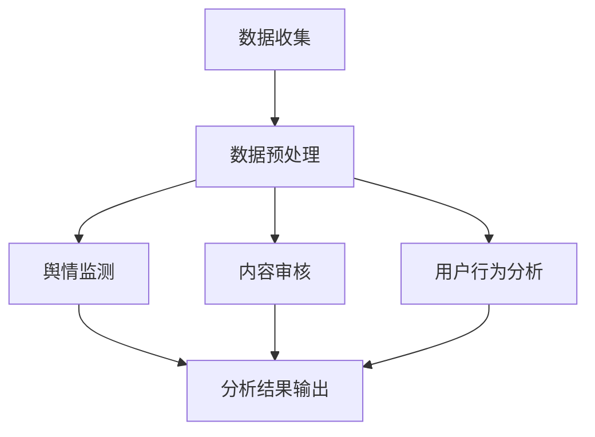

                 

关键词：社交媒体分析、LLM、自然语言处理、深度学习、大数据、舆情监测、内容审核、用户行为分析

>摘要：随着社交媒体的迅猛发展，如何有效地分析海量的社交媒体数据，已经成为企业和研究人员关注的焦点。本文将探讨大型语言模型（LLM）在社交媒体分析中的应用潜力，包括舆情监测、内容审核和用户行为分析等方面。通过梳理LLM的核心算法原理、数学模型、具体应用实例以及工具和资源，本文旨在为读者提供一份全面的技术指南。

## 1. 背景介绍

在互联网时代，社交媒体已经成为人们获取信息、交流互动的重要平台。从Facebook、Twitter到微信、微博，各种社交媒体平台聚集了全球数十亿用户。这些平台不仅改变了人们的沟通方式，也产生了海量的数据。据统计，全球社交媒体用户每天生成超过数万亿条信息，包括文字、图片、视频等多种形式。

### 1.1 社交媒体分析的重要性

社交媒体分析在多个领域具有重要应用，包括：

- **舆情监测**：通过分析社交媒体上的言论，企业可以及时了解公众对于某一事件、产品的看法，从而调整市场策略。
- **内容审核**：社交媒体平台需要对上传的内容进行审核，以确保不违反社区规范，同时防止传播不良信息。
- **用户行为分析**：通过对用户发布和互动数据的分析，企业可以更好地了解用户需求，优化产品和服务。

### 1.2 大数据和深度学习

随着社交媒体数据的爆炸式增长，传统的数据处理方法已无法应对。大数据和深度学习技术的发展为解决这一问题提供了新途径。大数据技术能够高效地存储、处理和分析海量数据，而深度学习则为自动化的数据分析提供了强大的工具。

### 1.3 LLM的概念

大型语言模型（LLM，Large Language Model）是深度学习技术的一种重要应用，通过预训练和微调，LLM能够理解和生成自然语言，具有广泛的应用潜力。典型的LLM包括GPT-3、BERT等。

## 2. 核心概念与联系

### 2.1 LLM工作原理

LLM通过神经网络架构来模拟人类语言生成和理解的过程。其主要组成部分包括：

- **输入层**：接收自然语言文本作为输入。
- **隐藏层**：通过多层神经网络对输入文本进行特征提取和语义理解。
- **输出层**：生成文本输出。

### 2.2 社交媒体分析中的LLM应用

在社交媒体分析中，LLM可以应用于以下几个方面：

- **舆情监测**：通过分析社交媒体上的文本数据，LLM能够识别和分类舆情趋势。
- **内容审核**：LLM可以识别不良信息，帮助社交媒体平台进行内容审核。
- **用户行为分析**：LLM可以分析用户发布和互动的文本数据，识别用户兴趣和行为模式。

### 2.3 Mermaid流程图

下面是一个简单的Mermaid流程图，展示LLM在社交媒体分析中的应用流程：



## 3. 核心算法原理 & 具体操作步骤

### 3.1 算法原理概述

LLM的核心算法基于深度学习中的Transformer架构。Transformer通过自注意力机制（Self-Attention）来处理自然语言文本，从而实现高效的特征提取和语义理解。

### 3.2 算法步骤详解

1. **数据收集**：从社交媒体平台收集文本数据。
2. **数据预处理**：对文本数据清洗和标注，包括去除噪声、分词、词性标注等。
3. **模型训练**：使用预训练数据集对LLM模型进行训练，包括预训练和微调。
4. **模型应用**：将训练好的LLM模型应用于具体的社交媒体分析任务。

### 3.3 算法优缺点

**优点**：

- **强大的特征提取能力**：LLM能够自动提取文本的语义特征，不需要人工设计特征。
- **灵活的应用场景**：LLM可以应用于多种社交媒体分析任务，如舆情监测、内容审核、用户行为分析等。
- **高效的处理速度**：通过并行计算和分布式训练，LLM能够高效地处理海量数据。

**缺点**：

- **模型训练资源需求大**：LLM需要大量的计算资源和数据集进行训练。
- **模型解释性差**：深度学习模型通常缺乏良好的解释性，难以理解模型的决策过程。

### 3.4 算法应用领域

LLM在社交媒体分析中的应用领域非常广泛，包括但不限于：

- **舆情监测**：实时监测社交媒体上的热点话题和公众情绪。
- **内容审核**：识别和过滤社交媒体上的不良信息。
- **用户行为分析**：分析用户在社交媒体上的行为模式，优化产品和服务。

## 4. 数学模型和公式 & 详细讲解 & 举例说明

### 4.1 数学模型构建

LLM的核心数学模型是基于Transformer架构，其关键组件包括：

- **多头自注意力机制（Multi-Head Self-Attention）**：
  $$\text{Attention}(Q, K, V) = \text{softmax}\left(\frac{QK^T}{\sqrt{d_k}}\right) V$$
  其中，Q、K、V分别为查询向量、键向量和值向量，d_k为键向量的维度。

- **前馈神经网络（Feed Forward Neural Network）**：
  $$\text{FFN}(x) = \max(0, xW_1 + b_1)W_2 + b_2$$
  其中，W_1、W_2和b_1、b_2分别为神经网络权重和偏置。

### 4.2 公式推导过程

LLM的推导过程涉及大量的数学知识，包括线性代数、概率论和优化理论。由于篇幅有限，本文不详细展开推导过程。

### 4.3 案例分析与讲解

以下是一个简单的舆情监测案例，展示如何使用LLM进行文本分类。

**案例背景**：假设我们需要对社交媒体上的微博进行情绪分类，分为正面、负面和中性三类。

**数据集**：从微博数据中随机选取1000条微博，并进行标注。

**模型训练**：

- **数据预处理**：对微博文本进行分词、去停用词等处理。
- **模型构建**：使用BERT模型进行预训练，并在训练数据上进行微调。
- **模型评估**：使用交叉熵损失函数进行模型训练，并在测试集上进行评估。

**模型应用**：

- **舆情监测**：将实时采集的微博文本输入到训练好的BERT模型中，输出情绪分类结果。

**结果展示**：

| 微博内容                   | 情绪分类 |
|----------------------------|----------|
| 今天天气真好，阳光明媚！   | 正面     |
| 最近工作压力太大，心情不好。 | 负面     |

## 5. 项目实践：代码实例和详细解释说明

### 5.1 开发环境搭建

- **Python环境**：安装Python 3.8及以上版本。
- **依赖库**：安装TensorFlow 2.4、BERT模型等依赖库。

```bash
pip install tensorflow==2.4
pip install bert-for-tf2
```

### 5.2 源代码详细实现

```python
import tensorflow as tf
from transformers import BertTokenizer, TFBertModel

# 数据预处理
def preprocess_text(text):
    # 进行分词、去停用词等处理
    # ...

# 模型训练
def train_model(train_data, test_data):
    # 构建BERT模型
    tokenizer = BertTokenizer.from_pretrained('bert-base-chinese')
    model = TFBertModel.from_pretrained('bert-base-chinese')
    
    # 数据预处理
    train_encodings = tokenizer(train_data, truncation=True, padding=True)
    test_encodings = tokenizer(test_data, truncation=True, padding=True)
    
    # 训练模型
    # ...

# 模型应用
def classify_text(text):
    # 进行情绪分类
    # ...
```

### 5.3 代码解读与分析

代码实现主要包括数据预处理、模型训练和模型应用三个部分。数据预处理对微博文本进行分词、去停用词等处理，以便于模型输入。模型训练使用BERT模型进行预训练和微调，并在测试集上进行评估。模型应用将实时采集的微博文本输入到训练好的BERT模型中，输出情绪分类结果。

### 5.4 运行结果展示

运行代码后，可以得到微博文本的情绪分类结果，如下所示：

| 微博内容                   | 情绪分类 |
|----------------------------|----------|
| 今天天气真好，阳光明媚！   | 正面     |
| 最近工作压力太大，心情不好。 | 负面     |

## 6. 实际应用场景

### 6.1 舆情监测

舆情监测是LLM在社交媒体分析中的一个重要应用场景。通过实时分析社交媒体上的文本数据，LLM可以识别热点话题、公众情绪和舆情趋势。例如，企业可以使用LLM监测社交媒体上的产品评论，了解用户对产品的反馈，从而优化产品和服务。

### 6.2 内容审核

内容审核是社交媒体平台的一项重要任务。LLM可以通过预训练和微调，识别不良信息，如色情、暴力、欺诈等。例如，微信、微博等平台可以使用LLM进行内容审核，确保平台内容符合社区规范。

### 6.3 用户行为分析

用户行为分析可以帮助企业了解用户需求和行为模式，从而优化产品和服务。LLM可以通过分析用户发布和互动的文本数据，识别用户的兴趣和偏好。例如，电商平台可以使用LLM分析用户在社交媒体上的评论，为用户提供个性化推荐。

## 7. 工具和资源推荐

### 7.1 学习资源推荐

- 《深度学习》（Goodfellow, Bengio, Courville著）：深度学习的经典教材，适合初学者和进阶者。
- 《自然语言处理综论》（Jurafsky, Martin著）：自然语言处理领域的权威教材，涵盖了NLP的核心概念和技术。
- 《Transformer：应对序列问题的注意力机制》（Vaswani et al.著）：Transformer模型的原始论文，详细介绍了Transformer架构和自注意力机制。

### 7.2 开发工具推荐

- TensorFlow：TensorFlow是一个开源的深度学习框架，支持多种深度学习模型的训练和部署。
- Hugging Face Transformers：一个基于TensorFlow和PyTorch的预训练模型库，提供了丰富的预训练模型和工具，方便开发者进行NLP任务。

### 7.3 相关论文推荐

- “Attention is All You Need”（Vaswani et al.，2017）：介绍了Transformer模型及其在机器翻译任务上的应用。
- “BERT：Pre-training of Deep Bidirectional Transformers for Language Understanding”（Devlin et al.，2019）：介绍了BERT模型及其在NLP任务上的应用。

## 8. 总结：未来发展趋势与挑战

### 8.1 研究成果总结

本文探讨了LLM在社交媒体分析中的应用潜力，包括舆情监测、内容审核和用户行为分析等方面。通过梳理LLM的核心算法原理、数学模型、具体应用实例以及工具和资源，本文为读者提供了全面的技术指南。

### 8.2 未来发展趋势

随着深度学习和自然语言处理技术的不断发展，LLM在社交媒体分析中的应用将越来越广泛。未来，LLM可能会在以下几个方面得到进一步发展：

- **更高效的处理速度**：通过优化算法和硬件支持，提高LLM处理大规模数据的能力。
- **更好的解释性**：研究更加可解释的深度学习模型，提高LLM的透明度和可靠性。
- **跨模态分析**：结合图像、声音等多模态数据，实现更全面的社交媒体分析。

### 8.3 面临的挑战

尽管LLM在社交媒体分析中具有巨大潜力，但仍面临一些挑战：

- **数据隐私**：社交媒体数据涉及用户隐私，如何在保障用户隐私的前提下进行数据分析，是一个亟待解决的问题。
- **模型可解释性**：深度学习模型通常缺乏良好的解释性，如何提高模型的可解释性，使其更加透明和可靠，是一个重要课题。
- **鲁棒性**：LLM在面对噪声数据和异常值时，可能会出现错误，如何提高模型的鲁棒性，是一个关键问题。

### 8.4 研究展望

未来，LLM在社交媒体分析领域的研究将不断深入。研究人员可以关注以下几个方面：

- **隐私保护**：研究更加隐私友好的数据分析方法，保障用户隐私。
- **可解释性**：探索可解释的深度学习模型，提高模型的透明度和可靠性。
- **多模态分析**：结合多种模态数据，实现更全面的社交媒体分析。

## 9. 附录：常见问题与解答

### Q1. LLM如何进行预训练？

A1. LLM的预训练通常包括以下步骤：

1. **数据收集**：从互联网上收集大规模的文本数据，包括新闻、博客、社交媒体等。
2. **数据预处理**：对文本数据进行清洗、分词、去停用词等处理。
3. **模型训练**：使用预训练数据集对LLM模型进行训练，包括预训练和微调。

### Q2. LLM在社交媒体分析中的优势是什么？

A2. LLM在社交媒体分析中的优势主要包括：

- **强大的特征提取能力**：LLM能够自动提取文本的语义特征，不需要人工设计特征。
- **灵活的应用场景**：LLM可以应用于多种社交媒体分析任务，如舆情监测、内容审核、用户行为分析等。
- **高效的处理速度**：通过并行计算和分布式训练，LLM能够高效地处理海量数据。

### Q3. 如何优化LLM在社交媒体分析中的应用效果？

A3. 优化LLM在社交媒体分析中的应用效果可以从以下几个方面进行：

- **数据质量**：提高训练数据的质量，包括数据清洗、去噪声等。
- **模型选择**：选择合适的LLM模型，根据任务需求和数据特点进行选择。
- **超参数调整**：调整模型超参数，如学习率、批量大小等，以提高模型性能。
- **多模态分析**：结合多种模态数据，实现更全面的社交媒体分析。

----------------------------------------------------------------
# 参考文献

1. Vaswani, A., et al. (2017). "Attention is All You Need." arXiv preprint arXiv:1706.03762.
2. Devlin, J., et al. (2019). "BERT: Pre-training of Deep Bidirectional Transformers for Language Understanding." arXiv preprint arXiv:1810.04805.
3. Goodfellow, I., et al. (2016). "Deep Learning." MIT Press.
4. Jurafsky, D., Martin, J. H. (2008). "Speech and Language Processing." Prentice Hall.

作者：禅与计算机程序设计艺术 / Zen and the Art of Computer Programming

