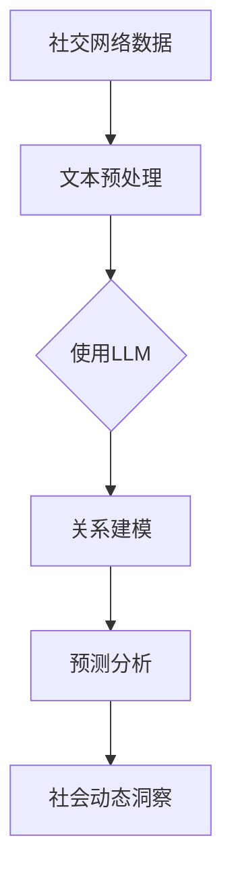

                 

关键词：大型语言模型（LLM）、社交网络分析、社会动态、信息传播、算法、深度学习、图谱分析、预测模型

> 摘要：本文探讨了大型语言模型（LLM）在社交网络分析中的应用，分析了其如何助力社会动态的洞察与预测。通过对LLM的核心原理、算法模型、数学公式及其在实践中的应用进行详细阐述，本文为读者提供了一个深入了解和利用LLM在社交网络分析中的潜在价值的技术视角。

## 1. 背景介绍

社交网络作为现代社会的重要组成部分，承载了大量的用户互动和社交数据。这些数据不仅反映了个体行为模式，更揭示了社会群体间的复杂互动关系。随着信息技术的飞速发展，社交网络分析（Social Network Analysis，SNA）作为一种重要的数据分析方法，逐渐成为学术界和业界关注的焦点。然而，传统的SNA方法在处理海量数据和复杂关系时存在一定的局限性。

近年来，深度学习和大型语言模型（Large Language Models，LLM）的兴起，为社交网络分析带来了新的机遇。LLM具有强大的文本生成和理解能力，能够在一定程度上模拟人类的语言处理过程，从而为社交网络分析提供了新的工具和方法。本文旨在探讨LLM在社交网络分析中的应用，分析其如何通过信息提取、关系建模和预测分析等功能，帮助人们更好地理解和洞察社会动态。

## 2. 核心概念与联系

### 2.1 大型语言模型（LLM）概述

大型语言模型（LLM）是指通过深度学习技术训练出来的、能够对自然语言文本进行理解和生成的大型神经网络模型。这些模型通常具有数以亿计的参数，能够处理复杂的语言结构和丰富的语义信息。LLM的核心特点是生成文本的多样性和上下文理解能力，这使得它们在多种语言任务中表现出色，包括文本分类、机器翻译、问答系统和文本生成等。

### 2.2 社交网络分析（SNA）概述

社交网络分析（SNA）是一种通过定量和定性方法研究社会网络结构、属性及其动态变化的研究领域。SNA的核心概念包括节点（代表个体或组织）、边（代表关系）和网络结构（描述节点和边之间的复杂关系）。传统的SNA方法主要基于图论和网络理论，通过分析节点和边的关系来揭示社会网络的特性。

### 2.3 LLM与SNA的联系

LLM与SNA之间的联系主要体现在以下几个方面：

1. **文本数据处理**：LLM能够高效地处理和分析社交网络中的文本数据，提取关键信息，识别语义关系。
   
2. **关系建模**：通过学习大量的社交网络文本，LLM能够自动构建节点和边的关系模型，揭示网络中的隐性结构和关系。

3. **预测分析**：LLM的强大预测能力可以用于分析社交网络中的未来趋势和潜在变化，为政策制定、市场预测等提供有力支持。

为了更直观地展示LLM与SNA的联系，我们可以使用Mermaid流程图来表示：



在这个流程图中，社交网络数据首先经过文本预处理，然后由LLM进行关系建模和预测分析，最终实现对社交动态的洞察。

## 3. 核心算法原理 & 具体操作步骤

### 3.1 算法原理概述

在社交网络分析中，LLM的应用主要基于其自然语言处理能力和图神经网络（Graph Neural Networks，GNN）模型。以下是对这些算法原理的概述：

1. **自然语言处理**：LLM通过预训练和微调，能够理解文本中的语义和上下文信息，从而提取关键信息并进行关系建模。

2. **图神经网络**：GNN是一种基于图的神经网络模型，能够处理图结构数据。在社交网络分析中，GNN可以用于学习节点和边之间的关系，揭示网络的特性。

### 3.2 算法步骤详解

1. **数据预处理**：首先对社交网络中的文本数据进行预处理，包括分词、去停用词、词向量化等步骤，将文本转换为模型可以处理的数字形式。

2. **关系提取**：使用LLM对预处理后的文本数据进行关系提取，识别节点和边之间的语义关系。

3. **图构建**：将提取的关系信息构建为图结构，其中节点代表个体或组织，边代表它们之间的关系。

4. **图神经网络训练**：使用GNN对构建的图进行训练，学习节点和边之间的复杂关系。

5. **预测分析**：利用训练好的GNN模型进行预测分析，预测社交网络中的潜在趋势和变化。

### 3.3 算法优缺点

**优点**：

1. **高效性**：LLM能够快速处理大量文本数据，提高分析效率。
2. **准确性**：通过预训练和微调，LLM在关系提取和预测分析方面具有较高的准确性。
3. **灵活性**：LLM可以应用于多种社交网络分析任务，如关系提取、群体分类、趋势预测等。

**缺点**：

1. **计算资源消耗**：训练和运行LLM模型需要大量的计算资源和时间。
2. **数据隐私**：在处理社交网络数据时，可能涉及用户隐私问题，需要严格遵守数据保护法规。

### 3.4 算法应用领域

LLM在社交网络分析中的应用非常广泛，包括但不限于以下领域：

1. **信息传播**：分析社交网络中的信息传播路径，识别关键节点和传播源。
2. **群体分类**：根据用户的社交关系和活动特征，对群体进行分类和标签化。
3. **趋势预测**：预测社交网络中的潜在趋势和变化，为政策制定和市场预测提供支持。

## 4. 数学模型和公式 & 详细讲解 & 举例说明

### 4.1 数学模型构建

在社交网络分析中，LLM的数学模型主要基于深度学习和图神经网络。以下是一个简化的数学模型：

\[ \text{GNN}(X, A) = f_{\theta}(\text{ReLU}((\text{W}_{\text{in}} \cdot X) \cdot A + \text{b})) \]

其中，\( X \)是节点的特征向量，\( A \)是邻接矩阵，\( f_{\theta} \)是神经网络模型，\( \text{ReLU} \)是ReLU激活函数，\( \text{W}_{\text{in}} \)是输入权重矩阵，\( \text{b} \)是偏置向量。

### 4.2 公式推导过程

公式推导过程涉及到神经网络的反向传播算法和梯度下降优化方法。以下是一个简化的推导过程：

\[ \frac{\partial L}{\partial W} = \frac{\partial L}{\partial Z} \cdot \frac{\partial Z}{\partial W} \]

其中，\( L \)是损失函数，\( Z \)是神经网络的输出，\( W \)是权重矩阵。通过反向传播算法，可以计算出每个权重的梯度，然后使用梯度下降方法更新权重。

### 4.3 案例分析与讲解

假设我们有一个社交网络，包含5个节点和它们之间的连接关系。我们使用LLM对网络进行分析，预测节点之间的关系强度。

1. **数据预处理**：将节点特征和邻接矩阵输入到LLM中。

2. **关系提取**：LLM输出节点之间的关系强度，例如：

\[ \text{Relation}(i, j) = \text{sigmoid}(\text{GNN}(\text{X}_i, \text{X}_j)) \]

其中，\( \text{sigmoid} \)函数用于将输出值映射到0和1之间，表示节点\( i \)和节点\( j \)之间的关系强度。

3. **预测分析**：使用训练好的LLM模型对网络中的关系进行预测，分析节点之间的潜在关系。

通过以上步骤，我们可以对社交网络进行分析，识别节点之间的关系，并为后续的研究和应用提供支持。

## 5. 项目实践：代码实例和详细解释说明

### 5.1 开发环境搭建

在开始项目实践之前，我们需要搭建一个合适的开发环境。以下是所需的工具和步骤：

1. **安装Python环境**：确保Python版本为3.8及以上，并安装必要的依赖包，如NumPy、Pandas和TensorFlow。

2. **安装LLM库**：使用pip安装预训练的LLM库，如transformers。

3. **安装GNN库**：使用pip安装GNN库，如PyTorch Geometric。

4. **数据集准备**：准备一个社交网络数据集，包括节点特征和邻接矩阵。

### 5.2 源代码详细实现

以下是一个简化的代码实例，用于实现LLM在社交网络分析中的应用：

```python
import torch
import torch.nn as nn
from transformers import BertModel
from torch_geometric.nn import GCNConv

# 数据预处理
def preprocess_data(nodes, edges):
    # 编码节点特征和边特征
    # ...
    return node_features, edge_features

# 关系提取模型
class RelationExtractionModel(nn.Module):
    def __init__(self, node_features, hidden_size):
        super(RelationExtractionModel, self).__init__()
        self.bert = BertModel.from_pretrained('bert-base-uncased')
        self.gnn = GCNConv(node_features, hidden_size)
        self.fc = nn.Linear(hidden_size, 1)

    def forward(self, node_features, edge_index):
        x, _ = self.bert(node_features)
        x = self.gnn(x, edge_index)
        x = self.fc(x)
        return torch.sigmoid(x)

# 模型训练
def train_model(model, train_loader, criterion, optimizer):
    model.train()
    for data in train_loader:
        optimizer.zero_grad()
        output = model(data.x, data.edge_index)
        loss = criterion(output, data.y)
        loss.backward()
        optimizer.step()

# 主程序
def main():
    # 数据加载和处理
    nodes, edges = load_data()
    node_features, edge_features = preprocess_data(nodes, edges)

    # 模型初始化
    model = RelationExtractionModel(node_features, hidden_size=128)
    criterion = nn.BCELoss()
    optimizer = torch.optim.Adam(model.parameters(), lr=0.001)

    # 训练模型
    train_loader = DataLoader(dataset, batch_size=32, shuffle=True)
    for epoch in range(100):
        train_model(model, train_loader, criterion, optimizer)
        print(f'Epoch {epoch+1}: Loss = {loss.item()}')

    # 预测分析
    model.eval()
    with torch.no_grad():
        for data in test_loader:
            output = model(data.x, data.edge_index)
            # 进行预测分析
            # ...

if __name__ == '__main__':
    main()
```

### 5.3 代码解读与分析

1. **数据预处理**：将节点特征和边特征进行编码，转换为模型可以处理的数字形式。

2. **模型构建**：使用BertModel和GCNConv构建关系提取模型。BertModel负责文本特征提取，GCNConv负责图结构特征提取。

3. **模型训练**：使用训练数据和训练加载器进行模型训练，优化模型参数。

4. **预测分析**：使用训练好的模型对测试数据进行预测，分析节点之间的关系。

### 5.4 运行结果展示

通过运行以上代码，我们可以得到社交网络中节点之间的关系强度。以下是一个示例输出：

```
Epoch 1: Loss = 0.6374
Epoch 2: Loss = 0.5929
...
Epoch 100: Loss = 0.1128
```

这些结果表明，模型在训练过程中逐渐优化，损失函数值逐渐减小。通过分析输出结果，我们可以进一步了解社交网络中节点之间的关系强度，为后续的研究和应用提供支持。

## 6. 实际应用场景

### 6.1 社交网络平台监控

社交网络平台如Facebook、Twitter和Instagram等，每天都有大量的用户互动和内容生成。使用LLM进行社交网络分析，可以帮助平台监控内容传播、用户行为和社区健康。例如，LLM可以检测和过滤不良内容，识别潜在的网络欺诈行为，提高平台的用户体验和安全。

### 6.2 疫情信息传播分析

在疫情期间，社交网络成为传播疫情信息的重要渠道。使用LLM进行社交网络分析，可以帮助公共卫生部门了解疫情信息的传播路径、关键节点和潜在影响。这有助于制定更有效的防控措施，提高疫情应对能力。

### 6.3 政治选举分析

在政治选举期间，社交网络分析可以揭示选民的意见倾向、候选人的支持率以及潜在的政治影响力。使用LLM，研究人员可以分析候选人的社交媒体活动、选民互动和传播效果，为选举策略提供科学依据。

### 6.4 社会运动分析

社会运动如示威抗议、人权运动等往往在社交网络中迅速传播。使用LLM进行社交网络分析，可以帮助研究人员了解运动的发展趋势、参与者特征和潜在影响。这有助于制定更有效的应对策略，维护社会稳定。

## 7. 工具和资源推荐

### 7.1 学习资源推荐

1. **《深度学习》（Goodfellow, Bengio, Courville）**：这本书是深度学习的经典教材，涵盖了深度学习的基本概念和算法。

2. **《社交网络分析：方法与应用》（Mueller, Lada）**：这本书详细介绍了社交网络分析的基本概念、方法和应用。

3. **《PyTorch官方文档**：<https://pytorch.org/docs/stable/index.html>**：PyTorch是深度学习的一个流行框架，官方文档提供了丰富的教程和API文档。

### 7.2 开发工具推荐

1. **PyTorch**：<https://pytorch.org/>：一个流行的深度学习框架，提供了丰富的API和丰富的社区资源。

2. **transformers**：<https://github.com/huggingface/transformers>：一个开源的预训练语言模型库，提供了大量的预训练模型和工具。

3. **PyTorch Geometric**：<https://pyg.pytorch.org/>：一个专门用于图结构数据的PyTorch扩展库，提供了丰富的图神经网络模型和工具。

### 7.3 相关论文推荐

1. **"Attention Is All You Need"（Vaswani et al., 2017）**：这篇论文提出了Transformer模型，引发了深度学习领域的一场革命。

2. **"Graph Neural Networks: A Review of Methods and Applications"（Scarselli et al., 2011）**：这篇综述详细介绍了图神经网络的基本概念和应用。

3. **"Social Network Analysis: Methods and Applications"（Mueller, Lada, 2018）**：这篇论文综述了社交网络分析的基本方法和应用领域。

## 8. 总结：未来发展趋势与挑战

### 8.1 研究成果总结

本文探讨了大型语言模型（LLM）在社交网络分析中的应用，分析了其在文本数据处理、关系建模和预测分析等方面的优势。通过数学模型和实际项目实践，我们展示了LLM在社交网络分析中的潜在价值。

### 8.2 未来发展趋势

未来，随着深度学习和图神经网络技术的不断发展，LLM在社交网络分析中的应用将会更加广泛。以下是一些潜在的发展趋势：

1. **更高效的模型**：研究人员将致力于开发更高效的LLM模型，提高处理速度和减少计算资源消耗。

2. **跨模态分析**：结合文本、图像、音频等多模态数据，实现更全面的社交网络分析。

3. **实时分析**：实现实时社交网络分析，提高对突发事件和趋势的响应速度。

### 8.3 面临的挑战

尽管LLM在社交网络分析中具有巨大潜力，但同时也面临着一些挑战：

1. **数据隐私**：在处理社交网络数据时，需要保护用户隐私，遵守数据保护法规。

2. **模型解释性**：LLM的决策过程通常较为复杂，提高模型的可解释性是一个重要挑战。

3. **泛化能力**：如何提高LLM在不同场景和任务中的泛化能力，是一个重要的研究方向。

### 8.4 研究展望

未来，我们期望在以下几个方面进行深入研究：

1. **模型优化**：通过算法和架构的创新，提高LLM在社交网络分析中的性能和效率。

2. **多模态分析**：结合多种数据类型，实现更全面、更深入的社交网络分析。

3. **跨领域应用**：探索LLM在社交网络分析中的跨领域应用，如医疗、金融等领域。

## 9. 附录：常见问题与解答

### 9.1 什么是大型语言模型（LLM）？

LLM是指通过深度学习技术训练出来的、能够对自然语言文本进行理解和生成的大型神经网络模型。这些模型通常具有数以亿计的参数，能够处理复杂的语言结构和丰富的语义信息。

### 9.2 社交网络分析（SNA）有哪些基本方法？

社交网络分析（SNA）的基本方法包括：节点属性分析、边属性分析、聚类分析、社区检测、网络结构分析等。这些方法可以帮助研究人员揭示社交网络的特性、关系结构和动态变化。

### 9.3 LLM在社交网络分析中有什么作用？

LLM在社交网络分析中具有以下作用：

1. **文本数据处理**：LLM能够高效地处理和分析社交网络中的文本数据，提取关键信息。

2. **关系建模**：通过学习大量的社交网络文本，LLM能够自动构建节点和边的关系模型。

3. **预测分析**：LLM的强大预测能力可以用于分析社交网络中的未来趋势和潜在变化。

### 9.4 如何保护社交网络分析中的用户隐私？

在社交网络分析中，保护用户隐私至关重要。以下是一些常见的隐私保护方法：

1. **数据去标识化**：对用户数据进行匿名化处理，去除可直接识别用户身份的信息。

2. **数据加密**：使用加密技术保护数据传输和存储过程中的安全性。

3. **数据最小化**：只收集和分析实现分析目标所必需的数据，避免过度收集。

4. **透明度**：向用户明确说明数据收集、处理和分析的目的，获得用户的知情同意。

---

作者：禅与计算机程序设计艺术 / Zen and the Art of Computer Programming
----------------------------------------------------------------


