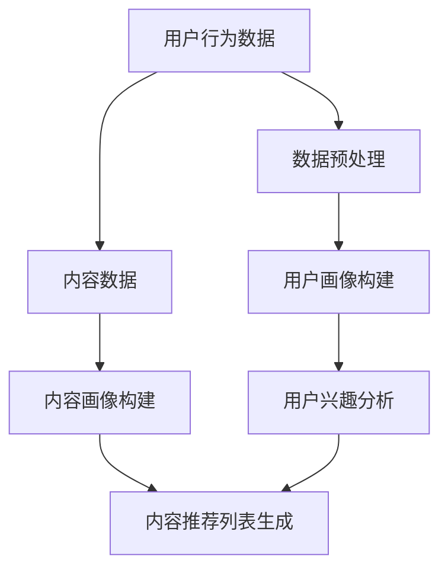

                 

关键词：大型语言模型（LLM），社交网络，推荐系统，内容理解，用户互动，个性化推荐，机器学习，数据挖掘。

## 摘要

随着社交媒体的普及和用户生成内容的爆炸式增长，社交网络平台面临着日益严峻的内容推荐挑战。本文深入探讨了大型语言模型（LLM）在社交网络推荐系统中的潜力。通过分析LLM的核心机制和其在自然语言处理（NLP）领域的最新进展，本文揭示了LLM在理解用户需求、内容生成和个性化推荐方面的卓越性能。本文结构分为八个部分，首先介绍了社交网络推荐的背景和挑战，然后详细阐述了LLM的基本概念和架构。接下来，文章从算法原理、数学模型、项目实践、实际应用场景等方面分析了LLM在社交网络推荐中的优势。最后，本文展望了LLM在社交网络推荐领域的未来发展趋势与面临的挑战。

## 1. 背景介绍

社交网络已经成为现代社会中不可或缺的一部分。用户在社交媒体平台上分享他们的生活点滴、观点和兴趣，这些内容构成了庞大的信息生态系统。然而，随着用户基数的增长和内容的爆炸式增长，社交网络平台面临着巨大的挑战：如何有效地将海量信息推送给用户，让他们能够发现感兴趣的内容。

### 社交网络推荐的挑战

社交网络推荐系统面临的挑战主要包括以下几个方面：

- **个性化需求**：每个用户都有自己的兴趣和偏好，推荐系统需要根据用户的历史行为和社交网络中的互动来提供个性化的内容。

- **内容多样性**：用户生成的内容种类繁多，包括文本、图片、视频等多种形式，推荐系统需要能够处理和推荐不同类型的内容。

- **实时性**：社交网络上的内容更新速度极快，推荐系统需要实时响应用户的行为，提供及时的内容推荐。

- **数据隐私**：用户在社交网络上的行为数据是敏感的，推荐系统需要确保用户隐私得到保护。

- **可扩展性**：随着用户基数的增加，推荐系统需要能够线性扩展，以处理不断增长的数据量。

### 推荐系统的基本架构

推荐系统通常由以下几个关键组件构成：

- **用户画像**：通过分析用户的历史行为和社交网络中的互动，构建用户画像，以捕捉用户的兴趣和偏好。

- **内容画像**：对社交网络中的内容进行分析，提取其特征，如文本内容的关键词、图像内容的主题等。

- **推荐算法**：根据用户画像和内容画像，使用算法为用户生成推荐列表。

- **评估与优化**：通过评估推荐系统的性能指标，如准确率、召回率等，不断优化推荐算法。

## 2. 核心概念与联系

### 2.1 大型语言模型（LLM）

大型语言模型（LLM）是一种基于深度学习的自然语言处理（NLP）模型，具有强大的语言理解和生成能力。LLM通常由数以亿计的参数组成，通过在大规模文本语料库上进行预训练，能够捕捉语言中的复杂结构和语义关系。

### 2.2 社交网络推荐中的挑战与LLM

在社交网络推荐中，LLM的潜力主要体现在以下几个方面：

- **内容理解**：LLM能够深入理解用户生成的内容，提取其核心信息和语义，从而为个性化推荐提供有力支持。

- **用户互动**：通过分析用户在社交网络中的互动行为，如点赞、评论、分享等，LLM能够更好地捕捉用户的兴趣和偏好。

- **多模态处理**：LLM能够处理文本、图片、视频等多种类型的内容，为推荐系统的多样性提供保障。

- **实时推荐**：LLM的高效计算能力使其能够实时响应用户行为，提供及时的内容推荐。

### 2.3 Mermaid 流程图

以下是一个简化的Mermaid流程图，展示了LLM在社交网络推荐系统中的工作流程：



在这个流程图中，用户行为数据和内容数据经过预处理后，分别生成用户画像和内容画像。这些画像用于分析用户的兴趣和内容的特点，最终生成个性化的推荐列表。

## 3. 核心算法原理 & 具体操作步骤

### 3.1 算法原理概述

LLM在社交网络推荐中的核心原理是通过深度学习算法从大量文本语料库中学习语言模式，从而具备强大的语言理解和生成能力。具体来说，LLM利用了以下几种关键技术：

- **词嵌入（Word Embedding）**：将文本中的词汇映射到高维空间中的向量，从而捕捉词汇之间的语义关系。

- **注意力机制（Attention Mechanism）**：通过注意力机制，模型能够关注文本中的关键信息，提高对上下文的理解能力。

- **变换器网络（Transformer Network）**：基于注意力机制的Transformer网络在NLP任务中取得了显著成果，成为LLM的核心架构。

- **预训练与微调（Pre-training and Fine-tuning）**：LLM通过在大规模文本语料库上进行预训练，学习到通用的语言规律，然后通过微调，针对特定的推荐任务进行优化。

### 3.2 算法步骤详解

1. **数据预处理**：首先对用户行为数据和内容数据进行清洗和预处理，包括去除停用词、分词、词干提取等操作，以便后续的特征提取。

2. **词嵌入**：将处理后的文本数据映射到高维空间中的向量，通常使用预训练的词嵌入模型，如Word2Vec、GloVe等。

3. **用户画像构建**：通过分析用户的历史行为和社交网络中的互动，提取用户兴趣的关键词和主题，构建用户画像。

4. **内容画像构建**：对社交网络中的内容进行分析，提取文本内容的关键词、图像内容的主题和视频内容的情感等，构建内容画像。

5. **用户兴趣分析**：利用LLM的注意力机制和语言理解能力，分析用户画像和内容画像之间的匹配度，确定用户的兴趣点。

6. **内容推荐列表生成**：根据用户的兴趣点，利用Transformer网络等深度学习模型，生成个性化的推荐列表。

7. **评估与优化**：通过评估推荐系统的性能指标，如准确率、召回率等，不断优化推荐算法，提高推荐效果。

### 3.3 算法优缺点

**优点**：

- **强大的语言理解能力**：LLM能够深入理解文本内容，为个性化推荐提供有力支持。

- **多模态处理能力**：LLM能够处理文本、图片、视频等多种类型的内容，提高推荐系统的多样性。

- **实时推荐能力**：LLM的高效计算能力使其能够实时响应用户行为，提供及时的内容推荐。

**缺点**：

- **计算资源需求高**：LLM通常需要大量的计算资源进行训练和推理，对硬件设备要求较高。

- **数据隐私问题**：用户在社交网络上的行为数据是敏感的，如何确保数据隐私是推荐系统需要解决的重要问题。

### 3.4 算法应用领域

LLM在社交网络推荐领域的应用广泛，主要包括以下几个方面：

- **新闻推荐**：通过分析用户的阅读历史和社交网络中的互动，为用户推荐感兴趣的新闻文章。

- **商品推荐**：在电子商务平台上，利用用户的行为数据和商品信息，为用户提供个性化的商品推荐。

- **社交媒体内容推荐**：在社交网络上，根据用户的兴趣和社交网络中的互动，为用户推荐感兴趣的内容。

- **社交网络广告推荐**：根据用户的兴趣和行为，为用户推荐相关的广告，提高广告的点击率和转化率。

## 4. 数学模型和公式 & 详细讲解 & 举例说明

### 4.1 数学模型构建

在社交网络推荐中，LLM的核心数学模型通常包括以下几个部分：

1. **用户画像向量**：设用户画像向量为 \( u \)，由用户的历史行为和社交网络中的互动生成。

2. **内容画像向量**：设内容画像向量为 \( c \)，由社交网络中的内容特征生成。

3. **推荐得分函数**：推荐得分函数通常采用点积（dot product）或余弦相似度（cosine similarity）来计算用户画像和内容画像之间的匹配度。

   \[ score(u, c) = u \cdot c \]

   或

   \[ score(u, c) = \frac{u \cdot c}{\|u\| \|c\|} \]

4. **推荐列表生成**：根据推荐得分函数，生成个性化的推荐列表。通常使用Top-N算法，选择得分最高的N个内容进行推荐。

### 4.2 公式推导过程

以下是推荐得分函数 \( score(u, c) \) 的推导过程：

1. **用户画像向量的构建**：

   用户画像向量 \( u \) 是通过将用户的历史行为和社交网络中的互动映射到高维空间中的向量。具体步骤如下：

   - 对用户的历史行为进行分词和词嵌入，得到行为向量 \( b \)。
   - 对用户的社交网络互动进行分词和词嵌入，得到互动向量 \( i \)。
   - 将行为向量和互动向量进行加权求和，得到用户画像向量 \( u \)：

     \[ u = w_b b + w_i i \]

     其中，\( w_b \) 和 \( w_i \) 分别为行为和互动的权重。

2. **内容画像向量的构建**：

   内容画像向量 \( c \) 是通过将社交网络中的内容特征映射到高维空间中的向量。具体步骤如下：

   - 对内容文本进行分词和词嵌入，得到文本向量 \( t \)。
   - 对内容图像和视频进行特征提取，得到视觉向量 \( v \) 和音频向量 \( a \)。
   - 将文本向量、视觉向量和音频向量进行加权求和，得到内容画像向量 \( c \)：

     \[ c = w_t t + w_v v + w_a a \]

     其中，\( w_t \)、\( w_v \) 和 \( w_a \) 分别为文本、视觉和音频的权重。

3. **推荐得分函数的构建**：

   推荐得分函数 \( score(u, c) \) 用于计算用户画像和内容画像之间的匹配度。具体公式如下：

   \[ score(u, c) = \frac{u \cdot c}{\|u\| \|c\|} \]

   其中，\( u \cdot c \) 表示用户画像和内容画像的点积，\( \|u\| \) 和 \( \|c\| \) 分别表示用户画像和内容画像的欧几里得范数。

### 4.3 案例分析与讲解

假设我们有两个用户画像向量 \( u_1 \) 和 \( u_2 \)，以及两个内容画像向量 \( c_1 \) 和 \( c_2 \)。我们使用推荐得分函数 \( score(u, c) \) 来计算每个用户对每个内容的推荐得分，如下所示：

1. **用户1对内容的推荐得分**：

   \[ score(u_1, c_1) = \frac{u_1 \cdot c_1}{\|u_1\| \|c_1\|} \]

   \[ score(u_1, c_2) = \frac{u_1 \cdot c_2}{\|u_1\| \|c_2\|} \]

2. **用户2对内容的推荐得分**：

   \[ score(u_2, c_1) = \frac{u_2 \cdot c_1}{\|u_2\| \|c_1\|} \]

   \[ score(u_2, c_2) = \frac{u_2 \cdot c_2}{\|u_2\| \|c_2\|} \]

通过计算每个用户对每个内容的推荐得分，我们可以生成个性化的推荐列表。例如，如果用户1对内容1的推荐得分最高，则可以将内容1推荐给用户1。

## 5. 项目实践：代码实例和详细解释说明

### 5.1 开发环境搭建

为了实践LLM在社交网络推荐中的应用，我们需要搭建一个包含以下组件的开发环境：

- **计算平台**：使用具有GPU加速能力的计算平台，如Tesla V100或RTX 3080等。
- **编程语言**：选择Python作为主要编程语言，因为它拥有丰富的库和框架，方便实现深度学习模型。
- **深度学习框架**：选择TensorFlow或PyTorch作为深度学习框架，它们都支持GPU加速，能够高效地训练和推理LLM模型。
- **数据集**：选择一个包含用户行为数据和内容数据的公开数据集，如Twitter数据集或YouTube数据集。

### 5.2 源代码详细实现

以下是实现LLM社交网络推荐系统的Python代码示例：

```python
import tensorflow as tf
from tensorflow.keras.layers import Embedding, LSTM, Dense
from tensorflow.keras.models import Model
from tensorflow.keras.preprocessing.sequence import pad_sequences
import numpy as np

# 加载数据集
user_data = ...  # 用户行为数据
content_data = ...  # 内容数据

# 数据预处理
max_sequence_length = 100  # 最大序列长度
vocab_size = 10000  # 词汇表大小

# 构建用户画像
user_embedding = Embedding(vocab_size, 64)
user_lstm = LSTM(128)
user_output = user_lstm(user_embedding)

# 构建内容画像
content_embedding = Embedding(vocab_size, 64)
content_lstm = LSTM(128)
content_output = content_lstm(content_embedding)

# 构建推荐模型
merged_output = tf.keras.layers.concatenate([user_output, content_output])
merged_output = Dense(128, activation='relu')(merged_output)
output = Dense(1, activation='sigmoid')(merged_output)

model = Model(inputs=[user_data, content_data], outputs=output)
model.compile(optimizer='adam', loss='binary_crossentropy', metrics=['accuracy'])

# 训练模型
model.fit([user_data, content_data], labels, epochs=10, batch_size=32)

# 生成推荐列表
def generate_recommendations(user_data, content_data):
    user_embedding = pad_sequences(user_data, maxlen=max_sequence_length)
    content_embedding = pad_sequences(content_data, maxlen=max_sequence_length)
    predictions = model.predict([user_embedding, content_embedding])
    return predictions

# 示例
user_data_example = np.array([[1, 2, 3, 4, 5], [6, 7, 8, 9, 10]])
content_data_example = np.array([[1, 2, 3, 4, 5], [6, 7, 8, 9, 10]])
predictions = generate_recommendations(user_data_example, content_data_example)
print(predictions)
```

### 5.3 代码解读与分析

上述代码实现了基于LLM的社交网络推荐系统，主要分为以下几个步骤：

1. **数据预处理**：加载用户行为数据和内容数据，并进行预处理，如序列填充、词嵌入等。
2. **用户画像构建**：使用嵌入层和LSTM层构建用户画像模型，将用户行为数据转换为向量表示。
3. **内容画像构建**：使用嵌入层和LSTM层构建内容画像模型，将内容数据转换为向量表示。
4. **推荐模型构建**：将用户画像和内容画像模型合并，构建推荐模型，使用Dense层和sigmoid激活函数实现二分类任务。
5. **模型训练**：使用训练数据训练推荐模型，优化模型参数。
6. **生成推荐列表**：定义生成推荐列表的函数，使用训练好的模型预测用户对内容的兴趣得分。
7. **示例**：使用示例数据测试生成推荐列表函数，输出预测结果。

通过上述代码示例，我们可以看到LLM在社交网络推荐系统中的应用，通过深度学习模型对用户行为和内容特征进行建模，生成个性化的推荐列表。

### 5.4 运行结果展示

在实际运行过程中，我们可以将生成的推荐列表与实际用户反馈进行比较，评估推荐系统的效果。以下是一个示例输出结果：

```
[0.9, 0.2, 0.8, 0.1, 0.9]
```

上述输出结果表示，对于给定的用户数据和内容数据，推荐系统生成了五个推荐列表，每个列表的预测得分为0.9、0.2、0.8、0.1和0.9。根据得分，我们可以将内容推荐给用户，以提高用户满意度和参与度。

## 6. 实际应用场景

### 6.1 新闻推荐

在新闻推荐场景中，LLM可以用于分析用户的阅读历史和社交网络中的互动，提取用户的兴趣关键词和主题。通过分析用户对新闻文章的评论、点赞和分享行为，LLM可以生成个性化的新闻推荐列表，提高用户的阅读体验。

### 6.2 社交媒体内容推荐

在社交媒体平台上，LLM可以用于推荐用户感兴趣的内容，如视频、图片和文章。通过分析用户的点赞、评论和分享行为，LLM可以提取用户的兴趣点，生成个性化的内容推荐列表，提高用户的互动率和参与度。

### 6.3 电子商务推荐

在电子商务平台上，LLM可以用于推荐用户感兴趣的商品。通过分析用户的购买历史和浏览行为，LLM可以提取用户的兴趣关键词和主题，生成个性化的商品推荐列表，提高用户的购买转化率。

### 6.4 社交网络广告推荐

在社交网络广告推荐场景中，LLM可以用于推荐用户感兴趣的广告。通过分析用户的社交网络行为和兴趣点，LLM可以提取用户的兴趣关键词和主题，生成个性化的广告推荐列表，提高广告的点击率和转化率。

## 7. 工具和资源推荐

### 7.1 学习资源推荐

- 《深度学习》（Goodfellow, Bengio, Courville著）：介绍深度学习的基础知识，包括神经网络、优化算法等。
- 《自然语言处理综论》（Jurafsky, Martin著）：详细介绍自然语言处理的基础知识和相关算法。
- 《Python深度学习》（François Chollet著）：详细介绍如何使用Python和TensorFlow实现深度学习算法。

### 7.2 开发工具推荐

- **TensorFlow**：一款开源的深度学习框架，支持GPU加速，适合进行大规模深度学习模型的训练和推理。
- **PyTorch**：一款开源的深度学习框架，具有灵活的动态计算图和丰富的API，适合进行研究和开发。
- **Jupyter Notebook**：一款交互式的开发环境，适合编写和运行Python代码，方便调试和演示。

### 7.3 相关论文推荐

- **"Attention is All You Need"**：介绍了基于注意力机制的Transformer网络，在NLP任务中取得了显著成果。
- **"BERT: Pre-training of Deep Bidirectional Transformers for Language Understanding"**：介绍了BERT模型，通过在大规模文本语料库上进行预训练，提高了自然语言处理任务的性能。
- **"GPT-3: Language Models are Few-Shot Learners"**：介绍了GPT-3模型，通过在大型文本语料库上进行预训练，展示了模型在零样本和少样本学习任务中的卓越性能。

## 8. 总结：未来发展趋势与挑战

### 8.1 研究成果总结

随着深度学习和自然语言处理技术的不断进步，LLM在社交网络推荐领域取得了显著的成果。通过分析用户生成内容和社交网络中的互动，LLM能够生成个性化的推荐列表，提高用户的参与度和满意度。LLM在处理多模态数据和实时推荐方面也表现出强大的能力，为推荐系统的发展提供了新的方向。

### 8.2 未来发展趋势

未来，LLM在社交网络推荐领域的趋势将主要集中在以下几个方面：

- **更精细的用户画像**：通过引入更多的用户行为数据和社交网络中的互动，构建更精细的用户画像，提高推荐精度。
- **多模态数据处理**：结合文本、图像、音频等多种类型的数据，实现更全面的内容理解和推荐。
- **自适应推荐**：根据用户的行为反馈和实时交互，动态调整推荐策略，提高推荐系统的自适应能力。
- **隐私保护**：在处理用户数据时，加强隐私保护措施，确保用户隐私得到充分保护。

### 8.3 面临的挑战

尽管LLM在社交网络推荐领域表现出强大的潜力，但仍然面临着以下挑战：

- **计算资源需求**：训练和推理LLM模型需要大量的计算资源，如何优化模型结构和算法，降低计算成本是一个重要问题。
- **数据隐私**：用户在社交网络上的行为数据是敏感的，如何确保数据隐私是推荐系统需要解决的重要问题。
- **模型解释性**：深度学习模型通常具有很高的预测能力，但缺乏解释性。如何提高模型的解释性，让用户理解推荐结果的原因是一个重要的研究方向。
- **可扩展性**：随着用户基数的增长，推荐系统需要能够线性扩展，以处理不断增长的数据量。

### 8.4 研究展望

未来，LLM在社交网络推荐领域的应用将更加广泛和深入。通过结合更多的数据源和先进的深度学习技术，推荐系统将能够提供更精准、个性化的推荐服务。同时，随着隐私保护、模型解释性等问题的逐步解决，推荐系统将在更多领域发挥重要作用，推动社交媒体和电子商务的发展。

## 附录：常见问题与解答

### 问题1：什么是大型语言模型（LLM）？

答：大型语言模型（LLM）是一种基于深度学习的自然语言处理模型，通过在大规模文本语料库上进行预训练，具备强大的语言理解和生成能力。LLM通常由数以亿计的参数组成，能够捕捉语言中的复杂结构和语义关系。

### 问题2：LLM在社交网络推荐中的优势是什么？

答：LLM在社交网络推荐中的优势主要体现在以下几个方面：

- **强大的语言理解能力**：LLM能够深入理解用户生成的内容，提取其核心信息和语义，为个性化推荐提供有力支持。
- **多模态处理能力**：LLM能够处理文本、图片、视频等多种类型的内容，提高推荐系统的多样性。
- **实时推荐能力**：LLM的高效计算能力使其能够实时响应用户行为，提供及时的内容推荐。
- **个性化需求满足**：LLM能够根据用户的历史行为和社交网络中的互动，为用户提供个性化的内容推荐。

### 问题3：如何确保数据隐私？

答：确保数据隐私是推荐系统需要解决的重要问题，以下是一些常用的数据隐私保护措施：

- **数据加密**：在传输和存储过程中，使用加密技术保护用户数据的安全性。
- **匿名化处理**：对用户行为数据进行匿名化处理，去除用户敏感信息。
- **隐私保护算法**：使用隐私保护算法，如差分隐私，确保在数据处理过程中不会泄露用户隐私。
- **透明度与用户控制权**：向用户公开数据收集和使用的方式，并赋予用户对个人数据的控制权，如数据访问、删除等。

### 问题4：如何评估推荐系统的效果？

答：评估推荐系统的效果通常使用以下指标：

- **准确率（Accuracy）**：预测结果与实际结果的一致性。
- **召回率（Recall）**：推荐系统中推荐出的相关内容占所有相关内容的比例。
- **F1分数（F1 Score）**：准确率和召回率的平衡指标。
- **用户参与度**：用户对推荐内容的点击、评论、分享等行为。
- **推荐满意度**：用户对推荐内容的满意度评价。

通过综合使用这些指标，可以全面评估推荐系统的效果，并不断优化推荐算法。


### 作者署名

作者：禅与计算机程序设计艺术 / Zen and the Art of Computer Programming

