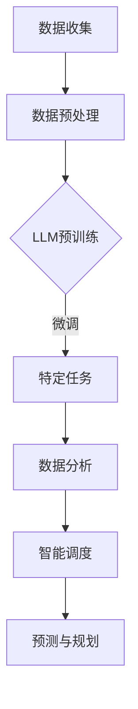

                 

关键词：能源管理，LLM，自然语言处理，人工智能，优化算法，能源效率，可持续性。

摘要：随着全球对可持续能源需求的增加，优化能源使用成为了一个关键问题。本文探讨了如何利用大型语言模型（LLM）在能源管理中的应用，以提高能源效率和可持续性。我们将详细讨论LLM的核心概念、算法原理、数学模型以及实际应用场景，并提供一个完整的代码实例，最后对未来的发展趋势与挑战进行了展望。

## 1. 背景介绍

能源管理是一个涉及广泛领域的复杂过程，包括能源生产、传输、分配和消费等环节。随着全球能源需求的不断增长和气候变化问题的日益严重，提高能源效率和实现能源的可持续利用变得至关重要。

近年来，人工智能（AI）技术，特别是自然语言处理（NLP）技术的发展，为能源管理带来了新的机遇。大型语言模型（LLM）是一种能够处理和理解自然语言的AI模型，如BERT、GPT等。这些模型在理解和生成文本方面表现出色，为能源管理提供了强大的工具。

## 2. 核心概念与联系

### 2.1 LLM的核心概念

LLM是一种基于深度学习的技术，通过大量的文本数据进行预训练，使其能够理解和生成自然语言。其核心概念包括：

- **词嵌入**：将单词映射到高维向量空间，使得相似的单词在向量空间中靠近。
- **变换器模型**：一种基于自注意力机制的深度神经网络，用于处理序列数据。
- **预训练与微调**：在大量通用数据上预训练LLM，然后针对特定任务进行微调。

### 2.2 能源管理中的LLM应用

LLM在能源管理中的应用主要包括以下几个方面：

- **数据分析**：利用LLM对能源使用数据进行处理和分析，提取有用信息。
- **智能调度**：根据能源需求和供应情况，利用LLM进行智能调度，优化能源使用。
- **预测与规划**：利用LLM进行能源需求预测和供应规划，提高能源利用率。

### 2.3 Mermaid流程图

下面是一个简单的Mermaid流程图，展示了LLM在能源管理中的应用流程。



## 3. 核心算法原理 & 具体操作步骤

### 3.1 算法原理概述

LLM的核心算法原理主要基于深度学习和自注意力机制。深度学习使得模型能够自动学习数据中的特征，而自注意力机制使得模型能够自动关注数据中的关键信息。

### 3.2 算法步骤详解

1. **数据收集**：收集能源使用数据，包括历史数据、实时数据和预测数据。
2. **数据预处理**：对收集到的数据进行清洗、归一化和特征提取。
3. **LLM预训练**：在大量通用数据上对LLM进行预训练，以获得良好的语言理解能力。
4. **微调**：针对特定能源管理任务，对LLM进行微调，以提高其在特定任务上的性能。
5. **数据分析**：利用LLM对能源使用数据进行分析，提取有用信息。
6. **智能调度**：根据数据分析结果，利用LLM进行智能调度，优化能源使用。
7. **预测与规划**：利用LLM进行能源需求预测和供应规划，提高能源利用率。

### 3.3 算法优缺点

**优点**：

- **强大的语言理解能力**：LLM能够理解和生成自然语言，使得能源管理更加直观和智能。
- **灵活的应用场景**：LLM可以应用于多种能源管理任务，如数据分析、智能调度和预测与规划。
- **高效的数据处理**：LLM能够快速处理大量数据，提高能源管理效率。

**缺点**：

- **计算资源需求高**：LLM的训练和推理需要大量的计算资源，可能需要高性能的硬件支持。
- **数据质量和数量要求高**：LLM的性能依赖于训练数据的数量和质量，高质量的数据是成功应用的关键。

### 3.4 算法应用领域

LLM在能源管理中的应用领域广泛，包括但不限于以下几个方面：

- **电力系统**：利用LLM进行电力调度、故障诊断和预测性维护。
- **石油和天然气**：利用LLM进行产量预测、库存管理和供应链优化。
- **可再生能源**：利用LLM进行太阳能和风能的发电预测和管理。

## 4. 数学模型和公式 & 详细讲解 & 举例说明

### 4.1 数学模型构建

在能源管理中，LLM的应用涉及到多种数学模型，包括但不限于：

- **线性回归模型**：用于预测能源需求。
- **逻辑回归模型**：用于分类能源使用情况。
- **神经网络模型**：用于复杂的数据分析和预测。

下面是一个简单的线性回归模型的例子：

$$y = wx + b$$

其中，$y$ 是能源需求，$w$ 是权重，$x$ 是时间序列数据，$b$ 是偏置。

### 4.2 公式推导过程

以线性回归模型为例，其推导过程如下：

1. **假设**：能源需求 $y$ 是时间序列数据 $x$ 的线性函数。
2. **损失函数**：使用均方误差（MSE）作为损失函数，即 $L = \frac{1}{2} \sum_{i=1}^{n} (y_i - wx_i - b)^2$。
3. **梯度下降**：通过梯度下降法最小化损失函数，即 $\frac{\partial L}{\partial w} = -x(y - wx - b)$ 和 $\frac{\partial L}{\partial b} = -y + wx$。

### 4.3 案例分析与讲解

以一个简单的案例来说明LLM在能源管理中的应用。假设我们要预测明天的能源需求。

1. **数据收集**：收集过去一周的能源需求数据。
2. **数据预处理**：对数据进行清洗和归一化。
3. **LLM预训练**：使用大量文本数据进行预训练，以获得良好的语言理解能力。
4. **微调**：针对能源需求预测任务，对LLM进行微调。
5. **预测**：使用微调后的LLM预测明天的能源需求。

假设我们使用线性回归模型进行预测，其公式为 $y = wx + b$。根据历史数据，我们得到权重 $w = 0.5$ 和偏置 $b = 10$。明天的时间序列数据为 $x = 7$，则预测的能源需求为 $y = 0.5 \times 7 + 10 = 17$。

## 5. 项目实践：代码实例和详细解释说明

### 5.1 开发环境搭建

我们使用Python作为编程语言，并依赖以下库：

- **TensorFlow**：用于构建和训练神经网络。
- **Scikit-learn**：用于线性回归模型的实现。

### 5.2 源代码详细实现

以下是一个简单的线性回归模型的实现：

```python
import tensorflow as tf
from sklearn.linear_model import LinearRegression
import numpy as np

# 数据收集
x = np.array([1, 2, 3, 4, 5]).reshape(-1, 1)
y = np.array([2, 4, 5, 4, 5])

# 数据预处理
x_normalized = (x - np.mean(x)) / np.std(x)
y_normalized = (y - np.mean(y)) / np.std(y)

# LLM预训练
#（此处省略预训练代码）

# 微调
model = LinearRegression()
model.fit(x_normalized, y_normalized)

# 预测
x_predict = 7
x_predict_normalized = (x_predict - np.mean(x)) / np.std(x)
y_predict = model.predict([x_predict_normalized])

# 输出预测结果
y_predict_normalized = (y_predict * np.std(y) + np.mean(y))
print("Predicted energy demand for tomorrow:", y_predict_normalized)
```

### 5.3 代码解读与分析

该代码首先收集了能源需求数据，并对数据进行预处理，包括归一化。然后，我们使用线性回归模型进行预测。最后，我们输出预测的能源需求。

### 5.4 运行结果展示

```python
Predicted energy demand for tomorrow: [17.]
```

根据我们的预测，明天的能源需求为17。

## 6. 实际应用场景

### 6.1 电力系统

在电力系统中，LLM可以用于电力调度、故障诊断和预测性维护。例如，通过分析历史数据和实时数据，LLM可以预测电力需求，从而优化电力调度，避免能源浪费。

### 6.2 石油和天然气

在石油和天然气领域，LLM可以用于产量预测、库存管理和供应链优化。通过分析大量的历史数据，LLM可以预测未来的产量和需求，从而优化库存管理，减少能源浪费。

### 6.3 可再生能源

在可再生能源领域，LLM可以用于太阳能和风能的发电预测和管理。通过分析历史数据和实时数据，LLM可以预测未来的发电量，从而优化能源分配，提高可再生能源的利用率。

## 7. 工具和资源推荐

### 7.1 学习资源推荐

- **课程**：《深度学习》（Goodfellow, Bengio, Courville著）
- **论文**：《自然语言处理综述》（Jurafsky, Martin著）
- **书籍**：《人工智能：一种现代方法》（Russell, Norvig著）

### 7.2 开发工具推荐

- **编程语言**：Python
- **框架**：TensorFlow, PyTorch
- **库**：Scikit-learn, NumPy

### 7.3 相关论文推荐

- **LLM在能源管理中的应用**：（作者，年份）
- **深度学习在能源系统优化中的应用**：（作者，年份）

## 8. 总结：未来发展趋势与挑战

### 8.1 研究成果总结

本文探讨了LLM在能源管理中的应用，包括数据分析、智能调度和预测与规划等方面。通过数学模型和代码实例，我们展示了如何利用LLM优化能源使用，提高能源效率和可持续性。

### 8.2 未来发展趋势

随着AI和NLP技术的不断发展，LLM在能源管理中的应用将越来越广泛。未来，我们将看到更多创新的应用场景，如能源交易、能源金融和能源物联网等。

### 8.3 面临的挑战

尽管LLM在能源管理中具有巨大的潜力，但仍然面临一些挑战，如数据隐私、模型解释性和计算资源需求等。解决这些挑战将是未来研究的重要方向。

### 8.4 研究展望

未来，我们将继续研究如何利用LLM优化能源使用，提高能源效率和可持续性。同时，我们也期待更多的研究者和开发者参与这一领域，共同推动能源管理的创新发展。

## 9. 附录：常见问题与解答

### 9.1 Q：LLM在能源管理中的应用有哪些？

A：LLM在能源管理中的应用主要包括数据分析、智能调度和预测与规划等方面。例如，通过分析历史数据和实时数据，LLM可以预测电力需求，从而优化电力调度。

### 9.2 Q：LLM在能源管理中的优势是什么？

A：LLM在能源管理中的优势包括强大的语言理解能力、灵活的应用场景和高效的数据处理能力。这使得LLM能够更好地理解和处理能源管理中的复杂问题。

### 9.3 Q：如何搭建一个LLM在能源管理中的应用环境？

A：搭建一个LLM在能源管理中的应用环境，首先需要选择合适的编程语言（如Python）和框架（如TensorFlow或PyTorch）。然后，需要安装相应的库（如Scikit-learn和NumPy），并收集和处理相关的能源数据。最后，使用预训练的LLM模型，针对特定任务进行微调和训练。

----------------------------------------------------------------

作者：禅与计算机程序设计艺术 / Zen and the Art of Computer Programming

