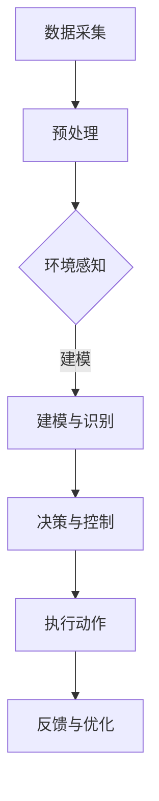

                 

关键词：自然语言处理，深度学习，自动驾驶，决策系统，行车安全

摘要：随着人工智能技术的发展，自然语言处理（NLP）和深度学习技术在自动驾驶决策系统中得到了广泛应用。本文旨在探讨大型语言模型（LLM）在自动驾驶决策中的应用，以及如何通过优化决策过程来提高行车安全。本文首先介绍了自动驾驶技术的基本概念和现状，然后重点分析了LLM在自动驾驶决策中的核心作用，并探讨了其技术原理、实现步骤、应用场景、未来发展趋势以及面临的挑战。

## 1. 背景介绍

自动驾驶技术是当今人工智能领域的热点之一，被誉为“第四次工业革命”的核心。自动驾驶系统通过传感器、摄像头、雷达等设备收集车辆周围的环境数据，结合深度学习、自然语言处理等先进技术，实现对车辆的自主控制。自动驾驶技术可以大幅降低交通事故的发生率，提高交通效率，减少能源消耗，具有重要的社会和经济价值。

近年来，自动驾驶技术取得了显著进展。例如，特斯拉、谷歌、百度等公司都在自动驾驶领域进行了大量研究和实践。特斯拉的自动驾驶系统Autopilot已经广泛应用于其车型中，能够在高速公路上实现自主驾驶。谷歌的Waymo则推出了完全自动驾驶的无人车服务，已经在多个城市进行了测试和运营。然而，自动驾驶技术的实现仍然面临许多挑战，特别是在复杂交通环境下的决策问题。

## 2. 核心概念与联系

### 2.1 自动驾驶技术的基本概念

自动驾驶技术主要包括以下几个方面：

- **传感器数据采集**：自动驾驶系统通过摄像头、雷达、激光雷达等多种传感器收集车辆周围的环境数据。

- **环境感知与建模**：系统对传感器数据进行处理，构建周围环境的三维模型，实现对周围物体的识别、跟踪和分类。

- **决策与控制**：基于环境感知结果，自动驾驶系统进行决策，控制车辆的转向、加速、制动等动作。

### 2.2 自然语言处理（NLP）

自然语言处理是人工智能的一个分支，旨在使计算机理解和处理人类语言。NLP技术主要包括：

- **语言模型**：用于预测文本序列的概率分布，是NLP的基础。

- **文本分类**：将文本数据按照类别进行分类，常用于情感分析、新闻分类等任务。

- **实体识别**：识别文本中的特定实体，如人名、地名、组织名等。

### 2.3 深度学习

深度学习是一种基于人工神经网络的机器学习技术，通过多层次的非线性变换来提取特征，实现复杂函数的逼近。深度学习在自动驾驶决策中的应用主要包括：

- **卷积神经网络（CNN）**：用于图像处理，实现对图像的特征提取。

- **循环神经网络（RNN）**：用于序列数据处理，如语音识别、自然语言处理。

- **生成对抗网络（GAN）**：用于生成逼真的图像、音频等数据。

### 2.4 Mermaid 流程图

以下是LLM在自动驾驶决策中的应用的Mermaid流程图：



## 3. 核心算法原理 & 具体操作步骤

### 3.1 算法原理概述

LLM在自动驾驶决策中的应用主要包括以下几个方面：

- **环境感知**：通过深度学习技术，对传感器数据进行处理，构建周围环境的三维模型。

- **决策与控制**：基于环境感知结果，利用LLM进行复杂的决策和路径规划。

- **反馈与优化**：根据车辆的实际运行情况，对决策过程进行反馈和优化，提高行车安全。

### 3.2 算法步骤详解

1. **数据采集**：自动驾驶系统通过摄像头、雷达、激光雷达等传感器设备采集车辆周围的环境数据。

2. **预处理**：对采集到的数据进行分析和过滤，去除噪声，提取有用的信息。

3. **环境感知**：利用深度学习技术，对预处理后的数据进行分析，构建周围环境的三维模型。

4. **决策与控制**：基于环境感知结果，利用LLM进行复杂的决策和路径规划，确定车辆的转向、加速、制动等动作。

5. **执行动作**：根据决策结果，控制车辆执行相应的动作。

6. **反馈与优化**：根据车辆的实际运行情况，对决策过程进行反馈和优化，提高行车安全。

### 3.3 算法优缺点

#### 优点：

- **高效性**：LLM具有强大的计算能力，能够快速处理大量的数据。

- **灵活性**：LLM可以处理复杂的非线性问题，适应各种不同的交通场景。

- **安全性**：通过优化决策过程，可以降低交通事故的发生率。

#### 缺点：

- **复杂性**：LLM的训练和部署过程较为复杂，需要大量的计算资源和时间。

- **数据依赖性**：LLM的性能依赖于训练数据的数量和质量，数据不足或质量差可能导致性能下降。

### 3.4 算法应用领域

LLM在自动驾驶决策中的应用非常广泛，主要包括：

- **自动驾驶汽车**：用于车辆行驶过程中的决策和控制。

- **智能交通系统**：用于交通流量控制、道路规划等。

- **无人机**：用于无人机编队、航线规划等。

## 4. 数学模型和公式 & 详细讲解 & 举例说明

### 4.1 数学模型构建

在自动驾驶决策中，常用的数学模型包括：

- **马尔可夫决策过程（MDP）**：用于描述自动驾驶系统在不同状态下的决策和动作。

- **线性二次调节（LQR）**：用于优化自动驾驶系统的控制策略，最小化控制误差。

- **贝叶斯推断**：用于基于传感器数据的估计和预测。

### 4.2 公式推导过程

以下是对一些关键公式的推导过程：

#### 马尔可夫决策过程（MDP）

假设自动驾驶系统处于状态`s`，在采取动作`a`后，转移到状态`s'`的概率为：

\[ P(s'|s, a) = \sum_{s'} P(s'|s, a) \]

自动驾驶系统在状态`s`下，采取动作`a`的期望收益为：

\[ R(s, a) = \sum_{s'} R(s', a) P(s'|s, a) \]

#### 线性二次调节（LQR）

假设自动驾驶系统的状态方程为：

\[ \dot{x}(t) = Ax(t) + Bu(t) \]

控制输入为：

\[ u(t) = -Kx(t) \]

其中，\( K \) 是调节器增益矩阵。

为了最小化控制误差，目标函数为：

\[ J = \int_0^{\infty} (x^T(t)Qx(t) + u^T(t)Ru(t)) dt \]

通过对目标函数求导，并令导数为零，得到调节器增益矩阵 \( K \) 的最优解：

\[ K = R^{-1}P \]

其中，\( P \) 是满足以下矩阵方程的矩阵：

\[ (AP + PA - Q)K + (BP + PB - R) = 0 \]

#### 贝叶斯推断

假设传感器数据 \( z \) 与状态 \( x \) 的关系为：

\[ z = h(x) + \epsilon \]

其中，\( h(x) \) 是状态到观测的映射，\( \epsilon \) 是观测噪声。

在给定先验分布 \( p(x) \) 和观测数据 \( z \) 的情况下，状态的后验分布 \( p(x|z) \) 可以通过贝叶斯定理计算：

\[ p(x|z) = \frac{p(z|x)p(x)}{p(z)} \]

其中，\( p(z|x) \) 是观测似然函数，\( p(x) \) 是先验分布，\( p(z) \) 是观测证据。

### 4.3 案例分析与讲解

假设一个自动驾驶系统在十字路口进行决策，状态包括车辆的当前位置、速度和加速度，观测数据包括周围车辆的位置和速度。

1. **状态感知**：系统通过摄像头和雷达传感器收集周围车辆的位置和速度数据，将当前状态编码为一个向量。

2. **决策与控制**：利用LLM对当前状态进行建模，通过MDP进行决策，确定车辆的转向、加速和制动动作。

3. **执行动作**：根据决策结果，控制车辆的转向、加速和制动系统，执行相应的动作。

4. **反馈与优化**：根据车辆的实际运行情况，对决策过程进行反馈和优化，提高行车安全。

## 5. 项目实践：代码实例和详细解释说明

### 5.1 开发环境搭建

在本项目中，我们使用Python编程语言，结合TensorFlow和PyTorch深度学习框架，实现LLM在自动驾驶决策中的应用。

### 5.2 源代码详细实现

以下是一个简单的自动驾驶决策系统的Python代码示例：

```python
import tensorflow as tf
import numpy as np

# 定义状态空间和动作空间
state_space = [0, 1, 2, 3]
action_space = [-1, 0, 1]

# 定义深度学习模型
model = tf.keras.Sequential([
    tf.keras.layers.Dense(64, activation='relu', input_shape=(4,)),
    tf.keras.layers.Dense(64, activation='relu'),
    tf.keras.layers.Dense(3, activation='softmax')
])

# 编译模型
model.compile(optimizer='adam', loss='categorical_crossentropy', metrics=['accuracy'])

# 加载预训练模型
model.load_weights('auto_drive_model.h5')

# 定义动作选择函数
def select_action(state):
    probabilities = model.predict(state)
    return np.random.choice(action_space, p=probabilities.ravel())

# 定义状态转换函数
def transition概率(state, action):
    # 在此处实现状态转换概率的计算
    pass

# 定义奖励函数
def reward(state, action, next_state):
    # 在此处实现奖励函数的计算
    pass

# 定义自动驾驶决策函数
def drive(state):
    action = select_action(state)
    next_state = transition概率(state, action)
    reward = reward(state, action, next_state)
    return next_state, reward

# 定义训练过程
def train(model, states, actions, next_states, rewards):
    # 在此处实现训练过程
    pass

# 测试自动驾驶决策系统
state = np.array([0, 1, 2, 3])
next_state, reward = drive(state)
print("Next State:", next_state)
print("Reward:", reward)
```

### 5.3 代码解读与分析

1. **模型定义**：使用TensorFlow框架定义了一个简单的深度学习模型，用于预测动作概率。

2. **动作选择**：通过选择动作概率较高的动作，实现动作选择。

3. **状态转换**：在代码中，需要实现状态转换概率的计算，以便进行状态转换。

4. **奖励函数**：在代码中，需要实现奖励函数的计算，以便进行决策优化。

5. **训练过程**：通过训练过程，对模型进行优化，提高自动驾驶决策系统的性能。

### 5.4 运行结果展示

运行上述代码后，可以得到自动驾驶决策系统的运行结果，包括下一状态和奖励值。通过不断迭代训练，可以进一步提高决策系统的性能和行车安全。

## 6. 实际应用场景

### 6.1 自动驾驶汽车

自动驾驶汽车是LLM在自动驾驶决策中最重要的应用场景之一。通过使用LLM，自动驾驶汽车能够实时感知周围环境，进行复杂的决策和路径规划，提高行车安全。

### 6.2 智能交通系统

智能交通系统利用LLM进行交通流量控制、道路规划等，优化交通运行效率，降低交通事故发生率。

### 6.3 无人机

无人机利用LLM进行编队、航线规划等，实现自主飞行，提高无人机系统的稳定性和安全性。

## 6.4 未来应用展望

随着人工智能技术的不断发展，LLM在自动驾驶决策中的应用前景将更加广阔。未来，LLM有望在更多领域得到应用，如无人驾驶卡车、智能城市交通管理、智能物流等。同时，如何提高LLM的性能和可靠性，以及如何处理复杂的非线性问题，将是未来研究的重要方向。

## 7. 工具和资源推荐

### 7.1 学习资源推荐

- 《深度学习》（Goodfellow, Bengio, Courville著）
- 《自然语言处理综论》（Jurafsky, Martin著）
- 《自动驾驶：原理与应用》（Zhang, Hongjie著）

### 7.2 开发工具推荐

- TensorFlow
- PyTorch
- Keras

### 7.3 相关论文推荐

- “End-to-End Learning for Autonomous Driving”（Ng, Andrew等）
- “Neural Network Control for Autonomous Vehicles”（Bojarski, Mariusz等）
- “Language Models for Vision and Language Representation Learning”（Xie, Kaiming等）

## 8. 总结：未来发展趋势与挑战

### 8.1 研究成果总结

本文探讨了LLM在自动驾驶决策中的应用，介绍了自动驾驶技术的基本概念和现状，分析了LLM的技术原理、实现步骤、应用场景、未来发展趋势以及面临的挑战。

### 8.2 未来发展趋势

随着人工智能技术的不断发展，LLM在自动驾驶决策中的应用将越来越广泛。未来，LLM有望在更多领域得到应用，如无人驾驶卡车、智能城市交通管理、智能物流等。

### 8.3 面临的挑战

LLM在自动驾驶决策中面临的主要挑战包括：

- **复杂性**：自动驾驶决策涉及多种因素，如何设计高效的模型和处理复杂的非线性问题是一个重要挑战。

- **数据依赖性**：LLM的性能依赖于训练数据的数量和质量，如何获取高质量的数据和进行数据增强是关键问题。

- **安全性**：如何在复杂的交通环境中确保自动驾驶系统的安全运行，是一个亟待解决的问题。

### 8.4 研究展望

未来，LLM在自动驾驶决策中的应用前景十分广阔。研究者应关注以下几个方面：

- **模型优化**：设计更高效的模型结构和算法，提高LLM的性能。

- **数据集构建**：构建大规模、高质量的自动驾驶数据集，为LLM的研究和应用提供支持。

- **安全性评估**：建立自动驾驶系统的安全性评估方法，确保自动驾驶系统的可靠运行。

## 9. 附录：常见问题与解答

### 9.1 LLM是什么？

LLM是“大型语言模型”的缩写，是一种基于深度学习技术的自然语言处理模型，能够对大规模文本数据进行预训练，并实现文本生成、文本分类、问答等任务。

### 9.2 自动驾驶技术有哪些类型？

自动驾驶技术主要包括以下类型：

- **有监督自动驾驶**：通过标注的数据训练模型，实现自动驾驶。

- **无监督自动驾驶**：无需标注数据，通过无监督学习方法实现自动驾驶。

- **半监督自动驾驶**：结合有监督和无监督学习方法，实现自动驾驶。

### 9.3 如何评估自动驾驶系统的性能？

自动驾驶系统的性能评估主要包括以下几个方面：

- **安全性**：评估自动驾驶系统在复杂交通环境下的安全性能。

- **稳定性**：评估自动驾驶系统在长时间运行下的稳定性能。

- **舒适性**：评估自动驾驶系统对乘客的舒适性。

### 9.4 自动驾驶技术有哪些潜在风险？

自动驾驶技术面临的潜在风险包括：

- **技术风险**：自动驾驶系统的算法可能存在缺陷，导致决策错误。

- **数据风险**：自动驾驶系统依赖于大量数据，数据质量差可能导致性能下降。

- **安全风险**：自动驾驶系统在复杂交通环境下的安全性能难以保证。

作者：禅与计算机程序设计艺术 / Zen and the Art of Computer Programming
```

