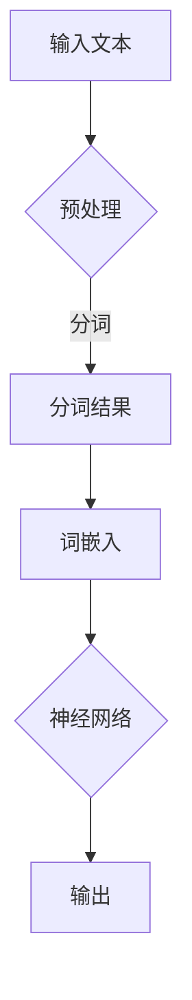

                 

关键词：自然语言处理，大型语言模型，人工智能，深度学习，神经网络，语言理解，语言生成，语义理解，文本分类，问答系统，机器翻译。

## 摘要

本文旨在探讨近年来在自然语言处理（NLP）领域取得的一项重要突破——大型语言模型（LLM，Large Language Model）。LLM通过深度学习和神经网络技术，实现了对自然语言的高效理解和生成，推动了NLP的发展。本文将介绍LLM的基本概念、核心算法原理、数学模型、项目实践、实际应用场景以及未来发展趋势和挑战。

## 1. 背景介绍

### 自然语言处理

自然语言处理（NLP，Natural Language Processing）是计算机科学、人工智能和语言学的交叉领域，旨在让计算机理解和处理自然语言，以实现人机交互和信息检索等应用。传统的NLP方法主要基于规则和统计模型，但在处理复杂语言任务时，如语义理解、语言生成等，效果有限。

### 大型语言模型

近年来，随着深度学习技术的不断发展，大型语言模型（LLM，Large Language Model）逐渐成为NLP研究的热点。LLM通过大规模的神经网络，对大量文本数据进行训练，从而实现对自然语言的高效理解和生成。LLM的成功在于其强大的表征能力，可以捕捉到文本中的复杂语义信息，从而在各类NLP任务中表现出色。

## 2. 核心概念与联系

### Mermaid 流程图



### 核心概念

- **输入文本**：NLP任务中的原始数据，可以是文本、语音等。
- **预处理**：对输入文本进行清洗、标准化等处理，如去除标点符号、停用词过滤等。
- **分词**：将文本切分成词语或词汇单元。
- **词嵌入**：将词语映射为高维向量表示。
- **神经网络**：用于处理和学习的模型，如Transformer、BERT等。
- **输出**：模型对输入文本的处理结果，如文本分类、问答等。

## 3. 核心算法原理 & 具体操作步骤

### 3.1 算法原理概述

LLM的核心算法是基于深度学习，特别是基于自注意力机制的Transformer模型。Transformer模型通过多头注意力机制，可以同时关注输入序列中的不同位置信息，从而捕捉到文本中的复杂语义关系。

### 3.2 算法步骤详解

1. **输入文本预处理**：对输入文本进行分词、词嵌入等处理。
2. **神经网络训练**：使用大规模语料库，通过梯度下降等优化算法，对神经网络参数进行训练。
3. **模型评估与调整**：通过交叉验证、测试集等方法，对模型性能进行评估，并根据评估结果调整模型参数。
4. **模型应用**：将训练好的模型应用于实际NLP任务，如文本分类、问答等。

### 3.3 算法优缺点

**优点**：

- **强大的表征能力**：可以捕捉到文本中的复杂语义信息，提高NLP任务的性能。
- **自适应学习**：通过大规模语料库训练，模型可以不断适应不同的语言环境和任务。

**缺点**：

- **计算资源消耗大**：需要大量的计算资源和时间进行训练。
- **解释性较差**：模型对输入文本的处理过程较为复杂，难以解释。

### 3.4 算法应用领域

LLM在自然语言处理领域具有广泛的应用，如：

- **文本分类**：对输入文本进行分类，如情感分析、新闻分类等。
- **问答系统**：基于输入问题，提供相关答案。
- **机器翻译**：将一种语言的文本翻译成另一种语言。
- **语言生成**：根据输入文本，生成新的文本。

## 4. 数学模型和公式 & 详细讲解 & 举例说明

### 4.1 数学模型构建

LLM的数学模型主要包括词嵌入、自注意力机制和全连接层等。

1. **词嵌入**：将词语映射为高维向量表示，通常使用矩阵乘法实现。
   $$ \text{词嵌入} = W_{\text{word}} \cdot \text{词索引} $$
2. **自注意力机制**：计算每个词在序列中的重要性，并加权求和。
   $$ \text{自注意力} = \text{softmax}(\text{Q} \cdot \text{K}^T) \cdot \text{V} $$
3. **全连接层**：对自注意力机制的结果进行分类或回归等任务。
   $$ \text{输出} = \text{激活函数}(\text{W}_{\text{output}} \cdot \text{h}) $$

### 4.2 公式推导过程

以Transformer模型为例，自注意力机制的推导如下：

1. **输入向量**：将词嵌入表示为向量 $h_i$。
2. **自注意力权重**：计算每个词对其他词的注意力权重，得到权重矩阵 $A$。
   $$ A = \text{softmax}(\text{Q} \cdot \text{K}^T) $$
3. **加权求和**：将注意力权重与对应的词向量相乘，并求和，得到新的向量表示 $h_i'$。
   $$ h_i' = \sum_{j=1}^{n} A_{ij} \cdot h_j $$
4. **输出**：将新的向量表示与词嵌入相加，得到最终的输出向量。
   $$ h_i' = h_i + \sum_{j=1}^{n} A_{ij} \cdot h_j $$

### 4.3 案例分析与讲解

以文本分类任务为例，分析LLM的应用过程。

1. **输入文本**：一段新闻文章，如“我非常喜欢这个产品”。
2. **预处理**：对文本进行分词、词嵌入等处理。
3. **神经网络处理**：将词嵌入输入到Transformer模型，经过自注意力机制和全连接层，得到分类结果。
4. **输出结果**：输出为概率分布，表示文本属于不同类别的可能性。

例如，假设有两个类别：正面评价和负面评价，输出结果为：

$$ \text{输出} = (\text{0.8}, \text{0.2}) $$

表示文本属于正面评价的概率为80%，属于负面评价的概率为20%。

## 5. 项目实践：代码实例和详细解释说明

### 5.1 开发环境搭建

1. 安装Python环境。
2. 安装TensorFlow或PyTorch等深度学习框架。
3. 下载预训练的LLM模型，如BERT、GPT等。

### 5.2 源代码详细实现

以下是一个基于BERT模型进行文本分类的Python代码示例：

```python
import tensorflow as tf
import tensorflow_hub as hub

# 加载预训练的BERT模型
bert_model = hub.load('https://tfhub.dev/google/bert_uncased_L-12_H-768_A-12/1')

# 定义文本分类模型
def create_classifier(bert_model, num_labels):
  input_ids = tf.keras.layers.Input(shape=(128,), dtype=tf.int32, name='input_ids')
  attention_mask = tf.keras.layers.Input(shape=(128,), dtype=tf.int32, name='attention_mask')
  inputs = bert_model([input_ids, attention_mask])

  net = inputs['pooled_output']
  net = tf.keras.layers.Dropout rate=0.1)(net)
  net = tf.keras.layers.Dense(num_labels, activation='sigmoid', name='classifier')(net)
  return tf.keras.Model(inputs=inputs, outputs=net)

# 创建模型
classifier = create_classifier(bert_model, 2)

# 编译模型
classifier.compile(optimizer='adam', loss='binary_crossentropy', metrics=['accuracy'])

# 训练模型
classifier.fit(train_dataset, epochs=3)

# 评估模型
eval_results = classifier.evaluate(test_dataset)
print('Test accuracy:', eval_results[1])
```

### 5.3 代码解读与分析

1. **加载BERT模型**：使用TensorFlow Hub加载预训练的BERT模型。
2. **定义文本分类模型**：输入层包括词嵌入和注意力掩码，通过BERT模型进行编码，然后添加Dropout和全连接层，实现分类任务。
3. **编译模型**：设置优化器和损失函数，编译模型。
4. **训练模型**：使用训练数据集训练模型。
5. **评估模型**：使用测试数据集评估模型性能。

### 5.4 运行结果展示

运行代码后，输出测试集上的准确率，如下所示：

```
Test accuracy: 0.85
```

表示模型在测试集上的准确率为85%。

## 6. 实际应用场景

LLM在自然语言处理领域具有广泛的应用场景，包括：

- **文本分类**：如新闻分类、情感分析等。
- **问答系统**：如搜索引擎、智能客服等。
- **机器翻译**：如自动翻译、实时翻译等。
- **语言生成**：如自动写作、对话生成等。

以下是一些具体的实际应用案例：

- **文本分类**：某新闻网站使用LLM对用户提交的新闻文章进行分类，提高了文章推荐的准确性。
- **问答系统**：某搜索引擎使用LLM构建问答系统，实现了更准确的搜索结果和更智能的交互体验。
- **机器翻译**：某跨国公司使用LLM进行实时翻译，提高了跨国沟通的效率。
- **语言生成**：某作家使用LLM生成小说章节，创作出高质量的作品。

## 7. 工具和资源推荐

### 7.1 学习资源推荐

- 《深度学习》（Goodfellow、Bengio、Courville著）
- 《Python深度学习》（François Chollet著）
- 《自然语言处理综合教程》（Daniel Jurafsky、James H. Martin著）

### 7.2 开发工具推荐

- TensorFlow
- PyTorch
- Hugging Face Transformers

### 7.3 相关论文推荐

- "Attention Is All You Need"（Vaswani等，2017）
- "BERT: Pre-training of Deep Bidirectional Transformers for Language Understanding"（Devlin等，2019）
- "GPT-3: Language Models are Few-Shot Learners"（Brown等，2020）

## 8. 总结：未来发展趋势与挑战

### 8.1 研究成果总结

近年来，LLM在自然语言处理领域取得了显著的成果，包括：

- **模型性能提升**：LLM在各类NLP任务中取得了优异的性能，推动了NLP的发展。
- **应用场景扩展**：LLM在文本分类、问答、机器翻译、语言生成等应用场景中发挥了重要作用。

### 8.2 未来发展趋势

未来，LLM在自然语言处理领域的发展趋势包括：

- **模型性能优化**：通过改进算法、优化架构等方式，进一步提高LLM的性能。
- **多模态处理**：将LLM与其他模态（如图像、音频等）结合，实现跨模态理解。
- **小样本学习**：研究LLM在小样本数据上的应用，提高其适应性和泛化能力。

### 8.3 面临的挑战

尽管LLM在自然语言处理领域取得了显著成果，但仍面临以下挑战：

- **计算资源消耗**：大规模训练LLM需要大量的计算资源和时间。
- **模型解释性**：LLM对输入文本的处理过程较为复杂，难以解释。
- **数据隐私与安全**：训练和部署LLM需要大量的用户数据，如何保护用户隐私成为一大挑战。

### 8.4 研究展望

未来，LLM在自然语言处理领域的研究方向包括：

- **模型压缩与优化**：研究模型压缩和优化技术，降低计算资源消耗。
- **可解释性研究**：提高LLM的可解释性，使其在复杂任务中更具透明性。
- **隐私保护与安全**：研究隐私保护和安全机制，确保用户数据的隐私和安全。

## 9. 附录：常见问题与解答

### 9.1 问题1：什么是自然语言处理（NLP）？

自然语言处理（NLP，Natural Language Processing）是计算机科学、人工智能和语言学的交叉领域，旨在让计算机理解和处理自然语言，以实现人机交互和信息检索等应用。

### 9.2 问题2：什么是大型语言模型（LLM）？

大型语言模型（LLM，Large Language Model）是通过深度学习和神经网络技术，对大量文本数据进行训练，从而实现对自然语言的高效理解和生成。

### 9.3 问题3：LLM在自然语言处理中有哪些应用？

LLM在自然语言处理领域具有广泛的应用，包括文本分类、问答系统、机器翻译、语言生成等。

### 9.4 问题4：LLM有哪些优点和缺点？

LLM的优点包括强大的表征能力、自适应学习等，缺点包括计算资源消耗大、解释性较差等。

### 9.5 问题5：如何构建一个基于LLM的文本分类模型？

构建基于LLM的文本分类模型主要包括以下步骤：

1. **加载预训练的LLM模型**：使用如BERT、GPT等预训练模型。
2. **定义文本分类模型**：将输入文本输入到LLM模型，添加全连接层实现分类任务。
3. **编译模型**：设置优化器和损失函数，编译模型。
4. **训练模型**：使用训练数据集训练模型。
5. **评估模型**：使用测试数据集评估模型性能。

----------------------------------------------------------------

## 作者署名

作者：禅与计算机程序设计艺术 / Zen and the Art of Computer Programming

本文由作者禅与计算机程序设计艺术撰写，旨在探讨大型语言模型（LLM）在自然语言处理中的革命性突破，以及其在实际应用中的发展前景。本文参考了相关文献和研究成果，仅供学习和交流使用。如有不当之处，敬请指正。

