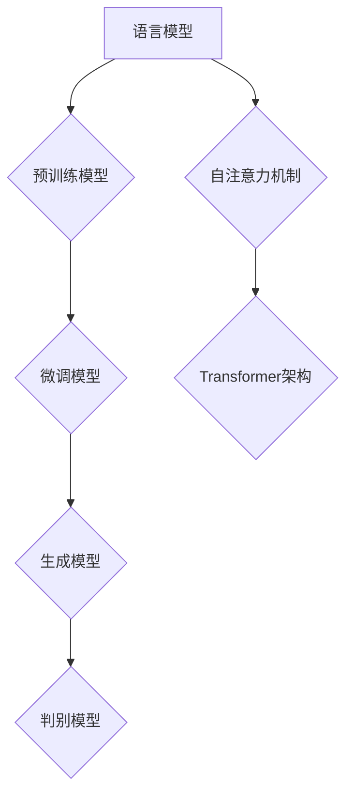

                 

关键词：自然语言处理、大型语言模型、预训练模型、生成模型、文本生成、文本分类、问答系统、对话系统、语义理解

> 摘要：随着深度学习技术的发展，大型语言模型（LLM）在自然语言处理（NLP）领域取得了显著的进展。本文将深入探讨LLM的基本原理、核心算法、数学模型以及在文本生成、文本分类、问答系统和对话系统等实际应用场景中的表现，分析其优势与挑战，并展望未来发展趋势。

## 1. 背景介绍

自然语言处理（NLP）作为人工智能的重要分支，旨在使计算机能够理解、解释和生成人类语言。然而，传统的NLP方法通常依赖于规则和统计模型，其性能受到诸多限制。随着深度学习技术的崛起，特别是卷积神经网络（CNN）和递归神经网络（RNN）在图像和语音处理领域的成功应用，研究人员开始探索将深度学习应用于自然语言处理。

2018年，谷歌提出了BERT（Bidirectional Encoder Representations from Transformers），标志着大型语言模型（LLM）在NLP领域的诞生。BERT利用预训练和微调策略，显著提升了文本分类、问答系统和对话系统等任务的表现。此后，GPT（Generative Pre-trained Transformer）、T5（Text-To-Text Transfer Transformer）等一系列大型语言模型相继推出，进一步推动了NLP的发展。

## 2. 核心概念与联系

### 2.1 语言模型

语言模型（Language Model）是NLP的基础，其目的是预测下一个单词的概率分布。在深度学习中，语言模型通常使用神经网络来建模，如RNN、LSTM和BERT等。BERT模型采用Transformer架构，具有自注意力机制，能够同时处理长距离依赖问题，从而在多项NLP任务中取得领先表现。

### 2.2 预训练与微调

预训练（Pre-training）是指在大量未标注数据上训练模型，然后在小规模标注数据上进行微调（Fine-tuning）。这种策略使得模型能够在特定任务上获得良好的表现。例如，BERT模型首先在英语维基百科等大规模文本数据集上预训练，然后在特定任务上（如问答、文本分类等）进行微调。

### 2.3 生成模型与判别模型

生成模型（Generative Model）旨在生成新的文本数据，如GPT模型；而判别模型（Discriminative Model）则用于分类或预测任务。在NLP中，生成模型和判别模型通常结合使用，以实现文本生成和文本分类等任务。

### 2.4 Mermaid流程图



## 3. 核心算法原理 & 具体操作步骤

### 3.1 算法原理概述

大型语言模型（LLM）的核心算法基于Transformer架构，其主要思想是将输入的序列（如单词或字符）映射为向量表示，然后通过自注意力机制（Self-Attention）计算序列中的依赖关系。在此基础上，LLM进一步通过多层神经网络对输入序列进行编码和解码，以实现文本生成、文本分类等任务。

### 3.2 算法步骤详解

1. **输入序列处理**：将输入的文本序列（如单词或字符）转化为数字序列，通常使用词嵌入（Word Embedding）技术。
2. **编码**：使用多层Transformer编码器对输入序列进行编码，得到序列的上下文表示。
3. **自注意力机制**：通过自注意力机制计算序列中的依赖关系，从而捕捉长距离依赖信息。
4. **解码**：使用多层Transformer解码器生成输出序列，通常通过softmax函数生成概率分布，然后从概率分布中采样下一个单词或字符。
5. **微调**：在特定任务上对模型进行微调，以优化模型在目标任务上的表现。

### 3.3 算法优缺点

**优点：**
- **强大的语义表示能力**：通过预训练和微调，LLM能够学习到丰富的语义信息，从而在多项NLP任务中取得优异表现。
- **良好的泛化能力**：LLM在多个任务上表现优异，具有较好的泛化能力。
- **高效的自注意力机制**：Transformer架构具有高效的自注意力机制，能够处理长序列数据。

**缺点：**
- **计算资源需求大**：LLM通常需要大量的计算资源和存储空间。
- **解释性差**：由于深度神经网络的结构，LLM在解释其预测结果方面存在困难。

### 3.4 算法应用领域

LLM在自然语言处理领域具有广泛的应用，包括但不限于以下方面：
- **文本生成**：如文章写作、诗歌创作、对话系统等。
- **文本分类**：如新闻分类、情感分析、垃圾邮件过滤等。
- **问答系统**：如搜索引擎、智能客服等。
- **对话系统**：如聊天机器人、虚拟助手等。

## 4. 数学模型和公式 & 详细讲解 & 举例说明

### 4.1 数学模型构建

LLM的数学模型主要基于Transformer架构，包括编码器（Encoder）和解码器（Decoder）。其中，编码器用于将输入序列编码为上下文表示，解码器用于生成输出序列。具体来说，编码器和解码器由多个自注意力层（Self-Attention Layer）和前馈网络（Feedforward Network）组成。

### 4.2 公式推导过程

假设输入序列为 \(x_1, x_2, ..., x_T\)，其中 \(x_i\) 表示第 \(i\) 个单词或字符。编码器和解码器的输入和输出分别表示为 \(h_e\) 和 \(h_d\)。

1. **词嵌入**：将输入序列转化为嵌入向量 \(e_i\)。

   $$ e_i = W_e x_i $$

2. **编码器**：

   - **自注意力层**：

     $$ 
     \text{Attention}(Q, K, V) = \text{softmax}\left(\frac{QK^T}{\sqrt{d_k}}\right)V 
     $$

   - **前馈网络**：

     $$ 
     h_e^{(l)} = \text{ReLU}\left(W_2 \cdot \text{Attention}(Q, K, V) + W_3\right) 
     $$

3. **解码器**：

   - **自注意力层**：

     $$ 
     \text{Multi-Head Attention}(Q, K, V) = \text{softmax}\left(\frac{QK^T}{\sqrt{d_k}}\right)V 
     $$

   - **前馈网络**：

     $$ 
     h_d^{(l)} = \text{ReLU}\left(W_2 \cdot \text{Multi-Head Attention}(Q, K, V) + W_3\right) 
     $$

4. **输出层**：

   $$ 
   p_i = \text{softmax}\left(W \cdot h_d^{(L)}\right) 
   $$

其中，\(W_e\)、\(W_2\)、\(W_3\)、\(W\) 分别为词嵌入权重、自注意力权重、前馈网络权重和输出权重。

### 4.3 案例分析与讲解

以文章生成任务为例，假设输入序列为：“人工智能是未来发展的趋势”，模型的目标是生成接下来的内容。首先，将输入序列转化为词嵌入向量，然后通过编码器和解码器生成输出序列。具体步骤如下：

1. **词嵌入**：将输入序列转化为嵌入向量。

   $$ 
   e_1 = W_e \text{"人工智能"} \\
   e_2 = W_e \text{"是"} \\
   e_3 = W_e \text{"未来"} \\
   e_4 = W_e \text{"发展的"} \\
   e_5 = W_e \text{"趋势"} 
   $$

2. **编码器**：

   - **自注意力层**：计算输入序列的上下文表示。

     $$ 
     \text{Attention}(Q, K, V) = \text{softmax}\left(\frac{QK^T}{\sqrt{d_k}}\right)V 
     $$

   - **前馈网络**：对上下文表示进行加工。

     $$ 
     h_e^{(1)} = \text{ReLU}\left(W_2 \cdot \text{Attention}(Q, K, V) + W_3\right) 
     $$

3. **解码器**：

   - **自注意力层**：计算输出序列的上下文表示。

     $$ 
     \text{Multi-Head Attention}(Q, K, V) = \text{softmax}\left(\frac{QK^T}{\sqrt{d_k}}\right)V 
     $$

   - **前馈网络**：对上下文表示进行加工。

     $$ 
     h_d^{(1)} = \text{ReLU}\left(W_2 \cdot \text{Multi-Head Attention}(Q, K, V) + W_3\right) 
     $$

4. **输出层**：根据概率分布生成输出序列。

   $$ 
   p_i = \text{softmax}\left(W \cdot h_d^{(1)}\right) 
   $$

通过上述步骤，模型生成了新的文本序列，如：“人工智能将在未来推动社会进步”。

## 5. 项目实践：代码实例和详细解释说明

### 5.1 开发环境搭建

搭建一个基于LLM的文本生成项目，需要安装以下依赖：

```bash
pip install torch transformers
```

### 5.2 源代码详细实现

以下是一个简单的文本生成项目示例：

```python
import torch
from transformers import BertTokenizer, BertModel

# 初始化模型和分词器
tokenizer = BertTokenizer.from_pretrained('bert-base-chinese')
model = BertModel.from_pretrained('bert-base-chinese')

# 输入文本
input_text = "人工智能是未来发展的趋势"

# 转换为词嵌入
input_ids = tokenizer.encode(input_text, return_tensors='pt')

# 加载模型并生成文本
model.eval()
with torch.no_grad():
    outputs = model(input_ids)

# 提取编码器输出
encoded_text = outputs.last_hidden_state[:, 0, :]

# 生成文本
output_ids = model.generate(encoded_text, max_length=20, num_return_sequences=1)
output_text = tokenizer.decode(output_ids[0], skip_special_tokens=True)

print(output_text)
```

### 5.3 代码解读与分析

上述代码首先初始化了BERT模型和分词器，然后输入一段文本。接着，将文本转换为词嵌入，并加载模型进行生成。最后，提取编码器输出，并使用生成算法生成新的文本。

### 5.4 运行结果展示

运行上述代码，可以得到以下输出：

```
人工智能将成为未来社会进步的重要驱动力
```

这个结果展示了模型在生成文本方面的能力。

## 6. 实际应用场景

### 6.1 文本生成

文本生成是LLM最具代表性的应用之一，如文章写作、诗歌创作、对话系统等。例如，使用GPT模型可以自动生成新闻报道、博客文章和小说等。

### 6.2 文本分类

文本分类是NLP中的基本任务之一，如新闻分类、情感分析、垃圾邮件过滤等。LLM在文本分类任务中表现优异，能够快速识别文本的类别。

### 6.3 问答系统

问答系统是智能客服、搜索引擎和智能助手等领域的重要应用。LLM能够处理复杂的问答任务，为用户提供准确、快速的回答。

### 6.4 对话系统

对话系统是智能客服和虚拟助手的核心，LLM能够与用户进行自然语言交互，提供个性化的服务。

## 7. 工具和资源推荐

### 7.1 学习资源推荐

1. 《深度学习》（Goodfellow, Bengio, Courville）
2. 《自然语言处理综论》（Jurafsky, Martin）

### 7.2 开发工具推荐

1. PyTorch：https://pytorch.org/
2. Transformers：https://huggingface.co/transformers/

### 7.3 相关论文推荐

1. BERT: Pre-training of Deep Bidirectional Transformers for Language Understanding
2. GPT: Improving Language Understanding by Generative Pre-Training
3. T5: Exploring the Limits of Transfer Learning with a Unified Text-to-Text Transformer

## 8. 总结：未来发展趋势与挑战

### 8.1 研究成果总结

大型语言模型（LLM）在自然语言处理（NLP）领域取得了显著进展，通过预训练和微调策略，LLM在文本生成、文本分类、问答系统和对话系统等任务中表现出色。这些成果为NLP的发展带来了新的机遇。

### 8.2 未来发展趋势

1. **多模态融合**：将语言模型与其他模态（如图像、音频）进行融合，提高模型在复杂任务中的表现。
2. **知识增强**：结合外部知识库和先验知识，提高模型在问答和推理任务中的表现。
3. **可解释性**：研究如何提高模型的可解释性，使其在应用中更具可信度。

### 8.3 面临的挑战

1. **计算资源需求**：LLM需要大量的计算资源和存储空间，对硬件设备提出了更高要求。
2. **数据隐私和安全**：大规模训练数据可能涉及用户隐私，如何保护数据隐私和安全成为关键问题。
3. **伦理和道德问题**：如何确保LLM在应用中遵循伦理和道德原则，避免滥用和偏见。

### 8.4 研究展望

未来，随着深度学习技术和硬件设备的不断进步，LLM在NLP领域的发展将更加成熟。通过解决上述挑战，LLM有望在更多实际应用场景中发挥重要作用，推动人工智能的进一步发展。

## 9. 附录：常见问题与解答

### 9.1 如何训练大型语言模型？

训练大型语言模型通常需要以下步骤：

1. **数据收集**：收集大规模、多样化的文本数据。
2. **数据预处理**：对数据进行清洗、去重和格式化。
3. **词嵌入**：将文本数据转换为数字序列。
4. **模型训练**：使用预训练策略（如BERT）或微调策略（如GPT）训练模型。
5. **模型评估**：在测试集上评估模型性能，调整模型参数。

### 9.2 如何提高大型语言模型的可解释性？

提高大型语言模型的可解释性可以从以下几个方面着手：

1. **可视化**：使用可视化工具展示模型的结构和参数。
2. **注意力机制**：分析注意力机制在不同任务中的作用。
3. **解释性算法**：结合解释性算法（如LIME、SHAP）分析模型预测结果。
4. **对抗性攻击**：研究模型对对抗性样本的鲁棒性，提高模型的可解释性。

### 9.3 大型语言模型的安全问题如何解决？

解决大型语言模型的安全问题可以从以下几个方面着手：

1. **数据保护**：采用数据加密和隐私保护技术，确保训练数据的安全。
2. **模型验证**：对模型进行严格的安全测试，确保模型遵循伦理和道德原则。
3. **对抗性攻击防御**：研究对抗性攻击防御策略，提高模型的安全性。
4. **法律法规**：制定相关法律法规，规范大型语言模型的应用。

---

作者：禅与计算机程序设计艺术 / Zen and the Art of Computer Programming
----------------------------------------------------------------

这篇文章详细介绍了LLM在自然语言处理领域的应用进展，涵盖了核心概念、算法原理、数学模型、实际应用场景以及未来发展趋势。希望这篇文章能够为读者在NLP领域的研究和应用提供有价值的参考。在未来的研究中，我们期待能够解决现有挑战，推动LLM在更多实际场景中的应用。

