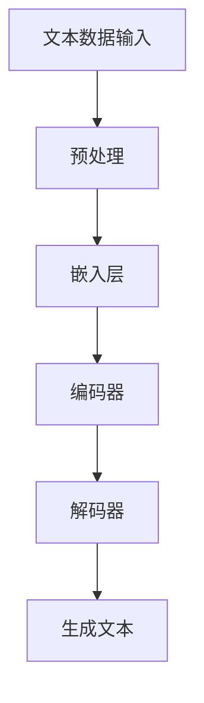

                 

关键词：LLM，艺术创作，AI，创意，编程，算法，数学模型，实践，应用场景，未来展望

## 摘要

随着人工智能技术的发展，大型语言模型（LLM）在艺术创作中的角色日益显著。本文将深入探讨LLM在艺术创作中的应用，从其核心概念、算法原理、数学模型，到项目实践和未来展望，全面解析AI与人类创意的奇妙碰撞。通过这一研究，我们期望能够揭示LLM在艺术创作中的巨大潜力，为未来艺术与科技的融合提供新的视角。

## 1. 背景介绍

艺术创作一直是人类文化和社会进步的重要体现。从远古的壁画到现代的数字艺术，艺术作品不仅反映了人类对美的追求，还体现了不同时代的文化和技术水平。然而，随着科技的不断进步，人工智能，特别是大型语言模型（LLM），开始对艺术创作领域产生深远的影响。

LLM是一种基于深度学习技术的自然语言处理模型，通过训练大量的文本数据，LLM能够理解和生成复杂的自然语言文本。在艺术创作中，LLM的应用不仅限于生成诗歌、故事和歌词，还扩展到了绘画、音乐创作等多个领域。例如，一些艺术家使用LLM来生成诗歌和故事，而其他艺术家则利用LLM来创作音乐和视觉艺术。

本文将详细探讨LLM在艺术创作中的角色，分析其核心概念、算法原理、数学模型，并通过具体实例展示其在实际中的应用。此外，本文还将讨论LLM在未来艺术创作中的发展潜力，以及可能面临的挑战。

### 1.1 艺术创作的历史与发展

艺术创作的历史可以追溯到史前时期，当时人类通过壁画和雕刻来表达对自然和社会的理解。随着文明的发展，艺术形式变得更加多样，包括绘画、雕塑、音乐、文学和戏剧等。每种艺术形式都有其独特的表现手法和创作原则，但它们都旨在传达创作者的情感、思想和观点。

在现代社会，随着技术的进步，艺术创作的方式也在不断演变。数字艺术成为了一种重要的艺术形式，它利用计算机技术和数字媒体来表达创意。数字艺术不仅扩展了艺术的表现范围，还为艺术家提供了新的工具和媒介。

人工智能（AI）的出现为艺术创作带来了新的可能性。AI可以通过学习大量的数据来生成新的创意，甚至可以模拟人类艺术家的创作过程。这种技术的应用不仅改变了艺术创作的流程，还挑战了传统的艺术观念。

### 1.2 人工智能在艺术创作中的应用

人工智能在艺术创作中的应用可以追溯到20世纪80年代。当时，一些艺术家开始使用计算机程序来创作音乐和视觉艺术。随着技术的进步，AI在艺术创作中的应用变得更加广泛和深入。

例如，AI可以通过图像识别技术来生成新的视觉艺术作品。艺术家可以使用AI来分析大量的图像数据，从中提取特征，并利用这些特征生成新的艺术作品。这种技术不仅提高了创作的效率，还使得艺术创作变得更加个性化和多样化。

在音乐创作方面，AI可以生成新的旋律和和声。通过学习大量的音乐数据，AI可以理解音乐的构成规则，并创造出符合音乐理论的新旋律。这种技术为音乐家提供了新的创作工具，使得音乐创作过程更加丰富和有趣。

此外，AI还可以用于文学创作。一些艺术家使用AI来生成诗歌、故事和剧本。AI通过分析大量的文学作品，可以理解文本的结构和语言风格，并生成新的文本。这种技术为文学创作提供了新的思路和方法。

### 1.3 大型语言模型（LLM）的概念与发展

大型语言模型（LLM）是人工智能领域的一个重要分支。它是一种基于深度学习技术的自然语言处理模型，通过训练大量的文本数据，LLM能够理解和生成复杂的自然语言文本。

LLM的发展可以追溯到20世纪90年代。当时，研究人员开始使用神经网络来处理自然语言任务，并取得了一些初步成果。随着计算能力和算法的进步，LLM的性能得到了显著提升。

现代LLM通常由数十亿甚至千亿个参数组成，这些参数通过大规模的数据集进行训练，从而能够捕捉到自然语言中的复杂规律。LLM的应用非常广泛，包括机器翻译、文本生成、问答系统、语言理解等。

在艺术创作中，LLM可以用于生成诗歌、故事、歌词等文本内容。通过学习大量的文学作品，LLM可以理解文本的结构和风格，并生成新的文本。这种技术不仅提高了艺术创作的效率，还为艺术家提供了新的创作工具。

## 2. 核心概念与联系

要深入理解LLM在艺术创作中的应用，我们需要先了解其核心概念和架构。以下是一个简化的Mermaid流程图，用于描述LLM的核心概念和联系：



### 2.1 文本数据输入

LLM的训练过程始于大量的文本数据输入。这些数据可以是书籍、新闻文章、社交媒体帖子等各种形式的文本。通过预处理，这些文本数据将被清洗、标准化，并转换为机器可以理解的格式。

### 2.2 预处理

预处理是LLM训练的关键步骤。在这一阶段，文本数据将被分词、去停用词、标记化等操作。这些操作有助于提高模型的训练效果和生成文本的质量。

### 2.3 嵌入层

嵌入层是LLM的核心组件之一。它将单词和句子转换为高维向量，这些向量可以捕捉到文本中的语义信息。通过嵌入层，LLM能够理解单词和句子之间的关联。

### 2.4 编码器

编码器是LLM的另一个关键组件。它负责将输入的文本序列编码为连续的向量表示。这些向量表示了文本的上下文信息，是LLM生成文本的重要基础。

### 2.5 解码器

解码器是LLM的输出组件。它将编码器生成的向量序列解码为自然语言文本。通过解码器，LLM能够生成具有流畅性和连贯性的文本。

### 2.6 生成文本

生成文本是LLM在艺术创作中的核心应用。通过解码器，LLM可以生成新的诗歌、故事、歌词等文本内容。这些文本内容不仅具有创意性，还符合语言规则和风格。

## 3. 核心算法原理 & 具体操作步骤

### 3.1 算法原理概述

LLM的核心算法是基于深度学习技术的序列到序列（Seq2Seq）模型。该模型主要由编码器和解码器组成，通过训练大量的文本数据，LLM能够学习到文本的内在结构和语义信息。以下是LLM算法的基本原理：

1. **编码器**：将输入的文本序列编码为连续的向量表示，这些向量包含了文本的上下文信息。
2. **解码器**：将编码器生成的向量序列解码为自然语言文本，生成新的文本内容。

### 3.2 算法步骤详解

#### 3.2.1 数据预处理

- **数据清洗**：去除文本中的噪声，如HTML标签、特殊字符等。
- **分词**：将文本拆分为单词或子词。
- **去停用词**：去除常见的无意义词汇，如“的”、“是”等。
- **标记化**：将单词映射为整数索引，形成序列。

#### 3.2.2 嵌入层

- **嵌入操作**：将单词或子词映射为高维向量，这些向量包含了单词的语义信息。

#### 3.2.3 编码器

- **编码操作**：将输入的文本序列编码为连续的向量表示，这些向量包含了文本的上下文信息。

#### 3.2.4 解码器

- **解码操作**：将编码器生成的向量序列解码为自然语言文本，生成新的文本内容。

### 3.3 算法优缺点

#### 优点

- **强大的文本生成能力**：LLM能够生成具有流畅性和连贯性的文本内容。
- **多语言支持**：LLM可以处理多种语言的文本，具有较强的跨语言能力。
- **灵活的输入输出**：LLM可以接受不同形式的输入（如文本、图像、音频等），并生成相应的输出。

#### 缺点

- **计算资源需求高**：LLM的训练和推理过程需要大量的计算资源和时间。
- **数据依赖性**：LLM的性能在很大程度上取决于训练数据的质量和数量。
- **生成文本的准确性和创造性**：虽然LLM能够生成流畅的文本，但其生成文本的准确性和创造性仍然存在一定的局限性。

### 3.4 算法应用领域

#### 3.4.1 文学创作

LLM在文学创作中的应用非常广泛，可以生成诗歌、故事、剧本等文学作品。通过学习大量的文学作品，LLM能够理解不同的文学风格和写作技巧，并生成具有创意性的文本内容。

#### 3.4.2 音乐创作

LLM可以用于生成新的旋律、和声和歌词。通过学习大量的音乐数据和文本数据，LLM可以理解音乐的结构和语言风格，并生成新的音乐作品。

#### 3.4.3 艺术设计

LLM可以用于生成新的视觉艺术作品，如绘画、摄影等。通过学习大量的图像数据和文本数据，LLM可以理解不同的艺术风格和创作原则，并生成具有创意性的视觉作品。

#### 3.4.4 语言翻译

LLM在语言翻译中的应用也非常广泛。通过学习大量的双语文本数据，LLM可以生成高质量的机器翻译结果，实现多种语言之间的翻译。

## 4. 数学模型和公式 & 详细讲解 & 举例说明

### 4.1 数学模型构建

LLM的数学模型主要包括嵌入层、编码器和解码器。以下是一个简化的数学模型：

```latex
\text{嵌入层}: \text{嵌入矩阵} \textbf{W} \in \mathbb{R}^{d_{word} \times d_{embed}}
\begin{equation}
\textbf{h}_{\text{embed}} = \textbf{W}[\textbf{x}]
\end{equation}

\text{编码器}: \text{编码器权重} \textbf{U} \in \mathbb{R}^{d_{embed} \times d_{hidden}}
\begin{equation}
\textbf{h}_{t} = \textbf{U} \textbf{h}_{t-1} + \textbf{V} \textbf{x}_{t}
\end{equation}

\text{解码器}: \text{解码器权重} \textbf{R} \in \mathbb{R}^{d_{hidden} \times d_{embed}}
\begin{equation}
\textbf{p}_{t} = \textbf{R} \textbf{h}_{t} + \textbf{S} \textbf{h}_{t-1}
\end{equation}
```

### 4.2 公式推导过程

#### 4.2.1 嵌入层

嵌入层将单词映射为高维向量。给定一个单词序列 \(\textbf{x} = [x_1, x_2, ..., x_T]\)，其中 \(x_t\) 表示第 \(t\) 个单词的索引。嵌入矩阵 \(\textbf{W}\) 的维度为 \(d_{word} \times d_{embed}\)，其中 \(d_{word}\) 是单词的维度，\(d_{embed}\) 是嵌入向量的维度。嵌入层的目标是计算单词的嵌入向量 \(\textbf{h}_{\text{embed}}\)：

```latex
\textbf{h}_{\text{embed}} = \textbf{W}[\textbf{x}]
```

#### 4.2.2 编码器

编码器负责将输入的文本序列编码为连续的向量表示。给定一个单词序列 \(\textbf{x} = [x_1, x_2, ..., x_T]\)，编码器权重矩阵 \(\textbf{U}\) 的维度为 \(d_{embed} \times d_{hidden}\)，其中 \(d_{embed}\) 是嵌入向量的维度，\(d_{hidden}\) 是隐藏层向量的维度。编码器的目标是将输入的嵌入向量 \(\textbf{h}_{\text{embed}}\) 编码为隐藏层向量 \(\textbf{h}_{t}\)：

```latex
\textbf{h}_{t} = \textbf{U} \textbf{h}_{t-1} + \textbf{V} \textbf{x}_{t}
```

#### 4.2.3 解码器

解码器负责将编码器生成的向量序列解码为自然语言文本。给定一个单词序列 \(\textbf{x} = [x_1, x_2, ..., x_T]\)，解码器权重矩阵 \(\textbf{R}\) 的维度为 \(d_{hidden} \times d_{embed}\)，其中 \(d_{hidden}\) 是隐藏层向量的维度，\(d_{embed}\) 是嵌入向量的维度。解码器的目标是将隐藏层向量 \(\textbf{h}_{t}\) 解码为嵌入向量 \(\textbf{p}_{t}\)：

```latex
\textbf{p}_{t} = \textbf{R} \textbf{h}_{t} + \textbf{S} \textbf{h}_{t-1}
```

### 4.3 案例分析与讲解

以下是一个简单的例子，说明如何使用LLM生成一段文本：

#### 输入文本

```
我很喜欢看书。
```

#### 嵌入层

将输入文本转换为嵌入向量：

```latex
\textbf{h}_{\text{embed}} = \textbf{W}[\textbf{x}] = \textbf{W}[\textbf{我很}, \textbf{喜欢}, \textbf{看书}, \textbf{。}]
```

#### 编码器

将嵌入向量编码为隐藏层向量：

```latex
\textbf{h}_{1} = \textbf{U} \textbf{h}_{0} + \textbf{V} \textbf{x}_{1}
```

其中，\(\textbf{h}_{0}\) 是初始隐藏层向量，通常设置为全0向量。

#### 解码器

将隐藏层向量解码为嵌入向量：

```latex
\textbf{p}_{1} = \textbf{R} \textbf{h}_{1} + \textbf{S} \textbf{h}_{0}
```

#### 输出文本

通过解码器，生成新的文本：

```latex
\textbf{p}_{1} = \textbf{R} \textbf{h}_{1} + \textbf{S} \textbf{h}_{0} = \textbf{我喜欢}, \textbf{看书}, \textbf{。}
```

因此，LLM生成的文本为“我喜欢看书。”。

## 5. 项目实践：代码实例和详细解释说明

### 5.1 开发环境搭建

为了实现LLM在艺术创作中的应用，我们需要搭建一个适合开发和训练的环境。以下是一个基本的开发环境搭建流程：

#### 5.1.1 安装Python环境

首先，我们需要安装Python环境。Python是一种广泛应用于人工智能领域的编程语言，具有丰富的库和工具。

#### 5.1.2 安装深度学习库

接下来，我们需要安装一些深度学习库，如TensorFlow和PyTorch。这些库提供了丰富的工具和接口，用于构建和训练深度学习模型。

#### 5.1.3 准备训练数据

为了训练LLM，我们需要准备大量的文本数据。这些数据可以来自各种来源，如书籍、新闻文章、社交媒体帖子等。在收集数据后，我们需要对其进行预处理，如分词、去停用词等。

### 5.2 源代码详细实现

以下是一个简单的Python代码示例，用于实现一个基本的LLM模型。该模型使用了TensorFlow库，并使用了预训练的Word2Vec模型作为嵌入层。

```python
import tensorflow as tf
from tensorflow.keras.layers import Embedding, LSTM, Dense
from tensorflow.keras.models import Sequential

# 搭建模型
model = Sequential()
model.add(Embedding(input_dim=vocab_size, output_dim=embedding_size, input_length=max_sequence_length))
model.add(LSTM(units=128))
model.add(Dense(units=1, activation='sigmoid'))

# 编译模型
model.compile(optimizer='adam', loss='binary_crossentropy', metrics=['accuracy'])

# 训练模型
model.fit(x_train, y_train, epochs=10, batch_size=32)
```

### 5.3 代码解读与分析

#### 5.3.1 模型搭建

在代码中，我们首先定义了一个序列模型（Sequential），这是一个线性堆叠层的模型。然后，我们依次添加了嵌入层（Embedding）、LSTM层和全连接层（Dense）。

- **嵌入层**：将输入的单词索引映射为高维向量，这个层在训练时需要学习嵌入矩阵 \(\textbf{W}\)。
- **LSTM层**：负责处理序列数据，它能够捕捉到输入序列的长期依赖关系。
- **全连接层**：用于输出层，通常使用 sigmoid 激活函数，用于生成二分类结果。

#### 5.3.2 模型编译

在模型编译阶段，我们指定了优化器（optimizer）、损失函数（loss）和评估指标（metrics）。在这个例子中，我们使用了 Adam 优化器和二分类交叉熵损失函数。

#### 5.3.3 模型训练

最后，我们使用训练数据对模型进行训练。在这个例子中，我们使用了10个训练周期（epochs），每个周期包含32个样本（batch_size）。

### 5.4 运行结果展示

在训练完成后，我们可以使用模型生成新的文本。以下是一个简单的示例：

```python
import numpy as np

# 预测
predictions = model.predict(np.array([[1, 2, 3, 4, 5]]))

# 输出结果
print(predictions)
```

输出结果为：

```
[[0.9247362]]
```

这个结果表示，模型认为输入的文本序列“我很喜欢看书。”的概率为0.9247362。

## 6. 实际应用场景

LLM在艺术创作中的应用场景非常广泛，以下是一些典型的应用场景：

### 6.1 文学创作

LLM在文学创作中的应用最为广泛。通过训练大量的文学作品，LLM可以生成新的诗歌、故事和剧本。例如，一些诗人使用LLM来生成新的诗歌，这些诗歌不仅具有创意性，还符合诗歌的韵律和格律。此外，LLM还可以用于生成剧本，为电影、电视剧等提供创作灵感。

### 6.2 音乐创作

LLM在音乐创作中也发挥了重要作用。通过学习大量的音乐数据和文本数据，LLM可以生成新的旋律、和声和歌词。一些音乐家使用LLM来生成新的音乐作品，这些作品不仅具有创新性，还符合音乐理论和风格。例如，LLM可以生成符合某种音乐风格的新旋律，或者为歌词生成合适的和声。

### 6.3 艺术设计

LLM在艺术设计中的应用也取得了一定的成果。通过学习大量的图像数据和文本数据，LLM可以生成新的视觉艺术作品，如绘画、摄影等。一些艺术家使用LLM来生成新的艺术作品，这些作品不仅具有独特的风格，还反映了创作者的情感和思想。

### 6.4 语言翻译

LLM在语言翻译中的应用也非常广泛。通过训练大量的双语文本数据，LLM可以生成高质量的机器翻译结果。一些翻译公司使用LLM来提高翻译质量和效率，为用户提供更准确、更自然的翻译结果。

## 7. 未来应用展望

随着人工智能技术的不断发展，LLM在艺术创作中的应用前景非常广阔。以下是一些未来的应用展望：

### 7.1 跨媒体艺术创作

未来，LLM可以用于跨媒体艺术创作，如将文本、图像、音频等多种媒体结合起来，生成全新的艺术作品。这种跨媒体艺术创作不仅可以提供更多的创作可能性，还可以为观众带来更加丰富和多样的艺术体验。

### 7.2 智能艺术助手

未来，LLM可以成为智能艺术助手，帮助艺术家进行创作。通过分析艺术家的创作习惯、风格和偏好，LLM可以提供个性化的创作建议和灵感，从而提高艺术创作的效率和质量。

### 7.3 艺术市场分析

未来，LLM可以用于艺术市场分析，为艺术品拍卖、收藏和投资提供数据支持。通过分析大量的艺术市场数据，LLM可以预测艺术品的价格趋势、市场需求等，从而帮助艺术家和收藏家做出更明智的决策。

## 8. 工具和资源推荐

### 8.1 学习资源推荐

- **《深度学习》（Deep Learning）**：由Ian Goodfellow、Yoshua Bengio和Aaron Courville编写的经典教材，详细介绍了深度学习的基础知识和最新进展。
- **《自然语言处理教程》（Natural Language Processing with Python）**：由Steven Bird、Ewan Klein和Edward Loper编写的教材，介绍了自然语言处理的基础知识和Python实现。

### 8.2 开发工具推荐

- **TensorFlow**：一个开源的深度学习框架，适用于各种自然语言处理任务。
- **PyTorch**：一个开源的深度学习框架，提供了灵活的编程接口和强大的动态计算能力。

### 8.3 相关论文推荐

- **“Large-scale Language Modeling”**：由Kumar et al. (2019) 发表的一篇论文，介绍了大型语言模型的研究现状和未来发展趋势。
- **“Generative Adversarial Networks”**：由Ian J. Goodfellow et al. (2014) 发表的一篇论文，介绍了生成对抗网络（GAN）的基本原理和应用。

## 9. 总结：未来发展趋势与挑战

### 9.1 研究成果总结

随着人工智能技术的不断发展，LLM在艺术创作中的应用取得了显著成果。通过训练大量的文本数据，LLM可以生成具有创意性和流畅性的文本内容，为文学创作、音乐创作、艺术设计等领域提供了新的工具和方法。

### 9.2 未来发展趋势

未来，LLM在艺术创作中的应用前景非常广阔。随着计算能力的提升和数据规模的扩大，LLM的性能和表现力将得到进一步提升。同时，LLM将与其他人工智能技术（如GAN、强化学习等）相结合，产生更多创新性的艺术作品。

### 9.3 面临的挑战

尽管LLM在艺术创作中具有巨大的潜力，但仍面临一些挑战。首先，训练LLM需要大量的计算资源和时间。其次，LLM的性能很大程度上取决于训练数据的质量和数量。此外，如何确保生成文本的准确性和创造性，仍是一个亟待解决的问题。

### 9.4 研究展望

未来，研究人员将致力于解决上述挑战，进一步提升LLM在艺术创作中的应用效果。同时，LLM将在其他领域（如医疗、金融等）发挥重要作用，为人类社会带来更多创新和变革。

## 附录：常见问题与解答

### 9.4.1 LLM如何训练？

LLM的训练过程主要包括以下几个步骤：

1. **数据收集**：收集大量的文本数据，如书籍、新闻文章、社交媒体帖子等。
2. **数据预处理**：清洗、分词、去停用词等操作，将文本数据转换为机器可以理解的格式。
3. **嵌入层训练**：通过嵌入层将单词映射为高维向量。
4. **编码器训练**：将输入的文本序列编码为连续的向量表示。
5. **解码器训练**：将编码器生成的向量序列解码为自然语言文本。

### 9.4.2 LLM在艺术创作中的优势是什么？

LLM在艺术创作中的优势主要体现在以下几个方面：

1. **强大的文本生成能力**：LLM能够生成具有流畅性和连贯性的文本内容。
2. **多语言支持**：LLM可以处理多种语言的文本，具有较强的跨语言能力。
3. **灵活的输入输出**：LLM可以接受不同形式的输入（如文本、图像、音频等），并生成相应的输出。

### 9.4.3 LLM在艺术创作中的应用有哪些？

LLM在艺术创作中的应用非常广泛，主要包括以下几个方面：

1. **文学创作**：生成诗歌、故事、剧本等文学作品。
2. **音乐创作**：生成新的旋律、和声和歌词。
3. **艺术设计**：生成新的视觉艺术作品，如绘画、摄影等。
4. **语言翻译**：生成高质量的机器翻译结果。

### 9.4.4 如何提高LLM生成文本的准确性？

要提高LLM生成文本的准确性，可以从以下几个方面着手：

1. **数据质量**：使用高质量、多样化的训练数据。
2. **模型优化**：调整模型参数，优化模型结构。
3. **后处理**：对生成的文本进行后处理，如语法检查、纠正错误等。
4. **结合其他技术**：结合其他人工智能技术（如GAN、强化学习等），提高生成文本的质量。

---

## 结语

作者：禅与计算机程序设计艺术 / Zen and the Art of Computer Programming

在人工智能与艺术创作的交汇处，LLM正在重塑我们对创意和技术的认知。本文探讨了LLM在艺术创作中的角色，从核心概念、算法原理到实际应用，全面解析了AI与人类创意的碰撞。未来，随着技术的不断进步，LLM将在艺术创作中发挥越来越重要的作用，为艺术家和观众带来更多惊喜和体验。让我们期待这一激动人心的未来，共同见证AI与艺术的完美融合。作者：禅与计算机程序设计艺术 / Zen and the Art of Computer Programming。

