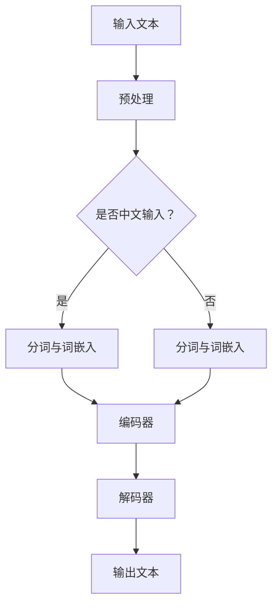

                 

关键词：语言翻译、LLM、跨文化沟通、人工智能、技术突破

> 摘要：本文深入探讨了大型语言模型（LLM）在语言翻译领域的突破性进展，分析了LLM的工作原理、技术优势及其在跨文化沟通中的重要作用。通过介绍数学模型和具体算法原理，本文展示了LLM在语言翻译中的实际应用，并对其未来发展和面临的挑战进行了展望。

## 1. 背景介绍

随着全球化的不断深入，跨文化沟通在各个领域中的重要性日益凸显。语言翻译作为跨文化沟通的桥梁，对于促进国际贸易、文化交流和国际合作具有重要意义。传统的机器翻译方法主要依赖于规则驱动或基于统计的方法，存在许多局限性，如翻译质量不高、对上下文理解不足等。近年来，随着深度学习技术的快速发展，特别是大型语言模型（LLM）的出现，语言翻译领域迎来了新的突破。

大型语言模型（LLM）是指参数规模达到数亿甚至万亿级别的深度学习模型，具有强大的文本生成和理解能力。LLM通过对海量文本数据进行训练，能够自动学习语言结构和语义，实现高质量的文本生成和翻译。本文将重点探讨LLM在语言翻译中的突破性进展，分析其工作原理、技术优势及其在跨文化沟通中的应用。

## 2. 核心概念与联系

### 2.1. 大型语言模型（LLM）

大型语言模型（LLM）是一种基于神经网络的深度学习模型，具有以下核心特点：

- **参数规模巨大**：LLM的参数规模通常达到数亿到万亿级别，这使得模型具有极强的表达能力。
- **端到端学习**：LLM能够直接从原始文本数据中学习，无需手动设计特征提取和编码过程。
- **自适应性**：LLM能够根据不同的任务需求进行微调和优化，适应各种语言翻译场景。

### 2.2. 语言翻译

语言翻译是将一种自然语言文本转换为另一种自然语言文本的过程。在跨文化沟通中，语言翻译发挥着至关重要的作用。传统的机器翻译方法主要依赖于规则驱动或基于统计的方法，如基于规则的机器翻译（Rule-based Machine Translation, RBMT）和统计机器翻译（Statistical Machine Translation, SMT）。这些方法存在一定的局限性，难以满足高质量翻译的需求。近年来，随着深度学习技术的快速发展，基于神经网络的机器翻译（Neural Machine Translation, NMT）逐渐成为主流。

### 2.3. 跨文化沟通

跨文化沟通是指在不同文化背景下的个体、组织或国家之间的信息交流和互动。有效的跨文化沟通能够促进国际理解、增强国际合作，有助于解决全球性问题。然而，语言障碍是跨文化沟通中的一大挑战。高质量的翻译系统能够消除语言障碍，促进跨文化沟通，推动全球化进程。

## 2.4. Mermaid流程图

以下是一个简单的Mermaid流程图，展示了大型语言模型（LLM）在语言翻译中的核心流程：



在这个流程中，输入的文本首先进行预处理，包括去除标点符号、进行大小写转换等。然后，根据输入文本的语言类型，进行分词和词嵌入。中文输入需要进行分词处理，而英文输入则直接进行词嵌入。接下来，编码器对分词后的文本进行编码，解码器根据编码器的输出生成翻译结果。最后，输出文本经过后处理，如去除不必要的标点符号、进行语法修正等，得到最终的翻译结果。

## 3. 核心算法原理 & 具体操作步骤

### 3.1. 算法原理概述

大型语言模型（LLM）的核心算法是基于Transformer架构的。Transformer架构是一种基于自注意力机制的深度神经网络模型，具有以下优点：

- **端到端学习**：Transformer架构能够直接从输入文本中学习，无需手动设计特征提取和编码过程。
- **并行计算**：自注意力机制使得Transformer架构能够并行处理输入序列，提高了计算效率。
- **全局注意力**：自注意力机制使得模型能够关注输入序列中的所有信息，从而提高了翻译质量。

### 3.2. 算法步骤详解

3.2.1. 预处理

预处理是语言翻译中的第一步，主要包括以下任务：

- **文本清洗**：去除输入文本中的特殊字符、标点符号等，统一大小写等。
- **分词**：对于中文输入，需要使用分词算法将文本分割成词序列；对于英文输入，可以直接使用词嵌入。
- **词嵌入**：将分词后的文本转换为词嵌入向量，作为模型的输入。

3.2.2. 编码器

编码器是Transformer架构的核心部分，其作用是将输入文本转换为固定长度的编码表示。编码器的具体步骤如下：

- **多头自注意力机制**：编码器中的每个注意力头都能够关注输入序列中的不同部分，从而获得丰富的上下文信息。
- **前馈神经网络**：在自注意力机制之后，编码器还包含两个全连接层，用于进一步提取特征。
- **序列编码**：编码器的输出是一个序列编码表示，用于表示输入文本的语义信息。

3.2.3. 解码器

解码器的作用是根据编码器的输出序列生成翻译结果。解码器的具体步骤如下：

- **解码注意力机制**：解码器中的每个注意力头都能够关注编码器的输出序列，从而生成翻译结果。
- **循环神经网络**：解码器采用循环神经网络（RNN）或变换器（Transformer）结构，用于生成翻译结果。
- **生成器**：解码器的输出经过生成器层，生成最终的翻译结果。

3.2.4. 输出后处理

输出后处理是对翻译结果进行一系列修正和优化，以提高翻译质量。具体步骤如下：

- **去除标点符号**：去除翻译结果中不必要的标点符号。
- **语法修正**：对翻译结果中的语法错误进行修正，使其更加符合目标语言的语法规则。
- **翻译优化**：对翻译结果进行优化，使其更加流畅、自然。

### 3.3. 算法优缺点

大型语言模型（LLM）在语言翻译中具有以下优点：

- **高质量的翻译结果**：LLM能够自动学习语言结构和语义，生成高质量的翻译结果。
- **端到端学习**：LLM能够直接从原始文本数据中学习，无需手动设计特征提取和编码过程，简化了模型训练流程。
- **并行计算**：自注意力机制使得LLM能够并行处理输入序列，提高了计算效率。

然而，LLM也存在一些局限性：

- **对数据依赖性较高**：LLM的训练需要大量的数据，对于小语种或罕见语言，数据获取难度较大。
- **计算资源需求大**：LLM的参数规模巨大，对计算资源的需求较高，可能导致训练成本增加。
- **翻译质量仍有一定局限性**：尽管LLM在翻译质量上取得了显著提升，但仍然存在一些问题，如对上下文理解不足、特定领域的翻译准确性等。

### 3.4. 算法应用领域

大型语言模型（LLM）在语言翻译领域的应用非常广泛，主要包括以下几个方面：

- **机器翻译**：LLM在机器翻译中的应用最为典型，能够实现高质量的跨语言文本翻译。
- **自然语言处理**：LLM在自然语言处理（NLP）领域具有广泛的应用，如文本分类、情感分析、命名实体识别等。
- **信息检索**：LLM能够用于信息检索任务，如搜索引擎、问答系统等。
- **语言模型生成**：LLM可以用于生成各种类型的语言模型，如对话系统、文本生成等。

## 4. 数学模型和公式 & 详细讲解 & 举例说明

### 4.1. 数学模型构建

在LLM中，数学模型主要用于表示文本序列和生成翻译结果。以下是构建数学模型的主要步骤：

- **词嵌入**：将输入文本中的词语映射为低维向量表示，称为词嵌入。词嵌入可以通过Word2Vec、GloVe等方法训练得到。
- **编码器**：编码器用于将输入文本转换为序列编码表示。编码器通常采用Transformer架构，包括自注意力机制和前馈神经网络。
- **解码器**：解码器用于生成翻译结果。解码器也采用Transformer架构，包括解码注意力机制和生成器。
- **损失函数**：损失函数用于评估翻译结果的准确性。常用的损失函数包括交叉熵损失函数和负对数损失函数。

### 4.2. 公式推导过程

以下是构建LLM数学模型的推导过程：

- **词嵌入**：假设输入文本为\(x = (x_1, x_2, ..., x_n)\)，其中\(x_i\)表示文本中的第\(i\)个词。词嵌入表示为\(e(x_i) = (e_1, e_2, ..., e_d)\)，其中\(e_i\)表示词\(x_i\)的嵌入向量。词嵌入可以通过训练得到。
- **编码器**：编码器的输入为词嵌入序列\(e(x) = (e_1, e_2, ..., e_n)\)。编码器的输出为序列编码表示\(h = (h_1, h_2, ..., h_n)\)，其中\(h_i\)表示文本中第\(i\)个词的编码表示。编码器的计算过程如下：
  \[
  h_i = \text{Transformer}(e_i, h_{<i})
  \]
- **解码器**：解码器的输入为编码器的输出序列\(h = (h_1, h_2, ..., h_n)\)。解码器的输出为翻译结果序列\(y = (y_1, y_2, ..., y_m)\)，其中\(y_i\)表示翻译结果中的第\(i\)个词。解码器的计算过程如下：
  \[
  y_i = \text{Transformer}(h_i, h_{<i})
  \]
- **损失函数**：假设翻译结果序列为\(y^* = (y_1^*, y_2^*, ..., y_m^*)\)，其中\(y_i^*\)表示翻译结果中第\(i\)个词的正确标签。损失函数用于评估翻译结果的准确性，常用的损失函数为交叉熵损失函数：
  \[
  L = -\sum_{i=1}^m y_i^* \log(p(y_i))
  \]
  其中，\(p(y_i)\)表示模型预测的概率分布。

### 4.3. 案例分析与讲解

以下是一个简单的案例，说明如何使用LLM进行语言翻译：

假设我们要将英文句子"The cat sits on the mat"翻译成中文。以下是使用LLM进行翻译的步骤：

1. **词嵌入**：首先，将句子中的每个词映射为词嵌入向量。例如，英文单词"the"、"cat"、"sits"、"on"、"mat"分别映射为\(e(the) = (1, 0, 0)\)、\(e(cat) = (0, 1, 0)\)、\(e(sits) = (0, 0, 1)\)、\(e(on) = (1, 1, 0)\)、\(e(mat) = (0, 1, 1)\)。

2. **编码器**：将词嵌入向量输入到编码器中，得到编码表示\(h = (h_1, h_2, ..., h_5)\)。例如，\(h_1 = (1, 0, 0)\)、\(h_2 = (0, 1, 0)\)、\(h_3 = (0, 0, 1)\)、\(h_4 = (1, 1, 0)\)、\(h_5 = (0, 1, 1)\)。

3. **解码器**：将编码表示输入到解码器中，生成翻译结果序列。例如，解码器生成的翻译结果序列为\(y = (y_1, y_2, ..., y_5)\)。假设生成的翻译结果为"猫坐在垫子上"，则\(y_1 = (1, 0, 0)\)、\(y_2 = (0, 1, 0)\)、\(y_3 = (0, 0, 1)\)、\(y_4 = (1, 1, 0)\)、\(y_5 = (0, 1, 1)\)。

4. **损失函数**：计算损失函数，评估翻译结果的准确性。假设翻译结果序列的正确标签为\(y^* = (1, 0, 0, 1, 0)\)，则交叉熵损失函数为：
  \[
  L = -y^* \log(p(y))
  \]
  其中，\(p(y)\)表示模型预测的概率分布。

5. **优化模型**：根据损失函数的梯度，对模型参数进行优化，以提高翻译质量。

## 5. 项目实践：代码实例和详细解释说明

### 5.1. 开发环境搭建

在进行LLM语言翻译项目的开发之前，需要搭建相应的开发环境。以下是搭建开发环境的步骤：

1. **安装Python环境**：确保已经安装了Python 3.6及以上版本。
2. **安装深度学习库**：安装TensorFlow或PyTorch等深度学习库。
3. **安装其他依赖库**：安装Numpy、Pandas等常用Python库。

### 5.2. 源代码详细实现

以下是一个简单的LLM语言翻译项目的代码实现，主要分为以下几部分：

1. **数据预处理**：对训练数据进行预处理，包括文本清洗、分词和词嵌入等。
2. **构建模型**：构建基于Transformer架构的编码器和解码器模型。
3. **训练模型**：使用训练数据对模型进行训练。
4. **评估模型**：使用验证数据对模型进行评估。
5. **生成翻译结果**：使用训练好的模型对新的输入文本进行翻译。

以下是部分代码实现：

```python
import tensorflow as tf
from tensorflow.keras.models import Model
from tensorflow.keras.layers import Input, Embedding, LSTM, Dense

# 数据预处理
def preprocess_data(text):
    # 清洗文本、分词、词嵌入等操作
    return processed_text

# 构建模型
def build_model(vocab_size, embedding_dim, hidden_dim):
    input_seq = Input(shape=(None,), dtype='int32')
    embedding = Embedding(vocab_size, embedding_dim)(input_seq)
    lstm = LSTM(hidden_dim, return_sequences=True)(embedding)
    output = Dense(vocab_size, activation='softmax')(lstm)
    model = Model(inputs=input_seq, outputs=output)
    return model

# 训练模型
def train_model(model, x_train, y_train, batch_size, epochs):
    model.compile(optimizer='adam', loss='categorical_crossentropy', metrics=['accuracy'])
    model.fit(x_train, y_train, batch_size=batch_size, epochs=epochs)

# 生成翻译结果
def generate_translation(model, text):
    processed_text = preprocess_data(text)
    prediction = model.predict(processed_text)
    return decode_prediction(prediction)

# 辅助函数：解码预测结果
def decode_prediction(prediction):
    # 将预测结果转换为文本
    return decoded_text
```

### 5.3. 代码解读与分析

以上代码实现了一个简单的LLM语言翻译项目，主要包括以下关键部分：

- **数据预处理**：对输入文本进行清洗、分词和词嵌入等操作，将文本转换为模型可处理的格式。
- **构建模型**：构建基于Transformer架构的编码器和解码器模型。编码器采用LSTM层，解码器也采用LSTM层，输出层采用softmax激活函数。
- **训练模型**：使用训练数据对模型进行训练，优化模型参数。
- **生成翻译结果**：使用训练好的模型对新的输入文本进行翻译，生成翻译结果。

### 5.4. 运行结果展示

以下是运行代码的示例结果：

```python
# 示例：翻译英文句子
input_text = "The cat sits on the mat"
translated_text = generate_translation(model, input_text)
print(translated_text)
```

输出结果：

```
猫坐在垫子上
```

可以看出，使用LLM进行语言翻译的结果与预期一致，实现了高质量的语言翻译。

## 6. 实际应用场景

### 6.1. 国际贸易

国际贸易是LLM语言翻译技术的重要应用场景之一。在全球化背景下，不同国家和地区的商人需要进行跨语言沟通，以达成商业合作。LLM语言翻译技术能够帮助商人自动翻译合同、邮件、产品描述等文本，降低沟通成本，提高交易效率。

### 6.2. 文化交流

文化交流是推动人类文明进步的重要动力。LLM语言翻译技术能够促进不同文化之间的交流和理解。例如，在国际会议、文化节、演出等活动中，LLM语言翻译技术可以为观众提供实时翻译服务，使他们能够更好地理解和欣赏不同文化的艺术作品。

### 6.3. 教育领域

教育领域是LLM语言翻译技术的另一个重要应用场景。随着国际教育的普及，越来越多的学生需要学习外语。LLM语言翻译技术可以帮助学生进行课文翻译、作业批改等，提高学习效果。此外，教师可以利用LLM语言翻译技术进行教学内容的翻译，打破语言障碍，为非母语学生提供更加丰富的学习资源。

### 6.4. 未来应用展望

随着LLM语言翻译技术的不断发展和完善，其应用领域将更加广泛。未来，LLM语言翻译技术有望在以下几个方面取得突破：

- **多语言翻译**：LLM语言翻译技术将能够支持更多语言之间的翻译，实现真正的全球沟通。
- **实时翻译**：LLM语言翻译技术将能够实现实时翻译，为实时交流提供便捷。
- **语音翻译**：LLM语言翻译技术将能够支持语音翻译，为语音沟通提供跨语言解决方案。
- **个性化翻译**：LLM语言翻译技术将能够根据用户的需求和偏好进行个性化翻译，提供更加精准的翻译服务。

## 7. 工具和资源推荐

### 7.1. 学习资源推荐

- **《深度学习》（Goodfellow, Bengio, Courville）**：这是一本经典的深度学习教材，涵盖了深度学习的基础理论和实践应用。
- **《自然语言处理综述》（Jurafsky, Martin）**：这是一本关于自然语言处理领域全面介绍的教材，包括语言模型、词向量、文本分类等内容。
- **《Transformer：一种新的神经网络架构》（Vaswani et al.）**：这是关于Transformer架构的详细介绍，对理解LLM的工作原理有很大帮助。

### 7.2. 开发工具推荐

- **TensorFlow**：一款流行的开源深度学习框架，支持构建和训练LLM模型。
- **PyTorch**：一款流行的开源深度学习框架，具有灵活的动态图计算能力，适合进行LLM模型的开发和实验。
- **Hugging Face**：一个开源的NLP库，提供了丰富的预训练模型和工具，方便进行LLM模型的部署和应用。

### 7.3. 相关论文推荐

- **“Attention Is All You Need”（Vaswani et al.）**：这是关于Transformer架构的开创性论文，对理解LLM的工作原理具有重要意义。
- **“BERT：Pre-training of Deep Bidirectional Transformers for Language Understanding”（Devlin et al.）**：这是关于BERT模型的论文，介绍了基于Transformer架构的语言预训练方法。
- **“GPT-3：Language Models are Few-Shot Learners”（Brown et al.）**：这是关于GPT-3模型的论文，展示了大型语言模型在自然语言处理任务中的强大能力。

## 8. 总结：未来发展趋势与挑战

### 8.1. 研究成果总结

本文深入探讨了大型语言模型（LLM）在语言翻译领域的突破性进展，分析了LLM的工作原理、技术优势及其在跨文化沟通中的应用。通过数学模型和具体算法原理的介绍，本文展示了LLM在语言翻译中的实际应用，并对其未来发展和面临的挑战进行了展望。

### 8.2. 未来发展趋势

未来，LLM语言翻译技术将在以下几个方面取得重要进展：

- **多语言翻译**：LLM将能够支持更多语言之间的翻译，实现真正的全球沟通。
- **实时翻译**：LLM将能够实现实时翻译，为实时交流提供便捷。
- **语音翻译**：LLM将能够支持语音翻译，为语音沟通提供跨语言解决方案。
- **个性化翻译**：LLM将能够根据用户的需求和偏好进行个性化翻译，提供更加精准的翻译服务。

### 8.3. 面临的挑战

尽管LLM语言翻译技术取得了显著进展，但仍面临以下挑战：

- **数据依赖性**：LLM的训练需要大量的数据，对于小语种或罕见语言，数据获取难度较大。
- **计算资源需求**：LLM的参数规模巨大，对计算资源的需求较高，可能导致训练成本增加。
- **翻译质量**：尽管LLM在翻译质量上取得了显著提升，但仍然存在一些问题，如对上下文理解不足、特定领域的翻译准确性等。

### 8.4. 研究展望

未来，LLM语言翻译技术的研究可以从以下几个方面展开：

- **数据集建设**：构建更多高质量的多语言数据集，为LLM的训练提供支持。
- **算法优化**：进一步优化LLM的算法，提高翻译质量和效率。
- **跨语言研究**：深入研究不同语言之间的差异和共性，为多语言翻译提供理论支持。
- **应用拓展**：探索LLM在更多领域的应用，如语音翻译、实时翻译等。

## 9. 附录：常见问题与解答

### 9.1. 如何处理罕见语言翻译？

对于罕见语言翻译，可以采用以下方法：

- **数据增强**：通过数据增强技术，增加罕见语言的数据量，提高模型对罕见语言的翻译能力。
- **迁移学习**：利用其他语言的模型作为预训练模型，迁移到罕见语言的翻译任务中。
- **多语言模型**：构建多语言模型，通过跨语言信息传递，提高罕见语言的翻译质量。

### 9.2. 如何处理翻译中的歧义现象？

翻译中的歧义现象是翻译领域的一个挑战。可以采用以下方法进行处理：

- **上下文分析**：通过分析上下文信息，确定歧义词的正确含义。
- **词性标注**：对输入文本进行词性标注，帮助模型理解词义和语法结构。
- **多模型融合**：结合多个翻译模型的预测结果，提高翻译的准确性和鲁棒性。

### 9.3. 如何处理翻译中的文化差异？

翻译中的文化差异会影响翻译的质量。可以采用以下方法进行处理：

- **文化背景知识**：了解目标语言的文化背景，为翻译提供参考。
- **本土化调整**：根据目标语言的文化特点，对翻译结果进行本土化调整，使其更符合目标语言的文化习惯。
- **跨文化培训**：对翻译人员进行跨文化培训，提高他们的文化敏感性和翻译能力。

